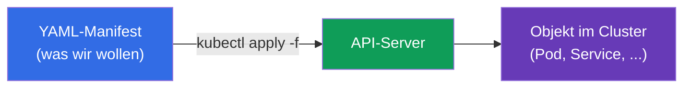
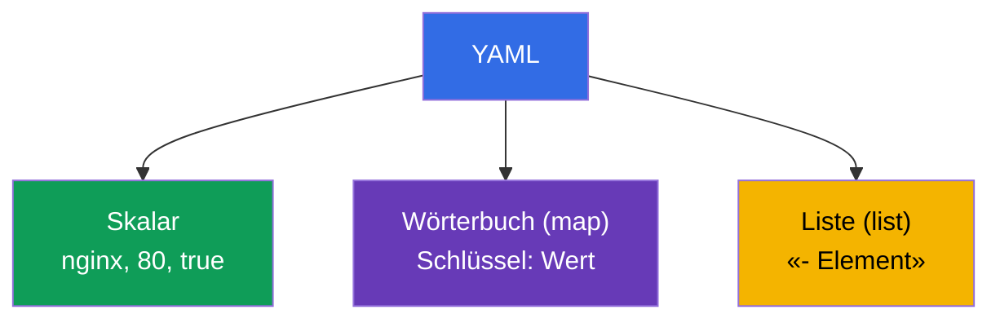
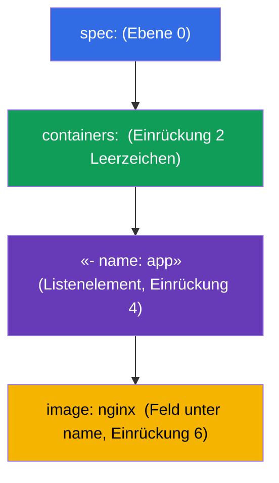
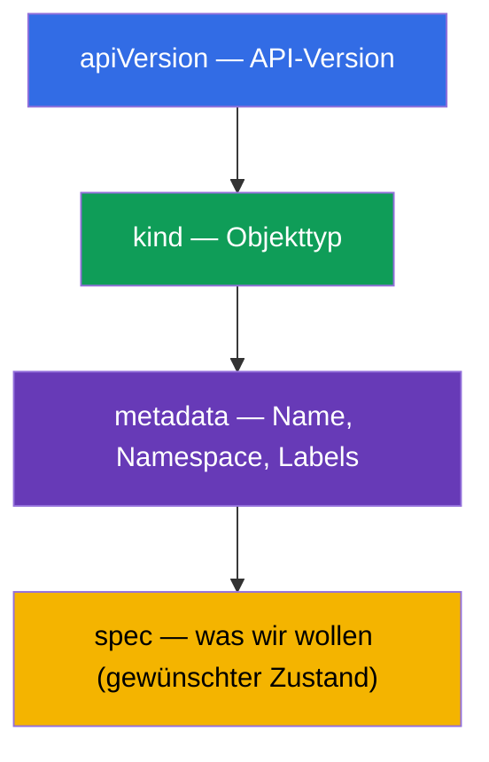

[Русская версия](ru.md) · [Eng version](README.md) · [Versión en español](es.md) · [Version française](fr.md) · [ქართული ვერსია](ge.md)

# Kapitel 0.6. YAML von Grund auf: Einrückung, Listen, Wörterbücher und Kubernetes-Manifeste

> **Für wen dieses Kapitel ist.** Teil 0, das Fundament. Alles in Kubernetes wird in
> **YAML** beschrieben: Pods, Deployment, Service, ConfigMap sind YAML-Manifeste. Wenn
> Sie die Verschachtelung anhand der Einrückung sicher lesen und eine Liste von einem
> Wörterbuch unterscheiden - gehen Sie weiter zu Kapitel 0.7. Wenn YAML für Sie aber
> „ein Haufen Leerzeichen ist, in dem ständig etwas kaputtgeht“ - beseitigt dieses
> Kapitel die Hauptbarriere des Einsteigers bei der CKAD: Die meisten Fehler in
> Manifesten sind nicht Kubernetes, sondern falsche Einrückung oder eine verwechselte
> Liste/ein verwechseltes Wörterbuch.

## 0.6.1. Warum YAML und was das ist

**YAML** ist ein menschenlesbares Format zur Beschreibung von Daten. Kubernetes nimmt
Manifeste in YAML entgegen (und in JSON, aber fast immer schreibt man YAML). Die Idee:
Sie beschreiben **deklarativ** den gewünschten Zustand eines Objekts, und der Cluster
erstellt es.



## 0.6.2. Die drei Säulen von YAML: Skalare, Wörterbücher, Listen

YAML wird aus drei Dingen aufgebaut:

- **Skalar** - ein einfacher Wert: Zeichenkette, Zahl, Boolescher Wert (`nginx`, `80`,
  `true`).
- **Wörterbuch (map)** - Paare `Schlüssel: Wert` (achten Sie auf das **Leerzeichen**
  nach dem Doppelpunkt).
- **Liste (list)** - Elemente, jedes mit einem Bindestrich `-`.

```yaml
# Wörterbuch: Schlüssel-Wert-Paare
name: web
replicas: 3
enabled: true

# Liste einfacher Werte
ports:
  - 80
  - 443

# Liste von Wörterbüchern (häufiger Fall in Kubernetes)
containers:
  - name: app
    image: nginx
  - name: sidecar
    image: busybox
```



## 0.6.3. Einrückung ist die Struktur (die Hauptregel)

In YAML wird **die Verschachtelung durch Einrückung mit Leerzeichen** festgelegt, nicht
durch Klammern. Das ist die Quelle fast aller Einsteigerfehler.

Eiserne Regeln:

- **Nur Leerzeichen, niemals Tabs.** Ein Tab = Parse-Fehler.
- Üblicherweise **2 Leerzeichen** pro Verschachtelungsebene (so ist es in Kubernetes
  üblich).
- Elemente derselben Ebene sind **gleich** ausgerichtet.

```yaml
spec:
  containers:        # 2 Leerzeichen rechts von spec
    - name: app      # Listenelement innerhalb von containers
      image: nginx   # Felder des Elements unter name ausgerichtet
```



> **Falle Nr. 1.** Verschieben Sie eine Zeile um ein Leerzeichen - und das Feld
> „wandert“ in das falsche Objekt. Kubernetes lehnt das Manifest entweder ab oder
> (schlimmer) erstellt etwas anderes, als Sie gemeint haben.

## 0.6.4. Liste gegen Wörterbuch: wo `-` steht und wo nicht

Die häufigste Verwechslung. Die Regel ist einfach:

- wenn unter einem Schlüssel **mehrere gleichartige Elemente** stehen - ist es eine
  **Liste**, jedes mit `-`;
- wenn unter einem Schlüssel **ein Satz benannter Felder** steht - ist es ein
  **Wörterbuch**, ohne `-`.

```yaml
# containers - LISTE (es kann viele Container geben) → mit Bindestrichen
containers:
  - name: app
    image: nginx

# resources - WÖRTERBUCH (benannte Felder) → ohne Bindestriche
resources:
  requests:
    cpu: 100m
    memory: 64Mi
```

`env` ist ein anschaulicher Fall: es ist eine **Liste von Wörterbüchern**, jede Variable
ein eigenes Element mit den Feldern `name`/`value`:

```yaml
env:
  - name: APP_COLOR
    value: blue
  - name: APP_MODE
    value: prod
```

## 0.6.5. Die Anatomie eines beliebigen Kubernetes-Manifests

Fast jedes Kubernetes-Objekt hat dieselben vier Felder der obersten Ebene:

```yaml
apiVersion: v1          # API-Version (welche "Sprache" des Objekts)
kind: Pod               # Objekttyp
metadata:               # Name, Namespace, Labels
  name: web
  labels:
    app: web
spec:                   # gewünschter Zustand (der größte Teil)
  containers:
    - name: web
      image: nginx:1.27
      ports:
        - containerPort: 80
```



Wenn Sie sich diese vier gemerkt haben (`apiVersion`, `kind`, `metadata`, `spec`),
erkennen Sie die Struktur eines beliebigen Manifests - nur der Inhalt von `spec` ändert
sich.

## 0.6.6. Mehrere Objekte in einer Datei: `---`

Der Trenner `---` erlaubt es, mehrere Objekte in einer Datei zu beschreiben (zum
Beispiel PV + PVC + Pod auf einmal):

```yaml
apiVersion: v1
kind: ConfigMap
metadata:
  name: cfg
data:
  color: blue
---
apiVersion: v1
kind: Pod
metadata:
  name: web
spec:
  containers:
    - name: web
      image: nginx
```

`kubectl apply -f file.yaml` erstellt beide Objekte. Das ist praktisch für Übungen und
die Prüfung, wo zusammengehörige Ressourcen zusammengehalten werden.

## 0.6.7. Nicht von Grund auf schreiben: Generierung und Prüfung

In der Prüfung wird YAML **nicht von Hand getippt** - es wird imperativ generiert und
angepasst:

```bash
# ein Manifest-Gerüst generieren, ohne ein Objekt zu erstellen
kubectl run web --image=nginx --dry-run=client -o yaml > pod.yaml

# ein Deployment-Gerüst erstellen
kubectl create deployment api --image=nginx --dry-run=client -o yaml > dep.yaml

# anwenden und prüfen
kubectl apply -f pod.yaml
kubectl explain pod.spec.containers   # welche Felder es überhaupt gibt
```

Nützliche Gewohnheiten:
- `--dry-run=client -o yaml` - der goldene Trick: ein schnelles Gerüst ohne manuelle
  Einrückung.
- `kubectl explain <Pfad>` - Hilfe zu den Feldern eines Objekts direkt aus dem Cluster.
- bei einem apply-Fehler lesen Sie die Meldung: sie weist auf die Zeile/das Feld mit dem
  Problem hin.

## 0.6.8. Wie das in der Produktion angewendet wird

- **GitOps und Versionierung.** Manifeste werden in Git gehalten; Änderungen durchlaufen
  ein Review und werden automatisch ausgerollt (Argo CD, Flux). YAML ist der
  „Quellcode“ der Infrastruktur.
- **Templating.** Gleichartige Manifeste für verschiedene Umgebungen werden nicht
  kopiert, sondern von Helm (Kapitel 42) oder Kustomize (Kapitel 43) generiert - um YAML
  nicht von Hand zu vervielfältigen.
- **Validierung vor dem Anwenden.** In der CI werden Manifeste mit Lintern und
  `kubectl apply --dry-run=server` geprüft, um Einrückungs- und Schemafehler vor dem
  Cluster abzufangen.
- **Lesbarkeit ist wichtiger als Kürze.** Verständliche Namen, Labels und Kommentare im
  YAML - das ist es, was eine wartbare Konfiguration von „Magie, die man sich nicht
  anzufassen traut“ unterscheidet.

## 0.6.9. Mini-Glossar

- **YAML** - ein menschenlesbares Format zur Beschreibung von Daten; die Hauptsprache
  der Manifeste.
- **Skalar** - ein einfacher Wert (Zeichenkette, Zahl, Boolescher Wert).
- **Wörterbuch (map)** - ein Satz von Paaren `Schlüssel: Wert`.
- **Liste (list)** - eine Folge von Elementen, jedes mit `-`.
- **Einrückung** - Leerzeichen, die die Verschachtelung festlegen (nur Leerzeichen,
  üblicherweise 2).
- **apiVersion / kind / metadata / spec** - die vier Felder der obersten Ebene jedes
  Objekts.
- **`---`** - ein Trenner mehrerer Objekte in einer Datei.
- **`--dry-run=client -o yaml`** - ein Manifest generieren, ohne ein Objekt zu erstellen.
- **`kubectl explain`** - Hilfe zu den Feldern eines Objekts.

## 0.6.10. Zusammenfassung des Kapitels

- YAML beschreibt den gewünschten Zustand von Objekten; `kubectl apply -f` erstellt sie
  im Cluster.
- Drei Säulen: Skalare, Wörterbücher (`Schlüssel: Wert`), Listen (Elemente mit `-`).
- Die Verschachtelung wird durch **Einrückung mit Leerzeichen** festgelegt (niemals
  Tabs, üblicherweise 2 Leerzeichen) - das ist die Quelle der meisten Fehler.
- Eine Liste ist, wenn es viele Elemente gibt (mit `-`); ein Wörterbuch sind benannte
  Felder (ohne `-`); `env` ist eine Liste von Wörterbüchern.
- Jedes Objekt hat `apiVersion`, `kind`, `metadata`, `spec` - hauptsächlich ändert sich
  `spec`.
- `---` trennt mehrere Objekte in einer Datei.
- In der Prüfung wird YAML generiert (`--dry-run=client -o yaml`) und geprüft
  (`kubectl explain`), nicht von Hand geschrieben.

## 0.6.11. Wozu das nützt: in der Prüfung und im echten Arbeitsalltag

**In der Prüfung (CKAD/CKA).** Jede Aufgabe ist das Erstellen oder Bearbeiten eines
Manifests. Die Fähigkeit, sofort ein Gerüst mit `--dry-run` zu generieren und die
Einrückung fehlerfrei zu korrigieren, wirkt sich direkt auf die Geschwindigkeit aus.
Eine verwechselte Liste/ein verwechseltes Wörterbuch oder ein Tab statt Leerzeichen ist
der ärgerlichste Punktverlust, den dieses Kapitel zu vermeiden lehrt.

**Im echten Arbeitsalltag.** YAML ist der Quellcode der Infrastruktur: GitOps, Review,
Helm/Kustomize-Templating. Saubere, lesbare Manifeste sind das Fundament einer wartbaren
Plattform.

## 0.6.12. Fragen zur Selbstüberprüfung

1. Worin unterscheidet sich ein Skalar von einem Wörterbuch und einer Liste? Geben Sie
   ein Beispiel für jedes an.
2. Wie wird die Verschachtelung in YAML festgelegt und warum darf man keine Tabs
   verwenden?
3. Wann wird ein Feld als Liste (mit `-`) und wann als Wörterbuch (ohne `-`)
   geschrieben?
4. Warum ist `env` eine Liste von Wörterbüchern? Schreiben Sie ein Beispiel mit zwei
   Variablen.
5. Nennen Sie die vier Felder der obersten Ebene eines beliebigen Kubernetes-Manifests.
6. Wozu braucht man `---` und was macht `--dry-run=client -o yaml`?

## Praxis

Für Teil 0 gibt es keine eigene Übung. YAML werden Sie in jeder Übung schreiben und
generieren, beginnend mit 101 (Grundlagen) und den Drills 119-122 (Geschwindigkeit).
Als Nächstes - wie sich ein Container und ein Pod mit dem Netzwerk des Knotens
verbinden: network namespaces und veth.

---
[Inhalt](../README_DE.md) · [Kapitel 0.5](../00-5-linux/de.md) · [Kapitel 0.7](../00-7-netns/de.md)
