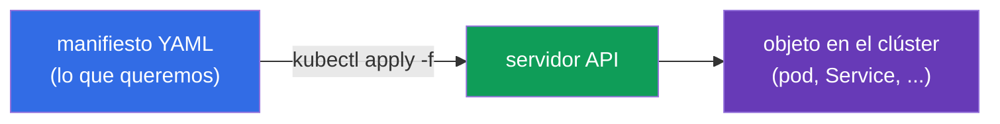
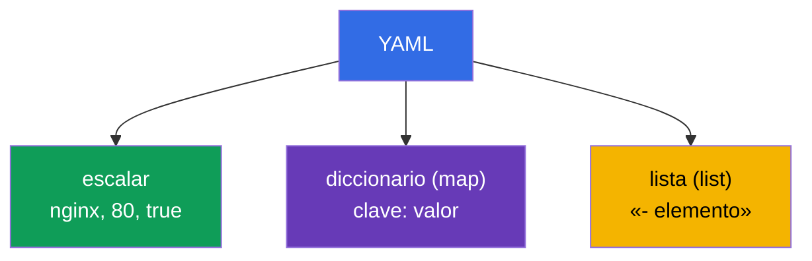
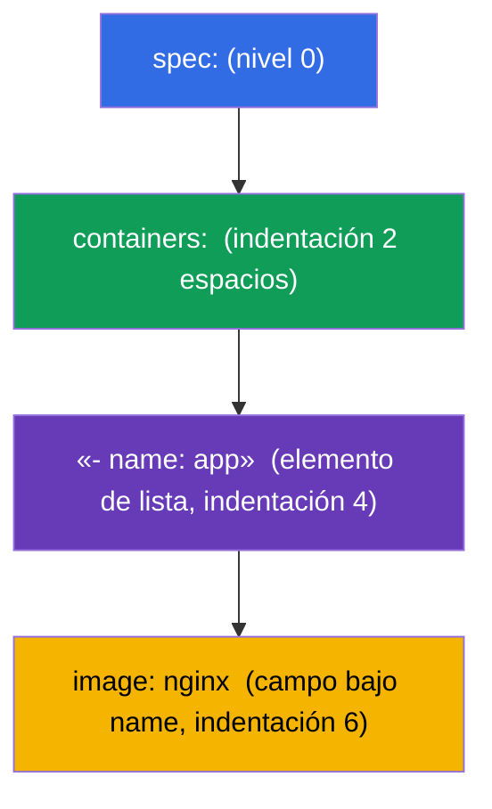
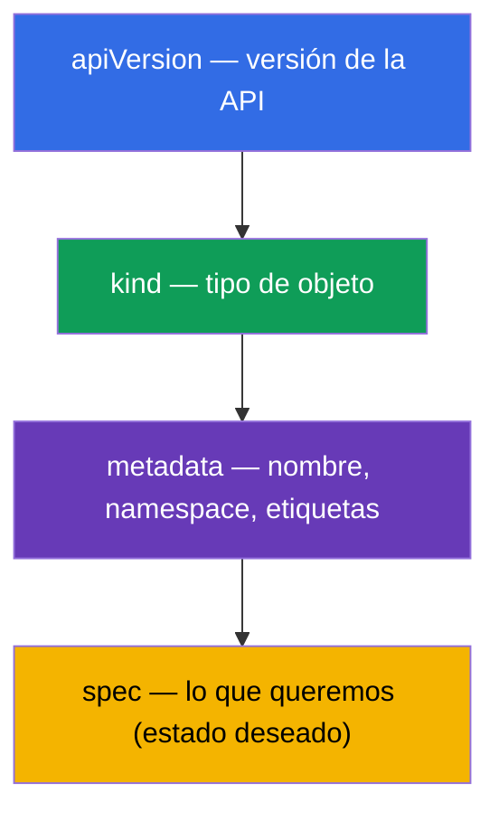

[Русская версия](ru.md) · [Eng version](README.md) · [Version française](fr.md) · [Deutsche Version](de.md) · [ქართული ვერსია](ge.md) · [繁體中文版](tw.md) · [日本語版](jp.md)

# Capítulo 0.6. YAML desde cero: indentación, listas, diccionarios y manifiestos de Kubernetes

> **Para quién es este capítulo.** Parte 0, la base. Todo en Kubernetes se describe en
> **YAML**: pods, Deployment, Service, ConfigMap son manifiestos YAML. Si lees con
> confianza el anidamiento por indentación y distingues una lista de un diccionario -
> pasa al Capítulo 0.7. Pero si YAML es para ti "un montón de espacios donde algo se
> rompe" - este capítulo elimina la principal barrera del principiante en CKAD: la
> mayoría de los errores en los manifiestos no son de Kubernetes, sino una indentación
> incorrecta o una lista/diccionario confundidos.

## 0.6.1. Por qué YAML y qué es

**YAML** es un formato para describir datos legible por humanos. Kubernetes acepta
manifiestos en YAML (y JSON, pero casi siempre se escribe YAML). La idea: describes de
forma **declarativa** el estado deseado de un objeto, y el clúster lo crea.



## 0.6.2. Los tres pilares de YAML: escalares, diccionarios, listas

YAML se construye a partir de tres cosas:

- **Escalar** - un valor simple: cadena, número, booleano (`nginx`, `80`, `true`).
- **Diccionario (map)** - pares `clave: valor` (fíjate en el **espacio** después de los
  dos puntos).
- **Lista (list)** - elementos, cada uno con un guion `-`.

```yaml
# diccionario: pares clave-valor
name: web
replicas: 3
enabled: true

# lista de valores simples
ports:
  - 80
  - 443

# lista de diccionarios (caso frecuente en Kubernetes)
containers:
  - name: app
    image: nginx
  - name: sidecar
    image: busybox
```



## 0.6.3. La indentación es la estructura (la regla principal)

En YAML **el anidamiento se define con indentación por espacios**, no con llaves. Es la
fuente de casi todos los errores del principiante.

Reglas de hierro:

- **Solo espacios, nunca tabuladores.** Un tabulador = error de análisis.
- Normalmente **2 espacios** por nivel de anidamiento (así se acostumbra en Kubernetes).
- Los elementos de un mismo nivel se alinean **igual**.

```yaml
spec:
  containers:        # 2 espacios a la derecha de spec
    - name: app      # elemento de lista dentro de containers
      image: nginx   # campos del elemento alineados bajo name
```



> **Trampa n.º 1.** Desplaza una línea un espacio - y el campo "se va" al objeto
> equivocado. Kubernetes rechazará el manifiesto o (peor) creará algo distinto de lo que
> querías decir.

## 0.6.4. Lista frente a diccionario: dónde va `-` y dónde no

La confusión más habitual. La regla es simple:

- si bajo una clave van **varios elementos del mismo tipo** - es una **lista**, cada uno
  con `-`;
- si bajo una clave va **un conjunto de campos con nombre** - es un **diccionario**, sin
  `-`.

```yaml
# containers - LISTA (puede haber muchos contenedores) → con guiones
containers:
  - name: app
    image: nginx

# resources - DICCIONARIO (campos con nombre) → sin guiones
resources:
  requests:
    cpu: 100m
    memory: 64Mi
```

`env` es un caso ilustrativo: es una **lista de diccionarios**, cada variable un
elemento aparte con los campos `name`/`value`:

```yaml
env:
  - name: APP_COLOR
    value: blue
  - name: APP_MODE
    value: prod
```

## 0.6.5. La anatomía de cualquier manifiesto de Kubernetes

Casi todo objeto de Kubernetes tiene los mismos cuatro campos de nivel superior:

```yaml
apiVersion: v1          # versión de la API (qué "idioma" del objeto)
kind: Pod               # tipo de objeto
metadata:               # nombre, namespace, etiquetas
  name: web
  labels:
    app: web
spec:                   # estado deseado (la parte más grande)
  containers:
    - name: web
      image: nginx:1.27
      ports:
        - containerPort: 80
```



Una vez que recuerdas estos cuatro (`apiVersion`, `kind`, `metadata`, `spec`),
reconoces la estructura de cualquier manifiesto - solo cambia el contenido de `spec`.

## 0.6.6. Varios objetos en un archivo: `---`

El separador `---` permite describir varios objetos en un archivo (por ejemplo, PV +
PVC + pod de una vez):

```yaml
apiVersion: v1
kind: ConfigMap
metadata:
  name: cfg
data:
  color: blue
---
apiVersion: v1
kind: Pod
metadata:
  name: web
spec:
  containers:
    - name: web
      image: nginx
```

`kubectl apply -f file.yaml` creará ambos objetos. Es cómodo para las prácticas y el
examen, donde los recursos relacionados se mantienen juntos.

## 0.6.7. No escribir desde cero: generación y validación

En el examen el YAML **no se teclea a mano** - se genera de forma imperativa y se
retoca:

```bash
# generar un esqueleto de manifiesto sin crear el objeto
kubectl run web --image=nginx --dry-run=client -o yaml > pod.yaml

# crear un esqueleto de deployment
kubectl create deployment api --image=nginx --dry-run=client -o yaml > dep.yaml

# aplicar y comprobar
kubectl apply -f pod.yaml
kubectl explain pod.spec.containers   # qué campos existen en general
```

Hábitos útiles:
- `--dry-run=client -o yaml` - el truco de oro: un esqueleto rápido sin indentación
  manual.
- `kubectl explain <ruta>` - ayuda sobre los campos de un objeto directamente desde el
  clúster.
- ante un error de apply lee el mensaje: indica la línea/campo con el problema.

## 0.6.8. Cómo se aplica esto en producción

- **GitOps y versionado.** Los manifiestos se guardan en Git; los cambios pasan por
  revisión y se despliegan automáticamente (Argo CD, Flux). YAML es el "código fuente"
  de la infraestructura.
- **Plantillas.** Los manifiestos uniformes para distintos entornos no se copian, sino
  que se generan con Helm (Capítulo 42) o Kustomize (Capítulo 43) - para no multiplicar
  YAML a mano.
- **Validación antes de aplicar.** En CI los manifiestos se comprueban con linters y
  `kubectl apply --dry-run=server`, para detectar errores de indentación y de esquema
  antes del clúster.
- **La legibilidad importa más que la brevedad.** Nombres claros, etiquetas y
  comentarios en el YAML - eso es lo que distingue una configuración mantenible de "una
  magia que da miedo tocar".

## 0.6.9. Miniglosario

- **YAML** - formato de descripción de datos legible por humanos; el lenguaje principal
  de los manifiestos.
- **Escalar** - un valor simple (cadena, número, booleano).
- **Diccionario (map)** - un conjunto de pares `clave: valor`.
- **Lista (list)** - una secuencia de elementos, cada uno con `-`.
- **Indentación** - espacios que definen el anidamiento (solo espacios, normalmente 2).
- **apiVersion / kind / metadata / spec** - los cuatro campos de nivel superior de todo
  objeto.
- **`---`** - un separador de varios objetos en un archivo.
- **`--dry-run=client -o yaml`** - generar un manifiesto sin crear un objeto.
- **`kubectl explain`** - ayuda sobre los campos de un objeto.

## 0.6.10. Resumen del capítulo

- YAML describe el estado deseado de los objetos; `kubectl apply -f` los crea en el
  clúster.
- Tres pilares: escalares, diccionarios (`clave: valor`), listas (elementos con `-`).
- El anidamiento se define con **indentación por espacios** (nunca tabuladores,
  normalmente 2 espacios) - es la fuente de la mayoría de los errores.
- Una lista es cuando hay muchos elementos (con `-`); un diccionario son campos con
  nombre (sin `-`); `env` es una lista de diccionarios.
- Todo objeto tiene `apiVersion`, `kind`, `metadata`, `spec` - cambia sobre todo `spec`.
- `---` separa varios objetos en un archivo.
- En el examen el YAML se genera (`--dry-run=client -o yaml`) y se valida
  (`kubectl explain`), no se escribe a mano.

## 0.6.11. Para qué sirve: en el examen y en el trabajo real

**En el examen (CKAD/CKA).** Cada tarea es crear o editar un manifiesto. Saber generar
al instante un esqueleto con `--dry-run` y corregir la indentación sin errores influye
directamente en la velocidad. Una lista/diccionario confundidos o un tabulador en lugar
de espacios es la pérdida de puntos más molesta, que este capítulo enseña a evitar.

**En el trabajo real.** YAML es el código fuente de la infraestructura: GitOps,
revisión, plantillas Helm/Kustomize. Manifiestos limpios y legibles son la base de una
plataforma mantenible.

## 0.6.12. Preguntas de autoevaluación

1. ¿En qué se diferencia un escalar de un diccionario y una lista? Da un ejemplo de cada
   uno.
2. ¿Cómo se define el anidamiento en YAML y por qué no se pueden usar tabuladores?
3. ¿Cuándo se escribe un campo como lista (con `-`) y cuándo como diccionario (sin `-`)?
4. ¿Por qué `env` es una lista de diccionarios? Escribe un ejemplo con dos variables.
5. Nombra los cuatro campos de nivel superior de cualquier manifiesto de Kubernetes.
6. ¿Para qué sirve `---` y qué hace `--dry-run=client -o yaml`?

## Práctica

No hay una práctica aparte para la Parte 0. Escribirás y generarás YAML en cada
práctica, empezando por la 101 (fundamentos) y los drills 119-122 (velocidad). A
continuación - cómo un contenedor y un pod se conectan a la red del nodo: network
namespaces y veth.

---
[Índice](../README_ES.md) · [Capítulo 0.5](../00-5-linux/es.md) · [Capítulo 0.7](../00-7-netns/es.md)
