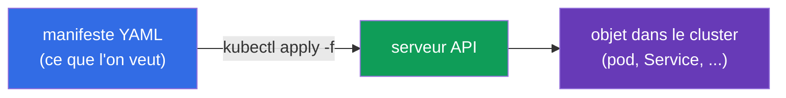
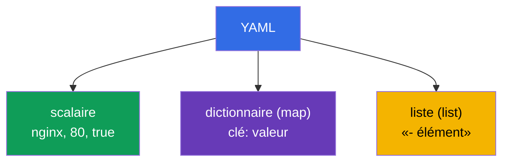
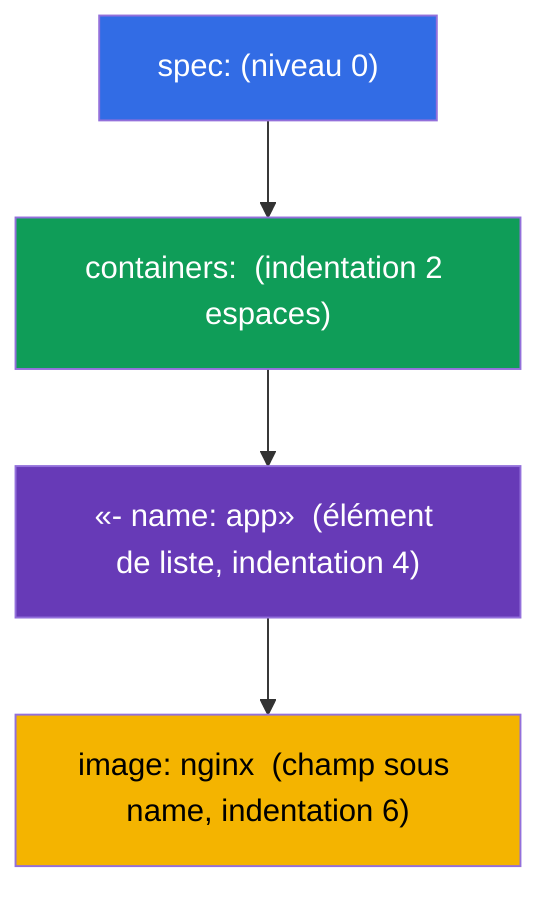
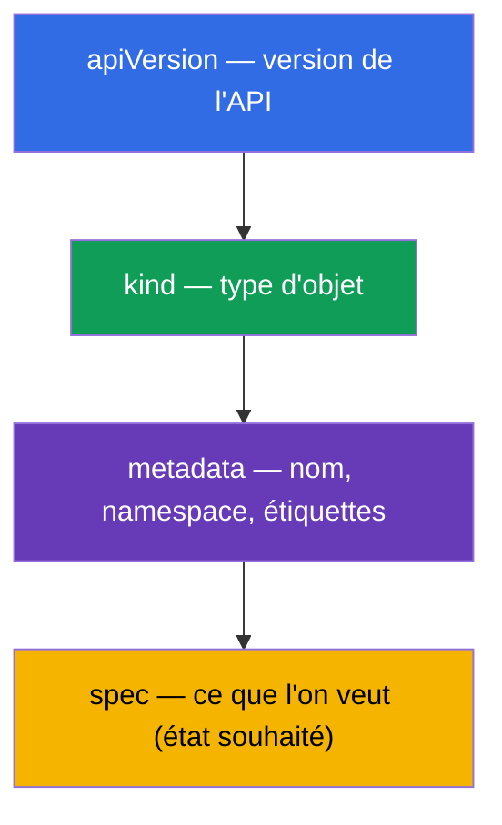

[Русская версия](ru.md) · [Eng version](README.md) · [Versión en español](es.md) · [Deutsche Version](de.md) · [ქართული ვერსია](ge.md) · [繁體中文版](tw.md) · [日本語版](jp.md)

# Chapitre 0.6. YAML depuis zéro : indentation, listes, dictionnaires et manifestes Kubernetes

> **À qui s'adresse ce chapitre.** Partie 0, le fondement. Tout dans Kubernetes se
> décrit en **YAML** : les pods, Deployment, Service, ConfigMap sont des manifestes
> YAML. Si vous lisez avec assurance l'imbrication par indentation et distinguez une
> liste d'un dictionnaire - passez au Chapitre 0.7. Mais si YAML est pour vous « un tas
> d'espaces où quelque chose casse » - ce chapitre lève la principale barrière du
> débutant au CKAD : la plupart des erreurs dans les manifestes ne viennent pas de
> Kubernetes, mais d'une mauvaise indentation ou d'une liste/dictionnaire confondus.

## 0.6.1. Pourquoi YAML et ce que c'est

**YAML** est un format de description de données lisible par l'humain. Kubernetes
accepte les manifestes en YAML (et en JSON, mais on écrit presque toujours du YAML).
L'idée : vous décrivez de façon **déclarative** l'état souhaité d'un objet, et le
cluster le crée.



## 0.6.2. Les trois piliers de YAML : scalaires, dictionnaires, listes

YAML se construit à partir de trois choses :

- **Scalaire** - une valeur simple : chaîne, nombre, booléen (`nginx`, `80`, `true`).
- **Dictionnaire (map)** - des paires `clé: valeur` (attention à l'**espace** après les
  deux-points).
- **Liste (list)** - des éléments, chacun avec un tiret `-`.

```yaml
# dictionnaire : paires clé-valeur
name: web
replicas: 3
enabled: true

# liste de valeurs simples
ports:
  - 80
  - 443

# liste de dictionnaires (cas fréquent dans Kubernetes)
containers:
  - name: app
    image: nginx
  - name: sidecar
    image: busybox
```



## 0.6.3. L'indentation, c'est la structure (la règle principale)

En YAML **l'imbrication est définie par l'indentation en espaces**, pas par des
accolades. C'est la source de presque toutes les erreurs du débutant.

Règles de fer :

- **Uniquement des espaces, jamais de tabulations.** Une tabulation = erreur d'analyse.
- Habituellement **2 espaces** par niveau d'imbrication (c'est la convention dans
  Kubernetes).
- Les éléments d'un même niveau sont alignés **de façon identique**.

```yaml
spec:
  containers:        # 2 espaces à droite de spec
    - name: app      # élément de liste dans containers
      image: nginx   # champs de l'élément alignés sous name
```



> **Piège n° 1.** Décalez une ligne d'un espace - et le champ « part » dans le mauvais
> objet. Kubernetes rejettera le manifeste ou (pire) créera autre chose que ce que vous
> vouliez dire.

## 0.6.4. Liste contre dictionnaire : où mettre `-` et où non

La confusion la plus fréquente. La règle est simple :

- si sous une clé viennent **plusieurs éléments du même type** - c'est une **liste**,
  chacun avec `-` ;
- si sous une clé vient **un ensemble de champs nommés** - c'est un **dictionnaire**,
  sans `-`.

```yaml
# containers - LISTE (il peut y avoir beaucoup de conteneurs) → avec des tirets
containers:
  - name: app
    image: nginx

# resources - DICTIONNAIRE (champs nommés) → sans tirets
resources:
  requests:
    cpu: 100m
    memory: 64Mi
```

`env` est un cas parlant : c'est une **liste de dictionnaires**, chaque variable étant
un élément distinct avec les champs `name`/`value` :

```yaml
env:
  - name: APP_COLOR
    value: blue
  - name: APP_MODE
    value: prod
```

## 0.6.5. L'anatomie de tout manifeste Kubernetes

Presque chaque objet Kubernetes possède les quatre mêmes champs de premier niveau :

```yaml
apiVersion: v1          # version de l'API (quelle "langue" de l'objet)
kind: Pod               # type d'objet
metadata:               # nom, namespace, étiquettes
  name: web
  labels:
    app: web
spec:                   # état souhaité (la plus grande partie)
  containers:
    - name: web
      image: nginx:1.27
      ports:
        - containerPort: 80
```



Une fois ces quatre-là retenus (`apiVersion`, `kind`, `metadata`, `spec`), vous
reconnaissez la structure de tout manifeste - seul le contenu de `spec` change.

## 0.6.6. Plusieurs objets dans un fichier : `---`

Le séparateur `---` permet de décrire plusieurs objets dans un fichier (par exemple, PV
+ PVC + pod d'un coup) :

```yaml
apiVersion: v1
kind: ConfigMap
metadata:
  name: cfg
data:
  color: blue
---
apiVersion: v1
kind: Pod
metadata:
  name: web
spec:
  containers:
    - name: web
      image: nginx
```

`kubectl apply -f file.yaml` créera les deux objets. C'est pratique pour les TP et
l'examen, où les ressources liées sont gardées ensemble.

## 0.6.7. Ne pas écrire depuis zéro : génération et validation

À l'examen, le YAML **ne se tape pas à la main** - il se génère de façon impérative et
se retouche :

```bash
# générer un squelette de manifeste sans créer d'objet
kubectl run web --image=nginx --dry-run=client -o yaml > pod.yaml

# créer un squelette de deployment
kubectl create deployment api --image=nginx --dry-run=client -o yaml > dep.yaml

# appliquer et vérifier
kubectl apply -f pod.yaml
kubectl explain pod.spec.containers   # quels champs existent en général
```

Habitudes utiles :
- `--dry-run=client -o yaml` - l'astuce en or : un squelette rapide sans indentation
  manuelle.
- `kubectl explain <chemin>` - l'aide sur les champs d'un objet directement depuis le
  cluster.
- en cas d'erreur d'apply, lisez le message : il indique la ligne/le champ posant
  problème.

## 0.6.8. Comment cela s'applique en production

- **GitOps et versionnage.** Les manifestes sont conservés dans Git ; les modifications
  passent par une revue et sont déployées automatiquement (Argo CD, Flux). YAML est le
  « code source » de l'infrastructure.
- **Gabarits.** Les manifestes uniformes pour différents environnements ne sont pas
  copiés, mais générés par Helm (Chapitre 42) ou Kustomize (Chapitre 43) - pour ne pas
  multiplier le YAML à la main.
- **Validation avant application.** En CI, les manifestes sont vérifiés par des linters
  et `kubectl apply --dry-run=server`, afin d'attraper les erreurs d'indentation et de
  schéma avant le cluster.
- **La lisibilité prime sur la concision.** Des noms clairs, des étiquettes et des
  commentaires dans le YAML - voilà ce qui distingue une configuration maintenable d'une
  « magie qu'on a peur de toucher ».

## 0.6.9. Mini-glossaire

- **YAML** - format de description de données lisible par l'humain ; le langage
  principal des manifestes.
- **Scalaire** - une valeur simple (chaîne, nombre, booléen).
- **Dictionnaire (map)** - un ensemble de paires `clé: valeur`.
- **Liste (list)** - une séquence d'éléments, chacun avec `-`.
- **Indentation** - des espaces qui définissent l'imbrication (uniquement des espaces,
  habituellement 2).
- **apiVersion / kind / metadata / spec** - les quatre champs de premier niveau de tout
  objet.
- **`---`** - un séparateur de plusieurs objets dans un fichier.
- **`--dry-run=client -o yaml`** - générer un manifeste sans créer d'objet.
- **`kubectl explain`** - l'aide sur les champs d'un objet.

## 0.6.10. Récapitulatif du chapitre

- YAML décrit l'état souhaité des objets ; `kubectl apply -f` les crée dans le cluster.
- Trois piliers : scalaires, dictionnaires (`clé: valeur`), listes (éléments avec `-`).
- L'imbrication est définie par l'**indentation en espaces** (jamais de tabulations,
  habituellement 2 espaces) - c'est la source de la plupart des erreurs.
- Une liste, c'est quand il y a beaucoup d'éléments (avec `-`) ; un dictionnaire, ce
  sont des champs nommés (sans `-`) ; `env` est une liste de dictionnaires.
- Tout objet a `apiVersion`, `kind`, `metadata`, `spec` - c'est surtout `spec` qui
  change.
- `---` sépare plusieurs objets dans un fichier.
- À l'examen, le YAML se génère (`--dry-run=client -o yaml`) et se valide
  (`kubectl explain`), il ne s'écrit pas à la main.

## 0.6.11. À quoi cela sert : à l'examen et dans le travail réel

**À l'examen (CKAD/CKA).** Chaque tâche est la création ou la modification d'un
manifeste. Savoir générer instantanément un squelette avec `--dry-run` et corriger
l'indentation sans erreurs influe directement sur la vitesse. Une liste/dictionnaire
confondus ou une tabulation à la place d'espaces, c'est la perte de points la plus
rageante, que ce chapitre apprend à éviter.

**Dans le travail réel.** YAML est le code source de l'infrastructure : GitOps, revue,
gabarits Helm/Kustomize. Des manifestes propres et lisibles sont le fondement d'une
plateforme maintenable.

## 0.6.12. Questions d'auto-évaluation

1. En quoi un scalaire diffère-t-il d'un dictionnaire et d'une liste ? Donnez un exemple
   de chacun.
2. Comment l'imbrication est-elle définie en YAML et pourquoi ne peut-on pas utiliser de
   tabulations ?
3. Quand un champ s'écrit-il en liste (avec `-`), et quand en dictionnaire (sans `-`) ?
4. Pourquoi `env` est-il une liste de dictionnaires ? Écrivez un exemple avec deux
   variables.
5. Nommez les quatre champs de premier niveau de tout manifeste Kubernetes.
6. À quoi sert `---` et que fait `--dry-run=client -o yaml` ?

## Pratique

Il n'y a pas de TP à part pour la Partie 0. Vous écrirez et générerez du YAML dans
chaque TP, à commencer par le 101 (les bases) et les drills 119-122 (la vitesse).
Ensuite - comment un conteneur et un pod se connectent au réseau du nœud : network
namespaces et veth.

---
[Sommaire](../README_FR.md) · [Chapitre 0.5](../00-5-linux/fr.md) · [Chapitre 0.7](../00-7-netns/fr.md)
