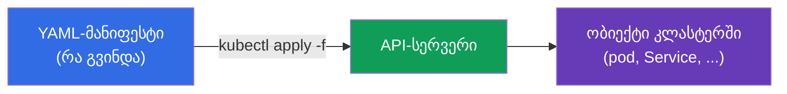
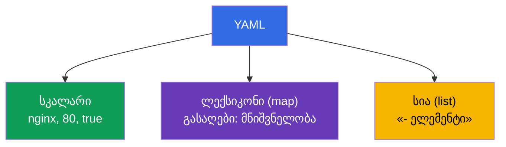
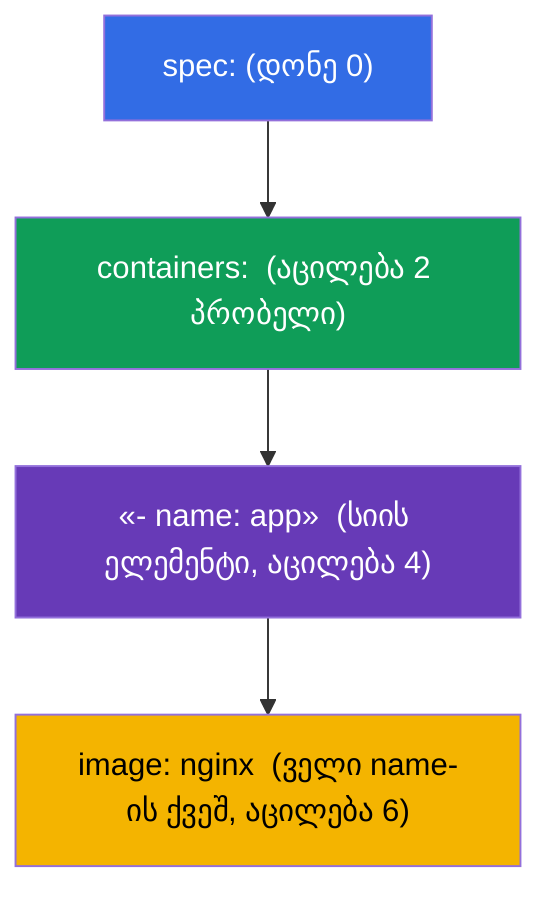
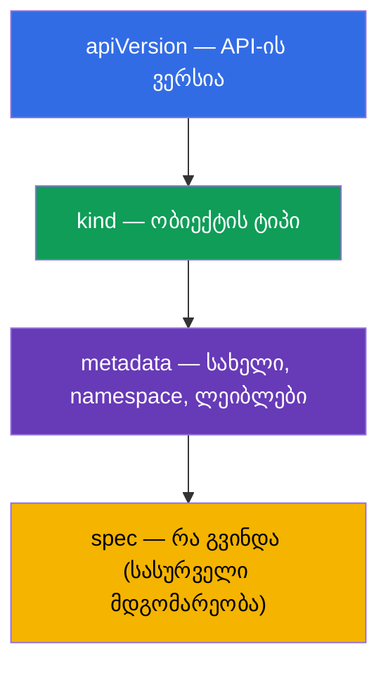

[Русская версия](ru.md) · [Eng version](README.md) · [Versión en español](es.md) · [Version française](fr.md) · [Deutsche Version](de.md) · [繁體中文版](tw.md) · [日本語版](jp.md)

# თავი 0.6. YAML ნულიდან: აცილება, სიები, ლექსიკონები და Kubernetes-ის მანიფესტები

> **ვისთვისაა ეს თავი.** ნაწილი 0, საფუძველი. Kubernetes-ში ყველაფერი აღიწერება
> **YAML**-ით: pod-ები, Deployment, Service, ConfigMap - ეს YAML-მანიფესტებია. თუ
> თავდაჯერებულად კითხულობთ ჩალაგებას აცილებით და არჩევთ სიას ლექსიკონისგან - გადადით
> 0.7 თავზე. მაგრამ თუ YAML თქვენთვის „პრობლების გროვაა, სადაც რაღაც ტყდება“ - ეს თავი
> მოხსნის დამწყების მთავარ ბარიერს CKAD-ზე: მანიფესტების შეცდომების უმეტესობა არა
> Kubernetes-ია, არამედ არასწორი აცილება ან არეული სია/ლექსიკონი.

## 0.6.1. რატომ YAML და რა არის ეს

**YAML** არის მონაცემების აღწერის ადამიანისთვის წასაკითხი ფორმატი. Kubernetes იღებს
მანიფესტებს YAML-ში (და JSON-ში, მაგრამ თითქმის ყოველთვის YAML-ს წერენ). იდეა: თქვენ
**დეკლარაციულად** აღწერთ ობიექტის სასურველ მდგომარეობას, ხოლო კლასტერი მას ქმნის.



## 0.6.2. YAML-ის სამი ბურჯი: სკალარები, ლექსიკონები, სიები

YAML აიგება სამი ნივთისგან:

- **სკალარი** - მარტივი მნიშვნელობა: სტრიქონი, რიცხვი, ბულევი (`nginx`, `80`, `true`).
- **ლექსიკონი (map)** - წყვილები `გასაღები: მნიშვნელობა` (ყურადღება მიაქციეთ **პრობელს**
  ორწერტილის შემდეგ).
- **სია (list)** - ელემენტები, თითოეული დეფისით `-`.

```yaml
# ლექსიკონი: გასაღები-მნიშვნელობის წყვილები
name: web
replicas: 3
enabled: true

# მარტივი მნიშვნელობების სია
ports:
  - 80
  - 443

# ლექსიკონების სია (ხშირი შემთხვევა Kubernetes-ში)
containers:
  - name: app
    image: nginx
  - name: sidecar
    image: busybox
```



## 0.6.3. აცილება - ეს არის სტრუქტურა (მთავარი წესი)

YAML-ში **ჩალაგება დგინდება პრობელებით აცილებით**, არა ფრჩხილებით. ეს არის დამწყების
თითქმის ყველა შეცდომის წყარო.

რკინის წესები:

- **მხოლოდ პრობელები, არასდროს ტაბები.** ტაბი = პარსინგის შეცდომა.
- ჩვეულებრივ **2 პრობელი** ჩალაგების ყოველ დონეზე (Kubernetes-ში ასეა მიღებული).
- ერთი დონის ელემენტები **ერთნაირად** არის გასწორებული.

```yaml
spec:
  containers:        # spec-ის მარჯვნივ 2 პრობელით
    - name: app      # სიის ელემენტი containers-ის შიგნით
      image: nginx   # ელემენტის ველები გასწორებულია name-ის ქვეშ
```



> **ხაფანგი №1.** გადასწიე სტრიქონი ერთი პრობელით - და ველი „წავიდა“ არასწორ ობიექტში.
> Kubernetes ან უარყოფს მანიფესტს, ან (უარესი) შექმნის იმას, რაც არ გქონდათ მხედველობაში.

## 0.6.4. სია ლექსიკონის წინააღმდეგ: სად არის `-`, ხოლო სად არა

ყველაზე ხშირი აღრევა. წესი მარტივია:

- თუ გასაღების ქვეშ მოდის **რამდენიმე ერთგვაროვანი ელემენტი** - ეს **სიაა**, თითოეული
  `-`-ით;
- თუ გასაღების ქვეშ მოდის **დასახელებული ველების ნაკრები** - ეს **ლექსიკონია**, `-`-ის
  გარეშე.

```yaml
# containers - სია (კონტეინერი ბევრი შეიძლება იყოს) → დეფისებით
containers:
  - name: app
    image: nginx

# resources - ლექსიკონი (დასახელებული ველები) → დეფისების გარეშე
resources:
  requests:
    cpu: 100m
    memory: 64Mi
```

`env` თვალსაჩინო შემთხვევაა: ეს არის **ლექსიკონების სია**, ყოველი ცვლადი ცალკე
ელემენტია ველებით `name`/`value`:

```yaml
env:
  - name: APP_COLOR
    value: blue
  - name: APP_MODE
    value: prod
```

## 0.6.5. ნებისმიერი Kubernetes-მანიფესტის ანატომია

თითქმის ყოველ Kubernetes-ობიექტს აქვს ერთი და იგივე ოთხი ზედა ველი:

```yaml
apiVersion: v1          # API-ის ვერსია (ობიექტის რომელი "ენა")
kind: Pod               # ობიექტის ტიპი
metadata:               # სახელი, namespace, ლეიბლები
  name: web
  labels:
    app: web
spec:                   # სასურველი მდგომარეობა (ყველაზე დიდი ნაწილი)
  containers:
    - name: web
      image: nginx:1.27
      ports:
        - containerPort: 80
```



ამ ოთხის დამახსოვრებით (`apiVersion`, `kind`, `metadata`, `spec`), ცნობთ ნებისმიერი
მანიფესტის სტრუქტურას - იცვლება მხოლოდ `spec`-ის შიგთავსი.

## 0.6.6. რამდენიმე ობიექტი ერთ ფაილში: `---`

გამყოფი `---` საშუალებას გაძლევთ ერთ ფაილში აღწეროთ რამდენიმე ობიექტი (მაგალითად, PV +
PVC + pod ერთდროულად):

```yaml
apiVersion: v1
kind: ConfigMap
metadata:
  name: cfg
data:
  color: blue
---
apiVersion: v1
kind: Pod
metadata:
  name: web
spec:
  containers:
    - name: web
      image: nginx
```

`kubectl apply -f file.yaml` შექმნის ორივე ობიექტს. ეს მოსახერხებელია ლაბებისა და
გამოცდისთვის, სადაც დაკავშირებულ რესურსებს ერთად ინახავენ.

## 0.6.7. ნულიდან არ დაწერო: გენერაცია და შემოწმება

გამოცდაზე YAML-ს **ხელით არ კრეფენ** - მას იმპერატიულად ქმნიან და ასწორებენ:

```bash
# მანიფესტის ნახაზის გენერაცია, ობიექტის შექმნის გარეშე
kubectl run web --image=nginx --dry-run=client -o yaml > pod.yaml

# deployment-ნახაზის შექმნა
kubectl create deployment api --image=nginx --dry-run=client -o yaml > dep.yaml

# გამოყენება და შემოწმება
kubectl apply -f pod.yaml
kubectl explain pod.spec.containers   # რა ველები არსებობს საერთოდ
```

სასარგებლო ჩვევები:
- `--dry-run=client -o yaml` - ოქროს ხერხი: სწრაფი ჩონჩხი ხელით აცილების გარეშე.
- `kubectl explain <გზა>` - ცნობა ობიექტის ველებზე პირდაპირ კლასტერიდან.
- apply-ის შეცდომისას წაიკითხეთ შეტყობინება: ის მიუთითებს პრობლემურ სტრიქონს/ველს.

## 0.6.8. როგორ გამოიყენება ეს პროდაქშენში

- **GitOps და ვერსიონირება.** მანიფესტები ინახება Git-ში; ცვლილებები გაივლის რევიუს და
  ავტომატურად იშლება (Argo CD, Flux). YAML - ინფრასტრუქტურის „წყაროს კოდია“.
- **შაბლონიზაცია.** ერთგვაროვან მანიფესტებს სხვადასხვა გარემოსთვის არ ასლდებენ, არამედ
  Helm-ით (თავი 42) ან Kustomize-ით (თავი 43) ქმნიან - რომ YAML ხელით არ გაამრავლონ.
- **ვალიდაცია გამოყენებამდე.** CI-ში მანიფესტებს ამოწმებენ ლინტერებით და
  `kubectl apply --dry-run=server`-ით, რომ აცილებისა და სქემის შეცდომები კლასტერამდე
  დაიჭირონ.
- **წაკითხვადობა მოკლედობაზე მნიშვნელოვანია.** გასაგები სახელები, ლეიბლები და
  კომენტარები YAML-ში - ეს არის ის, რაც ინახავადს კონფიგურაციას განასხვავებს „მაგიისგან,
  რომლის შეხებაც გეშინია“.

## 0.6.9. მინი-ლექსიკონი

- **YAML** - მონაცემების აღწერის ადამიანისთვის წასაკითხი ფორმატი; მანიფესტების მთავარი
  ენა.
- **სკალარი** - მარტივი მნიშვნელობა (სტრიქონი, რიცხვი, ბულევი).
- **ლექსიკონი (map)** - წყვილების ნაკრები `გასაღები: მნიშვნელობა`.
- **სია (list)** - ელემენტების თანმიმდევრობა, თითოეული `-`-ით.
- **აცილება** - პრობელები, რომლებიც აყენებენ ჩალაგებას (მხოლოდ პრობელები, ჩვეულებრივ 2).
- **apiVersion / kind / metadata / spec** - ნებისმიერი ობიექტის ოთხი ზედა ველი.
- **`---`** - რამდენიმე ობიექტის გამყოფი ერთ ფაილში.
- **`--dry-run=client -o yaml`** - მანიფესტის გენერაცია ობიექტის შექმნის გარეშე.
- **`kubectl explain`** - ცნობა ობიექტის ველებზე.

## 0.6.10. თავის შეჯამება

- YAML აღწერს ობიექტების სასურველ მდგომარეობას; `kubectl apply -f` ქმნის მათ კლასტერში.
- სამი ბურჯი: სკალარები, ლექსიკონები (`გასაღები: მნიშვნელობა`), სიები (ელემენტები `-`-ით).
- ჩალაგებას აყენებს **პრობელებით აცილება** (არასდროს ტაბები, ჩვეულებრივ 2 პრობელი) - ეს
  არის შეცდომების უმეტესობის წყარო.
- სია - როცა ელემენტი ბევრია (`-`-ით); ლექსიკონი - დასახელებული ველები (`-`-ის გარეშე);
  `env` - ლექსიკონების სია.
- ნებისმიერ ობიექტს აქვს `apiVersion`, `kind`, `metadata`, `spec` - ძირითადად იცვლება
  `spec`.
- `---` ჰყოფს რამდენიმე ობიექტს ფაილში.
- გამოცდაზე YAML-ს ქმნიან (`--dry-run=client -o yaml`) და ამოწმებენ (`kubectl explain`),
  ხელით არ წერენ.

## 0.6.11. როგორ გამოგადგებათ: გამოცდაზე და რეალურ სამუშაოში

**გამოცდაზე (CKAD/CKA).** ყოველი დავალება - ეს მანიფესტის შექმნა ან ჩასწორებაა. `--dry-run`-ით
ჩონჩხის მყისიერად გენერაციისა და აცილების უშეცდომოდ ჩასწორების უნარი პირდაპირ მოქმედებს
სისწრაფეზე. არეული სია/ლექსიკონი ან ტაბი პრობელის ნაცვლად - ქულების ყველაზე შემაწუხებელი
დაკარგვა, რომლის თავიდან აცილებასაც ეს თავი გასწავლით.

**რეალურ სამუშაოში.** YAML - ინფრასტრუქტურის წყაროს კოდია: GitOps, რევიუ,
Helm/Kustomize-შაბლონიზაცია. სუფთა, წასაკითხი მანიფესტები - ინახავადი პლატფორმის
საფუძველია.

## 0.6.12. თვითშემოწმების კითხვები

1. რით განსხვავდება სკალარი ლექსიკონისა და სიისგან? მოიყვანეთ თითოეულის მაგალითი.
2. როგორ დგინდება YAML-ში ჩალაგება და რატომ არ შეიძლება ტაბების გამოყენება?
3. როდის ფორმდება ველი სიად (`-`-ით), ხოლო როდის ლექსიკონად (`-`-ის გარეშე)?
4. რატომ არის `env` ლექსიკონების სია? დაწერეთ ორი ცვლადის მაგალითი.
5. დაასახელეთ ნებისმიერი Kubernetes-მანიფესტის ოთხი ზედა ველი.
6. რისთვის არის საჭირო `---` და რას აკეთებს `--dry-run=client -o yaml`?

## პრაქტიკა

ნაწილ 0-ისთვის ცალკე ლაბი არ არის. YAML-ს დაწერთ და დააგენერირებთ ყოველ ლაბში,
101-დან დაწყებული (საფუძვლები) და დრილებით 119-122 (სისწრაფე). შემდეგ - როგორ უერთდება
კონტეინერი და pod კვანძის ქსელს: network namespaces და veth.

---
[სარჩევი](../README_GE.md) · [თავი 0.5](../00-5-linux/ge.md) · [თავი 0.7](../00-7-netns/ge.md)
