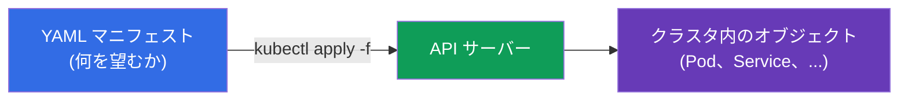
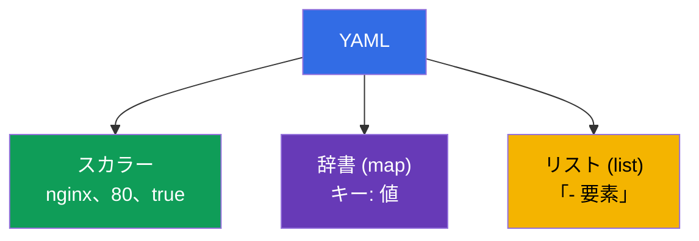
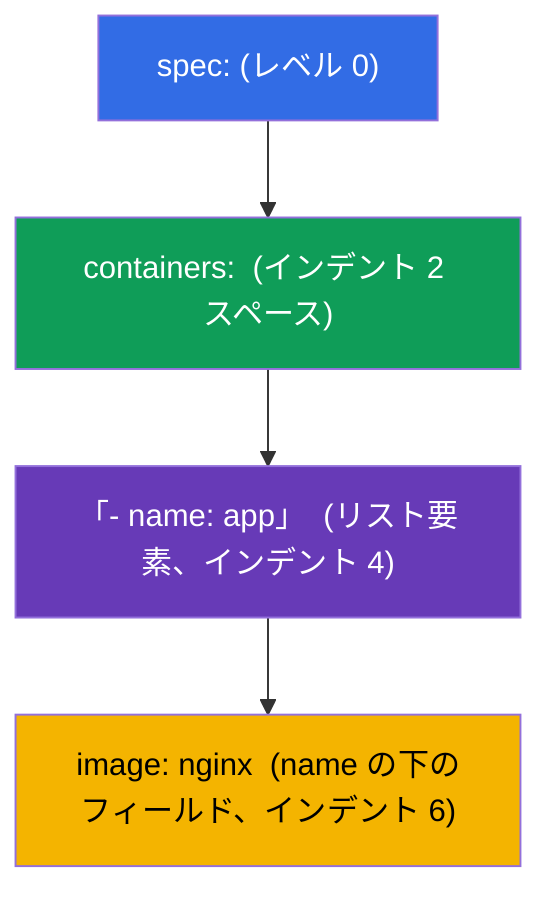
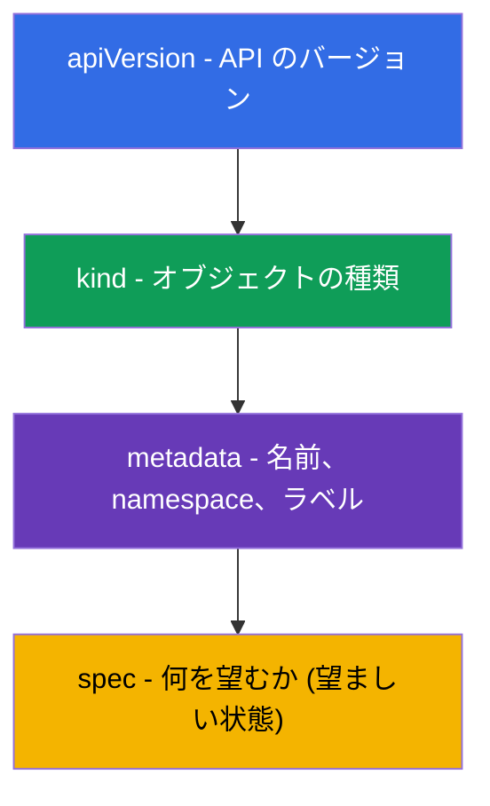

[Русская версия](ru.md) · [Eng version](README.md) · [Versión en español](es.md) · [Version française](fr.md) · [Deutsche Version](de.md) · [ქართული ვერსია](ge.md) · [繁體中文版](tw.md)

# 第 0.6 章。ゼロから学ぶ YAML：インデント、リスト、辞書、そして Kubernetes のマニフェスト

> **この章は誰のためか。** パート 0、土台となる章です。Kubernetes のすべては **YAML**
> で記述されます：Pod、Deployment、Service、ConfigMap - これらはすべて YAML の
> マニフェストです。インデントによる入れ子を自信をもって読めて、リストと辞書を
> 見分けられるなら、第 0.7 章へ進んでください。逆に YAML が「どこかで壊れる
> スペースの集まり」に見えるなら、この章が CKAD における初心者の最大の壁を
> 取り払います：マニフェストのエラーの大半は Kubernetes の問題ではなく、
> 間違ったインデントか、リストと辞書の取り違えです。

## 0.6.1. なぜ YAML が必要で、それは何なのか

**YAML** とは、人間が読めるかたちでデータを記述するためのフォーマットです。Kubernetes は
マニフェストを YAML で受け取ります（JSON も可能ですが、ほぼ常に YAML で書きます）。
考え方はこうです：あなたはオブジェクトの望ましい状態を **宣言的** に記述し、クラスタが
それを作り出します。



## 0.6.2. YAML の三本柱：スカラー、辞書、リスト

YAML は 3 つのものから成り立っています：

- **スカラー** - 単純な値：文字列、数値、真偽値（`nginx`、`80`、`true`）。
- **辞書 (map)** - `キー: 値` の組（コロンのあとの **スペース** に注意してください）。
- **リスト (list)** - 要素の並びで、それぞれがハイフン `-` から始まります。

```yaml
# 辞書: キーと値の組
name: web
replicas: 3
enabled: true

# 単純な値のリスト
ports:
  - 80
  - 443

# 辞書のリスト (Kubernetes でよくあるケース)
containers:
  - name: app
    image: nginx
  - name: sidecar
    image: busybox
```



## 0.6.3. インデントが構造である（最重要のルール）

YAML では **入れ子はスペースのインデントで決まります**。括弧ではありません。これが
初心者のほぼすべてのエラーの原因です。

鉄則：

- **スペースのみ、タブは絶対に使わない。** タブ = パースエラーです。
- 通常は入れ子 1 段あたり **スペース 2 つ**（Kubernetes ではこれが慣習です）。
- 同じ階層の要素は **同じ位置** に揃えます。

```yaml
spec:
  containers:        # spec より 2 スペース右
    - name: app      # containers の中のリスト要素
      image: nginx   # 要素のフィールドは name に揃える
```



> **罠 その 1。** 行を 1 スペースずらしただけで、フィールドが別のオブジェクトへ
> 「移動」してしまいます。Kubernetes はマニフェストを拒否するか、あるいは（もっと悪い
> ことに）あなたが意図したものとは違うものを作ります。

## 0.6.4. リストか辞書か：`-` が付くのはどこか

もっともよくある混乱です。ルールは単純です：

- キーの下に **同じ種類の要素が複数** 並ぶなら、それは **リスト** で、それぞれに
  `-` が付きます。
- キーの下に **名前の付いたフィールドの集まり** が並ぶなら、それは **辞書** で、`-` は
  付きません。

```yaml
# containers - リスト (コンテナは複数ありうる) → ハイフン付き
containers:
  - name: app
    image: nginx

# resources - 辞書 (名前の付いたフィールド) → ハイフンなし
resources:
  requests:
    cpu: 100m
    memory: 64Mi
```

`env` は分かりやすい例です：これは **辞書のリスト** で、変数ごとに `name`/`value` の
フィールドを持つ独立した要素になります：

```yaml
env:
  - name: APP_COLOR
    value: blue
  - name: APP_MODE
    value: prod
```

## 0.6.5. あらゆる Kubernetes マニフェストの解剖

ほぼすべての Kubernetes オブジェクトは、同じ 4 つの最上位フィールドを持っています：

```yaml
apiVersion: v1          # API のバージョン (オブジェクトの「言語」)
kind: Pod               # オブジェクトの種類
metadata:               # 名前、namespace、ラベル
  name: web
  labels:
    app: web
spec:                   # 望ましい状態 (もっとも大きな部分)
  containers:
    - name: web
      image: nginx:1.27
      ports:
        - containerPort: 80
```



この 4 つ（`apiVersion`、`kind`、`metadata`、`spec`）を覚えてしまえば、どんな
マニフェストの構造も分かります - 変わるのは `spec` の中身だけです。

## 0.6.6. 1 つのファイルに複数のオブジェクト：`---`

区切り `---` を使うと、1 つのファイルに複数のオブジェクトを記述できます（たとえば PV +
PVC + Pod をまとめて）：

```yaml
apiVersion: v1
kind: ConfigMap
metadata:
  name: cfg
data:
  color: blue
---
apiVersion: v1
kind: Pod
metadata:
  name: web
spec:
  containers:
    - name: web
      image: nginx
```

`kubectl apply -f file.yaml` は両方のオブジェクトを作ります。関連するリソースを
まとめて置くラボや試験では便利です。

## 0.6.7. ゼロから書かない：生成と確認

試験では YAML を **手打ちしません** - 命令的に生成して直します：

```bash
# オブジェクトを作らずにマニフェストの下書きを生成する
kubectl run web --image=nginx --dry-run=client -o yaml > pod.yaml

# deployment の下書きを作る
kubectl create deployment api --image=nginx --dry-run=client -o yaml > dep.yaml

# 適用して確認する
kubectl apply -f pod.yaml
kubectl explain pod.spec.containers   # そもそもどんなフィールドがあるのか
```

役に立つ習慣：
- `--dry-run=client -o yaml` - 黄金の技：手でインデントを打たずに骨組みを素早く得る。
- `kubectl explain <パス>` - オブジェクトのフィールドのヘルプをクラスタから直接引く。
- apply でエラーが出たらメッセージを読む：問題のある行やフィールドを示してくれます。

## 0.6.8. 本番環境でこれをどう使うか

- **GitOps とバージョン管理。** マニフェストは Git に保管し、変更はレビューを通って
  自動的に展開されます (Argo CD、Flux)。YAML はインフラの「ソースコード」です。
- **テンプレート化。** 環境ごとの似たマニフェストはコピーせず、Helm（第 42 章）や
  Kustomize（第 43 章）で生成します - YAML を手で増やさないためです。
- **適用前のバリデーション。** CI ではマニフェストをリンターや `kubectl apply
  --dry-run=server` で検査し、インデントやスキーマのエラーをクラスタに届く前に
  捕まえます。
- **短さより読みやすさ。** 分かりやすい名前、ラベル、YAML 内のコメント - これが、
  保守できる構成と「触るのが怖い魔法」を分けるものです。

## 0.6.9. ミニ用語集

- **YAML** - 人間が読めるデータ記述フォーマット。マニフェストの主要言語です。
- **スカラー** - 単純な値（文字列、数値、真偽値）。
- **辞書 (map)** - `キー: 値` の組の集まり。
- **リスト (list)** - 要素の並びで、それぞれが `-` から始まります。
- **インデント** - 入れ子を決めるスペース（スペースのみ、通常は 2 つ）。
- **apiVersion / kind / metadata / spec** - あらゆるオブジェクトの 4 つの最上位フィールド。
- **`---`** - 1 つのファイル内で複数のオブジェクトを区切るもの。
- **`--dry-run=client -o yaml`** - オブジェクトを作らずにマニフェストを生成すること。
- **`kubectl explain`** - オブジェクトのフィールドのヘルプ。

## 0.6.10. 本章のまとめ

- YAML はオブジェクトの望ましい状態を記述します。`kubectl apply -f` がそれをクラスタに作ります。
- 三本柱：スカラー、辞書（`キー: 値`）、リスト（`-` から始まる要素）。
- 入れ子は **スペースのインデント** で決まります（タブは絶対に使わない、通常はスペース 2 つ）-
  これがエラーの大半の原因です。
- 要素が複数あるならリスト（`-` 付き）、名前の付いたフィールドなら辞書（`-` なし）。`env` は
  辞書のリストです。
- どのオブジェクトにも `apiVersion`、`kind`、`metadata`、`spec` があり、主に変わるのは
  `spec` です。
- `---` はファイル内で複数のオブジェクトを区切ります。
- 試験では YAML を手で書かず、生成して（`--dry-run=client -o yaml`）確認します
  (`kubectl explain`)。

## 0.6.11. これがどう役に立つか：試験と実際の仕事で

**試験では (CKAD/CKA)。** どの問題もマニフェストの作成か修正です。`--dry-run` で
骨組みを即座に生成し、インデントを間違えずに直せるかは、そのまま速度に影響します。
リストと辞書の取り違えや、スペースの代わりのタブは、もっとも悔しい失点であり、この章は
それを避ける方法を教えます。

**実際の仕事では。** YAML はインフラのソースコードです：GitOps、レビュー、Helm/Kustomize
でのテンプレート化。きれいで読みやすいマニフェストが、保守できるプラットフォームの基盤です。

## 0.6.12. 自己チェックの質問

1. スカラーは辞書やリストとどう違いますか？それぞれの例を挙げてください。
2. YAML では入れ子はどのように決まり、なぜタブを使ってはいけないのですか？
3. フィールドをリスト（`-` 付き）にするのはどんなときで、辞書（`-` なし）にするのはどんなときですか？
4. なぜ `env` は辞書のリストなのですか？変数 2 つの例を書いてください。
5. あらゆる Kubernetes マニフェストの 4 つの最上位フィールドを挙げてください。
6. `---` は何のために必要で、`--dry-run=client -o yaml` は何をしますか？

## 演習

パート 0 には独立したラボはありません。YAML はどのラボでも書き、生成することになります。
ラボ 101（基礎）から始まり、ドリル 119-122（速さ）へ続きます。次は - コンテナと Pod が
どのようにノードのネットワークへつながるのか：network namespaces と veth です。

---
[目次](../README_JP.md) · [第 0.5 章](../00-5-linux/jp.md) · [第 0.7 章](../00-7-netns/jp.md)
