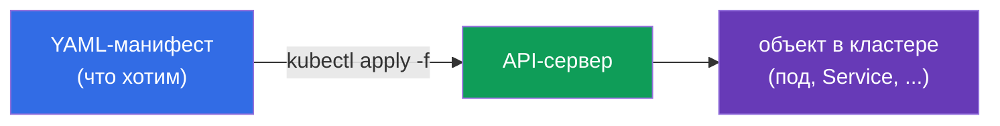
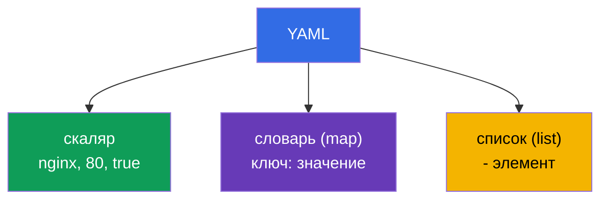
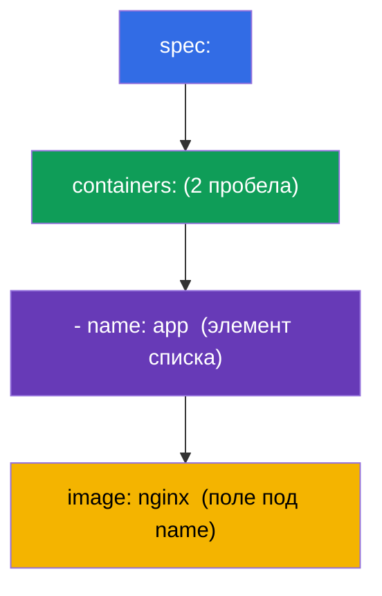
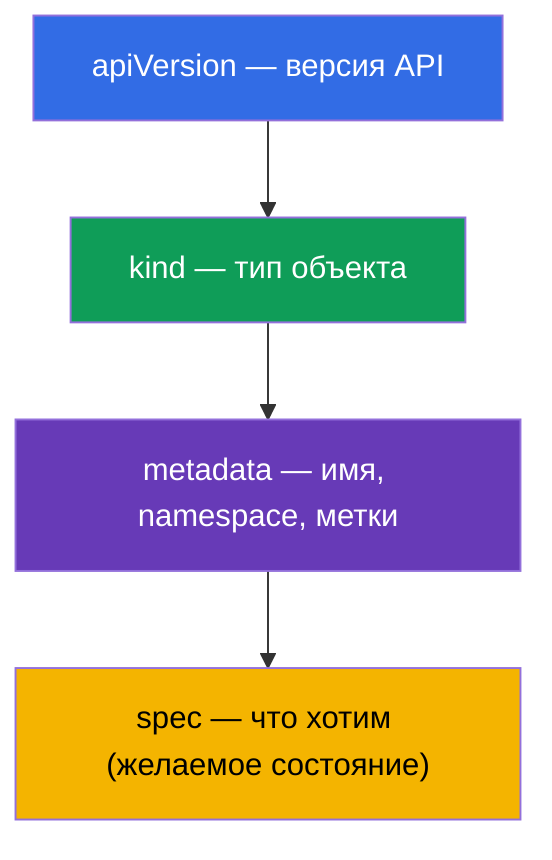

# Глава 0.6. YAML с нуля: отступы, списки, словари и манифесты Kubernetes

> **Для кого эта глава.** Часть 0, фундамент. Всё в Kubernetes описывается на **YAML**:
> поды, Deployment, Service, ConfigMap - это YAML-манифесты. Если вы уверенно читаете
> вложенность по отступам и отличаете список от словаря - переходите к главе 0.7. Если
> же YAML для вас «набор пробелов, где что-то ломается» - эта глава снимет главный
> барьер новичка на CKAD: большая часть ошибок в манифестах - это не Kubernetes, а
> неверный отступ или перепутанные список/словарь.

## 0.6.1. Зачем YAML и что это такое

**YAML** - формат для описания данных, который читается человеком. Kubernetes принимает
манифесты в YAML (и JSON, но YAML пишут почти всегда). Идея: вы **декларативно**
описываете желаемое состояние объекта, а кластер его создаёт.



## 0.6.2. Три кита YAML: скаляры, словари, списки

YAML строится из трёх вещей:

- **Скаляр** - простое значение: строка, число, булево (`nginx`, `80`, `true`).
- **Словарь (map)** - пары `ключ: значение` (обратите внимание на **пробел** после
  двоеточия).
- **Список (list)** - элементы, каждый с дефиса `-`.

```yaml
# словарь: пары ключ-значение
name: web
replicas: 3
enabled: true

# список простых значений
ports:
  - 80
  - 443

# список словарей (частый случай в Kubernetes)
containers:
  - name: app
    image: nginx
  - name: sidecar
    image: busybox
```



## 0.6.3. Отступы - это структура (главное правило)

В YAML **вложенность задаётся отступами пробелами**, а не скобками. Это источник почти
всех ошибок новичка.

Железные правила:

- **Только пробелы, никогда табы.** Таб = ошибка парсинга.
- Обычно **2 пробела** на уровень вложенности (в Kubernetes так принято).
- Элементы одного уровня выровнены **одинаково**.

```yaml
spec:
  containers:        # на 2 пробела правее spec
    - name: app      # элемент списка внутри containers
      image: nginx   # поля элемента выровнены под name
```



> **Ловушка №1.** Сдвинул строку на один пробел - и поле «уехало» не в тот объект.
> Kubernetes либо отвергнет манифест, либо (хуже) создаст не то, что вы имели в виду.

## 0.6.4. Список против словаря: где `-`, а где нет

Самая частая путаница. Правило простое:

- если под ключом идёт **несколько однотипных элементов** - это **список**, каждый с
  `-`;
- если под ключом идёт **набор именованных полей** - это **словарь**, без `-`.

```yaml
# containers - СПИСОК (контейнеров может быть много) → с дефисами
containers:
  - name: app
    image: nginx

# resources - СЛОВАРЬ (именованные поля) → без дефисов
resources:
  requests:
    cpu: 100m
    memory: 64Mi
```

`env` - показательный случай: это **список словарей**, каждая переменная - отдельный
элемент с полями `name`/`value`:

```yaml
env:
  - name: APP_COLOR
    value: blue
  - name: APP_MODE
    value: prod
```

## 0.6.5. Анатомия любого манифеста Kubernetes

Почти каждый объект Kubernetes имеет одни и те же четыре верхних поля:

```yaml
apiVersion: v1          # версия API (какой "язык" объекта)
kind: Pod               # тип объекта
metadata:               # имя, namespace, метки
  name: web
  labels:
    app: web
spec:                   # желаемое состояние (самая большая часть)
  containers:
    - name: web
      image: nginx:1.27
      ports:
        - containerPort: 80
```



Запомнив эту четвёрку (`apiVersion`, `kind`, `metadata`, `spec`), вы узнаёте структуру
любого манифеста - меняется только содержимое `spec`.

## 0.6.6. Несколько объектов в одном файле: `---`

Разделитель `---` позволяет описать несколько объектов в одном файле (например, PV +
PVC + под сразу):

```yaml
apiVersion: v1
kind: ConfigMap
metadata:
  name: cfg
data:
  color: blue
---
apiVersion: v1
kind: Pod
metadata:
  name: web
spec:
  containers:
    - name: web
      image: nginx
```

`kubectl apply -f file.yaml` создаст оба объекта. Это удобно для лаб и экзамена, где
связанные ресурсы держат вместе.

## 0.6.7. Не писать с нуля: генерация и проверка

На экзамене YAML **не набивают руками** - его генерируют императивно и правят:

```bash
# сгенерировать заготовку манифеста, не создавая объект
kubectl run web --image=nginx --dry-run=client -o yaml > pod.yaml

# создать deployment-заготовку
kubectl create deployment api --image=nginx --dry-run=client -o yaml > dep.yaml

# применить и проверить
kubectl apply -f pod.yaml
kubectl explain pod.spec.containers   # какие поля вообще бывают
```

Полезные привычки:
- `--dry-run=client -o yaml` - золотой приём: быстрый скелет без ручных отступов.
- `kubectl explain <путь>` - справка по полям объекта прямо из кластера.
- при ошибке apply читайте сообщение: оно указывает строку/поле с проблемой.

## 0.6.8. Как это применяют в продакшене

- **GitOps и версионирование.** Манифесты хранят в Git; изменения проходят ревью и
  раскатываются автоматически (Argo CD, Flux). YAML - «исходный код» инфраструктуры.
- **Шаблонизация.** Однотипные манифесты для разных сред не копируют, а генерируют
  Helm (глава 42) или Kustomize (глава 43) - чтобы не плодить YAML вручную.
- **Валидация до применения.** В CI манифесты проверяют линтерами и `kubectl apply
  --dry-run=server`, чтобы отловить ошибки отступов и схемы до кластера.
- **Читаемость важнее краткости.** Понятные имена, метки и комментарии в YAML - то, что
  отличает поддерживаемую конфигурацию от «магии, которую страшно трогать».

## 0.6.9. Мини-глоссарий

- **YAML** - человекочитаемый формат описания данных; основной язык манифестов.
- **Скаляр** - простое значение (строка, число, булево).
- **Словарь (map)** - набор пар `ключ: значение`.
- **Список (list)** - последовательность элементов, каждый с `-`.
- **Отступ** - пробелы, задающие вложенность (только пробелы, обычно 2).
- **apiVersion / kind / metadata / spec** - четыре верхних поля любого объекта.
- **`---`** - разделитель нескольких объектов в одном файле.
- **`--dry-run=client -o yaml`** - сгенерировать манифест, не создавая объект.
- **`kubectl explain`** - справка по полям объекта.

## 0.6.10. Итоги главы

- YAML описывает желаемое состояние объектов; `kubectl apply -f` создаёт их в кластере.
- Три кита: скаляры, словари (`ключ: значение`), списки (элементы с `-`).
- Вложенность задают **отступы пробелами** (никогда табы, обычно 2 пробела) - это
  источник большинства ошибок.
- Список - когда элементов много (с `-`); словарь - именованные поля (без `-`); `env` -
  список словарей.
- У любого объекта есть `apiVersion`, `kind`, `metadata`, `spec` - меняется в основном
  `spec`.
- `---` разделяет несколько объектов в файле.
- На экзамене YAML генерируют (`--dry-run=client -o yaml`) и проверяют
  (`kubectl explain`), а не пишут вручную.

## 0.6.11. Как это пригодится: на экзамене и в реальной работе

**На экзамене (CKAD/CKA).** Каждая задача - это создание или правка манифеста. Умение
мгновенно сгенерировать скелет `--dry-run`-ом и без ошибок поправить отступы напрямую
влияет на скорость. Перепутанный список/словарь или таб вместо пробелов - самая обидная
потеря баллов, которой эта глава учит избегать.

**В реальной работе.** YAML - исходный код инфраструктуры: GitOps, ревью, шаблонизация
Helm/Kustomize. Чистые читаемые манифесты - основа поддерживаемой платформы.

## 0.6.12. Вопросы для самопроверки

1. Чем скаляр отличается от словаря и списка? Приведите пример каждого.
2. Как в YAML задаётся вложенность и почему нельзя использовать табы?
3. Когда поле оформляется списком (с `-`), а когда словарём (без `-`)?
4. Почему `env` - это список словарей? Напишите пример из двух переменных.
5. Назовите четыре верхних поля любого манифеста Kubernetes.
6. Зачем нужен `---` и что делает `--dry-run=client -o yaml`?

## Практика

Отдельной лабы для части 0 нет. YAML вы будете писать и генерировать в каждой лабе,
начиная с 101 (основы) и дриллов 119-122 (скорость). Дальше - как контейнер и под
подключаются к сети ноды: network namespaces и veth.

---
[Оглавление](../README_RU.md) · [Глава 0.5](../00-5-linux/ru.md) · [Глава 0.7](../00-7-netns/ru.md)
