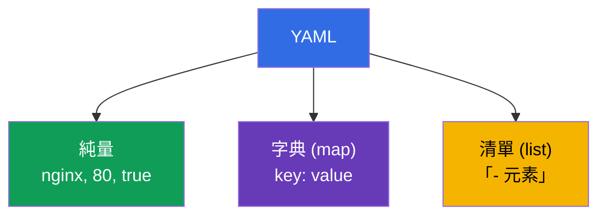
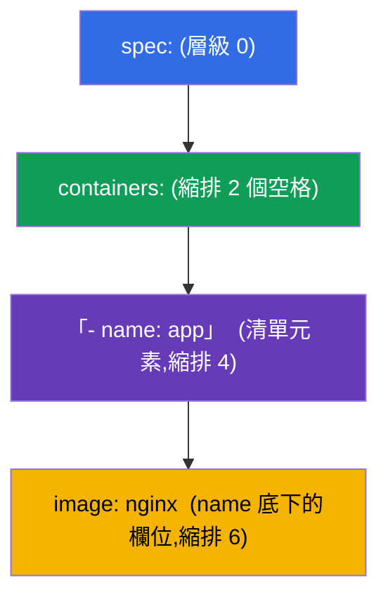
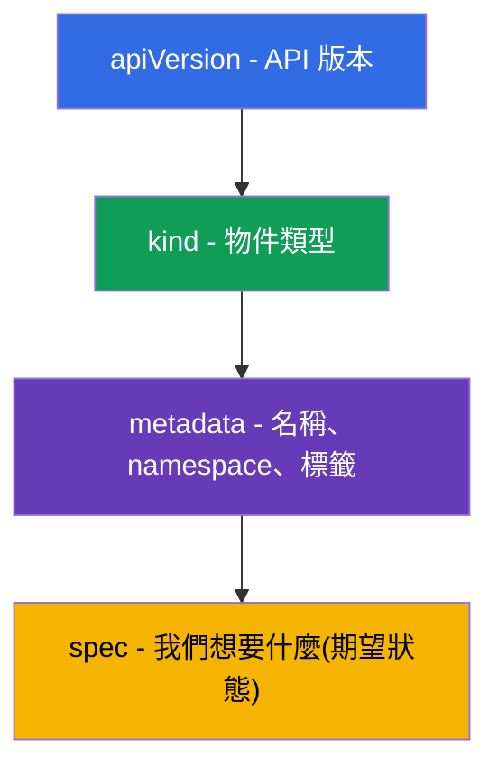

[Русская версия](ru.md) · [Eng version](README.md) · [Versión en español](es.md) · [Version française](fr.md) · [Deutsche Version](de.md) · [ქართული ვერსია](ge.md) · [日本語版](jp.md)

# 第 0.6 章。從零開始的 YAML:縮排、清單、字典與 Kubernetes manifest

> **這一章適合誰。** 第 0 部分,地基。Kubernetes 裡的一切都用 **YAML** 描述:
> Pod、Deployment、Service、ConfigMap - 這些都是 YAML manifest。如果你已能穩穩地
> 從縮排讀出巢狀結構,也分得清清單與字典 - 那就直接前往第 0.7 章。但如果
> YAML 對你來說還是「一堆空格,而且總有地方會壞掉」- 這一章會替你移除
> CKAD 新手最大的那道障礙:manifest 裡大部分的錯誤都不是 Kubernetes 的問題,而是
> 縮排不對,或是把清單和字典搞混了。

## 0.6.1. 為什麼需要 YAML,它到底是什麼

**YAML** - 一種給人閱讀的資料描述格式。Kubernetes 接受 YAML 格式的
manifest(也接受 JSON,但幾乎都是寫 YAML)。想法是:你用**宣告式**的方式
描述物件的期望狀態,而叢集把它建立出來。


## 0.6.2. YAML 的三大支柱:純量、字典、清單

YAML 由三種東西組成:

- **純量(scalar)** - 簡單的值:字串、數字、布林值(`nginx`、`80`、`true`)。
- **字典(map)** - `key: value` 的配對(請注意冒號後面要有一個**空格**
  這件事)。
- **清單(list)** - 一個個元素,每個元素以連字號 `-` 開頭。

```yaml
# 字典:鍵與值的配對
name: web
replicas: 3
enabled: true

# 簡單值的清單
ports:
  - 80
  - 443

# 字典的清單(Kubernetes 中很常見的情況)
containers:
  - name: app
    image: nginx
  - name: sidecar
    image: busybox
```



## 0.6.3. 縮排就是結構(最重要的規則)

在 YAML 中,**巢狀結構是由空格縮排決定的**,而不是括號。這正是新手幾乎
所有錯誤的來源。

鐵則:

- **只能用空格,絕對不要用 Tab。** Tab = 解析錯誤。
- 通常每一層巢狀縮排 **2 個空格**(Kubernetes 就是這個慣例)。
- 同一層的元素要**對齊得一模一樣**。

```yaml
spec:
  containers:        # 比 spec 往右 2 個空格
    - name: app      # containers 裡面的清單元素
      image: nginx   # 元素的欄位對齊在 name 底下
```



> **陷阱 #1。** 把某一行移動了一個空格 - 欄位就「跑」到別的物件裡去了。
> Kubernetes 要嘛拒絕這份 manifest,要嘛(更糟)建立出不是你原本想要的東西。

## 0.6.4. 清單對比字典:哪裡要 `-`,哪裡不要

最常見的混淆。規則很簡單:

- 如果某個鍵底下是**多個同類型的元素** - 那就是**清單**,每一個都帶
  `-`;
- 如果某個鍵底下是**一組具名的欄位** - 那就是**字典**,不帶 `-`。

```yaml
# containers - 清單(容器可以有很多個)→ 帶連字號
containers:
  - name: app
    image: nginx

# resources - 字典(具名欄位)→ 不帶連字號
resources:
  requests:
    cpu: 100m
    memory: 64Mi
```

`env` 是很有代表性的例子:它是**字典的清單**,每個變數都是獨立的
元素,帶有 `name`/`value` 欄位:

```yaml
env:
  - name: APP_COLOR
    value: blue
  - name: APP_MODE
    value: prod
```

## 0.6.5. 任何 Kubernetes manifest 的解剖結構

幾乎每一個 Kubernetes 物件都有同樣的四個最上層欄位:

```yaml
apiVersion: v1          # API 版本(物件用哪一種「語言」)
kind: Pod               # 物件類型
metadata:               # 名稱、namespace、標籤
  name: web
  labels:
    app: web
spec:                   # 期望狀態(最大的一塊)
  containers:
    - name: web
      image: nginx:1.27
      ports:
        - containerPort: 80
```



記住這四個欄位(`apiVersion`、`kind`、`metadata`、`spec`)之後,你就認得
任何 manifest 的結構 - 變的只有 `spec` 的內容。

## 0.6.6. 一個檔案中放多個物件:`---`

分隔符 `---` 讓你可以在同一個檔案裡描述多個物件(例如 PV +
PVC + Pod 一次寫完):

```yaml
apiVersion: v1
kind: ConfigMap
metadata:
  name: cfg
data:
  color: blue
---
apiVersion: v1
kind: Pod
metadata:
  name: web
spec:
  containers:
    - name: web
      image: nginx
```

`kubectl apply -f file.yaml` 會建立兩個物件。這對實驗和考試很方便,
相關的資源可以放在一起。

## 0.6.7. 不要從零開始寫:生成與檢查

考試時 YAML **不是用手敲出來的** - 而是用命令式的方式生成再修改:

```bash
# 生成 manifest 的雛形,但不建立物件
kubectl run web --image=nginx --dry-run=client -o yaml > pod.yaml

# 建立 deployment 的雛形
kubectl create deployment api --image=nginx --dry-run=client -o yaml > dep.yaml

# 套用並檢查
kubectl apply -f pod.yaml
kubectl explain pod.spec.containers   # 到底有哪些欄位可用
```

有用的習慣:
- `--dry-run=client -o yaml` - 黃金技巧:快速拿到骨架,不用手動排縮排。
- `kubectl explain <路徑>` - 直接從叢集查物件欄位的說明。
- apply 出錯時要讀訊息:它會指出有問題的行號/欄位。

## 0.6.8. 這在生產環境中如何應用

- **GitOps 與版本控管。** manifest 存放在 Git 中;變更經過 review 之後
  自動推出(Argo CD、Flux)。YAML 就是基礎設施的「原始碼」。
- **模板化。** 給不同環境用的同類型 manifest 不是複製貼上,而是用
  Helm(第 42 章)或 Kustomize(第 43 章)生成 - 免得手工繁殖一堆 YAML。
- **套用前先驗證。** 在 CI 中會用 linter 和 `kubectl apply
  --dry-run=server` 檢查 manifest,在進叢集之前就抓出縮排與 schema 的錯誤。
- **可讀性比簡短更重要。** YAML 裡清楚的名稱、標籤和註解,正是
  可維護的設定與「不敢碰的魔法」之間的分界。

## 0.6.9. 迷你詞彙表

- **YAML** - 人類可讀的資料描述格式;manifest 的主要語言。
- **純量(scalar)** - 簡單的值(字串、數字、布林值)。
- **字典(map)** - 一組 `key: value` 配對。
- **清單(list)** - 一連串元素,每個都帶 `-`。
- **縮排** - 用來表示巢狀的空格(只能用空格,通常 2 個)。
- **apiVersion / kind / metadata / spec** - 任何物件的四個最上層欄位。
- **`---`** - 同一個檔案中多個物件的分隔符。
- **`--dry-run=client -o yaml`** - 生成 manifest,但不建立物件。
- **`kubectl explain`** - 物件欄位的說明。

## 0.6.10. 本章總結

- YAML 描述物件的期望狀態;`kubectl apply -f` 在叢集中把它們建立出來。
- 三大支柱:純量、字典(`key: value`)、清單(帶 `-` 的元素)。
- 巢狀由**空格縮排**決定(絕不用 Tab,通常 2 個空格)- 這正是
  大部分錯誤的來源。
- 清單 - 元素有很多個時用(帶 `-`);字典 - 具名欄位(不帶 `-`);`env` -
  字典的清單。
- 任何物件都有 `apiVersion`、`kind`、`metadata`、`spec` - 主要改變的是
  `spec`。
- `---` 在檔案中分隔多個物件。
- 考試時 YAML 是生成(`--dry-run=client -o yaml`)並檢查
  (`kubectl explain`)的,不是用手寫的。

## 0.6.11. 這些用在哪裡:考試中與實際工作中

**在考試中(CKAD/CKA)。** 每一道題目都是建立或修改 manifest。能不能
瞬間用 `--dry-run` 生成骨架、並且沒有錯誤地把縮排調好,直接
影響速度。把清單/字典搞混,或用 Tab 取代空格,是最令人扼腕的
失分,而這一章就是教你避開它。

**在實際工作中。** YAML 就是基礎設施的原始碼:GitOps、review、Helm/Kustomize
的模板化。乾淨好讀的 manifest 是可維護平台的基礎。

## 0.6.12. 自我檢查問題

1. 純量與字典、清單有什麼不同?各舉一個例子。
2. YAML 中巢狀是怎麼表示的,為什麼不能使用 Tab?
3. 什麼時候欄位寫成清單(帶 `-`),什麼時候寫成字典(不帶 `-`)?
4. 為什麼 `env` 是字典的清單?寫一個含兩個變數的例子。
5. 說出任何 Kubernetes manifest 的四個最上層欄位。
6. 為什麼需要 `---`,以及 `--dry-run=client -o yaml` 做什麼?

## 實務練習

第 0 部分沒有獨立的實驗。YAML 你在每一個實驗中都會寫、都會生成,
從 101(基礎)和 119-122 的速度操練開始。接下來 - 容器和 Pod
是如何接上節點網路的:network namespaces 與 veth。

---
[目錄](../README_TW.md) · [第 0.5 章](../00-5-linux/tw.md) · [第 0.7 章](../00-7-netns/tw.md)
