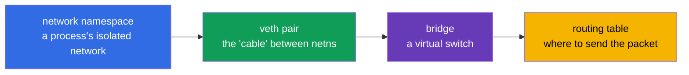
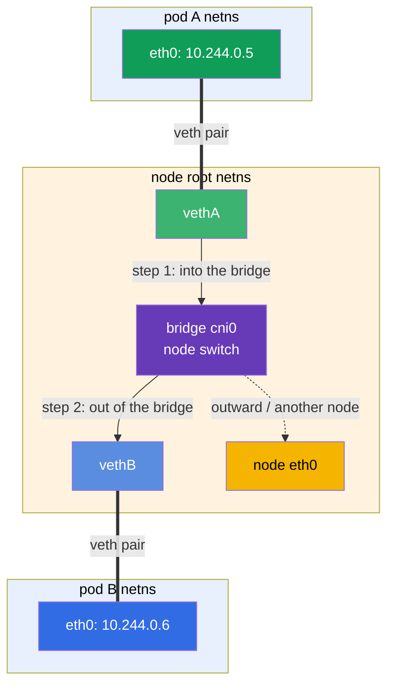
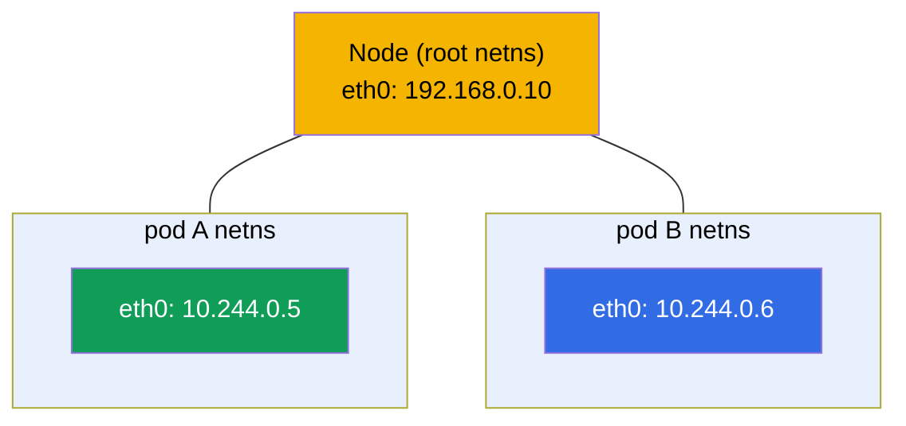
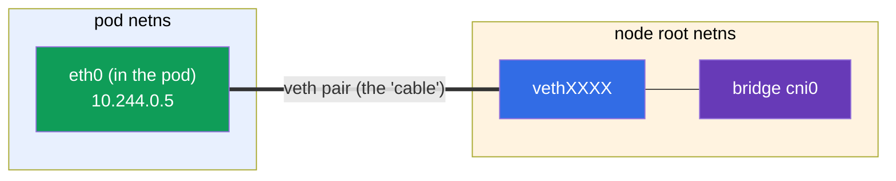
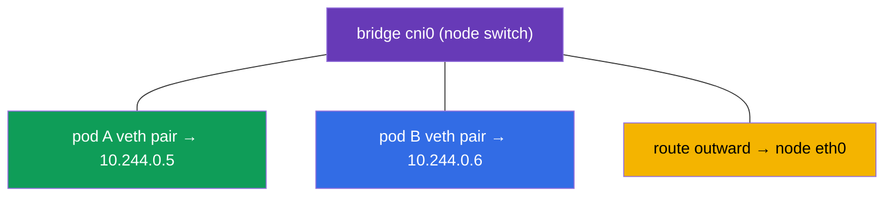
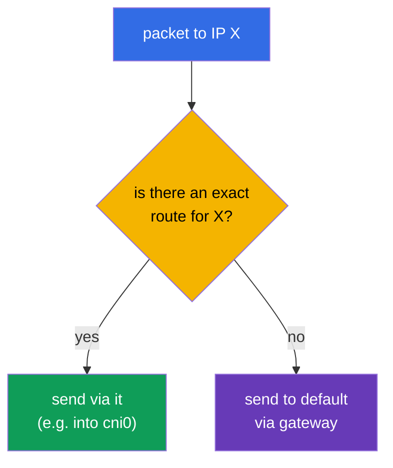
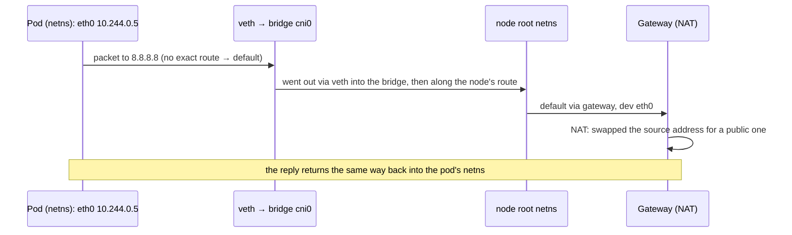

[Русская версия](ru.md) · [Versión en español](es.md) · [Version française](fr.md) · [Deutsche Version](de.md) · [ქართული ვერსია](ge.md)

# Chapter 0.7. Linux networking under the hood: network namespaces, veth, and routing

> **Who this chapter is for.** We're wrapping up Part 0. In Chapter 0.1 we covered IP,
> ports, CIDR, and NAT "from above". Now let's look one level deeper - how a packet
> actually travels inside Linux and **how a container gets its own network**. This is
> the very mechanism that CNI (Chapter 40), pod networking (Chapter 30), and network
> troubleshooting stand on. If you already know what a network namespace, a veth pair,
> and a routing table are - go to Chapter 1. If not - this chapter turns the "magic of
> CNI" into a clear engineering picture.

## 0.7.1. Why a beginner needs this

When in Chapter 30 you read "CNI creates the pod network, each pod gets its own network
namespace and a veth in the bridge", it should be a picture, not an incantation. And in
lab 123 (installing CNI by hand) and when debugging "pods can't see each other" you'll
be looking at exactly these entities: namespaces, interfaces, routes.



While these are still unfamiliar words - here is their meaning in one line each (we'll
cover them in detail in 0.7.2-0.7.5), so the phrase "a veth in the bridge" stops being
an incantation:

- **network namespace** (shortened to **netns** in diagrams and commands) - "a separate
  network inside a single machine": a process has its own interfaces, IP, and routes, as
  if it were a separate computer.
- **veth pair** - a virtual "network cable" made of two ends: one end inside the pod, the
  other on the node; what goes into one end comes out of the other.
- **bridge** - a virtual network switch inside the node: the veth ends of all pods are
  plugged into it, and pods talk to each other through it.
- **"a veth in the bridge"** - means "the second end of the pod's cable is plugged into
  this switch"; that's exactly how a pod connects to the node's shared network (analogy:
  a patch cord from a computer into a switch port).
- **routing table** - the rules "which packet to send out which interface".

The whole analogy: a pod is a room with its own socket (namespace), veth is a cable out
of the room, the bridge is a switch in the hallway where the cables of all the rooms
meet, and the routing table is a signpost telling which wire to send the letter down.

And here is how these entities come together into **network communication** between two
pods on the same node. A packet from pod A goes down its veth pair into the node's
bridge, and from there down pod B's veth pair - exactly like two computers connected
through a single switch (path details in 0.7.6):



## 0.7.2. Network namespace: a separate network inside a single machine

A **network namespace** is a Linux kernel mechanism that gives a process its **own
network stack**: its own interfaces, its own IPs, its own routing table, its own
`/etc/resolv.conf`. This is the very "container network isolation" from Chapter 0.4.

- The host has a **root** (default) namespace - the node's "real" network.
- Each container/pod runs in **its own** network namespace - it sees only its own
  interfaces and doesn't see others'.

```bash
ip netns list                    # list of network namespaces
sudo ip netns exec <ns> ip addr  # run a command inside a namespace
```



An important link to Chapter 4: containers **of the same pod** share **one** network
namespace - that's why they communicate over `localhost` and see the pod's shared IP.
This namespace is held by the utility **pause container** (Chapter 40).

## 0.7.3. veth pair: a "network cable" between namespaces

A namespace is isolated - so how does a packet get out of it? Through a **veth pair**
(virtual ethernet): two virtual interfaces connected like the ends of one cable. What
goes into one end comes out of the other.



One end is placed **inside** the pod's namespace (seen as its `eth0`), the other - in the
node's root namespace, and connected to the bridge. That's how a packet from the pod
reaches the node's network.

## 0.7.4. Bridge: the node's virtual switch

A **bridge** (e.g. `cni0`) is a software switch inside the node. The veth ends of all the
node's pods are connected to it, so pods **on the same node** communicate with each other
through the bridge, like devices in one switch.



And how does a packet reach a pod on **another** node? That's already the job of the CNI
plugin (Calico, Flannel, etc., Chapter 30): it sets up routes between nodes (or
tunnels/overlay) so that the Pod CIDR ranges of different nodes are reachable. Hence the
rule from Chapter 0.1: the pod network is flat, with no NAT inside the cluster.

## 0.7.5. Routing table: where to send the packet

Every namespace (and the host) has a **routing table** - the rules "for such-and-such a
network, send it there". You view it like this:

```bash
ip route                         # routing table of the current namespace
ip route get 8.8.8.8             # which route a packet to 8.8.8.8 would take
```

A typical output and how to read it:

```text
default via 192.168.0.1 dev eth0      # everything "unknown" → default gateway
10.244.0.0/24 dev cni0                # the node's pod network → into the bridge
192.168.0.0/24 dev eth0               # the node's local network → directly
```

- **`default via <gateway>`** - the default route: where to send a packet if there is no
  more specific rule for its address (usually outward through the gateway, where the NAT
  from Chapter 0.1 runs).
- A more **specific** route (longer prefix) wins over `default`.



## 0.7.6. How it all fits together: a packet's path from pod to the outside

Let's put it all together - what happens when a pod sends a request to the internet:



This is the "under the hood" of what Chapter 30 calls the pod network: the namespace
gives isolation, veth - the exit, the bridge - connectivity inside the node, the routes -
direction, NAT - the way out.

## 0.7.7. How this is applied in production

- **CNI does this automatically.** Namespaces/veth/bridge aren't configured by hand - the
  CNI plugin creates them for a pod at startup. But understanding the mechanism is
  essential for debugging: "a pod with no network" often = a CNI/routing problem.
- **Network diagnosis is at the level of interfaces and routes.** When "pods can't see
  each other", you look at `ip route`, interfaces, the bridge, the CNI agent on the nodes
  (lab 123, Chapter 46), not just Kubernetes manifests.
- **Overlay vs routing.** CNIs connect nodes in different ways: overlay (VXLAN,
  encapsulation) is simpler but has overhead; pure routing (BGP in Calico) is faster. The
  choice affects performance (Chapter 30).
- **hostNetwork and ports.** A pod with `hostNetwork: true` lives in the node's root
  namespace and uses its interfaces directly - sometimes needed, but it removes
  isolation.

## 0.7.8. Mini-glossary

- **network namespace** (short **netns**) - a process's isolated network stack (its own
  interfaces, IP, routes).
- **root (default) namespace** - the node's "real" network.
- **veth pair** - two linked virtual interfaces (a cable between namespaces).
- **bridge (cni0)** - the node's software switch, linking the pods on it.
- **pause container** - holds the pod's network namespace (Chapter 40).
- **routing table** - the rules "for such a network - there"; view with `ip route`.
- **default route** - the default route through the gateway for "unknown" addresses.
- **overlay** - a network with packet encapsulation between nodes (VXLAN).

## 0.7.9. Chapter summary

- A network namespace gives a process/container its own network stack; containers of one
  pod share a single namespace (hence the shared IP and `localhost`).
- A veth pair connects the pod's namespace to the node's root namespace - "the cable
  out".
- The bridge (cni0) links the pods of one node, like a switch; connectivity between nodes
  is set up by CNI (routes or overlay).
- The routing table decides where to send a packet: a specific route wins over `default
  via gateway`; outbound traffic exits through NAT (Chapter 0.1).
- CNI does all of this automatically, but you need to understand the mechanism to debug
  the network (lab 123, Chapters 30, 46).

## 0.7.10. How this helps: on the exam and in real work

**On the exam (CKA).** There are no direct "configure veth" tasks, but without this model
you can't understand pod networking (Chapter 30), CNI installation (lab 123), and network
troubleshooting (30%). When a node is `NotReady` because CNI is missing or pods won't
connect, you know where to look: interfaces, `ip route`, the bridge, the CNI agent.

**In real work.** Investigating network incidents, choosing and configuring a CNI,
understanding overlay/BGP, `hostNetwork` - all of it rests on this low-level picture. It
separates "I'll reinstall CNI and hope" from deliberate diagnosis.

## 0.7.11. Self-check questions

1. What does a network namespace give a process, and how does it relate to container
   isolation?
2. Why do containers of one pod communicate over `localhost`?
3. What is a veth pair for and where are its ends placed?
4. What does the bridge `cni0` do and who connects the pods of different nodes?
5. How do you read a routing table and what is `default via`?
6. Describe a packet's path from a pod to the internet and where NAT kicks in.

## Practice

This is the last "theoretical" chapter of the zero foundation. You'll see the mechanism
hands-on in lab 123 (installing CNI from scratch, inspecting interfaces and routes) and
in network troubleshooting (Chapter 46). What's left is the short practical Chapter 0.8
about the vim editor - and then the main course.

---
[Contents](../README.md) · [Chapter 0.6](../00-6-yaml/README.md) · [Chapter 0.8](../00-8-vim/README.md)
