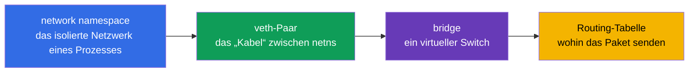
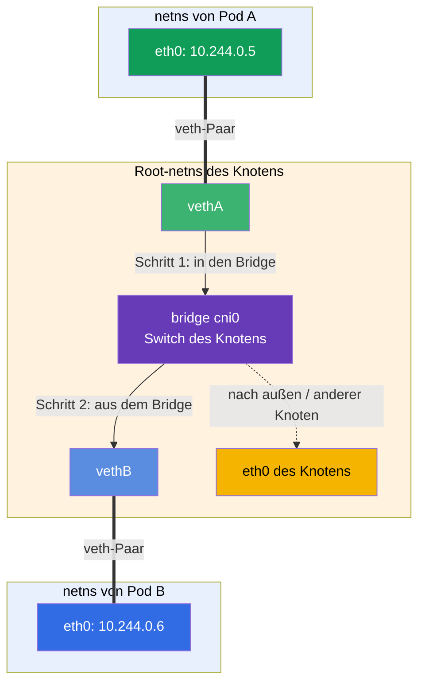
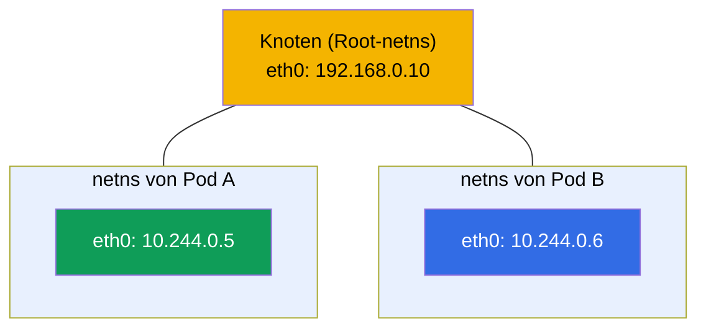
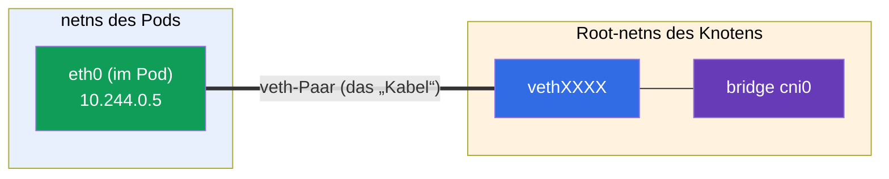
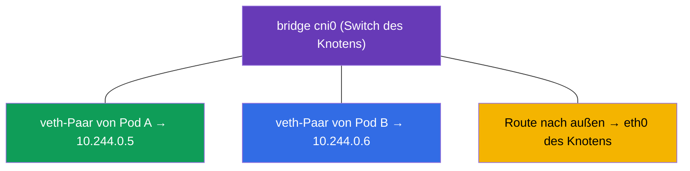
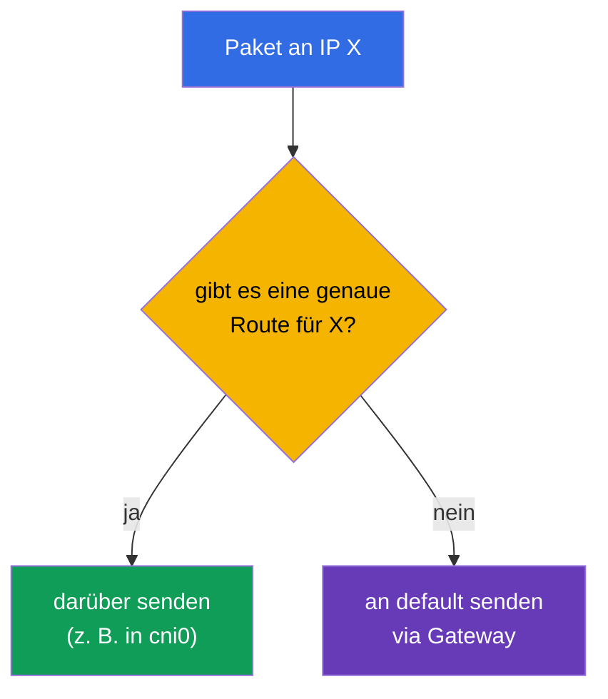
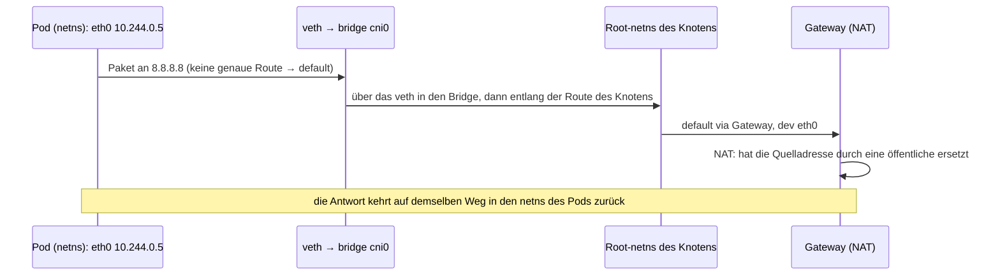

[Русская версия](ru.md) · [Eng version](README.md) · [Versión en español](es.md) · [Version française](fr.md) · [ქართული ვერსია](ge.md) · [繁體中文版](tw.md) · [日本語版](jp.md)

# Kapitel 0.7. Linux-Netzwerk unter der Haube: network namespaces, veth und Routing

> **Für wen dieses Kapitel ist.** Wir schließen Teil 0 ab. In Kapitel 0.1 haben wir IP,
> Ports, CIDR und NAT „von oben“ behandelt. Schauen wir nun eine Ebene tiefer - wie ein
> Paket tatsächlich innerhalb von Linux reist und **wie ein Container sein eigenes
> Netzwerk erhält**. Das ist genau der Mechanismus, auf dem CNI (Kapitel 40), das
> Pod-Netzwerk (Kapitel 30) und das Netzwerk-Troubleshooting stehen. Wenn Sie bereits
> wissen, was ein network namespace, ein veth-Paar und eine Routing-Tabelle sind - gehen
> Sie zu Kapitel 1. Wenn nicht - dieses Kapitel verwandelt die „Magie von CNI“ in ein
> verständliches technisches Schema.

## 0.7.1. Warum ein Einsteiger das braucht

Wenn Sie in Kapitel 30 lesen „CNI erstellt das Pod-Netzwerk, jeder Pod erhält seinen
eigenen network namespace und ein veth im Bridge“, sollte das ein Bild sein und keine
Zauberformel. Und in Übung 123 (CNI von Hand installieren) und bei der Analyse von „Pods
sehen einander nicht“ betrachten Sie genau diese Entitäten: Namespaces, Interfaces,
Routen.



Solange diese Wörter noch unbekannt sind - hier ihre Bedeutung in je einer Zeile (im
Detail in 0.7.2-0.7.5), damit der Satz „ein veth im Bridge“ keine Zauberformel mehr ist:

- **network namespace** (in Diagrammen und Befehlen zu **netns** abgekürzt) - „ein
  separates Netzwerk innerhalb einer einzelnen Maschine“: der Prozess hat eigene
  Interfaces, IP und Routen, als wäre er ein separater Computer.
- **veth-Paar** - ein virtuelles „Netzwerkkabel“ aus zwei Enden: ein Ende im Pod, das
  andere auf dem Knoten; was in das eine Ende hineingeht, kommt aus dem anderen heraus.
- **bridge (Brücke)** - ein virtueller Netzwerk-Switch innerhalb des Knotens: in ihn
  werden die veth-Enden aller Pods gesteckt, und die Pods kommunizieren über ihn
  miteinander.
- **„ein veth im Bridge“** - bedeutet „das zweite Ende des Pod-Kabels ist in diesen Switch
  gesteckt“; genau so wird ein Pod an das gemeinsame Netzwerk des Knotens angeschlossen
  (Analogie: ein Patchkabel vom Computer in einen Switch-Port).
- **Routing-Tabelle** - die Regeln „welches Paket über welches Interface senden“.

Die Analogie als Ganzes: ein Pod ist ein Raum mit eigener Steckdose (Namespace), das veth
ist das Kabel aus dem Raum, der Bridge ist der Switch im Flur, wo die Kabel aller Räume
zusammenlaufen, und die Routing-Tabelle ist das Schild, das angibt, über welche Leitung
der Brief geschickt wird.

Und so fügen sich diese Entitäten zur **Netzwerkkommunikation** zweier Pods auf demselben
Knoten zusammen. Ein Paket von Pod A geht über sein veth-Paar in den Bridge des Knotens und
von dort über das veth-Paar von Pod B - genau wie zwei Computer, die über einen einzigen
Switch verbunden sind (Details des Wegs in 0.7.6):



## 0.7.2. Network namespace: ein separates Netzwerk innerhalb einer einzelnen Maschine

Ein **network namespace** ist ein Mechanismus des Linux-Kernels, der einem Prozess seinen
**eigenen Netzwerkstack** gibt: eigene Interfaces, eigene IPs, eigene Routing-Tabelle,
eigene `/etc/resolv.conf`. Das ist genau die „Netzwerk-Isolation des Containers“ aus
Kapitel 0.4.

- Der Host hat einen **Root**-Namespace (default) - das „echte“ Netzwerk des Knotens.
- Jeder Container/Pod läuft in **seinem eigenen** network namespace - er sieht nur seine
  eigenen Interfaces und nicht die der anderen.

```bash
ip netns list                    # Liste der network namespaces
sudo ip netns exec <ns> ip addr  # einen Befehl innerhalb eines Namespace ausführen
```



Eine wichtige Verbindung zu Kapitel 4: die Container **eines Pods** teilen sich **einen**
network namespace - deshalb kommunizieren sie über `localhost` und sehen die gemeinsame IP
des Pods. Diesen Namespace hält der Dienst-**pause-Container** (Kapitel 40).

## 0.7.3. veth-Paar: ein „Netzwerkkabel“ zwischen Namespaces

Der Namespace ist isoliert - wie kommt ein Paket dann aus ihm heraus? Über ein
**veth-Paar** (virtual ethernet): zwei virtuelle Interfaces, verbunden wie die Enden eines
Kabels. Was in das eine Ende hineingeht, kommt aus dem anderen heraus.



Ein Ende wird **innerhalb** des Namespace des Pods platziert (sichtbar als sein `eth0`),
das andere - im Root-Namespace des Knotens und an den Bridge angeschlossen. So gelangt das
Paket vom Pod ins Netzwerk des Knotens.

## 0.7.4. Bridge: der virtuelle Switch des Knotens

Der **bridge** (Brücke, z. B. `cni0`) ist ein Software-Switch innerhalb des Knotens. An
ihn sind die veth-Enden aller Pods des Knotens angeschlossen, deshalb kommunizieren Pods
**auf demselben Knoten** über den Bridge miteinander, wie Geräte in einem Switch.



Und wie gelangt ein Paket zu einem Pod auf **einem anderen** Knoten? Das ist bereits die
Aufgabe des CNI-Plugins (Calico, Flannel usw., Kapitel 30): es richtet Routen zwischen den
Knoten ein (oder Tunnel/Overlay), damit die Pod-CIDR-Bereiche verschiedener Knoten
erreichbar sind. Daher die Regel aus Kapitel 0.1: das Pod-Netzwerk ist flach, ohne NAT
innerhalb des Clusters.

## 0.7.5. Routing-Tabelle: wohin das Paket senden

Jeder Namespace (und der Host) hat eine **Routing-Tabelle** - die Regeln „ein Paket für ein
bestimmtes Netzwerk sende dorthin“. Man sieht sie so ein:

```bash
ip route                         # Routing-Tabelle des aktuellen Namespace
ip route get 8.8.8.8             # welche Route ein Paket zu 8.8.8.8 nimmt
```

Typische Ausgabe und wie man sie liest:

```text
default via 192.168.0.1 dev eth0      # alles „Unbekannte“ → Standard-Gateway
10.244.0.0/24 dev cni0                # das Pod-Netzwerk des Knotens → in den Bridge
192.168.0.0/24 dev eth0               # das lokale Netzwerk des Knotens → direkt
```

- **`default via <Gateway>`** - die Standardroute: wohin ein Paket senden, wenn es für
  seine Adresse keine genauere Regel gibt (meist nach außen über das Gateway, wo das NAT
  aus Kapitel 0.1 läuft).
- Eine **spezifischere** Route (längeres Präfix) gewinnt gegen `default`.



## 0.7.6. Wie alles zusammenpasst: der Weg eines Pakets vom Pod nach außen

Fügen wir alles zusammen - was passiert, wenn ein Pod eine Anfrage ins Internet sendet:



Das ist das „unter der Haube“ dessen, was Kapitel 30 das Pod-Netzwerk nennt: der Namespace
gibt Isolation, das veth - den Ausgang, der Bridge - die Verbindung innerhalb des Knotens,
die Routen - die Richtung, NAT - den Weg nach außen.

## 0.7.7. Wie das in der Produktion angewendet wird

- **CNI macht das automatisch.** Namespace/veth/bridge werden nicht von Hand konfiguriert -
  das CNI-Plugin erstellt sie für den Pod beim Start. Aber den Mechanismus zu verstehen ist
  für das Debugging notwendig: „ein Pod ohne Netzwerk“ = oft ein CNI-/Routing-Problem.
- **Die Netzwerkdiagnose läuft auf Ebene der Interfaces und Routen.** Wenn „Pods einander
  nicht sehen“, betrachtet man `ip route`, die Interfaces, den Bridge, den CNI-Agenten auf
  den Knoten (Übung 123, Kapitel 46), nicht nur die Kubernetes-Manifeste.
- **Overlay vs Routing.** CNIs verbinden die Knoten auf unterschiedliche Weise: Overlay
  (VXLAN, Kapselung) ist einfacher, aber mit Overhead; reines Routing (BGP bei Calico) ist
  schneller. Die Wahl beeinflusst die Performance (Kapitel 30).
- **hostNetwork und Ports.** Ein Pod mit `hostNetwork: true` lebt im Root-Namespace des
  Knotens und nutzt dessen Interfaces direkt - manchmal nötig, hebt aber die Isolation auf.

## 0.7.8. Mini-Glossar

- **network namespace** (kurz **netns**) - der isolierte Netzwerkstack eines Prozesses
  (eigene Interfaces, IP, Routen).
- **Root-Namespace (default)** - das „echte“ Netzwerk des Knotens.
- **veth-Paar** - zwei verbundene virtuelle Interfaces (ein Kabel zwischen Namespaces).
- **bridge (cni0)** - der Software-Switch des Knotens, der die Pods auf ihm verbindet.
- **pause-Container** - hält den network namespace des Pods (Kapitel 40).
- **Routing-Tabelle** - die Regeln „für ein solches Netzwerk - dorthin“; einsehbar mit `ip
  route`.
- **default route** - die Standardroute über das Gateway für „unbekannte“ Adressen.
- **overlay** - ein Netzwerk mit Paketkapselung zwischen den Knoten (VXLAN).

## 0.7.9. Zusammenfassung des Kapitels

- Ein network namespace gibt einem Prozess/Container einen eigenen Netzwerkstack; die
  Container eines Pods teilen sich einen Namespace (daher die gemeinsame IP und
  `localhost`).
- Ein veth-Paar verbindet den Namespace des Pods mit dem Root-Namespace des Knotens - „das
  Kabel nach außen“.
- Der Bridge (cni0) verbindet die Pods eines Knotens, wie ein Switch; die Verbindung
  zwischen den Knoten richtet CNI ein (Routen oder Overlay).
- Die Routing-Tabelle entscheidet, wohin ein Paket gesendet wird: die spezifische Route
  gewinnt gegen `default via Gateway`; der ausgehende Verkehr geht über NAT (Kapitel 0.1).
- All das macht CNI automatisch, aber man muss den Mechanismus verstehen, um das Netzwerk
  zu debuggen (Übung 123, Kapitel 30, 46).

## 0.7.10. Wozu das nützt: in der Prüfung und im echten Arbeitsalltag

**In der Prüfung (CKA).** Es gibt keine direkten Aufgaben „konfiguriere veth“, aber ohne
dieses Modell versteht man das Pod-Netzwerk (Kapitel 30), die CNI-Installation (Übung 123)
und das Netzwerk-Troubleshooting (30 %) nicht. Wenn ein Knoten `NotReady` ist, weil CNI
fehlt, oder Pods sich nicht verbinden, wissen Sie, wo Sie hinschauen müssen: Interfaces, `ip
route`, der Bridge, der CNI-Agent.

**Im echten Arbeitsalltag.** Die Analyse von Netzwerkvorfällen, die Wahl und Konfiguration
eines CNI, das Verständnis von Overlay/BGP, `hostNetwork` - all das beruht auf diesem
Low-Level-Bild. Es trennt das „ich installiere CNI neu und hoffe“ von der bewussten
Diagnose.

## 0.7.11. Fragen zur Selbstüberprüfung

1. Was gibt ein network namespace einem Prozess und wie hängt das mit der Isolation des
   Containers zusammen?
2. Warum kommunizieren die Container eines Pods über `localhost`?
3. Wozu dient ein veth-Paar und wohin werden seine Enden gelegt?
4. Was macht der Bridge `cni0` und wer verbindet die Pods verschiedener Knoten?
5. Wie liest man eine Routing-Tabelle und was ist `default via`?
6. Beschreiben Sie den Weg eines Pakets vom Pod ins Internet und wo NAT einsetzt.

## Praxis

Das ist das letzte „theoretische“ Kapitel des Null-Fundaments. Den Mechanismus sehen Sie
praktisch in Übung 123 (CNI von Grund auf installieren, Interfaces und Routen inspizieren)
und im Netzwerk-Troubleshooting (Kapitel 46). Es bleibt das kurze praktische Kapitel 0.8
über den vim-Editor - und danach der Hauptkurs.

---
[Inhalt](../README_DE.md) · [Kapitel 0.6](../00-6-yaml/de.md) · [Kapitel 0.8](../00-8-vim/de.md)
