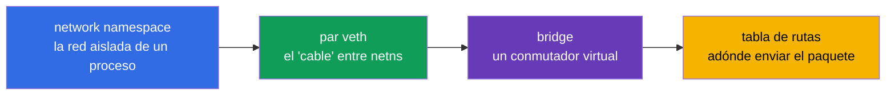
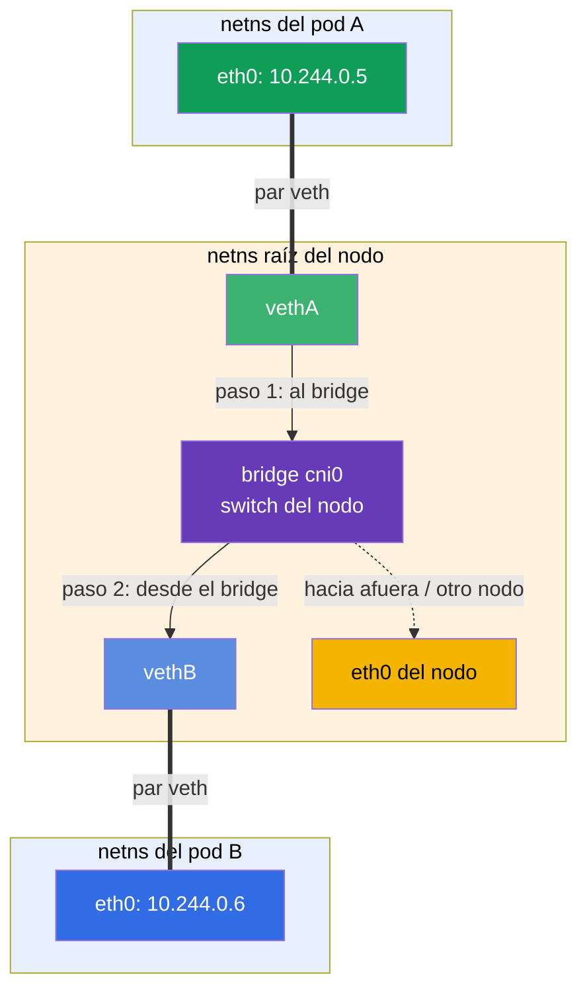
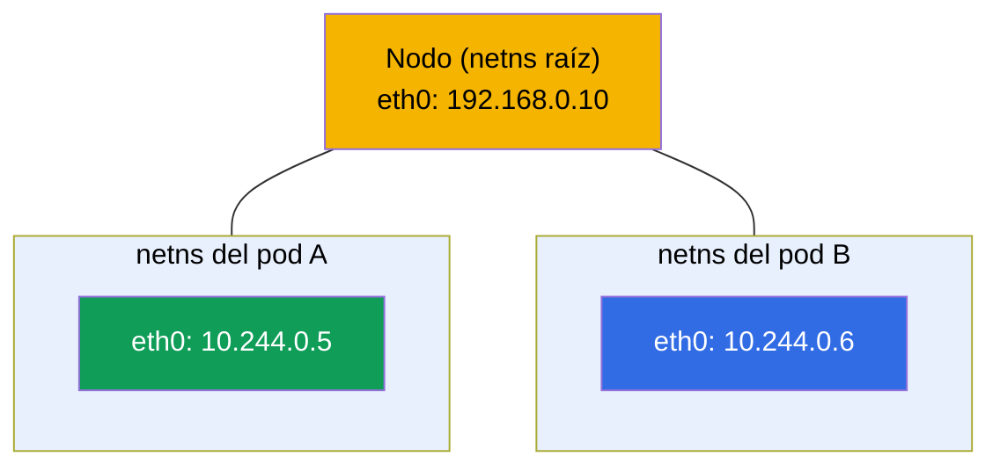
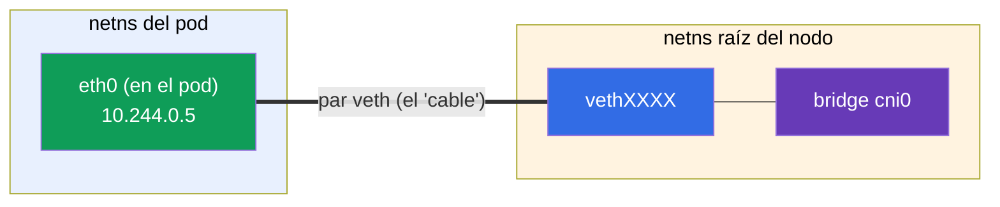
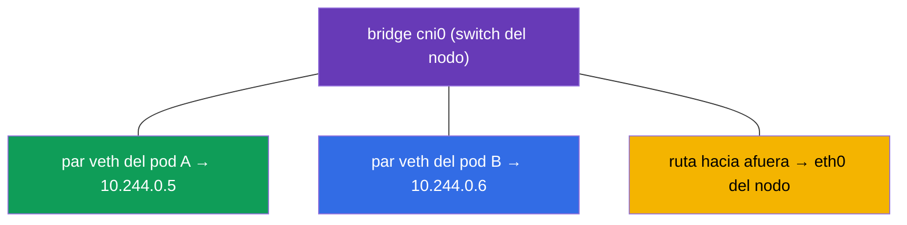
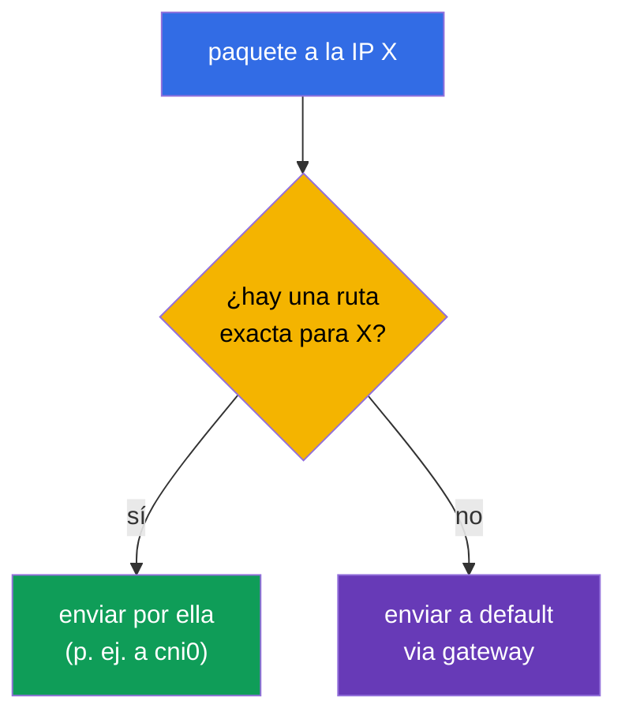
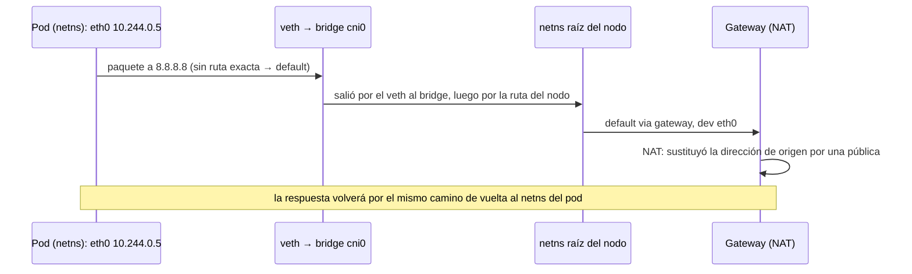

[Русская версия](ru.md) · [Eng version](README.md) · [Version française](fr.md) · [Deutsche Version](de.md) · [ქართული ვერსია](ge.md) · [繁體中文版](tw.md) · [日本語版](jp.md)

# Capítulo 0.7. La red de Linux por dentro: network namespaces, veth y enrutamiento

> **Para quién es este capítulo.** Cerramos la Parte 0. En el Capítulo 0.1 vimos IP,
> puertos, CIDR y NAT "desde arriba". Ahora bajemos un nivel - cómo viaja realmente un
> paquete dentro de Linux y **cómo un contenedor obtiene su propia red**. Este es el
> mismo mecanismo sobre el que se apoyan CNI (Capítulo 40), la red de pods (Capítulo 30)
> y la resolución de problemas de red. Si ya sabes qué es un network namespace, un par
> veth y una tabla de rutas - ve al Capítulo 1. Si no - este capítulo convierte la
> "magia de CNI" en un esquema de ingeniería comprensible.

## 0.7.1. Por qué un principiante necesita esto

Cuando en el Capítulo 30 leas "CNI crea la red de pods, cada pod obtiene su propio
network namespace y un veth en el bridge", eso debería ser una imagen y no un conjuro. Y
en la práctica 123 (instalar CNI a mano) y al analizar "los pods no se ven entre sí"
mirarás exactamente estas entidades: namespaces, interfaces, rutas.



Mientras estas palabras te resulten desconocidas - aquí está su significado en una línea
(lo veremos en detalle en 0.7.2-0.7.5), para que la frase "un veth en el bridge" deje de
ser un conjuro:

- **network namespace** (en los esquemas y comandos se abrevia como **netns**) - "una red
  aparte dentro de una sola máquina": el proceso tiene sus propias interfaces, IP y rutas,
  como si fuera un ordenador aparte.
- **par veth** - un "cable de red" virtual de dos extremos: un extremo dentro del pod, el
  otro en el nodo; lo que entra por un extremo sale por el otro.
- **bridge (puente)** - un conmutador de red virtual dentro del nodo: en él se conectan
  los extremos de los pares veth de todos los pods, y los pods se comunican entre sí a
  través de él.
- **"un veth en el bridge"** - significa "el segundo extremo del cable del pod está
  enchufado en este conmutador"; así es exactamente como un pod se conecta a la red común
  del nodo (analogía: un latiguillo desde el ordenador a un puerto del switch).
- **tabla de rutas** - las reglas "qué paquete enviar por qué interfaz".

La analogía completa: un pod es una habitación con su propia toma (namespace), el veth es
el cable que sale de la habitación, el bridge es el switch del pasillo donde confluyen los
cables de todas las habitaciones, y la tabla de rutas es el indicador que dice por qué
cable enviar la carta.

Y así es como estas entidades se combinan en la **comunicación de red** de dos pods en el
mismo nodo. Un paquete del pod A recorre su par veth hasta el bridge del nodo y desde ahí
por el par veth del pod B - exactamente como dos ordenadores conectados a través de un
único switch (detalles del camino en 0.7.6):



## 0.7.2. Network namespace: una red aparte dentro de una sola máquina

Un **network namespace** es un mecanismo del kernel de Linux que da a un proceso su
**propia pila de red**: sus propias interfaces, sus propias IP, su propia tabla de rutas,
su propio `/etc/resolv.conf`. Es el mismo "aislamiento de red del contenedor" del Capítulo
0.4.

- El host tiene un namespace **raíz** (default) - la red "de verdad" del nodo.
- Cada contenedor/pod se ejecuta en **su propio** network namespace - solo ve sus propias
  interfaces y no ve las ajenas.

```bash
ip netns list                    # lista de network namespaces
sudo ip netns exec <ns> ip addr  # ejecutar un comando dentro de un namespace
```



Un vínculo importante con el Capítulo 4: los contenedores **de un mismo pod** comparten
**un** network namespace - por eso se comunican a través de `localhost` y ven la IP común
del pod. Este namespace lo sostiene el **contenedor pause** de servicio (Capítulo 40).

## 0.7.3. Par veth: un "cable de red" entre namespaces

El namespace está aislado - entonces, ¿cómo sale de él un paquete hacia afuera? A través
de un **par veth** (virtual ethernet): dos interfaces virtuales conectadas como los
extremos de un mismo cable. Lo que entra por un extremo sale por el otro.



Un extremo se coloca **dentro** del namespace del pod (se ve como su `eth0`), el otro - en
el namespace raíz del nodo y se conecta al bridge. Así el paquete del pod llega a la red
del nodo.

## 0.7.4. Bridge: el conmutador virtual del nodo

El **bridge** (puente, p. ej. `cni0`) es un conmutador por software dentro del nodo. A él
se conectan los extremos de los pares veth de todos los pods del nodo, por eso los pods
**del mismo nodo** se comunican entre sí a través del bridge, como dispositivos en un
mismo switch.



¿Y cómo llega un paquete a un pod de **otro** nodo? Eso ya es tarea del plugin CNI
(Calico, Flannel, etc., Capítulo 30): configura rutas entre nodos (o túneles/overlay) para
que los rangos Pod CIDR de los distintos nodos sean alcanzables. De ahí la regla del
Capítulo 0.1: la red de pods es plana, sin NAT dentro del clúster.

## 0.7.5. Tabla de rutas: adónde enviar el paquete

Cada namespace (y el host) tiene una **tabla de enrutamiento** - las reglas "un paquete
para tal red envíalo por allá". Se consulta así:

```bash
ip route                         # tabla de rutas del namespace actual
ip route get 8.8.8.8             # por qué ruta irá un paquete a 8.8.8.8
```

Salida típica y cómo leerla:

```text
default via 192.168.0.1 dev eth0      # todo lo "desconocido" → gateway por defecto
10.244.0.0/24 dev cni0                # la red de pods del nodo → al bridge
192.168.0.0/24 dev eth0               # la red local del nodo → directamente
```

- **`default via <gateway>`** - la ruta por defecto: adónde enviar un paquete si no hay
  una regla más precisa para su dirección (normalmente hacia afuera a través del gateway,
  donde funciona el NAT del Capítulo 0.1).
- Una ruta más **concreta** (prefijo más largo) gana sobre `default`.



## 0.7.6. Cómo encaja todo: el camino de un paquete desde el pod hacia afuera

Juntémoslo todo - qué ocurre cuando un pod envía una petición a internet:



Esto es lo que hay "por dentro" de lo que en el Capítulo 30 se llama red de pods: el
namespace da aislamiento, el veth - la salida, el bridge - la conexión dentro del nodo,
las rutas - la dirección, el NAT - la salida hacia afuera.

## 0.7.7. Cómo se aplica esto en producción

- **CNI lo hace automáticamente.** Los namespace/veth/bridge no se configuran a mano - los
  crea para el pod el plugin CNI al arrancar. Pero entender el mecanismo es necesario para
  la depuración: "un pod sin red" a menudo = un problema de CNI/rutas.
- **El diagnóstico de red es a nivel de interfaces y rutas.** Cuando "los pods no se ven
  entre sí", se mira `ip route`, las interfaces, el bridge, el agente CNI en los nodos
  (práctica 123, Capítulo 46), no solo los manifiestos de Kubernetes.
- **Overlay vs enrutamiento.** Los CNI conectan los nodos de distintas maneras: overlay
  (VXLAN, encapsulación) es más simple pero con sobrecarga; el enrutamiento puro (BGP en
  Calico) es más rápido. La elección afecta al rendimiento (Capítulo 30).
- **hostNetwork y puertos.** Un pod con `hostNetwork: true` vive en el namespace raíz del
  nodo y usa sus interfaces directamente - a veces es necesario, pero quita el
  aislamiento.

## 0.7.8. Miniglosario

- **network namespace** (abrev. **netns**) - la pila de red aislada de un proceso (sus
  propias interfaces, IP, rutas).
- **namespace raíz (default)** - la red "de verdad" del nodo.
- **par veth** - dos interfaces virtuales enlazadas (un cable entre namespaces).
- **bridge (cni0)** - el conmutador por software del nodo, que enlaza los pods que hay en
  él.
- **contenedor pause** - sostiene el network namespace del pod (Capítulo 40).
- **tabla de rutas** - las reglas "para tal red - por allá"; se consulta con `ip route`.
- **default route** - la ruta por defecto a través del gateway para direcciones
  "desconocidas".
- **overlay** - una red con encapsulación de paquetes entre nodos (VXLAN).

## 0.7.9. Resumen del capítulo

- Un network namespace da al proceso/contenedor su propia pila de red; los contenedores de
  un mismo pod comparten un namespace (de ahí la IP común y `localhost`).
- Un par veth conecta el namespace del pod con el namespace raíz del nodo - "el cable
  hacia afuera".
- El bridge (cni0) enlaza los pods de un mismo nodo, como un conmutador; la conexión entre
  nodos la configura CNI (rutas u overlay).
- La tabla de rutas decide adónde enviar el paquete: la ruta concreta gana sobre `default
  via gateway`; el tráfico hacia afuera sale a través de NAT (Capítulo 0.1).
- Todo esto lo hace CNI automáticamente, pero hay que entender el mecanismo para depurar
  la red (práctica 123, Capítulos 30, 46).

## 0.7.10. Para qué sirve: en el examen y en el trabajo real

**En el examen (CKA).** No hay tareas directas de "configura veth", pero sin este modelo
no se entiende la red de pods (Capítulo 30), la instalación de CNI (práctica 123) ni la
resolución de problemas de red (30%). Cuando un nodo está `NotReady` por falta de CNI o
los pods no se conectan, sabes dónde mirar: interfaces, `ip route`, el bridge, el agente
CNI.

**En el trabajo real.** El análisis de incidentes de red, la elección y configuración de
CNI, entender overlay/BGP, `hostNetwork` - todo se apoya en esta imagen de bajo nivel.
Separa el "reinstalo CNI y a ver qué pasa" del diagnóstico consciente.

## 0.7.11. Preguntas de autoevaluación

1. ¿Qué le da a un proceso un network namespace y cómo se relaciona con el aislamiento del
   contenedor?
2. ¿Por qué los contenedores de un mismo pod se comunican a través de `localhost`?
3. ¿Para qué sirve un par veth y dónde se colocan sus extremos?
4. ¿Qué hace el bridge `cni0` y quién conecta los pods de distintos nodos?
5. ¿Cómo se lee una tabla de rutas y qué es `default via`?
6. Describe el camino de un paquete desde el pod hasta internet y dónde entra el NAT.

## Práctica

Este es el último capítulo "teórico" de la base cero. Verás el mecanismo con las manos en
la práctica 123 (instalar CNI desde cero, inspeccionar interfaces y rutas) y en la
resolución de problemas de red (Capítulo 46). Queda el breve capítulo práctico 0.8 sobre
el editor vim - y luego el curso principal.

---
[Índice](../README_ES.md) · [Capítulo 0.6](../00-6-yaml/es.md) · [Capítulo 0.8](../00-8-vim/es.md)
