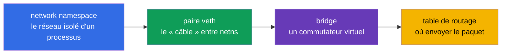
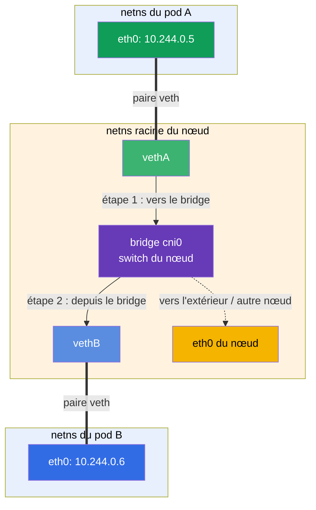
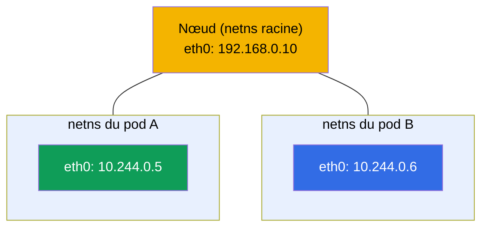
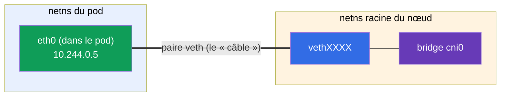
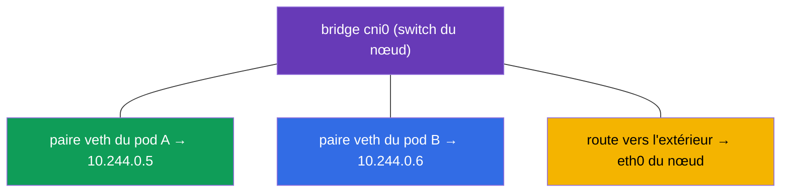
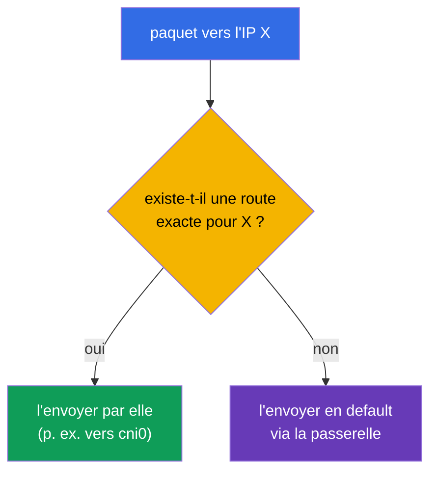
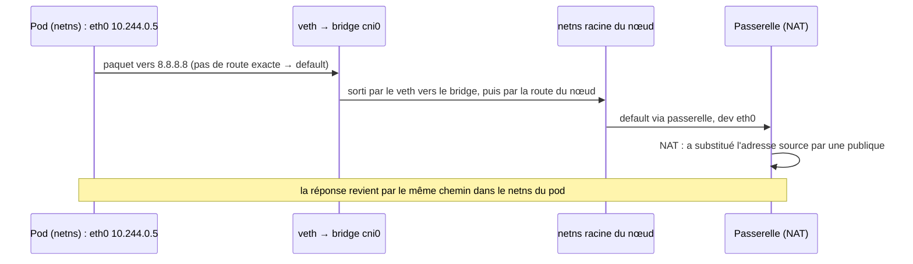

[Русская версия](ru.md) · [Eng version](README.md) · [Versión en español](es.md) · [Deutsche Version](de.md) · [ქართული ვერსია](ge.md) · [繁體中文版](tw.md) · [日本語版](jp.md)

# Chapitre 0.7. Le réseau Linux sous le capot : network namespaces, veth et routage

> **À qui s'adresse ce chapitre.** Nous clôturons la Partie 0. Au Chapitre 0.1, nous
> avons vu les IP, les ports, le CIDR et le NAT « d'en haut ». Descendons maintenant d'un
> niveau - comment un paquet circule réellement à l'intérieur de Linux et **comment un
> conteneur obtient son propre réseau**. C'est le mécanisme même sur lequel reposent le
> CNI (Chapitre 40), le réseau des pods (Chapitre 30) et le dépannage réseau. Si vous
> savez déjà ce qu'est un network namespace, une paire veth et une table de routage -
> allez au Chapitre 1. Sinon - ce chapitre transforme la « magie du CNI » en un schéma
> d'ingénierie compréhensible.

## 0.7.1. Pourquoi un débutant en a besoin

Quand, au Chapitre 30, vous lirez « le CNI crée le réseau des pods, chaque pod obtient son
propre network namespace et un veth dans le bridge », ce doit être une image et non une
incantation. Et dans le TP 123 (installer le CNI à la main) et en analysant « les pods ne
se voient pas », vous regarderez exactement ces entités : namespaces, interfaces, routes.



Tant que ces mots vous sont inconnus - voici leur sens en une ligne (nous les verrons en
détail en 0.7.2-0.7.5), pour que la phrase « un veth dans le bridge » cesse d'être une
incantation :

- **network namespace** (abrégé en **netns** dans les schémas et les commandes) - « un
  réseau à part au sein d'une seule machine » : le processus a ses propres interfaces, IP
  et routes, comme s'il s'agissait d'un ordinateur à part.
- **paire veth** - un « câble réseau » virtuel à deux extrémités : une extrémité dans le
  pod, l'autre sur le nœud ; ce qui entre par une extrémité ressort par l'autre.
- **bridge (pont)** - un commutateur réseau virtuel au sein du nœud : on y branche les
  extrémités des paires veth de tous les pods, et les pods communiquent entre eux à
  travers lui.
- **« un veth dans le bridge »** - signifie « la seconde extrémité du câble du pod est
  branchée dans ce commutateur » ; c'est ainsi qu'un pod se connecte au réseau commun du
  nœud (analogie : un cordon de brassage de l'ordinateur vers un port du switch).
- **table de routage** - les règles « quel paquet envoyer par quelle interface ».

L'analogie complète : un pod est une pièce avec sa propre prise (namespace), le veth est
le câble qui sort de la pièce, le bridge est le switch dans le couloir où convergent les
câbles de toutes les pièces, et la table de routage est le panneau indiquant par quel fil
envoyer la lettre.

Et voici comment ces entités s'assemblent en une **communication réseau** entre deux pods
sur le même nœud. Un paquet du pod A parcourt sa paire veth jusqu'au bridge du nœud et de
là par la paire veth du pod B - exactement comme deux ordinateurs reliés par un unique
switch (détails du chemin en 0.7.6) :



## 0.7.2. Network namespace : un réseau à part au sein d'une seule machine

Un **network namespace** est un mécanisme du noyau Linux qui donne à un processus sa
**propre pile réseau** : ses propres interfaces, ses propres IP, sa propre table de
routage, son propre `/etc/resolv.conf`. C'est la fameuse « isolation réseau du conteneur »
du Chapitre 0.4.

- L'hôte a un namespace **racine** (default) - le « vrai » réseau du nœud.
- Chaque conteneur/pod s'exécute dans **son propre** network namespace - il ne voit que
  ses propres interfaces et ne voit pas celles des autres.

```bash
ip netns list                    # liste des network namespaces
sudo ip netns exec <ns> ip addr  # exécuter une commande dans un namespace
```



Un lien important avec le Chapitre 4 : les conteneurs **d'un même pod** partagent **un**
network namespace - c'est pourquoi ils communiquent via `localhost` et voient l'IP commune
du pod. Ce namespace est maintenu par le **conteneur pause** de service (Chapitre 40).

## 0.7.3. Paire veth : un « câble réseau » entre namespaces

Le namespace est isolé - alors comment un paquet en sort-il ? Par une **paire veth**
(virtual ethernet) : deux interfaces virtuelles reliées comme les extrémités d'un même
câble. Ce qui entre par une extrémité ressort par l'autre.



Une extrémité est placée **à l'intérieur** du namespace du pod (vue comme son `eth0`),
l'autre - dans le namespace racine du nœud et branchée au bridge. C'est ainsi que le
paquet du pod atteint le réseau du nœud.

## 0.7.4. Bridge : le commutateur virtuel du nœud

Le **bridge** (pont, p. ex. `cni0`) est un commutateur logiciel au sein du nœud. Les
extrémités des paires veth de tous les pods du nœud y sont branchées, c'est pourquoi les
pods **d'un même nœud** communiquent entre eux via le bridge, comme des appareils dans un
même switch.



Et comment un paquet atteint-il un pod d'**un autre** nœud ? C'est déjà le travail du
plugin CNI (Calico, Flannel, etc., Chapitre 30) : il configure des routes entre les nœuds
(ou des tunnels/overlay) pour que les plages Pod CIDR des différents nœuds soient
joignables. D'où la règle du Chapitre 0.1 : le réseau des pods est plat, sans NAT à
l'intérieur du cluster.

## 0.7.5. Table de routage : où envoyer le paquet

Chaque namespace (et l'hôte) a une **table de routage** - les règles « un paquet pour tel
réseau, envoie-le par là ». On la consulte ainsi :

```bash
ip route                         # table de routage du namespace courant
ip route get 8.8.8.8             # par quelle route un paquet vers 8.8.8.8 partira
```

Sortie typique et comment la lire :

```text
default via 192.168.0.1 dev eth0      # tout ce qui est « inconnu » → passerelle par défaut
10.244.0.0/24 dev cni0                # le réseau des pods du nœud → vers le bridge
192.168.0.0/24 dev eth0               # le réseau local du nœud → directement
```

- **`default via <passerelle>`** - la route par défaut : où envoyer un paquet s'il n'y a
  pas de règle plus précise pour son adresse (en général vers l'extérieur par la
  passerelle, où fonctionne le NAT du Chapitre 0.1).
- Une route plus **spécifique** (préfixe plus long) l'emporte sur `default`.



## 0.7.6. Comment tout s'assemble : le chemin d'un paquet du pod vers l'extérieur

Rassemblons le tout - ce qui se passe quand un pod envoie une requête vers internet :



C'est le « sous le capot » de ce que le Chapitre 30 appelle le réseau des pods : le
namespace donne l'isolation, le veth - la sortie, le bridge - la connexion au sein du
nœud, les routes - la direction, le NAT - la sortie vers l'extérieur.

## 0.7.7. Comment cela s'applique en production

- **Le CNI le fait automatiquement.** On ne configure pas namespace/veth/bridge à la main
  - le plugin CNI les crée pour le pod au démarrage. Mais comprendre le mécanisme est
  indispensable pour le débogage : « un pod sans réseau » = souvent un problème de
  CNI/routes.
- **Le diagnostic réseau se fait au niveau des interfaces et des routes.** Quand « les
  pods ne se voient pas », on regarde `ip route`, les interfaces, le bridge, l'agent CNI
  sur les nœuds (TP 123, Chapitre 46), et pas seulement les manifestes Kubernetes.
- **Overlay vs routage.** Les CNI relient les nœuds de différentes manières : l'overlay
  (VXLAN, encapsulation) est plus simple mais a un surcoût ; le routage pur (BGP chez
  Calico) est plus rapide. Le choix influe sur les performances (Chapitre 30).
- **hostNetwork et ports.** Un pod avec `hostNetwork: true` vit dans le namespace racine
  du nœud et utilise ses interfaces directement - parfois nécessaire, mais cela supprime
  l'isolation.

## 0.7.8. Mini-glossaire

- **network namespace** (abrév. **netns**) - la pile réseau isolée d'un processus (ses
  propres interfaces, IP, routes).
- **namespace racine (default)** - le « vrai » réseau du nœud.
- **paire veth** - deux interfaces virtuelles reliées (un câble entre namespaces).
- **bridge (cni0)** - le commutateur logiciel du nœud, reliant les pods qui s'y trouvent.
- **conteneur pause** - maintient le network namespace du pod (Chapitre 40).
- **table de routage** - les règles « pour tel réseau - par là » ; se consulte avec `ip
  route`.
- **default route** - la route par défaut via la passerelle pour les adresses « inconnues
  ».
- **overlay** - un réseau avec encapsulation des paquets entre les nœuds (VXLAN).

## 0.7.9. Récapitulatif du chapitre

- Un network namespace donne au processus/conteneur sa propre pile réseau ; les conteneurs
  d'un même pod partagent un namespace (d'où l'IP commune et `localhost`).
- Une paire veth relie le namespace du pod au namespace racine du nœud - « le câble vers
  l'extérieur ».
- Le bridge (cni0) relie les pods d'un même nœud, comme un commutateur ; la connexion
  entre les nœuds est configurée par le CNI (routes ou overlay).
- La table de routage décide où envoyer le paquet : la route spécifique l'emporte sur
  `default via passerelle` ; le trafic sortant passe par le NAT (Chapitre 0.1).
- Le CNI fait tout cela automatiquement, mais il faut comprendre le mécanisme pour déboguer
  le réseau (TP 123, Chapitres 30, 46).

## 0.7.10. À quoi cela sert : à l'examen et dans le travail réel

**À l'examen (CKA).** Il n'y a pas de tâches directes « configurez le veth », mais sans ce
modèle on ne comprend pas le réseau des pods (Chapitre 30), l'installation du CNI (TP 123)
et le dépannage réseau (30 %). Quand un nœud est `NotReady` faute de CNI ou que les pods ne
se connectent pas, vous savez où regarder : interfaces, `ip route`, le bridge, l'agent CNI.

**Dans le travail réel.** L'analyse des incidents réseau, le choix et la configuration d'un
CNI, la compréhension de l'overlay/BGP, `hostNetwork` - tout repose sur cette image de bas
niveau. Elle sépare le « je réinstalle le CNI et j'espère » du diagnostic réfléchi.

## 0.7.11. Questions d'auto-évaluation

1. Qu'apporte un network namespace à un processus et comment cela est-il lié à l'isolation
   du conteneur ?
2. Pourquoi les conteneurs d'un même pod communiquent-ils via `localhost` ?
3. À quoi sert une paire veth et où en place-t-on les extrémités ?
4. Que fait le bridge `cni0` et qui relie les pods de différents nœuds ?
5. Comment lire une table de routage et qu'est-ce que `default via` ?
6. Décrivez le chemin d'un paquet du pod vers internet et où intervient le NAT.

## Pratique

C'est le dernier chapitre « théorique » du socle zéro. Vous verrez le mécanisme de vos
mains dans le TP 123 (installer le CNI de zéro, inspecter interfaces et routes) et dans le
dépannage réseau (Chapitre 46). Il reste le court chapitre pratique 0.8 sur l'éditeur vim -
et ensuite le cours principal.

---
[Sommaire](../README_FR.md) · [Chapitre 0.6](../00-6-yaml/fr.md) · [Chapitre 0.8](../00-8-vim/fr.md)
