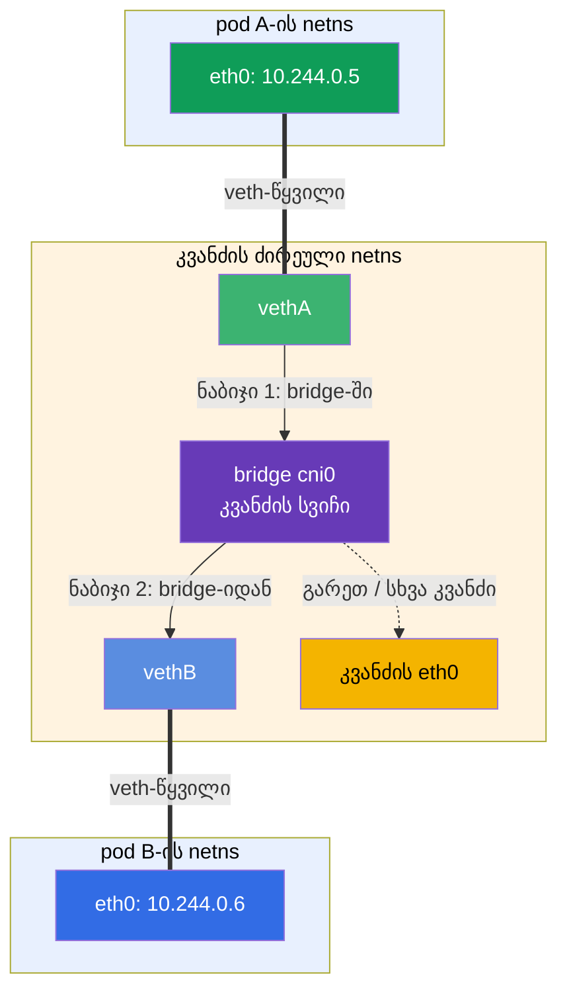
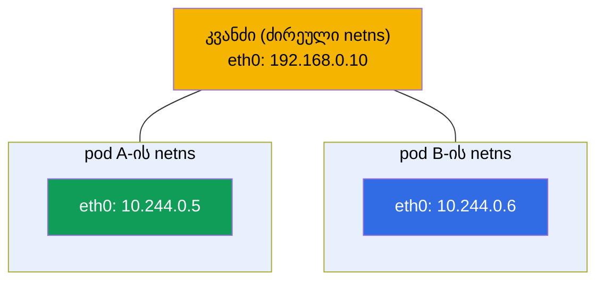
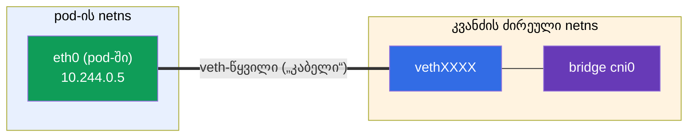
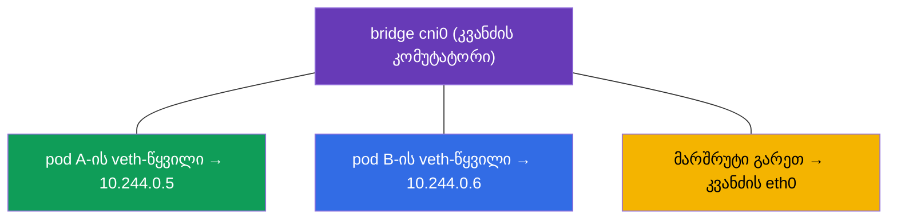
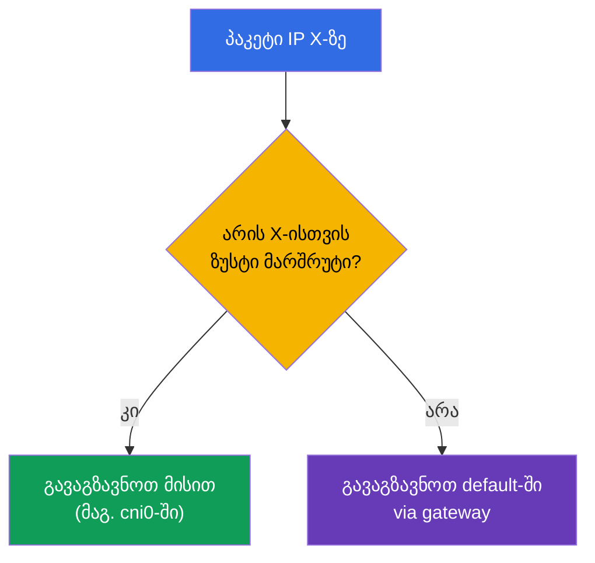
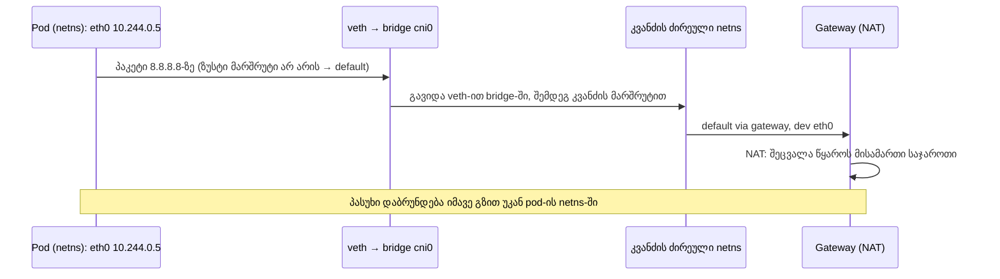

[Русская версия](ru.md) · [Eng version](README.md) · [Versión en español](es.md) · [Version française](fr.md) · [Deutsche Version](de.md)

# თავი 0.7. Linux-ქსელი კაპოტის ქვეშ: network namespaces, veth და მარშრუტიზაცია

> **ვისთვისაა ეს თავი.** ვასრულებთ ნაწილ 0-ს. თავ 0.1-ში განვიხილეთ IP, პორტები, CIDR და
> NAT „ზემოდან“. ახლა კი ერთი დონით ქვემოთ ჩავიხედოთ - როგორ დადის პაკეტი რეალურად
> Linux-ის შიგნით და **როგორ იღებს კონტეინერი საკუთარ ქსელს**. ეს არის ის მექანიზმი,
> რომელზეც დგას CNI (თავი 40), pod-ების ქსელი (თავი 30) და ქსელური troubleshooting. თუ
> უკვე იცით, რა არის network namespace, veth-წყვილი და მარშრუტების ცხრილი - წადით პირველ
> თავზე. თუ არა - ეს თავი „CNI-ის მაგიას“ ნათელ საინჟინრო სქემად აქცევს.

## 0.7.1. რატომ სჭირდება ეს დამწყებს

როცა 30-ე თავში წაიკითხავთ „CNI ქმნის pod-ების ქსელს, თითოეული pod იღებს საკუთარ network
namespace-ს და veth-ს bridge-ში“, ეს უნდა იყოს არა შელოცვა, არამედ სურათი. ხოლო ლაბ
123-ში (CNI-ის ხელით ინსტალაცია) და „pod-ები ერთმანეთს ვერ ხედავენ“-ის გარჩევისას სწორედ
ამ არსებებს დააკვირდებით: namespaces, ინტერფეისები, მარშრუტები.


სანამ ეს უცნობი სიტყვებია - აი, მათი მნიშვნელობა ერთ სტრიქონში (დაწვრილებით განვიხილავთ
0.7.2-0.7.5-ში), რომ ფრაზა „veth bridge-ში“ შელოცვა აღარ იყოს:

- **network namespace** (სქემებსა და ბრძანებებში იკვეცება **netns**-მდე) - „ცალკე ქსელი
  ერთი მანქანის შიგნით“: პროცესს აქვს საკუთარი ინტერფეისები, IP და მარშრუტები, თითქოს ეს
  ცალკე კომპიუტერია.
- **veth-წყვილი** - ვირტუალური „ქსელური კაბელი“ ორი ბოლოსგან: ერთი ბოლო pod-ის შიგნით,
  მეორე - კვანძზე; რაც ერთ ბოლოში შევიდა, მეორედან გამოდის.
- **bridge (ხიდი)** - ვირტუალური ქსელური კომუტატორი კვანძის შიგნით: მასში ჩართავენ ყველა
  pod-ის veth-წყვილის ბოლოებს, და pod-ები მისი მეშვეობით ურთიერთობენ ერთმანეთთან.
- **„veth bridge-ში“** - ნიშნავს „pod-ის კაბელის მეორე ბოლო ამ კომუტატორშია ჩარჭობილი“;
  სწორედ ასე უერთდება pod კვანძის საერთო ქსელს (ანალოგია: პაჩკორდი კომპიუტერიდან სვიჩის
  პორტში).
- **მარშრუტების ცხრილი** - წესები „რომელი პაკეტი რომელ ინტერფეისში გავაგზავნოთ“.

მთელი ანალოგია: pod - ეს არის ოთახი საკუთარი როზეტით (namespace), veth - კაბელი ოთახიდან,
bridge - სვიჩი დერეფანში, სადაც ყველა ოთახის კაბელი იყრის თავს, ხოლო მარშრუტების ცხრილი -
მაჩვენებელი, რომელი მავთულით გავაგზავნოთ წერილი.

აი, როგორ ეწყობა ეს არსებები ერთი კვანძის ორი pod-ის **ქსელურ ურთიერთქმედებაში**. pod A-ის
პაკეტი მიდის თავისი veth-წყვილით კვანძის bridge-ში და იქიდან pod B-ის veth-წყვილით -
ზუსტად ისე, როგორც ერთ სვიჩში დაკავშირებული ორი კომპიუტერი (გზის დეტალები - 0.7.6-ში):



## 0.7.2. Network namespace: ცალკე ქსელი ერთი მანქანის შიგნით

**Network namespace** - Linux-ის ბირთვის მექანიზმი, რომელიც პროცესს აძლევს **საკუთარ
ქსელურ სტეკს**: საკუთარ ინტერფეისებს, საკუთარ IP-ებს, საკუთარ მარშრუტების ცხრილს, საკუთარ
`/etc/resolv.conf`-ს. ეს არის ის „კონტეინერის ქსელური იზოლაცია“ თავ 0.4-იდან.

- ჰოსტს აქვს **ძირეული** (default) namespace - კვანძის „ნამდვილი“ ქსელი.
- ყოველი კონტეინერი/pod ეშვება **საკუთარ** network namespace-ში - ის ხედავს მხოლოდ საკუთარ
  ინტერფეისებს და არ ხედავს სხვისას.

```bash
ip netns list                    # ქსელური namespace-ების სია
sudo ip netns exec <ns> ip addr  # namespace-ის შიგნით ბრძანების შესრულება
```



მნიშვნელოვანი კავშირი მე-4 თავთან: **ერთი pod-ის** კონტეინერები იზიარებენ **ერთ** network
namespace-ს - ამიტომ ისინი ურთიერთობენ `localhost`-ით და ხედავენ pod-ის საერთო IP-ს. ამ
namespace-ს იკავებს სამსახურებრივი **pause-კონტეინერი** (თავი 40).

## 0.7.3. veth-წყვილი: „ქსელური კაბელი“ namespace-ებს შორის

namespace იზოლირებულია - მაშ, როგორ გამოდის მისგან პაკეტი გარეთ? **veth-წყვილის** (virtual
ethernet) მეშვეობით: ორი ვირტუალური ინტერფეისი, დაკავშირებული ერთი კაბელის ბოლოებივით.
რაც ერთ ბოლოში შევიდა - მეორედან გამოდის.



ერთ ბოლოს დებენ pod-ის namespace-ის **შიგნით** (ჩანს, როგორც მისი `eth0`), მეორეს - კვანძის
ძირეულ namespace-ში და უერთებენ bridge-ს. ასე ხვდება pod-ის პაკეტი კვანძის ქსელში.

## 0.7.4. Bridge: კვანძის ვირტუალური კომუტატორი

**Bridge** (ხიდი, მაგ. `cni0`) - ეს არის პროგრამული კომუტატორი კვანძის შიგნით. მას
უერთდება კვანძის ყველა pod-ის veth-წყვილის ბოლოები, ამიტომ **ერთი კვანძის** pod-ები
ერთმანეთთან ურთიერთობენ bridge-ის მეშვეობით, როგორც ერთ სვიჩში ჩართული მოწყობილობები.



ხოლო როგორ ხვდება პაკეტი **სხვა** კვანძის pod-ზე? ეს უკვე CNI-პლაგინის ამოცანაა (Calico,
Flannel და ა.შ., თავი 30): ის აწესებს მარშრუტებს კვანძებს შორის (ან ტუნელებს/overlay-ს),
რომ სხვადასხვა კვანძის Pod CIDR დიაპაზონები მისაწვდომი იყოს. აქედან წესი თავ 0.1-იდან:
pod-ების ქსელი ბრტყელია, NAT-ის გარეშე კლასტერის შიგნით.

## 0.7.5. მარშრუტების ცხრილი: სად გავაგზავნოთ პაკეტი

ყოველ namespace-ს (და ჰოსტს) აქვს **მარშრუტიზაციის ცხრილი** - წესები „ამა თუ იმ ქსელისთვის
განკუთვნილი პაკეტი გააგზავნე იქით“. მას ასე უყურებენ:

```bash
ip route                         # მიმდინარე namespace-ის მარშრუტების ცხრილი
ip route get 8.8.8.8             # რომელი მარშრუტით წავა პაკეტი 8.8.8.8-ისკენ
```

ტიპური გამონატანი და როგორ წავიკითხოთ:

```text
default via 192.168.0.1 dev eth0      # ყველა „უცნობი“ → ნაგულისხმევი gateway
10.244.0.0/24 dev cni0                # კვანძის pod-ების ქსელი → bridge-ში
192.168.0.0/24 dev eth0               # კვანძის ლოკალური ქსელი → პირდაპირ
```

- **`default via <gateway>`** - ნაგულისხმევი მარშრუტი: სად გავაგზავნოთ პაკეტი, თუ მისი
  მისამართისთვის უფრო ზუსტი წესი არ არის (ჩვეულებრივ გარეთ gateway-ის გავლით, სადაც მუშაობს
  NAT თავ 0.1-იდან).
- უფრო **კონკრეტული** მარშრუტი (გრძელი პრეფიქსი) იგებს `default`-თან.



## 0.7.6. როგორ ეწყობა ეს: პაკეტის გზა pod-იდან გარეთ

შევკრიბოთ ყველაფერი ერთად - რა ხდება, როცა pod აგზავნის მოთხოვნას ინტერნეტში:



ეს არის „კაპოტის ქვეშ“ იმისა, რასაც 30-ე თავში pod-ების ქსელს უწოდებენ: namespace იძლევა
იზოლაციას, veth - გასასვლელს, bridge - კავშირს კვანძის შიგნით, მარშრუტები - მიმართულებას,
NAT - გარეთ გასვლას.

## 0.7.7. როგორ გამოიყენება ეს პროდაქშენში

- **CNI ამას ავტომატურად აკეთებს.** namespace/veth/bridge ხელით არ კონფიგურდება - pod-ისთვის
  მათ ქმნის CNI-პლაგინი გაშვებისას. მაგრამ მექანიზმის გაგება აუცილებელია გამართვისთვის:
  „pod ქსელის გარეშე“ ხშირად = CNI/მარშრუტების პრობლემა.
- **ქსელის დიაგნოსტიკა - ინტერფეისებისა და მარშრუტების დონეზე.** როცა „pod-ები ერთმანეთს
  ვერ ხედავენ“, უყურებენ `ip route`-ს, ინტერფეისებს, bridge-ს, CNI-აგენტს კვანძებზე (ლაბი
  123, თავი 46), და არა მხოლოდ Kubernetes-ის მანიფესტებს.
- **Overlay vs მარშრუტიზაცია.** CNI-ები კვანძებს სხვადასხვანაირად აკავშირებენ: overlay
  (VXLAN, ინკაფსულაცია) უფრო მარტივია, მაგრამ ზედნადები ხარჯებით; სუფთა მარშრუტიზაცია (BGP
  Calico-ში) უფრო სწრაფია. არჩევანი წარმადობაზე მოქმედებს (თავი 30).
- **hostNetwork და პორტები.** pod `hostNetwork: true`-ით ცხოვრობს კვანძის ძირეულ
  namespace-ში და პირდაპირ იყენებს მის ინტერფეისებს - ზოგჯერ საჭიროა, მაგრამ იზოლაციას
  ხსნის.

## 0.7.8. მინი-ლექსიკონი

- **network namespace** (შემოკლ. **netns**) - პროცესის იზოლირებული ქსელური სტეკი (საკუთარი
  ინტერფეისები, IP, მარშრუტები).
- **ძირეული (default) namespace** - კვანძის „ნამდვილი“ ქსელი.
- **veth-წყვილი** - ორი დაკავშირებული ვირტუალური ინტერფეისი (კაბელი namespace-ებს შორის).
- **bridge (cni0)** - კვანძის პროგრამული კომუტატორი, რომელიც აკავშირებს მასზე არსებულ
  pod-ებს.
- **pause-კონტეინერი** - იკავებს pod-ის ქსელურ namespace-ს (თავი 40).
- **მარშრუტების ცხრილი** - წესები „ამ ქსელისთვის - იქით“; უყურებენ `ip route`-ს.
- **default route** - ნაგულისხმევი მარშრუტი gateway-ის გავლით „უცნობი“ მისამართებისთვის.
- **overlay** - ქსელი კვანძებს შორის პაკეტების ინკაფსულაციით (VXLAN).

## 0.7.9. თავის შეჯამება

- Network namespace აძლევს პროცესს/კონტეინერს საკუთარ ქსელურ სტეკს; ერთი pod-ის
  კონტეინერები იზიარებენ ერთ namespace-ს (აქედან საერთო IP და `localhost`).
- veth-წყვილი აკავშირებს pod-ის namespace-ს კვანძის ძირეულ namespace-თან - „კაბელი გარეთ“.
- bridge (cni0) აკავშირებს ერთი კვანძის pod-ებს, როგორც კომუტატორი; კვანძებს შორის კავშირს
  აწესებს CNI (მარშრუტები ან overlay).
- მარშრუტების ცხრილი წყვეტს, სად გავაგზავნოთ პაკეტი: ზუსტი მარშრუტი იგებს `default via
  gateway`-თან; გარეთ ტრაფიკი გადის NAT-ის გავლით (თავი 0.1).
- ამ ყველაფერს CNI ავტომატურად აკეთებს, მაგრამ მექანიზმის გაგება საჭიროა ქსელის
  გასამართავად (ლაბი 123, თავები 30, 46).

## 0.7.10. როგორ გამოგადგებათ: გამოცდაზე და რეალურ სამუშაოში

**გამოცდაზე (CKA).** პირდაპირი დავალებები „მოაწყე veth“ არ არის, მაგრამ ამ მოდელის გარეშე
ვერ გაიგებთ pod-ების ქსელს (თავი 30), CNI-ის ინსტალაციას (ლაბი 123) და ქსელურ
troubleshooting-ს (30%). როცა კვანძი `NotReady`-ა CNI-ის უქონლობის გამო ან pod-ები არ
უკავშირდებიან, თქვენ იცით, სად უნდა უყუროთ: ინტერფეისები, `ip route`, bridge, CNI-აგენტი.

**რეალურ სამუშაოში.** ქსელური ინციდენტების გარჩევა, CNI-ის არჩევა და კონფიგურაცია,
overlay/BGP-ის გაგება, `hostNetwork` - ყველაფერი ამ დაბალი დონის სურათს ეყრდნობა. ის
გამოყოფს „გადავაინსტალებ CNI-ს და იმედი მაქვს“-ს გააზრებული დიაგნოსტიკისგან.

## 0.7.11. თვითშემოწმების კითხვები

1. რას აძლევს პროცესს network namespace და როგორ უკავშირდება ეს კონტეინერის იზოლაციას?
2. რატომ ურთიერთობენ ერთი pod-ის კონტეინერები `localhost`-ით?
3. რისთვის არის საჭირო veth-წყვილი და სად დებენ მის ბოლოებს?
4. რას აკეთებს bridge `cni0` და ვინ აკავშირებს სხვადასხვა კვანძის pod-ებს?
5. როგორ წავიკითხოთ მარშრუტების ცხრილი და რა არის `default via`?
6. აღწერეთ პაკეტის გზა pod-იდან ინტერნეტში და სად ერთვება NAT.

## პრაქტიკა

ეს არის ნულოვანი საფუძვლის ბოლო „თეორიული“ თავი. მექანიზმს ხელით ნახავთ ლაბ 123-ში (CNI-ის
ინსტალაცია ნულიდან, ინტერფეისებისა და მარშრუტების ინსპექცია) და ქსელურ troubleshooting-ში
(თავი 46). დარჩა მოკლე პრაქტიკული თავი 0.8 რედაქტორ vim-ის შესახებ - და შემდეგ ძირითადი
კურსი.

---
[სარჩევი](../README_GE.md) · [თავი 0.6](../00-6-yaml/ge.md) · [თავი 0.8](../00-8-vim/ge.md)
