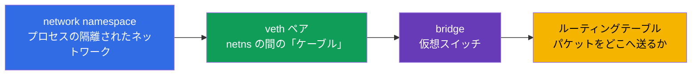
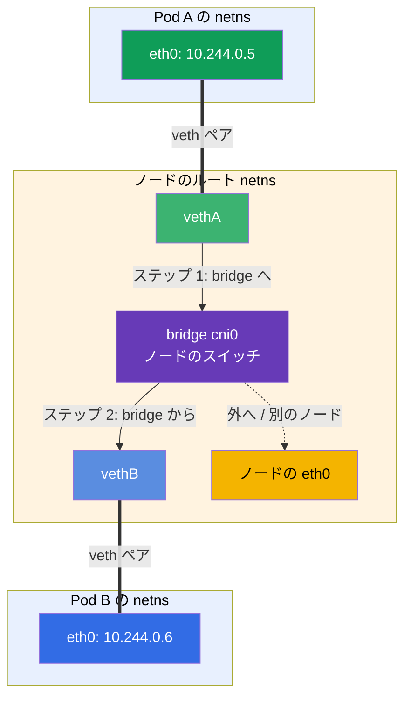
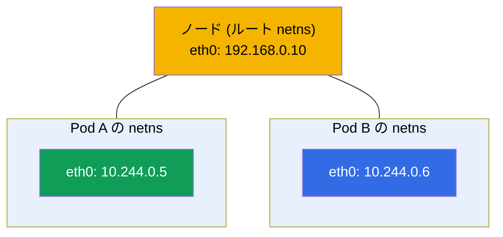
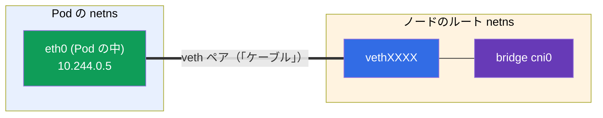
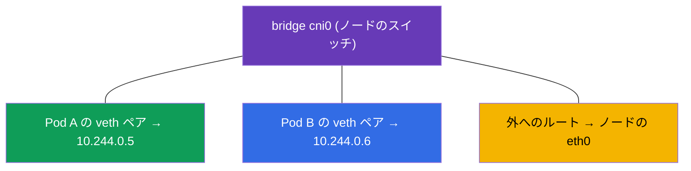
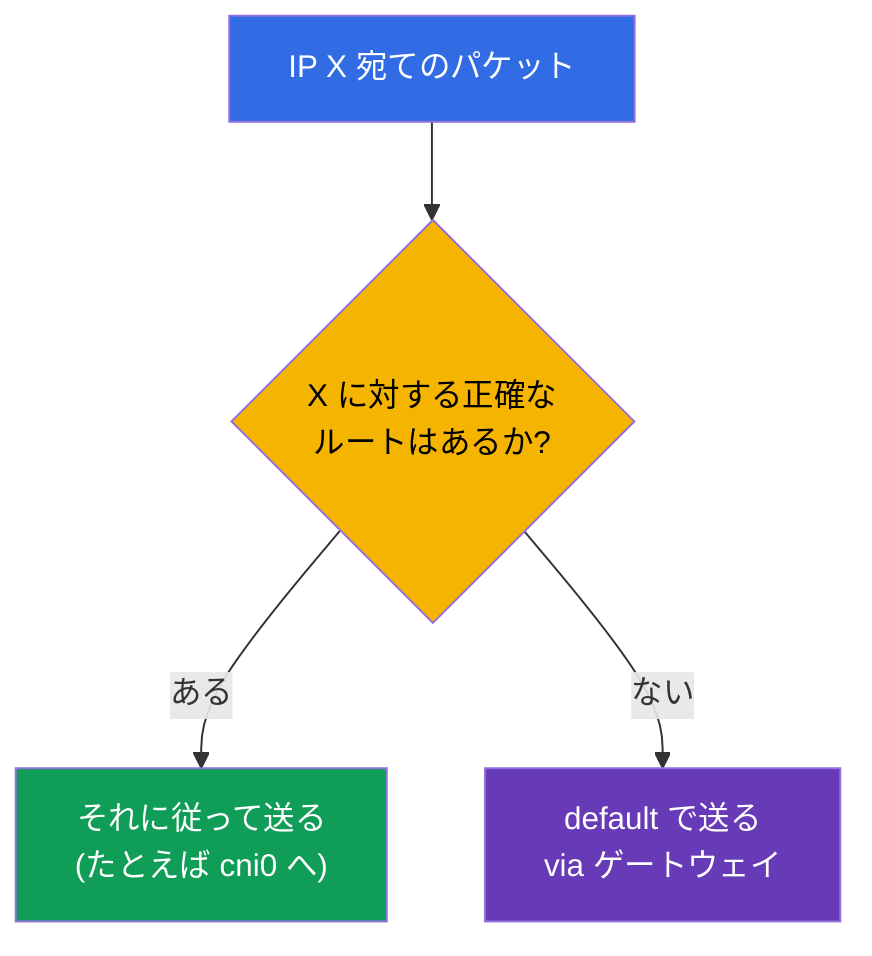
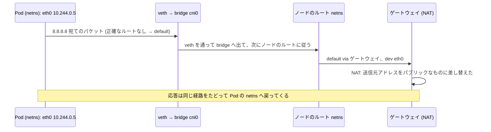

[Русская версия](ru.md) · [Eng version](README.md) · [Versión en español](es.md) · [Version française](fr.md) · [Deutsche Version](de.md) · [ქართული ვერსია](ge.md) · [繁體中文版](tw.md)

# 第 0.7 章。Linux ネットワークの内側：network namespace、veth、ルーティング

> **この章は誰のためか。** パート 0 を締めくくります。第 0.1 章では IP、ポート、CIDR、
> NAT を「上から」見ました。今度はもう一段下の層をのぞきます - パケットが Linux の
> 内部で実際にどう流れるのか、そして **コンテナがどうやって自分専用のネットワークを
> 手に入れるのか**。これは CNI（第 40 章）、Pod のネットワーク（第 30 章）、そして
> ネットワークの troubleshooting が立っている、まさにその仕組みです。network
> namespace、veth ペア、ルーティングテーブルが何かをすでに知っているなら、第 1 章へ
> 進んでください。知らないなら - この章は「CNI の魔法」を、理解できるエンジニアリングの
> 図に変えます。

## 0.7.1. 初心者にこれが必要な理由

第 30 章で「CNI が Pod のネットワークを作り、各 Pod は自分の network namespace と
bridge につながる veth を受け取る」と読んだとき、それが呪文ではなく絵として頭に浮かぶ
べきです。そしてラボ 123（CNI を手で入れる）や「Pod どうしが見えない」の調査では、
まさにこれらの実体を見ることになります：namespace、インターフェース、ルート。



まだ見慣れない言葉なので - 「bridge につながる veth」が呪文でなくなるように、それぞれの
意味を 1 行で示します（詳しくは 0.7.2-0.7.5 で分解します）：

- **network namespace**（図やコマンドでは **netns** と省略されます）- 「1 台のマシンの
  中にある別のネットワーク」：プロセスが自分専用のインターフェース、IP、ルートを持ち、
  まるで別のコンピュータのようになります。
- **veth ペア** - 2 つの端からなる仮想の「ネットワークケーブル」：片方の端は Pod の
  内部、もう片方はノード側にあり、一方の端に入ったものが他方から出てきます。
- **bridge（ブリッジ）** - ノードの内部にある仮想のネットワークスイッチ：ここに
  すべての Pod の veth ペアの端を差し込み、Pod どうしはこれを通して通信します。
- **「bridge につながる veth」** - つまり「Pod のケーブルの 2 番目の端がこのスイッチに
  差し込まれている」ということ。これがまさに Pod がノードの共通ネットワークへつながる
  やり方です（たとえ：コンピュータからスイッチのポートへ伸びるパッチケーブル）。
- **ルーティングテーブル** - 「どのパケットをどのインターフェースへ送るか」のルール。

たとえをまとめると：Pod は自分のコンセントを持つ部屋（namespace）、veth は部屋から
出るケーブル、bridge は廊下にあってすべての部屋のケーブルが集まるスイッチ、そして
ルーティングテーブルは、どの線で手紙を送るかを示す道案内です。

そしてこれらの実体が、同じノードにいる 2 つの Pod の **ネットワーク通信** としてどう
組み合わさるかを示します。Pod A からのパケットは自分の veth ペアを通ってノードの
bridge へ入り、そこから Pod B の veth ペアを通っていきます - ちょうど 1 台のスイッチで
つながれた 2 台のコンピュータと同じです（経路の詳細は 0.7.6 で）：



## 0.7.2. Network namespace：1 台のマシンの中にある別のネットワーク

**Network namespace** は Linux カーネルの仕組みで、プロセスに **自分専用の
ネットワークスタック** を与えます：自分のインターフェース、自分の IP、自分の
ルーティングテーブル、自分の `/etc/resolv.conf`。これが第 0.4 章に出てきた、まさに
「コンテナのネットワーク隔離」です。

- ホストには **ルート**（default）namespace があります - ノードの「本物の」ネットワークです。
- 各コンテナ/Pod は **自分の** network namespace で起動します - 自分のインターフェースだけが
  見え、他のものは見えません。

```bash
ip netns list                    # ネットワーク namespace の一覧
sudo ip netns exec <ns> ip addr  # namespace の内部でコマンドを実行する
```



第 4 章との重要なつながり：**同じ Pod の** コンテナは **1 つの** network namespace を
共有します - だからこそ `localhost` で通信でき、Pod 共通の IP が見えます。この
namespace を保持しているのは補助的な **pause コンテナ** です（第 40 章）。

## 0.7.3. veth ペア：namespace の間の「ネットワークケーブル」

namespace は隔離されています - では、パケットはどうやってそこから外に出るのでしょうか。
**veth ペア**（virtual ethernet）を通してです：1 本のケーブルの両端のようにつながった
2 つの仮想インターフェースです。一方の端に入ったものは、他方から出てきます。



片方の端は Pod の namespace の **内部** に置かれ（その `eth0` として見えます）、もう
片方はノードのルート namespace に置かれて bridge に接続されます。こうして Pod からの
パケットはノードのネットワークへ入っていきます。

## 0.7.4. Bridge：ノードの仮想スイッチ

**Bridge**（ブリッジ、たとえば `cni0`）は、ノードの内部にあるソフトウェアのスイッチです。
そこにはノードのすべての Pod の veth ペアの端が接続されているので、**同じノードの**
Pod どうしは、1 台のスイッチにつながった機器のように bridge を通して通信します。



では **別の** ノードの Pod へは、パケットはどうやって届くのでしょうか。それはもう
CNI プラグインの仕事です（Calico、Flannel など、第 30 章）：異なるノードの Pod CIDR の
範囲へ到達できるように、ノード間のルート（またはトンネル/overlay）を設定します。ここから
第 0.1 章のルールが出てきます：Pod のネットワークはフラットで、クラスタ内部に NAT は
ありません。

## 0.7.5. ルーティングテーブル：パケットをどこへ送るか

各 namespace（およびホスト）は **ルーティングテーブル** を持ちます - 「このネットワーク
宛てのパケットはあそこへ送れ」というルールです。見るにはこうします：

```bash
ip route                         # 現在の namespace のルーティングテーブル
ip route get 8.8.8.8             # 8.8.8.8 へのパケットがどのルートを通るか
```

典型的な出力と、その読み方：

```text
default via 192.168.0.1 dev eth0      # 「知らない」宛先はすべて → デフォルトゲートウェイ
10.244.0.0/24 dev cni0                # ノードの Pod のネットワーク → bridge へ
192.168.0.0/24 dev eth0               # ノードのローカルネットワーク → 直接
```

- **`default via <ゲートウェイ>`** - デフォルトルート：その宛先アドレスに対してより
  正確なルールがない場合に、パケットをどこへ送るか（通常は、第 0.1 章の NAT が動いている
  ゲートウェイを通って外へ）。
- より **具体的な** ルート（プレフィックスが長いもの）が `default` に勝ちます。



## 0.7.6. これがどう組み合わさるか：Pod から外へ向かうパケットの経路

すべてをまとめましょう - Pod がインターネットへリクエストを送るとき、何が起きるのか：



これがまさに、第 30 章で Pod のネットワークと呼ばれるものの「内側」です：namespace が
隔離を与え、veth が出口、bridge がノード内部の接続、ルートが方向、そして NAT が外への
出口です。

## 0.7.7. 本番環境でこれをどう使うか

- **CNI がこれを自動でやります。** namespace/veth/bridge を手で設定することはありません -
  Pod のためにそれらを作るのは、起動時の CNI プラグインです。しかし仕組みを理解しておく
  ことはデバッグに必要です：「Pod にネットワークがない」はしばしば CNI/ルートの問題です。
- **ネットワークの診断はインターフェースとルートのレベルで。** 「Pod どうしが見えない」
  ときは、Kubernetes のマニフェストだけでなく、`ip route`、インターフェース、bridge、
  ノード上の CNI エージェントを見ます（ラボ 123、第 46 章）。
- **overlay とルーティング。** CNI はノードの結び方がそれぞれ違います：overlay（VXLAN、
  カプセル化）は単純ですがオーバーヘッドがあり、純粋なルーティング（Calico の BGP）は
  より速いです。この選択は性能に影響します（第 30 章）。
- **hostNetwork とポート。** `hostNetwork: true` の Pod はノードのルート namespace に
  住み、そのインターフェースを直接使います - 必要なこともありますが、隔離が失われます。

## 0.7.8. ミニ用語集

- **network namespace**（略 **netns**）- プロセスの隔離されたネットワークスタック
  （自分のインターフェース、IP、ルート）。
- **ルート (default) namespace** - ノードの「本物の」ネットワーク。
- **veth ペア** - つながった 2 つの仮想インターフェース（namespace の間のケーブル）。
- **bridge (cni0)** - ノードのソフトウェアスイッチで、その上の Pod どうしを結びます。
- **pause コンテナ** - Pod のネットワーク namespace を保持します（第 40 章）。
- **ルーティングテーブル** - 「このネットワークへはあそこへ」というルール。`ip route` で見ます。
- **default route** - 「知らない」アドレス向けの、ゲートウェイを通るデフォルトルート。
- **overlay** - ノード間でパケットをカプセル化するネットワーク (VXLAN)。

## 0.7.9. 本章のまとめ

- Network namespace はプロセス/コンテナに自分専用のネットワークスタックを与えます。同じ
  Pod のコンテナは 1 つの namespace を共有します（だから IP が共通で `localhost` が使えます）。
- veth ペアは Pod の namespace とノードのルート namespace をつなぎます - 「外への
  ケーブル」です。
- bridge (cni0) はスイッチのように同じノードの Pod を結びます。ノード間の接続を設定するのは
  CNI です（ルートまたは overlay）。
- ルーティングテーブルがパケットの送り先を決めます：正確なルートが `default via
  ゲートウェイ` に勝ちます。外へ出るトラフィックは NAT を通ります（第 0.1 章）。
- これらはすべて CNI が自動でやりますが、ネットワークのデバッグには仕組みの理解が必要です
  （ラボ 123、第 30 章、第 46 章）。

## 0.7.10. これがどう役に立つか：試験と実際の仕事で

**試験では (CKA)。** 「veth を設定せよ」という直接の問題はありませんが、このモデルなしでは
Pod のネットワーク（第 30 章）、CNI のインストール（ラボ 123）、ネットワークの
troubleshooting（30%）は理解できません。CNI がないためにノードが `NotReady` になったり
Pod どうしがつながらないとき、どこを見ればよいかが分かります：インターフェース、
`ip route`、bridge、CNI エージェント。

**実際の仕事では。** ネットワーク障害の調査、CNI の選定と設定、overlay/BGP の理解、
`hostNetwork` - すべてがこの低レベルの絵に立っています。それが「CNI を入れ直して祈る」と、
意識的な診断とを分けます。

## 0.7.11. 自己チェックの質問

1. network namespace はプロセスに何を与え、それはコンテナの隔離とどう関係しますか？
2. なぜ同じ Pod のコンテナは `localhost` で通信するのですか？
3. veth ペアは何のために必要で、その両端はどこに置かれますか？
4. bridge `cni0` は何をし、異なるノードの Pod を結ぶのは誰ですか？
5. ルーティングテーブルはどう読み、`default via` とは何ですか？
6. Pod からインターネットへ向かうパケットの経路と、NAT がどこで働くかを説明してください。

## 演習

これはゼロの土台における最後の「理論」の章です。仕組みはラボ 123（CNI をゼロから
インストールし、インターフェースとルートを調べる）と、ネットワークの troubleshooting
（第 46 章）で手を動かして見ることになります。残っているのは vim エディタについての
短い実践的な第 0.8 章 - そのあとが本編のコースです。

---
[目次](../README_JP.md) · [第 0.6 章](../00-6-yaml/jp.md) · [第 0.8 章](../00-8-vim/jp.md)
