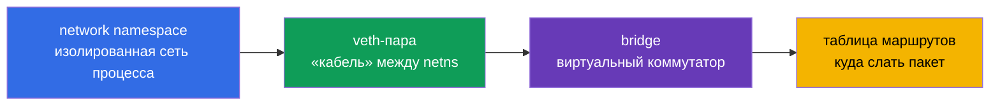
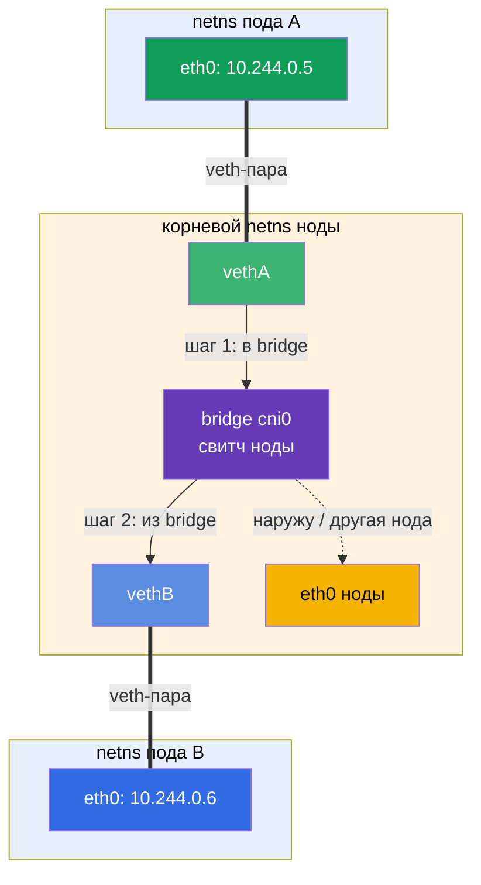
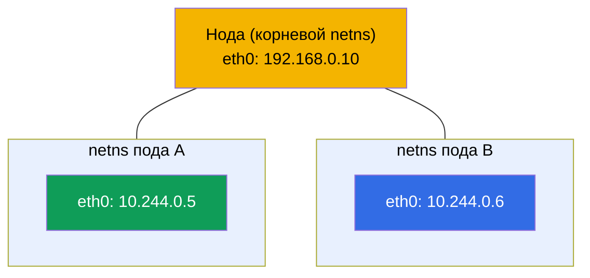
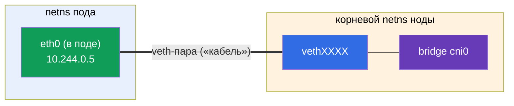
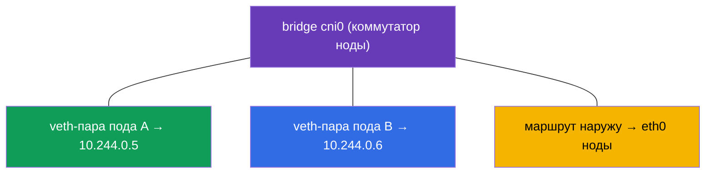
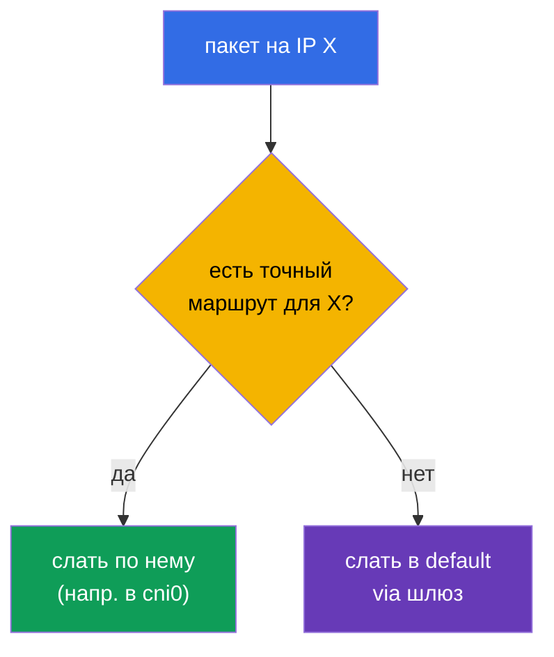
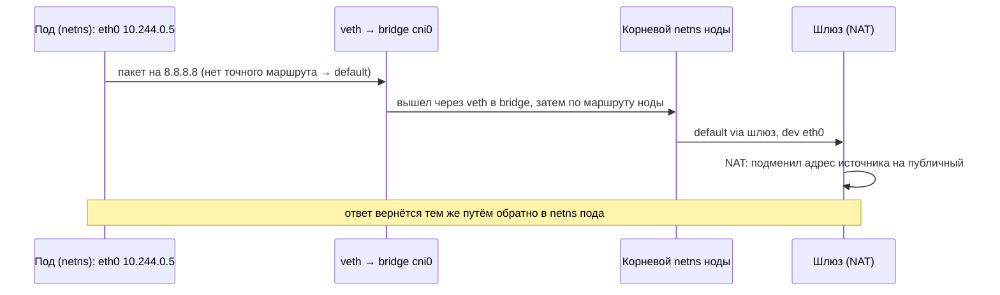

# Глава 0.7. Linux-сеть под капотом: network namespaces, veth и маршрутизация

> **Для кого эта глава.** Завершаем часть 0. В главе 0.1 мы разобрали IP, порты, CIDR и
> NAT «сверху». Теперь заглянем на один уровень ниже - как пакет реально ходит внутри
> Linux и **как контейнер получает собственную сеть**. Это тот самый механизм, на
> котором стоят CNI (глава 40), сеть подов (глава 30) и сетевой troubleshooting. Если
> вы уже знаете, что такое network namespace, veth-пара и таблица маршрутов - идите к
> главе 1. Если нет - эта глава превращает «магию CNI» в понятную инженерную схему.

## 0.7.1. Зачем это новичку

Когда в главе 30 вы прочитаете «CNI создаёт под сеть, каждый под получает свой сетевой
namespace и veth в bridge», это должно быть не заклинанием, а картинкой. А в лабе 123
(установка CNI руками) и при разборе «поды не видят друг друга» вы будете смотреть ровно
эти сущности: namespaces, интерфейсы, маршруты.



Пока это незнакомые слова - вот их смысл в одну строку (подробно разберём в 0.7.2-0.7.5),
чтобы фраза «veth в bridge» перестала быть заклинанием:

- **network namespace** (на схемах и в командах сокращают до **netns**) - «отдельная сеть
  внутри одной машины»: у процесса свои интерфейсы, IP и маршруты, как будто это отдельный
  компьютер.
- **veth-пара** - виртуальный «сетевой кабель» из двух концов: один конец внутри пода,
  другой - на ноде; что вошло в один конец, выходит из другого.
- **bridge (мост)** - виртуальный сетевой коммутатор внутри ноды: в него включают концы
  veth-пар от всех подов, и поды через него общаются между собой.
- **«veth в bridge»** - значит «второй конец кабеля пода воткнут в этот коммутатор»;
  именно так под подключается к общей сети ноды (аналогия: патч-корд от компьютера в порт
  свитча).
- **таблица маршрутов** - правила «какой пакет в какой интерфейс отправить».

Аналогия целиком: под - это комната со своей розеткой (namespace), veth - кабель из
комнаты, bridge - свитч в коридоре, куда сходятся кабели всех комнат, а таблица маршрутов
- указатель, по какому проводу отправить письмо.

А вот как эти сущности складываются в **сетевое взаимодействие** двух подов на одной ноде.
Пакет из пода A идёт по своей veth-паре в bridge ноды и оттуда по veth-паре пода B -
ровно как два компьютера, соединённых через один свитч (детали пути - в 0.7.6):



## 0.7.2. Network namespace: отдельная сеть внутри одной машины

**Network namespace** - механизм ядра Linux, дающий процессу **собственный сетевой
стек**: свои интерфейсы, свои IP, свою таблицу маршрутов, свой `/etc/resolv.conf`. Это
та самая «сетевая изоляция контейнера» из главы 0.4.

- У хоста есть **корневой** (default) namespace - «настоящая» сеть ноды.
- Каждый контейнер/под запускается в **своём** network namespace - он видит только свои
  интерфейсы и не видит чужих.

```bash
ip netns list                    # список сетевых namespace
sudo ip netns exec <ns> ip addr  # выполнить команду внутри namespace
```



Важная связка с главой 4: контейнеры **одного пода** делят **один** network namespace -
поэтому они общаются через `localhost` и видят общий IP пода. Держит этот namespace
служебный **pause-контейнер** (глава 40).

## 0.7.3. veth-пара: «сетевой кабель» между namespace

Namespace изолирован - как же пакет выходит из него наружу? Через **veth-пару** (virtual
ethernet): два виртуальных интерфейса, соединённых как концы одного кабеля. Что вошло в
один конец - выходит из другого.



Один конец кладут **внутрь** namespace пода (виден как его `eth0`), другой - в корневой
namespace ноды и подключают к bridge. Так пакет из пода попадает в сеть ноды.

## 0.7.4. Bridge: виртуальный коммутатор ноды

**Bridge** (мост, напр. `cni0`) - это программный коммутатор внутри ноды. К нему
подключены концы veth-пар всех подов ноды, поэтому поды **на одной ноде** общаются друг с
другом через bridge, как устройства в одном свитче.



А как пакет попадает на под **другой** ноды? Это уже задача CNI-плагина (Calico,
Flannel и т.д., глава 30): он настраивает маршруты между нодами (или туннели/overlay),
чтобы диапазоны Pod CIDR разных нод были достижимы. Отсюда правило из главы 0.1: сеть
подов - плоская, без NAT внутри кластера.

## 0.7.5. Таблица маршрутов: куда слать пакет

Каждый namespace (и хост) имеет **таблицу маршрутизации** - правила «пакет для такой-то
сети отправляй туда-то». Смотрят её так:

```bash
ip route                         # таблица маршрутов текущего namespace
ip route get 8.8.8.8             # каким маршрутом пойдёт пакет к 8.8.8.8
```

Типичный вывод и как читать:

```text
default via 192.168.0.1 dev eth0      # всё «незнакомое» → шлюз по умолчанию
10.244.0.0/24 dev cni0                # сеть подов ноды → в bridge
192.168.0.0/24 dev eth0               # локальная сеть ноды → напрямую
```

- **`default via <шлюз>`** - маршрут по умолчанию: куда слать пакет, если для его адреса
  нет более точного правила (обычно наружу через шлюз, где работает NAT из главы 0.1).
- Более **конкретный** маршрут (длиннее префикс) выигрывает у `default`.



## 0.7.6. Как это складывается: путь пакета от пода наружу

Соберём всё вместе - что происходит, когда под шлёт запрос в интернет:



Это и есть «под капотом» того, что в главе 30 называется сетью подов: namespace даёт
изоляцию, veth - выход, bridge - связь внутри ноды, маршруты - направление, NAT - выход
наружу.

## 0.7.7. Как это применяют в продакшене

- **CNI делает это автоматически.** Вручную namespace/veth/bridge не настраивают - за
  под их создаёт CNI-плагин при запуске. Но понимать механизм необходимо для отладки:
  «под без сети» часто = проблема CNI/маршрутов.
- **Диагностика сети - на уровне интерфейсов и маршрутов.** Когда «поды не видят друг
  друга», смотрят `ip route`, интерфейсы, bridge, агент CNI на нодах (лаба 123, глава
  46), а не только манифесты Kubernetes.
- **Overlay vs маршрутизация.** CNI по-разному связывают ноды: overlay (VXLAN,
  инкапсуляция) проще, но с накладными расходами; чистая маршрутизация (BGP у Calico)
  быстрее. Выбор влияет на производительность (глава 30).
- **hostNetwork и порты.** Под с `hostNetwork: true` живёт в корневом namespace ноды и
  использует её интерфейсы напрямую - иногда нужно, но снимает изоляцию.

## 0.7.8. Мини-глоссарий

- **network namespace** (сокр. **netns**) - изолированный сетевой стек процесса (свои
  интерфейсы, IP, маршруты).
- **корневой (default) namespace** - «настоящая» сеть ноды.
- **veth-пара** - два связанных виртуальных интерфейса (кабель между namespace).
- **bridge (cni0)** - программный коммутатор ноды, связывающий поды на ней.
- **pause-контейнер** - держит сетевой namespace пода (глава 40).
- **таблица маршрутов** - правила «для такой сети - туда»; смотрят `ip route`.
- **default route** - маршрут по умолчанию через шлюз для «незнакомых» адресов.
- **overlay** - сеть с инкапсуляцией пакетов между нодами (VXLAN).

## 0.7.9. Итоги главы

- Network namespace даёт процессу/контейнеру собственный сетевой стек; контейнеры одного
  пода делят один namespace (отсюда общий IP и `localhost`).
- veth-пара соединяет namespace пода с корневым namespace ноды - «кабель наружу».
- bridge (cni0) связывает поды одной ноды, как коммутатор; связь между нодами настраивает
  CNI (маршруты или overlay).
- Таблица маршрутов решает, куда слать пакет: точный маршрут выигрывает у `default via
  шлюз`; наружу трафик выходит через NAT (глава 0.1).
- Всё это CNI делает автоматически, но понимать механизм нужно для отладки сети (лаба
  123, главы 30, 46).

## 0.7.10. Как это пригодится: на экзамене и в реальной работе

**На экзамене (CKA).** Прямых заданий «настрой veth» нет, но без этой модели не понять
сеть подов (глава 30), установку CNI (лаба 123) и сетевой troubleshooting (30%). Когда
нода `NotReady` из-за отсутствия CNI или поды не связываются, вы знаете, где смотреть:
интерфейсы, `ip route`, bridge, агент CNI.

**В реальной работе.** Разбор сетевых инцидентов, выбор и настройка CNI, понимание
overlay/BGP, `hostNetwork` - всё опирается на эту низкоуровневую картину. Она отделяет
«переустановлю CNI и надеюсь» от осознанной диагностики.

## 0.7.11. Вопросы для самопроверки

1. Что даёт процессу network namespace и как это связано с изоляцией контейнера?
2. Почему контейнеры одного пода общаются через `localhost`?
3. Зачем нужна veth-пара и куда кладут её концы?
4. Что делает bridge `cni0` и кто связывает поды разных нод?
5. Как прочитать таблицу маршрутов и что такое `default via`?
6. Опишите путь пакета от пода в интернет и где включается NAT.

## Практика

Это последняя «теоретическая» глава нулевого фундамента. Механизм вы увидите руками в
лабе 123 (установка CNI с нуля, инспекция интерфейсов и маршрутов) и в сетевом
troubleshooting (глава 46). Осталась короткая практическая глава 0.8 про редактор vim -
и дальше основной курс.

---
[Оглавление](../README_RU.md) · [Глава 0.6](../00-6-yaml/ru.md) · [Глава 0.8](../00-8-vim/ru.md)
