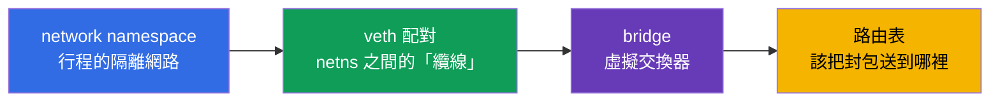
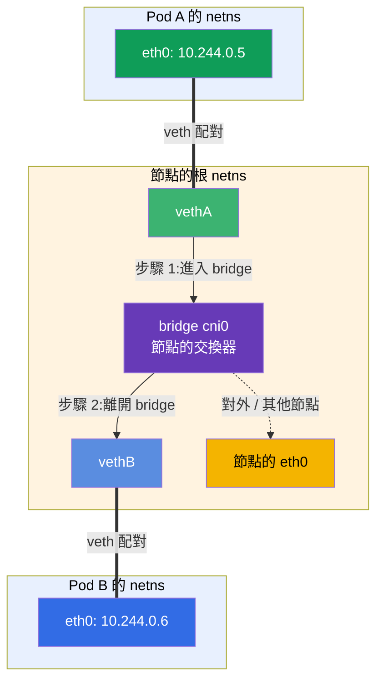
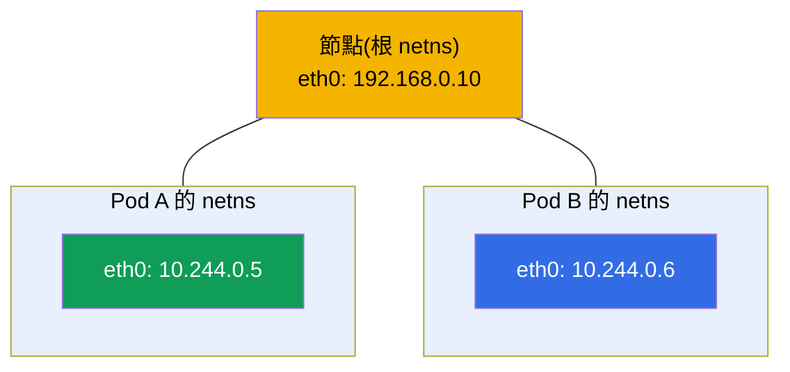
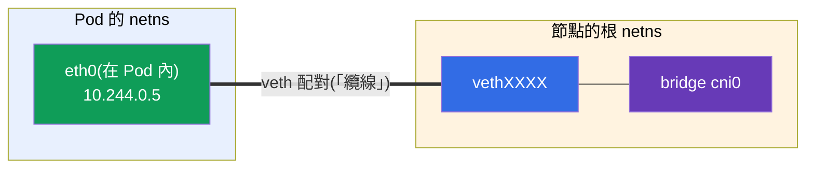
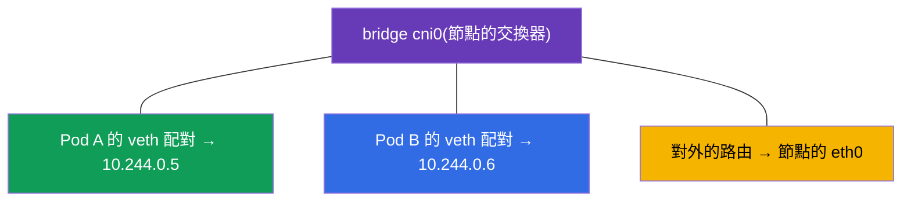
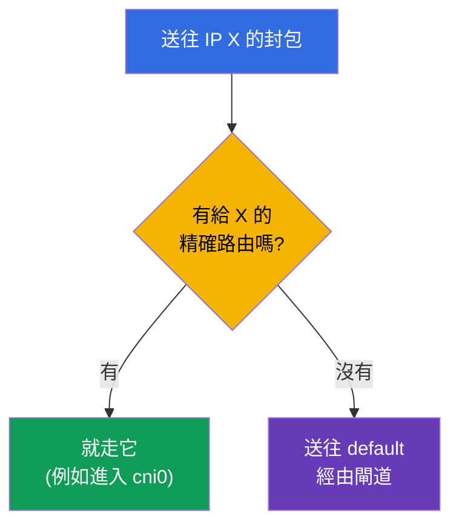
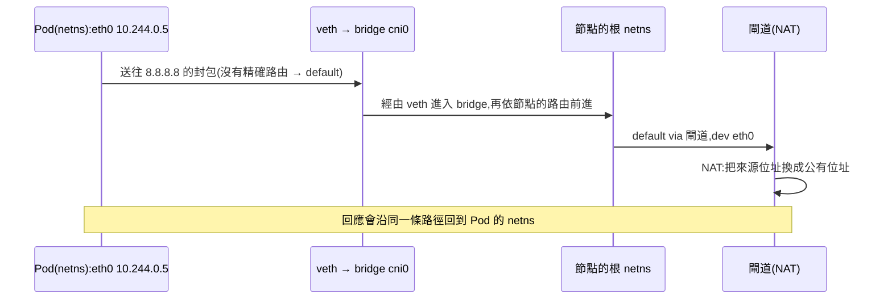

[Русская версия](ru.md) · [Eng version](README.md) · [Versión en español](es.md) · [Version française](fr.md) · [Deutsche Version](de.md) · [ქართული ვერსია](ge.md) · [日本語版](jp.md)

# 第 0.7 章。Linux 網路的底層原理:network namespace、veth 與路由

> **這一章適合誰。** 我們要收尾第 0 部分。在第 0.1 章我們從「上層」看過 IP、
> 埠、CIDR 與 NAT。現在往下一層看 - 封包在 Linux 內部到底怎麼走,以及
> **容器如何取得自己的網路**。這正是 CNI(第 40 章)、Pod 網路(第 30 章)與
> 網路 troubleshooting 所站立的機制。如果你已經知道什麼是 network namespace、
> veth 配對與路由表 - 直接去第 1 章。如果不知道 - 這一章會把「CNI 的魔法」
> 變成一張看得懂的工程圖。

## 0.7.1. 為什麼新手需要這一章

當你在第 30 章讀到「CNI 建立 Pod 網路,每個 Pod 取得自己的網路 namespace 與
一個接在 bridge 上的 veth」時,這不該是咒語,而該是一張圖。而在實驗 123
(手動安裝 CNI)以及排查「Pod 之間看不到彼此」時,你看的正是這些東西:
namespace、介面、路由。



這些現在還是陌生的詞 - 下面用一行講清各自的意思(細節在 0.7.2-0.7.5),
讓「接在 bridge 上的 veth」不再像咒語:

- **network namespace**(在圖與命令中會簡寫為 **netns**) - 「一台機器
  內部的獨立網路」:行程有自己的介面、自己的 IP、自己的路由,
  就像它是一台獨立的電腦。
- **veth 配對** - 由兩端組成的虛擬「網路纜線」:一端在 Pod 內部,
  另一端在節點上;從一端進去的,就從另一端出來。
- **bridge(橋接器)** - 節點內部的虛擬網路交換器:所有 Pod 的 veth 端點都
  接在它上面,Pod 就透過它彼此通訊。
- **「接在 bridge 上的 veth」** - 意思是「Pod 那條纜線的另一端插在這台
  交換器上」;Pod 正是這樣接進節點的共用網路(類比:從電腦拉一條網路線
  插進交換器的埠)。
- **路由表** - 「哪個封包要從哪個介面送出去」的規則。

整個類比是這樣:Pod 是一間有自己插座的房間(namespace),veth 是從房間拉出去的
纜線,bridge 是走廊上的交換器,所有房間的纜線都匯集到它,而路由表是路標,
指出信件要走哪一條線送出去。

而這些東西合起來,就構成同一個節點上兩個 Pod 之間的 **網路通訊**。來自 Pod A
的封包沿著自己的 veth 配對進入節點的 bridge,再從那裡沿著 Pod B 的 veth 配對
過去 - 就像兩台電腦透過同一台交換器相連(路徑細節在 0.7.6):



## 0.7.2. Network namespace:一台機器內部的獨立網路

**Network namespace** 是 Linux 核心的機制,它讓行程擁有 **自己的網路
堆疊**:自己的介面、自己的 IP、自己的路由表、自己的 `/etc/resolv.conf`。這
正是第 0.4 章講的那個「容器的網路隔離」。

- 主機有一個 **根**(default)namespace - 節點「真正的」網路。
- 每個容器/Pod 都在 **自己的** network namespace 中執行 - 它只看得到自己的
  介面,看不到別人的。

```bash
ip netns list                    # 網路 namespace 的清單
sudo ip netns exec <ns> ip addr  # 在 namespace 內部執行命令
```



與第 4 章的重要連結:**同一個 Pod** 的容器共用 **同一個** network namespace -
所以它們透過 `localhost` 通訊,並看到 Pod 共用的 IP。這個 namespace 由輔助的
**pause 容器** 持有(第 40 章)。

## 0.7.3. veth 配對:namespace 之間的「網路纜線」

namespace 是隔離的 - 那封包要怎麼從裡面出去?透過 **veth 配對**(virtual
ethernet):兩個虛擬介面,像同一條纜線的兩端那樣相連。從一端進去的,
就從另一端出來。



一端放在 Pod 的 namespace **內部**(在 Pod 裡看到的就是它的 `eth0`),另一端
放在節點的根 namespace 並接到 bridge 上。封包就是這樣從 Pod 進入節點的網路。

## 0.7.4. Bridge:節點的虛擬交換器

**Bridge**(橋接器,例如 `cni0`) - 是節點內部的軟體交換器。節點上所有 Pod 的
veth 端點都接在它上面,所以 **同一個節點上** 的 Pod 彼此透過 bridge 通訊,
就像同一台交換器上的裝置。



那封包要怎麼到 **另一個** 節點上的 Pod?這已經是 CNI 外掛的工作(Calico、
Flannel 等等,第 30 章):它會設定節點之間的路由(或隧道/overlay),讓不同
節點的 Pod CIDR 範圍互相可達。由此得出第 0.1 章的規則:Pod 網路是扁平的,
叢集內部不經過 NAT。

## 0.7.5. 路由表:該把封包送到哪裡

每個 namespace(以及主機)都有一張 **路由表** - 也就是「送往某某網路的封包
往某處送」的規則。這樣看它:

```bash
ip route                         # 目前 namespace 的路由表
ip route get 8.8.8.8             # 送往 8.8.8.8 的封包會走哪條路由
```

典型的輸出以及該怎麼讀:

```text
default via 192.168.0.1 dev eth0      # 所有「不認識的」→ 預設閘道
10.244.0.0/24 dev cni0                # 節點的 Pod 網路 → 進入 bridge
192.168.0.0/24 dev eth0               # 節點的區域網路 → 直接送
```

- **`default via <閘道>`** - 預設路由:當封包的位址沒有更精確的規則時,
  要把它送到哪裡(通常是經由閘道對外,第 0.1 章的 NAT 就在那裡運作)。
- 更 **精確** 的路由(前綴更長)會勝過 `default`。



## 0.7.6. 全部合起來:封包從 Pod 到外面的路徑

我們把全部合起來 - 當 Pod 對網際網路發出請求時會發生什麼:



這就是第 30 章所稱的 Pod 網路的「底層原理」:namespace 提供隔離,veth 是
出口,bridge 是節點內部的連通,路由決定方向,而 NAT 則是通往外面的
出路。

## 0.7.7. 這在生產環境中如何應用

- **CNI 會自動做這些事。** namespace/veth/bridge 不用手動設定 - Pod 啟動時
  由 CNI 外掛替它建立。但理解這個機制對排錯是必要的:
  「Pod 沒有網路」常常等於 CNI/路由的問題。
- **網路診斷是在介面與路由這一層做的。** 當「Pod 之間看不到彼此」時,要看
  `ip route`、介面、bridge、節點上的 CNI agent(實驗 123、第 46 章),
  而不是只看 Kubernetes manifest。
- **Overlay 對比路由。** CNI 連接節點的方式各有不同:overlay(VXLAN、
  封裝)比較簡單,但有額外開銷;純路由(Calico 的 BGP)比較快。這個
  選擇會影響效能(第 30 章)。
- **hostNetwork 與埠。** 帶 `hostNetwork: true` 的 Pod 活在節點的根 namespace 中,
  並直接使用節點的介面 - 有時需要這樣,但會失去隔離。

## 0.7.8. 迷你詞彙表

- **network namespace**(簡寫 **netns**) - 行程的隔離網路堆疊(自己的
  介面、IP、路由)。
- **根(default)namespace** - 節點「真正的」網路。
- **veth 配對** - 兩個互相連結的虛擬介面(namespace 之間的纜線)。
- **bridge(cni0)** - 節點的軟體交換器,連接它上面的 Pod。
- **pause 容器** - 持有 Pod 的網路 namespace(第 40 章)。
- **路由表** - 「送往某某網路 - 走某處」的規則;用 `ip route` 查看。
- **default route** - 給「不認識的」位址、經由閘道的預設路由。
- **overlay** - 節點之間帶封包封裝的網路(VXLAN)。

## 0.7.9. 本章總結

- Network namespace 讓行程/容器擁有自己的網路堆疊;同一個 Pod 的容器共用
  一個 namespace(因此有共用的 IP 與 `localhost`)。
- veth 配對把 Pod 的 namespace 與節點的根 namespace 連起來 - 就是「對外的纜線」。
- bridge(cni0)像交換器一樣連接同一個節點的 Pod;節點之間的連通由 CNI
  設定(路由或 overlay)。
- 路由表決定封包送往哪裡:精確的路由勝過 `default via 閘道`;對外的流量
  經由 NAT 出去(第 0.1 章)。
- 這一切 CNI 都會自動完成,但排查網路問題時需要理解這個機制(實驗
  123,第 30、46 章)。

## 0.7.10. 這些知識用在哪裡:考試與實際工作

**在考試中(CKA)。** 沒有直接「設定 veth」的題目,但少了這個模型,就看不懂
Pod 網路(第 30 章)、CNI 的安裝(實驗 123)與網路 troubleshooting(30%)。當
節點因為缺少 CNI 而 `NotReady`,或 Pod 之間連不上時,你知道該看哪裡:
介面、`ip route`、bridge、CNI agent。

**在實際工作中。** 分析網路事故、選擇與設定 CNI、理解 overlay/BGP、
`hostNetwork` - 這一切都建立在這張底層的圖上。它把「重裝 CNI 然後
祈禱」和有意識的診斷區分開來。

## 0.7.11. 自我檢查問題

1. network namespace 給行程帶來什麼,這與容器的隔離有什麼關係?
2. 為什麼同一個 Pod 的容器透過 `localhost` 通訊?
3. 為什麼需要 veth 配對,它的兩端分別放在哪裡?
4. bridge `cni0` 做什麼,誰負責連接不同節點上的 Pod?
5. 該怎麼讀路由表,以及 `default via` 是什麼?
6. 描述封包從 Pod 到網際網路的路徑,以及 NAT 在哪裡介入。

## 實務練習

這是零號地基的最後一章「理論」章節。這個機制你會在實驗 123(從零
安裝 CNI、檢查介面與路由)以及網路 troubleshooting(第 46 章)中親手
看到。剩下的是關於 vim 編輯器的簡短實作章節 0.8 - 之後就進入
主課程。

---
[目錄](../README_TW.md) · [第 0.6 章](../00-6-yaml/tw.md) · [第 0.8 章](../00-8-vim/tw.md)
