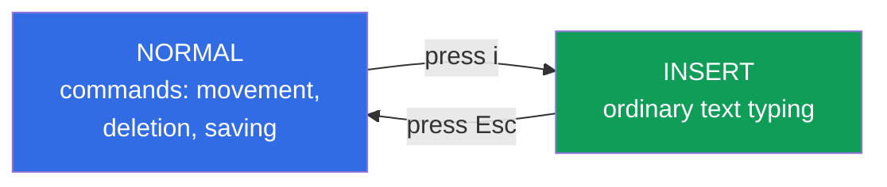

[Русская версия](ru.md) · [Versión en español](es.md) · [Version française](fr.md) · [Deutsche Version](de.md) · [ქართული ვერსია](ge.md) · [繁體中文版](tw.md) · [日本語版](jp.md)

# Chapter 0.8. vim in 15 minutes: survive and configure it for YAML

> **Who this chapter is for.** A short practical minimum on the `vim` editor. On the
> CKA/CKAD exams and on cluster nodes it's the default editor, and you'll be editing
> with it constantly (manifests, configs, `/etc/...`). The goal isn't to "learn vim"
> but to stop wasting time on it: get in, edit, save, quit, and set up indentation
> correctly for YAML. If you already work confidently in vim - skip the chapter.

## 0.8.1. Two modes - the main thing to understand

All of a beginner's confusion in vim comes from **modes**. Keys do different things
depending on which mode you're in.



- **NORMAL** (default on entry) - keys are commands, not text.
- **INSERT** - ordinary text input; you enter it with `i`, leave with `Esc`.

Survival rule: **if something went wrong - hit `Esc`** (you'll return to Normal), and
only then the command.

## 0.8.2. The minimum commands to survive

This set covers 95% of the work on the exam:

| Action | Keys (from Normal mode) |
|--------|-------------------------|
| Enter editing | `i` |
| Leave editing | `Esc` |
| Save | `:w` + Enter |
| Save and quit | `:wq` or `ZZ` |
| Quit without saving | `:q!` |
| Undo / redo | `u` / `Ctrl+r` |
| Delete a line | `dd` |
| Copy / paste a line | `yy` / `p` |
| To start / end of file | `gg` / `G` |
| Search | `/text` + Enter (next - `n`) |
| Line numbers | `:set number` |

Open a file: `vim file.yaml`. That's it. Usually you won't need more on the exam.

## 0.8.3. Configuring for YAML - a must

The main trouble in vim when working with Kubernetes: **tabs instead of spaces** and
"drifting" indentation. YAML forbids tabs (Chapter 0.6), and vim may insert them by
default. So the first thing you do on the exam is create `~/.vimrc`:

```vim
set expandtab       " Tab inserts spaces, not a tab
set tabstop=2       " tab width - 2 spaces
set shiftwidth=2    " autoindent indent - 2 spaces
set number          " line numbers
set autoindent      " keep indentation on a new line
syntax on           " syntax highlighting
```

With this config the Tab key gives two spaces, and manifests don't break on
indentation. Setting up `~/.vimrc` is worth doing **first thing** on the exam (it's
part of the startup actions from Chapter 1).

## 0.8.4. The paste trap

When you paste (with the mouse) ready-made YAML into vim in Insert mode with
`autoindent` enabled, the indentation **cascades ever wider** - each line shifts
further to the right. Cure it like this:

```vim
:set paste      " before pasting - disables autoindent
" ... you paste the text ...
:set nopaste    " after pasting - restore normal mode
```

If you saw a "staircase" of indentation after pasting - that's it. `:set paste`, undo
(`u`), paste again.

## 0.8.5. Mini-glossary

- **Normal mode** - vim's command mode (default); keys are commands.
- **Insert mode** - text typing mode; enter with `i`, leave with `Esc`.
- **`:wq` / `:q!`** - save and quit / quit without saving.
- **`~/.vimrc`** - vim's settings file (indentation, line numbers).
- **`expandtab`** - replace tabs with spaces (critical for YAML).
- **`:set paste`** - paste mode without autoindent (against the "staircase").

## 0.8.6. Chapter summary

- vim has two modes: Normal (commands) and Insert (text); switch with `i` and `Esc`.
  Lost - hit `Esc`.
- The survival minimum: `i`, `Esc`, `:wq`, `:q!`, `u`, `dd`, `/search`, `:set number`.
- For YAML you must set up `~/.vimrc` (`expandtab`, `tabstop=2`, `shiftwidth=2`) -
  otherwise tabs will break manifests.
- When pasting ready-made text, use `:set paste` so the indentation doesn't "drift".

## 0.8.7. How this helps: on the exam and in real work

**On the exam.** The editor is your main tool for 2 hours straight. Minutes lost
fiddling with vim are unsolved tasks. A configured `~/.vimrc` and a dozen commands
save time on every manifest task.

**In real work.** vim is on any Linux node without installation - when you edit a
config on a server over SSH, there's often no choice. Basic vim skills are a
mandatory skill for an engineer.

## 0.8.8. Self-check questions

1. How does Normal mode differ from Insert, and how do you switch between them?
2. How do you save a file and quit? How do you quit without saving?
3. Why must you set up `expandtab` and a 2-space indent for YAML?
4. What do you do if the indentation "drifted into a staircase" after pasting text?

## Practice

The chapter has no separate lab: you'll use vim in all the following labs and mock
exams, editing manifests. Set up `~/.vimrc` once - and forget about the indentation
problem. Next up starts the main course - Chapter 1.

---
[Contents](../README.md) · [Chapter 0.7](../00-7-netns/README.md) · [Chapter 1](../01/README.md)
