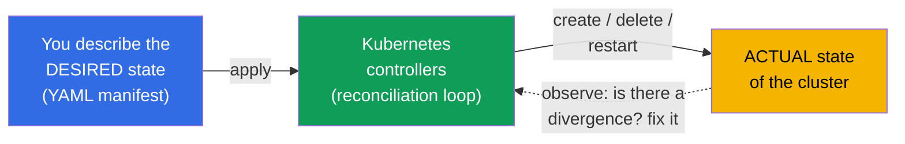
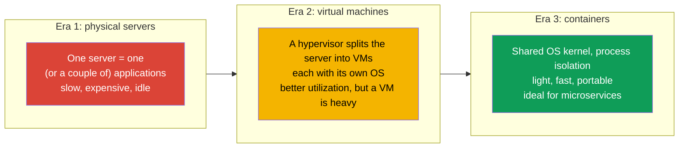
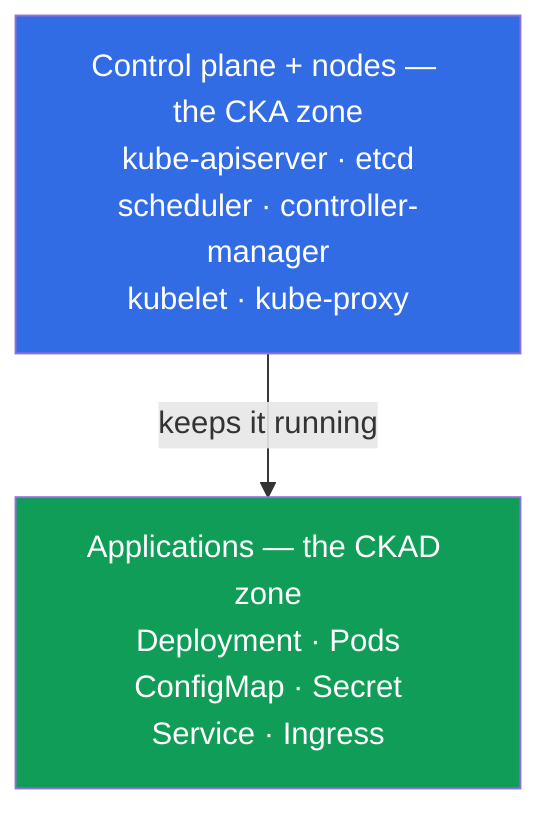
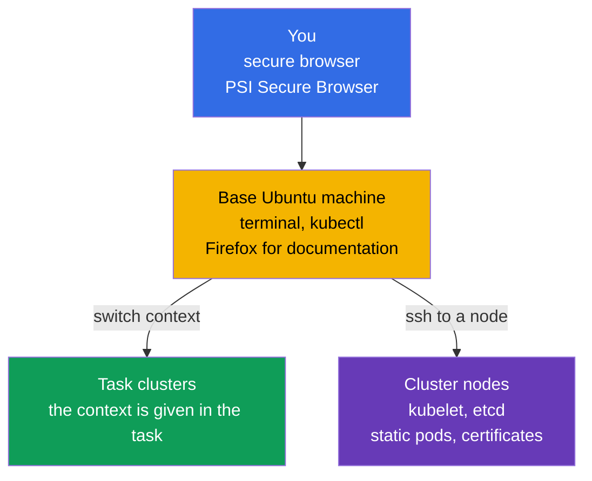
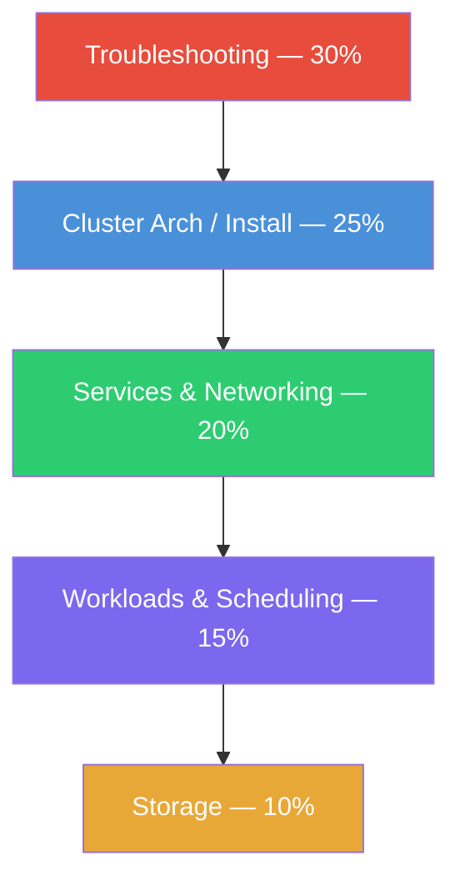
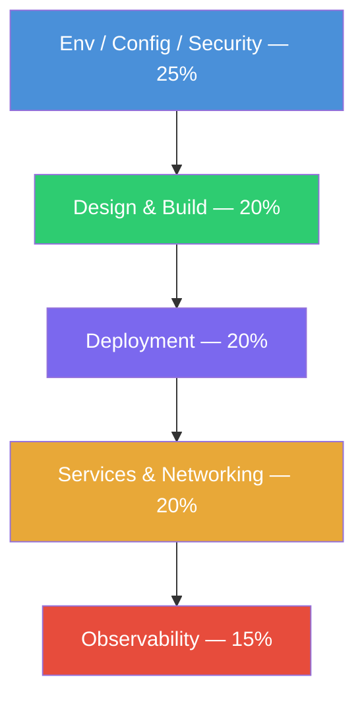
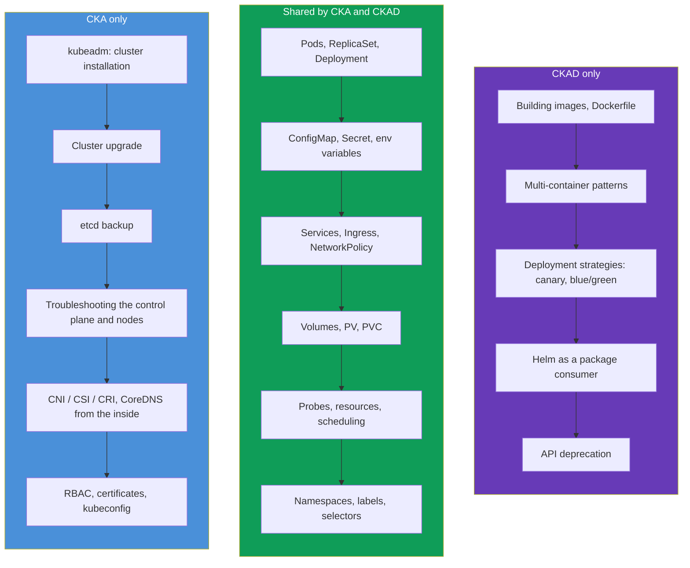
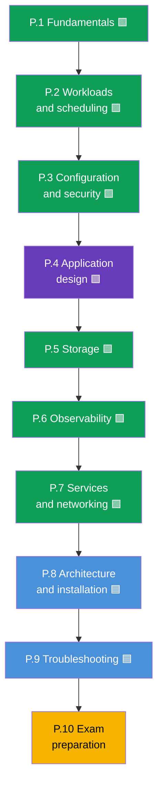

[Русская версия](ru.md) · [Versión en español](es.md) · [Version française](fr.md) · [Deutsche Version](de.md) · [ქართული ვერსია](ge.md) · [繁體中文版](tw.md) · [日本語版](jp.md)

# Chapter 1. Introduction: Kubernetes, the CKA and CKAD exams, and how this course is built

> **Who this chapter and the whole course are for.** We assume you have already worked
> with Linux in a terminal, understand what a container and a Docker image are, and have
> at least once run a container. Kubernetes experience is not required - we will build
> everything from scratch. The goal of the course is not to "get acquainted", but to
> bring you to a level where you confidently pass **two** practical exams: **CKA**
> (cluster administrator) and **CKAD** (application developer). The course is
> deliberately made fuller than typical commercial courses: where they give "enough to
> pass", we give "enough to understand and pass".
>
> This first chapter is an overview. We will figure out what Kubernetes is and why it is
> needed, how CKA and CKAD differ, how the exams themselves are organized, what is in
> their curricula, and how this course is built. Practice with commands starts in the
> next chapter.

## 1.1. What Kubernetes is and what problem it solves

Let us start with the problem, not with a definition. Imagine you have an application
packed into containers. As long as there is one container and one machine, everything is
simple: you ran `docker run`, and you are done. But in real operation an avalanche of
questions arises.

- The container crashed at night - who will restart it?
- The load has tripled - who will add five more copies, and then remove them?
- The server where the containers were running died - where will the containers move?
- How do you roll out a new version without taking users down?
- How does a container on one machine find a container on another?
- How do you hand out passwords, configs, and disks to containers?

All of this is the job of **container orchestration**. Kubernetes (often written as
"k8s": the letter `k`, eight letters, the letter `s`) is a system that takes these tasks
on itself. You declaratively describe the **desired state** ("I want 5 copies of this
application, with this config and this amount of memory"), and Kubernetes continuously
brings reality in line with that description: it starts, restarts, moves, scales.

This idea - the **reconciliation loop** - is the central one in Kubernetes.
Controllers continuously compare "what we wanted" with "what we have" and eliminate the
difference. That is exactly why Kubernetes itself restores crashed pods and keeps the
specified number of replicas: it does not "run a command and forget", it constantly
watches the state.

### Container orchestration is not only Kubernetes

Kubernetes is not the only orchestrator, but today it is the de facto standard. It is
useful to know its neighbors on the market.

| System | Who makes it | What it is known for |
|---------|-----------|--------------|
| **Kubernetes** | CNCF (originally Google) | De facto standard, huge ecosystem |
| **Docker Swarm** | Docker | Simple, but fewer capabilities, losing popularity |
| **Amazon ECS** | AWS | Proprietary, AWS only |
| **Nomad** | HashiCorp | Lightweight, handles more than containers |
| **Apache Mesos** | Apache | A veteran, now barely used for containers |

Both certifications, CKA and CKAD, are about Kubernetes specifically, so from here on we
talk only about it.

## 1.2. Where Kubernetes came from: from "bare metal" to containers

To understand why Kubernetes is built the way it is, it helps to see three eras of
application deployment.

Containers brought lightness and portability, but gave birth to a problem of scale: when
there are hundreds and thousands of containers, they need to be managed automatically.
That is how the need for an orchestrator appeared - and Kubernetes covered it.

## 1.3. Two certifications: CKA and CKAD

A whole line of official exams from the CNCF (Cloud Native Computing Foundation) and the
Linux Foundation is built around Kubernetes. Two of them interest us.

- **CKA - Certified Kubernetes Administrator.** The exam for those who
  **administer** a cluster: install it, upgrade it, fix it, configure networking,
  storage, security, deal with control plane and node failures.
- **CKAD - Certified Kubernetes Application Developer.** The exam for those who
  **develop and run applications** in a cluster: describe workloads, configure them,
  set up probes, services, volumes, debug applications.

The easiest way to remember the boundary is this: **CKA is responsible for the cluster,
CKAD - for the applications inside the cluster**. The administrator builds and maintains
the "house", the developer comfortably "lives" in it and furnishes their "rooms".

The boundary is not rigid: an administrator must understand applications, and a
developer must at least basically find their way around how a cluster is built. That is
exactly why studying both exams together is convenient: most of the knowledge is shared.

## 1.4. How the exams themselves are organized

Both CKA and CKAD are **fully practical**. No multiple-choice tests. You are put in
front of real clusters and given a set of tasks: create something, fix something,
configure something. A proctor watches through your camera and screen.

How this works technically. You connect through a **secure browser** (PSI Secure
Browser) to a remote environment - a **base Linux machine on Ubuntu** with `kubectl` and
a terminal already set up (next to it - Firefox for the documentation). That machine
itself is not a cluster: it is your "console", from which you work with all the clusters
in the tasks.

From the base machine you work in two ways:

- **Through the kubectl context.** Each task has its own cluster; you switch to it with
  the command `kubectl config use-context <name>` (it is usually given right in the task
  statement). This way you manage several clusters without logging into them.
- **Through SSH to a node.** Some tasks (especially on the CKA: a broken kubelet, a
  static pod, etcd, certificates) require logging into a specific node with
  `ssh <node>`, performing actions (often under `sudo -i`), and coming back with the
  `exit` command. Forgetting to return to the base machine is a frequent cause of
  "I am doing it on the wrong node".

| Parameter | CKA | CKAD |
|----------|-----|------|
| Format | Practical, in a live cluster | Practical, in a live cluster |
| Duration | 2 hours | 2 hours |
| Number of tasks | ~15-20 | ~15-20 |
| Passing score | 66% | 66% |
| Kubernetes version | current (right now `v1.35`) | current (right now `v1.35`) |
| Retake | 1 free attempt | 1 free attempt |
| Validity period | 2 years | 2 years |
| Documentation during the exam | allowed (kubernetes.io and others) | allowed (kubernetes.io and others) |

A few important consequences of the format, which shape the whole preparation strategy.

- **Speed decides.** 15-20 tasks in 2 hours is ~6-8 minutes per task. Anyone who digs
  through YAML syntax by hand does not finish in time. That is why we will train
  **imperative commands** and manifest generation via `--dry-run=client -o yaml` a lot.
- **Documentation is allowed, but there is no time to read.** You may open one browser
  tab on `kubernetes.io/docs`. It saves you when you forgot an exact field, but there is
  no time to look up the basics during the exam - you have to know them by heart.
- **Partial credit is awarded.** A partially completed task also earns points. So you
  should not get stuck - better to do what you can and move on.
- **Several clusters and contexts.** Each task specifies a cluster and a namespace.
  Forgetting to switch the context with `kubectl config use-context` is a classic way to
  lose points.

We will go through exam tactics in detail (aliases, JSONPath, time management) in the
final chapters 47 (CKAD) and 48 (CKA). For now remember the main thing: **both exams are
about speed and hands-on skill, not about memorizing theory**. But without theory your
hands work blind, so we give both.

## 1.5. Exam curricula: domains and weights

Each exam is officially split into domains with weights - the share of points that this
topic gives. The weights are a map of priorities: where the weight is bigger, we invest
more time.

**CKA** (current curriculum):

| CKA domain | Weight |
|-----------|-----|
| Troubleshooting (finding and fixing failures) | **30%** |
| Cluster Architecture, Installation & Configuration | **25%** |
| Services & Networking | **20%** |
| Workloads & Scheduling | **15%** |
| Storage | **10%** |

**CKAD** (current curriculum):

| CKAD domain | Weight |
|------------|-----|
| Application Environment, Configuration and Security | **25%** |
| Application Design and Build | **20%** |
| Application Deployment | **20%** |
| Services and Networking | **20%** |
| Application Observability and Maintenance | **15%** |

Visually you can see where the "center of gravity" of each exam is:

CKA - the emphasis is on operating the cluster (domains in descending order of weight):

CKAD - the emphasis is on applications (domains in descending order of weight):

The conclusion is obvious: **CKA is first of all troubleshooting and the internals of a
cluster**, while **CKAD is configuration, design, and deployment of applications**. Note
that the "Services & Networking" domain is in both exams, as is working with workloads
and storage. That is exactly the shared zone for which we merged the course.

## 1.6. Where the exams overlap and how they differ

If you overlay the curricula on each other, the picture looks like this.

The shared zone is huge - that is exactly why it makes sense to prepare for both exams
at once. Having gone through the common core once, you only pick up the specifics: for
the CKA - administration and troubleshooting, for the CKAD - development topics.

## 1.7. How this course is built

The course is split into 10 parts and 48 chapters. Each chapter is marked with the exam
it belongs to:

- 🟦 **CKA** - the topic is needed only by an administrator;
- 🟩 **CKAD** - the topic is needed only by a developer;
- 🟪 **CKA + CKAD** - a shared topic for both.

The order of the chapters is arranged from simple to complex and so that every new topic
builds on the previous ones. The common core (parts 1-7) comes first, because it is
needed for both exams and forms the foundation. Then the administrator part (8-9) and
exam preparation (10).

Every chapter follows a single template:

- an intro "what comes next" and why the topic is needed;
- theory with diagrams and tables;
- practice: `kubectl` commands, manifests, analysis of behavior;
- a glossary of key terms;
- a summary;
- self-check questions;
- a link to the lab.

**Labs** (`tasks/cka/labs`) are real clusters deployed in the cloud, where you practice
the material hands-on. One lab usually covers several adjacent chapters at once (for
example, namespaces + pods + deployments in a single lab), so that practice is whole
rather than broken into dozens of small tasks. Besides the labs there are
**mock exams** (`tasks/cka/mock`, `tasks/ckad/mock`) - rehearsals of the real exam with
automatic checking (`check_result`).

For those who are preparing specifically for one exam, there are two guides that collect
only the needed chapters and labs:

- [Curriculum and labs for CKA](../CKA.md)
- [Curriculum and labs for CKAD](../CKAD.md)

## 1.8. What you will need before the start

The technical minimum the course relies on:

- **Linux and the terminal.** Basic commands, working with files, `systemctl`,
  `journalctl`, the `vim` or `nano` editor. On the exam the editor is your main tool;
  a brief minimum on vim is in chapter [0.8](../00-8-vim/README.md).
- **Containers.** What an image, layers, a registry are, `docker`/`containerd`, how a
  container differs from a virtual machine.
- **YAML.** Kubernetes is described by manifests in YAML. Indentation with spaces (not
  tabs!), lists, nesting - you need to read and write this fluently.
- **Networking at a basic level.** IP, ports, DNS, TCP/HTTP - not in depth, but you
  should understand what they are.

If something here is still shaky - no problem. For networking, DNS, TLS, and containers
there is an optional **Part 0** - a preparatory foundation from scratch:

- 0.1. [Networking: IP, ports, CIDR, and NAT](../00-1-net/README.md)
- 0.2. [DNS: how names turn into addresses](../00-2-dns/README.md)
- 0.3. [TLS and certificates: HTTPS, keys, CA](../00-3-tls/README.md)
- 0.4. [Containers and Docker: images, layers, registries, runtime](../00-4-containers/README.md)

If these topics are familiar to you - feel free to skip Part 0. The stronger the
foundation, the easier things go later.

## 1.9. How to practice

Theory alone is not enough for practical exams - you need a cluster at hand. You have
several options:

| Option | Difficulty | Cost | What for |
|---------|-----------|-----------|----------|
| **minikube / kind** | low | free | a quick local cluster for CKAD topics |
| **kubeadm on VMs** | medium | free/cheap | a full-featured cluster, mandatory for the CKA |
| **Killercoda** | low | free | ready-made interactive scenarios in the browser |
| **This platform (`tasks/cka/labs`)** | low | low (AWS) | our labs and mocks on real clusters in AWS |

For the CKAD even a light local cluster is enough. For the CKA you need specifically a
**multi-node cluster brought up manually via kubeadm** - because the exam requires
fixing the control plane, upgrading the cluster, and backing up etcd, and in minikube you
cannot touch any of that. Our labs bring up such a cluster in AWS automatically.

## 1.10. Mini-glossary

- **Kubernetes (k8s)** - a container orchestration system: it brings the actual state of
  the cluster to the desired one.
- **Orchestration** - automatic management of the container lifecycle (start, restart,
  scaling, placement).
- **Desired state** - what you described in the manifest.
- **Reconciliation loop** - the continuous cycle in which controllers eliminate the
  difference between the desired and the actual state.
- **CKA** - Certified Kubernetes Administrator, the exam on cluster administration.
- **CKAD** - Certified Kubernetes Application Developer, the exam on running applications.
- **CNCF** - Cloud Native Computing Foundation, the organization behind Kubernetes and
  these certifications.
- **Manifest** - a YAML file describing a Kubernetes object.
- **kubectl** - the main command-line utility for working with a cluster.
- **Imperative approach** - managing objects with commands (`kubectl run`, `create`).
- **Declarative approach** - managing through manifests (`kubectl apply -f`).

## 1.11. Chapter summary

- Kubernetes is a container orchestrator: you describe the desired state, and it
  continuously brings reality to it through the reconciliation loop.
- Containers are the third era of deployment (after physical servers and VMs); their
  lightness and scale gave birth to the need for an orchestrator.
- CKA is about cluster administration, CKAD is about running applications in a cluster.
  The boundary: the "house" (CKA) versus "living in the house" (CKAD).
- Both exams are fully practical: 2 hours, ~15-20 tasks in a live cluster, a 66%
  threshold, documentation allowed, partial credit given. Speed and hands-on skill decide
  everything.
- The CKA center of gravity is troubleshooting (30%) and cluster internals (25%); the
  CKAD one - configuration (25%), application design and deployment.
- The curricula overlap heavily (workloads, services, configuration, storage), so
  preparing for both exams together is more efficient.
- The course is 10 parts and 48 chapters marked 🟦/🟩/🟪; first the common core, then the
  admin part and exam preparation. Practice is in the merged labs and mock exams.

## 1.12. How this helps: on the exam and in real work

We will end every chapter with a section like this - it links what you learned with two
things: what exactly will be asked on the exam and how it is applied in real operation.
That way theory does not hang in the air.

**On the exam.** This chapter is an overview, there are no separate tasks for it. But it
sets the strategy: you now understand the format (2 hours, ~15-20 tasks, a 66% threshold,
partial credit), you know the domain weights, and you already see where to invest time -
in troubleshooting and cluster internals for the CKA, in configuration and application
deployment for the CKAD.

**In real work.** CKA and CKAD are not "certificates for the sake of certificates", they
are a map of the skills of real roles:

| Role | Closer to the exam | What they do with Kubernetes |
|------|------------------|-------------------------|
| DevOps / Platform Engineer | CKA | Builds and maintains clusters, networking, storage, access |
| SRE | CKA (+ CKAD) | Keeps reliability, handles incidents, troubleshooting |
| Backend / App Developer | CKAD | Writes application manifests, probes, configs, deployment |
| Full-stack / team lead | CKA + CKAD | Understands the whole picture from cluster to application |

Being able to quickly create a pod, fix a broken deployment, or configure a
NetworkPolicy is daily work, not just an exam item. The course deliberately gives more
context than is strictly needed to pass, - so that after the certificate you are useful
in production, not only "able to pass a test".

## 1.13. Self-check questions

1. What does "Kubernetes brings the actual state to the desired one" mean? What is this
   mechanism called?
2. What is the fundamental difference between the areas of responsibility of the CKA and
   the CKAD? Give two examples of topics unique to each.
3. Why is speed so important on the exams, and what will we train to build it up?
4. Which domain gives the most points on the CKA and why is it worth investing a third
   of your time there?
5. Why is minikube not enough to prepare for the CKA, while for the CKAD it is enough?
6. What does merging preparation for the CKA and the CKAD into one course give you?

## Practice

This chapter is an overview, it has no separate lab. The next chapter starts the analysis
of how a cluster is built, and hands-on work with commands starts in chapter 3. We will
get to the first lab once we have covered the fundamentals and there is something to
practice hands-on; links to specific labs appear in the chapters whose material they
cover.

---
[Contents](../README.md) · [Part 0](../00-1-net/README.md) · [Chapter 2](../02/README.md)
