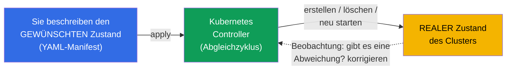
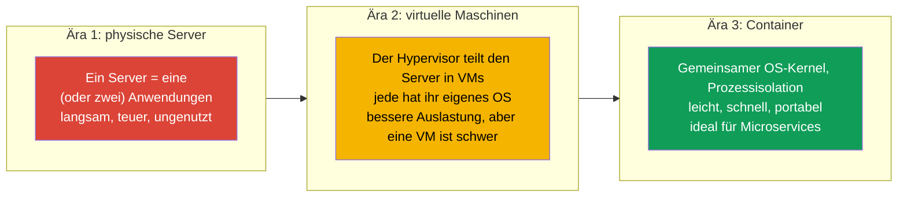
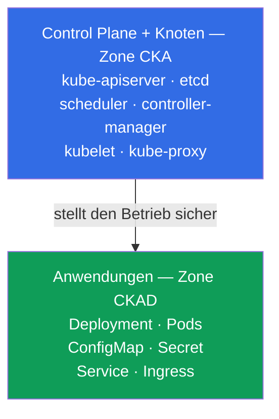
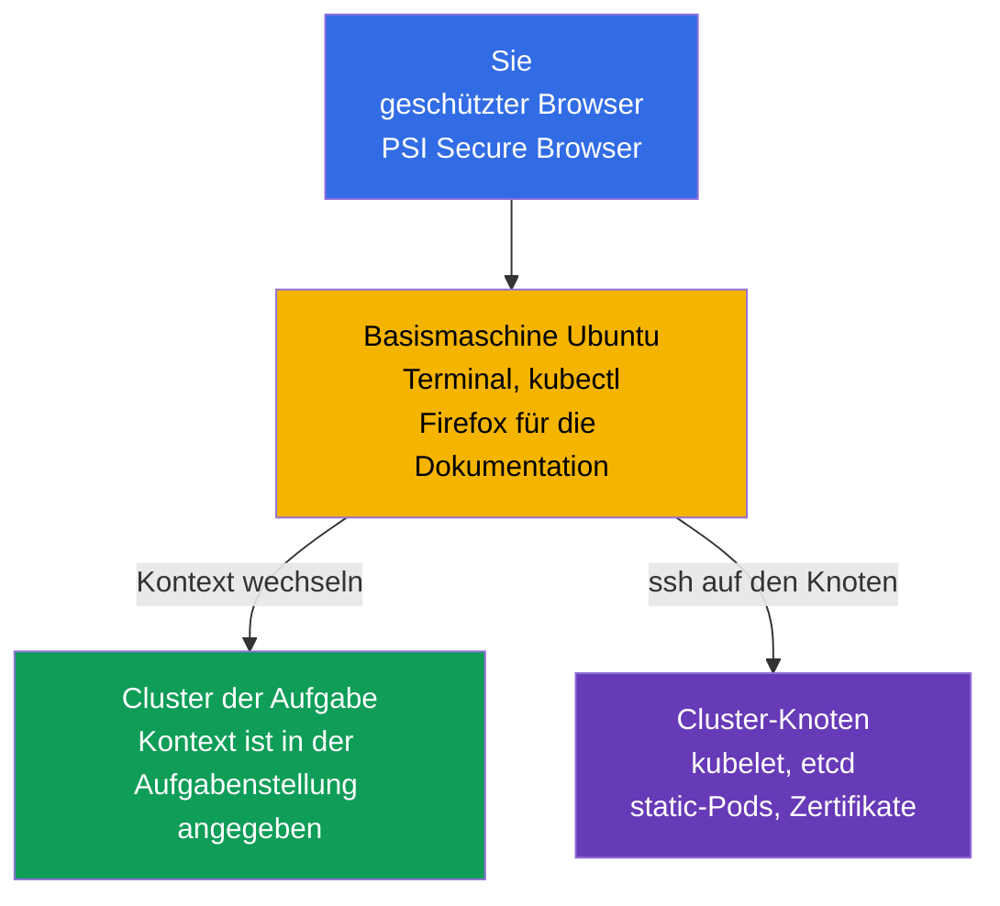
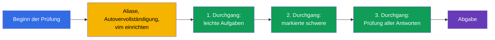
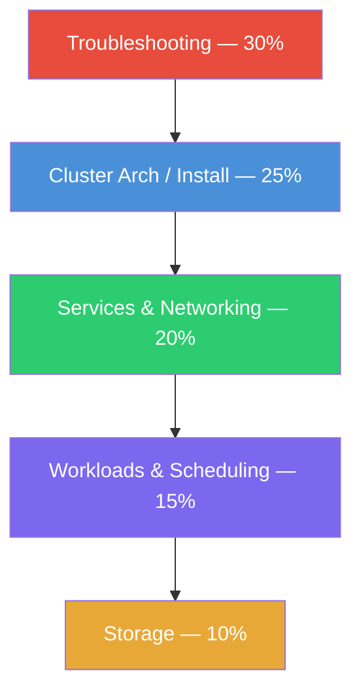
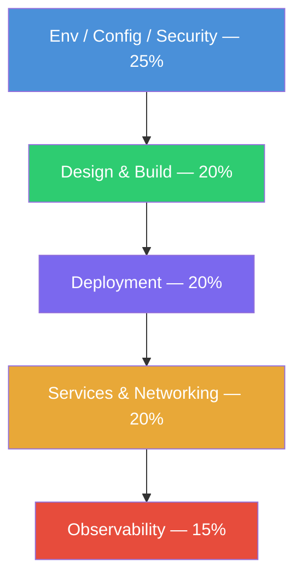
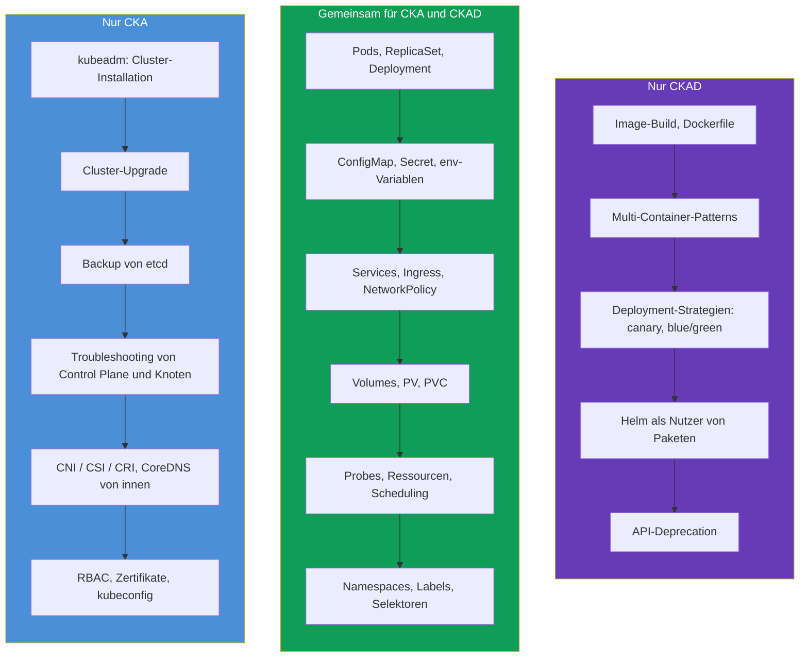
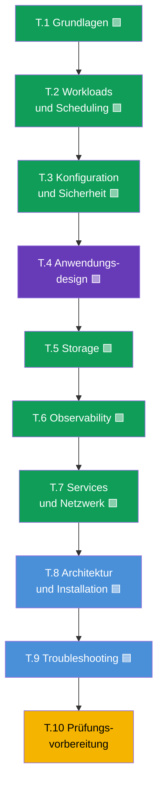

[Русская версия](ru.md) · [Eng version](README.md) · [Versión en español](es.md) · [Version française](fr.md) · [ქართული ვერსია](ge.md) · [繁體中文版](tw.md) · [日本語版](jp.md)

# Kapitel 1. Einführung: Kubernetes, die Prüfungen CKA und CKAD und der Aufbau des Kurses

> **Für wen dieses Kapitel und der ganze Kurs sind.** Wir gehen davon aus, dass Sie
> schon mit Linux im Terminal gearbeitet haben, verstehen, was ein Container und ein
> Docker-Image ist, und mindestens einmal einen Container gestartet haben. Erfahrung
> mit Kubernetes ist nicht nötig - wir bauen alles von Grund auf. Das Ziel des Kurses
> ist nicht ein „Kennenlernen“, sondern Sie auf ein Niveau zu bringen, auf dem Sie
> **zwei** praktische Prüfungen souverän bestehen: **CKA** (Cluster-Administrator) und
> **CKAD** (Anwendungsentwickler). Der Kurs ist bewusst vollständiger als typische
> kommerzielle Kurse angelegt: wo diese „genug zum Bestehen“ geben, geben wir „genug,
> um zu verstehen und zu bestehen“.
>
> Dieses erste Kapitel ist ein Überblick. Wir klären, was Kubernetes ist und wozu es
> gebraucht wird, wie sich CKA und CKAD unterscheiden, wie die Prüfungen selbst
> aufgebaut sind, was zu ihren Programmen gehört und wie dieser Kurs aufgebaut ist. Die
> Praxis mit Befehlen beginnt im nächsten Kapitel.

## 1.1. Was Kubernetes ist und welche Aufgabe es löst

Beginnen wir mit dem Problem, nicht mit einer Definition. Stellen Sie sich vor, Sie
haben eine Anwendung, verpackt in Container. Solange es einen Container und eine
Maschine gibt, ist alles einfach: `docker run` gestartet, und fertig. Doch im echten
Betrieb entsteht eine Lawine von Fragen.

- Der Container ist nachts abgestürzt - wer startet ihn neu?
- Die Last ist auf das Dreifache gestiegen - wer fügt fünf weitere Kopien hinzu und
  entfernt sie danach?
- Der Server, auf dem die Container liefen, ist ausgefallen - wohin ziehen die Container
  um?
- Wie rollt man eine neue Version aus, ohne die Nutzer abzuwerfen?
- Wie findet ein Container auf einer Maschine einen Container auf einer anderen?
- Wie verteilt man an Container Passwörter, Konfigurationen und Festplatten?

All das sind Aufgaben der **Container-Orchestrierung**. Kubernetes (oft schreibt man
„k8s“: Buchstabe `k`, acht Buchstaben, Buchstabe `s`) ist ein System, das diese Aufgaben
übernimmt. Sie beschreiben deklarativ den **gewünschten Zustand** („ich will 5 Kopien
dieser Anwendung, mit dieser Konfiguration und diesem Speichervolumen“), und Kubernetes
führt die Realität ständig an diese Beschreibung heran: startet, startet neu, verschiebt,
skaliert.

Diese Idee - die **Abgleichschleife** (reconciliation loop) - ist die zentrale in
Kubernetes. Controller vergleichen ununterbrochen „was gewollt war“ und „was ist“ und
beseitigen den Unterschied. Genau deshalb stellt Kubernetes abgestürzte Pods selbst
wieder her und hält die vorgegebene Anzahl von Repliken: es hat nicht „einen Befehl
ausgeführt und vergessen“, sondern überwacht den Zustand permanent.

### Container-Orchestrierung - nicht nur Kubernetes

Kubernetes ist nicht der einzige Orchestrator, aber heute der De-facto-Standard. Es ist
nützlich, die Nachbarn im Markt zu kennen.

| System | Wer es macht | Wofür es bekannt ist |
|---------|-----------|--------------|
| **Kubernetes** | CNCF (ursprünglich Google) | De-facto-Standard, riesiges Ökosystem |
| **Docker Swarm** | Docker | Einfach, aber weniger Möglichkeiten, verliert an Popularität |
| **Amazon ECS** | AWS | Proprietär, nur in AWS |
| **Nomad** | HashiCorp | Leichtgewichtig, kann nicht nur Container |
| **Apache Mesos** | Apache | Veteran, wird für Container heute kaum noch genutzt |

Beide Zertifizierungen, CKA und CKAD, drehen sich genau um Kubernetes, deshalb sprechen
wir weiter nur davon.

## 1.2. Woher Kubernetes kommt: von der „Hardware“ zu den Containern

Um zu verstehen, warum Kubernetes genau so aufgebaut ist, hilft es, die drei Epochen des
Anwendungs-Deployments zu sehen.

Container brachten Leichtigkeit und Portabilität, erzeugten aber ein Skalierungsproblem:
wenn es Hunderte und Tausende Container sind, müssen sie automatisch verwaltet werden.
So entstand der Bedarf an einem Orchestrator - und Kubernetes hat ihn gedeckt.

## 1.3. Zwei Zertifizierungen: CKA und CKAD

Um Kubernetes herum ist eine ganze Reihe offizieller Prüfungen der CNCF (Cloud Native
Computing Foundation) und der Linux Foundation aufgebaut. Uns interessieren zwei davon.

- **CKA - Certified Kubernetes Administrator.** Die Prüfung für diejenigen, die einen
  Cluster **administrieren**: ihn installieren, aktualisieren, reparieren, Netzwerk,
  Storage und Sicherheit konfigurieren, Ausfälle der Control Plane und der Knoten
  beheben.
- **CKAD - Certified Kubernetes Application Developer.** Die Prüfung für diejenigen, die
  **Anwendungen im Cluster entwickeln und betreiben**: Workloads beschreiben, sie
  konfigurieren, Probes, Services und Volumes einrichten, Anwendungen debuggen.

Am einfachsten merkt man sich die Grenze so: **CKA ist für den Cluster verantwortlich,
CKAD - für die Anwendungen innerhalb des Clusters**. Der Administrator baut und wartet
das „Haus“, der Entwickler „wohnt“ bequem darin und richtet seine „Zimmer“ ein.

Die Grenze ist nicht starr: der Administrator muss Anwendungen verstehen, und der
Entwickler sich wenigstens grundlegend im Aufbau des Clusters auskennen. Genau deshalb
ist es praktisch, beide Prüfungen zusammen zu lernen: der größte Teil des Wissens ist
gemeinsam.

## 1.4. Wie die Prüfungen selbst aufgebaut sind

Sowohl CKA als auch CKAD sind **vollständig praktisch**. Keine Multiple-Choice-Tests.
Man setzt Sie an echte Cluster und gibt Ihnen eine Reihe von Aufgaben: etwas erstellen,
reparieren, konfigurieren. Ein Proktor beobachtet über Kamera und Bildschirm.

Wie das technisch aussieht. Sie verbinden sich über einen **geschützten Browser** (PSI
Secure Browser) mit einer entfernten Umgebung - einer **Basis-Linux-Maschine mit
Ubuntu** mit bereits eingerichtetem `kubectl` und Terminal (daneben - Firefox für die
Dokumentation). Diese Maschine selbst ist kein Cluster: sie ist Ihr „Steuerpult“, von dem
aus Sie mit allen Clustern der Aufgabenstellung arbeiten.

Von der Basismaschine arbeiten Sie auf zwei Wegen:

- **Über den kubectl-Kontext.** Für jede Aufgabe ist ein eigener Cluster angegeben; Sie
  wechseln zu ihm mit dem Befehl `kubectl config use-context <name>` (er wird meist
  direkt in der Aufgabenstellung mitgegeben). So verwalten Sie mehrere Cluster, ohne sich
  auf ihnen anzumelden.
- **Über SSH auf den Knoten.** Ein Teil der Aufgaben (besonders bei CKA: kaputtes
  kubelet, static-Pod, etcd, Zertifikate) erfordert, sich per `ssh <node>` auf einen
  konkreten Knoten zu verbinden, Aktionen auszuführen (oft unter `sudo -i`) und mit dem
  Befehl `exit` zurückzukehren. Zu vergessen, auf die Basismaschine zurückzukehren, ist
  eine häufige Ursache für „ich arbeite auf dem falschen Knoten“.

| Parameter | CKA | CKAD |
|----------|-----|------|
| Format | Praktisch, im laufenden Cluster | Praktisch, im laufenden Cluster |
| Dauer | 2 Stunden | 2 Stunden |
| Anzahl der Aufgaben | ~15-20 | ~15-20 |
| Bestehensgrenze | 66% | 66% |
| Kubernetes-Version | aktuell (derzeit `v1.35`) | aktuell (derzeit `v1.35`) |
| Wiederholung | 1 kostenloser Versuch | 1 kostenloser Versuch |
| Gültigkeitsdauer | 2 Jahre | 2 Jahre |
| Dokumentation in der Prüfung | erlaubt (kubernetes.io u. a.) | erlaubt (kubernetes.io u. a.) |

Einige wichtige Folgerungen aus dem Format, die die ganze Vorbereitungsstrategie
bestimmen.

- **Geschwindigkeit entscheidet.** 15-20 Aufgaben in 2 Stunden - das sind ~6-8 Minuten
  pro Aufgabe. Wer sich von Hand in der YAML-Syntax vergräbt, kommt nicht durch. Deshalb
  trainieren wir viel **imperative Befehle** und das Generieren von Manifesten über
  `--dry-run=client -o yaml`.
- **Dokumentation ist erlaubt, aber es fehlt die Zeit zum Lesen.** Man darf einen
  Browser-Tab auf `kubernetes.io/docs` öffnen. Das rettet, wenn man ein genaues Feld
  vergessen hat, aber in der Prüfung Grundlagen zu suchen, dafür ist keine Zeit - die
  muss man auswendig können.
- **Es gibt Teilpunkte.** Für eine teilweise erledigte Aufgabe gibt es ebenfalls Punkte.
  Also sollte man nicht festhängen - besser machen, was man kann, und weitergehen.
- **Mehrere Cluster und Kontexte.** In jeder Aufgabe sind Cluster und Namespace
  angegeben. Zu vergessen, den Kontext mit `kubectl config use-context` zu wechseln, ist
  ein klassischer Punkteverlust.

Die Prüfungstaktik im Detail (Aliase, JSONPath, Zeitmanagement) behandeln wir in den
Abschlusskapiteln 47 (CKAD) und 48 (CKA). Merken Sie sich vorerst das Wichtigste: **beide
Prüfungen drehen sich um Geschwindigkeit und Handwerk, nicht um das Auswendiglernen von
Theorie**. Aber ohne Theorie arbeiten die Hände blind, deshalb geben wir beides.

## 1.5. Die Prüfungsprogramme: Domänen und Gewichte

Jede Prüfung ist offiziell in Domänen mit Gewichten unterteilt - dem Anteil an Punkten,
den dieses Thema liefert. Die Gewichte sind eine Prioritätenkarte: wo das Gewicht größer
ist, dort investieren wir mehr Zeit.

**CKA** (aktuelles Programm):

| Domäne CKA | Gewicht |
|-----------|-----|
| Troubleshooting (Suche und Behebung von Störungen) | **30%** |
| Cluster Architecture, Installation & Configuration | **25%** |
| Services & Networking | **20%** |
| Workloads & Scheduling | **15%** |
| Storage | **10%** |

**CKAD** (aktuelles Programm):

| Domäne CKAD | Gewicht |
|------------|-----|
| Application Environment, Configuration and Security | **25%** |
| Application Design and Build | **20%** |
| Application Deployment | **20%** |
| Services and Networking | **20%** |
| Application Observability and Maintenance | **15%** |

Visuell sieht man, wo der „Schwerpunkt“ jeder Prüfung liegt:

CKA - Akzent auf dem Betrieb des Clusters (Domänen nach absteigendem Gewicht):

CKAD - Akzent auf den Anwendungen (Domänen nach absteigendem Gewicht):

Die Schlussfolgerung liegt auf der Hand: **CKA ist in erster Linie Troubleshooting und
der Aufbau des Clusters**, und **CKAD ist Konfiguration, Design und Deployment von
Anwendungen**. Achten Sie darauf: die Domäne „Services & Networking“ gibt es in beiden
Prüfungen, ebenso die Arbeit mit Workloads und Storage. Das ist die gemeinsame Zone,
wegen der wir den Kurs zusammengeführt haben.

## 1.6. Wo sich die Prüfungen überschneiden und worin sie sich unterscheiden

Legt man die Programme übereinander, ergibt sich folgendes Bild.

Die gemeinsame Zone ist riesig - genau deshalb ist es sinnvoll, sich auf beide Prüfungen
gleichzeitig vorzubereiten. Nachdem Sie den gemeinsamen Kern einmal durchgearbeitet
haben, holen Sie nur noch die Spezifika nach: für CKA - Administration und
Troubleshooting, für CKAD - Entwicklerthemen.

## 1.7. Wie dieser Kurs aufgebaut ist

Der Kurs ist in 10 Teile und 48 Kapitel gegliedert. Jedes Kapitel ist markiert, zu
welcher Prüfung es gehört:

- 🟦 **CKA** - das Thema braucht nur der Administrator;
- 🟩 **CKAD** - das Thema braucht nur der Entwickler;
- 🟪 **CKA + CKAD** - gemeinsames Thema für beide.

Die Reihenfolge der Kapitel ist vom Einfachen zum Komplexen aufgebaut und so, dass jedes
neue Thema auf den vorherigen aufbaut. Der gemeinsame Kern (Teile 1-7) kommt zuerst, weil
er für beide Prüfungen gebraucht wird und das Fundament bildet. Danach der
Administrations-Teil (8-9) und die Prüfungsvorbereitung (10).

Jedes Kapitel folgt einer einheitlichen Vorlage:

- Einleitung „was kommt“ und wozu das Thema gebraucht wird;
- Theorie mit Diagrammen und Tabellen;
- Praxis: `kubectl`-Befehle, Manifeste, Analyse des Verhaltens;
- Glossar der Schlüsselbegriffe;
- Zusammenfassung;
- Fragen zur Selbstprüfung;
- Link zur Übung.

**Übungen** (`tasks/cka/labs`) sind in der Cloud ausgerollte reale Cluster, in denen Sie
den Stoff mit den Händen durcharbeiten. Eine Übung deckt meist gleich mehrere
zusammenhängende Kapitel ab (zum Beispiel Namespaces + Pods + Deployments - in einer
Arbeit), damit die Praxis geschlossen bleibt und nicht in Dutzende kleine Aufgaben
zerfällt. Neben den Übungen gibt es **Mock-Prüfungen** (`tasks/cka/mock`,
`tasks/ckad/mock`) - Generalproben der echten Prüfung mit automatischer Prüfung
(`check_result`).

Für diejenigen, die sich zielgerichtet auf eine Prüfung vorbereiten, gibt es zwei
Wegweiser, die nur die nötigen Kapitel und Übungen zusammenfassen:

- [Programm und Übungen für CKA](../CKA_DE.md)
- [Programm und Übungen für CKAD](../CKAD_DE.md)

## 1.8. Was Sie vor dem Start brauchen

Das technische Minimum, auf dem der Kurs aufbaut:

- **Linux und Terminal.** Grundbefehle, Arbeit mit Dateien, `systemctl`, `journalctl`,
  Editor `vim` oder `nano`. In der Prüfung ist der Editor Ihr Hauptwerkzeug; ein kurzes
  Minimum zu vim - in Kapitel [0.8](../00-8-vim/de.md).
- **Container.** Was ein Image, Layer, eine Registry ist, `docker`/`containerd`, worin
  sich ein Container von einer virtuellen Maschine unterscheidet.
- **YAML.** Kubernetes wird durch Manifeste in YAML beschrieben. Einrückungen mit
  Leerzeichen (nicht mit Tabs!), Listen, Verschachtelung - das muss man frei lesen und
  schreiben können.
- **Netzwerk auf Grundniveau.** IP, Ports, DNS, TCP/HTTP - ohne Tiefen, aber verstehen,
  was das ist.

Wenn davon etwas noch wackelig ist - kein Problem. Für Netzwerke, DNS, TLS und Container
gibt es den optionalen **Teil 0** - ein vorbereitendes Fundament von Grund auf:

- 0.1. [Netzwerk: IP, Ports, CIDR und NAT](../00-1-net/de.md)
- 0.2. [DNS: wie Namen zu Adressen werden](../00-2-dns/de.md)
- 0.3. [TLS und Zertifikate: HTTPS, Schlüssel, CA](../00-3-tls/de.md)
- 0.4. [Container und Docker: Images, Layer, Registries, Runtime](../00-4-containers/de.md)

Wenn Ihnen diese Themen bekannt sind - überspringen Sie Teil 0 ruhig. Je fester das
Fundament, desto leichter geht es weiter.

## 1.9. Wie man üben sollte

Theorie allein reicht für praktische Prüfungen nicht - man braucht einen Cluster zur
Hand. Dafür haben Sie mehrere Möglichkeiten:

| Variante | Schwierigkeit | Kosten | Wofür |
|---------|-----------|-----------|----------|
| **minikube / kind** | niedrig | kostenlos | schneller lokaler Cluster für CKAD-Themen |
| **kubeadm auf VMs** | mittel | kostenlos/günstig | vollwertiger Cluster, für CKA zwingend |
| **Killercoda** | niedrig | kostenlos | fertige interaktive Szenarien im Browser |
| **Diese Plattform (`tasks/cka/labs`)** | niedrig | niedrig (AWS) | unsere Übungen und Mocks auf echten Clustern in AWS |

Für CKAD genügt auch ein leichter lokaler Cluster. Für CKA braucht man genau einen
**Multi-Node-Cluster, manuell über kubeadm aufgesetzt** - weil die Prüfung verlangt, die
Control Plane zu reparieren, den Cluster zu aktualisieren und etcd zu backupen, und in
minikube kann man das nicht anfassen. Unsere Übungen fahren so einen Cluster automatisch
in AWS hoch.

## 1.10. Mini-Glossar

- **Kubernetes (k8s)** - System zur Container-Orchestrierung: führt den realen Zustand
  des Clusters an den gewünschten heran.
- **Orchestrierung** - automatische Verwaltung des Lebenszyklus von Containern (Start,
  Neustart, Skalierung, Platzierung).
- **Gewünschter Zustand (desired state)** - das, was Sie im Manifest beschrieben haben.
- **Abgleichschleife (reconciliation loop)** - fortlaufender Zyklus, in dem Controller
  den Unterschied zwischen gewünschtem und realem Zustand beseitigen.
- **CKA** - Certified Kubernetes Administrator, Prüfung zur Cluster-Administration.
- **CKAD** - Certified Kubernetes Application Developer, Prüfung zum Betrieb von
  Anwendungen.
- **CNCF** - Cloud Native Computing Foundation, die Organisation hinter Kubernetes und
  diesen Zertifizierungen.
- **Manifest** - YAML-Datei mit der Beschreibung eines Kubernetes-Objekts.
- **kubectl** - das zentrale Kommandozeilenwerkzeug für die Arbeit mit dem Cluster.
- **Imperativer Ansatz** - Verwaltung von Objekten per Befehl (`kubectl run`, `create`).
- **Deklarativer Ansatz** - Verwaltung über Manifeste (`kubectl apply -f`).

## 1.11. Zusammenfassung des Kapitels

- Kubernetes ist ein Container-Orchestrator: Sie beschreiben den gewünschten Zustand, und
  es führt die Realität über die Abgleichschleife ständig daran heran.
- Container sind die dritte Deployment-Ära (nach physischen Servern und VMs); ihre
  Leichtigkeit und Skalierung erzeugten den Bedarf an einem Orchestrator.
- CKA dreht sich um die Cluster-Administration, CKAD um den Betrieb von Anwendungen im
  Cluster. Die Grenze: das „Haus“ (CKA) gegen das „Leben im Haus“ (CKAD).
- Beide Prüfungen sind vollständig praktisch: 2 Stunden, ~15-20 Aufgaben im laufenden
  Cluster, Grenze 66%, Dokumentation erlaubt, es gibt Teilpunkte. Alles entscheiden
  Geschwindigkeit und Handwerk.
- Bei CKA liegt der Schwerpunkt auf Troubleshooting (30%) und dem Aufbau des Clusters
  (25%); bei CKAD auf Konfiguration (25%), Design und Deployment von Anwendungen.
- Die Programme überschneiden sich stark (Workloads, Services, Konfiguration, Storage),
  deshalb ist es effizienter, sich auf beide Prüfungen zusammen vorzubereiten.
- Der Kurs umfasst 10 Teile und 48 Kapitel, markiert mit 🟦/🟩/🟪; zuerst der gemeinsame
  Kern, dann der Admin-Teil und die Prüfungsvorbereitung. Die Praxis - in
  zusammengefassten Übungen und Mock-Prüfungen.

## 1.12. Wozu das nützt: in der Prüfung und in der echten Arbeit

Jedes Kapitel beenden wir mit so einem Abschnitt - er verbindet das Gelernte mit zwei
Dingen: was konkret in der Prüfung gefragt wird und wie man es im echten Betrieb
anwendet. So hängt die Theorie nicht in der Luft.

**In der Prüfung.** Dieses Kapitel ist ein Überblick, eigene Aufgaben dazu gibt es nicht.
Aber es setzt die Strategie: Sie verstehen jetzt das Format (2 Stunden, ~15-20 Aufgaben,
Grenze 66%, Teilpunkte), kennen die Gewichte der Domänen und sehen schon, wohin Sie Zeit
investieren - in Troubleshooting und den Aufbau des Clusters für CKA, in Konfiguration
und Deployment von Anwendungen für CKAD.

**In der echten Arbeit.** CKA und CKAD sind keine „Scheine um der Scheine willen“,
sondern eine Kompetenzkarte realer Rollen:

| Rolle | Näher an der Prüfung | Was sie mit Kubernetes macht |
|------|------------------|-------------------------|
| DevOps / Platform Engineer | CKA | Baut und betreibt Cluster, Netzwerk, Storage, Zugriffe |
| SRE | CKA (+ CKAD) | Hält die Zuverlässigkeit, analysiert Vorfälle, Troubleshooting |
| Backend / App Developer | CKAD | Schreibt Anwendungsmanifeste, Probes, Konfigurationen, Deployment |
| Full-Stack / Teamlead | CKA + CKAD | Versteht das ganze Bild vom Cluster bis zur Anwendung |

Die Fähigkeit, schnell einen Pod zu erstellen, ein kaputtes Deployment zu reparieren oder
eine NetworkPolicy zu konfigurieren, ist tägliche Arbeit und nicht bloß ein Prüfungspunkt.
Der Kurs gibt bewusst mehr Kontext, als strikt zum Bestehen nötig ist, - damit Sie nach
dem Zertifikat in der Produktion nützlich sind und nicht nur „einen Test bestehen
konnten“.

## 1.13. Fragen zur Selbstprüfung

1. Was bedeutet „Kubernetes führt den realen Zustand an den gewünschten heran“? Wie heißt
   dieser Mechanismus?
2. Worin liegt der prinzipielle Unterschied zwischen den Verantwortungsbereichen von CKA
   und CKAD? Nennen Sie je zwei Beispiele für Themen, die für jeden einzigartig sind.
3. Warum ist in den Prüfungen die Geschwindigkeit so wichtig, und was werden wir
   trainieren, um sie zu erreichen?
4. Welche Domäne liefert bei CKA am meisten Punkte, und warum lohnt es sich, dort ein
   Drittel der Zeit zu investieren?
5. Warum genügt minikube für die Vorbereitung auf CKA nicht, für CKAD aber schon?
6. Was bringt die Zusammenführung der Vorbereitung auf CKA und CKAD in einem Kurs?

## Praxis

Dieses Kapitel ist ein Überblick, eine eigene Übung hat es nicht. Ab dem nächsten Kapitel
beginnt die Analyse des Cluster-Aufbaus, und die praktische Arbeit mit Befehlen - ab
Kapitel 3. Zur ersten Übung kommen wir, wenn wir die Grundlagen behandelt haben und es
etwas zum Üben mit den Händen gibt; Links zu konkreten Übungen erscheinen in den Kapiteln,
deren Stoff sie abdecken.

---
[Inhalt](../README_DE.md) · [Teil 0](../00-1-net/de.md) · [Kapitel 2](../02/de.md)
