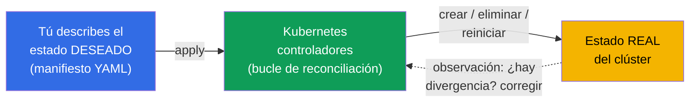
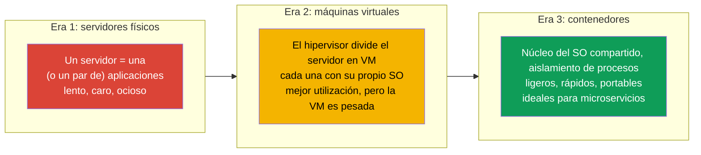
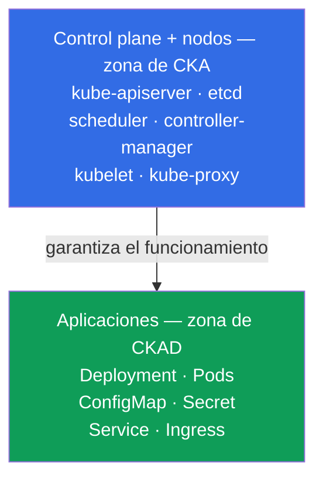
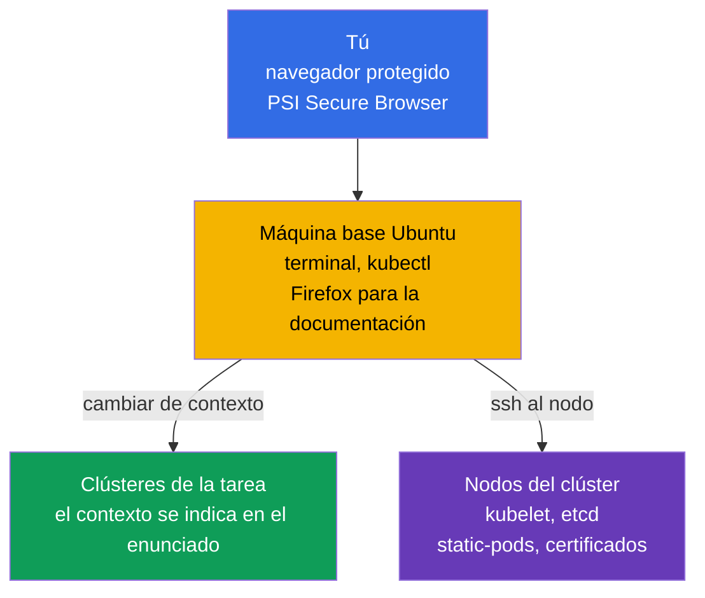
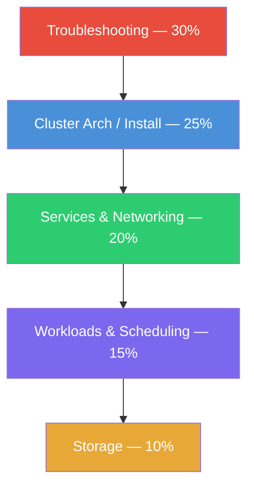
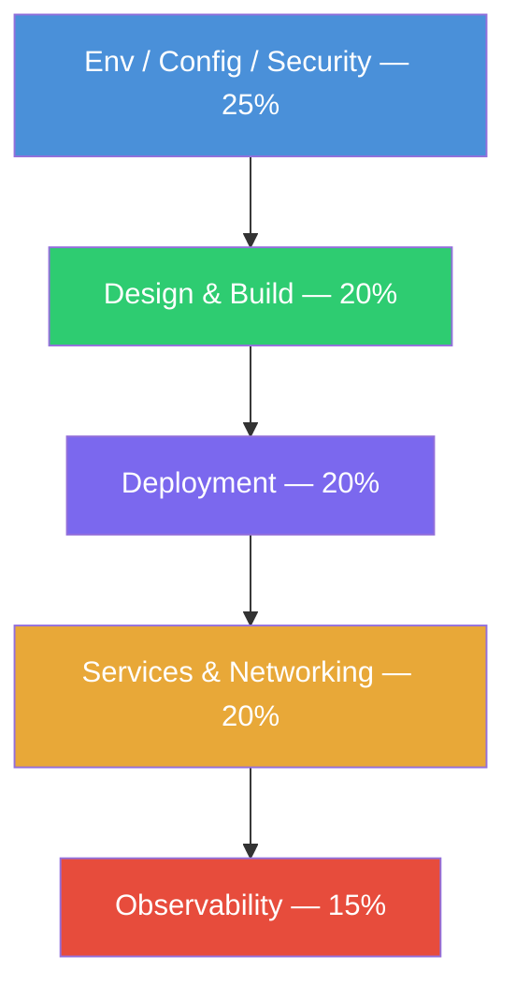
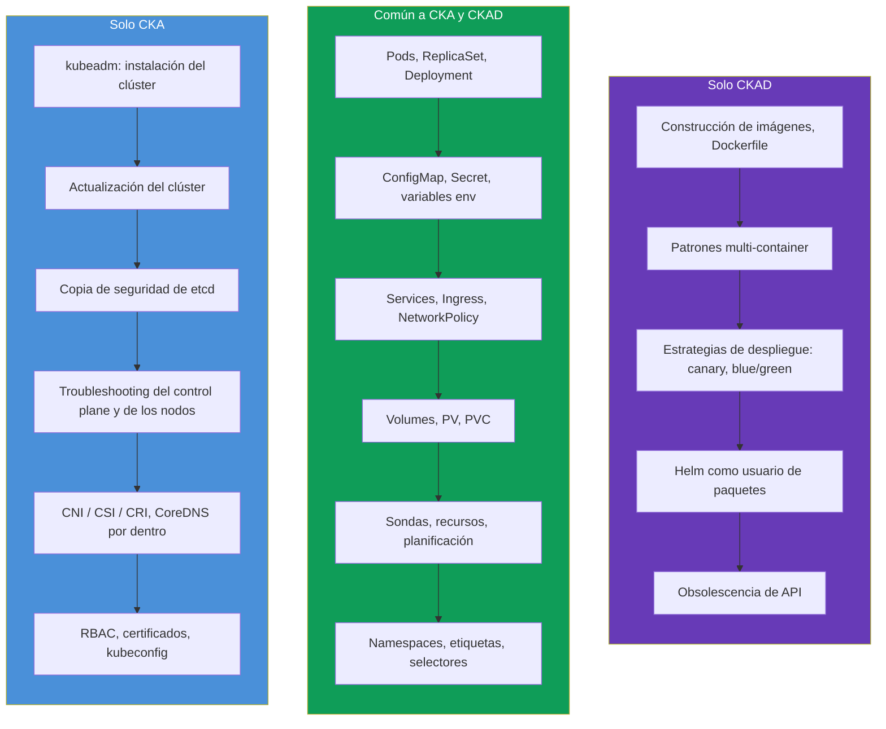
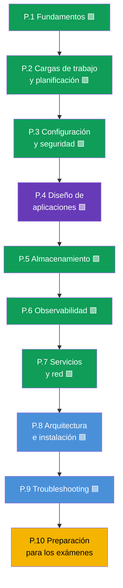

[Русская версия](ru.md) · [Eng version](README.md) · [Version française](fr.md) · [Deutsche Version](de.md) · [ქართული ვერსია](ge.md) · [繁體中文版](tw.md) · [日本語版](jp.md)

# Capítulo 1. Introducción: Kubernetes, los exámenes CKA y CKAD y la estructura del curso

> **Para quién es este capítulo y todo el curso.** Damos por hecho que ya has
> trabajado con Linux en el terminal, entiendes qué es un contenedor y una imagen
> Docker, y al menos una vez has lanzado un contenedor. La experiencia con Kubernetes
> no es obligatoria - lo construiremos todo desde cero. El objetivo del curso no es
> «tomar contacto», sino llevarte al nivel en el que apruebes con seguridad **dos**
> exámenes prácticos: **CKA** (administrador del clúster) y **CKAD** (desarrollador de
> aplicaciones). El curso está hecho a propósito más completo que los cursos
> comerciales típicos: donde ellos dan «lo suficiente para aprobar», nosotros damos
> «lo suficiente para entender y aprobar».
>
> Este primer capítulo es panorámico. Veremos qué es Kubernetes y para qué hace
> falta, en qué se diferencian CKA y CKAD, cómo están organizados los propios
> exámenes, qué entra en sus programas y cómo está construido este curso. La práctica
> con comandos empezará en el capítulo siguiente.

## 1.1. Qué es Kubernetes y qué problema resuelve

Empecemos por el problema, no por la definición. Imagina que tienes una aplicación
empaquetada en contenedores. Mientras hay un solo contenedor y una sola máquina todo es
simple: lanzas `docker run` y listo. Pero en explotación real surge una avalancha de
preguntas.

- El contenedor se cayó de noche - ¿quién lo reinicia?
- La carga se triplicó - ¿quién añade otras cinco copias y luego las retira?
- El servidor donde corrían los contenedores murió - ¿adónde se mudan los contenedores?
- ¿Cómo desplegar una versión nueva sin tirar a los usuarios?
- ¿Cómo encuentra un contenedor de una máquina a un contenedor de otra?
- ¿Cómo repartir a los contenedores contraseñas, configuraciones y discos?

Todo esto son tareas de **orquestación de contenedores**. Kubernetes (a menudo se
escribe «k8s»: la letra `k`, ocho letras, la letra `s`) es el sistema que asume esas
tareas. Tú describes de forma declarativa el **estado deseado** («quiero 5 copias de
esta aplicación, con esta configuración y esta cantidad de memoria»), y Kubernetes
lleva continuamente la realidad hacia esa descripción: lanza, reinicia, traslada,
escala.

Esta idea - el **bucle de reconciliación** (reconciliation loop) - es la principal en
Kubernetes. Los controladores comparan sin parar «lo que se quería» con «lo que hay» y
eliminan la diferencia. Precisamente por eso Kubernetes restaura por sí mismo los pods
caídos y mantiene el número de réplicas indicado: no «ejecutó un comando y se olvidó»,
sino que vigila el estado de forma permanente.

### La orquestación de contenedores no es solo Kubernetes

Kubernetes no es el único orquestador, pero hoy es el estándar de facto. Es útil
conocer a los vecinos del mercado.

| Sistema | Quién lo hace | Por qué es conocido |
|---------|-----------|--------------|
| **Kubernetes** | CNCF (originalmente Google) | Estándar de facto, ecosistema enorme |
| **Docker Swarm** | Docker | Simple, pero con menos capacidades, pierde popularidad |
| **Amazon ECS** | AWS | Propietario, solo en AWS |
| **Nomad** | HashiCorp | Ligero, sabe manejar no solo contenedores |
| **Apache Mesos** | Apache | Veterano, hoy casi no se usa para contenedores |

Ambas certificaciones, CKA y CKAD, son precisamente sobre Kubernetes, así que en
adelante hablamos solo de él.

## 1.2. De dónde salió Kubernetes: del «hierro» a los contenedores

Para entender por qué Kubernetes está hecho así, conviene ver las tres eras del
despliegue de aplicaciones.

Los contenedores dieron ligereza y portabilidad, pero generaron el problema de la
escala: cuando los contenedores son cientos y miles, hay que gestionarlos
automáticamente. Así apareció la necesidad de un orquestador - y Kubernetes la cubrió.

## 1.3. Dos certificaciones: CKA y CKAD

Alrededor de Kubernetes se ha construido toda una línea de exámenes oficiales de la
CNCF (Cloud Native Computing Foundation) y la Linux Foundation. A nosotros nos
interesan dos de ellos.

- **CKA - Certified Kubernetes Administrator.** Examen para quienes **administran** el
  clúster: lo instalan, lo actualizan, lo reparan, configuran la red, los
  almacenamientos, la seguridad, y resuelven fallos del control plane y de los nodos.
- **CKAD - Certified Kubernetes Application Developer.** Examen para quienes
  **desarrollan y ejecutan aplicaciones** en el clúster: describen cargas de trabajo,
  las configuran, ajustan sondas, servicios, volúmenes y depuran aplicaciones.

La forma más fácil de recordar la frontera es esta: **CKA responde del clúster, CKAD -
de las aplicaciones dentro del clúster**. El administrador construye y mantiene la
«casa», el desarrollador «vive» cómodamente en ella y amuebla sus «habitaciones».

La frontera no es rígida: el administrador está obligado a entender las aplicaciones, y
el desarrollador - al menos a orientarse de forma básica en la estructura del clúster.
Justo por eso resulta cómodo estudiar ambos exámenes juntos: la mayor parte del
conocimiento es común.

## 1.4. Cómo están organizados los propios exámenes

Tanto CKA como CKAD son **totalmente prácticos**. Ningún test de opción múltiple. Te
sientan ante clústeres reales y te dan un conjunto de tareas: crear algo, repararlo,
configurarlo. Un proctor observa a través de la cámara y de la pantalla.

Cómo funciona técnicamente. Te conectas mediante un **navegador protegido** (PSI Secure
Browser) a un entorno remoto - una **máquina Linux base con Ubuntu** con `kubectl` y un
terminal ya configurados (al lado, Firefox para la documentación). Esa máquina en sí no
es un clúster: es tu «mando», desde el que trabajas con todos los clústeres del examen.

Desde la máquina base trabajas de dos maneras:

- **A través del contexto de kubectl.** Para cada tarea se indica su clúster; cambias a
  él con el comando `kubectl config use-context <nombre>` (normalmente lo dan en el
  propio enunciado). Así gestionas varios clústeres sin entrar en ellos.
- **A través de SSH al nodo.** Parte de las tareas (sobre todo en CKA: kubelet roto,
  static-pod, etcd, certificados) exige entrar en un nodo concreto con `ssh <node>`,
  ejecutar acciones (a menudo bajo `sudo -i`) y volver atrás con el comando `exit`.
  Olvidar volver a la máquina base es una causa frecuente de «lo estoy haciendo en el
  nodo equivocado».

| Parámetro | CKA | CKAD |
|----------|-----|------|
| Formato | Práctico, en un clúster vivo | Práctico, en un clúster vivo |
| Duración | 2 horas | 2 horas |
| Número de tareas | ~15-20 | ~15-20 |
| Nota de aprobado | 66% | 66% |
| Versión de Kubernetes | actual (ahora `v1.35`) | actual (ahora `v1.35`) |
| Reintento | 1 intento gratuito | 1 intento gratuito |
| Validez | 2 años | 2 años |
| Documentación en el examen | permitida (kubernetes.io y otras) | permitida (kubernetes.io y otras) |

Varias consecuencias importantes del formato, que determinan toda la estrategia de
preparación.

- **La velocidad decide.** 15-20 tareas en 2 horas son ~6-8 minutos por tarea. Quien se
  pelea a mano con la sintaxis de YAML no llega. Por eso entrenaremos mucho los
  **comandos imperativos** y la generación de manifiestos con `--dry-run=client -o yaml`.
- **La documentación está permitida, pero no hay tiempo para leer.** Puedes abrir una
  pestaña del navegador en `kubernetes.io/docs`. Eso salva cuando has olvidado un campo
  exacto, pero buscar lo básico durante el examen no da tiempo - eso hay que saberlo de
  memoria.
- **Se dan puntos parciales.** Por una tarea parcialmente resuelta también dan puntos.
  Es decir, no conviene atascarse - mejor hacer lo que puedas y seguir adelante.
- **Varios clústeres y contextos.** En cada tarea se indica el clúster y el namespace.
  Olvidar cambiar el contexto con `kubectl config use-context` es la pérdida clásica de
  puntos.

La táctica de los exámenes en detalle (alias, JSONPath, gestión del tiempo) la veremos
en los capítulos finales 47 (CKAD) y 48 (CKA). Por ahora recuerda lo principal: **ambos
exámenes van de velocidad y manos, no de memorizar teoría**. Pero sin teoría las manos
trabajan a ciegas, así que damos las dos cosas.

## 1.5. Programas de los exámenes: dominios y pesos

Cada examen está dividido oficialmente en dominios con pesos - la proporción de puntos
que aporta ese tema. Los pesos son un mapa de prioridades: donde el peso es mayor, ahí
invertimos más tiempo.

**CKA** (programa actual):

| Dominio de CKA | Peso |
|-----------|-----|
| Troubleshooting (búsqueda y resolución de fallos) | **30%** |
| Cluster Architecture, Installation & Configuration | **25%** |
| Services & Networking | **20%** |
| Workloads & Scheduling | **15%** |
| Storage | **10%** |

**CKAD** (programa actual):

| Dominio de CKAD | Peso |
|------------|-----|
| Application Environment, Configuration and Security | **25%** |
| Application Design and Build | **20%** |
| Application Deployment | **20%** |
| Services and Networking | **20%** |
| Application Observability and Maintenance | **15%** |

Visualmente se ve dónde está el «centro de gravedad» de cada examen:

CKA - énfasis en la explotación del clúster (dominios en orden decreciente de peso):

CKAD - énfasis en las aplicaciones (dominios en orden decreciente de peso):

La conclusión es evidente: **CKA es, en primer lugar, troubleshooting y estructura del
clúster**, y **CKAD es configuración, diseño y despliegue de aplicaciones**. Fíjate: el
dominio «Services & Networking» está en ambos exámenes, igual que el trabajo con cargas
de trabajo y con el almacenamiento. Esa es precisamente la zona común por la que hemos
unido el curso.

## 1.6. Dónde se solapan los exámenes y en qué se diferencian

Si superponemos los programas uno sobre otro, el cuadro es el siguiente.

La zona común es enorme - justo por eso tiene sentido prepararse para ambos exámenes a
la vez. Tras recorrer el núcleo común una sola vez, solo añades la especificidad: para
CKA - administración y troubleshooting, para CKAD - temas de desarrollo.

## 1.7. Cómo está construido este curso

El curso está dividido en 10 partes y 48 capítulos. Cada capítulo está marcado según el
examen al que corresponde:

- 🟦 **CKA** - el tema solo hace falta al administrador;
- 🟩 **CKAD** - el tema solo hace falta al desarrollador;
- 🟪 **CKA + CKAD** - tema común para ambos.

El orden de los capítulos va de lo simple a lo complejo y de modo que cada tema nuevo se
apoye en los anteriores. El núcleo común (partes 1-7) va primero, porque hace falta para
ambos exámenes y constituye el cimiento. Después, la parte de administración (8-9) y la
preparación para los exámenes (10).

Cada capítulo está construido con la misma plantilla:

- introducción de «qué viene ahora» y para qué hace falta el tema;
- teoría con diagramas y tablas;
- práctica: comandos `kubectl`, manifiestos, análisis del comportamiento;
- glosario de los términos clave;
- resumen;
- preguntas de autoevaluación;
- enlace a la práctica de laboratorio.

Las **prácticas de laboratorio** (`tasks/cka/labs`) son clústeres reales desplegados en
la nube, donde repasas el material con las manos. Una práctica normalmente cubre a la
vez varios capítulos vecinos (por ejemplo, namespaces + pods + deployments en un mismo
trabajo), para que la práctica sea íntegra y no se fragmente en decenas de tareas
menudas. Además de las prácticas hay **mock-exámenes** (`tasks/cka/mock`,
`tasks/ckad/mock`) - ensayos del examen real con autocorrección (`check_result`).

Para quienes se preparan de forma puntual para un solo examen hay dos guías que reúnen
solo los capítulos y las prácticas necesarios:

- [Programa y prácticas para CKA](../CKA_ES.md)
- [Programa y prácticas para CKAD](../CKAD_ES.md)

## 1.8. Qué hará falta antes de empezar

El mínimo técnico en el que se apoya el curso:

- **Linux y el terminal.** Comandos básicos, trabajo con archivos, `systemctl`,
  `journalctl`, el editor `vim` o `nano`. En el examen el editor es tu herramienta
  principal; un mínimo breve sobre vim está en el capítulo [0.8](../00-8-vim/es.md).
- **Contenedores.** Qué es una imagen, las capas, un registro, `docker`/`containerd`, en
  qué se diferencia un contenedor de una máquina virtual.
- **YAML.** Kubernetes se describe con manifiestos en YAML. Sangrías con espacios (¡no
  con tabuladores!), listas, anidamiento - hay que leerlo y escribirlo con soltura.
- **Red a nivel básico.** IP, puertos, DNS, TCP/HTTP - sin profundidades, pero
  entendiendo qué son.

Si algo de esto todavía cojea - no pasa nada. Para redes, DNS, TLS y contenedores hay
una **Parte 0** opcional - el cimiento preparatorio desde cero:

- 0.1. [Red: IP, puertos, CIDR y NAT](../00-1-net/es.md)
- 0.2. [DNS: cómo los nombres se convierten en direcciones](../00-2-dns/es.md)
- 0.3. [TLS y certificados: HTTPS, claves, CA](../00-3-tls/es.md)
- 0.4. [Contenedores y Docker: imágenes, capas, registros, runtime](../00-4-containers/es.md)

Si estos temas te resultan conocidos - sáltate tranquilamente la Parte 0. Cuanto más
firme sea el cimiento, más fácil irá lo que viene.

## 1.9. Cómo practicar

Para exámenes prácticos la teoría sola no basta - hace falta un clúster a mano. Tienes
varias opciones:

| Opción | Dificultad | Coste | Para qué |
|---------|-----------|-----------|----------|
| **minikube / kind** | baja | gratis | clúster local rápido para los temas de CKAD |
| **kubeadm en VM** | media | gratis/barato | clúster completo, obligatorio para CKA |
| **Killercoda** | baja | gratis | escenarios interactivos listos en el navegador |
| **Esta plataforma (`tasks/cka/labs`)** | baja | bajo (AWS) | nuestras prácticas y mocks en clústeres reales en AWS |

Para CKAD basta con un clúster local ligero. Para CKA hace falta precisamente un
**clúster multinodo levantado a mano con kubeadm** - porque el examen exige reparar el
control plane, actualizar el clúster y hacer copia de seguridad de etcd, y en minikube
eso no se puede tocar. Nuestras prácticas de laboratorio levantan ese clúster en AWS
automáticamente.

## 1.10. Miniglosario

- **Kubernetes (k8s)** - sistema de orquestación de contenedores: lleva el estado real
  del clúster al deseado.
- **Orquestación** - gestión automática del ciclo de vida de los contenedores (arranque,
  reinicio, escalado, colocación).
- **Estado deseado (desired state)** - lo que has descrito en el manifiesto.
- **Bucle de reconciliación (reconciliation loop)** - ciclo continuo en el que los
  controladores eliminan la diferencia entre el estado deseado y el real.
- **CKA** - Certified Kubernetes Administrator, examen de administración del clúster.
- **CKAD** - Certified Kubernetes Application Developer, examen de ejecución de aplicaciones.
- **CNCF** - Cloud Native Computing Foundation, la organización que está detrás de
  Kubernetes y de estas certificaciones.
- **Manifiesto** - archivo YAML con la descripción de un objeto de Kubernetes.
- **kubectl** - la utilidad principal de línea de comandos para trabajar con el clúster.
- **Enfoque imperativo** - gestión de objetos con comandos (`kubectl run`, `create`).
- **Enfoque declarativo** - gestión mediante manifiestos (`kubectl apply -f`).

## 1.11. Resumen del capítulo

- Kubernetes es un orquestador de contenedores: tú describes el estado deseado y él
  lleva continuamente la realidad hacia él mediante el bucle de reconciliación.
- Los contenedores son la tercera era del despliegue (después de los servidores físicos
  y las VM); su ligereza y su escala generaron la necesidad de un orquestador.
- CKA va de administración del clúster, CKAD va de ejecutar aplicaciones en el clúster.
  La frontera: la «casa» (CKA) frente a «vivir en la casa» (CKAD).
- Ambos exámenes son totalmente prácticos: 2 horas, ~15-20 tareas en un clúster vivo,
  umbral del 66%, documentación permitida, hay puntos parciales. Todo lo deciden la
  velocidad y las manos.
- En CKA el centro de gravedad es el troubleshooting (30%) y la estructura del clúster
  (25%); en CKAD - la configuración (25%), el diseño y el despliegue de aplicaciones.
- Los programas se solapan mucho (cargas de trabajo, servicios, configuración,
  almacenamientos), por eso prepararse para ambos exámenes juntos es más eficiente.
- El curso son 10 partes y 48 capítulos marcados con 🟦/🟩/🟪; primero el núcleo común,
  después la parte de administración y la preparación para los exámenes. La práctica está
  en prácticas de laboratorio unificadas y en mock-exámenes.

## 1.12. Para qué sirve: en el examen y en el trabajo real

Cada capítulo lo terminaremos con una sección así - conecta lo estudiado con dos cosas:
qué preguntarán concretamente en el examen y cómo se aplica en la explotación real. Así
la teoría no queda colgada en el aire.

**En el examen.** Este capítulo es panorámico, no hay tareas propias sobre él. Pero fija
la estrategia: ahora entiendes el formato (2 horas, ~15-20 tareas, umbral del 66%,
puntos parciales), conoces los pesos de los dominios y ya ves dónde invertir el tiempo:
en troubleshooting y estructura del clúster para CKA, en configuración y despliegue de
aplicaciones para CKAD.

**En el trabajo real.** CKA y CKAD no son «títulos por el título», sino un mapa de
habilidades de roles reales:

| Rol | Más cerca del examen | Qué hace con Kubernetes |
|------|------------------|-------------------------|
| DevOps / Platform Engineer | CKA | Construye y mantiene clústeres, red, almacenamientos, accesos |
| SRE | CKA (+ CKAD) | Sostiene la fiabilidad, analiza incidentes, troubleshooting |
| Backend / App Developer | CKAD | Escribe manifiestos de aplicaciones, sondas, configuraciones, despliegue |
| Full-stack / tech lead | CKA + CKAD | Entiende el cuadro completo, del clúster a la aplicación |

Saber crear rápido un pod, reparar un deployment roto o configurar una NetworkPolicy es
trabajo diario, no solo un punto del examen. El curso da a propósito más contexto del
estrictamente necesario para aprobar, para que tras el certificado seas útil en
producción y no solo «sepas pasar un test».

## 1.13. Preguntas de autoevaluación

1. ¿Qué significa «Kubernetes lleva el estado real al deseado»? ¿Cómo se llama ese
   mecanismo?
2. ¿Cuál es la diferencia de fondo entre las zonas de responsabilidad de CKA y CKAD? Da
   dos ejemplos de temas exclusivos de cada uno.
3. ¿Por qué en los exámenes la velocidad es tan importante y qué entrenaremos para
   ganarla?
4. ¿Qué dominio da más puntos en CKA y por qué conviene invertir allí un tercio del
   tiempo?
5. ¿Por qué para preparar CKA no basta minikube y para CKAD sí basta?
6. ¿Qué aporta unir la preparación de CKA y CKAD en un solo curso?

## Práctica

Este capítulo es panorámico, no tiene una práctica propia. Desde el capítulo siguiente
empieza el análisis de la estructura del clúster, y el trabajo práctico con comandos -
desde el capítulo 3. A la primera práctica llegaremos cuando hayamos visto los
fundamentos y haya algo que repasar con las manos; los enlaces a prácticas concretas
aparecen en los capítulos cuyo material cubren.

---
[Índice](../README_ES.md) · [Parte 0](../00-1-net/es.md) · [Capítulo 2](../02/es.md)
