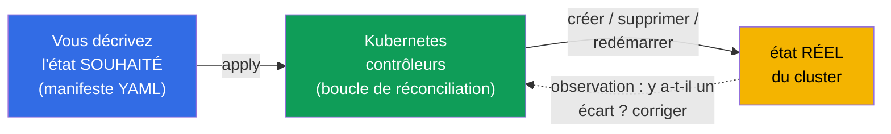
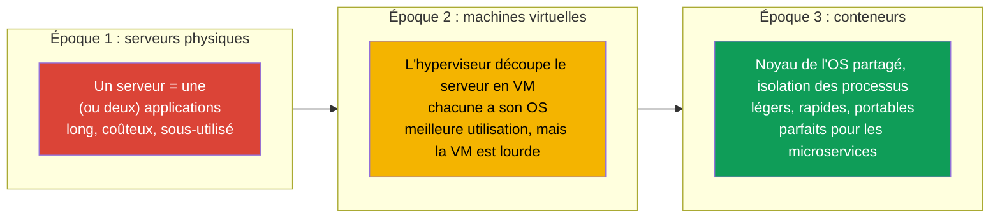
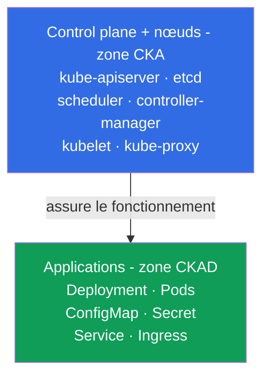
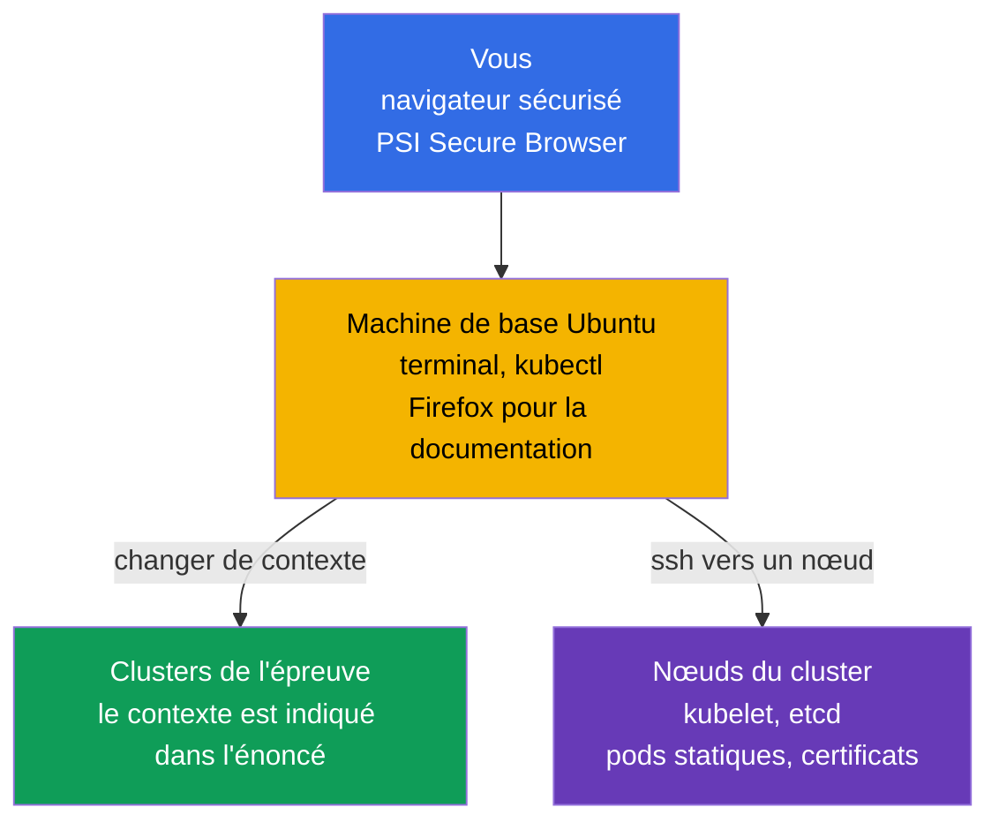
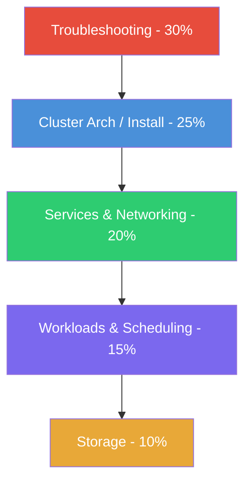
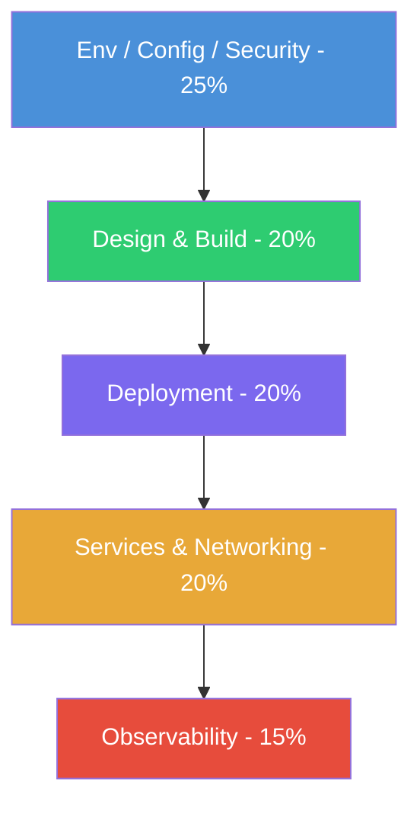
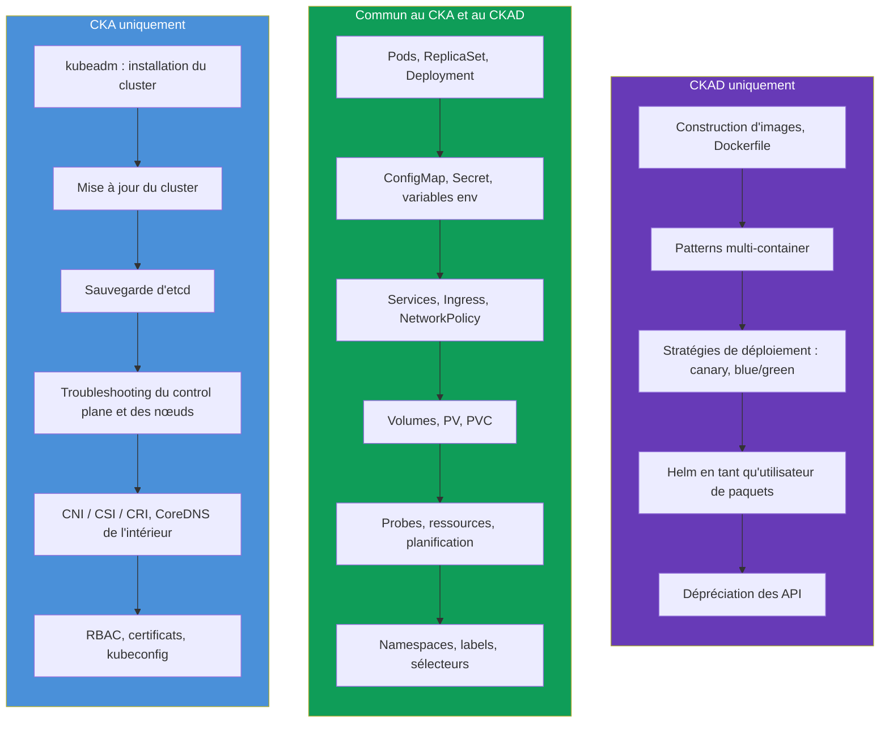
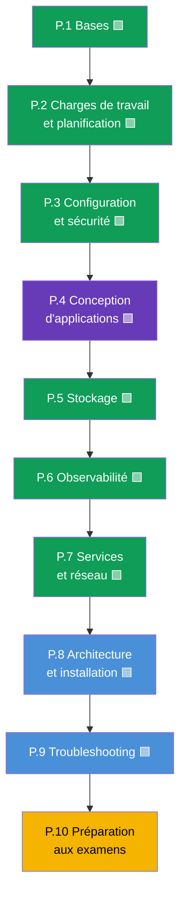

[Русская версия](ru.md) · [Eng version](README.md) · [Versión en español](es.md) · [Deutsche Version](de.md) · [ქართული ვერსია](ge.md) · [繁體中文版](tw.md) · [日本語版](jp.md)

# Chapitre 1. Introduction : Kubernetes, les examens CKA et CKAD et la structure du cours

> **À qui s'adressent ce chapitre et tout le cours.** Nous supposons que vous avez déjà
> travaillé avec Linux dans un terminal, que vous comprenez ce qu'est un conteneur et une
> image Docker, et que vous avez au moins une fois lancé un conteneur. L'expérience de
> Kubernetes n'est pas obligatoire - nous construirons tout depuis zéro.
> L'objectif du cours n'est pas de « faire connaissance », mais de vous amener au niveau
> où vous réussirez avec assurance **deux** examens pratiques : **CKA** (administrateur de
> cluster) et **CKAD** (développeur d'applications). Le cours est délibérément plus
> complet que les cours commerciaux habituels : là où ils donnent « assez pour réussir »,
> nous donnons « assez pour comprendre et réussir ».
>
> Ce premier chapitre est un panorama. Nous verrons ce qu'est Kubernetes et à quoi il
> sert, en quoi CKA et CKAD diffèrent, comment sont organisés les examens eux-mêmes, ce
> que contiennent leurs programmes et comment ce cours est construit. La pratique avec les
> commandes commencera au chapitre suivant.

## 1.1. Ce qu'est Kubernetes et quel problème il résout

Commençons par le problème, pas par la définition. Imaginez que vous avez une application
empaquetée dans des conteneurs. Tant qu'il n'y a qu'un conteneur et une machine, tout est
simple : on lance `docker run`, et c'est fait. Mais en exploitation réelle, une avalanche
de questions surgit.

- Le conteneur est tombé pendant la nuit - qui va le redémarrer ?
- La charge a triplé - qui va ajouter cinq copies de plus, puis les retirer ?
- Le serveur où tournaient les conteneurs est mort - où les conteneurs vont-ils déménager ?
- Comment déployer une nouvelle version sans faire tomber les utilisateurs ?
- Comment un conteneur sur une machine peut-il trouver un conteneur sur une autre ?
- Comment distribuer aux conteneurs les mots de passe, les configs et les disques ?

Tout cela, ce sont les tâches de l'**orchestration de conteneurs**. Kubernetes (souvent
écrit « k8s » : la lettre `k`, huit lettres, la lettre `s`) est un système qui prend ces
tâches en charge. Vous décrivez de façon déclarative l'**état souhaité** (« je veux 5
copies de cette application, avec telle config et tel volume de mémoire »), et Kubernetes
ramène en permanence la réalité vers cette description : il lance, redémarre, déplace,
met à l'échelle.

Cette idée - la **boucle de réconciliation** (reconciliation loop) - est la principale
dans Kubernetes. Les contrôleurs comparent en continu « ce qu'on voulait » et « ce qu'il y
a » et suppriment la différence. C'est justement pourquoi Kubernetes restaure lui-même les
pods tombés et maintient le nombre de réplicas défini : il n'a pas « exécuté une commande
puis oublié », il surveille l'état en permanence.

### L'orchestration de conteneurs, ce n'est pas que Kubernetes

Kubernetes n'est pas le seul orchestrateur, mais c'est aujourd'hui le standard de fait. Il
est utile de connaître les voisins du marché.

| Système | Qui le fait | Ce qui le caractérise |
|---------|-----------|--------------|
| **Kubernetes** | CNCF (à l'origine Google) | Standard de fait, écosystème énorme |
| **Docker Swarm** | Docker | Simple, mais moins de possibilités, perd en popularité |
| **Amazon ECS** | AWS | Propriétaire, uniquement dans AWS |
| **Nomad** | HashiCorp | Léger, sait faire plus que les conteneurs |
| **Apache Mesos** | Apache | Vétéran, aujourd'hui presque plus utilisé pour les conteneurs |

Les deux certifications, CKA et CKAD, portent précisément sur Kubernetes, donc nous ne
parlerons plus que de lui.

## 1.2. D'où vient Kubernetes : du « matériel » aux conteneurs

Pour comprendre pourquoi Kubernetes est fait ainsi, il est utile de voir les trois époques
du déploiement d'applications.

Les conteneurs ont apporté légèreté et portabilité, mais ont engendré un problème
d'échelle : quand les conteneurs se comptent par centaines et milliers, il faut les gérer
automatiquement. C'est ainsi qu'est apparu le besoin d'un orchestrateur - et Kubernetes l'a
couvert.

## 1.3. Deux certifications : CKA et CKAD

Autour de Kubernetes s'est construite toute une gamme d'examens officiels de la CNCF
(Cloud Native Computing Foundation) et de la Linux Foundation. Deux d'entre eux nous
intéressent.

- **CKA - Certified Kubernetes Administrator.** L'examen pour ceux qui
  **administrent** un cluster : l'installent, le mettent à jour, le réparent, configurent
  le réseau, le stockage, la sécurité, se débrouillent avec les pannes du control plane et
  des nœuds.
- **CKAD - Certified Kubernetes Application Developer.** L'examen pour ceux qui
  **développent et exécutent des applications** dans le cluster : décrivent les charges de
  travail, les configurent, mettent en place les probes, les services, les volumes,
  débuguent les applications.

La façon la plus simple de retenir la frontière : **le CKA est responsable du cluster, le
CKAD des applications à l'intérieur du cluster**. L'administrateur construit et entretient
la « maison », le développeur y « habite » confortablement et aménage ses « pièces ».

La frontière n'est pas rigide : l'administrateur doit comprendre les applications, et le
développeur doit au moins s'orienter dans les bases de la structure du cluster. C'est
justement pourquoi il est commode d'étudier les deux examens ensemble : la majeure partie
des connaissances est commune.

## 1.4. Comment les examens sont organisés

CKA comme CKAD sont **entièrement pratiques**. Aucun questionnaire à choix multiple. On
vous installe devant de vrais clusters et on vous donne un ensemble de tâches : créer
quelque chose, réparer, configurer. Un proctor observe via la caméra et l'écran.

Comment cela fonctionne techniquement. Vous vous connectez via un **navigateur sécurisé**
(PSI Secure Browser) à un environnement distant - une **machine Linux de base sous Ubuntu**
avec `kubectl` et un terminal déjà configurés (à côté, Firefox pour la documentation).
Cette machine n'est pas elle-même un cluster : c'est votre « pupitre », depuis lequel vous
travaillez avec tous les clusters de l'épreuve.

Depuis la machine de base, vous travaillez de deux façons :

- **Via le contexte kubectl.** Chaque tâche a son cluster ; vous basculez vers lui avec la
  commande `kubectl config use-context <nom>` (elle est généralement donnée directement
  dans l'énoncé). Vous pilotez ainsi plusieurs clusters sans vous y connecter.
- **Via SSH vers un nœud.** Une partie des tâches (surtout au CKA : kubelet cassé, pod
  statique, etcd, certificats) exige de se connecter à un nœud précis avec `ssh <node>`,
  d'effectuer les actions (souvent sous `sudo -i`) et de revenir avec la commande `exit`.
  Oublier de revenir sur la machine de base est une cause fréquente de « je travaille sur
  le mauvais nœud ».

| Paramètre | CKA | CKAD |
|----------|-----|------|
| Format | Pratique, dans un cluster vivant | Pratique, dans un cluster vivant |
| Durée | 2 heures | 2 heures |
| Nombre de tâches | ~15-20 | ~15-20 |
| Score de réussite | 66% | 66% |
| Version de Kubernetes | actuelle (aujourd'hui `v1.35`) | actuelle (aujourd'hui `v1.35`) |
| Repassage | 1 tentative gratuite | 1 tentative gratuite |
| Durée de validité | 2 ans | 2 ans |
| Documentation à l'examen | autorisée (kubernetes.io et autres) | autorisée (kubernetes.io et autres) |

Quelques conséquences importantes du format, qui déterminent toute la stratégie de
préparation.

- **La vitesse est décisive.** 15-20 tâches en 2 heures, c'est ~6-8 minutes par tâche.
  Celui qui fouille manuellement dans la syntaxe YAML n'a pas le temps. C'est pourquoi
  nous entraînerons beaucoup les **commandes impératives** et la génération de manifestes
  via `--dry-run=client -o yaml`.
- **La documentation est autorisée, mais il n'y a pas le temps de lire.** On peut ouvrir un
  onglet de navigateur sur `kubernetes.io/docs`. Cela sauve quand on a oublié un champ
  précis, mais chercher les bases à l'examen est hors de question - il faut les connaître
  par cœur.
- **Des points partiels sont attribués.** Une tâche partiellement réalisée rapporte aussi
  des points. Donc il ne faut pas rester bloqué - mieux vaut faire ce qu'on peut et passer
  à la suite.
- **Plusieurs clusters et contextes.** Chaque tâche indique le cluster et le namespace.
  Oublier de changer de contexte avec `kubectl config use-context` est une perte de points
  classique.

Nous détaillerons la tactique des examens (alias, JSONPath, gestion du temps) dans les
chapitres finaux 47 (CKAD) et 48 (CKA). Pour l'instant retenez l'essentiel : **les deux
examens portent sur la vitesse et la pratique, pas sur le par-cœur de la théorie**. Mais
sans théorie les mains travaillent à l'aveugle, donc nous donnons les deux.

## 1.5. Programmes des examens : domaines et poids

Chaque examen est officiellement découpé en domaines avec des poids - la part de points que
donne ce thème. Les poids sont une carte des priorités : là où le poids est plus grand, on
investit plus de temps.

**CKA** (programme actuel) :

| Domaine CKA | Poids |
|-----------|-----|
| Troubleshooting (recherche et résolution des pannes) | **30%** |
| Cluster Architecture, Installation & Configuration | **25%** |
| Services & Networking | **20%** |
| Workloads & Scheduling | **15%** |
| Storage | **10%** |

**CKAD** (programme actuel) :

| Domaine CKAD | Poids |
|------------|-----|
| Application Environment, Configuration and Security | **25%** |
| Application Design and Build | **20%** |
| Application Deployment | **20%** |
| Services and Networking | **20%** |
| Application Observability and Maintenance | **15%** |

On voit visuellement où se trouve le « centre de gravité » de chaque examen :

CKA - accent sur l'exploitation du cluster (domaines par poids décroissant) :

CKAD - accent sur les applications (domaines par poids décroissant) :

La conclusion est évidente : **le CKA, c'est d'abord le troubleshooting et la structure du
cluster**, et **le CKAD, c'est la configuration, la conception et le déploiement des
applications**. Notez-le : le domaine « Services & Networking » est présent dans les deux
examens, comme le travail avec les charges de travail et le stockage. C'est justement la
zone commune pour laquelle nous avons réuni le cours.

## 1.6. Où les examens se recoupent et en quoi ils diffèrent

Si l'on superpose les programmes, le tableau est le suivant.

La zone commune est énorme - c'est précisément pourquoi il est sensé de se préparer aux
deux examens à la fois. Après avoir parcouru le noyau commun une seule fois, il ne vous
reste qu'à ajouter les spécificités : pour le CKA - l'administration et le troubleshooting,
pour le CKAD - les thèmes de développement.

## 1.7. Comment ce cours est construit

Le cours est découpé en 10 parties et 48 chapitres. Chaque chapitre est marqué selon
l'examen auquel il se rapporte :

- 🟦 **CKA** - le thème n'est nécessaire qu'à l'administrateur ;
- 🟩 **CKAD** - le thème n'est nécessaire qu'au développeur ;
- 🟪 **CKA + CKAD** - thème commun aux deux.

L'ordre des chapitres va du simple au complexe et est agencé pour que chaque nouveau thème
s'appuie sur les précédents. Le noyau commun (parties 1-7) vient en premier, parce qu'il
est nécessaire aux deux examens et constitue le fondement. Ensuite la partie
administrateur (8-9) et la préparation aux examens (10).

Chaque chapitre est construit sur un modèle unique :

- une introduction « ce qui suit » et pourquoi le thème est nécessaire ;
- la théorie avec des diagrammes et des tableaux ;
- la pratique : commandes `kubectl`, manifestes, analyse du comportement ;
- un glossaire des termes clés ;
- un récapitulatif ;
- des questions d'auto-évaluation ;
- un lien vers le travail pratique.

Les **travaux pratiques** (`tasks/cka/labs`) sont de vrais clusters déployés dans le cloud,
où vous mettez la matière en pratique. Un TP couvre généralement d'un coup plusieurs
chapitres voisins (par exemple namespaces + pods + deployments dans un même travail), afin
que la pratique soit d'un seul tenant plutôt que fragmentée en dizaines de petites tâches.
En plus des TP il y a des **examens blancs** (`tasks/cka/mock`, `tasks/ckad/mock`) - des
répétitions du véritable examen avec vérification automatique (`check_result`).

Pour ceux qui se préparent de façon ciblée à un seul examen, il y a deux guides qui
rassemblent uniquement les chapitres et TP nécessaires :

- [Programme et TP pour le CKA](../CKA_FR.md)
- [Programme et TP pour le CKAD](../CKAD_FR.md)

## 1.8. Ce qu'il faut avant de démarrer

Le minimum technique sur lequel s'appuie le cours :

- **Linux et le terminal.** Commandes de base, travail avec les fichiers, `systemctl`,
  `journalctl`, l'éditeur `vim` ou `nano`. À l'examen, l'éditeur est votre outil
  principal ; un minimum concis sur vim est au chapitre [0.8](../00-8-vim/fr.md).
- **Les conteneurs.** Ce qu'est une image, les couches, un registre, `docker`/`containerd`,
  en quoi un conteneur diffère d'une machine virtuelle.
- **YAML.** Kubernetes se décrit par des manifestes en YAML. Indentation par espaces (pas
  de tabulations !), listes, imbrication - il faut savoir lire et écrire cela librement.
- **Le réseau au niveau de base.** IP, ports, DNS, TCP/HTTP - sans les profondeurs, mais en
  comprenant ce que c'est.

Si quelque chose là-dedans est encore fragile - pas de souci. Pour les réseaux, le DNS, le
TLS et les conteneurs il y a une **Partie 0** facultative - un socle préparatoire depuis
zéro :

- 0.1. [Réseau : IP, ports, CIDR et NAT](../00-1-net/fr.md)
- 0.2. [DNS : comment les noms se transforment en adresses](../00-2-dns/fr.md)
- 0.3. [TLS et certificats : HTTPS, clés, CA](../00-3-tls/fr.md)
- 0.4. [Conteneurs et Docker : images, couches, registres, runtime](../00-4-containers/fr.md)

Si ces thèmes vous sont familiers - sautez sans hésiter la Partie 0. Plus le socle est
solide, plus la suite est facile.

## 1.9. Comment s'entraîner

La théorie seule ne suffit pas pour des examens pratiques - il faut un cluster sous la main.
Vous avez plusieurs options :

| Option | Difficulté | Coût | Pour quoi faire |
|---------|-----------|-----------|----------|
| **minikube / kind** | faible | gratuit | cluster local rapide pour les thèmes CKAD |
| **kubeadm sur des VM** | moyenne | gratuit/peu cher | cluster complet, obligatoire pour le CKA |
| **Killercoda** | faible | gratuit | scénarios interactifs prêts à l'emploi dans le navigateur |
| **Cette plateforme (`tasks/cka/labs`)** | faible | faible (AWS) | nos TP et examens blancs sur de vrais clusters dans AWS |

Pour le CKAD, un cluster local léger suffit. Pour le CKA il faut précisément un
**cluster multi-nœuds monté à la main via kubeadm** - parce que l'examen exige de réparer
le control plane, de mettre à jour le cluster et de sauvegarder etcd, et dans minikube on ne
peut pas y toucher. Nos travaux pratiques montent un tel cluster dans AWS automatiquement.

## 1.10. Mini-glossaire

- **Kubernetes (k8s)** - système d'orchestration de conteneurs : ramène l'état réel du
  cluster vers l'état souhaité.
- **Orchestration** - gestion automatique du cycle de vie des conteneurs (démarrage,
  redémarrage, mise à l'échelle, placement).
- **État souhaité (desired state)** - ce que vous avez décrit dans le manifeste.
- **Boucle de réconciliation (reconciliation loop)** - cycle continu dans lequel les
  contrôleurs suppriment la différence entre l'état souhaité et l'état réel.
- **CKA** - Certified Kubernetes Administrator, examen sur l'administration du cluster.
- **CKAD** - Certified Kubernetes Application Developer, examen sur l'exécution des applications.
- **CNCF** - Cloud Native Computing Foundation, l'organisation derrière Kubernetes et ces
  certifications.
- **Manifeste** - fichier YAML décrivant un objet Kubernetes.
- **kubectl** - l'utilitaire en ligne de commande principale pour travailler avec le cluster.
- **Approche impérative** - gestion des objets par des commandes (`kubectl run`, `create`).
- **Approche déclarative** - gestion via des manifestes (`kubectl apply -f`).

## 1.11. Récapitulatif du chapitre

- Kubernetes est un orchestrateur de conteneurs : vous décrivez l'état souhaité, et il
  ramène en permanence la réalité vers lui via la boucle de réconciliation.
- Les conteneurs sont la troisième époque du déploiement (après les serveurs physiques et
  les VM) ; leur légèreté et leur échelle ont engendré le besoin d'un orchestrateur.
- Le CKA porte sur l'administration du cluster, le CKAD sur l'exécution des applications
  dans le cluster. La frontière : la « maison » (CKA) contre la « vie dans la maison » (CKAD).
- Les deux examens sont entièrement pratiques : 2 heures, ~15-20 tâches dans un cluster
  vivant, seuil de 66%, documentation autorisée, points partiels. Tout se joue sur la
  vitesse et la pratique.
- Au CKA le centre de gravité est le troubleshooting (30%) et la structure du cluster
  (25%) ; au CKAD - la configuration (25%), la conception et le déploiement des applications.
- Les programmes se recoupent fortement (charges de travail, services, configuration,
  stockage), donc se préparer aux deux examens ensemble est plus efficace.
- Le cours compte 10 parties et 48 chapitres, marqués 🟦/🟩/🟪 ; d'abord le noyau commun,
  puis la partie admin et la préparation aux examens. La pratique se fait dans des TP
  regroupés et des examens blancs.

## 1.12. À quoi cela sert : à l'examen et dans le travail réel

Nous terminerons chaque chapitre par une telle section - elle relie ce qui a été étudié à
deux choses : ce qui sera concrètement demandé à l'examen et comment cela s'applique en
exploitation réelle. Ainsi la théorie ne reste pas suspendue en l'air.

**À l'examen.** Ce chapitre est un panorama, il n'y a pas de tâches propres dessus. Mais il
fixe la stratégie : vous comprenez maintenant le format (2 heures, ~15-20 tâches, seuil de
66%, points partiels), vous connaissez les poids des domaines et vous voyez déjà où
investir du temps - dans le troubleshooting et la structure du cluster pour le CKA, dans la
configuration et le déploiement des applications pour le CKAD.

**Dans le travail réel.** CKA et CKAD ne sont pas des « diplômes pour les diplômes », mais
une carte des compétences de rôles réels :

| Rôle | Plus proche de l'examen | Ce qu'il fait avec Kubernetes |
|------|------------------|-------------------------|
| DevOps / Platform Engineer | CKA | Construit et entretient les clusters, le réseau, le stockage, les accès |
| SRE | CKA (+ CKAD) | Maintient la fiabilité, analyse les incidents, troubleshooting |
| Backend / App Developer | CKAD | Écrit les manifestes des applications, les probes, les configs, le déploiement |
| Full-stack / tech lead | CKA + CKAD | Comprend tout le tableau, du cluster à l'application |

Savoir créer rapidement un pod, réparer un déploiement cassé ou configurer une
NetworkPolicy, c'est le travail quotidien, pas seulement un point d'examen. Le cours donne
délibérément plus de contexte que strictement nécessaire pour réussir, - afin qu'après le
certificat vous soyez utile en production, et pas seulement capable de « passer un test ».

## 1.13. Questions d'auto-évaluation

1. Que signifie « Kubernetes ramène l'état réel vers l'état souhaité » ? Comment s'appelle
   ce mécanisme ?
2. Quelle est la différence fondamentale entre les zones de responsabilité du CKA et du
   CKAD ? Donnez deux exemples de thèmes uniques à chacun.
3. Pourquoi la vitesse est-elle si importante aux examens et qu'allons-nous entraîner pour l'acquérir ?
4. Quel domaine donne le plus de points au CKA et pourquoi vaut-il la peine d'y investir un
   tiers du temps ?
5. Pourquoi minikube ne suffit-il pas pour préparer le CKA, alors qu'il suffit pour le CKAD ?
6. Qu'apporte la réunion de la préparation au CKA et au CKAD en un seul cours ?

## Pratique

Ce chapitre est un panorama, il n'a pas de TP propre. À partir du chapitre suivant commence
l'analyse de la structure du cluster, et le travail pratique avec les commandes - à partir
du chapitre 3. Nous arriverons au premier TP quand nous aurons vu les bases et qu'il y aura
de quoi s'exercer ; les liens vers les TP concrets apparaissent dans les chapitres dont ils
couvrent la matière.

---
[Sommaire](../README_FR.md) · [Partie 0](../00-1-net/fr.md) · [Chapitre 2](../02/fr.md)
