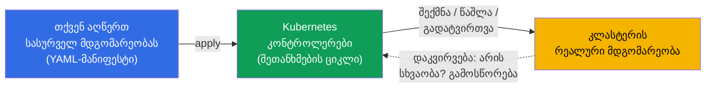
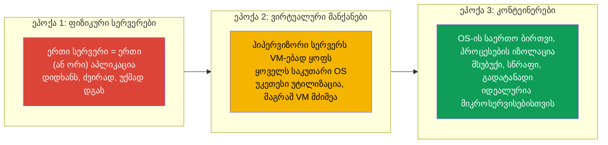
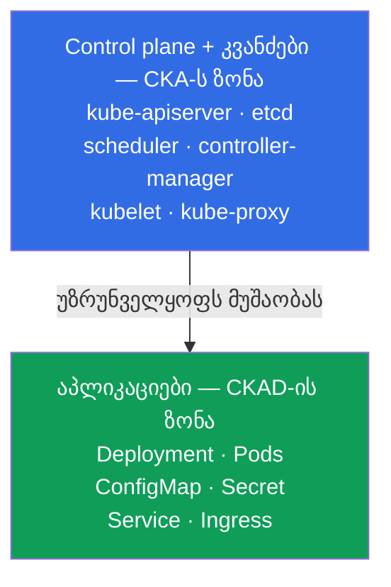
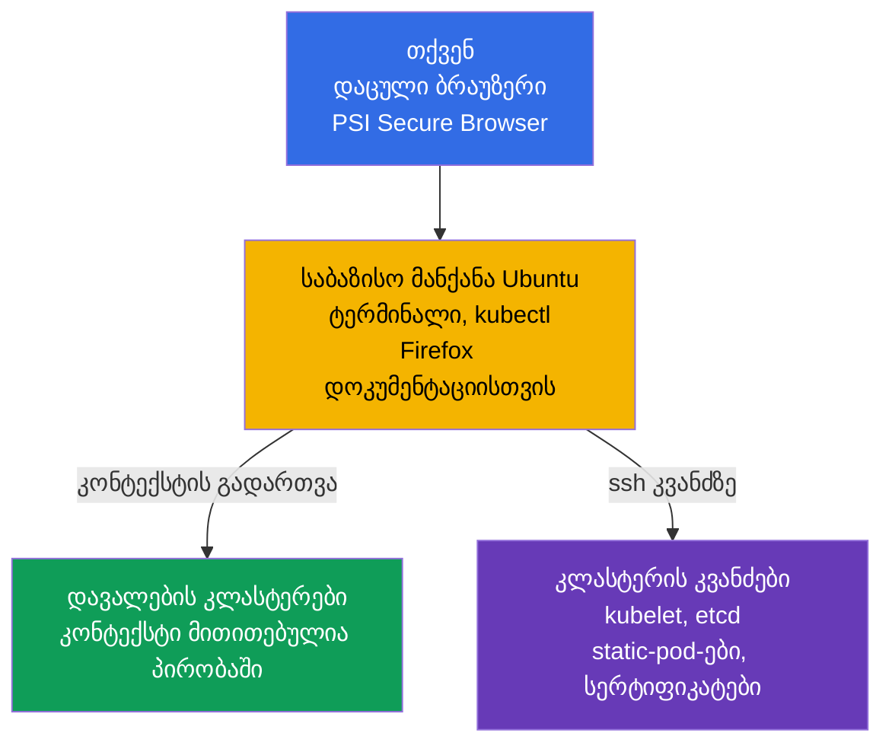

[Русская версия](ru.md) · [Eng version](README.md) · [Versión en español](es.md) · [Version française](fr.md) · [Deutsche Version](de.md)

# თავი 1. შესავალი: Kubernetes, გამოცდები CKA და CKAD და კურსის აგებულება

> **ვისთვისაა ეს თავი და მთელი კურსი.** ჩვენ ვიანგარიშებთ, რომ თქვენ უკვე გიმუშავიათ
> Linux-თან ტერმინალში, გესმით, რა არის კონტეინერი და Docker-იმიჯი, და ერთხელ მაინც
> გაგიშვიათ კონტეინერი. Kubernetes-ის გამოცდილება სავალდებულო არ არის - ყველაფერს
> ნულიდან ავაშენებთ. კურსის მიზანია არა „გაცნობა“, არამედ იმ დონემდე მიგიყვანოთ,
> რომელზეც თავდაჯერებულად ჩააბარებთ **ორ** პრაქტიკულ გამოცდას: **CKA** (კლასტერის
> ადმინისტრატორი) და **CKAD** (აპლიკაციების დეველოპერი). კურსი შეგნებულად უფრო სრულია,
> ვიდრე ტიპური კომერციული კურსები: სადაც ისინი იძლევიან „საკმარისს, რომ ჩააბარო“, ჩვენ
> ვიძლევით „საკმარისს, რომ გაიგო და ჩააბარო“.
>
> ეს პირველი თავი მიმოხილვითია. გავარკვევთ, რა არის Kubernetes და რისთვის არის ის
> საჭირო, რით განსხვავდება CKA და CKAD, როგორ არის აწყობილი თავად გამოცდები, რა შედის
> მათ პროგრამებში და როგორ არის აწყობილი ეს კურსი. პრაქტიკა ბრძანებებით შემდეგი
> თავიდან დაიწყება.

## 1.1. რა არის Kubernetes და რომელ ამოცანას წყვეტს

დავიწყოთ პრობლემით და არა განმარტებით. წარმოიდგინეთ, რომ გაქვთ აპლიკაცია,
შეფუთული კონტეინერებში. სანამ კონტეინერი ერთია და მანქანა ერთია - ყველაფერი მარტივია:
გაუშვით `docker run` და მზადაა. მაგრამ რეალურ ექსპლუატაციაში ჩნდება კითხვების ზვავი.

- კონტეინერი ღამით ჩავარდა - ვინ გადატვირთავს მას?
- დატვირთვა სამჯერ გაიზარდა - ვინ დაამატებს კიდევ ხუთ ასლს, შემდეგ კი მოაშორებს მათ?
- სერვერი, სადაც კონტეინერები ტრიალებდა, მოკვდა - სად გადავიდებიან კონტეინერები?
- როგორ გამოვიტანოთ ახალი ვერსია მომხმარებლების ჩავარდნის გარეშე?
- როგორ იპოვოს ერთ მანქანაზე მყოფმა კონტეინერმა კონტეინერი მეორეზე?
- როგორ დავურიგოთ კონტეინერებს პაროლები, კონფიგები და დისკები?

ეს ყველაფერი არის **კონტეინერების ორკესტრაციის** ამოცანები. Kubernetes (ხშირად წერენ
„k8s“: ასო `k`, რვა ასო, ასო `s`) არის სისტემა, რომელიც ამ ამოცანებს თავის თავზე იღებს.
თქვენ დეკლარაციულად აღწერთ **სასურველ მდგომარეობას** („მინდა ამ აპლიკაციის 5 ასლი, ამ
კონფიგით და ამ მოცულობის მეხსიერებით“), ხოლო Kubernetes მუდმივად მიჰყავს რეალობა
ამ აღწერამდე: უშვებს, გადატვირთავს, გადაიტანს, აწილადებს.

ეს იდეა - **შეთანხმების მარყუჟი** (reconciliation loop) - მთავარია Kubernetes-ში.
კონტროლერები განუწყვეტლივ ადარებენ „რა გვინდოდა“-ს და „რა არის“-ს და აღმოფხვრიან
სხვაობას. სწორედ ამიტომ Kubernetes თავად აღადგენს ჩავარდნილ pod-ებს და ინახავს მითითებულ
რეპლიკების რაოდენობას: მან არ „შეასრულა ბრძანება და დაივიწყა“, არამედ მუდმივად ადევნებს
თვალს მდგომარეობას.

### კონტეინერების ორკესტრაცია - მხოლოდ Kubernetes არ არის

Kubernetes ერთადერთი ორკესტრატორი არ არის, მაგრამ დღეს ფაქტობრივი სტანდარტია. სასარგებლოა
ბაზარზე მისი მეზობლების ცოდნა.

| სისტემა | ვინ აკეთებს | რით არის ცნობილი |
|---------|-----------|--------------|
| **Kubernetes** | CNCF (თავდაპირველად Google) | დე-ფაქტო სტანდარტი, უზარმაზარი ეკოსისტემა |
| **Docker Swarm** | Docker | მარტივი, მაგრამ შესაძლებლობები ნაკლებია, კარგავს პოპულარობას |
| **Amazon ECS** | AWS | პროპრიეტარული, მხოლოდ AWS-ში |
| **Nomad** | HashiCorp | მსუბუქი, შეუძლია არა მხოლოდ კონტეინერები |
| **Apache Mesos** | Apache | ვეტერანი, ახლა კონტეინერებისთვის თითქმის არ გამოიყენება |

ორივე სერტიფიკაცია, CKA და CKAD, სწორედ Kubernetes-ზეა, ამიტომ შემდგომში მხოლოდ მასზე
ვსაუბრობთ.

## 1.2. საიდან გაჩნდა Kubernetes: „რკინიდან“ კონტეინერებამდე

იმისთვის, რომ გავიგოთ, რატომ არის Kubernetes სწორედ ასე აწყობილი, სასარგებლოა
აპლიკაციების განთავსების სამი ეპოქის დანახვა.

კონტეინერებმა მოგვცეს სიმსუბუქე და გადატანადობა, მაგრამ წარმოშვეს მასშტაბის პრობლემა: როცა
კონტეინერები ასობით და ათასობითაა, მათი მართვა ავტომატურად უნდა მოხდეს. ასე გაჩნდა
ორკესტრატორის საჭიროება - და Kubernetes-მა ის დაფარა.

## 1.3. ორი სერტიფიკაცია: CKA და CKAD

Kubernetes-ის გარშემო აწყობილია CNCF-ის (Cloud Native Computing Foundation) და Linux
Foundation-ის ოფიციალური გამოცდების მთელი ხაზი. ჩვენ ორი მათგანი გვაინტერესებს.

- **CKA - Certified Kubernetes Administrator.** გამოცდა მათთვის, ვინც
  **ადმინისტრირებს** კლასტერს: აყენებს მას, აახლებს, აკეთებს, აწყობს ქსელს,
  საცავებს, უსაფრთხოებას, ერკვევა control plane-ისა და კვანძების ავარიებში.
- **CKAD - Certified Kubernetes Application Developer.** გამოცდა მათთვის, ვინც
  **შეიმუშავებს და უშვებს აპლიკაციებს** კლასტერში: აღწერს სამუშაო დატვირთვებს,
  აკონფიგურირებს მათ, აწყობს პრობებს, სერვისებს, ტომებს, ამართავს აპლიკაციებს.

ზღვარის დამახსოვრება ყველაზე მარტივად ასე ხდება: **CKA პასუხისმგებელია კლასტერზე, CKAD -
კლასტერის შიგნით არსებულ აპლიკაციებზე**. ადმინისტრატორი აშენებს და ემსახურება „სახლს“,
დეველოპერი კი მოხერხებულად „ცხოვრობს“ მასში და აწყობს საკუთარ „ოთახებს“.

ზღვარი მკაცრი არ არის: ადმინისტრატორი ვალდებულია გაიგოს აპლიკაციები, ხოლო დეველოპერი -
სულ მცირე საბაზისოდ ერკვეოდეს კლასტერის აგებულებაში. სწორედ ამიტომ ორივე გამოცდის
ერთად შესწავლა მოსახერხებელია: ცოდნის დიდი ნაწილი საერთოა.

## 1.4. როგორ არის აწყობილი თავად გამოცდები

როგორც CKA, ისე CKAD **სრულიად პრაქტიკულია**. არავითარი ტესტი პასუხის არჩევით. თქვენ
სვამენ რეალურ კლასტერებთან და გაძლევენ ამოცანების ნაკრებს: რაღაცის შექმნა, შეკეთება,
კონფიგურაცია. პროქტორი გიყურებთ კამერითა და ეკრანით.

როგორ არის ეს ტექნიკურად აწყობილი. თქვენ უერთდებით **დაცული ბრაუზერით** (PSI Secure
Browser) დისტანციურ გარემოს - **საბაზისო Linux-მანქანას Ubuntu-ზე** უკვე აწყობილი
`kubectl`-ითა და ტერმინალით (გვერდით - Firefox დოკუმენტაციისთვის). თავად ეს მანქანა
კლასტერი არ არის: ეს არის თქვენი „პულტი“, საიდანაც მუშაობთ დავალების ყველა კლასტერთან.

საბაზისო მანქანიდან ორი გზით მუშაობთ:

- **kubectl-ის კონტექსტის გავლით.** ყოველი ამოცანისთვის მითითებულია საკუთარი კლასტერი;
  მასზე გადადიხართ ბრძანებით `kubectl config use-context <სახელი>` (ჩვეულებრივ პირდაპირ
  პირობაში გაძლევენ). ასე მართავთ რამდენიმე კლასტერს მათზე შესვლის გარეშე.
- **SSH-ით კვანძზე.** ამოცანების ნაწილი (განსაკუთრებით CKA-ზე: გატეხილი kubelet,
  static-pod, etcd, სერტიფიკატები) მოითხოვს კონკრეტულ კვანძზე შესვლას `ssh <node>`-ით,
  მოქმედებების შესრულებას (ხშირად `sudo -i`-ის ქვეშ) და უკან დაბრუნებას ბრძანებით `exit`.
  საბაზისო მანქანაზე დაბრუნების დავიწყება ხშირი მიზეზია იმისა, რომ „არასწორ კვანძზე ვაკეთებ“.

| პარამეტრი | CKA | CKAD |
|----------|-----|------|
| ფორმატი | პრაქტიკული, ცოცხალ კლასტერში | პრაქტიკული, ცოცხალ კლასტერში |
| ხანგრძლივობა | 2 საათი | 2 საათი |
| დავალებების რაოდენობა | ~15-20 | ~15-20 |
| გამსვლელი ქულა | 66% | 66% |
| Kubernetes-ის ვერსია | აქტუალური (ახლა `v1.35`) | აქტუალური (ახლა `v1.35`) |
| ხელახლა ჩაბარება | 1 უფასო ცდა | 1 უფასო ცდა |
| მოქმედების ვადა | 2 წელი | 2 წელი |
| დოკუმენტაცია გამოცდაზე | ნებადართულია (kubernetes.io და სხვ.) | ნებადართულია (kubernetes.io და სხვ.) |

ფორმატიდან გამომდინარეობს რამდენიმე მნიშვნელოვანი შედეგი, რომლებიც განსაზღვრავს მომზადების
მთელ სტრატეგიას.

- **სიჩქარე წყვეტს.** 15-20 ამოცანა 2 საათში - ეს არის ~6-8 წუთი ერთ ამოცანაზე. ვინც
  ხელით ეჩიჩქნება YAML-ის სინტაქსს, ვერ ასწრებს. ამიტომ ბევრს ვივარჯიშებთ
  **იმპერატიულ ბრძანებებზე** და მანიფესტების გენერაციაზე `--dry-run=client -o yaml`-ით.
- **დოკუმენტაცია ნებადართულია, მაგრამ წაკითხვის დრო არ არის.** შეიძლება ერთი ბრაუზერის
  ტაბის გახსნა `kubernetes.io/docs`-ზე. ეს გიშველით, როცა ზუსტი ველი დაგავიწყდათ, მაგრამ
  გამოცდაზე საფუძვლების ძებნის დრო არ არის - ისინი ზეპირად უნდა იცოდეთ.
- **ერიცხება ნაწილობრივი ქულები.** ნაწილობრივ შესრულებულ დავალებაზეც აძლევენ ქულებს.
  ესე იგი, არ ღირს გაჭედვა - უკეთესია გააკეთოთ, რაც შეგიძლიათ, და შემდეგ გადახვიდეთ.
- **რამდენიმე კლასტერი და კონტექსტი.** ყოველ დავალებაში მითითებულია კლასტერი და namespace.
  კონტექსტის გადართვის `kubectl config use-context` დავიწყება ქულების კლასიკური კარგვაა.

გამოცდების ტაქტიკას დაწვრილებით (ალიასები, JSONPath, დროის მენეჯმენტი) განვიხილავთ
ფინალურ თავებში 47 (CKAD) და 48 (CKA). ჯერჯერობით დაიმახსოვრეთ მთავარი: **ორივე გამოცდა
სიჩქარესა და ხელებზეა და არა თეორიის დაზეპირებაზე**. მაგრამ თეორიის გარეშე ხელები
ბრმად მუშაობს, ამიტომ ჩვენ ორივეს ვიძლევით.
