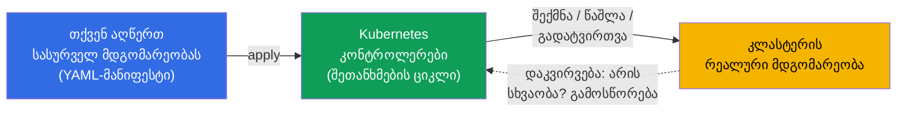
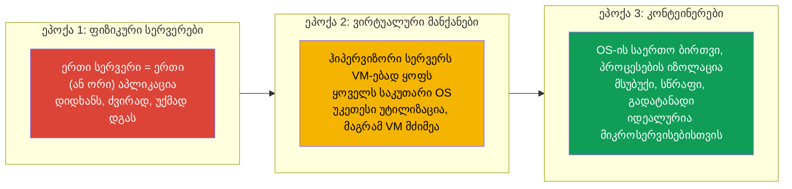
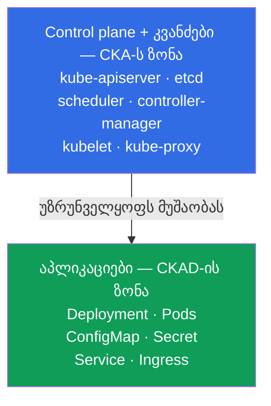
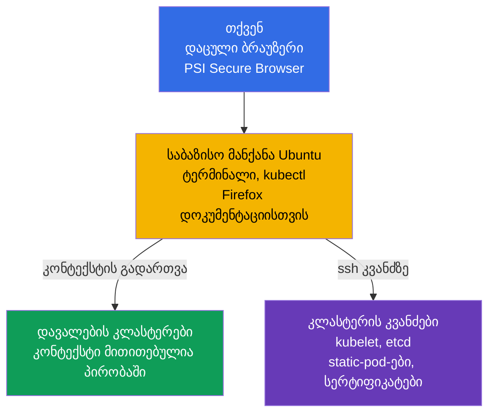
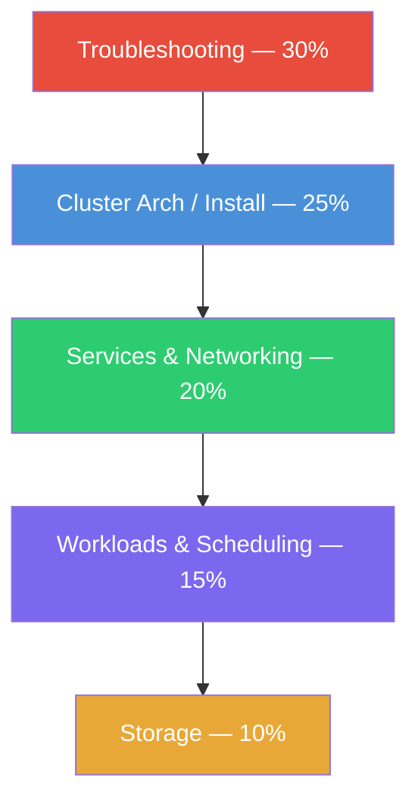
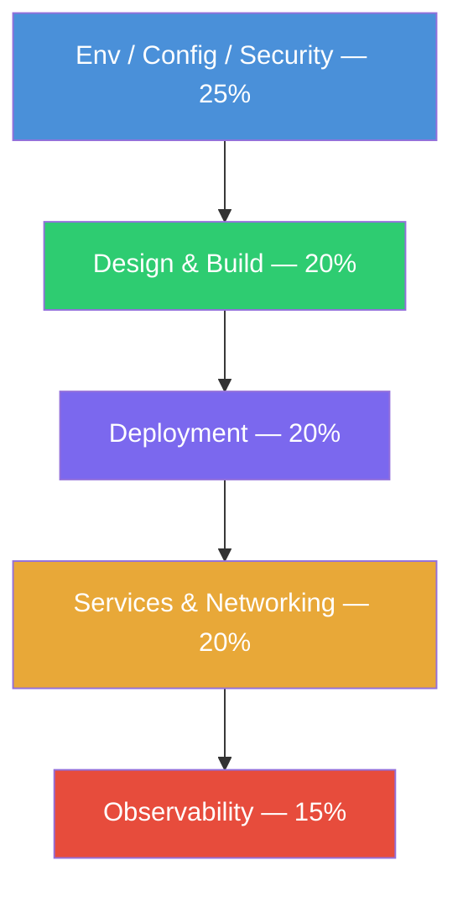
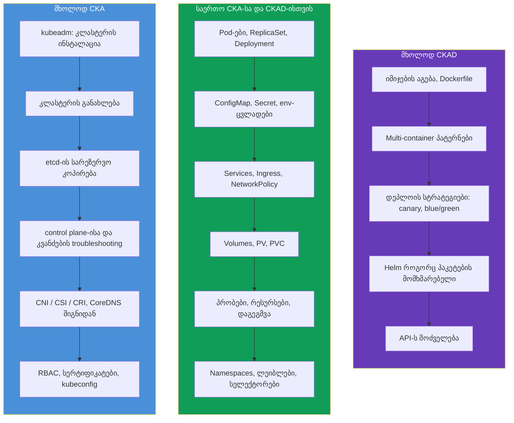
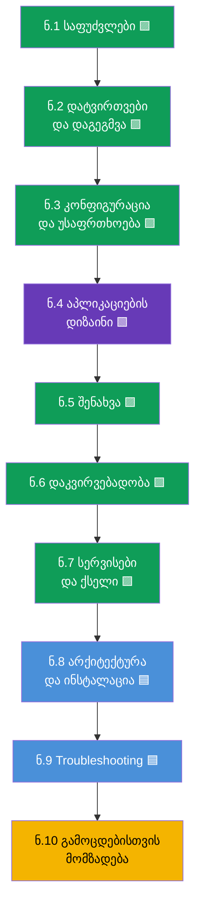

[Русская версия](ru.md) · [Eng version](README.md) · [Versión en español](es.md) · [Version française](fr.md) · [Deutsche Version](de.md)

# თავი 1. შესავალი: Kubernetes, გამოცდები CKA და CKAD და კურსის აგებულება

> **ვისთვისაა ეს თავი და მთელი კურსი.** ჩვენ ვიანგარიშებთ, რომ თქვენ უკვე გიმუშავიათ
> Linux-თან ტერმინალში, გესმით, რა არის კონტეინერი და Docker-იმიჯი, და ერთხელ მაინც
> გაგიშვიათ კონტეინერი. Kubernetes-ის გამოცდილება სავალდებულო არ არის - ყველაფერს
> ნულიდან ავაშენებთ. კურსის მიზანია არა „გაცნობა“, არამედ იმ დონემდე მიგიყვანოთ,
> რომელზეც თავდაჯერებულად ჩააბარებთ **ორ** პრაქტიკულ გამოცდას: **CKA** (კლასტერის
> ადმინისტრატორი) და **CKAD** (აპლიკაციების დეველოპერი). კურსი შეგნებულად უფრო სრულია,
> ვიდრე ტიპური კომერციული კურსები: სადაც ისინი იძლევიან „საკმარისს, რომ ჩააბარო“, ჩვენ
> ვიძლევით „საკმარისს, რომ გაიგო და ჩააბარო“.
>
> ეს პირველი თავი მიმოხილვითია. გავარკვევთ, რა არის Kubernetes და რისთვის არის ის
> საჭირო, რით განსხვავდება CKA და CKAD, როგორ არის აწყობილი თავად გამოცდები, რა შედის
> მათ პროგრამებში და როგორ არის აწყობილი ეს კურსი. პრაქტიკა ბრძანებებით შემდეგი
> თავიდან დაიწყება.

## 1.1. რა არის Kubernetes და რომელ ამოცანას წყვეტს

დავიწყოთ პრობლემით და არა განმარტებით. წარმოიდგინეთ, რომ გაქვთ აპლიკაცია,
შეფუთული კონტეინერებში. სანამ კონტეინერი ერთია და მანქანა ერთია - ყველაფერი მარტივია:
გაუშვით `docker run` და მზადაა. მაგრამ რეალურ ექსპლუატაციაში ჩნდება კითხვების ზვავი.

- კონტეინერი ღამით ჩავარდა - ვინ გადატვირთავს მას?
- დატვირთვა სამჯერ გაიზარდა - ვინ დაამატებს კიდევ ხუთ ასლს, შემდეგ კი მოაშორებს მათ?
- სერვერი, სადაც კონტეინერები ტრიალებდა, მოკვდა - სად გადავიდებიან კონტეინერები?
- როგორ გამოვიტანოთ ახალი ვერსია მომხმარებლების ჩავარდნის გარეშე?
- როგორ იპოვოს ერთ მანქანაზე მყოფმა კონტეინერმა კონტეინერი მეორეზე?
- როგორ დავურიგოთ კონტეინერებს პაროლები, კონფიგები და დისკები?

ეს ყველაფერი არის **კონტეინერების ორკესტრაციის** ამოცანები. Kubernetes (ხშირად წერენ
„k8s“: ასო `k`, რვა ასო, ასო `s`) არის სისტემა, რომელიც ამ ამოცანებს თავის თავზე იღებს.
თქვენ დეკლარაციულად აღწერთ **სასურველ მდგომარეობას** („მინდა ამ აპლიკაციის 5 ასლი, ამ
კონფიგით და ამ მოცულობის მეხსიერებით“), ხოლო Kubernetes მუდმივად მიჰყავს რეალობა
ამ აღწერამდე: უშვებს, გადატვირთავს, გადაიტანს, აწილადებს.

ეს იდეა - **შეთანხმების მარყუჟი** (reconciliation loop) - მთავარია Kubernetes-ში.
კონტროლერები განუწყვეტლივ ადარებენ „რა გვინდოდა“-ს და „რა არის“-ს და აღმოფხვრიან
სხვაობას. სწორედ ამიტომ Kubernetes თავად აღადგენს ჩავარდნილ pod-ებს და ინახავს მითითებულ
რეპლიკების რაოდენობას: მან არ „შეასრულა ბრძანება და დაივიწყა“, არამედ მუდმივად ადევნებს
თვალს მდგომარეობას.

### კონტეინერების ორკესტრაცია - მხოლოდ Kubernetes არ არის

Kubernetes ერთადერთი ორკესტრატორი არ არის, მაგრამ დღეს ფაქტობრივი სტანდარტია. სასარგებლოა
ბაზარზე მისი მეზობლების ცოდნა.

| სისტემა | ვინ აკეთებს | რით არის ცნობილი |
|---------|-----------|--------------|
| **Kubernetes** | CNCF (თავდაპირველად Google) | დე-ფაქტო სტანდარტი, უზარმაზარი ეკოსისტემა |
| **Docker Swarm** | Docker | მარტივი, მაგრამ შესაძლებლობები ნაკლებია, კარგავს პოპულარობას |
| **Amazon ECS** | AWS | პროპრიეტარული, მხოლოდ AWS-ში |
| **Nomad** | HashiCorp | მსუბუქი, შეუძლია არა მხოლოდ კონტეინერები |
| **Apache Mesos** | Apache | ვეტერანი, ახლა კონტეინერებისთვის თითქმის არ გამოიყენება |

ორივე სერტიფიკაცია, CKA და CKAD, სწორედ Kubernetes-ზეა, ამიტომ შემდგომში მხოლოდ მასზე
ვსაუბრობთ.

## 1.2. საიდან გაჩნდა Kubernetes: „რკინიდან“ კონტეინერებამდე

იმისთვის, რომ გავიგოთ, რატომ არის Kubernetes სწორედ ასე აწყობილი, სასარგებლოა
აპლიკაციების განთავსების სამი ეპოქის დანახვა.

კონტეინერებმა მოგვცეს სიმსუბუქე და გადატანადობა, მაგრამ წარმოშვეს მასშტაბის პრობლემა: როცა
კონტეინერები ასობით და ათასობითაა, მათი მართვა ავტომატურად უნდა მოხდეს. ასე გაჩნდა
ორკესტრატორის საჭიროება - და Kubernetes-მა ის დაფარა.

## 1.3. ორი სერტიფიკაცია: CKA და CKAD

Kubernetes-ის გარშემო აწყობილია CNCF-ის (Cloud Native Computing Foundation) და Linux
Foundation-ის ოფიციალური გამოცდების მთელი ხაზი. ჩვენ ორი მათგანი გვაინტერესებს.

- **CKA - Certified Kubernetes Administrator.** გამოცდა მათთვის, ვინც
  **ადმინისტრირებს** კლასტერს: აყენებს მას, აახლებს, აკეთებს, აწყობს ქსელს,
  საცავებს, უსაფრთხოებას, ერკვევა control plane-ისა და კვანძების ავარიებში.
- **CKAD - Certified Kubernetes Application Developer.** გამოცდა მათთვის, ვინც
  **შეიმუშავებს და უშვებს აპლიკაციებს** კლასტერში: აღწერს სამუშაო დატვირთვებს,
  აკონფიგურირებს მათ, აწყობს პრობებს, სერვისებს, ტომებს, ამართავს აპლიკაციებს.

ზღვარის დამახსოვრება ყველაზე მარტივად ასე ხდება: **CKA პასუხისმგებელია კლასტერზე, CKAD -
კლასტერის შიგნით არსებულ აპლიკაციებზე**. ადმინისტრატორი აშენებს და ემსახურება „სახლს“,
დეველოპერი კი მოხერხებულად „ცხოვრობს“ მასში და აწყობს საკუთარ „ოთახებს“.

ზღვარი მკაცრი არ არის: ადმინისტრატორი ვალდებულია გაიგოს აპლიკაციები, ხოლო დეველოპერი -
სულ მცირე საბაზისოდ ერკვეოდეს კლასტერის აგებულებაში. სწორედ ამიტომ ორივე გამოცდის
ერთად შესწავლა მოსახერხებელია: ცოდნის დიდი ნაწილი საერთოა.

## 1.4. როგორ არის აწყობილი თავად გამოცდები

როგორც CKA, ისე CKAD **სრულიად პრაქტიკულია**. არავითარი ტესტი პასუხის არჩევით. თქვენ
სვამენ რეალურ კლასტერებთან და გაძლევენ ამოცანების ნაკრებს: რაღაცის შექმნა, შეკეთება,
კონფიგურაცია. პროქტორი გიყურებთ კამერითა და ეკრანით.

როგორ არის ეს ტექნიკურად აწყობილი. თქვენ უერთდებით **დაცული ბრაუზერით** (PSI Secure
Browser) დისტანციურ გარემოს - **საბაზისო Linux-მანქანას Ubuntu-ზე** უკვე აწყობილი
`kubectl`-ითა და ტერმინალით (გვერდით - Firefox დოკუმენტაციისთვის). თავად ეს მანქანა
კლასტერი არ არის: ეს არის თქვენი „პულტი“, საიდანაც მუშაობთ დავალების ყველა კლასტერთან.

საბაზისო მანქანიდან ორი გზით მუშაობთ:

- **kubectl-ის კონტექსტის გავლით.** ყოველი ამოცანისთვის მითითებულია საკუთარი კლასტერი;
  მასზე გადადიხართ ბრძანებით `kubectl config use-context <სახელი>` (ჩვეულებრივ პირდაპირ
  პირობაში გაძლევენ). ასე მართავთ რამდენიმე კლასტერს მათზე შესვლის გარეშე.
- **SSH-ით კვანძზე.** ამოცანების ნაწილი (განსაკუთრებით CKA-ზე: გატეხილი kubelet,
  static-pod, etcd, სერტიფიკატები) მოითხოვს კონკრეტულ კვანძზე შესვლას `ssh <node>`-ით,
  მოქმედებების შესრულებას (ხშირად `sudo -i`-ის ქვეშ) და უკან დაბრუნებას ბრძანებით `exit`.
  საბაზისო მანქანაზე დაბრუნების დავიწყება ხშირი მიზეზია იმისა, რომ „არასწორ კვანძზე ვაკეთებ“.

| პარამეტრი | CKA | CKAD |
|----------|-----|------|
| ფორმატი | პრაქტიკული, ცოცხალ კლასტერში | პრაქტიკული, ცოცხალ კლასტერში |
| ხანგრძლივობა | 2 საათი | 2 საათი |
| დავალებების რაოდენობა | ~15-20 | ~15-20 |
| გამსვლელი ქულა | 66% | 66% |
| Kubernetes-ის ვერსია | აქტუალური (ახლა `v1.35`) | აქტუალური (ახლა `v1.35`) |
| ხელახლა ჩაბარება | 1 უფასო ცდა | 1 უფასო ცდა |
| მოქმედების ვადა | 2 წელი | 2 წელი |
| დოკუმენტაცია გამოცდაზე | ნებადართულია (kubernetes.io და სხვ.) | ნებადართულია (kubernetes.io და სხვ.) |

ფორმატიდან გამომდინარეობს რამდენიმე მნიშვნელოვანი შედეგი, რომლებიც განსაზღვრავს მომზადების
მთელ სტრატეგიას.

- **სიჩქარე წყვეტს.** 15-20 ამოცანა 2 საათში - ეს არის ~6-8 წუთი ერთ ამოცანაზე. ვინც
  ხელით ეჩიჩქნება YAML-ის სინტაქსს, ვერ ასწრებს. ამიტომ ბევრს ვივარჯიშებთ
  **იმპერატიულ ბრძანებებზე** და მანიფესტების გენერაციაზე `--dry-run=client -o yaml`-ით.
- **დოკუმენტაცია ნებადართულია, მაგრამ წაკითხვის დრო არ არის.** შეიძლება ერთი ბრაუზერის
  ტაბის გახსნა `kubernetes.io/docs`-ზე. ეს გიშველით, როცა ზუსტი ველი დაგავიწყდათ, მაგრამ
  გამოცდაზე საფუძვლების ძებნის დრო არ არის - ისინი ზეპირად უნდა იცოდეთ.
- **ერიცხება ნაწილობრივი ქულები.** ნაწილობრივ შესრულებულ დავალებაზეც აძლევენ ქულებს.
  ესე იგი, არ ღირს გაჭედვა - უკეთესია გააკეთოთ, რაც შეგიძლიათ, და შემდეგ გადახვიდეთ.
- **რამდენიმე კლასტერი და კონტექსტი.** ყოველ დავალებაში მითითებულია კლასტერი და namespace.
  კონტექსტის გადართვის `kubectl config use-context` დავიწყება ქულების კლასიკური კარგვაა.

გამოცდების ტაქტიკას დაწვრილებით (ალიასები, JSONPath, დროის მენეჯმენტი) განვიხილავთ
ფინალურ თავებში 47 (CKAD) და 48 (CKA). ჯერჯერობით დაიმახსოვრეთ მთავარი: **ორივე გამოცდა
სიჩქარესა და ხელებზეა და არა თეორიის დაზეპირებაზე**. მაგრამ თეორიის გარეშე ხელები
ბრმად მუშაობს, ამიტომ ჩვენ ორივეს ვიძლევით.

## 1.5. გამოცდების პროგრამები: დომენები და წონები

ყოველი გამოცდა ოფიციალურად დაყოფილია დომენებად წონებით - ქულების წილით, რომელსაც ეს
თემა იძლევა. წონები არის პრიორიტეტების რუკა: სადაც წონა უფრო დიდია, იმაში ვდებთ მეტ დროს.

**CKA** (აქტუალური პროგრამა):

| CKA-ს დომენი | წონა |
|-----------|-----|
| Troubleshooting (გაუმართაობების ძებნა და აღმოფხვრა) | **30%** |
| Cluster Architecture, Installation & Configuration | **25%** |
| Services & Networking | **20%** |
| Workloads & Scheduling | **15%** |
| Storage | **10%** |

**CKAD** (აქტუალური პროგრამა):

| CKAD-ის დომენი | წონა |
|------------|-----|
| Application Environment, Configuration and Security | **25%** |
| Application Design and Build | **20%** |
| Application Deployment | **20%** |
| Services and Networking | **20%** |
| Application Observability and Maintenance | **15%** |

ვიზუალურად ჩანს, სად არის ყოველი გამოცდის „სიმძიმის ცენტრი“:

CKA - აქცენტი კლასტერის ექსპლუატაციაზე (დომენები წონის კლებადობით):

CKAD - აქცენტი აპლიკაციებზე (დომენები წონის კლებადობით):

დასკვნა აშკარაა: **CKA არის უპირველეს ყოვლისა troubleshooting და კლასტერის აგებულება**,
ხოლო **CKAD არის აპლიკაციების კონფიგურაცია, დიზაინი და დეპლოი**. ყურადღება მიაქციეთ: დომენი
„Services & Networking“ ორივე გამოცდაშია, ისევე როგორც სამუშაო დატვირთვებთან და
საცავთან მუშაობა. ეს არის სწორედ ის საერთო ზონა, რომლის გამოც კურსი გავაერთიანეთ.

## 1.6. სად ემთხვევა გამოცდები და რით განსხვავდებიან

თუ პროგრამებს ერთმანეთზე დავადებთ, სურათი ასეთია.

საერთო ზონა უზარმაზარია - სწორედ ამიტომ აზრი აქვს ორივე გამოცდისთვის ერთდროულად
მომზადებას. საერთო ბირთვის ერთხელ გავლის შემდეგ თქვენ მხოლოდ სპეციფიკას იმატებთ: CKA-სთვის -
ადმინისტრირებას და troubleshooting-ს, CKAD-ისთვის - დეველოპერულ თემებს.

## 1.7. როგორ არის აწყობილი ეს კურსი

კურსი დაყოფილია 10 ნაწილად და 48 თავად. ყოველი თავი მონიშნულია, რომელ გამოცდას
ეკუთვნის:

- 🟦 **CKA** - თემა მხოლოდ ადმინისტრატორს სჭირდება;
- 🟩 **CKAD** - თემა მხოლოდ დეველოპერს სჭირდება;
- 🟪 **CKA + CKAD** - საერთო თემა ორივესთვის.

თავების რიგი აწყობილია მარტივიდან რთულისკენ და ისე, რომ ყოველი ახალი თემა დაეყრდნოს
წინაებს. საერთო ბირთვი (ნაწილები 1-7) მიდის პირველი, რადგან ის საჭიროა ორივე
გამოცდისთვის და საფუძველს შეადგენს. შემდეგ - ადმინისტრატორული ნაწილი (8-9) და გამოცდებისთვის
მომზადება (10).

ყოველი თავი აშენებულია ერთიანი შაბლონით:

- შესავალი „რა იქნება შემდეგ“ და რისთვის არის თემა საჭირო;
- თეორია დიაგრამებითა და ცხრილებით;
- პრაქტიკა: `kubectl`-ის ბრძანებები, მანიფესტები, ქცევის განხილვა;
- ძირითადი ტერმინების ლექსიკონი;
- შეჯამება;
- თვითშემოწმების კითხვები;
- ლაბორატორიულ სამუშაოზე ბმული.

**ლაბორატორიული სამუშაოები** (`tasks/cka/labs`) არის ღრუბელში გაშლილი რეალური
კლასტერები, სადაც მასალას ხელებით ამუშავებთ. ერთი ლაბი ჩვეულებრივ ერთდროულად ხურავს
რამდენიმე მიმდებარე თავს (მაგალითად, namespaces + pod-ები + deployment-ები - ერთ სამუშაოში),
რომ პრაქტიკა მთლიანი იყოს და არ დაიშალოს ათეულობით წვრილ ამოცანად. ლაბების გარდა არის
**მოკ-გამოცდები** (`tasks/cka/mock`, `tasks/ckad/mock`) - ნამდვილი გამოცდის რეპეტიციები
ავტოშემოწმებით (`check_result`).

მათთვის, ვინც მიზნობრივად ერთ გამოცდას ემზადება, არის ორი გზამკვლევი, რომლებიც
აგროვებს მხოლოდ საჭირო თავებსა და ლაბებს:

- [პროგრამა და ლაბები CKA-სთვის](../CKA_GE.md)
- [პროგრამა და ლაბები CKAD-ისთვის](../CKAD_GE.md)

## 1.8. რა დაგჭირდებათ სტარტამდე

ტექნიკური მინიმუმი, რომელსაც კურსი ეყრდნობა:

- **Linux და ტერმინალი.** საბაზისო ბრძანებები, ფაილებთან მუშაობა, `systemctl`,
  `journalctl`, რედაქტორი `vim` ან `nano`. გამოცდაზე რედაქტორი არის თქვენი ძირითადი
  ინსტრუმენტი; მოკლე მინიმუმი vim-ზე - თავში [0.8](../00-8-vim/ge.md).
- **კონტეინერები.** რა არის იმიჯი, შრეები, რეესტრი, `docker`/`containerd`, რით განსხვავდება
  კონტეინერი ვირტუალური მანქანისგან.
- **YAML.** Kubernetes აღიწერება მანიფესტებით YAML-ში. შეწევები ჰარეებით (არა ტაბებით!),
  სიები, ჩალაგებულობა - ეს თავისუფლად უნდა წაიკითხოთ და დაწეროთ.
- **ქსელი საბაზისო დონეზე.** IP, პორტები, DNS, TCP/HTTP - სიღრმეების გარეშე, მაგრამ გესმოდეთ,
  რა არის ეს.

თუ ამათგან რაღაც ჯერჯერობით რყევადია - არაფერია საშიში. ქსელებისთვის, DNS-ისთვის, TLS-ისთვის და
კონტეინერებისთვის არის არასავალდებულო **ნაწილი 0** - მოსამზადებელი საფუძველი ნულიდან:

- 0.1. [ქსელი: IP, პორტები, CIDR და NAT](../00-1-net/ge.md)
- 0.2. [DNS: როგორ იქცევა სახელები მისამართებად](../00-2-dns/ge.md)
- 0.3. [TLS და სერტიფიკატები: HTTPS, გასაღებები, CA](../00-3-tls/ge.md)
- 0.4. [კონტეინერები და Docker: იმიჯები, შრეები, რეესტრები, runtime](../00-4-containers/ge.md)

თუ ეს თემები თქვენ იცნობთ - თამამად გამოტოვეთ ნაწილი 0. რაც უფრო მყარია საფუძველი, მით უფრო მსუბუქად
წავა შემდგომში.

## 1.9. როგორ ვივარჯიშოთ

მხოლოდ თეორია პრაქტიკული გამოცდებისთვის საკმარისი არ არის - საჭიროა კლასტერი ხელთ. თქვენ
რამდენიმე ვარიანტი გაქვთ:

| ვარიანტი | სირთულე | ღირებულება | რისთვის |
|---------|-----------|-----------|----------|
| **minikube / kind** | დაბალი | უფასოდ | სწრაფი ლოკალური კლასტერი CKAD-თემებისთვის |
| **kubeadm VM-ზე** | საშუალო | უფასოდ/იაფად | სრულფასოვანი კლასტერი, სავალდებულოა CKA-სთვის |
| **Killercoda** | დაბალი | უფასოდ | მზა ინტერაქტიული სცენარები ბრაუზერში |
| **ეს პლატფორმა (`tasks/cka/labs`)** | დაბალი | დაბალი (AWS) | ჩვენი ლაბები და მოკები ნამდვილ კლასტერებზე AWS-ში |

CKAD-ისთვის მსუბუქი ლოკალური კლასტერიც კმარა. CKA-სთვის საჭიროა სწორედ
**მრავალკვანძიანი კლასტერი, ხელით აწეული kubeadm-ით** - რადგან გამოცდა მოითხოვს
control plane-ის შეკეთებას, კლასტერის განახლებას და etcd-ის ბექაპს, ხოლო minikube-ში ამას ვერ
შეეხები. ჩვენი ლაბორატორიული სამუშაოები ასეთ კლასტერს AWS-ში ავტომატურად აწევენ.

## 1.10. მინი-ლექსიკონი

- **Kubernetes (k8s)** - კონტეინერების ორკესტრაციის სისტემა: კლასტერის რეალურ მდგომარეობას
  სასურველამდე მიჰყავს.
- **ორკესტრაცია** - კონტეინერების სასიცოცხლო ციკლის ავტომატური მართვა (გაშვება,
  გადატვირთვა, სკალირება, განთავსება).
- **სასურველი მდგომარეობა (desired state)** - ის, რაც მანიფესტში აღწერეთ.
- **შეთანხმების მარყუჟი (reconciliation loop)** - განუწყვეტელი ციკლი, რომელშიც
  კონტროლერები აღმოფხვრიან სხვაობას სასურველ და რეალურ მდგომარეობას შორის.
- **CKA** - Certified Kubernetes Administrator, გამოცდა კლასტერის ადმინისტრირებაზე.
- **CKAD** - Certified Kubernetes Application Developer, გამოცდა აპლიკაციების გაშვებაზე.
- **CNCF** - Cloud Native Computing Foundation, ორგანიზაცია, რომელიც Kubernetes-ისა და
  ამ სერტიფიკაციების უკან დგას.
- **მანიფესტი** - YAML-ფაილი Kubernetes-ის ობიექტის აღწერით.
- **kubectl** - ძირითადი ბრძანების ხაზის უტილიტა კლასტერთან მუშაობისთვის.
- **იმპერატიული მიდგომა** - ობიექტების მართვა ბრძანებებით (`kubectl run`, `create`).
- **დეკლარაციული მიდგომა** - მართვა მანიფესტების მეშვეობით (`kubectl apply -f`).

## 1.11. თავის შეჯამება

- Kubernetes არის კონტეინერების ორკესტრატორი: თქვენ აღწერთ სასურველ მდგომარეობას, ხოლო ის
  მუდმივად მიჰყავს რეალობას მისკენ შეთანხმების მარყუჟის მეშვეობით.
- კონტეინერები არის განთავსების მესამე ეპოქა (ფიზიკური სერვერებისა და VM-ების შემდეგ); მათმა სიმსუბუქემ
  და მასშტაბმა წარმოშვა ორკესტრატორის საჭიროება.
- CKA არის კლასტერის ადმინისტრირებაზე, CKAD - კლასტერში აპლიკაციების გაშვებაზე.
  ზღვარი: „სახლი“ (CKA) „სახლში ცხოვრების“ (CKAD) წინააღმდეგ.
- ორივე გამოცდა სრულიად პრაქტიკულია: 2 საათი, ~15-20 ამოცანა ცოცხალ კლასტერში, ზღვარი
  66%, დოკუმენტაცია ნებადართულია, არის ნაწილობრივი ქულები. ყველაფერს წყვეტს სიჩქარე და ხელები.
- CKA-ს სიმძიმის ცენტრი არის troubleshooting (30%) და კლასტერის აგებულება (25%); CKAD-ის -
  კონფიგურაცია (25%), აპლიკაციების დიზაინი და დეპლოი.
- პროგრამები ძლიერ ემთხვევა (დატვირთვები, სერვისები, კონფიგურაცია, საცავები), ამიტომ
  ორივე გამოცდისთვის ერთად მომზადება უფრო ეფექტურია.
- კურსი არის 10 ნაწილი და 48 თავი, მონიშნული 🟦/🟩/🟪-ით; პირველად საერთო ბირთვი, შემდეგ
  ადმინ-ნაწილი და გამოცდებისთვის მომზადება. პრაქტიკა - გაერთიანებულ ლაბებსა და მოკ-გამოცდებში.

## 1.12. როგორ გამოგადგებათ: გამოცდაზე და რეალურ სამუშაოში

ყოველ თავს ასეთი სექციით დავასრულებთ - ის აკავშირებს ნასწავლს ორ
რამესთან: რას კონკრეტულად იკითხავენ გამოცდაზე და როგორ იყენებენ ამას რეალურ
ექსპლუატაციაში. ასე თეორია ჰაერში არ ეკიდება.

**გამოცდაზე.** ეს თავი მიმოხილვითია, მასზე ცალკე დავალებები არ არის. მაგრამ ის აყალიბებს
სტრატეგიას: თქვენ ახლა გესმით ფორმატი (2 საათი, ~15-20 ამოცანა, ზღვარი 66%, ნაწილობრივი
ქულები), იცით დომენების წონები და უკვე ხედავთ, სად ჩადოთ დრო - troubleshooting-ში
და კლასტერის აგებულებაში CKA-სთვის, აპლიკაციების კონფიგურაციასა და დეპლოიში CKAD-ისთვის.

**რეალურ სამუშაოში.** CKA და CKAD არ არის „ქერქები ქერქებისთვის“, არამედ რეალური
როლების უნარების რუკა:

| როლი | უფრო ახლოსაა გამოცდასთან | რას აკეთებს Kubernetes-თან |
|------|------------------|-------------------------|
| DevOps / Platform Engineer | CKA | აშენებს და ემსახურება კლასტერებს, ქსელს, საცავებს, წვდომებს |
| SRE | CKA (+ CKAD) | ინახავს საიმედოობას, ხსნის ინციდენტებს, troubleshooting |
| Backend / App Developer | CKAD | წერს აპლიკაციების მანიფესტებს, პრობებს, კონფიგებს, დეპლოის |
| Full-stack / თიმლიდი | CKA + CKAD | ესმის მთელი სურათი კლასტერიდან აპლიკაციამდე |

pod-ის სწრაფად შექმნის, გატეხილი დეპლოის შეკეთების ან NetworkPolicy-ის აწყობის უნარი
არის ყოველდღიური სამუშაო და არა მხოლოდ გამოცდის პუნქტი. კურსი შეგნებულად იძლევა მეტ
კონტექსტს, ვიდრე მკაცრად ჩაბარებისთვისაა საჭირო, - რომ სერტიფიკატის შემდეგ სასარგებლო იყოთ
პროდში და არა მხოლოდ „ტესტის გავლა შეგეძლოთ“.

## 1.13. თვითშემოწმების კითხვები

1. რას ნიშნავს „Kubernetes რეალურ მდგომარეობას სასურველამდე მიჰყავს“? როგორ ეწოდება
   ამ მექანიზმს?
2. რაშია პრინციპული განსხვავება CKA-სა და CKAD-ის პასუხისმგებლობის ზონებს შორის? მოიყვანეთ
   თითო ორი მაგალითი თემებზე, რომლებიც უნიკალურია ყოველი მათგანისთვის.
3. რატომ არის გამოცდებზე სიჩქარე ასე მნიშვნელოვანი და რას ვივარჯიშებთ მის მისაღწევად?
4. რომელი დომენი იძლევა ყველაზე მეტ ქულას CKA-ზე და რატომ ღირს იმაში დროის მესამედის
   ჩადება?
5. რატომ არ არის CKA-სთვის მომზადებისას minikube საკმარისი, ხოლო CKAD-ისთვის - საკმარისია?
6. რას იძლევა CKA-სა და CKAD-ისთვის მომზადების ერთ კურსში გაერთიანება?

## პრაქტიკა

ეს თავი მიმოხილვითია, ცალკე ლაბი მას არ აქვს. შემდეგი თავიდან იწყება კლასტერის
აგებულების განხილვა, ხოლო პრაქტიკული მუშაობა ბრძანებებით - მე-3 თავიდან. პირველ ლაბამდე
მივალთ, როცა საფუძვლებს განვიხილავთ და იქნება რაღაც ხელებით დასამუშავებელი; კონკრეტულ
ლაბებზე ბმულები ჩნდება იმ თავებში, რომელთა მასალას ისინი ხურავს.

---
[სარჩევი](../README_GE.md) · [ნაწილი 0](../00-1-net/ge.md) · [თავი 2](../02/ge.md)
