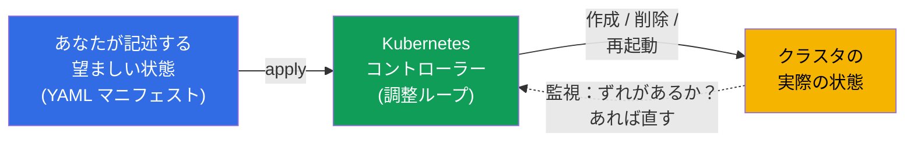
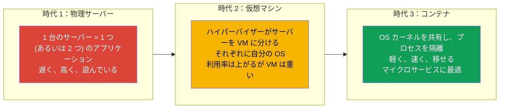
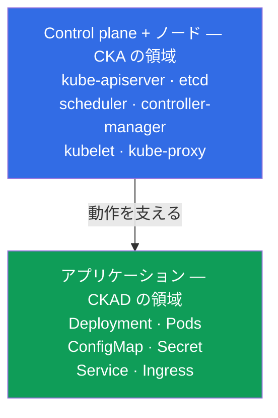
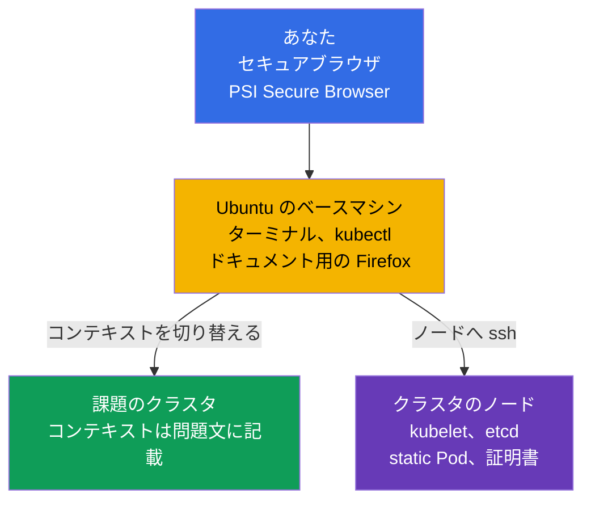
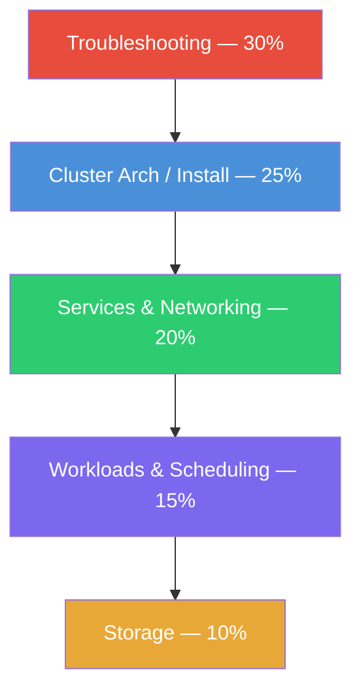
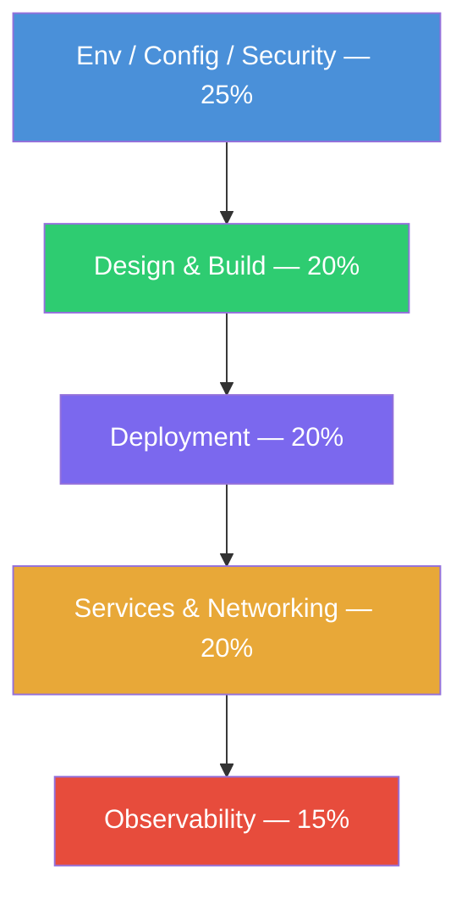
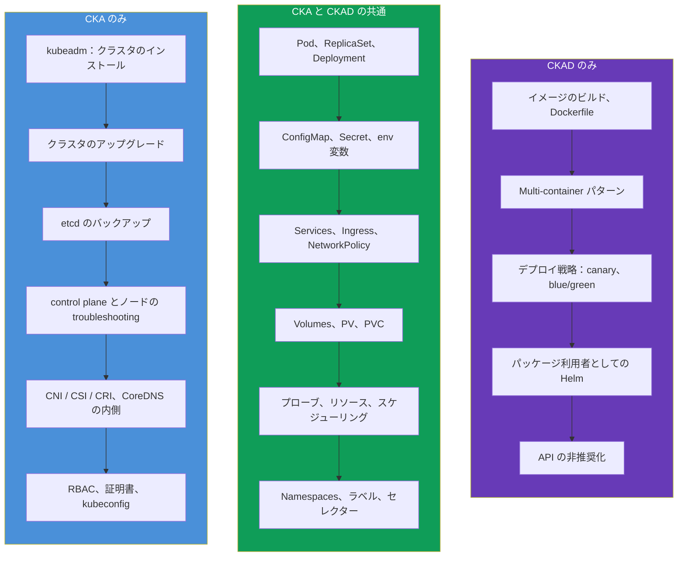
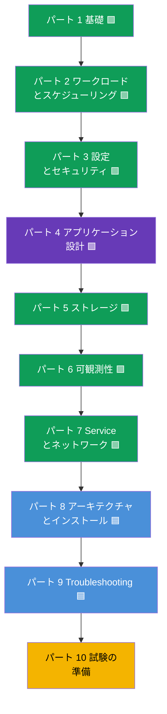

[Русская версия](ru.md) · [Eng version](README.md) · [Versión en español](es.md) · [Version française](fr.md) · [Deutsche Version](de.md) · [ქართული ვერსია](ge.md) · [繁體中文版](tw.md)

# 第 1 章。はじめに：Kubernetes、CKA と CKAD 試験、そしてコースの構成

> **この章とコース全体は誰のためか。** すでに Linux のターミナルで作業した経験が
> あり、コンテナや Docker イメージが何かを理解していて、少なくとも一度はコンテナを
> 起動したことがある方を想定しています。Kubernetes の経験は必須ではありません -
> ゼロから積み上げていきます。このコースの目的は「触ってみる」ことではなく、
> **2 つ** の実技試験 - **CKA**（クラスタ管理者）と **CKAD**（アプリケーション
> 開発者）- に自信をもって合格できる水準まで到達させることです。一般的な商用
> コースより意図的に厚く作っています：あちらが「合格するのに十分」を渡すところで、
> 私たちは「理解して合格するのに十分」を渡します。
>
> この第 1 章は概観です。Kubernetes とは何でなぜ必要なのか、CKA と CKAD は何が
> 違うのか、試験そのものはどう作られているのか、その出題範囲には何が含まれるのか、
> そしてこのコースがどう構成されているのかを整理します。コマンドを使った演習は
> 次の章から始まります。

## 1.1. Kubernetes とは何で、どんな課題を解決するのか

定義からではなく問題から始めましょう。コンテナにパッケージされたアプリケーションが
あると想像してください。コンテナが 1 つ、マシンが 1 台のうちはすべて簡単です：
`docker run` を実行すれば終わりです。しかし実際の運用では質問が雪崩のように出てきます。

- 夜中にコンテナが落ちた - 誰が再起動するのか？
- 負荷が 3 倍になった - 誰がコピーを 5 つ追加し、あとで減らすのか？
- コンテナが動いていたサーバーが死んだ - コンテナはどこへ移るのか？
- ユーザーを落とさずに新しいバージョンをどうやって出すのか？
- あるマシンのコンテナが別のマシンのコンテナをどうやって見つけるのか？
- コンテナにパスワード、設定、ディスクをどうやって配るのか？

これらはすべて **コンテナオーケストレーション** の課題です。Kubernetes（よく「k8s」と
書きます：文字 `k`、8 文字、文字 `s`）は、これらの課題を引き受けるシステムです。あなたは
宣言的に **望ましい状態** を記述し（「このアプリケーションのコピーを 5 つ、この設定と
このメモリ量で動かしたい」）、Kubernetes は現実をその記述へ絶えず近づけます：起動し、
再起動し、移し、スケールします。

この考え方 - **調整ループ**（reconciliation loop）- が Kubernetes の中心です。
コントローラーは「何を望んだか」と「何があるか」を絶えず比べ、その差を解消します。
だからこそ Kubernetes は落ちた Pod を自分で復旧させ、指定されたレプリカ数を保ちます：
「コマンドを実行して忘れる」のではなく、状態を常に見張っているのです。

### コンテナオーケストレーションは Kubernetes だけではない

Kubernetes は唯一のオーケストレーターではありませんが、今日では事実上の標準です。
市場の隣人も知っておくと役に立ちます。

| システム | 誰が作っているか | 何で知られているか |
|---------|-----------|--------------|
| **Kubernetes** | CNCF（もともとは Google） | デファクトスタンダード、巨大なエコシステム |
| **Docker Swarm** | Docker | シンプルだが機能は少なく、人気を失っている |
| **Amazon ECS** | AWS | プロプライエタリ、AWS 内だけ |
| **Nomad** | HashiCorp | 軽量、コンテナ以外も扱える |
| **Apache Mesos** | Apache | 老舗、現在コンテナ用途ではほぼ使われない |

CKA と CKAD の両方の認定は、まさに Kubernetes についてのものなので、この先は
Kubernetes だけを話します。

## 1.2. Kubernetes はどこから来たのか：「物理サーバー」からコンテナへ

Kubernetes がなぜこういう作りになっているのかを理解するには、アプリケーション
デプロイの 3 つの時代を見るのが役に立ちます。

コンテナは軽さと可搬性をもたらしましたが、規模の問題を生みました：コンテナが数百、
数千になると、自動で管理する必要が出てきます。こうしてオーケストレーターへの
ニーズが生まれ - Kubernetes がそれを埋めました。

## 1.3. 2 つの認定：CKA と CKAD

Kubernetes のまわりには CNCF（Cloud Native Computing Foundation）と Linux Foundation
による公式試験のラインナップが整えられています。私たちが関心を持つのはそのうちの
2 つです。

- **CKA - Certified Kubernetes Administrator。** クラスタを **管理する** 人のための
  試験です：クラスタを構築し、アップグレードし、修理し、ネットワーク、ストレージ、
  セキュリティを設定し、control plane やノードの障害に対処します。
- **CKAD - Certified Kubernetes Application Developer。** クラスタで
  **アプリケーションを開発し実行する** 人のための試験です：ワークロードを記述し、
  設定し、プローブ、Service、ボリュームを構成し、アプリケーションをデバッグします。

境界をもっとも簡単に覚えるなら：**CKA はクラスタに責任を持ち、CKAD はクラスタ内の
アプリケーションに責任を持つ**。管理者は「家」を建てて維持し、開発者はその中で快適に
「暮らし」、自分の「部屋」を整えます。

境界は厳格ではありません：管理者はアプリケーションを理解している必要があり、開発者も
少なくともクラスタの構造を基本的に把握している必要があります。だからこそ両方の試験を
一緒に学ぶのが便利です：知識の大部分が共通なのです。

## 1.4. 試験そのものはどう作られているのか

CKA も CKAD も **完全に実技** です。選択式のテストはありません。実際のクラスタの前に
座らされ、課題のセットが与えられます：何かを作る、直す、設定する。試験官がカメラと
画面越しに監視します。

技術的な仕組みはこうです。**セキュアブラウザ**（PSI Secure Browser）でリモート環境 -
`kubectl` とターミナルが既に用意された **Ubuntu のベースマシン** - に接続します
（隣にドキュメント用の Firefox があります）。このマシン自体はクラスタではありません：
課題のすべてのクラスタを操作するための、あなたの「操作卓」です。

ベースマシンからは 2 つの方法で作業します：

- **kubectl のコンテキスト経由。** 各課題にはそれぞれのクラスタが指定されていて、
  `kubectl config use-context <名前>` コマンドで切り替えます（通常は問題文にそのまま
  書かれています）。こうして複数のクラスタに入り込まずに管理します。
- **ノードへの SSH 経由。** 一部の課題（特に CKA の壊れた kubelet、static Pod、
  etcd、証明書）では、`ssh <node>` で特定のノードに入り、（多くは `sudo -i` で）
  作業を行い、`exit` で戻る必要があります。ベースマシンに戻るのを忘れることが、
  「違うノードで作業してしまう」よくある原因です。

| 項目 | CKA | CKAD |
|----------|-----|------|
| 形式 | 実技、稼働中のクラスタで | 実技、稼働中のクラスタで |
| 時間 | 2 時間 | 2 時間 |
| 課題数 | 約 15-20 | 約 15-20 |
| 合格点 | 66% | 66% |
| Kubernetes のバージョン | 最新（現在は `v1.35`） | 最新（現在は `v1.35`） |
| 再受験 | 無料で 1 回 | 無料で 1 回 |
| 有効期間 | 2 年 | 2 年 |
| 試験中のドキュメント | 許可（kubernetes.io など） | 許可（kubernetes.io など） |

この形式から導かれる、準備の戦略全体を決めるいくつかの重要な結論があります。

- **速さが勝負を決める。** 2 時間で 15-20 問 - 1 問あたり約 6-8 分です。YAML の
  構文を手で書いて悩む人は間に合いません。だから私たちは **命令型コマンド** と
  `--dry-run=client -o yaml` によるマニフェスト生成をたくさん練習します。
- **ドキュメントは許可されているが、読む時間はない。** ブラウザのタブを 1 つ
  `kubernetes.io/docs` に開けます。正確なフィールド名を忘れたときには助かりますが、
  試験中に基礎を探す時間はありません - 基礎は暗記しておく必要があります。
- **部分点が付く。** 部分的にできた課題にも点が入ります。つまり詰まったままでいるのは
  損で、できるところまでやって次に進むほうがよいのです。
- **複数のクラスタとコンテキスト。** 各課題にはクラスタと namespace が指定されて
  います。`kubectl config use-context` での切り替えを忘れるのは、典型的な失点です。

試験の戦術（エイリアス、JSONPath、時間管理）は最終章の第 47 章（CKAD）と第 48 章
（CKA）で詳しく扱います。今は大事なことだけ覚えてください：**どちらの試験も速さと
手を動かす力の勝負で、理論の暗記ではありません**。とはいえ理論なしでは手が手探りに
なるので、私たちは両方を提供します。

## 1.5. 試験の出題範囲：ドメインと配点

それぞれの試験は公式にドメインへ分割され、そのテーマが占める配点の割合が示されて
います。配点は優先順位の地図です：重みが大きいところに、より多くの時間を投じます。

**CKA**（現行の出題範囲）：

| CKA のドメイン | 配点 |
|-----------|-----|
| Troubleshooting（障害の調査と解消） | **30%** |
| Cluster Architecture, Installation & Configuration | **25%** |
| Services & Networking | **20%** |
| Workloads & Scheduling | **15%** |
| Storage | **10%** |

**CKAD**（現行の出題範囲）：

| CKAD のドメイン | 配点 |
|------------|-----|
| Application Environment, Configuration and Security | **25%** |
| Application Design and Build | **20%** |
| Application Deployment | **20%** |
| Services and Networking | **20%** |
| Application Observability and Maintenance | **15%** |

それぞれの試験の「重心」がどこにあるかは、図で見ると分かりやすいです：

CKA - クラスタの運用に重点（配点の大きい順）：

CKAD - アプリケーションに重点（配点の大きい順）：

結論は明らかです：**CKA はまず何よりも troubleshooting とクラスタの構造** であり、
**CKAD は設定、設計、アプリケーションのデプロイ** です。注目してください：
「Services & Networking」というドメインは両方の試験にあり、ワークロードや
ストレージの扱いも同じです。これがまさに、私たちがコースを 1 つにまとめた理由である
共通領域です。

## 1.6. 試験はどこで重なり、どこで違うのか

出題範囲を重ね合わせると、こういう絵になります。

共通領域は非常に大きく - だからこそ両方の試験に同時に備える意味があります。共通の
コアを一度通れば、あとは固有の部分を足すだけです：CKA には管理と troubleshooting、
CKAD には開発寄りのテーマを。

## 1.7. このコースの構成

コースは 10 のパートと 48 の章に分かれています。各章には、どの試験に関係するかの
印が付いています：

- 🟦 **CKA** - 管理者だけに必要なテーマ；
- 🟩 **CKAD** - 開発者だけに必要なテーマ；
- 🟪 **CKA + CKAD** - 両方に共通のテーマ。

章の順番は、易しいものから難しいものへ、そして新しいテーマが常に前のテーマの上に
立つように組まれています。共通のコア（パート 1-7）が最初に来るのは、両方の試験に
必要で土台になるからです。そのあとに管理者向けのパート（8-9）と試験の準備（10）が
続きます。

各章は同じテンプレートで作られています：

- 「この先なにを学ぶか」とそのテーマが必要な理由の導入；
- 図と表を使った理論；
- 演習：`kubectl` のコマンド、マニフェスト、挙動の分析；
- 重要用語の用語集；
- まとめ；
- 自己チェックの質問；
- ラボへのリンク。

**ラボ**（`tasks/cka/labs`）はクラウドに展開された実際のクラスタで、そこで教材を手を
動かして身につけます。1 つのラボはたいてい隣接する複数の章をまとめてカバーします
（たとえば namespaces + Pod + Deployment を 1 つの作業で）。演習が細かい課題に分裂
せず、まとまったものになるようにするためです。ラボのほかに **模擬試験**
（`tasks/cka/mock`、`tasks/ckad/mock`）もあります - 自動採点（`check_result`）付きの
本番のリハーサルです。

片方の試験だけを狙って準備する人のために、必要な章とラボだけを集めたガイドが 2 つ
あります：

- [CKA の出題範囲とラボ](../CKA_JP.md)
- [CKAD の出題範囲とラボ](../CKAD_JP.md)

## 1.8. 始める前に必要なもの

このコースが前提とする技術的な最低ライン：

- **Linux とターミナル。** 基本のコマンド、ファイル操作、`systemctl`、
  `journalctl`、エディタ `vim` または `nano`。試験ではエディタが主要な道具です；
  vim の短い最低限は第 [0.8](../00-8-vim/jp.md) 章にあります。
- **コンテナ。** イメージ、レイヤー、レジストリ、`docker`/`containerd` とは何か、
  コンテナが仮想マシンとどう違うのか。
- **YAML。** Kubernetes は YAML のマニフェストで記述されます。スペースによる
  インデント（タブは禁止！）、リスト、入れ子 - これを自由に読み書きできる必要が
  あります。
- **基本レベルのネットワーク。** IP、ポート、DNS、TCP/HTTP - 深追いはしませんが、
  それが何かは分かっている必要があります。

このうち何かがまだ不安でも心配ありません。ネットワーク、DNS、TLS、コンテナに
ついては、任意の **パート 0** - ゼロからの準備用の土台 - があります：

- 0.1. [ネットワーク：IP、ポート、CIDR、NAT](../00-1-net/jp.md)
- 0.2. [DNS：名前はどうやってアドレスに変わるのか](../00-2-dns/jp.md)
- 0.3. [TLS と証明書：HTTPS、鍵、CA](../00-3-tls/jp.md)
- 0.4. [コンテナと Docker：イメージ、レイヤー、レジストリ、runtime](../00-4-containers/jp.md)

これらのテーマをすでに知っているなら、パート 0 は遠慮なく飛ばしてください。土台が
しっかりしているほど、この先が楽に進みます。

## 1.9. どう練習するか

実技試験に理論だけでは足りません - 手元にクラスタが必要です。いくつかの選択肢が
あります：

| 選択肢 | 難しさ | 費用 | 何のために |
|---------|-----------|-----------|----------|
| **minikube / kind** | 低い | 無料 | CKAD のテーマ向けの手早いローカルクラスタ |
| **VM 上の kubeadm** | 中くらい | 無料/安い | 本格的なクラスタ、CKA には必須 |
| **Killercoda** | 低い | 無料 | ブラウザで動く既製の対話シナリオ |
| **このプラットフォーム（`tasks/cka/labs`）** | 低い | 低い (AWS) | AWS 上の本物のクラスタで動く私たちのラボと模擬試験 |

CKAD には軽いローカルクラスタでも足ります。CKA には
**kubeadm で手動で立てたマルチノードのクラスタ** がまさに必要です - 試験が control
plane の修理、クラスタのアップグレード、etcd のバックアップを求めるのに、minikube では
それらに触れられないからです。私たちのラボはそうしたクラスタを AWS に自動で立てます。

## 1.10. ミニ用語集

- **Kubernetes (k8s)** - コンテナオーケストレーションのシステム：クラスタの実際の
  状態を望ましい状態へ近づける。
- **オーケストレーション** - コンテナのライフサイクルの自動管理（起動、再起動、
  スケーリング、配置）。
- **望ましい状態 (desired state)** - あなたがマニフェストに記述したもの。
- **調整ループ (reconciliation loop)** - コントローラーが望ましい状態と実際の状態の
  差を解消し続ける継続的なループ。
- **CKA** - Certified Kubernetes Administrator、クラスタ管理の試験。
- **CKAD** - Certified Kubernetes Application Developer、アプリケーション実行の試験。
- **CNCF** - Cloud Native Computing Foundation、Kubernetes とこれらの認定の背後に
  ある組織。
- **マニフェスト** - Kubernetes のオブジェクトを記述した YAML ファイル。
- **kubectl** - クラスタを操作するための主要なコマンドラインユーティリティ。
- **命令型のアプローチ** - コマンドでオブジェクトを管理する（`kubectl run`、`create`）。
- **宣言型のアプローチ** - マニフェスト経由で管理する（`kubectl apply -f`）。

## 1.11. 本章のまとめ

- Kubernetes はコンテナのオーケストレーター：あなたが望ましい状態を記述し、それは
  調整ループを通して現実を絶えずそこへ近づける。
- コンテナはデプロイの第 3 の時代（物理サーバーと VM のあと）；その軽さと規模が
  オーケストレーターへのニーズを生んだ。
- CKA はクラスタの管理について、CKAD はクラスタでのアプリケーション実行について。
  境界は「家」(CKA) 対「家での暮らし」(CKAD)。
- どちらの試験も完全に実技：2 時間、稼働中のクラスタで約 15-20 問、合格ラインは
  66%、ドキュメントは許可、部分点あり。決めるのは速さと手を動かす力。
- CKA の重心は troubleshooting (30%) とクラスタの構造 (25%)；CKAD は設定 (25%)、
  アプリケーションの設計とデプロイ。
- 出題範囲は大きく重なる（ワークロード、Service、設定、ストレージ）ので、両方の試験を
  一緒に準備するほうが効率的。
- コースは 10 パートと 48 章で、🟦/🟩/🟪 の印付き；まず共通のコア、それから管理者
  パートと試験の準備。演習はまとめられたラボと模擬試験で。

## 1.12. これがどう役に立つか：試験と実際の仕事で

各章はこのような節で終えます - 学んだことを 2 つのことに結びつけます：試験で具体的に
何が問われるのか、そして実際の運用でどう使われるのか。こうすれば理論が宙に浮きません。

**試験では。** この章は概観なので、これ単独の課題はありません。しかし戦略を決めて
くれます：形式（2 時間、約 15-20 問、合格ライン 66%、部分点）を理解し、ドメインの
配点を知り、どこに時間を投じるべきかがもう見えています - CKA なら troubleshooting と
クラスタの構造に、CKAD なら設定とアプリケーションのデプロイに。

**実際の仕事では。** CKA と CKAD は「資格のための資格」ではなく、実在するロールの
スキルの地図です：

| ロール | 近い試験 | Kubernetes で何をするか |
|------|------------------|-------------------------|
| DevOps / Platform Engineer | CKA | クラスタ、ネットワーク、ストレージ、アクセスを構築し維持する |
| SRE | CKA (+ CKAD) | 信頼性を保ち、インシデントを分析し、troubleshooting する |
| Backend / App Developer | CKAD | アプリケーションのマニフェスト、プローブ、設定、デプロイを書く |
| Full-stack / チームリード | CKA + CKAD | クラスタからアプリケーションまで全体像を理解する |

Pod を素早く作り、壊れたデプロイを直し、NetworkPolicy を設定できることは、試験の
項目であるだけでなく日々の仕事です。このコースは合格に厳密に必要な以上の文脈を
意図的に渡します - 認定のあとにあなたが本番で役に立つ人になり、「テストに通れる」
だけの人にならないようにするためです。

## 1.13. 自己チェックの質問

1. 「Kubernetes は実際の状態を望ましい状態へ近づける」とはどういう意味ですか？その
   仕組みは何と呼ばれますか？
2. CKA と CKAD の責任範囲の本質的な違いは何ですか？それぞれ固有のテーマを 2 つずつ
   挙げてください。
3. なぜ試験では速さがそれほど重要で、それを身につけるために何を練習しますか？
4. CKA でもっとも配点が大きいドメインはどれで、なぜそこに時間の 3 分の 1 を投じる
   価値があるのですか？
5. なぜ CKA の準備には minikube では足りず、CKAD には足りるのですか？
6. CKA と CKAD の準備を 1 つのコースにまとめると何が得られますか？

## 演習

この章は概観なので、専用のラボはありません。次の章からクラスタの構造の解説が始まり、
コマンドを使った実際の作業は第 3 章からです。最初のラボには、基礎を押さえて手を
動かして試すものができたときに進みます；具体的なラボへのリンクは、その教材を扱う章に
現れます。

---
[目次](../README_JP.md) · [パート 0](../00-1-net/jp.md) · [第 2 章](../02/jp.md)
