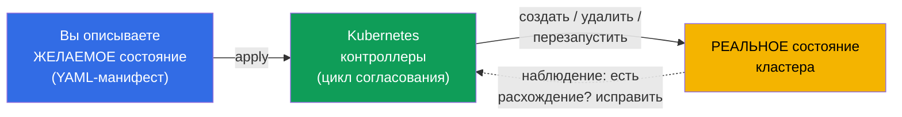
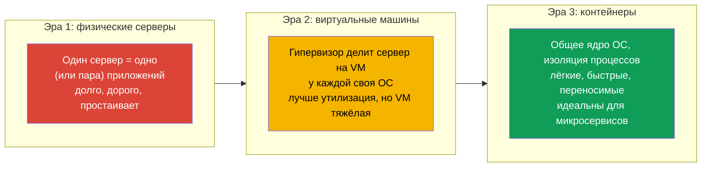
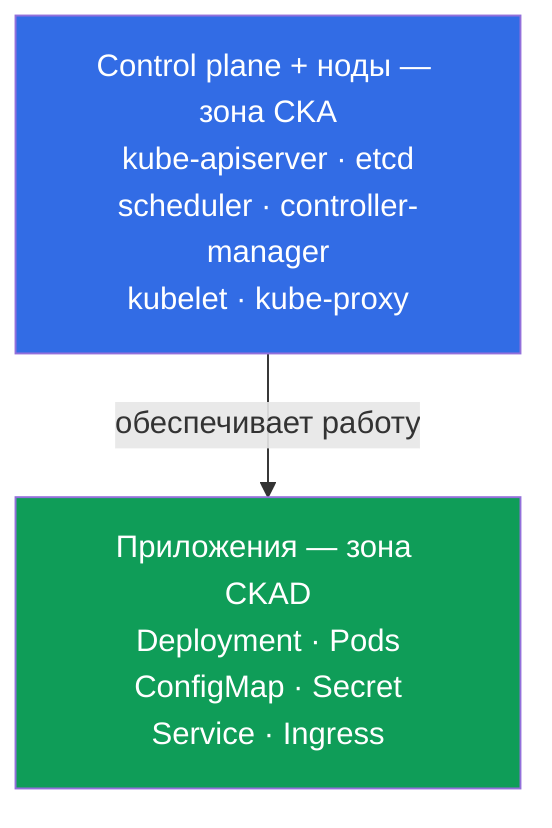
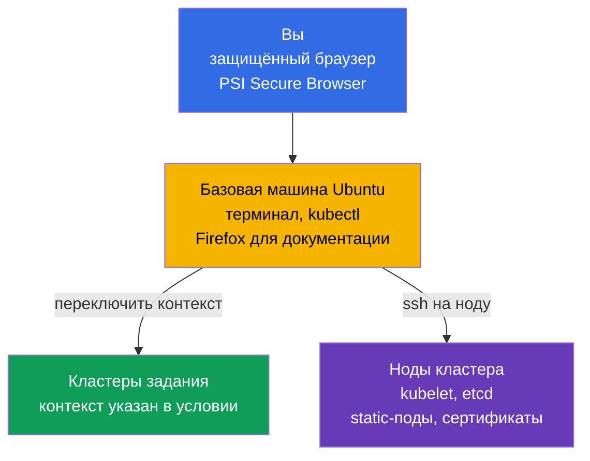
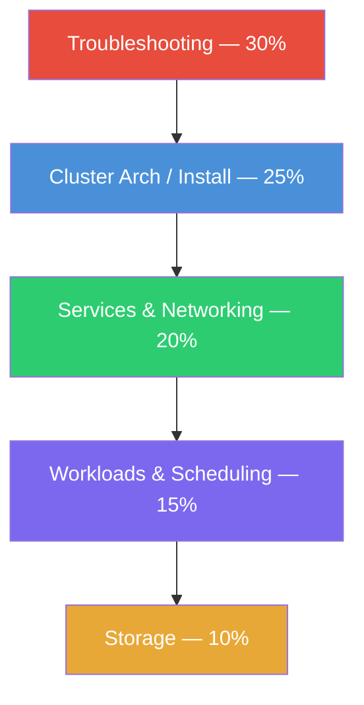
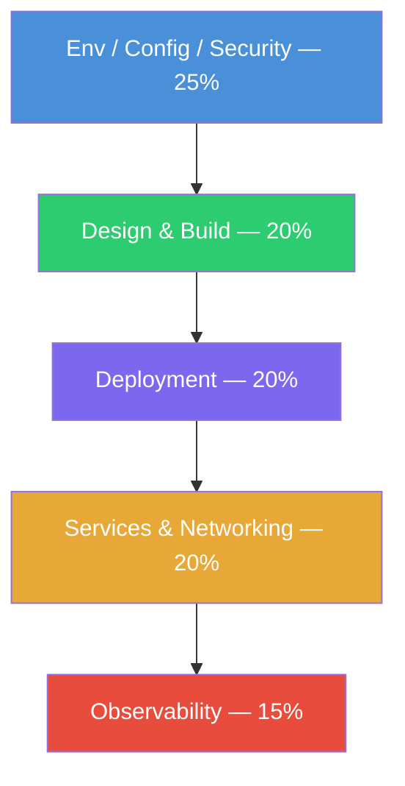
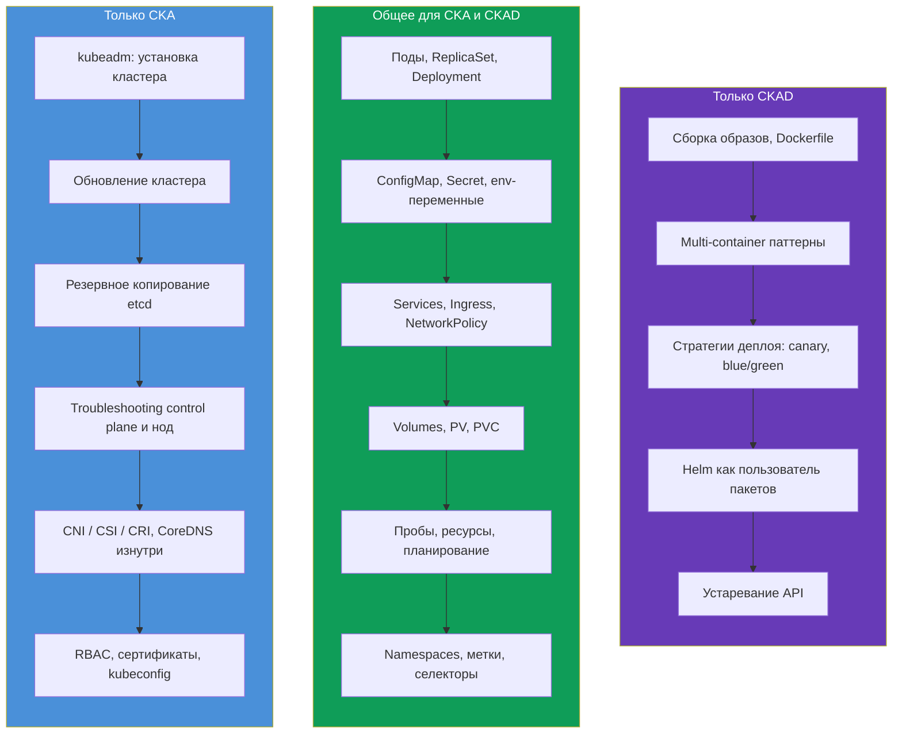
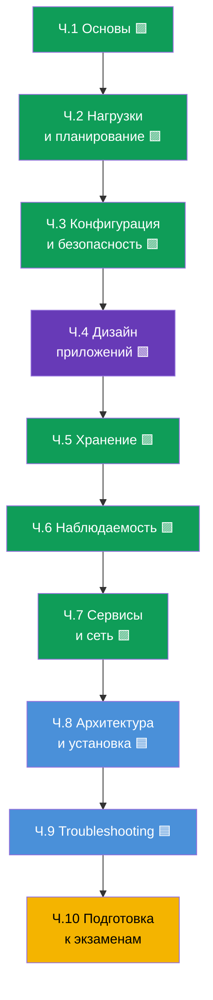

# Глава 1. Введение: Kubernetes, экзамены CKA и CKAD и устройство курса

> **Для кого эта глава и весь курс.** Мы рассчитываем, что вы уже работали с
> Linux в терминале, понимаете, что такое контейнер и Docker-образ, и хотя бы раз
> запускали контейнер. Опыт с Kubernetes не обязателен - мы построим всё с нуля.
> Цель курса - не «познакомиться», а довести вас до уровня, на котором вы уверенно
> сдадите **два** практических экзамена: **CKA** (администратор кластера) и
> **CKAD** (разработчик приложений). Курс сознательно сделан полнее типовых
> коммерческих курсов: где они дают «достаточно, чтобы сдать», мы даём «достаточно,
> чтобы понимать и сдать».
>
> Эта первая глава - обзорная. Мы разберёмся, что такое Kubernetes и зачем он
> нужен, чем отличаются CKA и CKAD, как устроены сами экзамены, что входит в их
> программы и как устроен этот курс. Практика с командами начнётся со следующей
> главы.

## 1.1. Что такое Kubernetes и какую задачу он решает

Начнём с проблемы, а не с определения. Представьте, что у вас есть приложение,
упакованное в контейнеры. Пока контейнер один и машина одна - всё просто: запустили
`docker run`, и готово. Но в реальной эксплуатации возникает лавина вопросов.

- Контейнер упал ночью - кто его перезапустит?
- Нагрузка выросла втрое - кто добавит ещё пять копий, а потом уберёт их?
- Сервер, где крутились контейнеры, умер - куда переедут контейнеры?
- Как выкатить новую версию, не уронив пользователей?
- Как контейнеру на одной машине найти контейнер на другой?
- Как раздать контейнерам пароли, конфиги и диски?

Всё это - задачи **оркестрации контейнеров**. Kubernetes (часто пишут «k8s»: буква
`k`, восемь букв, буква `s`) - это система, которая берёт эти задачи на себя. Вы
декларативно описываете **желаемое состояние** («хочу 5 копий этого приложения, вот
с таким конфигом и таким объёмом памяти»), а Kubernetes постоянно приводит реальность
к этому описанию: запускает, перезапускает, переносит, масштабирует.

Эта идея - **петля согласования** (reconciliation loop) - главная в Kubernetes.
Контроллеры непрерывно сравнивают «что хотели» и «что есть» и устраняют разницу.
Именно поэтому Kubernetes сам восстанавливает упавшие поды и держит заданное число
реплик: он не «выполнил команду и забыл», а постоянно следит за состоянием.

### Оркестрация контейнеров - не только Kubernetes

Kubernetes не единственный оркестратор, но сегодня фактический стандарт. Полезно
знать соседей по рынку.

| Система | Кто делает | Чем известна |
|---------|-----------|--------------|
| **Kubernetes** | CNCF (изначально Google) | Стандарт де-факто, огромная экосистема |
| **Docker Swarm** | Docker | Простой, но возможностей меньше, теряет популярность |
| **Amazon ECS** | AWS | Проприетарный, только в AWS |
| **Nomad** | HashiCorp | Лёгкий, умеет не только контейнеры |
| **Apache Mesos** | Apache | Ветеран, сейчас почти не используется для контейнеров |

Обе сертификации, CKA и CKAD, - именно про Kubernetes, поэтому дальше говорим только
о нём.

## 1.2. Откуда взялся Kubernetes: от «железа» к контейнерам

Чтобы понять, почему Kubernetes устроен именно так, полезно увидеть три эпохи
развёртывания приложений.

Контейнеры дали лёгкость и переносимость, но породили проблему масштаба: когда
контейнеров сотни и тысячи, ими нужно управлять автоматически. Так и появилась
потребность в оркестраторе - и Kubernetes её закрыл.

## 1.3. Две сертификации: CKA и CKAD

Вокруг Kubernetes выстроена целая линейка официальных экзаменов от CNCF (Cloud
Native Computing Foundation) и Linux Foundation. Нас интересуют два из них.

- **CKA - Certified Kubernetes Administrator.** Экзамен для тех, кто
  **администрирует** кластер: ставит его, обновляет, чинит, настраивает сеть,
  хранилища, безопасность, разбирается со сбоями control plane и нод.
- **CKAD - Certified Kubernetes Application Developer.** Экзамен для тех, кто
  **разрабатывает и запускает приложения** в кластере: описывает рабочие нагрузки,
  конфигурирует их, настраивает пробы, сервисы, тома, отлаживает приложения.

Проще всего запомнить границу так: **CKA отвечает за кластер, CKAD - за приложения
внутри кластера**. Администратор строит и обслуживает «дом», разработчик - удобно
«живёт» в нём и обставляет свои «комнаты».

Граница не жёсткая: администратор обязан понимать приложения, а разработчик - хотя бы
базово ориентироваться в устройстве кластера. Именно поэтому изучать оба экзамена
вместе удобно: большая часть знаний общая.

## 1.4. Как устроены сами экзамены

И CKA, и CKAD - **полностью практические**. Никаких тестов с выбором ответа. Вас
сажают за реальные кластеры и дают набор задач: что-то создать, починить, настроить.
Проктор наблюдает через камеру и экран.

Как это устроено технически. Вы подключаетесь через **защищённый браузер** (PSI Secure
Browser) к удалённому окружению - **базовой Linux-машине на Ubuntu** с уже настроенным
`kubectl` и терминалом (рядом - Firefox для документации). Сама эта машина не является
кластером: это ваш «пульт», с которого вы работаете со всеми кластерами задания.

С базовой машины вы работаете двумя способами:

- **Через контекст kubectl.** Для каждой задачи указан свой кластер; переключаетесь на
  него командой `kubectl config use-context <имя>` (её обычно дают прямо в условии).
  Так вы управляете несколькими кластерами, не заходя на них.
- **Через SSH на ноду.** Часть задач (особенно на CKA: сломанный kubelet, static-под,
  etcd, сертификаты) требует зайти на конкретную ноду по `ssh <node>`, выполнить
  действия (часто под `sudo -i`) и вернуться обратно командой `exit`. Забыть вернуться
  на базовую машину - частая причина «делаю на не той ноде».

| Параметр | CKA | CKAD |
|----------|-----|------|
| Формат | Практический, в живом кластере | Практический, в живом кластере |
| Длительность | 2 часа | 2 часа |
| Число заданий | ~15-20 | ~15-20 |
| Проходной балл | 66% | 66% |
| Версия Kubernetes | актуальная (сейчас `v1.35`) | актуальная (сейчас `v1.35`) |
| Пересдача | 1 бесплатная попытка | 1 бесплатная попытка |
| Срок действия | 2 года | 2 года |
| Документация на экзамене | разрешена (kubernetes.io и др.) | разрешена (kubernetes.io и др.) |

Несколько важных следствий из формата, которые определяют всю стратегию подготовки.

- **Скорость решает.** 15-20 задач за 2 часа - это ~6-8 минут на задачу. Кто
  копается в синтаксисе YAML вручную, не успевает. Поэтому мы будем много тренировать
  **императивные команды** и генерацию манифестов через `--dry-run=client -o yaml`.
- **Документация разрешена, но нет времени читать.** Можно открыть один браузерный
  таб на `kubernetes.io/docs`. Это спасает, когда забыл точное поле, но искать основы
  на экзамене некогда - их надо знать наизусть.
- **Начисляются частичные баллы.** За частично выполненное задание тоже дают баллы.
  Значит, не стоит застревать - лучше сделать что можешь и идти дальше.
- **Несколько кластеров и контекстов.** В каждом задании указан кластер и namespace.
  Забыть переключить контекст `kubectl config use-context` - классическая потеря
  баллов.

Подробно тактику экзаменов (алиасы, JSONPath, тайм-менеджмент) разберём в финальных
главах 47 (CKAD) и 48 (CKA). Пока запомните главное: **оба экзамена про скорость и
руки, а не про заучивание теории**. Но без теории руки работают вслепую, поэтому мы
даём и то, и другое.

## 1.5. Программы экзаменов: домены и веса

Каждый экзамен официально разбит на домены с весами - долей баллов, которую даёт эта
тема. Веса - это карта приоритетов: где вес больше, туда вкладываем больше времени.

**CKA** (актуальная программа):

| Домен CKA | Вес |
|-----------|-----|
| Troubleshooting (поиск и устранение неисправностей) | **30%** |
| Cluster Architecture, Installation & Configuration | **25%** |
| Services & Networking | **20%** |
| Workloads & Scheduling | **15%** |
| Storage | **10%** |

**CKAD** (актуальная программа):

| Домен CKAD | Вес |
|------------|-----|
| Application Environment, Configuration and Security | **25%** |
| Application Design and Build | **20%** |
| Application Deployment | **20%** |
| Services and Networking | **20%** |
| Application Observability and Maintenance | **15%** |

Визуально видно, где «центр тяжести» каждого экзамена:

CKA - акцент на эксплуатации кластера (домены по убыванию веса):

CKAD - акцент на приложениях (домены по убыванию веса):

Вывод очевиден: **CKA - это в первую очередь troubleshooting и устройство кластера**,
а **CKAD - это конфигурация, дизайн и деплой приложений**. Обратите внимание: домен
«Services & Networking» есть в обоих экзаменах, как и работа с рабочими нагрузками и
хранилищем. Это и есть общая зона, ради которой мы объединили курс.

## 1.6. Где экзамены пересекаются и чем различаются

Если наложить программы друг на друга, картина такая.

Общая зона огромна - именно поэтому имеет смысл готовиться к обоим экзаменам сразу.
Пройдя общее ядро один раз, вы добираете лишь специфику: для CKA - администрирование
и troubleshooting, для CKAD - разработческие темы.

## 1.7. Как устроен этот курс

Курс разбит на 10 частей и 48 глав. Каждая глава помечена, к какому экзамену
относится:

- 🟦 **CKA** - тема нужна только администратору;
- 🟩 **CKAD** - тема нужна только разработчику;
- 🟪 **CKA + CKAD** - общая тема для обоих.

Порядок глав выстроен от простого к сложному и так, чтобы каждая новая тема опиралась
на предыдущие. Общее ядро (части 1-7) идёт первым, потому что оно нужно для обоих
экзаменов и составляет фундамент. Затем администраторская часть (8-9) и подготовка к
экзаменам (10).

Каждая глава построена по единому шаблону:

- вводка «что дальше» и зачем тема нужна;
- теория с диаграммами и таблицами;
- практика: команды `kubectl`, манифесты, разбор поведения;
- глоссарий ключевых терминов;
- итоги;
- вопросы для самопроверки;
- ссылка на лабораторную работу.

**Лабораторные работы** (`tasks/cka/labs`) - это развёрнутые в облаке реальные
кластеры, где вы отрабатываете материал руками. Одна лаба обычно закрывает сразу
несколько смежных глав (например, namespaces + поды + deployment'ы - в одной работе),
чтобы практика была цельной, а не дробилась на десятки мелких задач. Кроме лаб есть
**мок-экзамены** (`tasks/cka/mock`, `tasks/ckad/mock`) - репетиции настоящего экзамена
с автопроверкой (`check_result`).

Для тех, кто готовится точечно к одному экзамену, есть два путеводителя, которые
собирают только нужные главы и лабы:

- [Программа и лабы для CKA](../CKA_RU.md)
- [Программа и лабы для CKAD](../CKAD_RU.md)

## 1.8. Что понадобится до старта

Технический минимум, на который опирается курс:

- **Linux и терминал.** Базовые команды, работа с файлами, `systemctl`,
  `journalctl`, редактор `vim` или `nano`. На экзамене редактор - ваш основной
  инструмент; краткий минимум по vim - в главе [0.8](../00-8-vim/ru.md).
- **Контейнеры.** Что такое образ, слои, реестр, `docker`/`containerd`, чем контейнер
  отличается от виртуальной машины.
- **YAML.** Kubernetes описывается манифестами в YAML. Отступы пробелами (не табами!),
  списки, вложенность - это надо читать и писать свободно.
- **Сеть на базовом уровне.** IP, порты, DNS, TCP/HTTP - без глубин, но понимать, что
  это.

Если что-то из этого пока шатко - не страшно. Для сетей, DNS, TLS и контейнеров есть
необязательная **Часть 0** - подготовительный фундамент с нуля:

- 0.1. [Сеть: IP, порты, CIDR и NAT](../00-1-net/ru.md)
- 0.2. [DNS: как имена превращаются в адреса](../00-2-dns/ru.md)
- 0.3. [TLS и сертификаты: HTTPS, ключи, CA](../00-3-tls/ru.md)
- 0.4. [Контейнеры и Docker: образы, слои, реестры, runtime](../00-4-containers/ru.md)

Если эти темы вам знакомы - смело пропускайте Часть 0. Чем крепче фундамент, тем легче
пойдёт дальше.

## 1.9. Как практиковаться

Одной теории для практических экзаменов недостаточно - нужен кластер под руками. У вас
есть несколько вариантов:

| Вариант | Сложность | Стоимость | Для чего |
|---------|-----------|-----------|----------|
| **minikube / kind** | низкая | бесплатно | быстрый локальный кластер для CKAD-тем |
| **kubeadm на VM** | средняя | бесплатно/дёшево | полноценный кластер, обязателен для CKA |
| **Killercoda** | низкая | бесплатно | готовые интерактивные сценарии в браузере |
| **Эта платформа (`tasks/cka/labs`)** | низкая | низкая (AWS) | наши лабы и моки на настоящих кластерах в AWS |

Для CKAD хватает и лёгкого локального кластера. Для CKA нужен именно
**многонодовый кластер, поднятый вручную через kubeadm** - потому что экзамен требует
чинить control plane, обновлять кластер и бэкапить etcd, а в minikube этого не
потрогать. Наши лабораторные работы поднимают такой кластер в AWS автоматически.

## 1.10. Мини-глоссарий

- **Kubernetes (k8s)** - система оркестрации контейнеров: приводит реальное состояние
  кластера к желаемому.
- **Оркестрация** - автоматическое управление жизненным циклом контейнеров (запуск,
  перезапуск, масштабирование, размещение).
- **Желаемое состояние (desired state)** - то, что вы описали в манифесте.
- **Петля согласования (reconciliation loop)** - непрерывный цикл, в котором
  контроллеры устраняют разницу между желаемым и реальным состоянием.
- **CKA** - Certified Kubernetes Administrator, экзамен по администрированию кластера.
- **CKAD** - Certified Kubernetes Application Developer, экзамен по запуску приложений.
- **CNCF** - Cloud Native Computing Foundation, организация, стоящая за Kubernetes и
  этими сертификациями.
- **Манифест** - YAML-файл с описанием объекта Kubernetes.
- **kubectl** - основная утилита командной строки для работы с кластером.
- **Императивный подход** - управление объектами командами (`kubectl run`, `create`).
- **Декларативный подход** - управление через манифесты (`kubectl apply -f`).

## 1.11. Итоги главы

- Kubernetes - оркестратор контейнеров: вы описываете желаемое состояние, а он
  постоянно приводит к нему реальность через петлю согласования.
- Контейнеры - третья эра развёртывания (после физических серверов и VM); их лёгкость
  и масштаб породили потребность в оркестраторе.
- CKA - про администрирование кластера, CKAD - про запуск приложений в кластере.
  Граница: «дом» (CKA) против «жизни в доме» (CKAD).
- Оба экзамена полностью практические: 2 часа, ~15-20 задач в живом кластере, порог
  66%, документация разрешена, есть частичные баллы. Всё решают скорость и руки.
- У CKA центр тяжести - troubleshooting (30%) и устройство кластера (25%); у CKAD -
  конфигурация (25%), дизайн и деплой приложений.
- Программы сильно пересекаются (нагрузки, сервисы, конфигурация, хранилища), поэтому
  готовиться к обоим экзаменам вместе эффективнее.
- Курс - 10 частей и 48 глав, помеченных 🟦/🟩/🟪; сначала общее ядро, потом
  админ-часть и подготовка к экзаменам. Практика - в объединённых лабах и мок-экзаменах.

## 1.12. Как это пригодится: на экзамене и в реальной работе

Каждую главу мы будем заканчивать таким разделом - он связывает изученное с двумя
вещами: что конкретно спросят на экзамене и как это применяют в реальной
эксплуатации. Так теория не повисает в воздухе.

**На экзамене.** Эта глава - обзорная, отдельных заданий по ней нет. Но она задаёт
стратегию: вы теперь понимаете формат (2 часа, ~15-20 задач, порог 66%, частичные
баллы), знаете веса доменов и уже видите, куда вкладывать время - в troubleshooting
и устройство кластера для CKA, в конфигурацию и деплой приложений для CKAD.

**В реальной работе.** CKA и CKAD - это не «корочки ради корочек», а карта навыков
реальных ролей:

| Роль | Ближе к экзамену | Что делает с Kubernetes |
|------|------------------|-------------------------|
| DevOps / Platform Engineer | CKA | Строит и обслуживает кластеры, сеть, хранилища, доступы |
| SRE | CKA (+ CKAD) | Держит надёжность, разбирает инциденты, troubleshooting |
| Backend / App Developer | CKAD | Пишет манифесты приложений, пробы, конфиги, деплой |
| Full-stack / тимлид | CKA + CKAD | Понимает всю картину от кластера до приложения |

Умение быстро создать под, починить сломанный деплой или настроить NetworkPolicy -
это ежедневная работа, а не только пункт экзамена. Курс сознательно даёт больше
контекста, чем нужно строго для сдачи, - чтобы после сертификата вы были полезны в
проде, а не только «умели пройти тест».

## 1.13. Вопросы для самопроверки

1. Что означает «Kubernetes приводит реальное состояние к желаемому»? Как называется
   этот механизм?
2. В чём принципиальная разница между зонами ответственности CKA и CKAD? Приведите по
   два примера тем, уникальных для каждого.
3. Почему на экзаменах так важна скорость и что мы будем тренировать, чтобы её набрать?
4. Какой домен даёт больше всего баллов на CKA и почему туда стоит вложить треть
   времени?
5. Почему для подготовки к CKA недостаточно minikube, а для CKAD - достаточно?
6. Что даёт объединение подготовки к CKA и CKAD в один курс?

## Практика

Эта глава обзорная, отдельной лабы у неё нет. Со следующей главы начинается разбор
устройства кластера, а практическая работа с командами - с главы 3. К первой лабе мы
подойдём, когда разберём основы и будет что отрабатывать руками; ссылки на конкретные
лабы появляются в главах, материал которых они закрывают.

---
[Оглавление](../README_RU.md) · [Часть 0](../00-1-net/ru.md) · [Глава 2](../02/ru.md)
