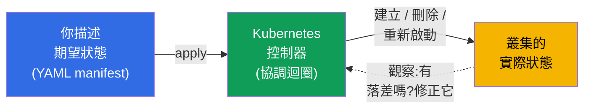
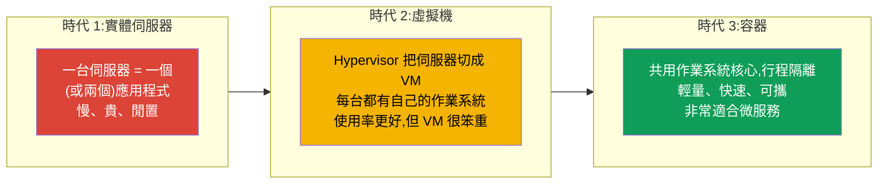
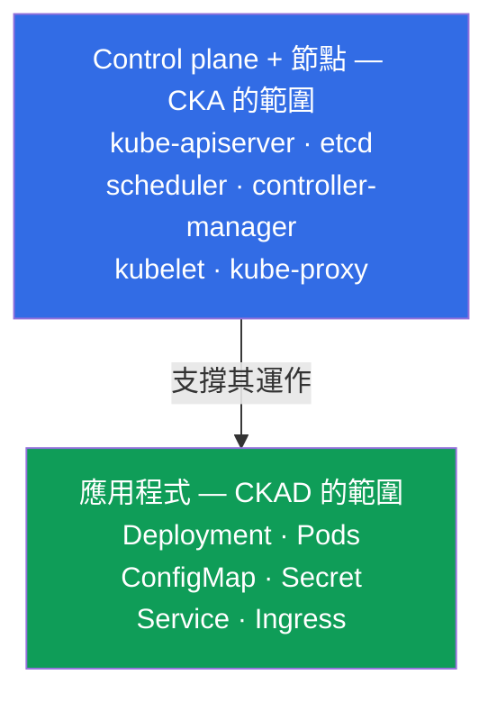
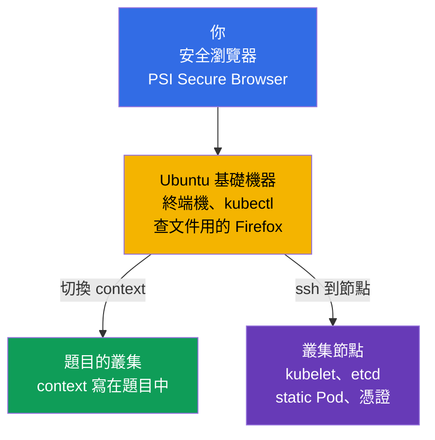
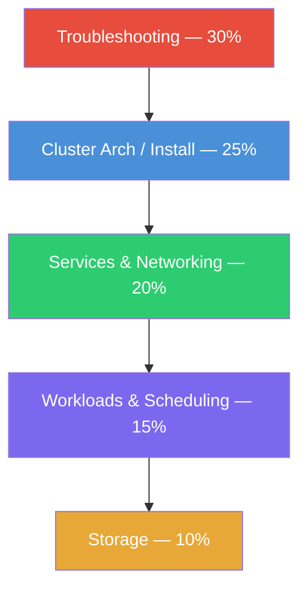
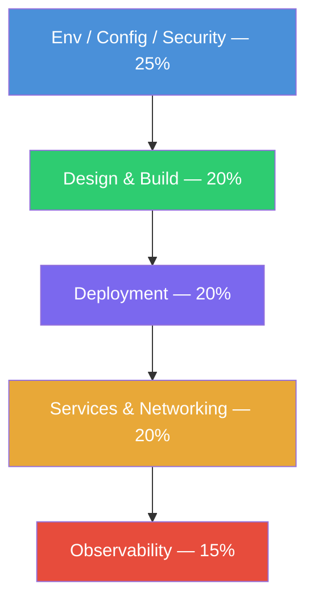
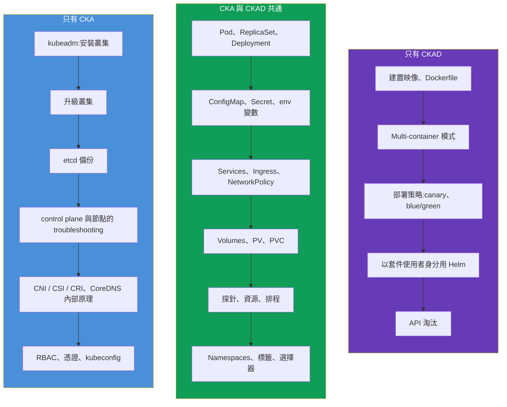
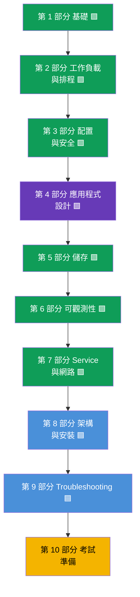

[Русская версия](ru.md) · [Eng version](README.md) · [Versión en español](es.md) · [Version française](fr.md) · [Deutsche Version](de.md) · [ქართული ვერსია](ge.md) · [日本語版](jp.md)

# 第 1 章。導論:Kubernetes、CKA 與 CKAD 考試,以及本課程的結構

> **這一章與整個課程適合誰。** 我們假設你已經在終端機中用過
> Linux,理解什麼是容器與 Docker 映像,並且至少啟動過一次
> 容器。Kubernetes 的經驗不是必需的 - 我們會從零建立一切。
> 本課程的目標不是「認識一下」,而是把你帶到能自信通過
> **兩場** 實作考試的水準:**CKA**(叢集管理員)與
> **CKAD**(應用程式開發者)。本課程刻意做得比
> 一般商業課程更完整:當它們給的是「足以通過」,我們給的是「足以
> 理解並通過」。
>
> 這第一章是概覽性的。我們會弄清楚什麼是 Kubernetes、為什麼需要
> 它,CKA 與 CKAD 有什麼不同,考試本身如何進行,它們的大綱
> 包含什麼,以及這門課程如何組織。指令的實務操作會從下一章
> 開始。

## 1.1. 什麼是 Kubernetes,它解決什麼問題

我們從問題開始,而不是從定義開始。想像你有一個打包成容器的
應用程式。只要容器只有一個、機器只有一台 - 一切都很簡單:執行
`docker run`,就完成了。但在真實的營運中,問題會像雪崩一樣湧來。

- 容器在半夜掛掉了 - 誰來重新啟動它?
- 負載成長了三倍 - 誰來再加五份副本,之後又把它們收掉?
- 跑著容器的伺服器死了 - 容器要搬到哪裡去?
- 如何推出新版本而不讓使用者中斷?
- 在一台機器上的容器,如何找到另一台機器上的容器?
- 如何把密碼、設定檔與磁碟分發給容器?

這一切都是 **容器編排** 的任務。Kubernetes(常寫成「k8s」:字母
`k`、八個字母、字母 `s`) - 就是把這些任務接下來的系統。你用宣告式的
方式描述 **期望狀態**(「我要這個應用程式的 5 份副本,配置是這樣,
記憶體是這麼多」),而 Kubernetes 會持續把現實調整到這份描述:
啟動、重啟、遷移、擴縮。

這個想法 - **協調迴圈**(reconciliation loop) - 是 Kubernetes 中最核心的。
控制器不斷比較「我們要的」與「現在有的」,並消除差異。
正因如此,Kubernetes 會自己恢復掛掉的 Pod 並維持指定的副本數:
它不是「執行了指令就忘記」,而是持續監看狀態。

### 容器編排不只有 Kubernetes

Kubernetes 不是唯一的編排系統,但今天它是事實上的標準。了解一下
市場上的鄰居會很有幫助。

| 系統 | 由誰打造 | 以什麼聞名 |
|---------|-----------|--------------|
| **Kubernetes** | CNCF(最初是 Google) | 事實標準,生態系極為龐大 |
| **Docker Swarm** | Docker | 簡單,但功能較少,人氣下滑 |
| **Amazon ECS** | AWS | 專有,只在 AWS 上 |
| **Nomad** | HashiCorp | 輕量,不只能跑容器 |
| **Apache Mesos** | Apache | 老將,現在幾乎不用於容器 |

CKA 與 CKAD 這兩張認證,講的都是 Kubernetes,所以接下來我們
只談它。

## 1.2. Kubernetes 從何而來:從「實體機」到容器

為了理解 Kubernetes 為什麼是這個樣子,看看應用程式部署的三個
時代會很有幫助。

容器帶來了輕量與可攜性,但也催生了規模的問題:當容器有成百
上千個時,就必須自動管理它們。編排系統的需求就是這樣出現的 -
而 Kubernetes 把它填滿了。

## 1.3. 兩張認證:CKA 與 CKAD

在 Kubernetes 周圍,CNCF(Cloud Native Computing Foundation)與 Linux
Foundation 建立了一整條官方考試產品線。我們關心其中兩張。

- **CKA - Certified Kubernetes Administrator。** 這是給 **管理**
  叢集的人的考試:安裝、升級、修復、設定網路、
  儲存、安全,處理 control plane 與節點的故障。
- **CKAD - Certified Kubernetes Application Developer。** 這是給在叢集中
  **開發並執行應用程式** 的人的考試:描述工作負載、設定它們、
  設定探針、Service、卷,除錯應用程式。

最容易記住的分界方式是這樣:**CKA 負責叢集,CKAD 負責叢集
內部的應用程式**。管理員蓋起並維護「房子」,開發者則舒服地
「住」在裡面並佈置自己的「房間」。

這條界線並不僵硬:管理員必須理解應用程式,而開發者至少要
對叢集的結構有基本的方向感。正因如此,把兩場考試一起學很方便:
大部分知識是共通的。

## 1.4. 考試本身如何進行

CKA 與 CKAD 都是 **完全實作** 的。沒有任何選擇題。你會被
安排在真實的叢集前,拿到一組任務:建立某個東西、修好某個東西、設定某個東西。
監考官透過攝影機與螢幕觀察。

技術上這是怎麼運作的。你透過 **安全瀏覽器**(PSI Secure
Browser)連到一個遠端環境 - 一台 **以 Ubuntu 為基礎的 Linux 機器**,上面
已經設定好 `kubectl` 與終端機(旁邊還有查文件用的 Firefox)。這台機器
本身不是叢集:它是你的「操作台」,你從這裡操作題目中的所有叢集。

從基礎機器上,你有兩種工作方式:

- **透過 kubectl 的 context。** 每一道題目都指定自己的叢集;你用
  `kubectl config use-context <名稱>` 指令切換過去(通常題目裡就直接給了)。
  這樣你就能管理多個叢集,而不必登入它們。
- **透過 SSH 登入節點。** 有一部分題目(特別是 CKA:壞掉的 kubelet、static
  Pod、etcd、憑證)需要用 `ssh <node>` 登入特定節點,執行
  相應動作(常常要用 `sudo -i`),然後用 `exit` 指令回來。忘記回到
  基礎機器,是「做在錯誤的節點上」的常見原因。

| 參數 | CKA | CKAD |
|----------|-----|------|
| 形式 | 實作,在活著的叢集上 | 實作,在活著的叢集上 |
| 時長 | 2 小時 | 2 小時 |
| 題目數量 | ~15-20 | ~15-20 |
| 及格分數 | 66% | 66% |
| Kubernetes 版本 | 目前的版本(現在是 `v1.35`) | 目前的版本(現在是 `v1.35`) |
| 重考 | 1 次免費機會 | 1 次免費機會 |
| 有效期 | 2 年 | 2 年 |
| 考試中的文件 | 允許(kubernetes.io 等) | 允許(kubernetes.io 等) |

從這個形式可以推出幾個重要結論,它們決定了整個備考策略。

- **速度決定成敗。** 2 小時 15-20 題 - 大約每題 6-8 分鐘。手動
  推敲 YAML 語法的人會來不及。所以我們會大量練習
  **命令式指令** 以及用 `--dry-run=client -o yaml` 產生 manifest。
- **允許查文件,但沒有時間讀。** 可以開一個瀏覽器分頁
  停在 `kubernetes.io/docs`。當你忘了某個欄位的確切寫法時它能救你,但在
  考試中沒有時間查基礎知識 - 那些必須背下來。
- **會給部分分數。** 部分完成的題目也能拿到分數。
  所以不該卡住 - 能做多少就做多少,然後往前走。
- **有多個叢集與 context。** 每道題目都指定了叢集與 namespace。
  忘記用 `kubectl config use-context` 切換 context,是經典的
  失分方式。

考試戰術(別名、JSONPath、時間管理)我們會在最後的第 47 章(CKAD)
與第 48 章(CKA)詳細討論。現在先記住最重要的一點:**兩場考試都是關於速度與
動手能力,而不是關於背理論**。但沒有理論,手就會盲目地做,所以我們
兩者都給。

## 1.5. 考試大綱:領域與權重

每場考試官方都被切分成若干領域,並帶有權重 - 也就是該主題所提供的
分數比例。權重就是優先順序地圖:權重大的地方,我們投入更多時間。

**CKA**(目前的大綱):

| CKA 領域 | 權重 |
|-----------|-----|
| Troubleshooting(尋找並排除故障) | **30%** |
| Cluster Architecture, Installation & Configuration | **25%** |
| Services & Networking | **20%** |
| Workloads & Scheduling | **15%** |
| Storage | **10%** |

**CKAD**(目前的大綱):

| CKAD 領域 | 權重 |
|------------|-----|
| Application Environment, Configuration and Security | **25%** |
| Application Design and Build | **20%** |
| Application Deployment | **20%** |
| Services and Networking | **20%** |
| Application Observability and Maintenance | **15%** |

從視覺上就能看出每場考試的「重心」在哪裡:

CKA - 重點在叢集的營運(領域按權重遞減排列):

CKAD - 重點在應用程式(領域按權重遞減排列):

結論很明顯:**CKA 首先是 troubleshooting 與叢集的結構**,
而 **CKAD 是應用程式的配置、設計與部署**。請注意:
「Services & Networking」這個領域在兩場考試中都有,工作負載與
儲存的操作也一樣。這正是我們把課程合併起來所針對的共通區域。

## 1.6. 兩場考試在哪裡重疊,又有什麼不同

如果把兩份大綱疊在一起,畫面是這樣的。

共通區域非常大 - 正因如此,同時準備兩場考試是有意義的。
把共通核心走過一次之後,你只需要再補上各自的特殊部分:CKA 是管理
與 troubleshooting,CKAD 是開發相關的主題。

## 1.7. 這門課程如何組織

課程分成 10 個部分、48 章。每一章都標示了它屬於哪場
考試:

- 🟦 **CKA** - 這個主題只有管理員需要;
- 🟩 **CKAD** - 這個主題只有開發者需要;
- 🟪 **CKA + CKAD** - 兩者共通的主題。

章節順序是由簡到難排列的,並且讓每個新主題都建立在
前面的內容之上。共通核心(第 1-7 部分)排在最前面,因為兩場考試
都需要它,而它構成了地基。接著是管理員的部分(8-9),然後是考試
準備(10)。

每一章都按同一個模板寫成:

- 「接下來是什麼」的導言,以及為什麼需要這個主題;
- 帶圖表與表格的理論;
- 實務:`kubectl` 指令、manifest、行為分析;
- 關鍵術語的詞彙表;
- 總結;
- 自我檢查問題;
- 實驗的連結。

**實驗**(`tasks/cka/labs`) - 是部署在雲端上的真實叢集,你在那裡
親手操練教材。一個實驗通常一次涵蓋好幾個相鄰的章節(例如
namespaces + Pod + deployment 放在同一個實驗裡),讓實務是完整的,
而不是被切成幾十個小任務。除了實驗之外,還有
**模擬考**(`tasks/cka/mock`、`tasks/ckad/mock`) - 帶自動檢查
(`check_result`)的真實考試預演。

對於只針對某一場考試做重點準備的人,有兩份指南,它們只收集
需要的章節與實驗:

- [CKA 的大綱與實驗](../CKA_TW.md)
- [CKAD 的大綱與實驗](../CKAD_TW.md)

## 1.8. 開始之前需要準備什麼

課程所依賴的技術底線:

- **Linux 與終端機。** 基本指令、檔案操作、`systemctl`、
  `journalctl`、`vim` 或 `nano` 編輯器。在考試中編輯器是你的主要
  工具;vim 的簡要底線在第 [0.8](../00-8-vim/tw.md) 章。
- **容器。** 什麼是映像、層、registry、`docker`/`containerd`,容器與
  虛擬機有什麼不同。
- **YAML。** Kubernetes 是用 YAML manifest 來描述的。用空白縮排(不是 tab!)、
  清單、嵌套 - 這些你要能自在地讀寫。
- **基本程度的網路。** IP、埠、DNS、TCP/HTTP - 不用很深入,但要理解
  它們是什麼。

如果其中有些東西目前還不穩 - 沒關係。針對網路、DNS、TLS 與容器,有
一個選修的 **第 0 部分** - 從零開始的預備地基:

- 0.1. [網路:IP、埠、CIDR 與 NAT](../00-1-net/tw.md)
- 0.2. [DNS:名稱如何變成位址](../00-2-dns/tw.md)
- 0.3. [TLS 與憑證:HTTPS、金鑰、CA](../00-3-tls/tw.md)
- 0.4. [容器與 Docker:映像、層、registry、runtime](../00-4-containers/tw.md)

如果這些主題你已經熟悉 - 就大方跳過第 0 部分。地基越穩,後面
走起來越輕鬆。

## 1.9. 如何練習

對實作考試來說,光有理論是不夠的 - 手邊需要一個叢集。你
有幾個選項:

| 選項 | 難度 | 成本 | 用來做什麼 |
|---------|-----------|-----------|----------|
| **minikube / kind** | 低 | 免費 | 給 CKAD 主題用的快速本機叢集 |
| **在 VM 上用 kubeadm** | 中 | 免費/便宜 | 完整的叢集,CKA 必備 |
| **Killercoda** | 低 | 免費 | 瀏覽器中現成的互動情境 |
| **這個平台(`tasks/cka/labs`)** | 低 | 低(AWS) | 我們在 AWS 真實叢集上的實驗與模擬考 |

對 CKAD 來說,一個輕量的本機叢集就夠了。對 CKA 來說,需要的正是
**用 kubeadm 手動架起的多節點叢集** - 因為考試要求
修復 control plane、升級叢集與備份 etcd,而在 minikube 裡這些都
碰不到。我們的實驗會自動在 AWS 上架起這樣的叢集。

## 1.10. 迷你詞彙表

- **Kubernetes(k8s)** - 容器編排系統:把叢集的實際狀態
  帶到期望狀態。
- **編排** - 自動管理容器的生命週期(啟動、
  重啟、擴縮、放置)。
- **期望狀態(desired state)** - 你在 manifest 中描述的內容。
- **協調迴圈(reconciliation loop)** - 一個持續的循環,控制器在其中
  消除期望狀態與實際狀態之間的差異。
- **CKA** - Certified Kubernetes Administrator,叢集管理的考試。
- **CKAD** - Certified Kubernetes Application Developer,執行應用程式的考試。
- **CNCF** - Cloud Native Computing Foundation,支撐 Kubernetes 與
  這些認證的組織。
- **Manifest** - 描述 Kubernetes 物件的 YAML 檔案。
- **kubectl** - 操作叢集用的主要命令列工具。
- **命令式做法** - 用指令管理物件(`kubectl run`、`create`)。
- **宣告式做法** - 透過 manifest 管理(`kubectl apply -f`)。

## 1.11. 本章總結

- Kubernetes 是容器編排系統:你描述期望狀態,而它會
  透過協調迴圈持續把現實帶到那個狀態。
- 容器是部署的第三個時代(在實體伺服器與 VM 之後);它們的輕量
  與規模催生了對編排系統的需求。
- CKA 講的是叢集管理,CKAD 講的是在叢集中執行應用程式。
  分界是:「房子」(CKA)對比「住在房子裡」(CKAD)。
- 兩場考試都是完全實作的:2 小時、在活著的叢集上約 15-20 題、門檻
  66%、允許查文件、有部分分數。一切取決於速度與動手能力。
- CKA 的重心是 troubleshooting(30%)與叢集結構(25%);CKAD 的重心是
  配置(25%)、應用程式的設計與部署。
- 兩份大綱有很大的重疊(工作負載、Service、配置、儲存),所以
  一起準備兩場考試更有效率。
- 課程有 10 個部分與 48 章,分別標上 🟦/🟩/🟪;先是共通核心,然後是
  管理員部分與考試準備。實務在合併過的實驗與模擬考中進行。

## 1.12. 這些知識用在哪裡:考試與實際工作

每一章我們都會用這樣的段落結尾 - 它把學到的東西連結到兩件
事:考試究竟會問什麼,以及它在真實營運中如何應用。這樣理論
就不會懸在空中。

**在考試中。** 這一章是概覽性的,沒有針對它的獨立題目。但它決定了
策略:你現在理解了形式(2 小時、約 15-20 題、門檻 66%、部分
分數),知道各領域的權重,也已經看得出要把時間投在哪裡 - CKA 投在 troubleshooting
與叢集結構,CKAD 投在應用程式的配置與部署。

**在實際工作中。** CKA 與 CKAD 不是「為了拿證書而拿證書」,而是真實
角色的技能地圖:

| 角色 | 更接近哪場考試 | 用 Kubernetes 做什麼 |
|------|------------------|-------------------------|
| DevOps / Platform Engineer | CKA | 建立並維護叢集、網路、儲存、存取權 |
| SRE | CKA(+ CKAD) | 維持可靠性、處理事故、troubleshooting |
| Backend / App Developer | CKAD | 撰寫應用程式 manifest、探針、設定、部署 |
| Full-stack / 團隊負責人 | CKA + CKAD | 理解從叢集到應用程式的整體畫面 |

能快速建立一個 Pod、修好壞掉的 deployment 或設定 NetworkPolicy -
這是每天的工作,不只是考試的一個項目。課程刻意給出比通過考試嚴格
需要的更多脈絡, - 讓你拿到證書之後在生產環境裡是有用的,而不只是
「會通過測驗」。

## 1.13. 自我檢查問題

1. 「Kubernetes 把實際狀態帶到期望狀態」是什麼意思?這個機制
   叫什麼名字?
2. CKA 與 CKAD 的職責範圍在根本上有什麼差別?請各舉
   兩個各自獨有的主題例子。
3. 為什麼考試中速度這麼重要,以及我們要練什麼來把它提上來?
4. 在 CKA 上哪個領域給的分數最多,為什麼值得把三分之一的
   時間投進去?
5. 為什麼準備 CKA 時 minikube 不夠,而準備 CKAD 時卻夠?
6. 把 CKA 與 CKAD 的準備合併成一門課程,能帶來什麼?

## 實務練習

這一章是概覽性的,沒有獨立的實驗。從下一章開始會分析
叢集的結構,而指令的實務操作則從第 3 章開始。等我們把基礎講完、
有東西可以親手操練時,就會走到第一個實驗;具體實驗的連結會出現在
它們所涵蓋教材的那些章節裡。

---
[目錄](../README_TW.md) · [第 0 部分](../00-1-net/tw.md) · [第 2 章](../02/tw.md)
