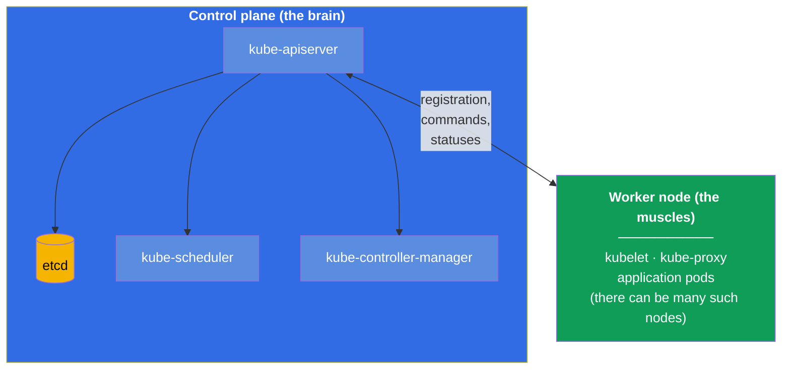
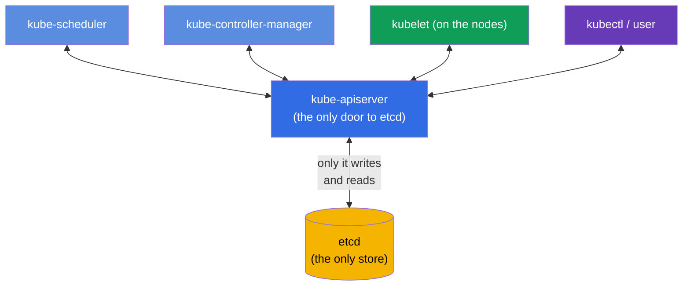
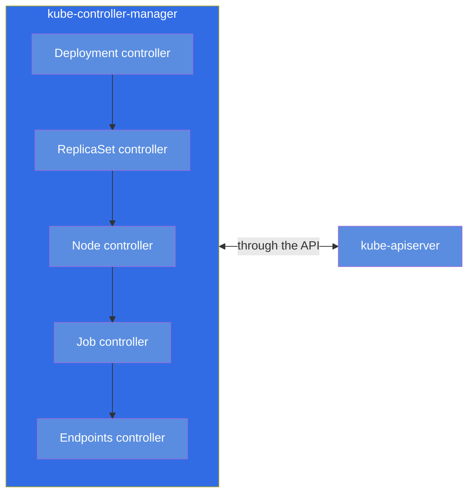
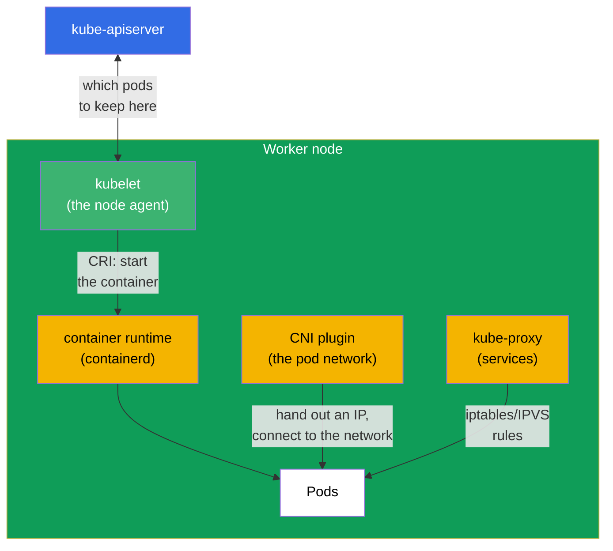
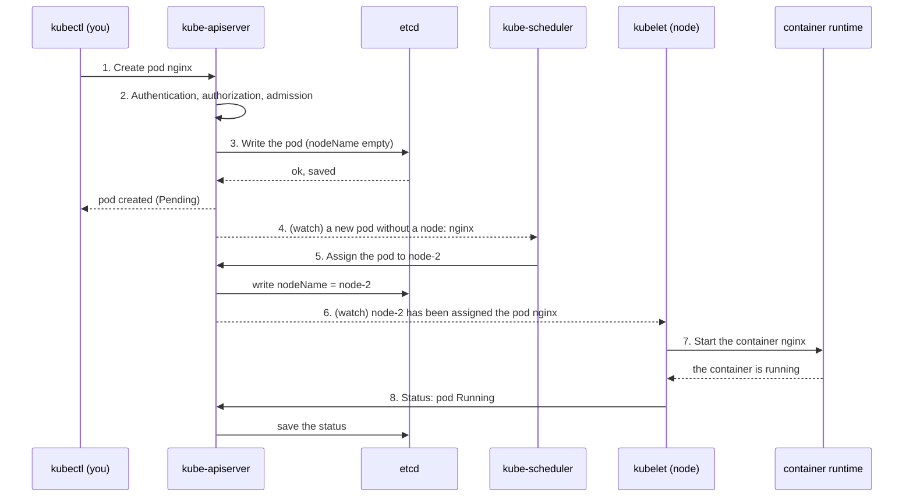
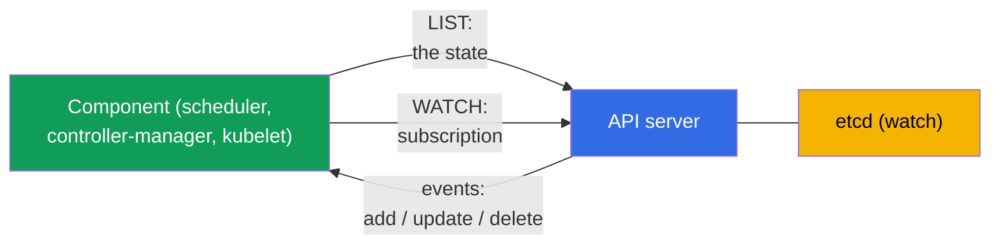
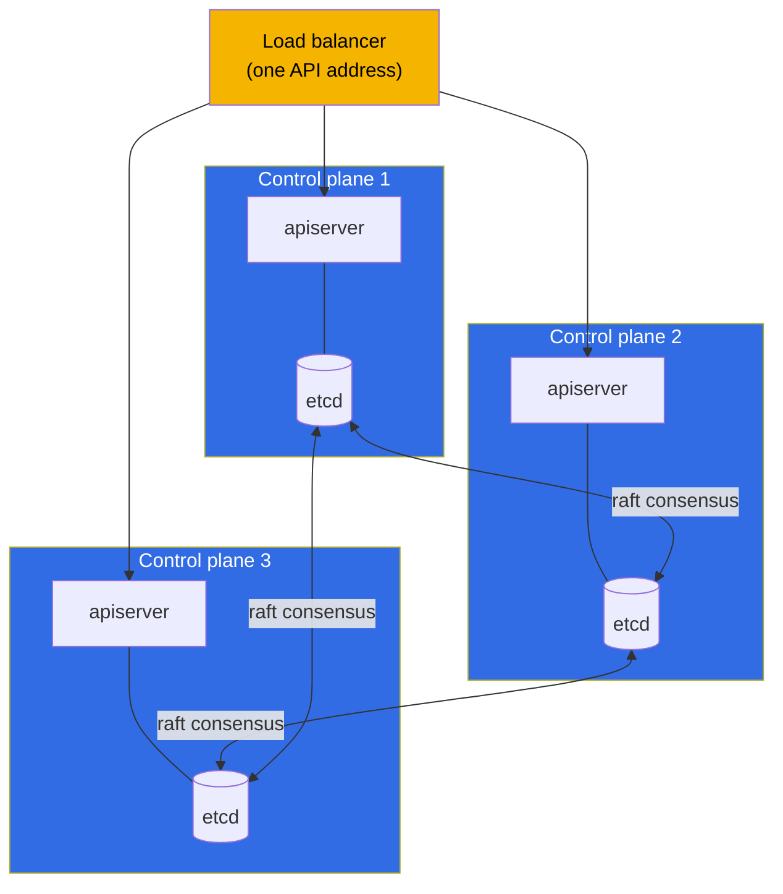

[Русская версия](ru.md) · [Versión en español](es.md) · [Version française](fr.md) · [Deutsche Version](de.md) · [ქართული ვერსია](ge.md) · [繁體中文版](tw.md) · [日本語版](jp.md)

# Chapter 2. Kubernetes architecture: the control plane and worker nodes

> **What comes next.** In the first chapter we understood that Kubernetes brings the
> actual state of the cluster to the desired one. Now let us figure out which parts it is
> assembled from and who exactly does that work. This is the foundation of the whole
> course: without understanding the architecture you can neither consciously administer a
> cluster (CKA) nor competently run applications in it (CKAD). And most importantly, the
> troubleshooting domain (30% of the CKA) rests entirely on knowing which component is
> responsible for what and where to look for it when it breaks. Practice with commands
> starts in chapter 3; here we build the model in your head.

## 2.1. The cluster from a bird's eye view

A Kubernetes cluster is a set of machines (physical or virtual) that are called
**nodes**. Nodes come in two types:

- **Control plane** - the "brain" of the cluster. It makes the decisions: what to run
  where, watches the state, stores all the data. It usually does not run user
  applications itself.
- **Worker nodes** - the "muscles" of the cluster. Your containers with applications run
  exactly on them. The diagram shows one worker node, but in a real cluster there are
  usually several (from a handful to hundreds) - they are all built the same way and are
  connected to the control plane through the API server.

All the arrows on the diagram converge on `kube-apiserver`. That is not a coincidence but
the main architectural rule of Kubernetes, which we will move on to right now.

> **Important (a frequent misconception).** **Only** `kube-apiserver` works with the
> `etcd` store directly. The other components (scheduler, controller-manager, kubelet,
> kube-proxy) **do not go** to etcd - they read and write the state through the API
> server. etcd is not a bus for exchange between components but a backend store behind the
> single "door" that is the apiserver. This follows directly from the official
> documentation: etcd is described as the store "for all API server data"
> ([Kubernetes Components](https://kubernetes.io/docs/concepts/overview/components/)), and
> in an HA topology an etcd member "communicates only with the kube-apiserver" of its node
> ([HA topology](https://kubernetes.io/docs/setup/production-environment/tools/kubeadm/ha-topology/)).
>
> **Then how does the scheduler learn about new pods?** Not from etcd. Components
> **subscribe** to changes through the API server - the **watch** mechanism (list-watch).
> When a pod is created, the apiserver saves it in etcd and immediately sends an event to
> the subscribers. The scheduler sees "a pod without `nodeName` has appeared", picks a node
> and writes the decision (binding) **back through the apiserver**; the apiserver saves it
> in etcd and notifies the kubelet of the right node - that one also learns about the pod
> through its watch. That is how all the exchange goes through the apiserver, while etcd
> stays behind it. We will look at the watch mechanism in more detail in chapter 3.
>
> **Where the myth came from.** It has a historical root: in early Kubernetes versions
> (before 1.0, 2014-2015) the components really did go to etcd directly - the kubelet read
> its pods from etcd, and the scheduler assigned them through etcd primitives
> (`CompareAndSwap`, a watch on a key). By release 1.0 the architecture was deliberately
> consolidated: the apiserver became the only "door" to etcd (centralized
> auth/RBAC/admission, decoupling of components, a single source of truth), and everyone
> switched to the API server watch. The myth also lives on because on many diagrams etcd
> is drawn in the center of the control plane - visually it looks like a "bus", although it
> is only a store behind the apiserver.

## 2.2. The main rule: everything communicates through the API server

Remember this principle before all the details: **Kubernetes components do not talk to
each other directly. They communicate only through `kube-apiserver`.** The scheduler does
not call the kubelet, a controller does not reach into etcd directly - everyone goes
through the API server, and the single store of state is etcd, also reachable only
through the API server.

Why was it done this way? It gives three big advantages:

- **A single point of control.** Authentication, authorization (RBAC), manifest
  validation (admission) - all in one place, at the entrance to the API server.
- **Loose coupling.** The components know nothing about each other, they can be changed
  and scaled independently. Any new controller simply "plugs into" the API.
- **A single source of truth.** All the state is in etcd, and only the API server touches
  it. There is no divergence between several stores.

The practical takeaway for troubleshooting: **if the API server goes down, the whole
cluster is paralyzed.** `kubectl` stops responding, the scheduler cannot assign pods, the
controllers cannot fix anything. That is why the first thing checked on serious problems
is whether the API server is alive and whether etcd under it is alive.

## 2.3. The control plane components one by one

Let us go through each component of the "brain": what it does, where it lives, how to
check it.

### kube-apiserver

The heart of the cluster and the single entry point. It accepts all requests (from
`kubectl`, from the components, from the controllers), validates them (authentication →
authorization → admission), reads and writes state in etcd. This is the only component
that works with etcd directly.

- **What it does:** accepts and validates all API requests, reads/writes etcd.
- **Where it lives:** a static pod, manifest `/etc/kubernetes/manifests/kube-apiserver.yaml`.
- **If it goes down:** the cluster is unmanageable, `kubectl` does not work.

### etcd

A distributed key-value store. It holds **all** the state of the cluster: every pod,
service, secret, config - all of these are records in etcd. If etcd is lost and there is
no backup, the cluster is lost. That is why a separate chapter 37 is devoted to backing up
etcd (and it is a frequent task on the CKA).

- **What it does:** stores all the state of the cluster (key-value).
- **Where it lives:** a static pod, manifest `/etc/kubernetes/manifests/etcd.yaml`.
- **If it goes down:** the API server cannot read/write state - the cluster is
  unmanageable.

### kube-scheduler

The scheduler. It looks at the pods that do **not have a node assigned** yet (`nodeName`
is empty) and decides which node to put each pod on. It takes into account resources (is
there enough CPU/memory), taints/tolerations, affinity, nodeSelector and other rules (all
of this is chapters 12-15). Important: the scheduler **only fills in the node** in the
pod's description. It does not start the pod itself - the kubelet does that.

- **What it does:** picks a node for new pods.
- **Where it lives:** a static pod, `/etc/kubernetes/manifests/kube-scheduler.yaml`.
- **If it goes down:** new pods "hang" in the `Pending` status, the already running ones
  keep working.

### kube-controller-manager

A single process inside which many **controllers** spin - those very reconciliation loops
from chapter 1. Examples: the deployment controller (creates a ReplicaSet), the replicaset
controller (keeps the required number of pods), the node controller (notices dead nodes),
the job controller and dozens of others. Each controller watches its own type of objects
and brings reality to the desired state.

- **What it does:** runs the controllers (reconciliation loops) for all types of objects.
- **Where it lives:** a static pod, `/etc/kubernetes/manifests/kube-controller-manager.yaml`.
- **If it goes down:** the cluster stops "self-healing" (it does not restore replicas,
  does not notice dead nodes).

### cloud-controller-manager (optional)

A separate controller manager for integration with a cloud: it creates cloud load
balancers for services of type LoadBalancer, labels nodes by zone, manages cloud disks. It
exists only in clusters running in a cloud (EKS, GKE, AKS).

## 2.4. The worker node components

Now the "muscles". These components run on every node (including the control plane, if
running pods is allowed on it too).

### kubelet

The main agent of the node. It communicates with the API server, gets the list of pods
that must run on this node, and makes sure they really do run: it commands the container
runtime to start/stop containers, watches their health (probes), reports the status back
to the API server. **The kubelet is not a pod but a system service** on the node itself.

- **What it does:** starts and watches the pods on its node, reports the status.
- **Where it lives:** a system service (`systemctl status kubelet`), not a pod.
- **If it goes down:** the node goes to `NotReady`, the pods on it are not managed.

### kube-proxy

It is responsible for the network magic of Kubernetes services at the node level. When
you create a Service, kube-proxy configures rules on every node (iptables or IPVS) that
redirect the traffic addressed to the service's virtual IP to the real pods. The balancing
here is at L4 (connections). In detail - in chapters 7 and 31.

An important point: **the traffic itself does not go through kube-proxy**. It does not
stand on the packets' path, it only *configures* the kernel rules (iptables/IPVS), along
which the traffic then goes **directly**, already without kube-proxy taking part. That is,
kube-proxy is a "control plane" for the service rules on the node, not a "data plane".
Hence an important consequence for operations:

- If kube-proxy **goes down**, the already configured rules stay in the kernel and
  **keep working**: the existing services are reachable, the traffic from the pods of this
  node is not interrupted. Only the **updating** of the rules breaks - new
  Service/Endpoints are not added, deleted ones are not removed, until kube-proxy comes up
  again.
- That is why a **restart or a version upgrade** of kube-proxy on a node passes unnoticed
  for the traffic: while the new pod is starting, the old rules apply, and connections are
  not dropped.

- **What it does:** configures the iptables/IPVS rules for Service on the node (the
  traffic goes past it).
- **Where it lives:** usually a DaemonSet in the `kube-system` namespace
  (`kubectl get ds -n kube-system`).
- **If it goes down:** the existing rules work, the services are reachable; only changes
  stop being applied (new/deleted Service and Endpoints) until it is restored.

> **A nuance.** In modern clusters kube-proxy may be absent: some CNIs (for example,
> Cilium in kube-proxy replacement mode) take this work on themselves through eBPF. But
> for the exam we keep the classic scheme with kube-proxy in mind.

### Container runtime

The thing that actually starts containers. Kubernetes does not start containers itself -
it delegates this to the runtime through the standard **CRI** (Container Runtime
Interface). Popular runtimes: **containerd** (currently the main choice), **CRI-O**.
Docker as a runtime has been removed from Kubernetes (dockershim was removed in 1.24).
Containers on a node are diagnosed with the `crictl` utility.

- **What it does:** actually starts and stops containers (on the kubelet's command).
- **Where it lives:** a system service on the node (`containerd`), diagnostics through
  `crictl`.
- **If it goes down:** the kubelet cannot start containers, the pods on the node do not
  start.

### The CNI plugin

It provides the pod network: it hands out an IP address to every pod and links pods across
nodes so that any pod can reach any other one by IP. It is implemented through the **CNI**
(Container Network Interface) standard. Popular plugins: **Calico**, **Cilium**,
**Flannel**, **Weave**. In detail about networking - in chapter 30.

## 2.5. What happens when you create a pod

Let us put it all together on a live example. You ran `kubectl run nginx --image=nginx`.
Here is what happens inside the cluster, step by step:

Trace the logic: **nobody talks to anybody directly**. The scheduler learned about the pod
not from `kubectl` and not by polling somebody - it is **subscribed** to the API server
through watch, and the apiserver **itself** sent it the event "a pod without a node has
appeared". The kubelet learned about its pod the same way - through a watch on the API
server (the apiserver notified it when the pod was assigned to this node). Every step is a
write or a read through the single door, and the notifications go as watch events (details
- in 2.6). That is exactly how the whole loosely coupled architecture of Kubernetes works,
and it is exactly this understanding that lies at the base of diagnostics: knowing the
chain, you know where to look for the breakage.

## 2.6. How components watch for changes: watch and optimistic locking

Since everything communicates only through the API server (2.2), a question arises: how do
the scheduler or a controller learn that a new pod has appeared - do they poll the API in a
loop? No. The mechanism is more efficient and lies at the base of the whole reactivity of
Kubernetes.

- **list-watch.** The component first does a **LIST** (takes the current state), then
  opens a **WATCH** - a long-lived stream over which the API server sends only the
  **changes** (an object created/modified/deleted). There is no polling in a loop - this is
  cheap and almost instant. That is how the scheduler learns about `Pending` pods, and the
  kubelet - about the pods for its node.
- **informer.** Controllers use the **informer** library - it is a local cache of objects
  kept up to date through watch. The controller reacts to events from the cache instead of
  hitting the API on every little thing - that is why controllers scale.
- **resourceVersion.** Every object has a version (`metadata.resourceVersion`). A watch
  can be "resumed" from a certain version after a disconnect - without losing changes.
- **Optimistic locking.** When updating an object, the client sends its
  `resourceVersion`. If the object has already changed (the version does not match), the
  API server rejects the write with **409 Conflict** - the client re-reads the object and
  retries. That way two writes do not overwrite each other. That is exactly why controllers
  and `kubectl apply` are able to retry operations instead of breaking on races.

> **How watch works at the network level.** This is not multicast and not polling but an
> ordinary **unicast connection over TCP/TLS over HTTP** (HTTP/2 by default). The client
> opens one long-lived request (`GET ...?watch=true`), and the API server **does not close
> the response** and **streams** events into it - `WatchEvent` objects
> (`ADDED`/`MODIFIED`/`DELETED`/`BOOKMARK`) line by line. Every client has its own
> connection: the apiserver itself "watches" etcd, keeps the changes in memory
> (**watch cache**) and **sends** them to all connected clients (fan-out), taking RBAC and
> selectors into account - that is why multicast is not needed (it would give neither
> TLS/authorization, nor reliability, nor filtering per client). On a disconnect the client
> reopens the watch from the saved `resourceVersion` and does not lose changes, while
> periodic `BOOKMARK` events move that version forward.

This is the technical inside of the **reconciliation loop** (chapter 1): through watch the
controllers see the difference between the desired and the actual state and eliminate it,
while optimistic locking ensures correctness with many controllers working in parallel.

## 2.7. Where to look for which component (a map for troubleshooting)

This table is worth learning by heart - on the CKA it saves a ton of time in the
troubleshooting domain.

| Component | Type | Where to look / how to check |
|-----------|-----|-----------------------------|
| kube-apiserver | static pod | `/etc/kubernetes/manifests/kube-apiserver.yaml`; `kubectl get pods -n kube-system` |
| etcd | static pod | `/etc/kubernetes/manifests/etcd.yaml` |
| kube-scheduler | static pod | `/etc/kubernetes/manifests/kube-scheduler.yaml` |
| kube-controller-manager | static pod | `/etc/kubernetes/manifests/kube-controller-manager.yaml` |
| kubelet | system service | `systemctl status kubelet`; `journalctl -u kubelet` |
| kube-proxy | DaemonSet | `kubectl get ds -n kube-system` |
| CoreDNS | Deployment | `kubectl get deploy -n kube-system` |
| container runtime | system service | `systemctl status containerd`; `crictl ps` |
| CNI | plugin | `ls /etc/cni/net.d/`; the CNI pods in `kube-system` |

The key difference that you have to keep clearly in mind:

- **The control plane components (apiserver, etcd, scheduler, controller-manager)** in a
  kubeadm cluster run as **static pods** - their manifests lie in
  `/etc/kubernetes/manifests/`, and the kubelet brings them up locally, even before the API
  server starts working. You edit the file - the kubelet automatically recreates the pod.
- **The kubelet and the container runtime** are **system services** (not pods), managed
  through `systemctl` and logged into `journalctl`.

We will talk about static pods in detail in chapter 15, and about the kubeadm installation
- in chapter 35.

## 2.8. High availability of the control plane

In a training cluster the control plane is usually a single one. In production that is not
acceptable: if the only control plane dies, the cluster becomes unmanageable. That is why
in real clusters the control plane is made in several instances (usually 3), and a load
balancer is put in front of their API servers.

A subtlety about etcd: the etcd nodes form a cluster and agree among themselves over the
**raft** consensus protocol. Making decisions requires a quorum (a majority), so the number
of nodes is taken to be **odd** (3, 5). Three nodes survive the loss of one, five - of two.
The API servers are equal in rights here - the balancer simply spreads the requests among
them.

## 2.9. How this is applied in production

Architecture theory is not an abstraction but what real decisions stand on.

- **Managed clusters (EKS/GKE/AKS).** In a cloud the control plane is not given to you -
  the provider manages it, you only get the API server endpoint and pay for the
  management. You are responsible only for the worker nodes. This removes the pain of
  maintaining etcd and upgrading the control plane, but it also deprives you of access to
  the control plane static pods - many "CKA tasks" are simply unavailable there. That is
  why to prepare for the CKA you need a self-managed cluster (kubeadm), not EKS.
- **Separation of node roles.** In production the control plane is closed off with the
  taint `node-role.kubernetes.io/control-plane:NoSchedule`, so that user applications do
  not land there and do not interfere with the work of the "brain". Applications live only
  on the worker nodes.
- **etcd is the most valuable asset.** Experienced teams back up etcd on a schedule and
  store the snapshots separately from the cluster. Losing etcd without a backup = losing
  the cluster. Separately they watch the disk latency under etcd - it is very sensitive to
  it.
- **HA as the norm.** Any production cluster is at least 3 control planes behind a
  balancer and an odd number of etcd nodes. A single control plane is acceptable only in
  dev/training environments.
- **Incident diagnostics.** The understanding that "everything goes through the API
  server, the state is in etcd" is the first thing an on-call engineer applies: `kubectl`
  does not respond → we look at the API server and etcd; pods hang in Pending → we look at
  the scheduler; a node is NotReady → we look at the kubelet and the runtime on it.

## 2.10. Mini-glossary

- **Node** - a machine (a VM or a physical one) that is part of the cluster.
- **Control plane** - the managing layer of the cluster (the brain): apiserver, etcd,
  scheduler, controller-manager.
- **Worker node** - a working node on which the application pods run.
- **kube-apiserver** - the single entry point through which all requests go; the only one
  that writes to etcd.
- **etcd** - a distributed key-value store of all the cluster state.
- **kube-scheduler** - assigns pods to nodes.
- **kube-controller-manager** - a set of controllers (reconciliation loops).
- **kubelet** - the node agent, starts and controls the pods; a system service.
- **kube-proxy** - implements services through iptables/IPVS on the node.
- **container runtime** - the container runtime environment (containerd), communicates
  over CRI.
- **CNI** - the interface and plugin of the pod network (Calico, Cilium and others).
- **Static pod** - a pod brought up by the kubelet directly from a manifest in
  `/etc/kubernetes/manifests/`, without the scheduler taking part.
- **raft** - the consensus protocol over which the etcd nodes agree.
- **list-watch** - the pattern for watching changes: LIST + a WATCH stream (without
  polling).
- **informer** - a controller's local cache of objects, synchronized through watch.
- **resourceVersion** - the version of an object; a watch resumes from it, the basis of
  optimistic locking.
- **optimistic locking** - a write with a stale version is rejected (409 Conflict) → retry.

## 2.11. Chapter summary

- A cluster = the control plane (the brain) + worker nodes (the muscles). The application
  pods live on the worker nodes.
- The main rule: the components do not communicate directly, only through
  `kube-apiserver`; the only store of state is etcd, and only the API server touches it.
- Control plane: apiserver (the single door), etcd (the store), scheduler (picking a
  node), controller-manager (reconciliation loops); in a cloud - also
  cloud-controller-manager.
- Worker node: kubelet (the agent, a system service), kube-proxy (services), container
  runtime (starting containers over CRI), CNI (the pod network).
- Creating a pod is a chain of reads/writes through the API server: apiserver → etcd →
  the scheduler assigns a node → the kubelet starts it through the runtime → the status
  back.
- The components watch for changes through **list-watch** (without polling), controllers
  use the informer cache; parallel writes are protected by optimistic locking
  (resourceVersion → 409 Conflict → retry).
- For troubleshooting, learn where each component is: the control plane - static pods in
  `/etc/kubernetes/manifests/`, the kubelet and the runtime - system services
  (`systemctl`, `journalctl`, `crictl`).
- In production the control plane is made HA (3 nodes behind a balancer, an odd number of
  etcd nodes for the raft quorum), and etcd is carefully backed up.

## 2.12. How this helps: on the exam and in real work

**On the exam.** Direct tasks: "fix the control plane" (CKA, troubleshooting 30%) - you
need to know that the manifests are in `/etc/kubernetes/manifests/` and how to read the
components' logs; "a pod hangs in Pending" - immediately think about the scheduler; "a node
is NotReady" - about the kubelet and the runtime. Without the map of components from
section 2.7 these tasks cannot be solved in the allotted time. For the CKAD architecture is
asked about less, but the understanding that "pods are started by the kubelet, the network
is given by CNI, services - by kube-proxy" is needed for debugging applications.

**In real work.** This is the model by which an engineer localizes any incident: an
unmanageable cluster → apiserver/etcd; pods are not scheduled → the scheduler; a specific
node fell off → its kubelet/runtime; the traffic does not reach a service → kube-proxy/CNI.
The same skeleton of knowledge also determines architectural decisions: how many control
planes to keep, where to back up etcd, why applications are not put on the control plane.

## 2.13. Self-check questions

1. Why is it said that all Kubernetes components communicate only through the API server?
   What does that give?
2. Which single component works with etcd directly and why is that important?
3. What will happen to new and to already running pods if kube-scheduler goes down?
4. How does the way the control plane components are run differ from the kubelet and the
   container runtime? Where do you look for either kind?
5. Describe step by step what happens in the cluster after `kubectl run nginx --image=nginx`.
6. Why is the number of etcd nodes made odd and what is a quorum?
7. Why is a managed cluster like EKS not suitable for preparing for the CKA?
8. How do the components learn about changes without polling the API (list-watch)? What is
   an informer?
9. What is optimistic locking and what is `resourceVersion` needed for when writing?

## Practice

We will start hands-on work with a cluster in the next chapter, where we will master
`kubectl` and both approaches to managing objects. The cluster layout from this chapter you
will see live a little later: in a ready cluster you will be able to look into
`/etc/kubernetes/manifests/` and check the statuses of the control plane components, while
building a cluster from scratch with your own hands (`kubeadm init` + CNI + `join`) is in
chapter 35, when we cover the installation.

---
[Contents](../README.md) · [Chapter 1](../01/README.md) · [Chapter 3](../03/README.md)
