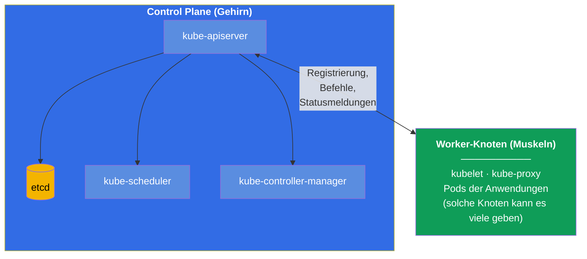
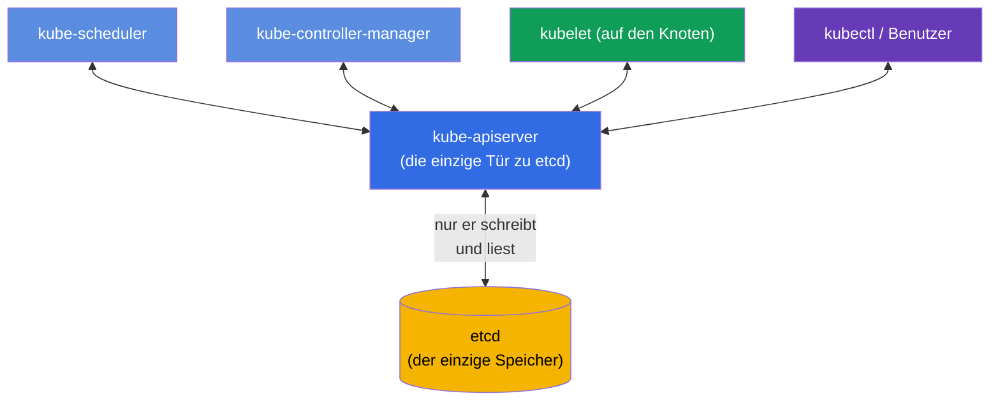
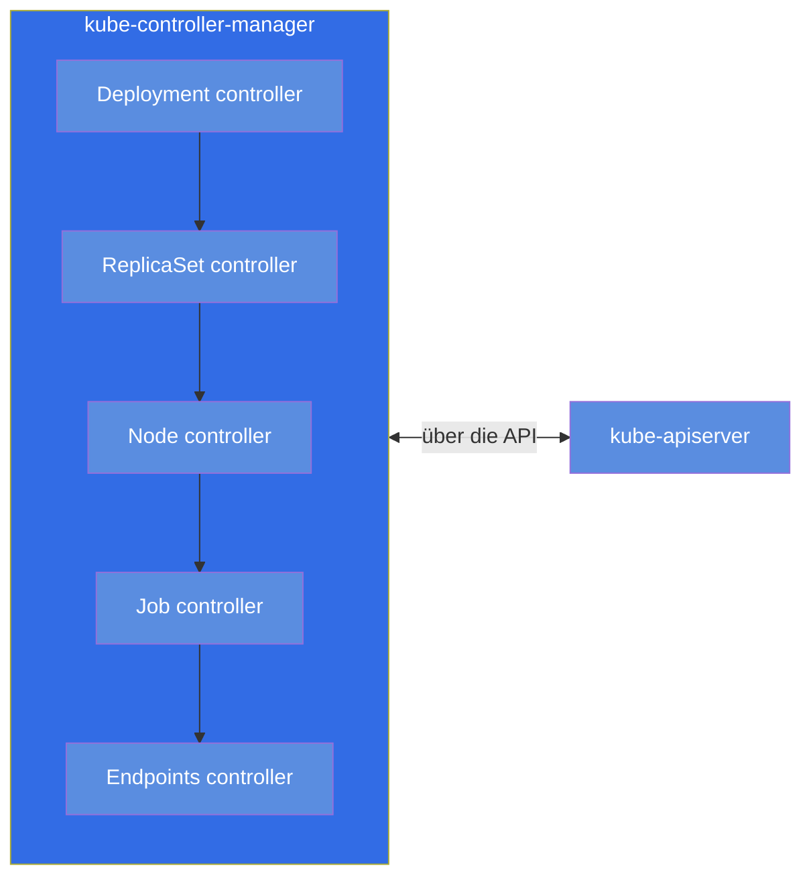
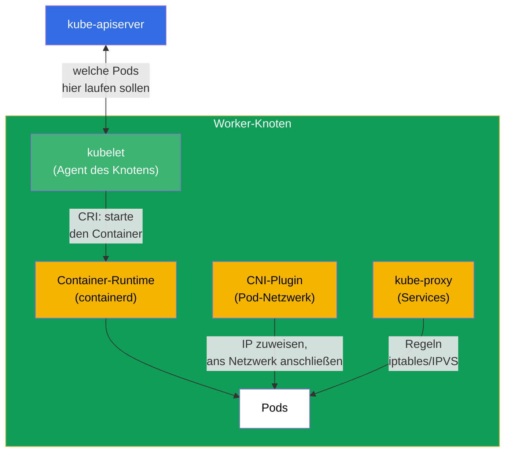
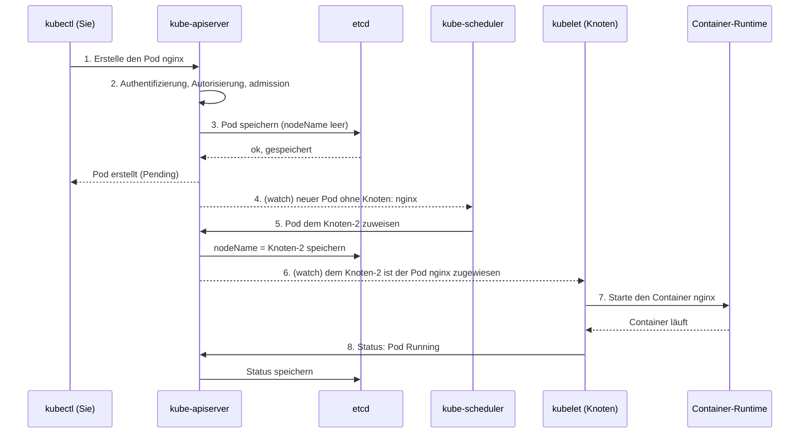
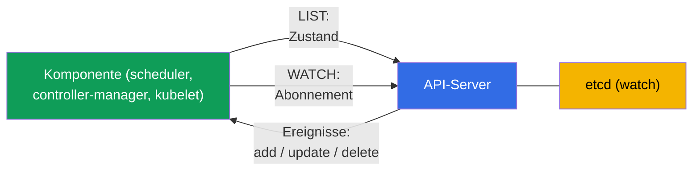
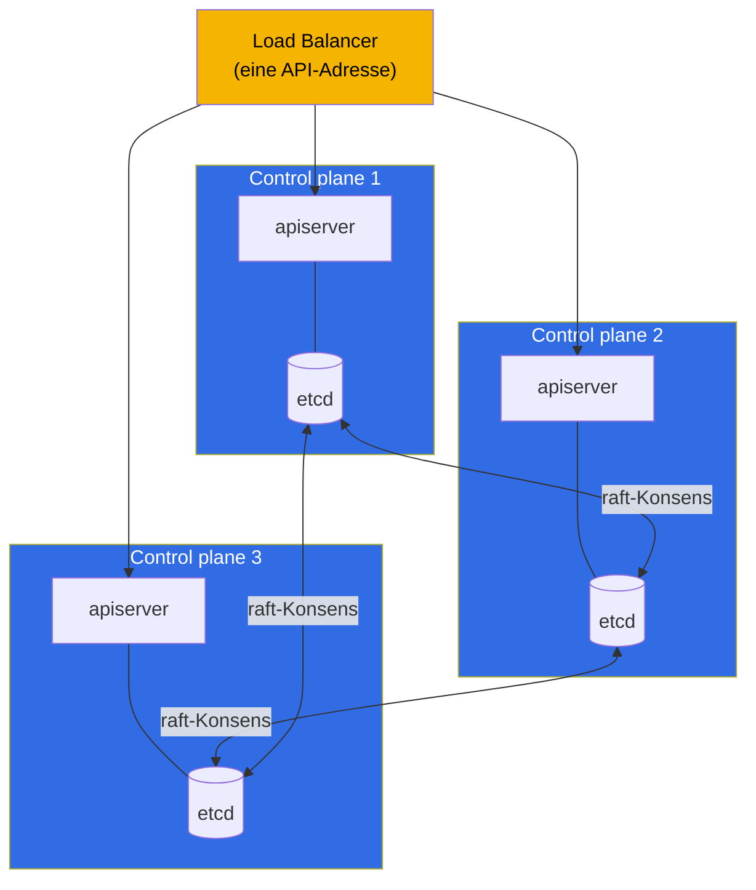

[Русская версия](ru.md) · [Eng version](README.md) · [Versión en español](es.md) · [Version française](fr.md) · [ქართული ვერსია](ge.md) · [繁體中文版](tw.md) · [日本語版](jp.md)

# Kapitel 2. Architektur von Kubernetes: Control Plane und Worker-Knoten

> **Was kommt.** Im ersten Kapitel haben wir verstanden, dass Kubernetes den realen
> Zustand des Clusters an den gewünschten heranführt. Jetzt klären wir, aus welchen
> Teilen es zusammengesetzt ist und wer genau diese Arbeit erledigt. Das ist das
> Fundament des ganzen Kurses: ohne Verständnis der Architektur kann man einen Cluster
> weder bewusst administrieren (CKA) noch Anwendungen darin sauber betreiben (CKAD). Und
> vor allem - die Domäne Troubleshooting (30% CKA) steht vollständig auf dem Wissen,
> welche Komponente für was verantwortlich ist und wo man sie sucht, wenn sie kaputt ist.
> Die Praxis mit Befehlen beginnt in Kapitel 3; hier bauen wir das Modell im Kopf.

## 2.1. Der Cluster aus der Vogelperspektive

Ein Kubernetes-Cluster ist eine Menge von Maschinen (physisch oder virtuell), die
**Knoten** (node) genannt werden. Die Knoten teilen sich in zwei Typen:

- **Control Plane (Steuerungsschicht)** - das „Gehirn“ des Clusters. Sie trifft
  Entscheidungen: was wo gestartet wird, überwacht den Zustand, speichert alle Daten.
  Nutzeranwendungen führt sie in der Regel selbst nicht aus.
- **Worker-Knoten (Arbeitsknoten)** - die „Muskeln“ des Clusters. Genau auf ihnen laufen
  Ihre Container mit den Anwendungen. Im Diagramm ist ein Worker-Knoten gezeigt, aber in
  einem echten Cluster sind es meist mehrere (von einigen bis zu Hunderten) - alle sind
  gleich aufgebaut und über den API-Server an die Control Plane angebunden.

Alle Pfeile im Diagramm laufen bei `kube-apiserver` zusammen. Das ist kein Zufall,
sondern die zentrale Architekturregel von Kubernetes, zu der wir gleich kommen.

> **Wichtig (häufiger Irrtum).** Mit dem Speicher `etcd` arbeitet **nur**
> `kube-apiserver` direkt. Die übrigen Komponenten (scheduler, controller-manager,
> kubelet, kube-proxy) gehen **nicht** zu etcd - sie lesen und schreiben den Zustand über
> den API-Server. etcd ist kein Austauschbus zwischen den Komponenten, sondern ein
> Backend-Speicher hinter der einzigen „Tür“ in Gestalt des apiserver. Das folgt direkt
> aus der offiziellen Dokumentation: etcd ist als Speicher „für alle Daten des
> API-Servers“ beschrieben
> ([Kubernetes Components](https://kubernetes.io/docs/concepts/overview/components/)), und
> in der HA-Topologie kommuniziert ein etcd-Mitglied „nur mit dem kube-apiserver“ seines
> Knotens
> ([HA topology](https://kubernetes.io/docs/setup/production-environment/tools/kubeadm/ha-topology/)).
>
> **Wie erfährt der scheduler dann von neuen Pods?** Nicht aus etcd. Die Komponenten
> **abonnieren** Änderungen über den API-Server - der Mechanismus heißt **watch**
> (list-watch). Wenn ein Pod erstellt wird, speichert der apiserver ihn in etcd und
> verteilt sofort ein Ereignis an die Abonnenten. Der scheduler sieht „es ist ein Pod ohne
> `nodeName` aufgetaucht“, wählt einen Knoten und schreibt die Entscheidung (binding)
> **zurück über den apiserver**; der apiserver speichert das in etcd und benachrichtigt
> das kubelet des passenden Knotens - auch dieses erfährt vom Pod über seinen watch. So
> läuft der gesamte Austausch über den apiserver, und etcd bleibt dahinter. Den
> watch-Mechanismus behandeln wir ausführlicher in Kapitel 3.
>
> **Woher der Mythos kommt.** Er hat eine historische Wurzel: in frühen Versionen von
> Kubernetes (vor 1.0, 2014-2015) gingen die Komponenten tatsächlich direkt zu etcd - das
> kubelet las seine Pods aus etcd, und der scheduler wies sie über etcd-Primitive zu
> (`CompareAndSwap`, watch auf einen Key). Zum Release 1.0 wurde die Architektur bewusst
> konsolidiert: der apiserver wurde die einzige „Tür“ zu etcd (zentralisierte
> auth/RBAC/admission, Entkopplung der Komponenten, eine einzige Quelle der Wahrheit), und
> alle wechselten auf den watch des API-Servers. Der Mythos lebt auch deshalb, weil etcd
> auf vielen Diagrammen in der Mitte der Control Plane gezeichnet wird - visuell ähnelt
> das einem „Bus“, obwohl es nur ein Speicher hinter dem apiserver ist.

## 2.2. Die Hauptregel: alles kommuniziert über den API-Server

Merken Sie sich dieses Prinzip vor allen Details: **die Komponenten von Kubernetes
sprechen nicht direkt miteinander. Sie kommunizieren nur über `kube-apiserver`.** Der
scheduler ruft nicht das kubelet an, ein Controller greift nicht direkt in etcd - alle
gehen über den API-Server, und der einzige Zustandsspeicher ist etcd, ebenfalls nur über
den API-Server erreichbar.

Warum ist das so gemacht? Es bringt drei große Vorteile:

- **Ein einziger Kontrollpunkt.** Authentifizierung, Autorisierung (RBAC), Prüfung der
  Manifeste (admission) - alles an einer Stelle, am Eingang des API-Servers.
- **Lose Kopplung.** Die Komponenten wissen nichts voneinander, man kann sie unabhängig
  ändern und skalieren. Jeder neue Controller „steckt sich“ einfach an die API.
- **Eine einzige Quelle der Wahrheit.** Der ganze Zustand liegt in etcd, und nur der
  API-Server berührt ihn. Es gibt keine Desynchronisation zwischen mehreren Speichern.

Die praktische Folgerung für das Troubleshooting: **fällt der API-Server aus, ist der
ganze Cluster gelähmt.** `kubectl` antwortet nicht mehr, der scheduler kann keine Pods
zuweisen, die Controller können nichts korrigieren. Deshalb prüft man bei ernsten
Problemen zuerst, ob der API-Server lebt und ob das etcd darunter lebt.

## 2.3. Die Komponenten der Control Plane im Einzelnen

Nehmen wir jede Komponente des „Gehirns“ durch: was sie tut, wo sie liegt, wie man sie
prüft.

### kube-apiserver

Das Herz des Clusters und der einzige Eingangspunkt. Nimmt alle Anfragen an (von
`kubectl`, von den Komponenten, von den Controllern), prüft sie (Authentifizierung →
Autorisierung → admission), liest und schreibt den Zustand in etcd. Das ist die einzige
Komponente, die direkt mit etcd arbeitet.

- **Was sie tut:** nimmt alle API-Anfragen an und validiert sie, liest/schreibt etcd.
- **Wo sie lebt:** statischer Pod, Manifest `/etc/kubernetes/manifests/kube-apiserver.yaml`.
- **Wenn sie ausfällt:** der Cluster ist nicht steuerbar, `kubectl` funktioniert nicht.

### etcd

Ein verteilter Key-Value-Speicher. In ihm liegt **der gesamte** Zustand des Clusters:
jeder Pod, Service, Secret, jede Konfiguration - all das sind Einträge in etcd. Ist etcd
verloren und es gibt kein Backup, ist der Cluster verloren. Deshalb ist dem Backup von
etcd ein eigenes Kapitel 37 gewidmet (und es ist eine häufige Aufgabe bei CKA).

- **Was es tut:** speichert den gesamten Zustand des Clusters (key-value).
- **Wo es lebt:** statischer Pod, Manifest `/etc/kubernetes/manifests/etcd.yaml`.
- **Wenn es ausfällt:** der API-Server kann den Zustand nicht lesen/schreiben - der
  Cluster ist nicht steuerbar.

### kube-scheduler

Der Planer. Schaut auf die Pods, denen noch **kein Knoten zugewiesen** ist (`nodeName`
ist leer), und entscheidet, auf welchen Knoten jeder Pod kommt. Er berücksichtigt
Ressourcen (reichen CPU/Speicher), taints/tolerations, affinity, nodeSelector und weitere
Regeln (das alles sind die Kapitel 12-15). Wichtig: der scheduler **trägt nur den Knoten
ein** in die Beschreibung des Pods. Den Pod selbst startet er nicht - das macht das
kubelet.

- **Was er tut:** wählt einen Knoten für neue Pods.
- **Wo er lebt:** statischer Pod, `/etc/kubernetes/manifests/kube-scheduler.yaml`.
- **Wenn er ausfällt:** neue Pods „hängen“ im Status `Pending`, die schon laufenden
  arbeiten weiter.

### kube-controller-manager

Ein einzelner Prozess, in dem eine Vielzahl von **Controllern** läuft - genau jene
Abgleichschleifen aus Kapitel 1. Beispiele: der Deployment-Controller (erstellt
ReplicaSet), der ReplicaSet-Controller (hält die nötige Anzahl Pods), der Node-Controller
(bemerkt gestorbene Knoten), der Job-Controller und Dutzende weitere. Jeder Controller
überwacht seinen Objekttyp und führt die Realität an das Gewünschte heran.

- **Was er tut:** führt die Controller (Abgleichschleifen) für alle Objekttypen aus.
- **Wo er lebt:** statischer Pod, `/etc/kubernetes/manifests/kube-controller-manager.yaml`.
- **Wenn er ausfällt:** der Cluster hört auf, sich „selbst zu heilen“ (stellt Repliken
  nicht wieder her, bemerkt tote Knoten nicht).

### cloud-controller-manager (optional)

Ein separater Controller-Manager für die Integration mit der Cloud: erstellt
Cloud-Loadbalancer für Services des Typs LoadBalancer, markiert Knoten nach Zonen,
verwaltet Cloud-Festplatten. Gibt es nur in Clustern, die in der Cloud laufen (EKS, GKE,
AKS).

## 2.4. Die Komponenten eines Worker-Knotens

Nun die „Muskeln“. Auf jedem Knoten (auch auf der Control Plane, wenn dort ebenfalls das
Starten von Pods erlaubt ist) arbeiten diese Komponenten.

### kubelet

Der Hauptagent des Knotens. Kommuniziert mit dem API-Server, erhält die Liste der Pods,
die auf diesem Knoten laufen sollen, und achtet darauf, dass sie tatsächlich laufen: es
befiehlt der Container-Runtime, Container zu starten/zu stoppen, überwacht deren Gesundheit
(Probes), meldet den Status zurück an den API-Server. **Das kubelet ist kein Pod, sondern
ein Systemdienst** auf dem Knoten selbst.

- **Was es tut:** startet und überwacht die Pods auf seinem Knoten, meldet den Status.
- **Wo es lebt:** Systemdienst (`systemctl status kubelet`), kein Pod.
- **Wenn es ausfällt:** der Knoten geht in `NotReady`, die Pods auf ihm werden nicht
  gesteuert.

### kube-proxy

Verantwortlich für die Netzwerkmagie der Kubernetes-Services auf Knotenebene. Wenn Sie
einen Service erstellen, richtet kube-proxy auf jedem Knoten Regeln ein (iptables oder
IPVS), die den an die virtuelle IP des Service adressierten Verkehr auf die realen Pods
umleiten. Das Load Balancing ist hier auf L4-Ebene (Verbindungen). Ausführlich - in den
Kapiteln 7 und 31.

Ein wichtiger Punkt: **der Verkehr selbst geht nicht durch kube-proxy**. Es steht nicht im
Weg der Pakete, sondern *konfiguriert* nur die Regeln des Kernels (iptables/IPVS), nach
denen der Verkehr danach **direkt** fließt, schon ohne Beteiligung von kube-proxy. Das
heißt, kube-proxy ist die „Control Plane“ für die Service-Regeln auf dem Knoten und nicht
die „Data Plane“. Daraus folgt etwas Wichtiges für den Betrieb:

- Wenn kube-proxy **ausfällt**, bleiben die bereits eingerichteten Regeln im Kernel und
  **arbeiten weiter**: bestehende Services sind erreichbar, der Verkehr von den Pods
  dieses Knotens wird nicht unterbrochen. Kaputt geht nur die **Aktualisierung** der
  Regeln - neue Service/Endpoints werden nicht hinzugefügt, gelöschte nicht entfernt, bis
  kube-proxy wieder hochkommt.
- Deshalb läuft ein **Neustart oder ein Versions-Update** von kube-proxy auf dem Knoten
  für den Verkehr unmerklich ab: während der neue Pod startet, gelten die alten Regeln,
  und Verbindungen reißen nicht ab.

- **Was es tut:** richtet die iptables/IPVS-Regeln für Service auf dem Knoten ein (der
  Verkehr fließt an ihm vorbei).
- **Wo es lebt:** üblicherweise ein DaemonSet im Namespace `kube-system`
  (`kubectl get ds -n kube-system`).
- **Wenn es ausfällt:** die bestehenden Regeln arbeiten, die Services sind erreichbar;
  es werden nur Änderungen (neue/gelöschte Service und Endpoints) nicht mehr angewendet,
  bis es wiederhergestellt ist.

> **Feinheit.** In modernen Clustern kann kube-proxy fehlen: einige CNI (zum Beispiel
> Cilium im Modus kube-proxy replacement) übernehmen diese Arbeit selbst über eBPF. Für
> die Prüfung behalten wir aber das klassische Schema mit kube-proxy im Kopf.

### Container runtime

Genau das, was die Container startet. Kubernetes startet Container nicht selbst - es
delegiert das an die Laufzeitumgebung über die Standardschnittstelle **CRI** (Container
Runtime Interface). Verbreitete Umgebungen: **containerd** (aktuell die Hauptwahl),
**CRI-O**. Docker als Laufzeitumgebung wurde aus Kubernetes entfernt (dockershim wurde in
1.24 gelöscht). Container auf dem Knoten diagnostiziert man mit dem Werkzeug `crictl`.

- **Was sie tut:** startet und stoppt die Container tatsächlich (auf Befehl des kubelet).
- **Wo sie lebt:** Systemdienst auf dem Knoten (`containerd`), Diagnose über `crictl`.
- **Wenn sie ausfällt:** das kubelet kann keine Container starten, die Pods auf dem Knoten
  starten nicht.

### CNI-Plugin

Stellt das Pod-Netzwerk bereit: gibt jedem Pod eine IP-Adresse und verbindet die Pods über
die Knoten hinweg so, dass jeder Pod jeden anderen über IP erreichen kann. Umgesetzt wird
das über den Standard **CNI** (Container Network Interface). Verbreitete Plugins:
**Calico**, **Cilium**, **Flannel**, **Weave**. Ausführlich zum Netzwerk - in Kapitel 30.

## 2.5. Was passiert, wenn Sie einen Pod erstellen

Fügen wir alles an einem lebendigen Beispiel zusammen. Sie haben
`kubectl run nginx --image=nginx` ausgeführt. Was im Cluster Schritt für Schritt passiert:

Verfolgen Sie die Logik: **niemand spricht mit niemandem direkt**. Der scheduler hat vom
Pod nicht von `kubectl` erfahren und auch nicht, indem er jemanden abgefragt hat - er ist
per watch beim API-Server **abonniert**, und der apiserver hat ihm **selbst** das Ereignis
„es ist ein Pod ohne Knoten aufgetaucht“ geschickt. Das kubelet hat von seinem Pod genauso
erfahren - über den watch am API-Server (der apiserver hat es benachrichtigt, als der Pod
diesem Knoten zugewiesen wurde). Jeder Schritt ist ein Schreiben oder Lesen über die
einzige Tür, und die Benachrichtigungen laufen als watch-Ereignisse (Details - in 2.6).
Genau so arbeitet die ganze lose gekoppelte Architektur von Kubernetes, und genau dieses
Verständnis liegt der Diagnose zugrunde: kennt man die Kette, weiß man, wo man den Fehler
sucht.

## 2.6. Wie die Komponenten Änderungen verfolgen: watch und optimistisches Locking

Da alles nur über den API-Server kommuniziert (2.2), stellt sich die Frage: wie erfahren
der scheduler oder ein Controller, dass ein neuer Pod aufgetaucht ist - fragen sie die API
in einer Schleife ab? Nein. Der Mechanismus ist effizienter und liegt der ganzen
Reaktivität von Kubernetes zugrunde.

- **list-watch.** Die Komponente macht zuerst ein **LIST** (holt den aktuellen Zustand),
  dann öffnet sie einen **WATCH** - einen langlebigen Stream, über den der API-Server nur
  die **Änderungen** schickt (Objekt erstellt/geändert/gelöscht). Es gibt kein Abfragen in
  einer Schleife - das ist günstig und fast augenblicklich. So erfährt der scheduler von
  den `Pending`-Pods und das kubelet von den Pods für seinen Knoten.
- **informer.** Die Controller nutzen die Bibliothek **informer** - einen lokalen
  Objekt-Cache, der über watch aktuell gehalten wird. Der Controller reagiert auf
  Ereignisse aus dem Cache und behelligt nicht bei jeder Kleinigkeit die API - deshalb
  skalieren die Controller.
- **resourceVersion.** Jedes Objekt hat eine Version (`metadata.resourceVersion`). Ein
  watch lässt sich nach einem Abbruch von einer bestimmten Version aus „fortsetzen“ - ohne
  Änderungen zu verlieren.
- **Optimistisches Locking.** Beim Aktualisieren eines Objekts schickt der Client seine
  `resourceVersion` mit. Hat sich das Objekt bereits geändert (die Version passt nicht),
  weist der API-Server das Schreiben mit **409 Conflict** ab - der Client liest das Objekt
  neu und wiederholt. So überschreiben zwei Schreibvorgänge einander nicht. Genau deshalb
  können die Controller und `kubectl apply` Operationen wiederholen und gehen nicht an
  Wettläufen kaputt.

> **Wie watch auf Netzwerkebene funktioniert.** Das ist kein Multicast und kein Polling,
> sondern eine gewöhnliche **Unicast-Verbindung über TCP/TLS per HTTP** (standardmäßig
> HTTP/2). Der Client öffnet eine langlebige Anfrage (`GET ...?watch=true`), und der
> API-Server **schließt die Antwort nicht** und **streamt** Ereignisse hinein -
> `WatchEvent`-Objekte (`ADDED`/`MODIFIED`/`DELETED`/`BOOKMARK`) zeilenweise. Jeder Client
> hat seine eigene Verbindung: der apiserver „beobachtet“ etcd selbst, hält die Änderungen
> im Speicher (**watch cache**) und **verteilt** sie an alle verbundenen Clients (fan-out),
> unter Beachtung von RBAC und Selektoren - deshalb braucht es auch keinen Multicast (er
> würde weder TLS/Autorisierung noch Zuverlässigkeit noch eine Filterung pro Client
> liefern). Bei einem Abbruch öffnet der Client den watch mit der gespeicherten
> `resourceVersion` neu und verliert keine Änderungen, und periodische
> `BOOKMARK`-Ereignisse schieben diese Version vorwärts.

Das ist die technische Kehrseite der **Abgleichschleife** (Kapitel 1): die Controller sehen
über watch den Unterschied zwischen dem Gewünschten und dem Realen und beseitigen ihn, und
das optimistische Locking sichert die Korrektheit bei der parallelen Arbeit vieler
Controller.

## 2.7. Wo welche Komponente zu finden ist (Karte für das Troubleshooting)

Diese Tabelle sollte man auswendig lernen - bei CKA spart sie in der Domäne
Troubleshooting eine Menge Zeit.

| Komponente | Typ | Wo suchen / wie prüfen |
|-----------|-----|-----------------------------|
| kube-apiserver | statischer Pod | `/etc/kubernetes/manifests/kube-apiserver.yaml`; `kubectl get pods -n kube-system` |
| etcd | statischer Pod | `/etc/kubernetes/manifests/etcd.yaml` |
| kube-scheduler | statischer Pod | `/etc/kubernetes/manifests/kube-scheduler.yaml` |
| kube-controller-manager | statischer Pod | `/etc/kubernetes/manifests/kube-controller-manager.yaml` |
| kubelet | Systemdienst | `systemctl status kubelet`; `journalctl -u kubelet` |
| kube-proxy | DaemonSet | `kubectl get ds -n kube-system` |
| CoreDNS | Deployment | `kubectl get deploy -n kube-system` |
| container runtime | Systemdienst | `systemctl status containerd`; `crictl ps` |
| CNI | Plugin | `ls /etc/cni/net.d/`; CNI-Pods in `kube-system` |

Der zentrale Unterschied, den man klar im Kopf behalten muss:

- **Die Komponenten der Control Plane (apiserver, etcd, scheduler, controller-manager)**
  werden in einem kubeadm-Cluster als **statische Pods** gestartet - ihre Manifeste liegen
  in `/etc/kubernetes/manifests/`, und das kubelet fährt sie lokal hoch, noch bevor der
  API-Server arbeitet. Ändern Sie die Datei - das kubelet erstellt den Pod automatisch neu.
- **kubelet und container runtime** sind **Systemdienste** (keine Pods), sie werden über
  `systemctl` gesteuert und loggen in `journalctl`.

Über statische Pods sprechen wir ausführlich in Kapitel 15 und über die
kubeadm-Installation in Kapitel 35.

## 2.8. Hochverfügbarkeit der Control Plane

In einem Lerncluster gibt es meist nur eine Control Plane. In der Produktion geht das
nicht: stirbt die einzige Control Plane, wird der Cluster unsteuerbar. Deshalb legt man in
echten Clustern die Control Plane in mehreren Exemplaren aus (üblicherweise 3) und stellt
vor ihre API-Server einen Load Balancer.

Eine Feinheit zu etcd: die etcd-Knoten bilden einen Cluster und verständigen sich
untereinander über das Konsensprotokoll **raft**. Für Entscheidungen braucht es ein Quorum
(die Mehrheit), deshalb nimmt man eine **ungerade** Anzahl von Knoten (3, 5). Drei Knoten
überleben den Verlust eines, fünf den von zwei. Die API-Server sind dabei gleichberechtigt
- der Load Balancer verteilt die Anfragen einfach unter ihnen.

## 2.9. Wie man das in der Produktion anwendet

Die Architekturtheorie ist keine Abstraktion, sondern das, worauf reale Entscheidungen
stehen.

- **Managed Cluster (EKS/GKE/AKS).** In der Cloud gibt man Ihnen die Control Plane nicht -
  sie wird vom Provider verwaltet, Sie erhalten nur den Endpoint des API-Servers und zahlen
  für die Verwaltung. Sie sind nur für die Worker-Knoten verantwortlich. Das nimmt den
  Schmerz der etcd-Pflege und der Upgrades der Control Plane, entzieht aber auch den Zugang
  zu den statischen Pods der Control Plane - viele „CKA-Aufgaben“ sind dort einfach nicht
  möglich. Deshalb braucht man für die Vorbereitung auf CKA einen self-managed Cluster
  (kubeadm) und nicht EKS.
- **Trennung der Knotenrollen.** In der Produktion schließt man die Control Plane mit dem
  taint `node-role.kubernetes.io/control-plane:NoSchedule` ab, damit Nutzeranwendungen
  nicht dorthin geraten und die Arbeit des „Gehirns“ nicht stören. Die Anwendungen leben
  nur auf den Worker-Knoten.
- **etcd ist das wertvollste Gut.** Erfahrene Teams backupen etcd nach Plan und bewahren
  die Snapshots getrennt vom Cluster auf. Der Verlust von etcd ohne Backup = Verlust des
  Clusters. Separat achtet man auf die Latenz der Festplatte unter etcd - dafür ist es sehr
  empfindlich.
- **HA als Norm.** Jeder Produktionscluster hat mindestens 3 Control Planes hinter einem
  Load Balancer und eine ungerade Anzahl von etcd-Knoten. Eine einzige Control Plane ist
  nur in Dev-/Lernumgebungen zulässig.
- **Diagnose von Vorfällen.** Das Verständnis „alles geht über den API-Server, der Zustand
  liegt in etcd“ ist das Erste, was ein Bereitschaftsingenieur anwendet: `kubectl` antwortet
  nicht → wir schauen auf API-Server und etcd; Pods hängen in Pending → wir schauen auf den
  scheduler; ein Knoten ist NotReady → wir schauen auf kubelet und runtime auf ihm.

## 2.10. Mini-Glossar

- **Knoten (node)** - eine Maschine (VM oder physisch) als Teil des Clusters.
- **Control Plane** - die Steuerungsschicht des Clusters (das Gehirn): apiserver, etcd,
  scheduler, controller-manager.
- **Worker-Knoten** - ein Arbeitsknoten, auf dem die Pods der Anwendungen laufen.
- **kube-apiserver** - der einzige Eingangspunkt, über den alle Anfragen gehen; der
  einzige, der in etcd schreibt.
- **etcd** - verteilter Key-Value-Speicher des gesamten Cluster-Zustands.
- **kube-scheduler** - weist die Pods den Knoten zu.
- **kube-controller-manager** - eine Sammlung von Controllern (Abgleichschleifen).
- **kubelet** - Agent des Knotens, startet und kontrolliert die Pods; ein Systemdienst.
- **kube-proxy** - setzt die Services über iptables/IPVS auf dem Knoten um.
- **container runtime** - die Laufzeitumgebung der Container (containerd), kommuniziert
  über CRI.
- **CNI** - Schnittstelle und Plugin des Pod-Netzwerks (Calico, Cilium u. a.).
- **Statischer Pod** - ein Pod, den das kubelet direkt aus einem Manifest in
  `/etc/kubernetes/manifests/` hochfährt, ohne Beteiligung des schedulers.
- **raft** - das Konsensprotokoll, über das sich die etcd-Knoten verständigen.
- **list-watch** - das Muster zur Verfolgung von Änderungen: LIST + WATCH-Stream (ohne
  Abfragen).
- **informer** - lokaler Objekt-Cache eines Controllers, über watch synchronisiert.
- **resourceVersion** - die Version eines Objekts; der watch setzt bei ihr fort, Basis des
  optimistischen Lockings.
- **optimistisches Locking** - ein Schreiben mit veralteter Version wird abgewiesen (409
  Conflict) → Wiederholung.

## 2.11. Zusammenfassung des Kapitels

- Cluster = Control Plane (Gehirn) + Worker-Knoten (Muskeln). Auf den Worker-Knoten leben
  die Pods der Anwendungen.
- Die Hauptregel: die Komponenten kommunizieren nicht direkt, sondern nur über
  `kube-apiserver`; der einzige Zustandsspeicher ist etcd, und ihn berührt nur der
  API-Server.
- Control Plane: apiserver (die einzige Tür), etcd (Speicher), scheduler (Wahl des
  Knotens), controller-manager (Abgleichschleifen); in der Cloud - zusätzlich
  cloud-controller-manager.
- Worker-Knoten: kubelet (Agent, Systemdienst), kube-proxy (Services), container runtime
  (Start der Container über CRI), CNI (Pod-Netzwerk).
- Das Erstellen eines Pods ist eine Kette von Lese-/Schreibvorgängen über den API-Server:
  apiserver → etcd → der scheduler weist den Knoten zu → das kubelet startet über die
  runtime → Status zurück.
- Die Komponenten verfolgen Änderungen über **list-watch** (ohne Abfragen), die Controller
  nutzen den informer-Cache; parallele Schreibvorgänge schützt das optimistische Locking
  (resourceVersion → 409 Conflict → Wiederholung).
- Für das Troubleshooting lernen Sie, wo welche Komponente liegt: Control Plane - statische
  Pods in `/etc/kubernetes/manifests/`, kubelet und runtime - Systemdienste (`systemctl`,
  `journalctl`, `crictl`).
- In der Produktion legt man die Control Plane als HA aus (3 Knoten hinter einem Load
  Balancer, ungerade Anzahl von etcd-Knoten für das raft-Quorum), und etcd wird sorgfältig
  gebackupt.

## 2.12. Wozu das nützt: in der Prüfung und in der echten Arbeit

**In der Prüfung.** Direkte Aufgaben: „repariere die Control Plane“ (CKA, Troubleshooting
30%) - man muss wissen, dass die Manifeste in `/etc/kubernetes/manifests/` liegen und wie
man die Logs der Komponenten liest; „ein Pod hängt in Pending“ - sofort an den scheduler
denken; „ein Knoten ist NotReady“ - an kubelet und runtime. Ohne die Komponentenkarte aus
Abschnitt 2.7 sind diese Aufgaben in der vorgegebenen Zeit nicht zu lösen. Für CKAD wird
die Architektur weniger gefragt, aber das Verständnis „die Pods startet das kubelet, das
Netzwerk gibt CNI, die Services - kube-proxy“ ist für das Debuggen von Anwendungen nötig.

**In der echten Arbeit.** Das ist das Modell, nach dem ein Ingenieur jeden Vorfall
eingrenzt: unsteuerbarer Cluster → apiserver/etcd; Pods werden nicht geplant → scheduler;
ein konkreter Knoten ist ausgefallen → dessen kubelet/runtime; der Verkehr erreicht den
Service nicht → kube-proxy/CNI. Dasselbe Wissensskelett bestimmt auch die
Architekturentscheidungen: wie viele Control Planes man hält, wo man etcd backupt, warum man
Anwendungen nicht auf die Control Plane stellt.

## 2.13. Fragen zur Selbstprüfung

1. Warum sagt man, dass alle Komponenten von Kubernetes nur über den API-Server
   kommunizieren? Was bringt das?
2. Welche einzige Komponente arbeitet direkt mit etcd, und warum ist das wichtig?
3. Was passiert mit neuen und mit schon laufenden Pods, wenn der kube-scheduler ausfällt?
4. Wodurch unterscheidet sich die Art, wie die Komponenten der Control Plane gestartet
   werden, von kubelet und container runtime? Wo sucht man die einen und die anderen?
5. Beschreiben Sie Schritt für Schritt, was im Cluster nach
   `kubectl run nginx --image=nginx` passiert.
6. Warum nimmt man eine ungerade Anzahl von etcd-Knoten, und was ist ein Quorum?
7. Warum eignet sich für die Vorbereitung auf CKA ein Managed Cluster wie EKS nicht?
8. Wie erfahren die Komponenten von Änderungen ohne Abfragen der API (list-watch)? Was ist
   ein informer?
9. Was ist optimistisches Locking, und wozu braucht man beim Schreiben die
   `resourceVersion`?

## Praxis

Die praktische Arbeit mit dem Cluster beginnen wir im nächsten Kapitel, wo wir `kubectl`
und beide Ansätze zur Verwaltung von Objekten meistern. Den Aufbau des Clusters aus diesem
Kapitel sehen Sie etwas später live: in einem fertigen Cluster können Sie in
`/etc/kubernetes/manifests/` hineinschauen und die Status der Control-Plane-Komponenten
prüfen, und einen Cluster von Null mit eigenen Händen zusammenbauen (`kubeadm init` + CNI +
`join`) - in Kapitel 35, wenn wir die Installation behandeln.

---
[Inhalt](../README_DE.md) · [Kapitel 1](../01/de.md) · [Kapitel 3](../03/de.md)
