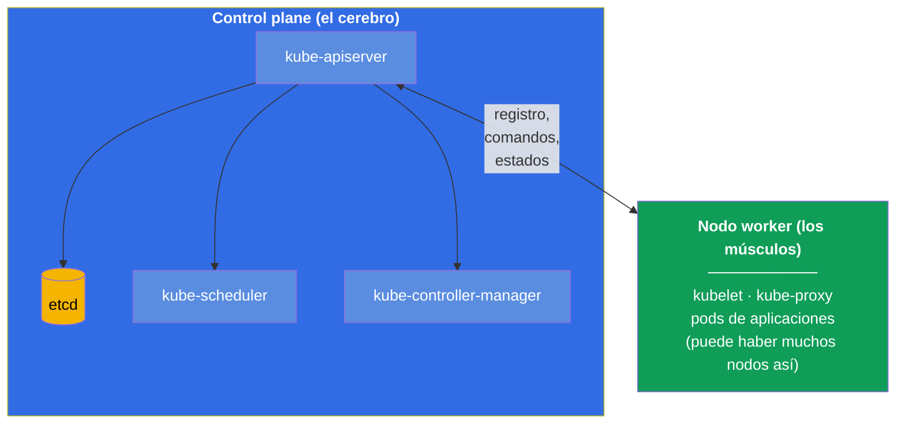
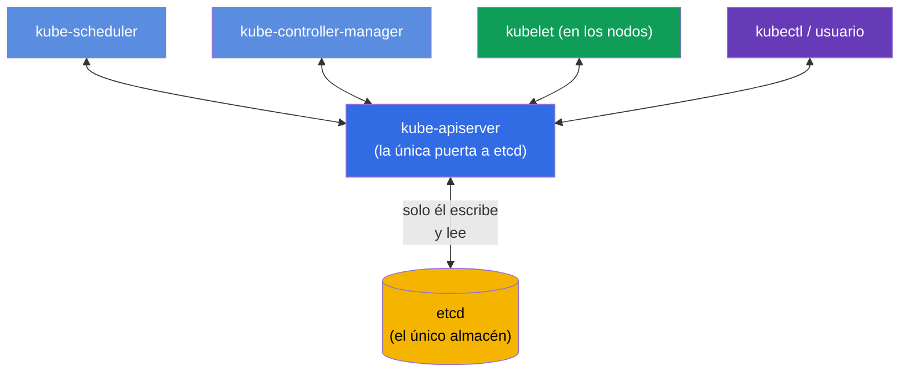
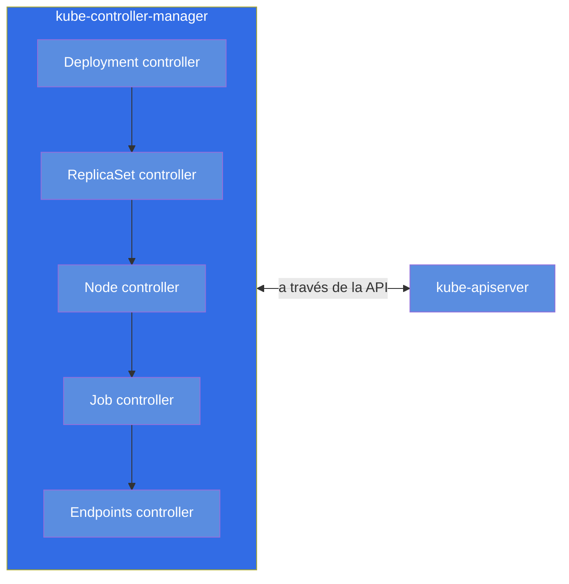
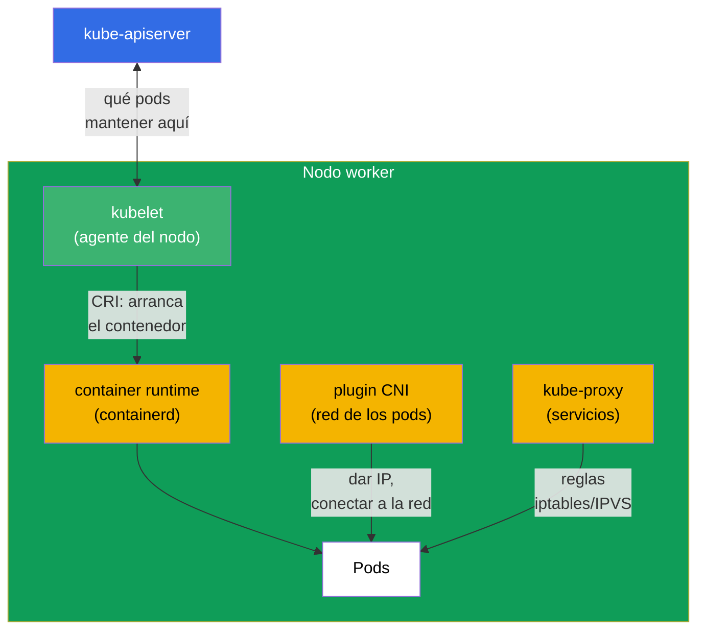
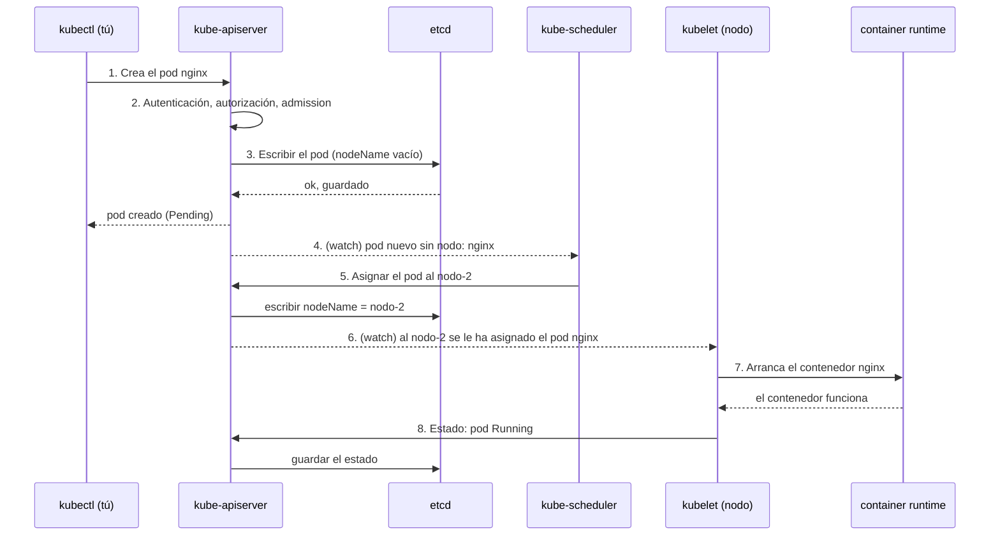
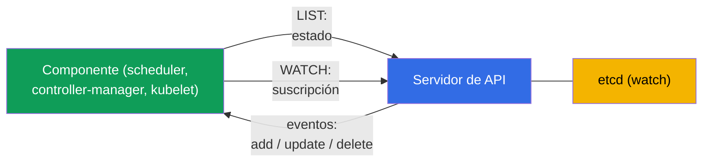
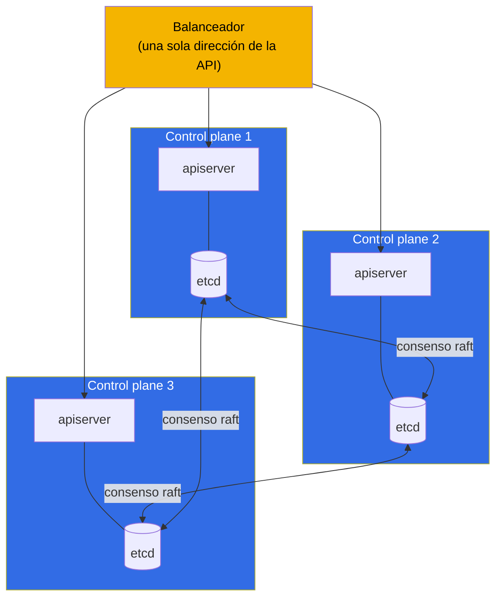

[Русская версия](ru.md) · [Eng version](README.md) · [Version française](fr.md) · [Deutsche Version](de.md) · [ქართული ვერსია](ge.md)

# Capítulo 2. Arquitectura de Kubernetes: control plane y nodos worker

> **Qué viene ahora.** En el primer capítulo entendimos que Kubernetes lleva el estado
> real del clúster al deseado. Ahora veremos de qué piezas está montado y quién hace
> exactamente ese trabajo. Este es el cimiento de todo el curso: sin entender la
> arquitectura no se puede ni administrar el clúster con criterio (CKA) ni ejecutar en él
> aplicaciones con soltura (CKAD). Y lo principal: el dominio de troubleshooting (30% del
> CKA) se apoya por completo en saber qué componente responde de qué y dónde buscarlo
> cuando se ha roto. La práctica con comandos empezará en el capítulo 3; aquí construimos
> el modelo en la cabeza.

## 2.1. El clúster a vista de pájaro

Un clúster de Kubernetes es un conjunto de máquinas (físicas o virtuales) que se llaman
**nodos** (node). Los nodos son de dos tipos:

- **Control plane (capa de gestión)** - el «cerebro» del clúster. Toma las decisiones:
  qué ejecutar y dónde, vigila el estado, guarda todos los datos. Él mismo normalmente no
  ejecuta las aplicaciones de usuario.
- **Nodos worker (nodos de trabajo)** - los «músculos» del clúster. Precisamente en ellos
  se ejecutan tus contenedores con las aplicaciones. En el diagrama se muestra un solo
  nodo worker, pero en un clúster real suele haber varios (de unos pocos a cientos) -
  todos están hechos igual y están conectados al control plane a través del servidor de
  API.

Todas las flechas del diagrama convergen en `kube-apiserver`. No es casualidad, sino la
principal regla arquitectónica de Kubernetes, a la que pasamos ahora mismo.

> **Importante (error frecuente).** Con el almacén `etcd` trabaja directamente **solo**
> `kube-apiserver`. Los demás componentes (scheduler, controller-manager, kubelet,
> kube-proxy) **no van** a etcd - leen y escriben el estado a través del servidor de API.
> etcd no es un bus de intercambio entre componentes, sino un almacén backend detrás de la
> única «puerta» que es el apiserver. Esto se desprende directamente de la documentación
> oficial: etcd se describe como el almacén «de todos los datos del servidor de API»
> ([Kubernetes Components](https://kubernetes.io/docs/concepts/overview/components/)), y en
> una topología HA el miembro de etcd «se comunica solo con el kube-apiserver» de su nodo
> ([HA topology](https://kubernetes.io/docs/setup/production-environment/tools/kubeadm/ha-topology/)).
>
> **¿Entonces cómo se entera el scheduler de los pods nuevos?** No por etcd. Los
> componentes se **suscriben** a los cambios a través del servidor de API - el mecanismo
> **watch** (list-watch). Cuando se crea un pod, el apiserver lo guarda en etcd y al
> instante reparte el evento a los suscriptores. El scheduler ve «ha aparecido un pod sin
> `nodeName`», elige un nodo y escribe la decisión (binding) **de vuelta a través del
> apiserver**; el apiserver lo guarda en etcd y avisa al kubelet del nodo correspondiente -
> ese también se entera del pod por su watch. Así todo el intercambio pasa por el apiserver
> y etcd se queda detrás de él. El mecanismo watch lo veremos en detalle en el capítulo 3.
>
> **De dónde salió el mito.** Tiene una raíz histórica: en las primeras versiones de
> Kubernetes (antes de la 1.0, 2014-2015) los componentes sí iban a etcd directamente - el
> kubelet leía sus pods de etcd y el scheduler los asignaba mediante primitivas de etcd
> (`CompareAndSwap`, watch sobre una clave). Para la versión 1.0 la arquitectura se
> consolidó a propósito: el apiserver pasó a ser la única «puerta» hacia etcd
> (auth/RBAC/admission centralizados, desacoplamiento de los componentes, una única fuente
> de verdad), y todos se pasaron al watch del servidor de API. El mito vive también porque
> en muchos diagramas etcd se dibuja en el centro del control plane - visualmente se parece
> a un «bus», aunque es solo un almacén detrás del apiserver.

## 2.2. La regla principal: todo se comunica a través del servidor de API

Recuerda este principio antes que todos los detalles: **los componentes de Kubernetes no
hablan entre sí directamente. Se comunican solo a través de `kube-apiserver`.** El
planificador no llama al kubelet, un controlador no se mete en etcd directamente - todos
pasan por el servidor de API, y el único almacén de estado es etcd, accesible también solo
a través del servidor de API.

¿Por qué se hizo así? Esto aporta tres grandes ventajas:

- **Un único punto de control.** Autenticación, autorización (RBAC), validación de
  manifiestos (admission) - todo en un mismo sitio, a la entrada del servidor de API.
- **Acoplamiento débil.** Los componentes no saben unos de otros, se pueden cambiar y
  escalar de forma independiente. Cualquier controlador nuevo simplemente «se conecta» a
  la API.
- **Una única fuente de verdad.** Todo el estado está en etcd, y solo el servidor de API
  lo toca. No hay desincronización entre varios almacenes.

Conclusión práctica para el troubleshooting: **si el servidor de API «se cae», todo el
clúster queda paralizado.** `kubectl` deja de responder, el planificador no puede asignar
pods, los controladores no pueden corregir nada. Por eso lo primero que se comprueba ante
problemas serios es si está vivo el servidor de API y si está vivo el etcd que hay debajo.

## 2.3. Los componentes del control plane uno por uno

Veamos cada componente del «cerebro»: qué hace, dónde está, cómo comprobarlo.

### kube-apiserver

El corazón del clúster y el único punto de entrada. Acepta todas las peticiones (de
`kubectl`, de los componentes, de los controladores), las verifica (autenticación →
autorización → admission), lee y escribe el estado en etcd. Es el único componente que
trabaja directamente con etcd.

- **Qué hace:** acepta y valida todas las peticiones de la API, lee/escribe etcd.
- **Dónde vive:** pod estático, manifiesto `/etc/kubernetes/manifests/kube-apiserver.yaml`.
- **Si se cae:** el clúster queda ingobernable, `kubectl` no funciona.

### etcd

Almacén distribuido de clave-valor. En él está **todo** el estado del clúster: cada pod,
servicio, secreto, configuración - todo eso son registros en etcd. Si se pierde etcd y no
hay copia de seguridad, el clúster está perdido. Por eso a la copia de seguridad de etcd se
le dedica un capítulo aparte, el 37 (y es una tarea frecuente en el CKA).

- **Qué hace:** guarda todo el estado del clúster (key-value).
- **Dónde vive:** pod estático, manifiesto `/etc/kubernetes/manifests/etcd.yaml`.
- **Si se cae:** el servidor de API no puede leer/escribir el estado - el clúster queda
  ingobernable.

### kube-scheduler

El planificador. Mira los pods a los que todavía **no se les ha asignado nodo** (`nodeName`
vacío) y decide en qué nodo colocar cada pod. Tiene en cuenta los recursos (si hay
suficiente CPU/memoria), taints/tolerations, affinity, nodeSelector y otras reglas (todo
eso son los capítulos 12-15). Importante: el planificador **solo escribe el nodo** en la
descripción del pod. Él mismo no arranca el pod - eso lo hace el kubelet.

- **Qué hace:** elige el nodo para los pods nuevos.
- **Dónde vive:** pod estático, `/etc/kubernetes/manifests/kube-scheduler.yaml`.
- **Si se cae:** los pods nuevos se quedan «colgados» en estado `Pending`, los ya
  arrancados siguen funcionando.

### kube-controller-manager

Un solo proceso dentro del cual giran multitud de **controladores** - esos mismos bucles de
reconciliación del capítulo 1. Ejemplos: el controlador de deployments (crea el
ReplicaSet), el controlador de replicasets (mantiene el número necesario de pods), el
controlador de nodos (detecta los nodos muertos), el controlador de jobs y decenas más.
Cada controlador vigila su propio tipo de objetos y lleva la realidad al estado deseado.

- **Qué hace:** ejecuta los controladores (bucles de reconciliación) de todos los tipos de
  objetos.
- **Dónde vive:** pod estático, `/etc/kubernetes/manifests/kube-controller-manager.yaml`.
- **Si se cae:** el clúster deja de «autorrepararse» (no restaura las réplicas, no detecta
  los nodos muertos).

### cloud-controller-manager (opcional)

Un gestor de controladores aparte para la integración con la nube: crea balanceadores de
carga en la nube para los servicios de tipo LoadBalancer, etiqueta los nodos por zonas,
gestiona los discos en la nube. Existe solo en clústeres lanzados en la nube (EKS, GKE,
AKS).

## 2.4. Los componentes del nodo worker

Ahora los «músculos». En cada nodo (incluido el control plane, si en él también está
permitido ejecutar pods) funcionan estos componentes.

### kubelet

El agente principal del nodo. Se comunica con el servidor de API, recibe la lista de pods
que deben funcionar en ese nodo y vigila que realmente funcionen: ordena al container
runtime arrancar/parar contenedores, controla su salud (sondas), informa del estado de
vuelta al servidor de API. **El kubelet no es un pod, sino un servicio del sistema** en el
propio nodo.

- **Qué hace:** arranca y vigila los pods de su nodo, informa del estado.
- **Dónde vive:** servicio del sistema (`systemctl status kubelet`), no es un pod.
- **Si se cae:** el nodo pasa a `NotReady`, los pods que hay en él quedan sin gestión.

### kube-proxy

Responde de la magia de red de los servicios de Kubernetes a nivel de nodo. Cuando creas un
Service, kube-proxy configura en cada nodo las reglas (iptables o IPVS) que redirigen el
tráfico dirigido a la IP virtual del servicio hacia los pods reales. El balanceo aquí es a
nivel L4 (conexiones). En detalle, en los capítulos 7 y 31.

Un punto importante: **el tráfico en sí no pasa por kube-proxy**. No está en el camino de
los paquetes, solo *configura* las reglas del núcleo (iptables/IPVS), por las que luego el
tráfico va **directamente**, ya sin participación de kube-proxy. Es decir, kube-proxy es el
«control plane» de las reglas de los servicios en el nodo, no el «data plane». De ahí una
consecuencia importante para la explotación:

- Si kube-proxy **se cae**, las reglas ya configuradas se quedan en el núcleo y **siguen
  funcionando**: los servicios existentes están accesibles, el tráfico desde los pods de
  ese nodo no se interrumpe. Solo se rompe la **actualización** de las reglas - los nuevos
  Service/Endpoints no se añaden y los eliminados no se quitan hasta que kube-proxy vuelva
  a levantarse.
- Por eso el **reinicio o la actualización de versión** de kube-proxy en un nodo pasa
  inadvertido para el tráfico: mientras el pod nuevo arranca, las reglas antiguas siguen
  vigentes y las conexiones no se cortan.

- **Qué hace:** configura las reglas de iptables/IPVS para Service en el nodo (el tráfico
  pasa por su lado).
- **Dónde vive:** normalmente un DaemonSet en el namespace `kube-system`
  (`kubectl get ds -n kube-system`).
- **Si se cae:** las reglas existentes funcionan, los servicios están accesibles; solo
  dejan de aplicarse los cambios (Service y Endpoints nuevos/eliminados) hasta que se
  restablezca.

> **Matiz.** En los clústeres modernos kube-proxy puede no estar: algunos CNI (por ejemplo,
> Cilium en modo kube-proxy replacement) asumen ese trabajo mediante eBPF. Pero para el
> examen tenemos en mente el esquema clásico con kube-proxy.

### Container runtime

Justamente lo que arranca los contenedores. Kubernetes no arranca los contenedores por sí
mismo - lo delega al entorno de ejecución a través de la interfaz estándar **CRI**
(Container Runtime Interface). Entornos populares: **containerd** (hoy la opción
principal), **CRI-O**. Docker como entorno de ejecución se ha retirado de Kubernetes
(dockershim se eliminó en la 1.24). Los contenedores de un nodo se diagnostican con la
utilidad `crictl`.

- **Qué hace:** arranca y para realmente los contenedores (por orden del kubelet).
- **Dónde vive:** servicio del sistema en el nodo (`containerd`), diagnóstico con
  `crictl`.
- **Si se cae:** el kubelet no puede arrancar contenedores, los pods del nodo no arrancan.

### Plugin CNI

Proporciona la red de los pods: da a cada pod una dirección IP y enlaza los pods entre
nodos de modo que cualquier pod pueda alcanzar a cualquier otro por IP. Se implementa
mediante el estándar **CNI** (Container Network Interface). Plugins populares: **Calico**,
**Cilium**, **Flannel**, **Weave**. En detalle sobre la red, en el capítulo 30.

## 2.5. Qué ocurre cuando creas un pod

Juntemos todo con un ejemplo vivo. Has ejecutado `kubectl run nginx --image=nginx`. Qué
ocurre dentro del clúster, paso a paso:

Sigue la lógica: **nadie habla con nadie directamente**. El planificador se enteró del pod
no por `kubectl` ni preguntando a alguien - está **suscrito** al servidor de API mediante
watch, y el apiserver **por sí mismo** le envió el evento «ha aparecido un pod sin nodo». El
kubelet se enteró de su pod igual - por un watch en el servidor de API (el apiserver le
avisó cuando el pod se asignó a ese nodo). Cada paso es una escritura o una lectura a través
de la única puerta, y las notificaciones van como eventos de watch (los detalles, en 2.6).
Así funciona toda la arquitectura débilmente acoplada de Kubernetes, y precisamente esa
comprensión está en la base del diagnóstico: conociendo la cadena, sabes dónde buscar la
avería.

## 2.6. Cómo siguen los componentes los cambios: watch y bloqueo optimista

Puesto que todo se comunica solo a través del servidor de API (2.2), surge la pregunta: ¿cómo
se enteran el scheduler o un controlador de que ha aparecido un pod nuevo, consultan la API
en un bucle? No. El mecanismo es más eficiente y está en la base de toda la reactividad de
Kubernetes.

- **list-watch.** El componente primero hace un **LIST** (se lleva el estado actual), luego
  abre un **WATCH** - un flujo de larga duración por el que el servidor de API envía solo
  los **cambios** (objeto creado/modificado/eliminado). No hay consultas en bucle: es
  barato y casi instantáneo. Así se entera el scheduler de los pods en `Pending`, y el
  kubelet de los pods de su nodo.
- **informer.** Los controladores usan la biblioteca **informer** - es una caché local de
  objetos que se mantiene actualizada mediante watch. El controlador reacciona a los
  eventos de la caché en vez de tirar de la API por cada cosita - por eso los controladores
  escalan.
- **resourceVersion.** Cada objeto tiene una versión (`metadata.resourceVersion`). El watch
  se puede «continuar» desde una versión concreta tras un corte, sin perder cambios.
- **Bloqueo optimista.** Al actualizar un objeto, el cliente envía su `resourceVersion`. Si
  el objeto ya ha cambiado (la versión no coincide), el servidor de API rechaza la
  escritura con **409 Conflict** - el cliente vuelve a leer el objeto y repite. Así dos
  escrituras no se pisan la una a la otra. Precisamente por eso los controladores y
  `kubectl apply` saben repetir operaciones en lugar de romperse en las carreras.

> **Cómo está montado el watch a nivel de red.** No es multicast ni polling, sino una
> **conexión unicast normal sobre TCP/TLS por HTTP** (HTTP/2 por defecto). El cliente abre
> una única petición de larga duración (`GET ...?watch=true`), y el servidor de API **no
> cierra la respuesta** y le **transmite** eventos en streaming - objetos `WatchEvent`
> (`ADDED`/`MODIFIED`/`DELETED`/`BOOKMARK`) línea por línea. Cada cliente tiene su propia
> conexión: el apiserver «mira» él mismo etcd, mantiene los cambios en memoria (**watch
> cache**) y los **reparte** a todos los clientes conectados (fan-out), teniendo en cuenta
> RBAC y los selectores - por eso el multicast no hace falta (no daría ni TLS/autorización,
> ni fiabilidad, ni filtrado por cliente). Al cortarse, el cliente reabre el watch desde el
> `resourceVersion` guardado y no pierde cambios, mientras que los eventos periódicos
> `BOOKMARK` empujan esa versión hacia adelante.

Esta es la trastienda técnica del **bucle de reconciliación** (capítulo 1): mediante watch
los controladores ven la diferencia entre lo deseado y lo real y la eliminan, y el bloqueo
optimista garantiza la corrección cuando muchos controladores trabajan en paralelo.

## 2.7. Dónde buscar cada componente (mapa para el troubleshooting)

Vale la pena aprenderse esta tabla de memoria: en el CKA ahorra un montón de tiempo en el
dominio de troubleshooting.

| Componente | Tipo | Dónde buscar / cómo comprobar |
|-----------|-----|-----------------------------|
| kube-apiserver | pod estático | `/etc/kubernetes/manifests/kube-apiserver.yaml`; `kubectl get pods -n kube-system` |
| etcd | pod estático | `/etc/kubernetes/manifests/etcd.yaml` |
| kube-scheduler | pod estático | `/etc/kubernetes/manifests/kube-scheduler.yaml` |
| kube-controller-manager | pod estático | `/etc/kubernetes/manifests/kube-controller-manager.yaml` |
| kubelet | servicio del sistema | `systemctl status kubelet`; `journalctl -u kubelet` |
| kube-proxy | DaemonSet | `kubectl get ds -n kube-system` |
| CoreDNS | Deployment | `kubectl get deploy -n kube-system` |
| container runtime | servicio del sistema | `systemctl status containerd`; `crictl ps` |
| CNI | plugin | `ls /etc/cni/net.d/`; los pods de CNI en `kube-system` |

La diferencia clave que hay que tener bien clara en la cabeza:

- **Los componentes del control plane (apiserver, etcd, scheduler, controller-manager)** en
  un clúster de kubeadm se ejecutan como **pods estáticos** - sus manifiestos están en
  `/etc/kubernetes/manifests/`, y los levanta el kubelet localmente, incluso antes de que
  funcione el servidor de API. Editas el archivo y el kubelet recrea el pod
  automáticamente.
- **El kubelet y el container runtime** son **servicios del sistema** (no pods), se
  gestionan con `systemctl` y registran sus logs en `journalctl`.

De los pods estáticos hablaremos en detalle en el capítulo 15, y de la instalación con
kubeadm, en el capítulo 35.

## 2.8. Alta disponibilidad del control plane

En un clúster de aprendizaje el control plane suele ser único. En producción eso no vale: si
muere el único control plane, el clúster queda ingobernable. Por eso en los clústeres reales
el control plane se hace en varias instancias (normalmente 3), y delante de sus servidores
de API se pone un balanceador.

Un detalle fino sobre etcd: los nodos de etcd forman un clúster y se ponen de acuerdo entre
sí mediante el protocolo de consenso **raft**. Para tomar decisiones hace falta quórum (la
mayoría), por eso el número de nodos se toma **impar** (3, 5). Tres nodos sobreviven a la
pérdida de uno; cinco, a la de dos. Los servidores de API, en cambio, tienen los mismos
derechos - el balanceador simplemente reparte las peticiones entre ellos.

## 2.9. Cómo se aplica esto en producción

La teoría de la arquitectura no es una abstracción, sino aquello sobre lo que se sostienen
las decisiones reales.

- **Clústeres gestionados (EKS/GKE/AKS).** En la nube el control plane no te lo dan: lo
  gestiona el proveedor, tú recibes solo el endpoint del servidor de API y pagas por la
  gestión. Tú respondes únicamente de los nodos worker. Eso quita el dolor de mantener etcd
  y de actualizar el control plane, pero también priva del acceso a los pods estáticos del
  control plane - muchas «tareas de CKA» allí simplemente no están disponibles. Por eso para
  preparar el CKA hace falta un clúster self-managed (kubeadm), no EKS.
- **Separación de roles de los nodos.** En producción el control plane se cierra con el
  taint `node-role.kubernetes.io/control-plane:NoSchedule`, para que las aplicaciones de
  usuario no acaben allí ni estorben al trabajo del «cerebro». Las aplicaciones viven solo
  en los nodos worker.
- **etcd es el activo más valioso.** Los equipos con experiencia hacen copia de seguridad de
  etcd de forma programada y guardan las instantáneas aparte del clúster. Perder etcd sin
  copia de seguridad = perder el clúster. Aparte, vigilan la latencia de disco bajo etcd:
  es muy sensible a ella.
- **HA como norma.** Cualquier clúster de producción son mínimo 3 control plane detrás de un
  balanceador y un número impar de nodos de etcd. Un solo control plane se admite solo en
  entornos de dev o de aprendizaje.
- **Diagnóstico de incidentes.** Entender que «todo pasa por el servidor de API y el estado
  está en etcd» es lo primero que aplica el ingeniero de guardia: `kubectl` no responde →
  miramos el servidor de API y etcd; los pods se quedan en Pending → miramos el scheduler;
  un nodo está NotReady → miramos el kubelet y el runtime de ese nodo.

## 2.10. Miniglosario

- **Nodo (node)** - máquina (VM o física) que forma parte del clúster.
- **Control plane** - capa de gestión del clúster (el cerebro): apiserver, etcd, scheduler,
  controller-manager.
- **Nodo worker** - nodo de trabajo en el que se ejecutan los pods de las aplicaciones.
- **kube-apiserver** - punto único de entrada por el que pasan todas las peticiones; el
  único que escribe en etcd.
- **etcd** - almacén distribuido key-value de todo el estado del clúster.
- **kube-scheduler** - asigna los pods a los nodos.
- **kube-controller-manager** - conjunto de controladores (bucles de reconciliación).
- **kubelet** - agente del nodo, arranca y controla los pods; servicio del sistema.
- **kube-proxy** - implementa los servicios mediante iptables/IPVS en el nodo.
- **container runtime** - entorno de ejecución de contenedores (containerd), se comunica por
  CRI.
- **CNI** - interfaz y plugin de la red de los pods (Calico, Cilium y otros).
- **Pod estático** - pod levantado por el kubelet directamente desde un manifiesto en
  `/etc/kubernetes/manifests/`, sin participación del planificador.
- **raft** - protocolo de consenso con el que se ponen de acuerdo los nodos de etcd.
- **list-watch** - patrón de seguimiento de los cambios: LIST + flujo WATCH (sin consultas).
- **informer** - caché local de objetos del controlador, sincronizada mediante watch.
- **resourceVersion** - versión del objeto; el watch continúa desde ella, base del bloqueo optimista.
- **bloqueo optimista** - una escritura con versión obsoleta se rechaza (409 Conflict) → se repite.

## 2.11. Resumen del capítulo

- Clúster = control plane (el cerebro) + nodos worker (los músculos). En los nodos worker
  viven los pods de las aplicaciones.
- Regla principal: los componentes no se comunican directamente, solo a través de
  `kube-apiserver`; el único almacén de estado es etcd, y lo toca solo el servidor de API.
- Control plane: apiserver (la puerta única), etcd (el almacén), scheduler (elección de
  nodo), controller-manager (bucles de reconciliación); en la nube, además,
  cloud-controller-manager.
- Nodo worker: kubelet (agente, servicio del sistema), kube-proxy (servicios), container
  runtime (arranque de contenedores por CRI), CNI (red de los pods).
- Crear un pod es una cadena de lecturas/escrituras a través del servidor de API: apiserver
  → etcd → el scheduler asigna el nodo → el kubelet arranca mediante el runtime → el estado
  de vuelta.
- Los componentes siguen los cambios mediante **list-watch** (sin consultas), los
  controladores usan la caché del informer; las escrituras paralelas las protege el bloqueo
  optimista (resourceVersion → 409 Conflict → repetición).
- Para el troubleshooting, aprende dónde está cada componente: el control plane son pods
  estáticos en `/etc/kubernetes/manifests/`, el kubelet y el runtime son servicios del
  sistema (`systemctl`, `journalctl`, `crictl`).
- En producción el control plane se hace en HA (3 nodos detrás de un balanceador, número
  impar de nodos de etcd para el quórum de raft), y de etcd se hacen copias de seguridad con
  cuidado.

## 2.12. Para qué sirve: en el examen y en el trabajo real

**En el examen.** Tareas directas: «repara el control plane» (CKA, troubleshooting 30%) -
hay que saber que los manifiestos están en `/etc/kubernetes/manifests/` y cómo leer los logs
de los componentes; «el pod se queda en Pending» - pensar de inmediato en el scheduler; «el
nodo está NotReady» - en el kubelet y el runtime. Sin el mapa de componentes de la sección
2.7 esas tareas no se resuelven en el tiempo asignado. Para el CKAD la arquitectura se
pregunta menos, pero entender que «los pods los arranca el kubelet, la red la da CNI, los
servicios los da kube-proxy» hace falta para depurar aplicaciones.

**En el trabajo real.** Es el modelo con el que un ingeniero localiza cualquier incidente:
clúster ingobernable → apiserver/etcd; los pods no se planifican → scheduler; un nodo
concreto se ha caído → su kubelet/runtime; el tráfico no llega al servicio → kube-proxy/CNI.
Ese mismo esqueleto de conocimiento determina también las decisiones arquitectónicas: cuántos
control plane mantener, dónde hacer copia de seguridad de etcd, por qué las aplicaciones no
se ponen en el control plane.

## 2.13. Preguntas de autoevaluación

1. ¿Por qué se dice que todos los componentes de Kubernetes se comunican solo a través del
   servidor de API? ¿Qué aporta eso?
2. ¿Qué único componente trabaja directamente con etcd y por qué es importante?
3. ¿Qué pasará con los pods nuevos y con los ya arrancados si se cae kube-scheduler?
4. ¿En qué se diferencia la forma de ejecutar los componentes del control plane de la del
   kubelet y el container runtime? ¿Dónde se buscan unos y otros?
5. Describe paso a paso qué ocurre en el clúster después de `kubectl run nginx --image=nginx`.
6. ¿Por qué el número de nodos de etcd se hace impar y qué es el quórum?
7. ¿Por qué para preparar el CKA no sirve un clúster gestionado como EKS?
8. ¿Cómo se enteran los componentes de los cambios sin consultar la API (list-watch)? ¿Qué es
   un informer?
9. ¿Qué es el bloqueo optimista y para qué hace falta `resourceVersion` al escribir?

## Práctica

El trabajo práctico con el clúster lo empezaremos en el capítulo siguiente, donde dominaremos
`kubectl` y los dos enfoques de gestión de objetos. La estructura del clúster de este capítulo
la verás en vivo un poco más adelante: en un clúster ya listo se podrá echar un ojo a
`/etc/kubernetes/manifests/` y comprobar los estados de los componentes del control plane,
mientras que montar un clúster desde cero con tus propias manos (`kubeadm init` + CNI +
`join`) queda para el capítulo 35, cuando veamos la instalación.

---
[Índice](../README_ES.md) · [Capítulo 1](../01/es.md) · [Capítulo 3](../03/es.md)
