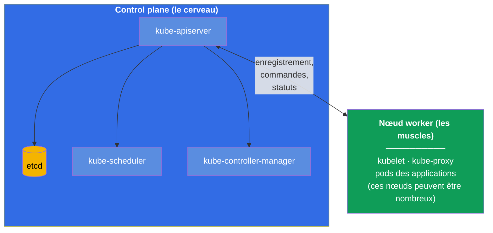
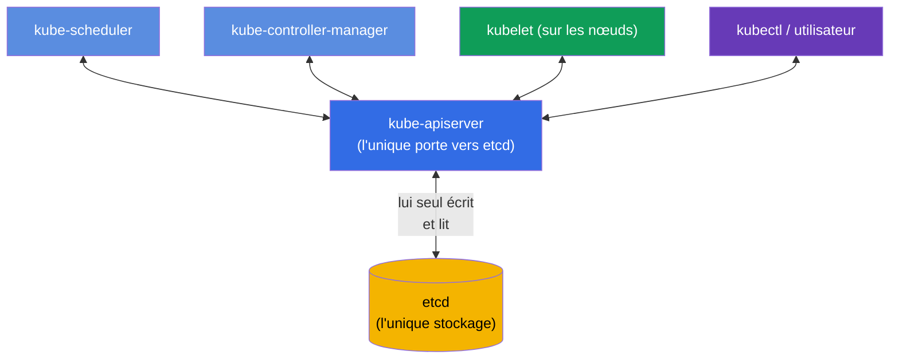
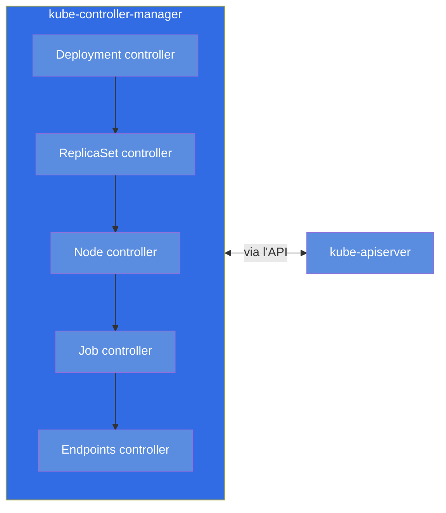
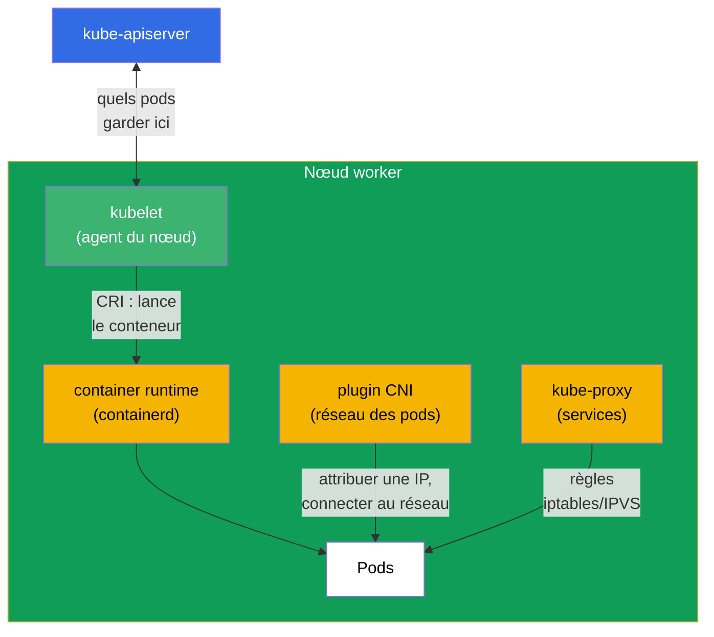
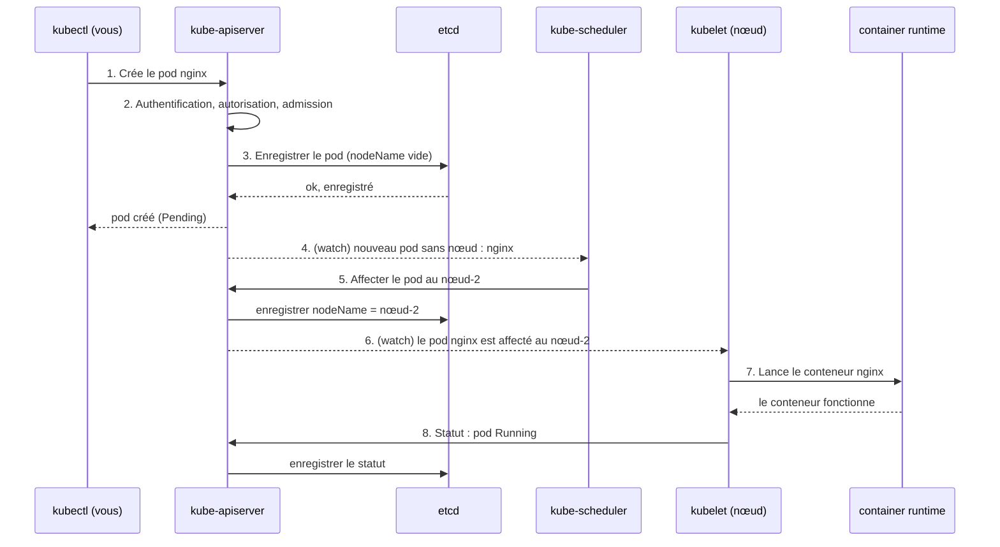
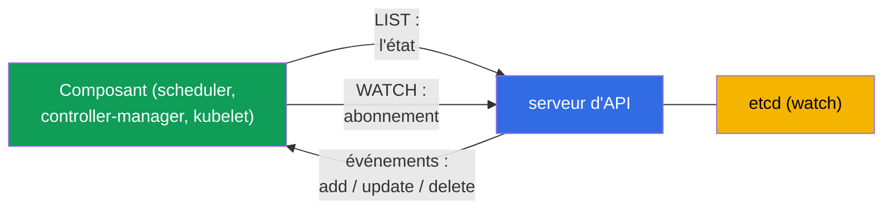
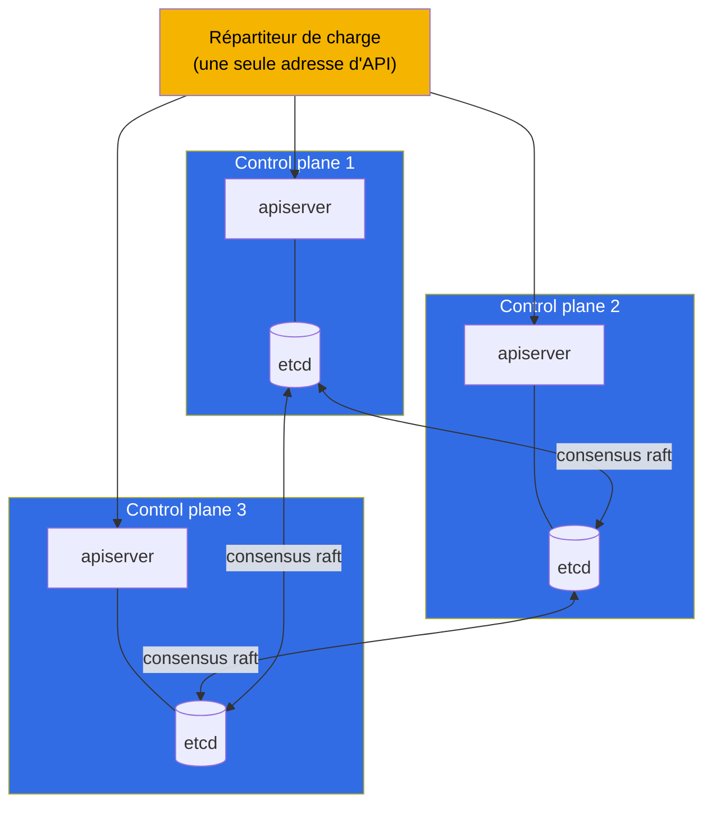

[Русская версия](ru.md) · [Eng version](README.md) · [Versión en español](es.md) · [Deutsche Version](de.md) · [ქართული ვერსია](ge.md)

# Chapitre 2. Architecture de Kubernetes : control plane et nœuds worker

> **Ce qui suit.** Dans le premier chapitre nous avons compris que Kubernetes ramène l'état
> réel du cluster vers l'état souhaité. Voyons maintenant de quelles pièces il est assemblé
> et qui exactement effectue ce travail. C'est le fondement de tout le cours : sans
> comprendre l'architecture, on ne peut ni administrer un cluster en connaissance de cause
> (CKA), ni y exécuter correctement des applications (CKAD). Et surtout - le domaine
> troubleshooting (30% du CKA) repose entièrement sur la connaissance de quel composant est
> responsable de quoi et où le chercher quand il est cassé. La pratique avec les commandes
> commencera au chapitre 3 ; ici nous construisons le modèle dans notre tête.

## 2.1. Le cluster à vol d'oiseau

Un cluster Kubernetes est un ensemble de machines (physiques ou virtuelles) que l'on appelle
des **nœuds** (node). Les nœuds se divisent en deux types :

- **Control plane (couche de gestion)** - le « cerveau » du cluster. Il prend les décisions :
  quoi lancer et où, surveille l'état, stocke toutes les données. En général il n'exécute
  pas lui-même les applications utilisateur.
- **Nœuds worker (nœuds de travail)** - les « muscles » du cluster. C'est précisément sur eux
  que sont lancés vos conteneurs avec les applications. Le schéma montre un seul nœud worker,
  mais dans un cluster réel il y en a d'ordinaire plusieurs (de quelques-uns à des centaines)
  - ils sont tous construits de la même façon et raccordés au control plane via le serveur
  d'API.

Toutes les flèches du schéma convergent vers `kube-apiserver`. Ce n'est pas un hasard, mais
la principale règle architecturale de Kubernetes, sur laquelle nous allons enchaîner.

> **Important (idée fausse fréquente).** Avec le stockage `etcd` travaille **uniquement**
> `kube-apiserver`. Les autres composants (scheduler, controller-manager, kubelet,
> kube-proxy) **ne vont pas** dans etcd - ils lisent et écrivent l'état à travers le serveur
> d'API. etcd n'est pas un bus d'échange entre les composants, mais un stockage backend
> derrière l'unique « porte » qu'est l'apiserver. Cela découle directement de la
> documentation officielle : etcd y est décrit comme le stockage « de toutes les données du
> serveur d'API »
> ([Kubernetes Components](https://kubernetes.io/docs/concepts/overview/components/)), et
> dans une topologie HA le membre etcd « ne communique qu'avec le kube-apiserver » de son
> nœud
> ([HA topology](https://kubernetes.io/docs/setup/production-environment/tools/kubeadm/ha-topology/)).
>
> **Alors comment le scheduler apprend-il l'existence de nouveaux pods ?** Pas depuis etcd.
> Les composants **s'abonnent** aux changements via le serveur d'API - c'est le mécanisme
> **watch** (list-watch). Quand un pod est créé, l'apiserver l'enregistre dans etcd et
> diffuse aussitôt l'événement aux abonnés. Le scheduler voit « un pod est apparu sans
> `nodeName` », choisit un nœud et écrit sa décision (binding) **de nouveau via
> l'apiserver** ; l'apiserver l'enregistre dans etcd et notifie le kubelet du nœud concerné -
> lui aussi apprend l'existence du pod via son watch. Ainsi tout l'échange passe par
> l'apiserver, et etcd reste derrière lui. Nous détaillerons le mécanisme watch au
> chapitre 3.
>
> **D'où vient le mythe.** Il a une racine historique : dans les premières versions de
> Kubernetes (avant la 1.0, 2014-2015) les composants allaient effectivement dans etcd
> directement - le kubelet lisait ses pods depuis etcd, et le scheduler les affectait via des
> primitives etcd (`CompareAndSwap`, watch sur une clé). Pour la version 1.0, l'architecture
> a été délibérément consolidée : l'apiserver est devenu l'unique « porte » vers etcd
> (auth/RBAC/admission centralisés, découplage des composants, source unique de vérité), et
> tous sont passés au watch du serveur d'API. Le mythe survit aussi parce que sur beaucoup de
> schémas etcd est dessiné au centre du control plane - visuellement cela ressemble à un
> « bus », alors que ce n'est qu'un stockage derrière l'apiserver.

## 2.2. La règle principale : tout communique via le serveur d'API

Retenez ce principe avant tous les détails : **les composants de Kubernetes ne se parlent
pas directement entre eux. Ils communiquent uniquement via `kube-apiserver`.** Le
planificateur n'appelle pas le kubelet, le contrôleur ne va pas dans etcd directement -
tous passent par le serveur d'API, et l'unique stockage de l'état est etcd, accessible lui
aussi seulement via le serveur d'API.

Pourquoi est-ce fait ainsi ? Cela apporte trois grands avantages :

- **Un point de contrôle unique.** Authentification, autorisation (RBAC), vérification des
  manifestes (admission) - tout au même endroit, à l'entrée du serveur d'API.
- **Un couplage faible.** Les composants ne se connaissent pas les uns les autres, on peut
  les modifier et les mettre à l'échelle indépendamment. N'importe quel nouveau contrôleur
  se « branche » simplement sur l'API.
- **Une source unique de vérité.** Tout l'état est dans etcd, et seul le serveur d'API y
  touche. Pas de désynchronisation entre plusieurs stockages.

Conclusion pratique pour le troubleshooting : **si le serveur d'API est « à terre », tout le
cluster est paralysé.** `kubectl` cesse de répondre, le planificateur ne peut plus affecter
de pods, les contrôleurs ne peuvent plus rien corriger. C'est pourquoi la première chose que
l'on vérifie lors de problèmes sérieux, c'est si le serveur d'API est vivant et si etcd
en dessous l'est aussi.

## 2.3. Les composants du control plane un par un

Examinons chaque composant du « cerveau » : ce qu'il fait, où il se trouve, comment le
vérifier.

### kube-apiserver

Le cœur du cluster et l'unique point d'entrée. Il reçoit toutes les requêtes (de `kubectl`,
des composants, des contrôleurs), les vérifie (authentification → autorisation →
admission), lit et écrit l'état dans etcd. C'est le seul composant qui travaille
directement avec etcd.

- **Ce qu'il fait :** reçoit et valide toutes les requêtes API, lit/écrit etcd.
- **Où il vit :** pod statique, manifeste `/etc/kubernetes/manifests/kube-apiserver.yaml`.
- **S'il tombe :** le cluster est ingérable, `kubectl` ne fonctionne pas.

### etcd

Stockage clé-valeur distribué. Il contient **tout** l'état du cluster : chaque pod, service,
secret, config - tout cela, ce sont des enregistrements dans etcd. Si etcd est perdu et
qu'il n'y a pas de sauvegarde, le cluster est perdu. C'est pourquoi un chapitre entier, le
37, est consacré à la sauvegarde d'etcd (et c'est une tâche fréquente au CKA).

- **Ce qu'il fait :** stocke tout l'état du cluster (key-value).
- **Où il vit :** pod statique, manifeste `/etc/kubernetes/manifests/etcd.yaml`.
- **S'il tombe :** le serveur d'API ne peut plus lire/écrire l'état - le cluster est ingérable.

### kube-scheduler

Le planificateur. Il regarde les pods auxquels **aucun nœud n'est encore affecté**
(`nodeName` vide), et décide sur quel nœud placer chaque pod. Il tient compte des ressources
(y a-t-il assez de CPU/mémoire), des taints/tolerations, de l'affinity, du nodeSelector et
d'autres règles (tout cela, ce sont les chapitres 12-15). Important : le planificateur
**inscrit seulement le nœud** dans la description du pod. Il ne lance pas le pod lui-même -
c'est le kubelet qui le fait.

- **Ce qu'il fait :** choisit un nœud pour les nouveaux pods.
- **Où il vit :** pod statique, `/etc/kubernetes/manifests/kube-scheduler.yaml`.
- **S'il tombe :** les nouveaux pods « restent en suspens » au statut `Pending`, ceux déjà
  lancés fonctionnent.

### kube-controller-manager

Un seul processus, à l'intérieur duquel tourne une multitude de **contrôleurs** - ces mêmes
boucles de réconciliation du chapitre 1. Exemples : le contrôleur de deployments (crée le
ReplicaSet), le contrôleur de replicasets (maintient le nombre voulu de pods), le contrôleur
de nœuds (repère les nœuds morts), le contrôleur de jobs et des dizaines d'autres. Chaque
contrôleur surveille son propre type d'objets et ramène la réalité vers l'état souhaité.

- **Ce qu'il fait :** exécute les contrôleurs (boucles de réconciliation) pour tous les types
  d'objets.
- **Où il vit :** pod statique, `/etc/kubernetes/manifests/kube-controller-manager.yaml`.
- **S'il tombe :** le cluster cesse de « s'auto-réparer » (il ne restaure pas les réplicas,
  ne remarque pas les nœuds morts).

### cloud-controller-manager (facultatif)

Un gestionnaire de contrôleurs distinct pour l'intégration avec le cloud : il crée les
répartiteurs de charge du cloud pour les services de type LoadBalancer, étiquette les nœuds
par zones, gère les disques du cloud. Il n'existe que dans les clusters lancés dans un cloud
(EKS, GKE, AKS).

## 2.4. Les composants du nœud worker

Passons aux « muscles ». Sur chaque nœud (y compris le control plane, s'il est aussi autorisé
à y exécuter des pods) fonctionnent ces composants.

### kubelet

L'agent principal du nœud. Il communique avec le serveur d'API, reçoit la liste des pods qui
doivent fonctionner sur ce nœud, et veille à ce qu'ils fonctionnent réellement : il commande
au container runtime de démarrer/arrêter les conteneurs, surveille leur santé (les probes),
rapporte le statut en retour au serveur d'API. **Le kubelet n'est pas un pod, mais un service
système** sur le nœud lui-même.

- **Ce qu'il fait :** lance et surveille les pods de son nœud, rapporte le statut.
- **Où il vit :** service système (`systemctl status kubelet`), pas un pod.
- **S'il tombe :** le nœud passe en `NotReady`, les pods qui y sont ne sont plus pilotés.

### kube-proxy

Il est responsable de la magie réseau des Services Kubernetes au niveau du nœud. Quand vous
créez un Service, kube-proxy configure sur chaque nœud des règles (iptables ou IPVS) qui
redirigent le trafic adressé à l'IP virtuelle du service vers les pods réels. La répartition
se fait ici au niveau L4 (les connexions). En détail - aux chapitres 7 et 31.

Point important : **le trafic lui-même ne passe pas par kube-proxy**. Il n'est pas sur le
chemin des paquets, il ne fait que *configurer* les règles du noyau (iptables/IPVS), par
lesquelles le trafic passe ensuite **directement**, déjà sans la participation de kube-proxy.
Autrement dit, kube-proxy est le « control plane » des règles de services sur le nœud, et non
le « data plane ». D'où une conséquence importante pour l'exploitation :

- Si kube-proxy **tombe**, les règles déjà configurées restent dans le noyau et
  **continuent de fonctionner** : les services existants sont accessibles, le trafic des pods
  de ce nœud n'est pas interrompu. Seule la **mise à jour** des règles casse - les nouveaux
  Service/Endpoints ne sont pas ajoutés, ceux supprimés ne sont pas retirés, jusqu'à ce que
  kube-proxy redémarre.
- C'est pourquoi le **redémarrage ou la mise à jour de version** de kube-proxy sur un nœud
  passe inaperçu pour le trafic : pendant que le nouveau pod démarre, les anciennes règles
  restent en vigueur, et les connexions ne se coupent pas.

- **Ce qu'il fait :** configure les règles iptables/IPVS pour les Service sur le nœud (le
  trafic passe à côté de lui).
- **Où il vit :** en général un DaemonSet dans le namespace `kube-system`
  (`kubectl get ds -n kube-system`).
- **S'il tombe :** les règles existantes fonctionnent, les services sont accessibles ; seuls
  les changements (Service et Endpoints nouveaux/supprimés) cessent d'être appliqués jusqu'à
  son rétablissement.

> **Nuance.** Dans les clusters modernes, kube-proxy peut être absent : certains CNI (par
> exemple Cilium en mode kube-proxy replacement) prennent ce travail à leur charge via eBPF.
> Mais pour l'examen, gardons en tête le schéma classique avec kube-proxy.

### Container runtime

Précisément ce qui lance les conteneurs. Kubernetes ne lance pas les conteneurs lui-même - il
délègue cela à l'environnement d'exécution via l'interface standard **CRI** (Container Runtime
Interface). Environnements populaires : **containerd** (aujourd'hui le choix principal),
**CRI-O**. Docker comme environnement d'exécution a été retiré de Kubernetes (dockershim
supprimé en 1.24). On diagnostique les conteneurs sur le nœud avec l'utilitaire `crictl`.

- **Ce qu'il fait :** lance et arrête réellement les conteneurs (sur ordre du kubelet).
- **Où il vit :** service système sur le nœud (`containerd`), diagnostic via `crictl`.
- **S'il tombe :** le kubelet ne peut pas lancer de conteneurs, les pods du nœud ne démarrent
  pas.

### Plugin CNI

Il assure le réseau des pods : attribue une adresse IP à chaque pod et relie les pods entre
les nœuds de sorte que n'importe quel pod puisse joindre n'importe quel autre par IP. Cela se
réalise via le standard **CNI** (Container Network Interface). Plugins populaires :
**Calico**, **Cilium**, **Flannel**, **Weave**. En détail sur le réseau - au chapitre 30.

## 2.5. Ce qui se passe quand vous créez un pod

Rassemblons tout sur un exemple vivant. Vous avez exécuté `kubectl run nginx --image=nginx`.
Ce qui se passe à l'intérieur du cluster, étape par étape :

Suivez la logique : **personne ne parle directement à personne**. Le planificateur n'a pas
appris l'existence du pod par `kubectl` ni en interrogeant quelqu'un - il est **abonné** au
serveur d'API via watch, et l'apiserver lui a **lui-même** envoyé l'événement « un pod sans
nœud est apparu ». Le kubelet a appris l'existence de son pod de la même façon - via un watch
sur le serveur d'API (l'apiserver l'a notifié quand le pod a été affecté à ce nœud). Chaque
étape est une écriture ou une lecture à travers l'unique porte, et les notifications arrivent
sous forme d'événements watch (les détails - en 2.6). C'est exactement ainsi que fonctionne
toute l'architecture faiblement couplée de Kubernetes, et c'est précisément cette
compréhension qui est à la base du diagnostic : en connaissant la chaîne, vous savez où
chercher la panne.

## 2.6. Comment les composants suivent les changements : watch et verrouillage optimiste

Puisque tout communique uniquement via le serveur d'API (2.2), une question se pose : comment
le scheduler ou un contrôleur apprennent-ils qu'un nouveau pod est apparu - en interrogeant
l'API en boucle ? Non. Le mécanisme est plus efficace et se trouve à la base de toute la
réactivité de Kubernetes.

- **list-watch.** Le composant fait d'abord un **LIST** (il récupère l'état courant), puis
  ouvre un **WATCH** - un flux longue durée par lequel le serveur d'API n'envoie que les
  **changements** (objet créé/modifié/supprimé). Il n'y a pas d'interrogation en boucle -
  c'est peu coûteux et presque instantané. C'est ainsi que le scheduler apprend l'existence
  des pods `Pending`, et le kubelet celle des pods destinés à son nœud.
- **informer.** Les contrôleurs utilisent la bibliothèque **informer** - c'est un cache local
  des objets, maintenu à jour via watch. Le contrôleur réagit aux événements du cache au lieu
  de solliciter l'API à tout bout de champ - c'est pourquoi les contrôleurs passent à l'échelle.
- **resourceVersion.** Chaque objet a une version (`metadata.resourceVersion`). On peut
  « poursuivre » un watch depuis une version donnée après une coupure - sans perdre de
  changements.
- **Verrouillage optimiste.** Lors de la mise à jour d'un objet, le client envoie sa
  `resourceVersion`. Si l'objet a déjà changé (la version ne correspond pas), le serveur d'API
  rejette l'écriture avec un **409 Conflict** - le client relit l'objet et réessaie. Ainsi
  deux écritures ne s'écrasent pas l'une l'autre. C'est justement pour cela que les
  contrôleurs et `kubectl apply` savent répéter les opérations au lieu de casser sur les
  situations de concurrence.

> **Comment le watch est fait au niveau réseau.** Ce n'est pas du multicast ni du polling,
> mais une simple **connexion unicast par-dessus TCP/TLS en HTTP** (par défaut HTTP/2). Le
> client ouvre une unique requête longue durée (`GET ...?watch=true`), et le serveur d'API
> **ne ferme pas la réponse** et y **diffuse en flux** les événements - des objets
> `WatchEvent` (`ADDED`/`MODIFIED`/`DELETED`/`BOOKMARK`) ligne par ligne. Chaque client a sa
> propre connexion : l'apiserver « regarde » lui-même etcd, garde les changements en mémoire
> (**watch cache**) et les **distribue** à tous les clients connectés (fan-out), en tenant
> compte du RBAC et des sélecteurs - c'est pourquoi le multicast est inutile (il ne
> donnerait ni TLS/autorisation, ni fiabilité, ni filtrage par client). En cas de coupure, le
> client réouvre le watch depuis la `resourceVersion` mémorisée et ne perd pas de changements,
> et les événements `BOOKMARK` périodiques font avancer cette version.

C'est l'envers technique de la **boucle de réconciliation** (chapitre 1) : via watch, les
contrôleurs voient la différence entre l'état souhaité et l'état réel et la suppriment, et le
verrouillage optimiste garantit la correction quand de nombreux contrôleurs travaillent en
parallèle.

## 2.7. Où chercher quel composant (la carte pour le troubleshooting)

Ce tableau vaut la peine d'être appris par cœur - au CKA il fait gagner beaucoup de temps
dans le domaine troubleshooting.

| Composant | Type | Où chercher / comment vérifier |
|-----------|-----|-----------------------------|
| kube-apiserver | pod statique | `/etc/kubernetes/manifests/kube-apiserver.yaml` ; `kubectl get pods -n kube-system` |
| etcd | pod statique | `/etc/kubernetes/manifests/etcd.yaml` |
| kube-scheduler | pod statique | `/etc/kubernetes/manifests/kube-scheduler.yaml` |
| kube-controller-manager | pod statique | `/etc/kubernetes/manifests/kube-controller-manager.yaml` |
| kubelet | service système | `systemctl status kubelet` ; `journalctl -u kubelet` |
| kube-proxy | DaemonSet | `kubectl get ds -n kube-system` |
| CoreDNS | Deployment | `kubectl get deploy -n kube-system` |
| container runtime | service système | `systemctl status containerd` ; `crictl ps` |
| CNI | plugin | `ls /etc/cni/net.d/` ; les pods CNI dans `kube-system` |

La distinction clé qu'il faut garder nettement en tête :

- **Les composants du control plane (apiserver, etcd, scheduler, controller-manager)** dans
  un cluster kubeadm sont lancés comme des **pods statiques** - leurs manifestes se trouvent
  dans `/etc/kubernetes/manifests/`, et c'est le kubelet qui les démarre localement, avant
  même que le serveur d'API ne fonctionne. Vous modifiez le fichier - le kubelet recrée
  automatiquement le pod.
- **Le kubelet et le container runtime** sont des **services système** (pas des pods), pilotés
  via `systemctl` et journalisés dans `journalctl`.

Nous parlerons en détail des pods statiques au chapitre 15, et de l'installation via kubeadm -
au chapitre 35.

## 2.8. Haute disponibilité du control plane

Dans un cluster d'apprentissage, le control plane est en général unique. En production c'est
impossible : si l'unique control plane meurt, le cluster devient ingérable. C'est pourquoi
dans les clusters réels on fait le control plane en plusieurs exemplaires (d'ordinaire 3), et
on place devant leurs serveurs d'API un répartiteur de charge.

Subtilité à propos d'etcd : les nœuds etcd forment un cluster et s'accordent entre eux via le
protocole de consensus **raft**. Pour prendre des décisions il faut un quorum (la majorité),
c'est pourquoi le nombre de nœuds est pris **impair** (3, 5). Trois nœuds survivent à la perte
d'un, cinq à celle de deux. Les serveurs d'API, eux, sont égaux en droits - le répartiteur de
charge distribue simplement les requêtes entre eux.

## 2.9. Comment cela s'applique en production

La théorie de l'architecture n'est pas une abstraction, c'est ce sur quoi reposent les
décisions réelles.

- **Clusters managés (EKS/GKE/AKS).** Dans le cloud, on ne vous donne pas le control plane -
  c'est le fournisseur qui le gère, vous recevez seulement l'endpoint du serveur d'API et vous
  payez pour cette gestion. Vous n'êtes responsable que des nœuds worker. Cela supprime la
  douleur de la maintenance d'etcd et des mises à jour du control plane, mais prive aussi de
  l'accès aux pods statiques du control plane - beaucoup de « tâches CKA » y sont tout
  simplement impossibles. C'est pourquoi, pour préparer le CKA, il faut un cluster
  self-managed (kubeadm), et non EKS.
- **Séparation des rôles des nœuds.** En production, on ferme le control plane avec le taint
  `node-role.kubernetes.io/control-plane:NoSchedule`, pour que les applications utilisateur
  n'y atterrissent pas et ne gênent pas le travail du « cerveau ». Les applications vivent
  uniquement sur les nœuds worker.
- **etcd est l'actif le plus précieux.** Les équipes expérimentées sauvegardent etcd selon un
  planning et conservent les snapshots séparément du cluster. Perte d'etcd sans sauvegarde =
  perte du cluster. On surveille à part la latence disque sous etcd - il y est très sensible.
- **La HA comme norme.** Tout cluster de production, c'est au minimum 3 control plane derrière
  un répartiteur de charge et un nombre impair de nœuds etcd. Un control plane unique n'est
  admissible qu'en environnement de dev ou d'apprentissage.
- **Diagnostic des incidents.** Comprendre que « tout passe par le serveur d'API, l'état est
  dans etcd » - c'est la première chose qu'applique l'ingénieur d'astreinte : `kubectl` ne
  répond pas → on regarde le serveur d'API et etcd ; les pods restent en Pending → on regarde
  le scheduler ; un nœud est NotReady → on regarde le kubelet et le runtime sur celui-ci.

## 2.10. Mini-glossaire

- **Nœud (node)** - machine (VM ou physique) faisant partie du cluster.
- **Control plane** - la couche de gestion du cluster (le cerveau) : apiserver, etcd,
  scheduler, controller-manager.
- **Nœud worker** - nœud de travail, sur lequel sont lancés les pods des applications.
- **kube-apiserver** - le point d'entrée unique par lequel passent toutes les requêtes ; le
  seul qui écrit dans etcd.
- **etcd** - stockage key-value distribué de tout l'état du cluster.
- **kube-scheduler** - affecte les pods aux nœuds.
- **kube-controller-manager** - ensemble de contrôleurs (boucles de réconciliation).
- **kubelet** - agent du nœud, lance et contrôle les pods ; service système.
- **kube-proxy** - réalise les services via iptables/IPVS sur le nœud.
- **container runtime** - environnement d'exécution des conteneurs (containerd), communique
  via CRI.
- **CNI** - interface et plugin du réseau des pods (Calico, Cilium, etc.).
- **Pod statique** - pod démarré par le kubelet directement depuis un manifeste dans
  `/etc/kubernetes/manifests/`, sans la participation du planificateur.
- **raft** - protocole de consensus par lequel s'accordent les nœuds etcd.
- **list-watch** - patron de suivi des changements : LIST + flux WATCH (sans interrogation).
- **informer** - cache local des objets d'un contrôleur, synchronisé via watch.
- **resourceVersion** - version de l'objet ; le watch reprend depuis elle, base du
  verrouillage optimiste.
- **verrouillage optimiste** - une écriture avec une version périmée est rejetée (409 Conflict)
  → nouvelle tentative.

## 2.11. Récapitulatif du chapitre

- Cluster = control plane (le cerveau) + nœuds worker (les muscles). C'est sur les nœuds
  worker que vivent les pods des applications.
- Règle principale : les composants ne communiquent pas directement, uniquement via
  `kube-apiserver` ; l'unique stockage de l'état est etcd, et seul le serveur d'API y touche.
- Control plane : apiserver (la porte unique), etcd (le stockage), scheduler (choix du nœud),
  controller-manager (boucles de réconciliation) ; dans le cloud - en plus le
  cloud-controller-manager.
- Nœud worker : kubelet (agent, service système), kube-proxy (services), container runtime
  (lancement des conteneurs via CRI), CNI (réseau des pods).
- La création d'un pod est une chaîne de lectures/écritures via le serveur d'API : apiserver →
  etcd → le scheduler affecte un nœud → le kubelet lance via le runtime → le statut en retour.
- Les composants suivent les changements via **list-watch** (sans interrogation), les
  contrôleurs utilisent le cache informer ; les écritures parallèles sont protégées par le
  verrouillage optimiste (resourceVersion → 409 Conflict → nouvelle tentative).
- Pour le troubleshooting, apprenez où se trouve quel composant : control plane - pods
  statiques dans `/etc/kubernetes/manifests/`, kubelet et runtime - services système
  (`systemctl`, `journalctl`, `crictl`).
- En production, le control plane est fait en HA (3 nœuds derrière un répartiteur de charge,
  un nombre impair de nœuds etcd pour le quorum raft), et etcd est soigneusement sauvegardé.

## 2.12. À quoi cela sert : à l'examen et dans le travail réel

**À l'examen.** Tâches directes : « répare le control plane » (CKA, troubleshooting 30%) - il
faut savoir que les manifestes sont dans `/etc/kubernetes/manifests/` et comment lire les logs
des composants ; « le pod reste en Pending » - penser tout de suite au scheduler ; « le nœud
est NotReady » - au kubelet et au runtime. Sans la carte des composants de la section 2.7, ces
tâches ne se résolvent pas dans le temps imparti. Pour le CKAD, l'architecture est moins
interrogée, mais comprendre que « les pods sont lancés par le kubelet, le réseau est fourni
par le CNI, les services par kube-proxy » est nécessaire pour déboguer les applications.

**Dans le travail réel.** C'est le modèle selon lequel l'ingénieur localise n'importe quel
incident : cluster ingérable → apiserver/etcd ; les pods ne sont pas planifiés → scheduler ; un
nœud précis est tombé → son kubelet/runtime ; le trafic ne va pas jusqu'au service →
kube-proxy/CNI. Le même squelette de connaissances détermine aussi les décisions
architecturales : combien de control plane maintenir, où sauvegarder etcd, pourquoi on ne place
pas les applications sur le control plane.

## 2.13. Questions d'auto-évaluation

1. Pourquoi dit-on que tous les composants de Kubernetes communiquent uniquement via le serveur
   d'API ? Qu'est-ce que cela apporte ?
2. Quel est le seul composant qui travaille directement avec etcd et pourquoi est-ce important ?
3. Qu'arrivera-t-il aux pods nouveaux et à ceux déjà lancés si kube-scheduler tombe ?
4. En quoi le mode de lancement des composants du control plane diffère-t-il de celui du kubelet
   et du container runtime ? Où chercher les uns et les autres ?
5. Décrivez étape par étape ce qui se passe dans le cluster après `kubectl run nginx --image=nginx`.
6. Pourquoi fait-on un nombre impair de nœuds etcd et qu'est-ce que le quorum ?
7. Pourquoi un cluster managé comme EKS ne convient-il pas pour préparer le CKA ?
8. Comment les composants apprennent-ils les changements sans interroger l'API (list-watch) ?
   Qu'est-ce qu'un informer ?
9. Qu'est-ce que le verrouillage optimiste et pourquoi la `resourceVersion` est-elle nécessaire
   à l'écriture ?

## Pratique

Nous commencerons le travail pratique avec le cluster au chapitre suivant, où nous
maîtriserons `kubectl` et les deux approches de gestion des objets. La structure du cluster
vue dans ce chapitre, vous la verrez en vrai un peu plus tard : dans un cluster prêt à
l'emploi, vous pourrez jeter un œil dans `/etc/kubernetes/manifests/` et vérifier les statuts
des composants du control plane, tandis que monter un cluster de zéro de vos propres mains
(`kubeadm init` + CNI + `join`) - ce sera au chapitre 35, quand nous verrons l'installation.

---
[Sommaire](../README_FR.md) · [Chapitre 1](../01/fr.md) · [Chapitre 3](../03/fr.md)
