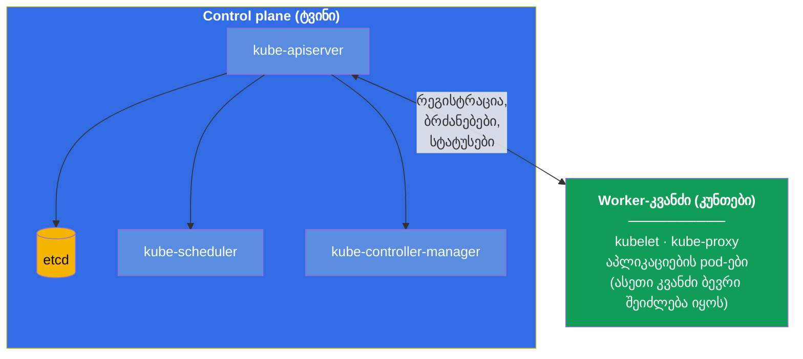
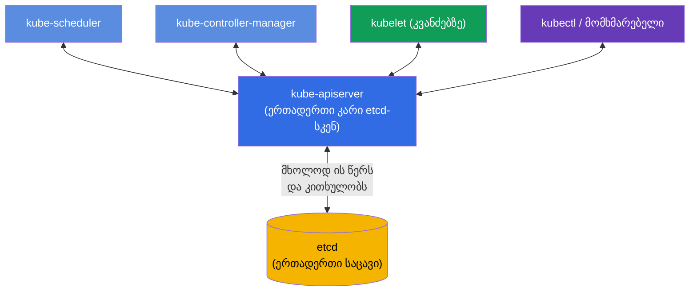
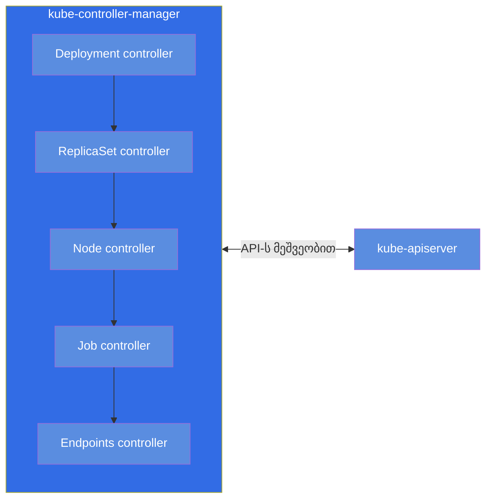
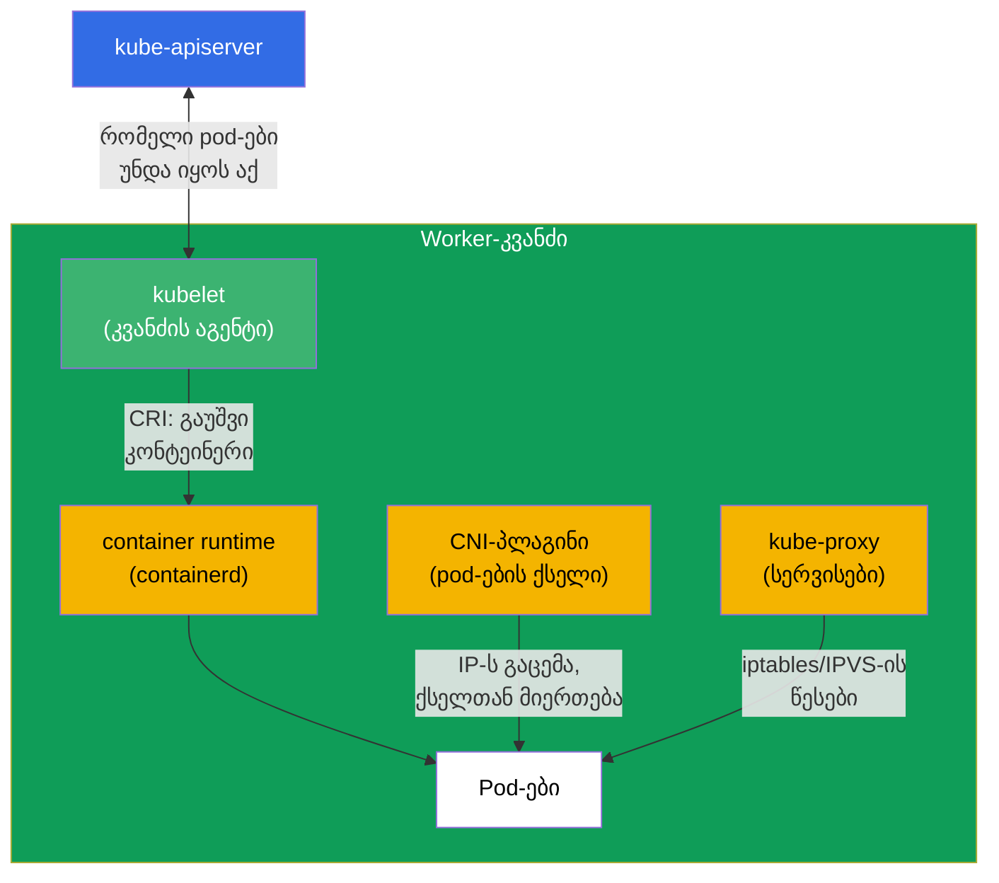
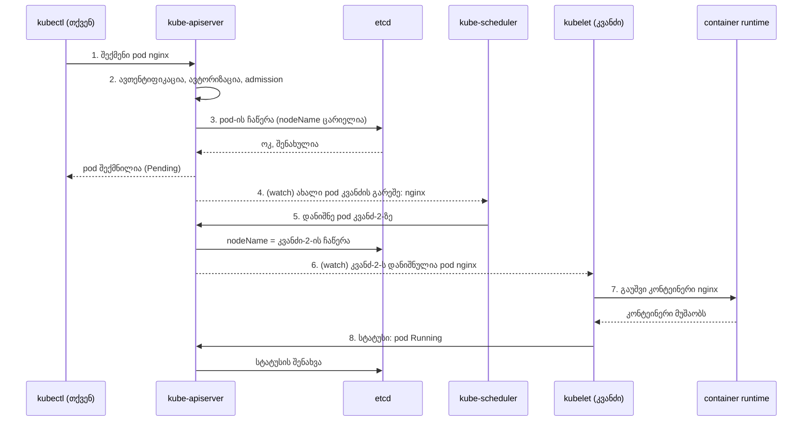
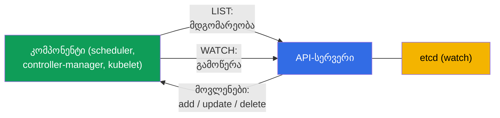
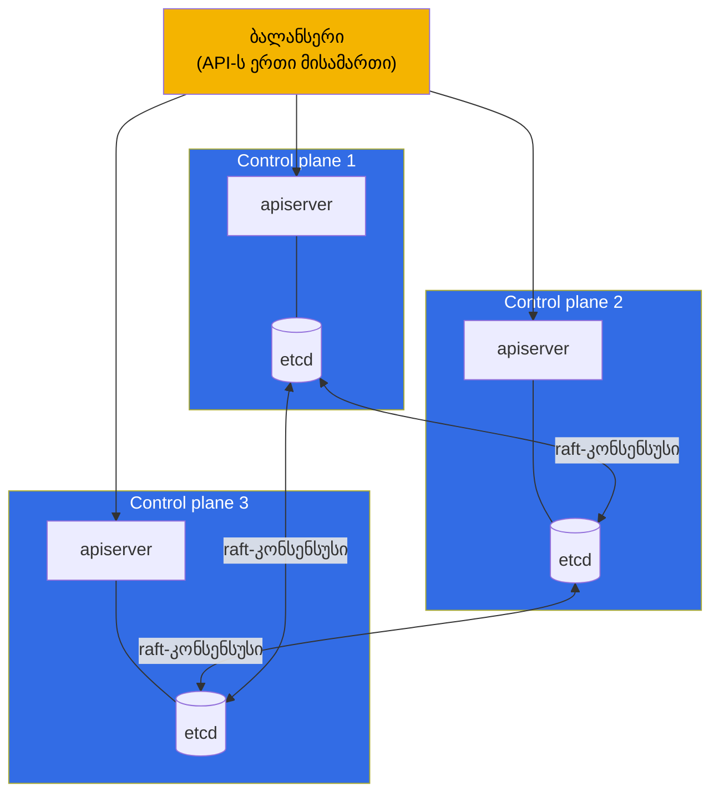

[Русская версия](ru.md) · [Eng version](README.md) · [Versión en español](es.md) · [Version française](fr.md) · [Deutsche Version](de.md) · [繁體中文版](tw.md) · [日本語版](jp.md)

# თავი 2. Kubernetes-ის არქიტექტურა: control plane და worker-კვანძები

> **რა იქნება შემდეგ.** პირველ თავში გავიგეთ, რომ Kubernetes კლასტერის რეალურ
> მდგომარეობას სასურველამდე მიჰყავს. ახლა გავარკვევთ, რომელი დეტალებისგან არის ის
> აწყობილი და კონკრეტულად ვინ ასრულებს ამ სამუშაოს. ეს არის მთელი კურსის საფუძველი:
> არქიტექტურის გაგების გარეშე ვერც შეგნებულად გაამართავთ კლასტერს (CKA), ვერც გონივრულად
> გაუშვებთ მასში აპლიკაციებს (CKAD). და მთავარი - დომენი troubleshooting (CKA-ს 30%)
> მთლიანად დგას იმის ცოდნაზე, რომელი კომპონენტი რაზეა პასუხისმგებელი და სად ვეძებოთ ის,
> როცა გაფუჭდა. პრაქტიკა ბრძანებებით მე-3 თავში დაიწყება; აქ თავში მოდელს ვაშენებთ.

## 2.1. კლასტერი ფრინველის თვალით

Kubernetes-კლასტერი არის მანქანების (ფიზიკური ან ვირტუალური) ნაკრები, რომლებსაც ეწოდება
**კვანძები** (node). კვანძები ორ ტიპად იყოფა:

- **Control plane (მმართველი შრე)** - კლასტერის „ტვინი“. იღებს გადაწყვეტილებებს:
  რა სად გაუშვას, თვალს ადევნებს მდგომარეობას, ინახავს ყველა მონაცემს. მომხმარებლის
  აპლიკაციებს თავად ჩვეულებრივ არ ატარებს.
- **Worker-კვანძები (სამუშაო კვანძები)** - კლასტერის „კუნთები“. სწორედ მათზე ეშვება თქვენი
  კონტეინერები აპლიკაციებით. სქემაზე ნაჩვენებია ერთი worker-კვანძი, მაგრამ რეალურ კლასტერში
  ისინი ჩვეულებრივ რამდენიმეა (ერთეულებიდან ასეულებამდე) - ყველა ერთნაირად არის აწყობილი და
  control plane-თან დაკავშირებულია API-სერვერის მეშვეობით.

სქემაზე ყველა ისარი `kube-apiserver`-თან იყრის თავს. ეს არ არის შემთხვევითობა, არამედ
Kubernetes-ის მთავარი არქიტექტურული წესი, რომელზეც ახლა გადავალთ.

> **მნიშვნელოვანია (ხშირი მცდარი წარმოდგენა).** საცავ `etcd`-თან პირდაპირ მუშაობს
> **მხოლოდ** `kube-apiserver`. დანარჩენი კომპონენტები (scheduler, controller-manager,
> kubelet, kube-proxy) etcd-ში **არ დადიან** - ისინი მდგომარეობას კითხულობენ და წერენ
> API-სერვერის მეშვეობით. etcd არ არის კომპონენტებს შორის გაცვლის მაგისტრალი, არამედ
> ბექენდ-საცავი ერთადერთი „კარის“ - apiserver-ის უკან. ეს პირდაპირ გამომდინარეობს
> ოფიციალური დოკუმენტაციიდან: etcd აღწერილია როგორც საცავი „API-სერვერის ყველა
> მონაცემისთვის“
> ([Kubernetes Components](https://kubernetes.io/docs/concepts/overview/components/)), ხოლო
> HA-ტოპოლოგიაში etcd-ის წევრი „ურთიერთობს მხოლოდ საკუთარი კვანძის kube-apiserver-თან“
> ([HA topology](https://kubernetes.io/docs/setup/production-environment/tools/kubeadm/ha-topology/)).
>
> **მაშინ როგორ იგებს scheduler ახალი pod-ების შესახებ?** არა etcd-დან. კომპონენტები
> **ეწერებიან** ცვლილებებზე API-სერვერის მეშვეობით - ეს არის მექანიზმი **watch**
> (list-watch). როცა pod იქმნება, apiserver ინახავს მას etcd-ში და მაშინვე უგზავნის მოვლენას
> გამომწერებს. Scheduler ხედავს „გაჩნდა pod `nodeName`-ის გარეშე“, ირჩევს კვანძს და წერს
> გადაწყვეტილებას (binding) **უკან apiserver-ის მეშვეობით**; apiserver ინახავს ამას etcd-ში
> და ატყობინებს საჭირო კვანძის kubelet-ს - ისიც pod-ის შესახებ საკუთარი watch-ით იგებს. ასე
> მთელი გაცვლა apiserver-ის გავლით მიდის, ხოლო etcd მის უკან რჩება. მექანიზმ watch-ს
> უფრო დაწვრილებით მე-3 თავში განვიხილავთ.
>
> **საიდან გაჩნდა მითი.** მას აქვს ისტორიული ფესვი: Kubernetes-ის ადრეულ ვერსიებში (1.0-მდე,
> 2014-2015) კომპონენტები მართლაც პირდაპირ დადიოდნენ etcd-ში - kubelet კითხულობდა საკუთარ
> pod-ებს etcd-დან, ხოლო scheduler ნიშნავდა მათ etcd-ის პრიმიტივებით (`CompareAndSwap`,
> watch გასაღებზე). 1.0 რელიზამდე არქიტექტურა შეგნებულად კონსოლიდირდა: apiserver გახდა
> ერთადერთი „კარი“ etcd-სკენ (ცენტრალიზებული auth/RBAC/admission, კომპონენტების განცალკევება,
> სიმართლის ერთიანი წყარო), და ყველა გადავიდა API-სერვერის watch-ზე. მითი ცოცხლობს იმიტომაც,
> რომ ბევრ სქემაზე etcd-ს control plane-ის ცენტრში ხატავენ - ვიზუალურად „მაგისტრალს“ ჰგავს,
> თუმცა ეს მხოლოდ საცავია apiserver-ის უკან.

## 2.2. მთავარი წესი: ყველაფერი API-სერვერის მეშვეობით ურთიერთობს

დაიმახსოვრეთ ეს პრინციპი ყველა დეტალზე უფრო ადრე: **Kubernetes-ის კომპონენტები ერთმანეთთან
პირდაპირ არ საუბრობენ. ისინი ურთიერთობენ მხოლოდ `kube-apiserver`-ის მეშვეობით.** დამგეგმავი
kubelet-ს არ ურეკავს, კონტროლერი etcd-ში პირდაპირ არ იძვრება - ყველა API-სერვერის გავლით
მიდის, ხოლო მდგომარეობის ერთადერთი საცავი არის etcd, ხელმისაწვდომი ისევ მხოლოდ
API-სერვერის მეშვეობით.

რატომ არის ასე გაკეთებული? ეს სამ დიდ პლიუსს იძლევა:

- **კონტროლის ერთიანი წერტილი.** ავთენტიფიკაცია, ავტორიზაცია (RBAC), მანიფესტების შემოწმება
  (admission) - ყველაფერი ერთ ადგილას, API-სერვერის შესასვლელში.
- **სუსტი კავშირი.** კომპონენტებმა ერთმანეთის შესახებ არ იციან, მათი შეცვლა და
  მასშტაბირება დამოუკიდებლად შეიძლება. ყოველი ახალი კონტროლერი უბრალოდ „უერთდება“ API-ს.
- **სიმართლის ერთიანი წყარო.** მთელი მდგომარეობა არის etcd-ში, და მას მხოლოდ API-სერვერი
  ეხება. არ არის რასინქრონიზაცია რამდენიმე საცავს შორის.

პრაქტიკული დასკვნა troubleshooting-ისთვის: **თუ API-სერვერი „დაწვა“ - პარალიზებულია მთელი
კლასტერი.** `kubectl` წყვეტს პასუხს, დამგეგმავი ვერ ნიშნავს pod-ებს, კონტროლერები ვერაფერს
ასწორებენ. ამიტომ სერიოზული პრობლემების დროს პირველი, რასაც ამოწმებენ, არის ის, ცოცხალია თუ
არა API-სერვერი და ცოცხალია თუ არა etcd მის ქვეშ.

## 2.3. control plane-ის კომპონენტები ცალ-ცალკე

განვიხილოთ „ტვინის“ ყოველი კომპონენტი: რას აკეთებს, სად წევს, როგორ შევამოწმოთ.

### kube-apiserver

კლასტერის გული და შესვლის ერთადერთი წერტილი. იღებს ყველა მოთხოვნას (`kubectl`-დან,
კომპონენტებიდან, კონტროლერებიდან), ამოწმებს მათ (ავთენტიფიკაცია → ავტორიზაცია →
admission), კითხულობს და წერს მდგომარეობას etcd-ში. ეს არის ერთადერთი კომპონენტი, რომელიც
პირდაპირ მუშაობს etcd-თან.

- **რას აკეთებს:** იღებს და ავალიდირებს ყველა API-მოთხოვნას, კითხულობს/წერს etcd-ს.
- **სად ცხოვრობს:** სტატიკური pod, მანიფესტი `/etc/kubernetes/manifests/kube-apiserver.yaml`.
- **თუ ჩავარდა:** კლასტერი უმართავია, `kubectl` არ მუშაობს.

### etcd

განაწილებული გასაღები-მნიშვნელობის საცავი. მასში წევს კლასტერის **მთელი** მდგომარეობა: ყოველი
pod, სერვისი, სეკრეტი, კონფიგი - ეს ყველაფერი ჩანაწერებია etcd-ში. თუ etcd დაკარგულია და
ბექაპი არ არის - კლასტერი დაკარგულია. ამიტომ etcd-ის სარეზერვო კოპირებას ეძღვნება ცალკე
თავი 37 (და ეს ხშირი დავალებაა CKA-ზე).

- **რას აკეთებს:** ინახავს კლასტერის მთელ მდგომარეობას (key-value).
- **სად ცხოვრობს:** სტატიკური pod, მანიფესტი `/etc/kubernetes/manifests/etcd.yaml`.
- **თუ ჩავარდა:** API-სერვერი ვერ კითხულობს/წერს მდგომარეობას - კლასტერი უმართავია.

### kube-scheduler

დამგეგმავი. უყურებს pod-ებს, რომლებსაც ჯერ **არ აქვთ დანიშნული კვანძი** (`nodeName` ცარიელია),
და წყვეტს, რომელ კვანძზე დააყენოს ყოველი pod. ითვალისწინებს რესურსებს (ჰყოფნის თუ არა
CPU/მეხსიერება), taints/tolerations, affinity, nodeSelector და სხვა წესებს (ეს ყველაფერი -
თავები 12-15). მნიშვნელოვანია: დამგეგმავი **მხოლოდ კვანძს უთითებს** pod-ის აღწერაში. თავად
pod-ს არ უშვებს - ამას kubelet აკეთებს.

- **რას აკეთებს:** ირჩევს კვანძს ახალი pod-ებისთვის.
- **სად ცხოვრობს:** სტატიკური pod, `/etc/kubernetes/manifests/kube-scheduler.yaml`.
- **თუ ჩავარდა:** ახალი pod-ები „ეკიდება“ სტატუსში `Pending`, უკვე გაშვებულები მუშაობენ.

### kube-controller-manager

ერთი პროცესი, რომლის შიგნით ტრიალებს მრავალი **კონტროლერი** - სწორედ ის შეთანხმების
მარყუჟები პირველი თავიდან. მაგალითები: დეპლოიმენტების კონტროლერი (ქმნის ReplicaSet-ს),
რეპლიკასეტების კონტროლერი (ინახავს pod-ების საჭირო რაოდენობას), node-კონტროლერი (შენიშნავს
მკვდარ კვანძებს), job-კონტროლერი და ათეულობით სხვა. ყოველი კონტროლერი თვალს ადევნებს
ობიექტების საკუთარ ტიპს და რეალობას სასურველამდე მიჰყავს.

- **რას აკეთებს:** უშვებს კონტროლერებს (შეთანხმების მარყუჟებს) ობიექტების ყველა ტიპისთვის.
- **სად ცხოვრობს:** სტატიკური pod, `/etc/kubernetes/manifests/kube-controller-manager.yaml`.
- **თუ ჩავარდა:** კლასტერი წყვეტს „თვითგამოსწორებას“ (არ აღადგენს რეპლიკებს,
  არ შენიშნავს მკვდარ კვანძებს).

### cloud-controller-manager (არასავალდებულო)

კონტროლერების ცალკე მენეჯერი ღრუბელთან ინტეგრაციისთვის: ქმნის ღრუბლოვან ბალანსერებს
LoadBalancer ტიპის სერვისებისთვის, მონიშნავს კვანძებს ზონების მიხედვით, მართავს ღრუბლოვან
დისკებს. არის მხოლოდ ღრუბელში გაშვებულ კლასტერებში (EKS, GKE, AKS).

## 2.4. worker-კვანძის კომპონენტები

ახლა „კუნთები“. ყოველ კვანძზე (control plane-ის ჩათვლით, თუ მასზეც ნებადართულია pod-ების
გაშვება) მუშაობს ეს კომპონენტები.

### kubelet

კვანძის მთავარი აგენტი. ურთიერთობს API-სერვერთან, იღებს pod-ების სიას, რომლებმაც ამ კვანძზე
უნდა იმუშაონ, და თვალს ადევნებს, რომ ისინი მართლაც მუშაობდნენ: უბრძანებს container runtime-ს
გაუშვას/გააჩეროს კონტეინერები, ადევნებს თვალს მათ ჯანმრთელობას (პრობები), აბარებს სტატუსს
უკან API-სერვერს. **kubelet არ არის pod, არამედ სისტემური სერვისია** თავად კვანძზე.

- **რას აკეთებს:** უშვებს და თვალს ადევნებს pod-ებს საკუთარ კვანძზე, აბარებს სტატუსს.
- **სად ცხოვრობს:** სისტემური სერვისი (`systemctl status kubelet`), არა pod.
- **თუ ჩავარდა:** კვანძი გადადის `NotReady`-ში, მასზე მყოფი pod-ები არ იმართება.

### kube-proxy

პასუხისმგებელია Kubernetes-სერვისების ქსელურ მაგიაზე კვანძის დონეზე. როცა Service-ს ქმნით,
kube-proxy ყოველ კვანძზე აწყობს წესებს (iptables ან IPVS), რომლებიც სერვისის ვირტუალურ
IP-ზე მიმართულ ტრაფიკს რეალურ pod-ებზე გადამისამართებს. ბალანსირება აქ L4-ის დონეზეა
(შეერთებები). დაწვრილებით - თავებში 7 და 31.

მნიშვნელოვანი მომენტი: **თავად ტრაფიკი kube-proxy-ს გავლით არ მიდის**. ის პაკეტების გზაზე არ
დგას, არამედ მხოლოდ *აწყობს* ბირთვის წესებს (iptables/IPVS), რომლებითაც ტრაფიკი შემდეგ
**პირდაპირ** მიდის, უკვე kube-proxy-ის მონაწილეობის გარეშე. ესე იგი kube-proxy არის
„control plane“ კვანძზე სერვისების წესებისთვის და არა „data plane“. აქედან მნიშვნელოვანი
შედეგი ექსპლუატაციისთვის:

- თუ kube-proxy **ჩავარდა** - უკვე აწყობილი წესები ბირთვში რჩება და **აგრძელებს
  მუშაობას**: არსებული სერვისები ხელმისაწვდომია, ამ კვანძის pod-ებიდან ტრაფიკი არ წყდება.
  ფუჭდება მხოლოდ წესების **განახლება** - ახალი Service/Endpoints არ ემატება, წაშლილები არ
  შორდება, სანამ kube-proxy ხელახლა არ აიწევს.
- ამიტომ kube-proxy-ის **გადატვირთვა ან ვერსიის განახლება** კვანძზე ტრაფიკისთვის შეუმჩნევლად
  გაივლის: სანამ ახალი pod სტარტავს, ძველი წესები მოქმედებს, და შეერთებები არ წყდება.

- **რას აკეთებს:** აწყობს iptables/IPVS-ის წესებს Service-ისთვის კვანძზე (ტრაფიკი მის გვერდით მიდის).
- **სად ცხოვრობს:** ჩვეულებრივ DaemonSet namespace `kube-system`-ში (`kubectl get ds -n kube-system`).
- **თუ ჩავარდა:** არსებული წესები მუშაობს, სერვისები ხელმისაწვდომია; წყვეტს გამოყენებას
  მხოლოდ ცვლილებები (ახალი/წაშლილი Service და Endpoints) მის აღდგენამდე.

> **ნიუანსი.** თანამედროვე კლასტერებში kube-proxy შეიძლება არ იყოს: ზოგიერთი CNI
> (მაგალითად, Cilium რეჟიმში kube-proxy replacement) ამ სამუშაოს თავის თავზე იღებს eBPF-ის
> მეშვეობით. მაგრამ გამოცდისთვის თავში ვიმახსოვრებთ კლასიკურ სქემას kube-proxy-ით.

### Container runtime

სწორედ ის, რაც კონტეინერებს უშვებს. Kubernetes კონტეინერებს თავად არ უშვებს - ის ამას
შესრულების გარემოს დელეგირებს სტანდარტული ინტერფეისის **CRI** (Container Runtime
Interface) მეშვეობით. პოპულარული გარემოები: **containerd** (ახლა ძირითადი არჩევანი),
**CRI-O**. Docker როგორც შესრულების გარემო Kubernetes-იდან მოშორებულია (dockershim წაშლილია
1.24-ში). კვანძზე კონტეინერების დიაგნოსტიკას აკეთებენ უტილიტა `crictl`-ით.

- **რას აკეთებს:** რეალურად უშვებს და აჩერებს კონტეინერებს (kubelet-ის ბრძანებით).
- **სად ცხოვრობს:** სისტემური სერვისი კვანძზე (`containerd`), დიაგნოსტიკა `crictl`-ით.
- **თუ ჩავარდა:** kubelet ვერ უშვებს კონტეინერებს, კვანძზე pod-ები არ სტარტავს.

### CNI-პლაგინი

უზრუნველყოფს pod-ების ქსელს: ყოველ pod-ს აძლევს IP-მისამართს და აკავშირებს pod-ებს კვანძებს
შორის ისე, რომ ყოველ pod-ს ყოველ სხვასთან IP-ით მისვლა შეეძლოს. რეალიზდება სტანდარტ
**CNI**-ის (Container Network Interface) მეშვეობით. პოპულარული პლაგინები: **Calico**,
**Cilium**, **Flannel**, **Weave**. დაწვრილებით ქსელზე - 30-ე თავში.

## 2.5. რა ხდება, როცა pod-ს ქმნით

შევკრიბოთ ყველაფერი ერთად ცოცხალ მაგალითზე. თქვენ შეასრულეთ `kubectl run nginx --image=nginx`.
რა ხდება კლასტერის შიგნით ნაბიჯების მიხედვით:

მიადევნეთ თვალი ლოგიკას: **არავინ არავისთან პირდაპირ არ საუბრობს**. დამგეგმავმა pod-ის შესახებ
გაიგო არა `kubectl`-იდან და არა ვინმეს გამოკითხვით - ის **გამოწერილია** API-სერვერზე watch-ით,
და apiserver-მა **თავად** გაუგზავნა მას მოვლენა „გაჩნდა pod კვანძის გარეშე“. kubelet-მა
საკუთარი pod-ის შესახებ ისევე გაიგო - API-სერვერზე watch-ით (apiserver-მა შეატყობინა მას, როცა
pod ამ კვანძს დაენიშნა). ყოველი ნაბიჯი არის ჩაწერა ან წაკითხვა ერთადერთი კარის მეშვეობით, ხოლო
შეტყობინებები watch-ის მოვლენებით მიდის (დეტალები - 2.6-ში). სწორედ ასე მუშაობს Kubernetes-ის
მთელი სუსტად დაკავშირებული არქიტექტურა, და სწორედ ეს გაგება უდევს საფუძვლად დიაგნოსტიკას:
ჯაჭვის ცოდნით იცით, სად ვეძებოთ ავარია.

## 2.6. როგორ ადევნებენ კომპონენტები ცვლილებებს თვალს: watch და ოპტიმისტური ბლოკირება

რაკი ყველაფერი ურთიერთობს მხოლოდ API-სერვერის მეშვეობით (2.2), ჩნდება კითხვა: როგორ იგებენ
scheduler ან კონტროლერი, რომ გაჩნდა ახალი pod - API-ს ციკლში გამოკითხვით? არა. მექანიზმი უფრო
ეფექტურია და მთელი Kubernetes-ის რეაქტიულობის საფუძველში დგას.

- **list-watch.** კომპონენტი პირველად აკეთებს **LIST**-ს (იღებს მიმდინარე მდგომარეობას), შემდეგ
  ხსნის **WATCH**-ს - დიდხანს მცხოვრებ ნაკადს, რომლითაც API-სერვერი უგზავნის მხოლოდ
  **ცვლილებებს** (ობიექტი შექმნილია/შეცვლილია/წაშლილია). ციკლში გამოკითხვა არ არის - ეს იაფია და
  თითქმის მყისიერი. ასე იგებს scheduler `Pending`-pod-ების შესახებ, ხოლო kubelet - საკუთარი კვანძის pod-ების შესახებ.
- **informer.** კონტროლერები იყენებენ ბიბლიოთეკა **informer**-ს - ეს არის ობიექტების ლოკალური
  ქეში, რომელიც watch-ის მეშვეობით აქტუალურ მდგომარეობაში ინახება. კონტროლერი რეაგირებს
  ქეშიდან მოვლენებზე და არა ყოველ წვრილმანზე API-ს ექაჩება - ამიტომ კონტროლერები მასშტაბირდება.
- **resourceVersion.** ყოველ ობიექტს აქვს ვერსია (`metadata.resourceVersion`). watch-ის
  „გაგრძელება“ შეიძლება გარკვეული ვერსიიდან წყვეტის შემდეგ - ცვლილებების დაკარგვის გარეშე.
- **ოპტიმისტური ბლოკირება.** ობიექტის განახლებისას კლიენტი უგზავნის მის
  `resourceVersion`-ს. თუ ობიექტი უკვე შეიცვალა (ვერსია არ დაემთხვა), API-სერვერი უარყოფს
  ჩაწერას **409 Conflict**-ით - კლიენტი ხელახლა კითხულობს ობიექტს და იმეორებს. ასე ორი ჩანაწერი
  ერთმანეთს არ შლის. სწორედ ამიტომ კონტროლერებმა და `kubectl apply`-მ იციან ოპერაციების
  გამეორება და არ ფუჭდებიან რბოლებზე.

> **როგორ არის watch აწყობილი ქსელურ დონეზე.** ეს არ არის მულტიკასტი და არც პოლინგი, არამედ
> ჩვეულებრივი **unicast-შეერთება TCP/TLS-ის თავზე HTTP-ით** (ნაგულისხმევად HTTP/2). კლიენტი
> ხსნის ერთ დიდხანს მცხოვრებ მოთხოვნას (`GET ...?watch=true`), ხოლო API-სერვერი **არ ხურავს
> პასუხს** და **სტრიმავს** მასში მოვლენებს - ობიექტებს `WatchEvent`
> (`ADDED`/`MODIFIED`/`DELETED`/`BOOKMARK`) სტრიქონობრივად. ყოველ კლიენტს საკუთარი შეერთება
> აქვს: apiserver თავად „უყურებს“ etcd-ს, ცვლილებებს მეხსიერებაში ინახავს (**watch cache**) და
> **უგზავნის** მათ ყველა მიერთებულ კლიენტს (fan-out), RBAC-ისა და სელექტორების გათვალისწინებით -
> ამიტომაც არ არის საჭირო მულტიკასტი (მას ვერც TLS/ავტორიზაციას მოგცემდა, ვერც საიმედოობას,
> ვერც ფილტრაციას ყოველ კლიენტზე). წყვეტისას კლიენტი ხელახლა ხსნის watch-ს შენახული
> `resourceVersion`-იდან და ცვლილებებს არ კარგავს, ხოლო პერიოდული მოვლენები `BOOKMARK` ამ
> ვერსიას წინ სწევს.

ეს არის **შეთანხმების მარყუჟის** (თავი 1) ტექნიკური უკანა მხარე: კონტროლერები watch-ის
მეშვეობით ხედავენ სხვაობას სასურველსა და რეალურს შორის და აღმოფხვრიან მას, ხოლო ოპტიმისტური
ბლოკირება უზრუნველყოფს კორექტულობას მრავალი კონტროლერის პარალელური მუშაობის დროს.

## 2.7. სად ვეძებოთ რომელი კომპონენტი (რუკა troubleshooting-ისთვის)

ეს ცხრილი ღირს ზეპირად ისწავლოთ - CKA-ზე ის დომენ troubleshooting-ში უამრავ დროს ზოგავს.

| კომპონენტი | ტიპი | სად ვეძებოთ / როგორ შევამოწმოთ |
|-----------|-----|-----------------------------|
| kube-apiserver | სტატიკური pod | `/etc/kubernetes/manifests/kube-apiserver.yaml`; `kubectl get pods -n kube-system` |
| etcd | სტატიკური pod | `/etc/kubernetes/manifests/etcd.yaml` |
| kube-scheduler | სტატიკური pod | `/etc/kubernetes/manifests/kube-scheduler.yaml` |
| kube-controller-manager | სტატიკური pod | `/etc/kubernetes/manifests/kube-controller-manager.yaml` |
| kubelet | სისტემური სერვისი | `systemctl status kubelet`; `journalctl -u kubelet` |
| kube-proxy | DaemonSet | `kubectl get ds -n kube-system` |
| CoreDNS | Deployment | `kubectl get deploy -n kube-system` |
| container runtime | სისტემური სერვისი | `systemctl status containerd`; `crictl ps` |
| CNI | პლაგინი | `ls /etc/cni/net.d/`; CNI-ს pod-ები `kube-system`-ში |

ძირითადი განსხვავება, რომელიც მკაფიოდ უნდა გვახსოვდეს:

- **control plane-ის კომპონენტები (apiserver, etcd, scheduler, controller-manager)**
  kubeadm-კლასტერში ეშვება როგორც **სტატიკური pod-ები** - მათი მანიფესტები წევს
  `/etc/kubernetes/manifests/`-ში, და მათ kubelet ლოკალურად აწევს, ჯერ კიდევ მანამდე, სანამ
  API-სერვერი ამუშავდება. ასწორებ ფაილს - kubelet ავტომატურად ხელახლა ქმნის pod-ს.
- **kubelet და container runtime** არის **სისტემური სერვისები** (არა pod-ები), იმართება
  `systemctl`-ით და ლოგირდება `journalctl`-ში.

სტატიკურ pod-ებზე დაწვრილებით 15-ე თავში ვისაუბრებთ, ხოლო kubeadm-ინსტალაციაზე - 35-ე
თავში.

## 2.8. control plane-ის მაღალი ხელმისაწვდომობა

სასწავლო კლასტერში control plane ჩვეულებრივ ერთია. პროდში ასე არ შეიძლება: თუ ერთადერთი
control plane მოკვდება, კლასტერი უმართავი გახდება. ამიტომ რეალურ კლასტერებში control plane-ს
რამდენიმე ეგზემპლარად აკეთებენ (ჩვეულებრივ 3), ხოლო მათი API-სერვერების წინ ბალანსერს
აყენებენ.

დახვეწილობა etcd-ზე: etcd-ის კვანძები ქმნიან კლასტერს და ერთმანეთს ეთანხმებიან კონსენსუსის
პროტოკოლ **raft**-ით. გადაწყვეტილებების მიღებისთვის საჭიროა კვორუმი (უმრავლესობა), ამიტომ
კვანძების რაოდენობას იღებენ **კენტს** (3, 5). სამი კვანძი გადაიტანს ერთის დაკარგვას, ხუთი -
ორის. API-სერვერები ამ დროს თანასწორუფლებიანია - ბალანსერი უბრალოდ ანაწილებს მოთხოვნებს მათ
შორის.

## 2.9. როგორ იყენებენ ამას პროდაქშენში

არქიტექტურის თეორია არ არის აბსტრაქცია, არამედ ის, რაზეც რეალური გადაწყვეტილებები დგას.

- **მართვადი კლასტერები (EKS/GKE/AKS).** ღრუბელში control plane-ს არ გაძლევენ - მას
  პროვაიდერი მართავს, თქვენ იღებთ მხოლოდ API-სერვერის endpoint-ს და იხდით მართვისთვის.
  თქვენ პასუხისმგებელი ხართ მხოლოდ worker-კვანძებზე. ეს ხსნის etcd-ის მომსახურებისა და
  control plane-ის აფგრეიდების ტკივილს, მაგრამ ასევე გვართმევს წვდომას control plane-ის
  სტატიკურ pod-ებთან - ბევრი „CKA-ამოცანა“ იქ უბრალოდ მიუწვდომელია. ამიტომ CKA-სთვის
  მომზადებას საჭიროა self-managed კლასტერი (kubeadm) და არა EKS.
- **კვანძების როლების გამიჯვნა.** პროდში control plane-ს ხურავენ taint-ით
  `node-role.kubernetes.io/control-plane:NoSchedule`, რომ მომხმარებლის აპლიკაციები
  იქ არ მოხვდნენ და „ტვინის“ მუშაობას არ შეუშალონ. აპლიკაციები მხოლოდ worker-კვანძებზე ცხოვრობს.
- **etcd არის ყველაზე ძვირფასი აქტივი.** გამოცდილი გუნდები etcd-ს განრიგით ბექაპავენ და
  სნეპშოტებს კლასტერისგან ცალკე ინახავენ. etcd-ის დაკარგვა ბექაპის გარეშე = კლასტერის
  დაკარგვა. ცალკე ადევნებენ თვალს etcd-ის ქვეშ დისკურ ლატენტობას - ის მისადმი ძალიან
  მგრძნობიარეა.
- **HA როგორც ნორმა.** ყოველი პროდ-კლასტერი არის მინიმუმ 3 control plane ბალანსერის უკან და
  etcd-ის კვანძების კენტი რაოდენობა. ერთი control plane დასაშვებია მხოლოდ
  dev/სასწავლო გარემოებში.
- **ინციდენტების დიაგნოსტიკა.** გაგება „ყველაფერი API-სერვერის გავლით მიდის, მდგომარეობა არის
  etcd-ში“ - ეს არის პირველი, რასაც მორიგე ინჟინერი იყენებს: `kubectl` არ პასუხობს → ვუყურებთ
  API-სერვერსა და etcd-ს; pod-ები ეკიდება Pending-ში → ვუყურებთ scheduler-ს; კვანძი NotReady →
  ვუყურებთ მასზე kubelet-სა და runtime-ს.

## 2.10. მინი-ლექსიკონი

- **კვანძი (node)** - მანქანა (VM ან ფიზიკური) კლასტერის შემადგენლობაში.
- **Control plane** - კლასტერის მმართველი შრე (ტვინი): apiserver, etcd, scheduler,
  controller-manager.
- **Worker-კვანძი** - სამუშაო კვანძი, რომელზეც ეშვება აპლიკაციების pod-ები.
- **kube-apiserver** - შესვლის ერთიანი წერტილი, რომლის მეშვეობით მიდის ყველა მოთხოვნა;
  ერთადერთი, ვინც etcd-ში წერს.
- **etcd** - კლასტერის მთელი მდგომარეობის განაწილებული key-value საცავი.
- **kube-scheduler** - ნიშნავს pod-ებს კვანძებზე.
- **kube-controller-manager** - კონტროლერების (შეთანხმების მარყუჟების) ნაკრები.
- **kubelet** - კვანძის აგენტი, უშვებს და აკონტროლებს pod-ებს; სისტემური სერვისი.
- **kube-proxy** - რეალიზებს სერვისებს iptables/IPVS-ის მეშვეობით კვანძზე.
- **container runtime** - კონტეინერების შესრულების გარემო (containerd), ურთიერთობს CRI-ით.
- **CNI** - pod-ების ქსელის ინტერფეისი და პლაგინი (Calico, Cilium და სხვ.).
- **სტატიკური pod** - pod, რომელსაც kubelet პირდაპირ აწევს მანიფესტიდან
  `/etc/kubernetes/manifests/`-ში, დამგეგმავის მონაწილეობის გარეშე.
- **raft** - კონსენსუსის პროტოკოლი, რომლითაც etcd-ის კვანძები ეთანხმებიან ერთმანეთს.
- **list-watch** - ცვლილებებზე თვალის დევნების პატერნი: LIST + ნაკადი WATCH (გამოკითხვის გარეშე).
- **informer** - კონტროლერის ობიექტების ლოკალური ქეში, სინქრონიზებული watch-ის მეშვეობით.
- **resourceVersion** - ობიექტის ვერსია; watch აგრძელებს მისგან, ოპტიმისტური ბლოკირების ბაზა.
- **ოპტიმისტური ბლოკირება** - მოძველებული ვერსიით ჩაწერა უარყოფილია (409 Conflict) → გამეორება.

## 2.11. თავის შეჯამება

- კლასტერი = control plane (ტვინი) + worker-კვანძები (კუნთები). worker-კვანძებზე ცხოვრობს
  აპლიკაციების pod-ები.
- მთავარი წესი: კომპონენტები პირდაპირ არ ურთიერთობენ, მხოლოდ `kube-apiserver`-ის მეშვეობით;
  მდგომარეობის ერთადერთი საცავი არის etcd, და მას მხოლოდ API-სერვერი ეხება.
- Control plane: apiserver (ერთიანი კარი), etcd (საცავი), scheduler (კვანძის არჩევა),
  controller-manager (შეთანხმების მარყუჟები); ღრუბელში - კიდევ cloud-controller-manager.
- Worker-კვანძი: kubelet (აგენტი, სისტემური სერვისი), kube-proxy (სერვისები), container
  runtime (კონტეინერების გაშვება CRI-ით), CNI (pod-ების ქსელი).
- pod-ის შექმნა არის წაკითხვების/ჩაწერების ჯაჭვი API-სერვერის მეშვეობით: apiserver → etcd →
  scheduler ნიშნავს კვანძს → kubelet უშვებს runtime-ის მეშვეობით → სტატუსი უკან.
- კომპონენტები ცვლილებებს თვალს ადევნებენ **list-watch**-ით (გამოკითხვის გარეშე), კონტროლერები
  იყენებენ informer-ქეშს; პარალელურ ჩაწერებს იცავს ოპტიმისტური ბლოკირება
  (resourceVersion → 409 Conflict → გამეორება).
- troubleshooting-ისთვის ისწავლეთ, სად არის რომელი კომპონენტი: control plane - სტატიკური pod-ები
  `/etc/kubernetes/manifests/`-ში, kubelet და runtime - სისტემური სერვისები (`systemctl`,
  `journalctl`, `crictl`).
- პროდში control plane-ს აკეთებენ HA-ში (3 კვანძი ბალანსერის უკან, etcd-ის კვანძების კენტი
  რაოდენობა raft-ის კვორუმისთვის), ხოლო etcd-ს გულმოდგინედ ბექაპავენ.

## 2.12. როგორ გამოგადგებათ: გამოცდაზე და რეალურ სამუშაოში

**გამოცდაზე.** პირდაპირი დავალებები: „შეაკეთე control plane“ (CKA, troubleshooting 30%) -
უნდა იცოდეთ, რომ მანიფესტები არის `/etc/kubernetes/manifests/`-ში და როგორ იკითხება
კომპონენტების ლოგები; „pod ეკიდება Pending-ში“ - მაშინვე ფიქრი scheduler-ზე; „კვანძი NotReady“ -
kubelet-სა და runtime-ზე. სექცია 2.7-ის კომპონენტების რუკის გარეშე ეს ამოცანები გამოყოფილ
დროში არ იხსნება. CKAD-ისთვის არქიტექტურას ნაკლებად კითხავენ, მაგრამ გაგება „pod-ებს kubelet
უშვებს, ქსელს CNI იძლევა, სერვისებს - kube-proxy“ საჭიროა აპლიკაციების გამართვისთვის.

**რეალურ სამუშაოში.** ეს არის მოდელი, რომლითაც ინჟინერი ლოკალიზებს ყოველ ინციდენტს:
უმართავი კლასტერი → apiserver/etcd; pod-ები არ იგეგმება → scheduler; კონკრეტული
კვანძი მოწყდა → მისი kubelet/runtime; ტრაფიკი სერვისამდე არ დადის → kube-proxy/CNI.
იგივე ცოდნის ჩონჩხი განსაზღვრავს არქიტექტურულ გადაწყვეტილებებსაც: რამდენი control plane
გვქონდეს, სად ვაბექაპოთ etcd, რატომ არ აყენებენ აპლიკაციებს control plane-ზე.

## 2.13. თვითშემოწმების კითხვები

1. რატომ ამბობენ, რომ Kubernetes-ის ყველა კომპონენტი ურთიერთობს მხოლოდ API-სერვერის მეშვეობით? რას
   იძლევა ეს?
2. რომელი ერთადერთი კომპონენტი მუშაობს პირდაპირ etcd-თან და რატომ არის ეს მნიშვნელოვანი?
3. რა მოხდება ახალ და უკვე გაშვებულ pod-ებთან, თუ kube-scheduler ჩავარდება?
4. რით განსხვავდება control plane-ის კომპონენტების გაშვების წესი kubelet-სა და container
   runtime-ისგან? სად ვეძებოთ ერთნი და მეორენი?
5. აღწერეთ ნაბიჯების მიხედვით, რა ხდება კლასტერში `kubectl run nginx --image=nginx`-ის შემდეგ.
6. რისთვის აკეთებენ etcd-ის კვანძების კენტ რაოდენობას და რა არის კვორუმი?
7. რატომ არ არის CKA-სთვის მომზადებისთვის შესაფერისი მართვადი კლასტერი EKS-ის მსგავსად?
8. როგორ იგებენ კომპონენტები ცვლილებების შესახებ API-ს გამოკითხვის გარეშე (list-watch)? რა არის informer?
9. რა არის ოპტიმისტური ბლოკირება და რისთვის არის საჭირო `resourceVersion` ჩაწერისას?

## პრაქტიკა

პრაქტიკულ მუშაობას კლასტერთან შემდეგ თავში დავიწყებთ, სადაც ავითვისებთ `kubectl`-ს და
ობიექტების მართვის ორივე მიდგომას. ამ თავიდან კლასტერის აგებულებას ცოცხლად ცოტა მოგვიანებით
ნახავთ: მზა კლასტერში შესაძლებელი იქნება ჩაიხედოთ `/etc/kubernetes/manifests/`-ში და
შეამოწმოთ control plane-ის კომპონენტების სტატუსები, ხოლო კლასტერის ნულიდან საკუთარი ხელით
აწყობა (`kubeadm init` + CNI + `join`) - 35-ე თავში, როცა ინსტალაციას განვიხილავთ.

---
[სარჩევი](../README_GE.md) · [თავი 1](../01/ge.md) · [თავი 3](../03/ge.md)
