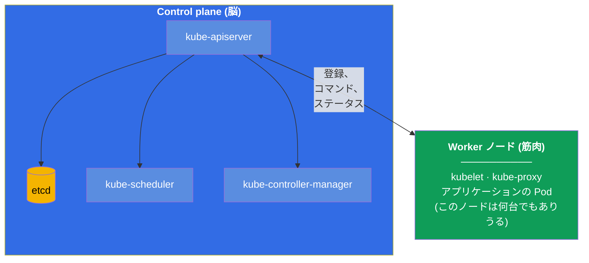
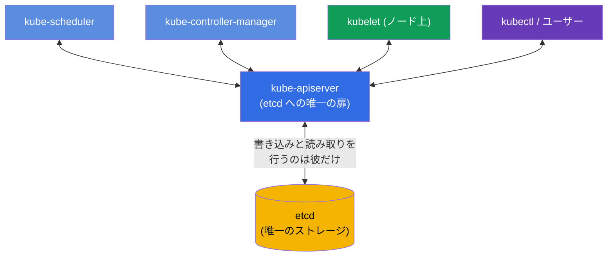
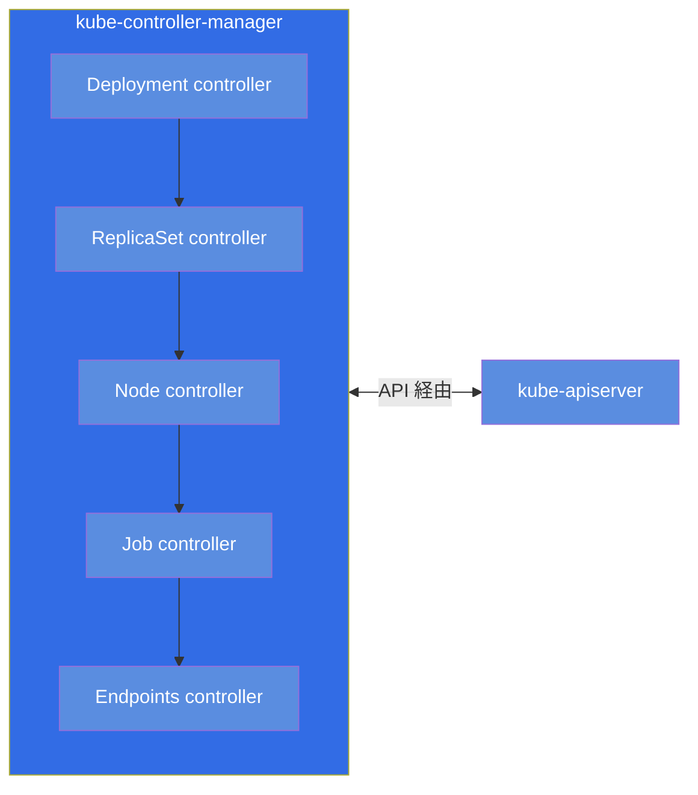
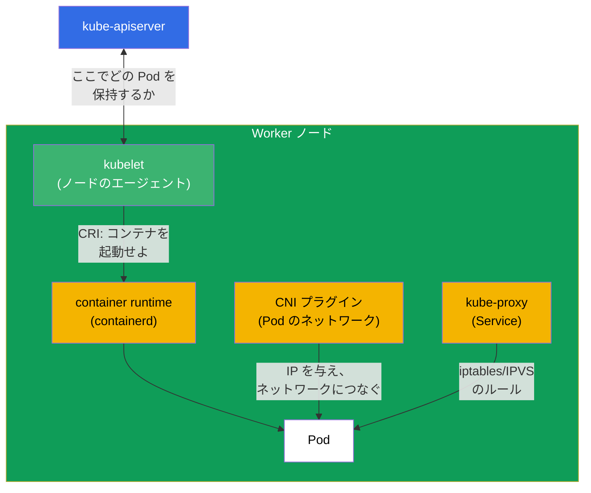
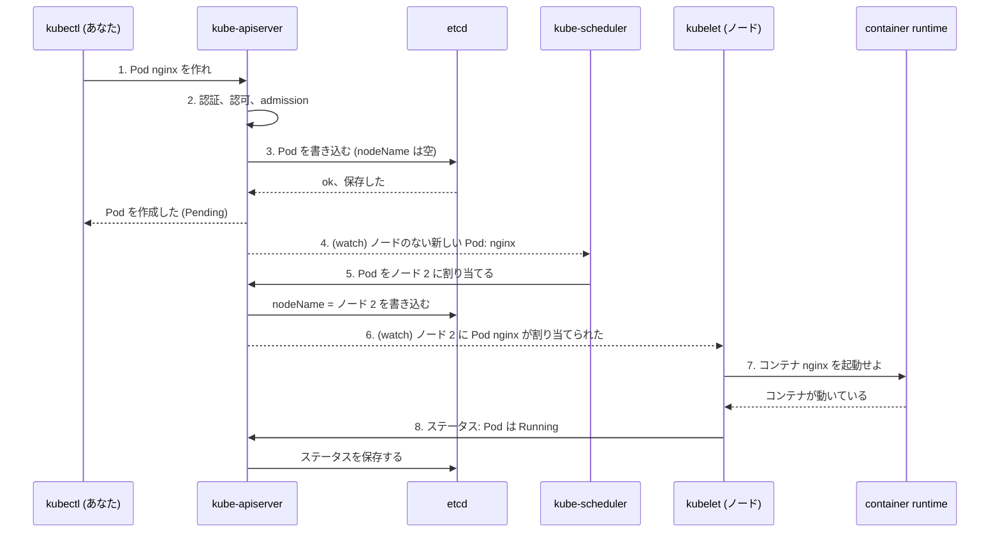
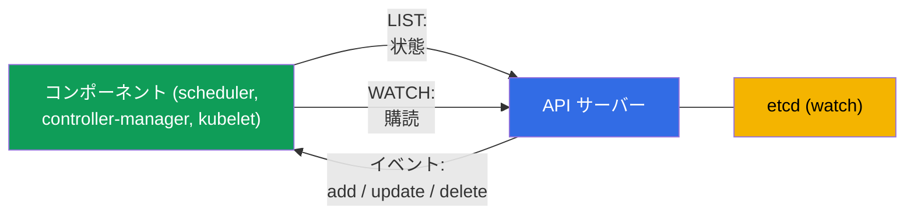
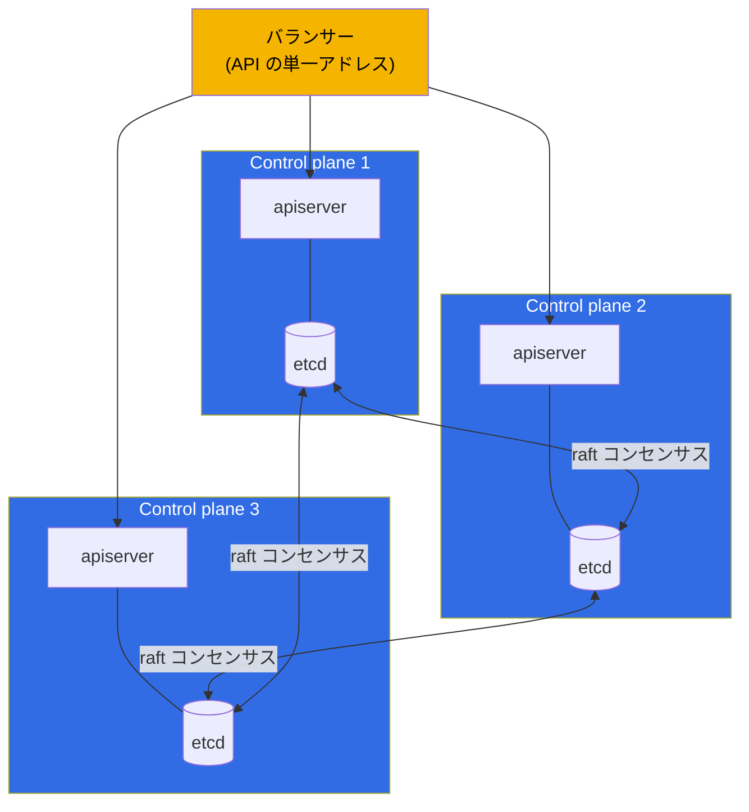

[Русская версия](ru.md) · [Eng version](README.md) · [Versión en español](es.md) · [Version française](fr.md) · [Deutsche Version](de.md) · [ქართული ვერსია](ge.md) · [繁體中文版](tw.md)

# 第 2 章。Kubernetes のアーキテクチャ：control plane と worker ノード

> **次は何か。** 第 1 章で、Kubernetes がクラスタの実際の状態を望ましい状態へ
> 近づけることを理解しました。今度は、それがどんな部品から組み立てられ、誰が実際に
> その仕事をしているのかを見ていきます。これはコース全体の土台です：アーキテクチャを
> 理解せずに、クラスタを意識して運用すること (CKA) も、その上でアプリケーションを
> きちんと動かすこと (CKAD) もできません。そして何より - troubleshooting 領域
> (CKA の 30%) は、どのコンポーネントが何を担当し、壊れたときにどこを見るのか、という
> 知識の上に丸ごと立っています。コマンドを使った演習は第 3 章から始まります。ここでは
> 頭の中にモデルを作ります。

## 2.1. クラスタを鳥の目で見る

Kubernetes クラスタとは、**ノード** (node) と呼ばれるマシン（物理でも仮想でも）の
集まりです。ノードは 2 種類に分かれます：

- **Control plane（管理層）** - クラスタの「脳」です。何をどこで動かすかを決め、状態を
  監視し、すべてのデータを保持します。ユーザーのアプリケーション自体は通常ここでは
  動かしません。
- **Worker ノード（作業ノード）** - クラスタの「筋肉」です。あなたのアプリケーションの
  コンテナは、まさにここで動きます。図では worker ノードは 1 つですが、実際のクラスタでは
  通常複数あります（数台から数百台まで）- どれも同じ構成で、API サーバー経由で
  control plane につながっています。

図のすべての矢印は `kube-apiserver` に集まります。これは偶然ではなく、Kubernetes の
もっとも重要なアーキテクチャ上のルールです - すぐそれに移りましょう。

> **重要（よくある誤解）。** ストレージ `etcd` と直接やり取りするのは
> **`kube-apiserver` だけ** です。その他のコンポーネント (scheduler、controller-manager、
> kubelet、kube-proxy) は etcd へ **行きません** - 状態の読み書きは API サーバー経由で
> 行います。etcd はコンポーネント間のバスではなく、apiserver という唯一の「扉」の
> 向こうにあるバックエンドストレージです。これは公式ドキュメントから直接読み取れます：
> etcd は「API サーバーのすべてのデータのための」ストレージとして説明されており
> ([Kubernetes Components](https://kubernetes.io/docs/concepts/overview/components/))、
> HA トポロジーでは etcd のメンバーは自分のノードの「kube-apiserver とだけ通信する」と
> あります
> ([HA topology](https://kubernetes.io/docs/setup/production-environment/tools/kubeadm/ha-topology/))。
>
> **では scheduler は新しい Pod をどうやって知るのか。** etcd からではありません。
> コンポーネントは API サーバー経由で変更を **購読** します - **watch** (list-watch)
> という仕組みです。Pod が作られると、apiserver はそれを etcd に保存し、その場で
> 購読者へイベントを配信します。scheduler は「`nodeName` のない Pod が現れた」のを見て
> ノードを選び、決定 (binding) を **apiserver 経由で書き戻します**。apiserver はそれを
> etcd に保存し、該当ノードの kubelet に通知します - kubelet も自分の watch で
> その Pod を知ります。このようにやり取りはすべて apiserver を通り、etcd はその後ろに
> 留まります。watch の仕組みは第 3 章で詳しく見ます。
>
> **この神話はどこから来たか。** 歴史的な根があります：Kubernetes の初期バージョン
> (1.0 より前、2014-2015 年) では、コンポーネントは実際に etcd へ直接行っていました -
> kubelet は自分の Pod を etcd から読み、scheduler は etcd のプリミティブ
> (`CompareAndSwap`、キーへの watch) でそれらを割り当てていました。1.0 のリリースまでに
> アーキテクチャは意図的に集約されました：apiserver が etcd への唯一の「扉」となり
> （認証/RBAC/admission の集中化、コンポーネントの疎結合、単一の真実の源）、すべてが
> API サーバーの watch へ移りました。多くの図で etcd が control plane の中央に描かれ、
> 見た目が「バス」に似ているせいで神話は生き続けています - 実際は apiserver の後ろの
> ストレージにすぎません。

## 2.2. もっとも重要なルール：すべては API サーバー経由で通信する

細部より先にこの原則を覚えてください：**Kubernetes のコンポーネントは互いに直接
話しません。通信は `kube-apiserver` を通してのみ行われます。** スケジューラは kubelet に
電話しませんし、コントローラは etcd へ直接入り込みません - みな API サーバーを通ります。
そして状態の唯一のストレージは etcd で、そこへのアクセスもまた API サーバー経由だけです。

なぜこうしたのでしょうか。大きな利点が 3 つあります：

- **制御の単一点。** 認証、認可 (RBAC)、マニフェストの検査 (admission) - すべてが
  1 か所、API サーバーの入口にあります。
- **疎結合。** コンポーネントは互いを知らないので、独立して交換もスケールもできます。
  新しいコントローラは、ただ API に「つながる」だけです。
- **単一の真実の源。** すべての状態は etcd にあり、それに触るのは API サーバーだけ。
  複数のストレージ間で同期がずれることがありません。

troubleshooting 向けの実践的な結論：**API サーバーが「落ちた」ら、クラスタ全体が
麻痺します。** `kubectl` は応答しなくなり、スケジューラは Pod を割り当てられず、
コントローラは何も直せません。だから深刻な問題のときに最初に確認するのは、
API サーバーが生きているか、その下の etcd が生きているかです。

## 2.3. control plane のコンポーネントを個別に

「脳」の各コンポーネントを見ていきましょう：何をするのか、どこにあるのか、どう確認するのか。

### kube-apiserver

クラスタの心臓であり、唯一の入口です。すべてのリクエスト（`kubectl` から、
コンポーネントから、コントローラから）を受け取り、検査し（認証 → 認可 →
admission）、状態を etcd から読み、etcd へ書きます。etcd と直接やり取りする唯一の
コンポーネントです。

- **何をするか：** すべての API リクエストを受け取り検証する、etcd を読み書きする。
- **どこにあるか：** static Pod、マニフェストは `/etc/kubernetes/manifests/kube-apiserver.yaml`。
- **落ちたら：** クラスタは制御不能になり、`kubectl` は動きません。

### etcd

分散 key-value ストレージです。ここにクラスタの **すべての** 状態が入っています：
あらゆる Pod、Service、Secret、ConfigMap - すべてが etcd のレコードです。etcd を失って
バックアップがなければ、クラスタは失われます。だから etcd のバックアップには専用の
第 37 章があります（そして CKA でよく出る課題です）。

- **何をするか：** クラスタの全状態を保存する (key-value)。
- **どこにあるか：** static Pod、マニフェストは `/etc/kubernetes/manifests/etcd.yaml`。
- **落ちたら：** API サーバーが状態を読み書きできず、クラスタは制御不能になります。

### kube-scheduler

スケジューラです。まだ **ノードが割り当てられていない** Pod（`nodeName` が空）を見て、
どのノードにその Pod を置くかを決めます。リソース (CPU/メモリが足りるか)、
taints/tolerations、affinity、nodeSelector やその他のルールを考慮します（これらは
すべて第 12-15 章）。重要：スケジューラは Pod の記述に **ノードを書き込むだけ** です。
Pod 自体を起動はしません - それをするのは kubelet です。

- **何をするか：** 新しい Pod のためにノードを選ぶ。
- **どこにあるか：** static Pod、`/etc/kubernetes/manifests/kube-scheduler.yaml`。
- **落ちたら：** 新しい Pod は `Pending` 状態で「ぶら下がり」、すでに動いているものは動き続けます。

### kube-controller-manager

1 つのプロセスで、その中に多数の **コントローラ** - 第 1 章のあの調整ループ - が
回っています。例：Deployment のコントローラ (ReplicaSet を作る)、ReplicaSet の
コントローラ (必要な Pod 数を保つ)、node コントローラ (死んだノードに気づく)、
job コントローラ、その他数十。それぞれのコントローラは自分の担当する種類の
オブジェクトを監視し、現実を望ましい状態へ近づけます。

- **何をするか：** すべての種類のオブジェクトのためにコントローラ（調整ループ）を動かす。
- **どこにあるか：** static Pod、`/etc/kubernetes/manifests/kube-controller-manager.yaml`。
- **落ちたら：** クラスタは「自己修復」しなくなります（レプリカを復元しない、
  死んだノードに気づかない）。

### cloud-controller-manager（任意）

クラウドと連携するための独立したコントローラマネージャです：LoadBalancer タイプの
Service のためにクラウドのバランサーを作り、ノードにゾーンのラベルを付け、
クラウドのディスクを管理します。クラウドで動くクラスタ (EKS、GKE、AKS) にだけあります。

## 2.4. worker ノードのコンポーネント

次は「筋肉」です。すべてのノード（Pod の起動が許可されているなら control plane も
含めて）でこれらのコンポーネントが動いています。

### kubelet

ノードの主要なエージェントです。API サーバーと通信し、このノードで動くべき Pod の
一覧を受け取り、それらが実際に動いているように見守ります：container runtime に
コンテナの起動/停止を命じ、その健康状態を監視し（プローブ）、ステータスを API サーバーへ
報告します。**kubelet は Pod ではなく、ノード自身の上のシステムサービスです。**

- **何をするか：** 自分のノードの Pod を起動し監視する、ステータスを報告する。
- **どこにあるか：** システムサービス (`systemctl status kubelet`)、Pod ではありません。
- **落ちたら：** ノードは `NotReady` になり、その上の Pod は管理されなくなります。

### kube-proxy

ノードのレベルで Kubernetes の Service のネットワーク的な魔法を担当します。あなたが
Service を作ると、kube-proxy は各ノードにルール (iptables または IPVS) を設定し、
Service の仮想 IP 宛てのトラフィックを実際の Pod へ転送します。ここでの負荷分散は
L4（コネクション）のレベルです。詳しくは第 7 章と第 31 章。

重要な点：**トラフィック自体は kube-proxy を通りません。** kube-proxy はパケットの経路上に
立っておらず、カーネルのルール (iptables/IPVS) を *設定する* だけで、トラフィックはその
あと kube-proxy を介さずに **直接** 流れます。つまり kube-proxy はノード上の Service の
ルールに対する「control plane」であり、「data plane」ではありません。ここから運用上の
重要な帰結が出てきます：

- kube-proxy が **落ちても** - すでに設定されたルールはカーネルに残り **動き続けます**：
  既存の Service は到達可能で、このノードの Pod からのトラフィックも途切れません。
  壊れるのはルールの **更新** だけです - kube-proxy が再び立ち上がるまで、新しい
  Service/Endpoints は追加されず、削除されたものも取り除かれません。
- そのため、ノード上での kube-proxy の **再起動やバージョン更新** はトラフィックにとって
  目立ちません：新しい Pod が起動する間も古いルールが有効で、コネクションは切れません。

- **何をするか：** ノード上で Service のための iptables/IPVS ルールを設定する（トラフィックは彼を通らない）。
- **どこにあるか：** 通常は namespace `kube-system` の DaemonSet (`kubectl get ds -n kube-system`)。
- **落ちたら：** 既存のルールは動き、Service は到達可能。復旧するまで変更（新しい/削除された
  Service と Endpoints）だけが適用されなくなります。

> **細かい点。** 現代的なクラスタでは kube-proxy が存在しないこともあります：一部の CNI
> （たとえば kube-proxy replacement モードの Cilium）が eBPF でこの仕事を引き受けます。
> ただし試験のためには kube-proxy のある古典的な構成を頭に置いておきます。

### Container runtime

まさにコンテナを起動するものです。Kubernetes はコンテナを自分で起動せず、標準の
インターフェース **CRI** (Container Runtime Interface) を通して実行環境へ委譲します。
よく使われる環境：**containerd**（現在の主な選択肢）、**CRI-O**。実行環境としての Docker は
Kubernetes から取り除かれました (dockershim は 1.24 で削除)。ノード上のコンテナの診断は
`crictl` というユーティリティで行います。

- **何をするか：** 実際にコンテナを起動・停止する (kubelet の指示で)。
- **どこにあるか：** ノード上のシステムサービス (`containerd`)、診断は `crictl` 経由。
- **落ちたら：** kubelet がコンテナを起動できず、そのノードで Pod は起動しません。

### CNI プラグイン

Pod のネットワークを提供します：各 Pod に IP アドレスを与え、どの Pod からどの Pod へも
IP で到達できるようにノードをまたいで Pod をつなぎます。標準 **CNI**
(Container Network Interface) を通して実装されます。よく使われるプラグイン：**Calico**、
**Cilium**、**Flannel**、**Weave**。ネットワークの詳細は第 30 章。

## 2.5. Pod を作ったとき何が起きるか

生きた例で全部を組み合わせましょう。あなたが `kubectl run nginx --image=nginx` を
実行しました。クラスタの内部では、順を追って何が起きるのでしょうか：

論理を追ってください：**誰も誰かと直接話していません。** スケジューラは Pod のことを
`kubectl` から聞いたのでも、誰かに問い合わせて知ったのでもありません - watch で
API サーバーを **購読** していて、apiserver が **自分から**「ノードのない Pod が現れた」
というイベントを送ってきたのです。kubelet も同じように自分の Pod を知りました -
API サーバーへの watch を通してです（Pod がこのノードに割り当てられたとき、apiserver が
通知しました）。どのステップも唯一の扉を通した書き込みか読み取りで、通知は watch の
イベントで届きます（詳細は 2.6）。Kubernetes の疎結合なアーキテクチャ全体がまさにこう
動いており、まさにこの理解が診断の基礎になります：連鎖を知っていれば、どこで壊れたかも
分かります。

## 2.6. コンポーネントはどうやって変更を追うのか：watch と楽観的ロック

すべてが API サーバー経由でのみ通信する (2.2) なら、疑問が生じます：scheduler や
コントローラは、新しい Pod が現れたことをどうやって知るのか - ループで API に
問い合わせるのか。いいえ。仕組みはもっと効率的で、Kubernetes の反応性すべての基礎に
なっています。

- **list-watch。** コンポーネントはまず **LIST** を行い（現在の状態を取得し）、続いて
  **WATCH** を開きます - 長く生きるストリームで、API サーバーはそこへ **変更** だけを
  送ってきます（オブジェクトが作られた/変わった/削除された）。ループでの問い合わせは
  ありません - 安価でほぼ即時です。こうして scheduler は `Pending` の Pod を知り、
  kubelet は自分のノードの Pod を知ります。
- **informer。** コントローラは **informer** というライブラリを使います - これは
  オブジェクトのローカルキャッシュで、watch を通して最新の状態に保たれます。
  コントローラはキャッシュのイベントに反応し、いちいち API を叩きません - だから
  コントローラはスケールします。
- **resourceVersion。** どのオブジェクトにもバージョン (`metadata.resourceVersion`) が
  あります。watch は切断のあと特定のバージョンから「続行」できます - 変更を失いません。
- **楽観的ロック。** オブジェクトを更新するとき、クライアントはその `resourceVersion` を
  送ります。オブジェクトがすでに変わっていれば（バージョンが一致しなければ）、
  API サーバーは書き込みを **409 Conflict** で拒否します - クライアントはオブジェクトを
  読み直して再試行します。こうして 2 つの書き込みが互いを上書きしません。だからこそ
  コントローラや `kubectl apply` は操作を再試行でき、競合で壊れないのです。

> **watch はネットワークのレベルでどう作られているか。** これはマルチキャストでも
> ポーリングでもなく、普通の **TCP/TLS 上の HTTP による unicast 接続** です（既定では
> HTTP/2）。クライアントは長く生きるリクエストを 1 つ開き (`GET ...?watch=true`)、
> API サーバーは **応答を閉じずに**、そこへイベント - `WatchEvent` オブジェクト
> (`ADDED`/`MODIFIED`/`DELETED`/`BOOKMARK`) - を 1 行ずつ **ストリーム** します。
> クライアントごとに自分の接続があります：apiserver 自身が etcd を「見て」、変更を
> メモリに保持し (**watch cache**)、RBAC とセレクタを考慮しながら接続中のすべての
> クライアントへ **配信** します (fan-out) - だからマルチキャストは不要です（それでは
> TLS/認可も、信頼性も、クライアントごとのフィルタリングも得られません）。切断のとき
> クライアントは保存した `resourceVersion` から watch を開き直し、変更を失いません。
> そして定期的な `BOOKMARK` イベントがこのバージョンを前に進めます。

これは **調整ループ**（第 1 章）の技術的な裏側です：コントローラは watch を通して
望ましい状態と実際の状態の差を見て、それを解消します。そして楽観的ロックが、多数の
コントローラが並行して働くときの正しさを保証します。

## 2.7. どのコンポーネントをどこで探すか（troubleshooting のための地図）

この表は暗記する価値があります - CKA の troubleshooting 領域で大量の時間を節約します。

| コンポーネント | 種類 | どこを探すか / どう確認するか |
|-----------|-----|-----------------------------|
| kube-apiserver | static Pod | `/etc/kubernetes/manifests/kube-apiserver.yaml`; `kubectl get pods -n kube-system` |
| etcd | static Pod | `/etc/kubernetes/manifests/etcd.yaml` |
| kube-scheduler | static Pod | `/etc/kubernetes/manifests/kube-scheduler.yaml` |
| kube-controller-manager | static Pod | `/etc/kubernetes/manifests/kube-controller-manager.yaml` |
| kubelet | システムサービス | `systemctl status kubelet`; `journalctl -u kubelet` |
| kube-proxy | DaemonSet | `kubectl get ds -n kube-system` |
| CoreDNS | Deployment | `kubectl get deploy -n kube-system` |
| container runtime | システムサービス | `systemctl status containerd`; `crictl ps` |
| CNI | プラグイン | `ls /etc/cni/net.d/`; `kube-system` の CNI の Pod |

はっきり頭に入れておくべき重要な違い：

- **control plane のコンポーネント (apiserver、etcd、scheduler、controller-manager)** は
  kubeadm クラスタでは **static Pod** として起動します - マニフェストは
  `/etc/kubernetes/manifests/` にあり、API サーバーが動き出す前から kubelet が
  ローカルに立ち上げます。ファイルを直せば、kubelet が自動で Pod を作り直します。
- **kubelet と container runtime** は **システムサービス**（Pod ではありません）で、
  `systemctl` で管理し、`journalctl` にログが出ます。

static Pod については第 15 章で詳しく話し、kubeadm でのインストールについては
第 35 章で話します。

## 2.8. control plane の高可用性

学習用クラスタでは control plane は通常 1 つです。本番ではそうはいきません：唯一の
control plane が死んだら、クラスタは制御不能になります。だから実際のクラスタでは
control plane を複数（通常 3 つ）用意し、その API サーバーの前にバランサーを置きます。

etcd についての細かい点：etcd のノードはクラスタを形成し、コンセンサスプロトコル
**raft** で互いに合意します。決定にはクォーラム（過半数）が必要なので、ノード数は
**奇数** にします (3、5)。3 ノードは 1 台の喪失に耐え、5 ノードは 2 台に耐えます。
API サーバーは互いに対等で、バランサーは単にリクエストをそれらの間へ振り分けるだけです。

## 2.9. 本番環境でこれをどう使うか

アーキテクチャの理論は抽象論ではなく、実際の判断が立つ土台です。

- **マネージドクラスタ (EKS/GKE/AKS)。** クラウドでは control plane は渡されません -
  プロバイダが管理し、あなたは API サーバーの endpoint だけを受け取り、管理に対して
  お金を払います。あなたが責任を持つのは worker ノードだけです。これは etcd の保守と
  control plane のアップグレードの痛みを取り除きますが、同時に control plane の
  static Pod へのアクセスも奪います - 多くの「CKA 的な課題」はそこでは単に実行できません。
  だから CKA の準備には EKS ではなく self-managed クラスタ (kubeadm) が必要です。
- **ノードの役割の分離。** 本番では control plane を taint
  `node-role.kubernetes.io/control-plane:NoSchedule` で閉じ、ユーザーのアプリケーションが
  そこへ入って「脳」の仕事を邪魔しないようにします。アプリケーションは worker ノードに
  だけ住みます。
- **etcd はもっとも価値ある資産。** 経験のあるチームは etcd をスケジュールに従って
  バックアップし、スナップショットをクラスタとは別に保管します。バックアップなしの
  etcd の喪失 = クラスタの喪失。etcd の下のディスクレイテンシも個別に監視します -
  etcd はそれに非常に敏感です。
- **HA は当たり前。** どの本番クラスタも、バランサーの後ろに最低 3 つの control plane と、
  クォーラムのための奇数個の etcd ノードを持ちます。control plane が 1 つで許されるのは
  dev/学習用の環境だけです。
- **インシデントの診断。**「すべては API サーバーを通り、状態は etcd にある」という理解は、
  当番のエンジニアが最初に使うものです：`kubectl` が応答しない → API サーバーと etcd を
  見る。Pod が Pending でぶら下がる → scheduler を見る。ノードが NotReady → その上の
  kubelet と runtime を見る。

## 2.10. ミニ用語集

- **ノード (node)** - クラスタを構成するマシン (VM または物理)。
- **Control plane** - クラスタの管理層（脳）：apiserver、etcd、scheduler、
  controller-manager。
- **Worker ノード** - アプリケーションの Pod が起動する作業ノード。
- **kube-apiserver** - すべてのリクエストが通る単一の入口。etcd に書き込む唯一の
  存在です。
- **etcd** - クラスタの全状態を保持する分散 key-value ストレージ。
- **kube-scheduler** - Pod をノードに割り当てます。
- **kube-controller-manager** - コントローラ（調整ループ）の集合。
- **kubelet** - ノードのエージェント。Pod を起動し監視する、システムサービス。
- **kube-proxy** - ノード上で iptables/IPVS によって Service を実現します。
- **container runtime** - コンテナの実行環境 (containerd)、CRI で通信します。
- **CNI** - Pod のネットワークのインターフェースとプラグイン (Calico、Cilium など)。
- **static Pod** - スケジューラを介さず、`/etc/kubernetes/manifests/` のマニフェストから
  kubelet が直接立ち上げる Pod。
- **raft** - etcd のノードが合意するためのコンセンサスプロトコル。
- **list-watch** - 変更を追うパターン：LIST + WATCH のストリーム（問い合わせなし）。
- **informer** - コントローラのオブジェクトのローカルキャッシュ。watch で同期されます。
- **resourceVersion** - オブジェクトのバージョン。watch はそこから続き、楽観的ロックの基礎です。
- **楽観的ロック** - 古いバージョンでの書き込みは拒否される (409 Conflict) → 再試行。

## 2.11. 本章のまとめ

- クラスタ = control plane（脳）+ worker ノード（筋肉）。アプリケーションの Pod は
  worker ノードに住みます。
- もっとも重要なルール：コンポーネントは直接通信せず、`kube-apiserver` 経由だけ。
  状態の唯一のストレージは etcd で、それに触るのは API サーバーだけです。
- Control plane：apiserver（単一の扉）、etcd（ストレージ）、scheduler（ノードの選択）、
  controller-manager（調整ループ）。クラウドではさらに cloud-controller-manager。
- Worker ノード：kubelet（エージェント、システムサービス）、kube-proxy（Service）、
  container runtime（CRI でコンテナを起動）、CNI（Pod のネットワーク）。
- Pod の作成は API サーバーを通した読み書きの連鎖です：apiserver → etcd →
  scheduler がノードを割り当てる → kubelet が runtime で起動する → ステータスが戻る。
- コンポーネントは **list-watch**（問い合わせなし）で変更を追い、コントローラは
  informer のキャッシュを使います。並行する書き込みは楽観的ロックが守ります
  (resourceVersion → 409 Conflict → 再試行)。
- troubleshooting のために、どのコンポーネントがどこにあるかを覚えてください：
  control plane は `/etc/kubernetes/manifests/` の static Pod、kubelet と runtime は
  システムサービス (`systemctl`、`journalctl`、`crictl`)。
- 本番では control plane を HA にします（バランサーの後ろに 3 ノード、raft の
  クォーラムのために etcd は奇数個）。そして etcd は入念にバックアップします。

## 2.12. これがどう役に立つか：試験と実際の仕事で

**試験では。** 直接の課題：「control plane を直せ」(CKA、troubleshooting 30%) -
マニフェストが `/etc/kubernetes/manifests/` にあることと、コンポーネントのログの
読み方を知っている必要があります。「Pod が Pending でぶら下がる」- すぐ scheduler を
考えます。「ノードが NotReady」- kubelet と runtime を考えます。2.7 節のコンポーネントの
地図なしには、これらの課題は与えられた時間内に解けません。CKAD ではアーキテクチャは
あまり問われませんが、「Pod は kubelet が起動し、ネットワークは CNI が与え、Service は
kube-proxy が担う」という理解はアプリケーションのデバッグに必要です。

**実際の仕事では。** これはエンジニアがどんなインシデントでも切り分けに使うモデルです：
制御不能なクラスタ → apiserver/etcd。Pod がスケジュールされない → scheduler。特定の
ノードが外れた → そのノードの kubelet/runtime。Service までトラフィックが届かない →
kube-proxy/CNI。同じ知識の骨格が、アーキテクチャ上の判断も決めます：control plane を
いくつ持つか、etcd をどこにバックアップするか、なぜアプリケーションを control plane に
置かないのか。

## 2.13. 自己チェックの質問

1. Kubernetes のすべてのコンポーネントは API サーバー経由でのみ通信すると言われるのは
   なぜですか。それは何をもたらしますか。
2. etcd と直接やり取りする唯一のコンポーネントは何ですか。なぜそれが重要ですか。
3. kube-scheduler が落ちたら、新しい Pod とすでに動いている Pod には何が起きますか。
4. control plane のコンポーネントの起動方法は、kubelet や container runtime とどう
   違いますか。それぞれはどこで探しますか。
5. `kubectl run nginx --image=nginx` のあとクラスタで何が起きるか、順を追って説明して
   ください。
6. etcd のノードはなぜ奇数個にするのですか。クォーラムとは何ですか。
7. なぜ CKA の準備に EKS のようなマネージドクラスタは向かないのですか。
8. コンポーネントは API に問い合わせずにどうやって変更を知るのですか (list-watch)。
   informer とは何ですか。
9. 楽観的ロックとは何ですか。書き込みのときに `resourceVersion` は何のために必要ですか。

## 演習

クラスタを使った実践は次の章から始めます。そこで `kubectl` と、オブジェクトを管理する
2 つのアプローチを身につけます。この章で学んだクラスタの構造は、少しあとで実物として
見ることになります：出来上がったクラスタで `/etc/kubernetes/manifests/` を覗いて
control plane のコンポーネントのステータスを確認できます。そしてクラスタをゼロから
自分の手で組み立てるのは (`kubeadm init` + CNI + `join`) 第 35 章、インストールを
扱うときです。

---
[目次](../README_JP.md) · [第 1 章](../01/jp.md) · [第 3 章](../03/jp.md)
