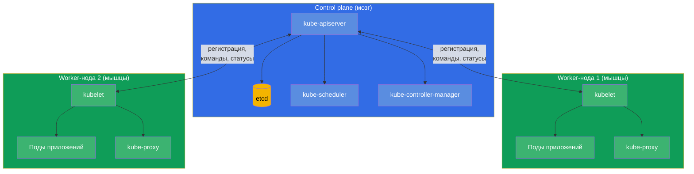
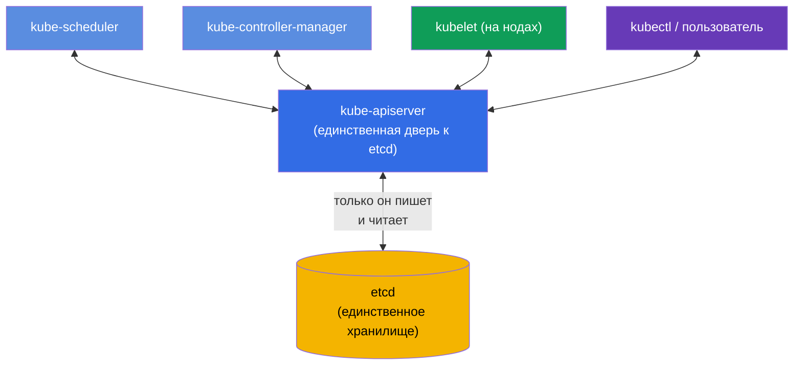
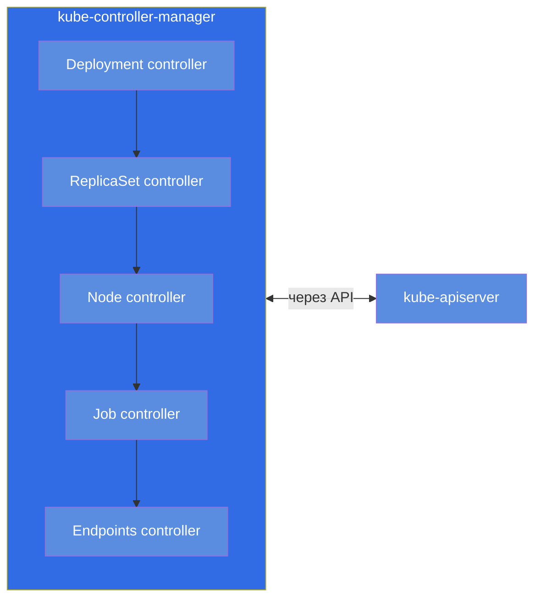
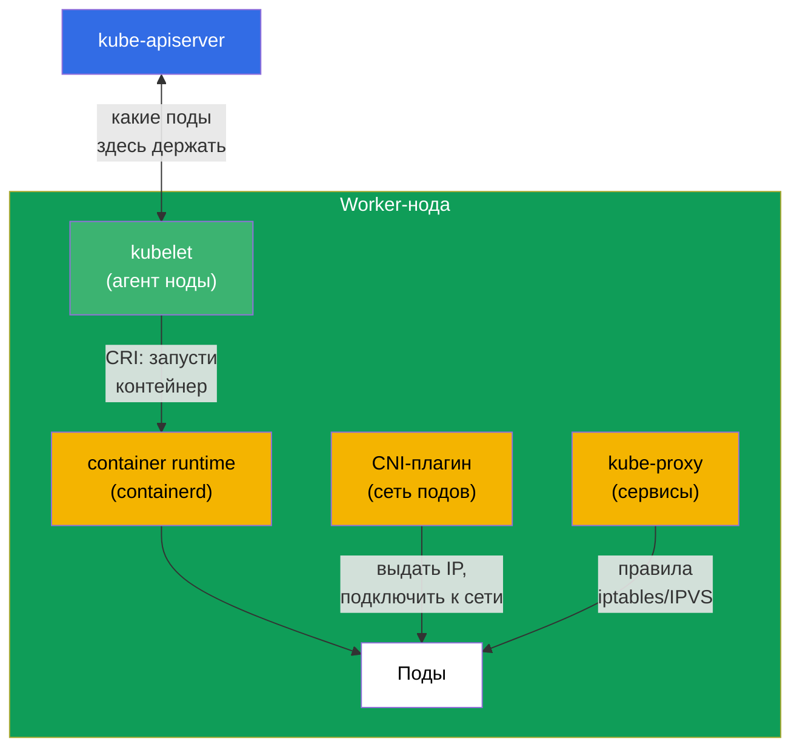
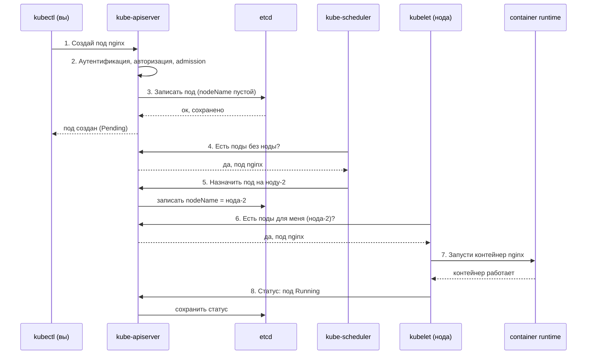
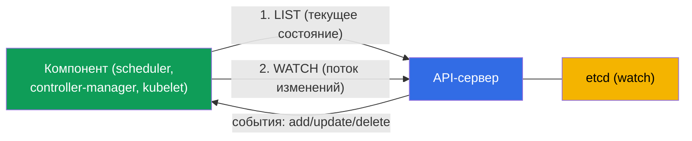
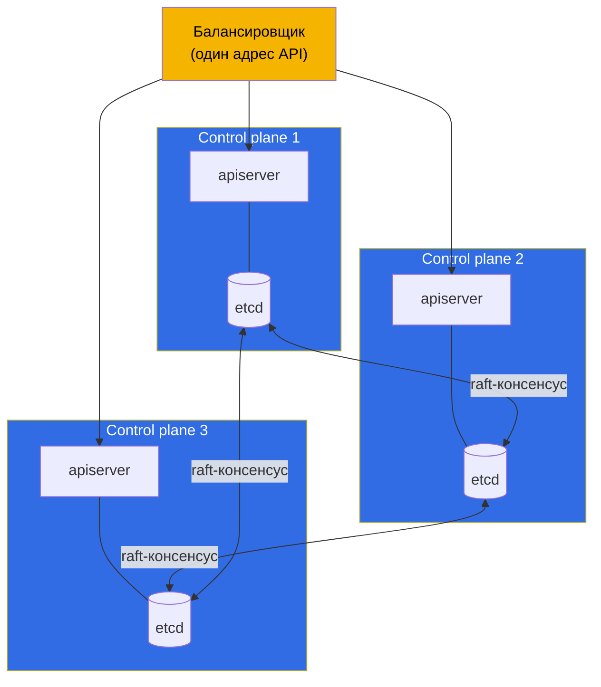

# Глава 2. Архитектура Kubernetes: control plane и worker-ноды

> **Что дальше.** В первой главе мы поняли, что Kubernetes приводит реальное
> состояние кластера к желаемому. Теперь разберёмся, из каких деталей он собран и кто
> именно выполняет эту работу. Это фундамент всего курса: без понимания архитектуры
> нельзя ни осознанно администрировать кластер (CKA), ни грамотно запускать в нём
> приложения (CKAD). А главное - домен troubleshooting (30% CKA) целиком стоит на
> знании того, какой компонент за что отвечает и где его искать, когда он сломался.
> Практика с командами начнётся в главе 3; здесь мы строим модель в голове.

## 2.1. Кластер с высоты птичьего полёта

Kubernetes-кластер - это набор машин (физических или виртуальных), которые называются
**нодами** (node, узел). Ноды делятся на два типа:

- **Control plane (управляющий слой)** - «мозг» кластера. Принимает решения:
  что где запускать, следит за состоянием, хранит все данные. Сам пользовательские
  приложения обычно не гоняет.
- **Worker-ноды (рабочие узлы)** - «мышцы» кластера. Именно на них запускаются ваши
  контейнеры с приложениями.

Все стрелки на схеме сходятся к `kube-apiserver`. Это не случайность, а главное
архитектурное правило Kubernetes, к которому мы сейчас перейдём.

## 2.2. Главное правило: всё общается через API-сервер

Запомните этот принцип раньше всех деталей: **компоненты Kubernetes не разговаривают
друг с другом напрямую. Они общаются только через `kube-apiserver`.** Планировщик не
звонит kubelet, контроллер не лезет в etcd напрямую - все идут через API-сервер, а
единственное хранилище состояния - etcd, доступное тоже только через API-сервер.

Почему так сделано? Это даёт три больших плюса:

- **Единая точка контроля.** Аутентификация, авторизация (RBAC), проверка манифестов
  (admission) - всё в одном месте, на входе в API-сервер.
- **Слабая связанность.** Компоненты не знают друг о друге, их можно менять и
  масштабировать независимо. Любой новый контроллер просто «подключается» к API.
- **Единый источник правды.** Всё состояние - в etcd, и только API-сервер его трогает.
  Нет рассинхрона между несколькими хранилищами.

Практический вывод для troubleshooting: **если «лёг» API-сервер - парализован весь
кластер.** `kubectl` перестаёт отвечать, планировщик не может назначать поды,
контроллеры не могут ничего исправлять. Поэтому первое, что проверяют при серьёзных
проблемах, - жив ли API-сервер и жив ли etcd под ним.

## 2.3. Компоненты control plane по отдельности

Разберём каждый компонент «мозга»: что делает, где лежит, как проверить.

### kube-apiserver

Сердце кластера и единственная точка входа. Принимает все запросы (от `kubectl`, от
компонентов, от контроллеров), проверяет их (аутентификация → авторизация →
admission), читает и пишет состояние в etcd. Это единственный компонент, который
напрямую работает с etcd.

- **Что делает:** принимает и валидирует все API-запросы, читает/пишет etcd.
- **Где живёт:** статический под, манифест `/etc/kubernetes/manifests/kube-apiserver.yaml`.
- **Если упал:** кластер неуправляем, `kubectl` не работает.

### etcd

Распределённое ключ-значение хранилище. В нём лежит **всё** состояние кластера: каждый
под, сервис, секрет, конфиг - всё это записи в etcd. Если etcd потерян и нет бэкапа -
кластер потерян. Поэтому резервному копированию etcd посвящена отдельная глава 37 (и
это частое задание на CKA).

- **Что делает:** хранит всё состояние кластера (key-value).
- **Где живёт:** статический под, манифест `/etc/kubernetes/manifests/etcd.yaml`.
- **Если упал:** API-сервер не может читать/писать состояние - кластер неуправляем.

### kube-scheduler

Планировщик. Смотрит на поды, у которых ещё **не назначена нода** (`nodeName` пустой),
и решает, на какую ноду каждый под поставить. Учитывает ресурсы (хватает ли CPU/памяти),
taints/tolerations, affinity, nodeSelector и другие правила (всё это - главы 12-15).
Важно: планировщик **только проставляет ноду** в описании пода. Сам под не запускает -
это делает kubelet.

- **Что делает:** выбирает ноду для новых подов.
- **Где живёт:** статический под, `/etc/kubernetes/manifests/kube-scheduler.yaml`.
- **Если упал:** новые поды «висят» в статусе `Pending`, уже запущенные работают.

### kube-controller-manager

Один процесс, внутри которого крутится множество **контроллеров** - тех самых петель
согласования из главы 1. Примеры: контроллер деплойментов (создаёт ReplicaSet),
контроллер репликасетов (держит нужное число подов), node-контроллер (замечает
умершие ноды), job-контроллер и десятки других. Каждый контроллер следит за своим
типом объектов и приводит реальность к желаемому.

- **Что делает:** запускает контроллеры (петли согласования) для всех типов объектов.
- **Где живёт:** статический под, `/etc/kubernetes/manifests/kube-controller-manager.yaml`.
- **Если упал:** кластер перестаёт «самоисправляться» (не восстанавливает реплики,
  не замечает мёртвые ноды).

### cloud-controller-manager (опционально)

Отдельный менеджер контроллеров для интеграции с облаком: создаёт облачные
балансировщики для сервисов типа LoadBalancer, размечает ноды по зонам, управляет
облачными дисками. Есть только в кластерах, запущенных в облаке (EKS, GKE, AKS).

## 2.4. Компоненты worker-ноды

Теперь «мышцы». На каждой ноде (включая control plane, если на нём тоже разрешено
запускать поды) работают эти компоненты.

### kubelet

Главный агент ноды. Общается с API-сервером, получает список подов, которые должны
работать на этой ноде, и следит, чтобы они действительно работали: командует
container runtime запустить/остановить контейнеры, следит за их здоровьем (пробы),
докладывает статус обратно в API-сервер. **kubelet - это не под, а системный сервис**
на самой ноде.

- **Что делает:** запускает и следит за подами на своей ноде, докладывает статус.
- **Где живёт:** системный сервис (`systemctl status kubelet`), не под.
- **Если упал:** нода уходит в `NotReady`, поды на ней не управляются.

### kube-proxy

Отвечает за сетевую магию Kubernetes-сервисов на уровне ноды. Когда вы создаёте
Service, kube-proxy настраивает на каждой ноде правила (iptables или IPVS), которые
перенаправляют трафик, адресованный виртуальному IP сервиса, на реальные поды.
Балансировка тут на уровне L4 (соединения). Подробно - в главах 7 и 31.

- **Что делает:** реализует Service через iptables/IPVS на ноде.
- **Где живёт:** обычно DaemonSet в namespace `kube-system` (`kubectl get ds -n kube-system`).
- **Если упал:** ломается доступ к сервисам через их ClusterIP.

> **Нюанс.** В современных кластерах kube-proxy может отсутствовать: некоторые CNI
> (например, Cilium в режиме kube-proxy replacement) берут эту работу на себя через
> eBPF. Но для экзамена держим в голове классическую схему с kube-proxy.

### Container runtime

Собственно то, что запускает контейнеры. Kubernetes не запускает контейнеры сам - он
делегирует это среде исполнения через стандартный интерфейс **CRI** (Container Runtime
Interface). Популярные среды: **containerd** (сейчас основной выбор), **CRI-O**. Docker
как среда исполнения из Kubernetes убран (dockershim удалён в 1.24). Диагностируют
контейнеры на ноде утилитой `crictl`.

- **Что делает:** реально запускает и останавливает контейнеры (по команде kubelet).
- **Где живёт:** системный сервис на ноде (`containerd`), диагностика через `crictl`.
- **Если упал:** kubelet не может запускать контейнеры, поды на ноде не стартуют.

### CNI-плагин

Обеспечивает сеть подов: выдаёт каждому поду IP-адрес и связывает поды между нодами
так, чтобы любой под мог достучаться до любого другого по IP. Реализуется через
стандарт **CNI** (Container Network Interface). Популярные плагины: **Calico**,
**Cilium**, **Flannel**, **Weave**. Подробно про сеть - в главе 30.

## 2.5. Что происходит, когда вы создаёте под

Соберём всё вместе на живом примере. Вы выполнили `kubectl run nginx --image=nginx`.
Что происходит внутри кластера по шагам:

Проследите логику: **никто ни с кем не говорит напрямую**. Планировщик узнал о поде
не от `kubectl`, а спросив API-сервер. kubelet узнал о своём поде тоже у API-сервера.
Каждый шаг - это запись или чтение через единственную дверь. Именно так работает вся
слабо связанная архитектура Kubernetes, и именно это понимание лежит в основе
диагностики: зная цепочку, вы знаете, где искать поломку.

## 2.6. Как компоненты следят за изменениями: watch и оптимистичная блокировка

Раз всё общается только через API-сервер (2.2), возникает вопрос: как scheduler или
контроллер узнают, что появился новый под, - опрашивают API в цикле? Нет. Механизм
эффективнее и лежит в основе всей реактивности Kubernetes.

- **list-watch.** Компонент сначала делает **LIST** (забирает текущее состояние), затем
  открывает **WATCH** - долгоживущий поток, по которому API-сервер присылает только
  **изменения** (создан/изменён/удалён объект). Опроса в цикле нет - это дёшево и почти
  мгновенно. Так scheduler узнаёт о `Pending`-подах, а kubelet - о подах для своей ноды.
- **informer.** Контроллеры используют библиотеку **informer** - это локальный кэш
  объектов, который держится в актуальном состоянии через watch. Контроллер реагирует на
  события из кэша, а не дёргает API на каждый чих - поэтому контроллеры масштабируются.
- **resourceVersion.** У каждого объекта есть версия (`metadata.resourceVersion`). watch
  можно «продолжить» с определённой версии после разрыва - не теряя изменения.
- **Оптимистичная блокировка.** При обновлении объекта клиент отправляет его
  `resourceVersion`. Если объект уже изменился (версия не совпала), API-сервер отклоняет
  запись с **409 Conflict** - клиент перечитывает объект и повторяет. Так две записи не
  затирают друг друга. Именно поэтому контроллеры и `kubectl apply` умеют повторять
  операции, а не ломаются на гонках.

Это техническая изнанка **петли согласования** (глава 1): контроллеры через watch видят
разницу между желаемым и реальным и устраняют её, а оптимистичная блокировка обеспечивает
корректность при параллельной работе многих контроллеров.

## 2.7. Где какой компонент искать (карта для troubleshooting)

Эту таблицу стоит выучить наизусть - на CKA она экономит кучу времени в домене
troubleshooting.

| Компонент | Тип | Где искать / как проверить |
|-----------|-----|-----------------------------|
| kube-apiserver | статический под | `/etc/kubernetes/manifests/kube-apiserver.yaml`; `kubectl get pods -n kube-system` |
| etcd | статический под | `/etc/kubernetes/manifests/etcd.yaml` |
| kube-scheduler | статический под | `/etc/kubernetes/manifests/kube-scheduler.yaml` |
| kube-controller-manager | статический под | `/etc/kubernetes/manifests/kube-controller-manager.yaml` |
| kubelet | системный сервис | `systemctl status kubelet`; `journalctl -u kubelet` |
| kube-proxy | DaemonSet | `kubectl get ds -n kube-system` |
| CoreDNS | Deployment | `kubectl get deploy -n kube-system` |
| container runtime | системный сервис | `systemctl status containerd`; `crictl ps` |
| CNI | плагин | `ls /etc/cni/net.d/`; поды CNI в `kube-system` |

Ключевое различие, которое надо чётко держать в голове:

- **Компоненты control plane (apiserver, etcd, scheduler, controller-manager)** в
  kubeadm-кластере запускаются как **статические поды** - их манифесты лежат в
  `/etc/kubernetes/manifests/`, и их поднимает kubelet локально, ещё до того как
  заработает API-сервер. Правишь файл - kubelet автоматически пересоздаёт под.
- **kubelet и container runtime** - это **системные сервисы** (не поды), управляются
  через `systemctl` и логируются в `journalctl`.

Про статические поды подробно поговорим в главе 15, а про kubeadm-установку - в
главе 35.

## 2.8. Высокая доступность control plane

В учебном кластере control plane обычно один. В проде так нельзя: если единственный
control plane умрёт, кластер станет неуправляемым. Поэтому в реальных кластерах
control plane делают в нескольких экземплярах (обычно 3), а перед их API-серверами
ставят балансировщик.

Тонкость про etcd: узлы etcd образуют кластер и договариваются между собой по протоколу
консенсуса **raft**. Для принятия решений нужен кворум (большинство), поэтому число
узлов берут **нечётным** (3, 5). Три узла переживают потерю одного, пять - двух.
API-серверы при этом равноправны - балансировщик просто раскидывает запросы между
ними.

## 2.9. Как это применяют в продакшене

Теория архитектуры - не абстракция, а то, на чём стоят реальные решения.

- **Управляемые кластеры (EKS/GKE/AKS).** В облаке control plane вам не отдают - им
  управляет провайдер, вы получаете только endpoint API-сервера и платите за
  управление. Вы отвечаете лишь за worker-ноды. Это снимает боль обслуживания etcd и
  апгрейдов control plane, но и лишает доступа к статическим подам control plane -
  многие «CKA-задачи» там просто недоступны. Поэтому для подготовки к CKA нужен
  self-managed кластер (kubeadm), а не EKS.
- **Разделение ролей нод.** В проде control plane закрывают taint'ом
  `node-role.kubernetes.io/control-plane:NoSchedule`, чтобы пользовательские приложения
  туда не попадали и не мешали работе «мозга». Приложения живут только на worker-нодах.
- **etcd - самый ценный актив.** Опытные команды бэкапят etcd по расписанию и хранят
  снапшоты отдельно от кластера. Потеря etcd без бэкапа = потеря кластера. Отдельно
  следят за дисковой латентностью под etcd - он к ней очень чувствителен.
- **HA как норма.** Любой продовый кластер - это минимум 3 control plane за
  балансировщиком и нечётное число узлов etcd. Один control plane допустим только в
  dev/учебных окружениях.
- **Диагностика инцидентов.** Понимание «всё идёт через API-сервер, состояние - в
  etcd» - это первое, что применяет дежурный инженер: `kubectl` не отвечает → смотрим
  API-сервер и etcd; поды висят в Pending → смотрим scheduler; нода NotReady → смотрим
  kubelet и runtime на ней.

## 2.10. Мини-глоссарий

- **Нода (node)** - машина (VM или физическая) в составе кластера.
- **Control plane** - управляющий слой кластера (мозг): apiserver, etcd, scheduler,
  controller-manager.
- **Worker-нода** - рабочий узел, на котором запускаются поды приложений.
- **kube-apiserver** - единая точка входа, через которую идут все запросы; единственный,
  кто пишет в etcd.
- **etcd** - распределённое key-value хранилище всего состояния кластера.
- **kube-scheduler** - назначает поды на ноды.
- **kube-controller-manager** - набор контроллеров (петель согласования).
- **kubelet** - агент ноды, запускает и контролирует поды; системный сервис.
- **kube-proxy** - реализует сервисы через iptables/IPVS на ноде.
- **container runtime** - среда исполнения контейнеров (containerd), общается по CRI.
- **CNI** - интерфейс и плагин сети подов (Calico, Cilium и др.).
- **Статический под** - под, поднимаемый kubelet напрямую из манифеста в
  `/etc/kubernetes/manifests/`, без участия планировщика.
- **raft** - протокол консенсуса, по которому договариваются узлы etcd.
- **list-watch** - паттерн слежения за изменениями: LIST + поток WATCH (без опроса).
- **informer** - локальный кэш объектов контроллера, синхронизируемый через watch.
- **resourceVersion** - версия объекта; watch продолжается с неё, база оптимистичной блокировки.
- **оптимистичная блокировка** - запись с устаревшей версией отклоняется (409 Conflict) → повтор.

## 2.11. Итоги главы

- Кластер = control plane (мозг) + worker-ноды (мышцы). На worker-нодах живут поды
  приложений.
- Главное правило: компоненты не общаются напрямую, только через `kube-apiserver`;
  единственное хранилище состояния - etcd, и трогает его только API-сервер.
- Control plane: apiserver (единая дверь), etcd (хранилище), scheduler (выбор ноды),
  controller-manager (петли согласования); в облаке - ещё cloud-controller-manager.
- Worker-нода: kubelet (агент, системный сервис), kube-proxy (сервисы), container
  runtime (запуск контейнеров по CRI), CNI (сеть подов).
- Создание пода - цепочка чтений/записей через API-сервер: apiserver → etcd →
  scheduler назначает ноду → kubelet запускает через runtime → статус обратно.
- Компоненты следят за изменениями через **list-watch** (без опроса), контроллеры
  используют informer-кэш; параллельные записи защищает оптимистичная блокировка
  (resourceVersion → 409 Conflict → повтор).
- Для troubleshooting выучите, где какой компонент: control plane - статические поды в
  `/etc/kubernetes/manifests/`, kubelet и runtime - системные сервисы (`systemctl`,
  `journalctl`, `crictl`).
- В проде control plane делают в HA (3 узла за балансировщиком, нечётное число узлов
  etcd для кворума raft), а etcd тщательно бэкапят.

## 2.12. Как это пригодится: на экзамене и в реальной работе

**На экзамене.** Прямые задания: «почини control plane» (CKA, troubleshooting 30%) -
надо знать, что манифесты в `/etc/kubernetes/manifests/` и как читать логи компонентов;
«под висит в Pending» - сразу думать про scheduler; «нода NotReady» - про kubelet и
runtime. Без карты компонентов из раздела 2.7 эти задачи не решаются в отведённое время.
Для CKAD архитектура спрашивается меньше, но понимание «поды запускает kubelet, сеть
даёт CNI, сервисы - kube-proxy» нужно для отладки приложений.

**В реальной работе.** Это модель, по которой инженер локализует любой инцидент:
неуправляемый кластер → apiserver/etcd; поды не планируются → scheduler; конкретная
нода отвалилась → её kubelet/runtime; не ходит трафик до сервиса → kube-proxy/CNI.
Тот же скелет знаний определяет и архитектурные решения: сколько control plane держать,
где бэкапить etcd, почему приложения не ставят на control plane.

## 2.13. Вопросы для самопроверки

1. Почему говорят, что все компоненты Kubernetes общаются только через API-сервер? Что
   это даёт?
2. Какой единственный компонент напрямую работает с etcd и почему это важно?
3. Что произойдёт с новыми и уже запущенными подами, если упадёт kube-scheduler?
4. Чем отличается способ запуска компонентов control plane от kubelet и container
   runtime? Где искать те и другие?
5. Опишите по шагам, что происходит в кластере после `kubectl run nginx --image=nginx`.
6. Зачем узлов etcd делают нечётное число и что такое кворум?
7. Почему для подготовки к CKA не подходит управляемый кластер вроде EKS?
8. Как компоненты узнают об изменениях без опроса API (list-watch)? Что такое informer?
9. Что такое оптимистичная блокировка и зачем нужен `resourceVersion` при записи?

## Практика

Практическую работу с кластером начнём в следующей главе, где освоим `kubectl` и
оба подхода к управлению объектами. Устройство кластера из этой главы вы увидите
вживую в первой лабораторной: там поднимается настоящий kubeadm-кластер, и можно
заглянуть в `/etc/kubernetes/manifests/` и проверить статусы компонентов.

🧪 Лаба 01: [tasks/cka/labs/01](../../labs/01/README_RU.MD)

---
[Оглавление](../README_RU.md) · [Глава 1](../01/ru.md) · [Глава 3](../03/ru.md)
