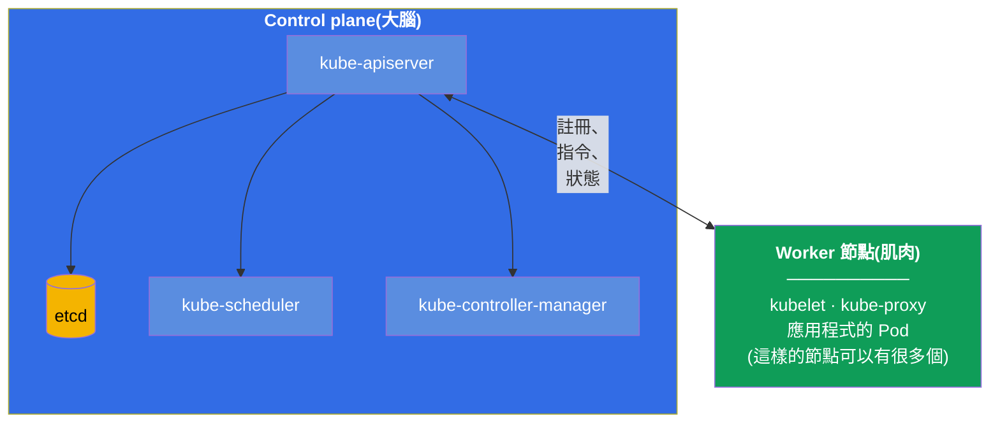
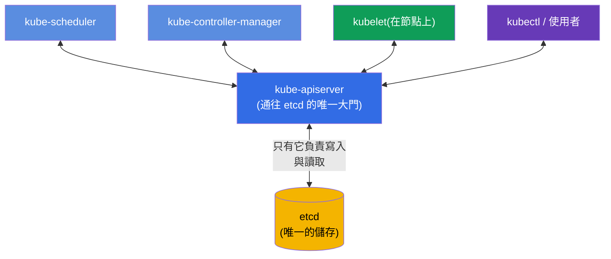
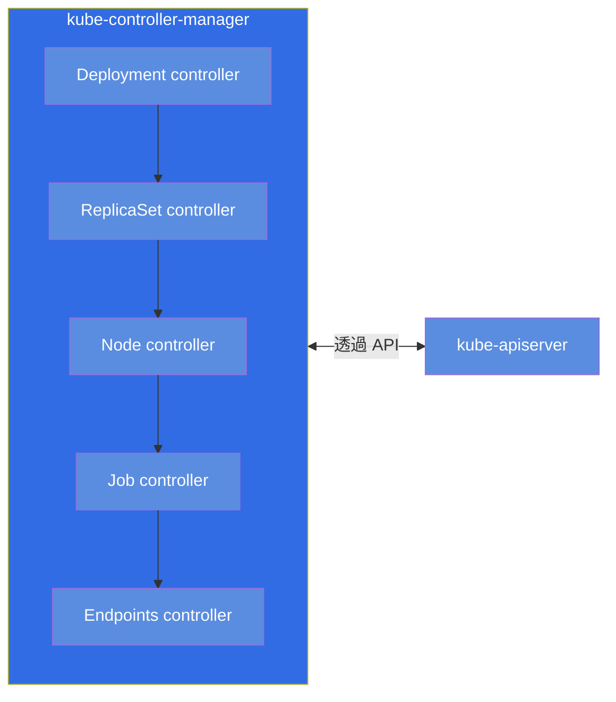
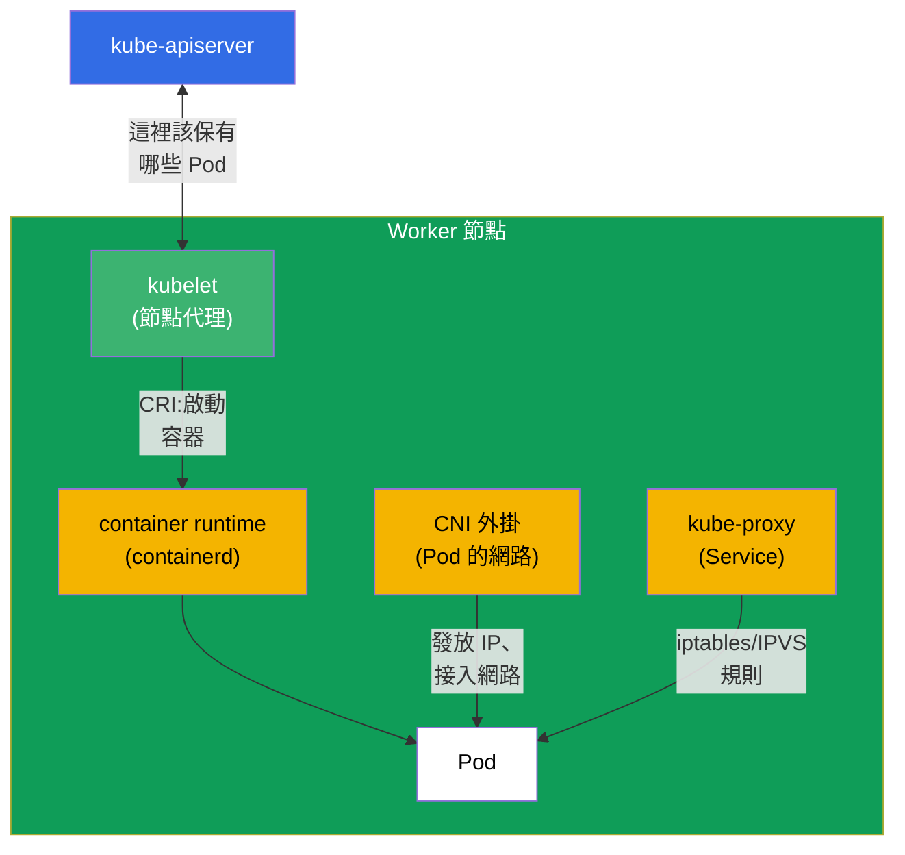
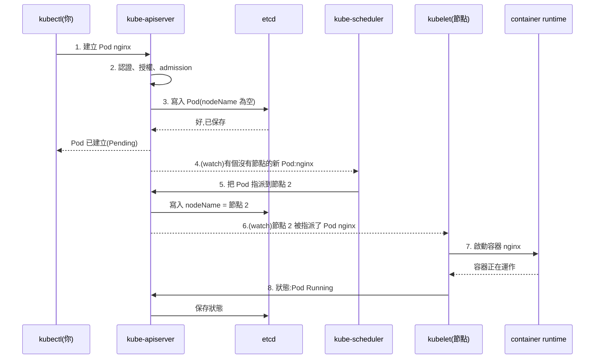
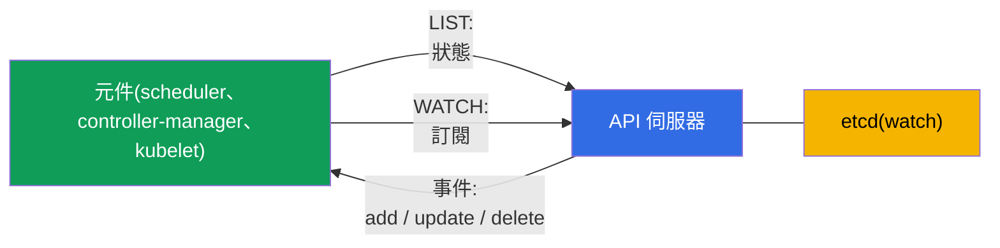
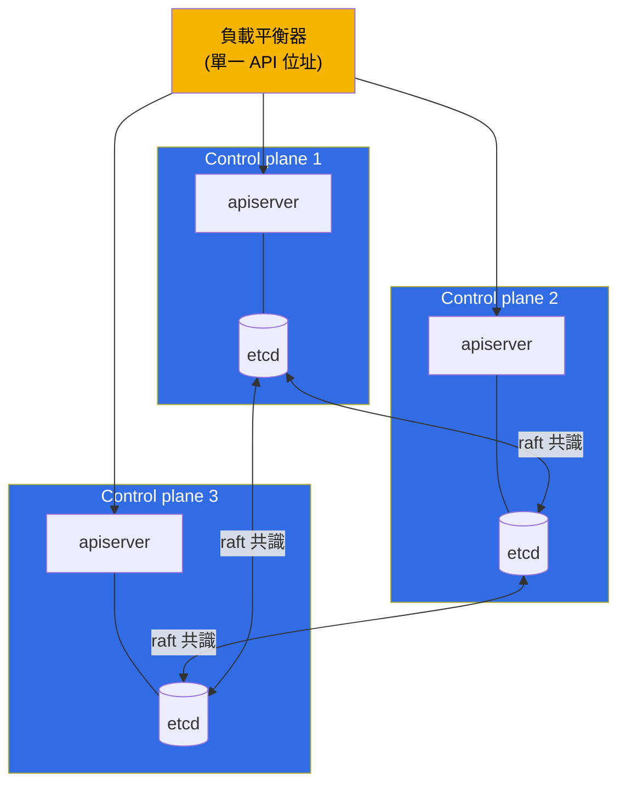

[Русская версия](ru.md) · [Eng version](README.md) · [Versión en español](es.md) · [Version française](fr.md) · [Deutsche Version](de.md) · [ქართული ვერსია](ge.md) · [日本語版](jp.md)

# 第 2 章。Kubernetes 架構:control plane 與 worker 節點

> **接下來是什麼。** 在第一章我們明白了 Kubernetes 會把叢集的實際
> 狀態帶向期望狀態。現在來拆解它由哪些零件組成,以及究竟是誰在
> 執行這項工作。這是整門課程的地基:不理解架構,既無法有意識地管理
> 叢集(CKA),也無法妥善地在其中執行應用程式(CKAD)。而最重要的是 -
> troubleshooting 領域(CKA 的 30%)完全建立在「哪個元件負責什麼、
> 它壞掉時該去哪裡找它」這樣的知識之上。指令的實際操作從第 3 章開始;
> 這裡我們先在腦中建立模型。

## 2.1. 從鳥瞰視角看叢集

Kubernetes 叢集 - 就是一組機器(物理機或虛擬機),它們被稱為
**節點**(node)。節點分成兩種類型:

- **Control plane(管理層)** - 叢集的「大腦」。負責做決策:
  什麼東西在哪裡執行、監控狀態、保存所有資料。它本身通常不執行
  使用者的應用程式。
- **Worker 節點(工作節點)** - 叢集的「肌肉」。你的應用程式容器
  正是在它們上面執行。圖上只畫了一個 worker 節點,但在真實叢集中
  通常有好幾個(從幾個到數百個)- 它們的構造完全相同,並透過
  API 伺服器連接到 control plane。

圖上所有箭頭都匯聚到 `kube-apiserver`。這不是偶然,而是 Kubernetes
最重要的架構規則,我們現在就來談它。

> **重要(常見誤解)。** 直接與 `etcd` 儲存打交道的**只有**
> `kube-apiserver`。其餘元件(scheduler、controller-manager、kubelet、
> kube-proxy)**不會**去 etcd - 它們透過 API 伺服器讀寫狀態。etcd
> 不是元件之間的交換總線,而是位於唯一那道「門」也就是 apiserver 後面的
> 後端儲存。這一點直接來自官方文件:etcd 被描述為
> 「所有 API 伺服器資料」的儲存
> ([Kubernetes Components](https://kubernetes.io/docs/concepts/overview/components/)),而在
> HA 拓撲中,etcd 成員「只與自己節點上的 kube-apiserver 通訊」
> ([HA topology](https://kubernetes.io/docs/setup/production-environment/tools/kubeadm/ha-topology/))。
>
> **那麼 scheduler 是怎麼知道有新 Pod 的?** 不是從 etcd。元件會透過
> API 伺服器**訂閱**變更 - 這就是 **watch**(list-watch)機制。當 Pod 被建立,
> apiserver 把它存進 etcd,並立刻把事件發送給訂閱者。Scheduler 看到
> 「出現了一個沒有 `nodeName` 的 Pod」,選好節點,再把決策(binding)**透過
> apiserver 寫回去**;apiserver 把它存進 etcd,並通知該節點的 kubelet - 後者也是
> 透過自己的 watch 得知這個 Pod。於是所有交換都走 apiserver,而 etcd 留在
> 它後面。watch 機制我們在第 3 章詳細討論。
>
> **這個迷思從哪來。** 它有歷史根源:在 Kubernetes 的早期版本中(1.0
> 之前,2014-2015 年),元件確實直接存取 etcd - kubelet 從 etcd 讀取自己的
> Pod,而 scheduler 透過 etcd 原語(`CompareAndSwap`、按 key 的 watch)
> 來指派它們。到 1.0 版本時架構被刻意整併:apiserver 成為通往 etcd 的
> 唯一「門」(集中式 auth/RBAC/admission、元件解耦、單一事實來源),
> 所有元件都改用 API 伺服器的 watch。這個迷思還活著,也因為
> 在很多圖上 etcd 被畫在 control plane 的中央 - 視覺上很像「總線」,
> 雖然它只是 apiserver 後面的儲存。

## 2.2. 最重要的規則:一切都透過 API 伺服器通訊

請在所有細節之前先記住這個原則:**Kubernetes 的元件不會彼此
直接對話。它們只透過 `kube-apiserver` 通訊。** 排程器不會打電話給
kubelet,控制器不會直接鑽進 etcd - 大家都走 API 伺服器,而
唯一的狀態儲存是 etcd,它同樣只能透過 API 伺服器存取。

為什麼要這樣設計?這帶來三個很大的好處:

- **統一的控制點。** 認證、授權(RBAC)、manifest 檢查
  (admission)- 全都在一個地方,在進入 API 伺服器的入口處。
- **鬆散耦合。** 元件彼此互不知道,可以獨立更換與
  擴展。任何新的控制器只要「接上」API 即可。
- **單一事實來源。** 所有狀態都在 etcd,而且只有 API 伺服器會碰它。
  不會出現多個儲存之間不同步的情況。

troubleshooting 的實務結論:**如果 API 伺服器「倒下」- 整個叢集
都會癱瘓。** `kubectl` 不再回應,排程器無法指派 Pod,
控制器也無法修正任何東西。所以出現嚴重問題時,第一件要檢查的
就是 - API 伺服器是否還活著、它下面的 etcd 是否還活著。

## 2.3. 逐一認識 control plane 的元件

我們逐一拆解「大腦」的每個元件:它做什麼、放在哪裡、怎麼檢查。

### kube-apiserver

叢集的心臟,也是唯一的入口點。它接收所有請求(來自 `kubectl`、來自
元件、來自控制器),對它們做檢查(認證 → 授權 →
admission),並在 etcd 中讀寫狀態。這是唯一一個
直接與 etcd 打交道的元件。

- **它做什麼:** 接收並驗證所有 API 請求,讀取/寫入 etcd。
- **它住在哪:** 靜態 Pod,manifest 為 `/etc/kubernetes/manifests/kube-apiserver.yaml`。
- **如果它掛了:** 叢集失去管理能力,`kubectl` 無法工作。

### etcd

分散式的鍵值儲存。叢集的**所有**狀態都放在裡面:每一個
Pod、Service、Secret、設定 - 全都是 etcd 中的記錄。如果 etcd 遺失又沒有備份 -
叢集就沒了。因此 etcd 的備份有專門的第 37 章來講(而且
這是 CKA 的常見題目)。

- **它做什麼:** 保存叢集的所有狀態(key-value)。
- **它住在哪:** 靜態 Pod,manifest 為 `/etc/kubernetes/manifests/etcd.yaml`。
- **如果它掛了:** API 伺服器無法讀寫狀態 - 叢集失去管理能力。

### kube-scheduler

排程器。它盯著那些**還沒有被指派節點**的 Pod(`nodeName` 是空的),
並決定把每個 Pod 放到哪個節點上。它會考慮資源(CPU/記憶體夠不夠)、
taints/tolerations、affinity、nodeSelector 以及其他規則(這些都在第 12-15 章)。
重要:排程器**只是把節點填進**Pod 的描述裡。它自己不啟動 Pod -
那是 kubelet 做的事。

- **它做什麼:** 為新的 Pod 選擇節點。
- **它住在哪:** 靜態 Pod,`/etc/kubernetes/manifests/kube-scheduler.yaml`。
- **如果它掛了:** 新的 Pod 會「卡」在 `Pending` 狀態,已經啟動的照常運作。

### kube-controller-manager

一個行程,裡面跑著許多**控制器** - 也就是第 1 章講的那些
協調迴圈。例如:deployment 控制器(建立 ReplicaSet)、
replicaset 控制器(維持所需的 Pod 數量)、node 控制器(察覺
死掉的節點)、job 控制器以及數十個其他控制器。每個控制器都盯著自己
那類物件,並把現實帶向期望狀態。

- **它做什麼:** 為所有類型的物件執行控制器(協調迴圈)。
- **它住在哪:** 靜態 Pod,`/etc/kubernetes/manifests/kube-controller-manager.yaml`。
- **如果它掛了:** 叢集不再「自我修復」(不恢復副本,
  也不察覺死掉的節點)。

### cloud-controller-manager(可選)

用於與雲端整合的獨立控制器管理器:為 LoadBalancer 類型的 Service 建立雲端
負載平衡器、按可用區標記節點、管理
雲端磁碟。只有在雲端上執行的叢集才有(EKS、GKE、AKS)。

## 2.4. worker 節點的元件

現在來看「肌肉」。在每個節點上(包括 control plane,如果它上面也允許
執行 Pod)都運作著這些元件。

### kubelet

節點的主要代理程式。它與 API 伺服器通訊,取得應該在這個節點上
運作的 Pod 清單,並確保它們真的在運作:它命令
container runtime 啟動/停止容器、監控它們的健康狀況(探測),
並把狀態回報給 API 伺服器。**kubelet 不是 Pod,而是節點本身上的
系統服務**。

- **它做什麼:** 在自己的節點上啟動並監控 Pod,回報狀態。
- **它住在哪:** 系統服務(`systemctl status kubelet`),不是 Pod。
- **如果它掛了:** 節點進入 `NotReady`,上面的 Pod 無法被管理。

### kube-proxy

它負責節點層級上 Kubernetes Service 的網路魔法。當你建立
Service 時,kube-proxy 會在每個節點上設定規則(iptables 或 IPVS),
把發往 Service 虛擬 IP 的流量重新導向到真實的 Pod。
這裡的負載平衡在 L4 層級(連線)。詳細內容 - 在第 7 章與第 31 章。

重要的一點:**流量本身並不經過 kube-proxy**。它不站在封包的路徑上,
只是*設定*核心的規則(iptables/IPVS),之後流量就依這些規則**直接**走,
不再需要 kube-proxy 參與。也就是說,kube-proxy 是節點上 Service 規則的
「control plane」,而不是「data plane」。由此得到重要的運維推論:

- 如果 kube-proxy **掛了** - 已經設定好的規則仍留在核心中並**繼續
  生效**:既有的 Service 可以存取,這個節點上 Pod 的流量不會中斷。
  壞掉的只有規則的**更新** - 在 kube-proxy 重新起來之前,新的 Service/Endpoints
  不會被加入,被刪除的也不會被移除。
- 因此在節點上**重啟或升級版本** kube-proxy 對流量來說是無感的:
  在新的 Pod 啟動期間,舊的規則仍然有效,連線不會斷。

- **它做什麼:** 在節點上為 Service 設定 iptables/IPVS 規則(流量從它旁邊繞過)。
- **它住在哪:** 通常是 namespace `kube-system` 中的 DaemonSet(`kubectl get ds -n kube-system`)。
- **如果它掛了:** 既有規則照常運作,Service 可以存取;只有變更
  (新增/刪除的 Service 與 Endpoints)在它恢復之前不再被套用。

> **細節。** 在現代叢集中 kube-proxy 可能並不存在:某些 CNI
> (例如處於 kube-proxy replacement 模式的 Cilium)透過 eBPF 把這份工作
> 接了過去。但為了考試,我們腦中仍保留帶 kube-proxy 的經典架構。

### Container runtime

也就是真正啟動容器的那個東西。Kubernetes 自己不啟動容器 - 它
透過標準介面 **CRI**(Container Runtime
Interface)把這件事委派給執行環境。常見的環境:**containerd**(目前的主流選擇)、**CRI-O**。Docker
作為執行環境已從 Kubernetes 移除(dockershim 在 1.24 被刪掉)。在節點上
診斷容器要用 `crictl` 工具。

- **它做什麼:** 真正啟動與停止容器(依 kubelet 的指令)。
- **它住在哪:** 節點上的系統服務(`containerd`),透過 `crictl` 診斷。
- **如果它掛了:** kubelet 無法啟動容器,節點上的 Pod 起不來。

### CNI 外掛

它提供 Pod 的網路:給每個 Pod 發一個 IP 位址,並把跨節點的 Pod 連起來,
讓任何 Pod 都能透過 IP 連到任何其他 Pod。這是透過
**CNI**(Container Network Interface)標準實作的。常見外掛:**Calico**、
**Cilium**、**Flannel**、**Weave**。網路的詳細內容 - 在第 30 章。

## 2.5. 當你建立一個 Pod 時會發生什麼

我們用一個真實例子把一切串起來。你執行了 `kubectl run nginx --image=nginx`。
叢集內部一步一步發生了什麼:

追一下這個邏輯:**沒有人跟任何人直接對話**。排程器知道這個 Pod
不是從 `kubectl`,也不是靠去問誰 - 它透過 watch **訂閱**了 API 伺服器,而
apiserver **自己**把「出現了一個沒有節點的 Pod」這個事件送給了它。kubelet 得知自己的 Pod
也是一樣 - 透過 API 伺服器上的 watch(當 Pod 被指派到這個節點時,apiserver
通知了它)。每一步都是透過唯一那道門的寫入或讀取,而通知是以
watch 事件的形式傳遞(細節 - 在 2.6)。Kubernetes 整個
鬆散耦合的架構就是這樣運作的,而正是這份理解構成了
診斷的基礎:知道這條鏈路,你就知道該去哪裡找故障。

## 2.6. 元件如何追蹤變更:watch 與樂觀鎖

既然一切只透過 API 伺服器通訊(2.2),就會有個問題:scheduler 或
控制器怎麼知道出現了新的 Pod - 是在迴圈裡輪詢 API 嗎?不是。這個機制
更有效率,而且是 Kubernetes 全部反應能力的基礎。

- **list-watch。** 元件先做 **LIST**(取回目前狀態),接著
  開啟 **WATCH** - 一個長壽命的串流,API 伺服器只透過它送來
  **變更**(物件被建立/修改/刪除)。沒有迴圈輪詢 - 這很便宜而且幾乎
  即時。scheduler 就是這樣得知 `Pending` 的 Pod,而 kubelet 得知屬於自己節點的 Pod。
- **informer。** 控制器使用 **informer** 函式庫 - 這是一份本機的
  物件快取,透過 watch 保持在最新狀態。控制器對快取裡的
  事件做反應,而不是每有點動靜就去戳 API - 因此控制器可以擴展。
- **resourceVersion。** 每個物件都有版本(`metadata.resourceVersion`)。watch
  在中斷後可以從某個版本「續接」- 不會遺失變更。
- **樂觀鎖。** 更新物件時,客戶端會送上它的
  `resourceVersion`。如果物件已經被改過(版本不一致),API 伺服器會用
  **409 Conflict** 拒絕寫入 - 客戶端重讀物件後重試。這樣兩次寫入就不會
  互相覆蓋。正因如此,控制器與 `kubectl apply` 才能重試
  操作,而不是在競態下壞掉。

> **watch 在網路層是怎麼實現的。** 這不是多播也不是輪詢,而是普通的
> **走 HTTP 的 TCP/TLS 之上的 unicast 連線**(預設 HTTP/2)。客戶端開啟
> 一個長壽命的請求(`GET ...?watch=true`),而 API 伺服器**不關閉回應**,
> 並把事件**串流**進去 - 逐行送出 `WatchEvent` 物件(`ADDED`/`MODIFIED`/`DELETED`/
> `BOOKMARK`)。每個客戶端都有自己的連線:apiserver 自己「看著」etcd,
> 把變更保存在記憶體中(**watch cache**),並在考慮 RBAC 與選擇器的前提下
> **分發**給所有已連線的客戶端(fan-out)- 所以並不需要多播(它既給不了
> TLS/授權,也給不了可靠性,也做不到對每個客戶端的過濾)。連線中斷時
> 客戶端會用保存下來的 `resourceVersion` 重新開啟 watch,不會遺失變更,而
> 週期性的 `BOOKMARK` 事件會把這個版本往前推。

這是**協調迴圈**(第 1 章)的技術內裡:控制器透過 watch 看到
期望與實際之間的差異並消除它,而樂觀鎖則在許多控制器並行工作時
保證正確性。

## 2.7. 哪個元件該去哪裡找(troubleshooting 地圖)

這張表值得背下來 - 在 CKA 的 troubleshooting 領域裡它能省下
大量時間。

| 元件 | 類型 | 去哪裡找 / 怎麼檢查 |
|-----------|-----|-----------------------------|
| kube-apiserver | 靜態 Pod | `/etc/kubernetes/manifests/kube-apiserver.yaml`;`kubectl get pods -n kube-system` |
| etcd | 靜態 Pod | `/etc/kubernetes/manifests/etcd.yaml` |
| kube-scheduler | 靜態 Pod | `/etc/kubernetes/manifests/kube-scheduler.yaml` |
| kube-controller-manager | 靜態 Pod | `/etc/kubernetes/manifests/kube-controller-manager.yaml` |
| kubelet | 系統服務 | `systemctl status kubelet`;`journalctl -u kubelet` |
| kube-proxy | DaemonSet | `kubectl get ds -n kube-system` |
| CoreDNS | Deployment | `kubectl get deploy -n kube-system` |
| container runtime | 系統服務 | `systemctl status containerd`;`crictl ps` |
| CNI | 外掛 | `ls /etc/cni/net.d/`;`kube-system` 中的 CNI Pod |

必須清楚記在腦中的關鍵差別:

- **control plane 的元件(apiserver、etcd、scheduler、controller-manager)** 在
  kubeadm 叢集中是以**靜態 Pod** 的形式啟動的 - 它們的 manifest 放在
  `/etc/kubernetes/manifests/`,由 kubelet 在本機把它們拉起來,甚至在
  API 伺服器開始工作之前。你改了檔案 - kubelet 就會自動重建 Pod。
- **kubelet 與 container runtime** - 是**系統服務**(不是 Pod),透過
  `systemctl` 管理,日誌記在 `journalctl` 裡。

靜態 Pod 我們在第 15 章詳細討論,kubeadm 安裝則在
第 35 章。

## 2.8. control plane 的高可用性

在教學叢集裡 control plane 通常只有一個。生產環境不能這樣:如果唯一的
control plane 死掉,叢集就會失去管理能力。因此在真實叢集中
control plane 會做成多個副本(通常是 3 個),而在它們的 API 伺服器前面
再擺一個負載平衡器。

關於 etcd 的細節:etcd 的節點會組成一個叢集,並依 **raft** 共識協定
彼此達成一致。要做出決策需要法定人數(多數),因此節點數量
取**奇數**(3、5)。三個節點能承受失去一個,五個 - 兩個。
此時各個 API 伺服器地位平等 - 負載平衡器只是把請求分散給
它們。

## 2.9. 這在生產環境中如何應用

架構理論不是抽象概念,而是真實決策所依據的東西。

- **受管叢集(EKS/GKE/AKS)。** 在雲端裡 control plane 不會交給你 - 由
  供應商管理,你只拿到 API 伺服器的 endpoint,並為這份
  管理付費。你只需負責 worker 節點。這免去了維護 etcd 與
  升級 control plane 的痛苦,但也讓你失去對 control plane 靜態 Pod 的存取 -
  很多「CKA 題目」在那裡根本做不了。所以準備 CKA 需要的是
  self-managed 叢集(kubeadm),而不是 EKS。
- **節點角色的分離。** 生產環境會用 taint
  `node-role.kubernetes.io/control-plane:NoSchedule` 把 control plane 封起來,讓使用者的應用程式
  不會落到那裡去干擾「大腦」的工作。應用程式只住在 worker 節點上。
- **etcd - 最寶貴的資產。** 有經驗的團隊會按排程備份 etcd,並把
  快照存放在叢集之外。沒有備份而失去 etcd = 失去叢集。另外還要
  盯著 etcd 底下的磁碟延遲 - 它對這個非常敏感。
- **HA 是常態。** 任何生產叢集 - 都至少是負載平衡器後面的 3 個 control plane
  以及奇數個 etcd 節點。單一 control plane 只允許出現在
  dev/教學環境中。
- **事故診斷。** 理解「一切都走 API 伺服器,狀態在
  etcd 裡」- 這是值班工程師首先會運用的:`kubectl` 沒回應 → 看
  API 伺服器與 etcd;Pod 卡在 Pending → 看 scheduler;節點 NotReady → 看
  它上面的 kubelet 與 runtime。

## 2.10. 迷你詞彙表

- **節點(node)** - 叢集中的一台機器(VM 或物理機)。
- **Control plane** - 叢集的管理層(大腦):apiserver、etcd、scheduler、
  controller-manager。
- **Worker 節點** - 工作節點,應用程式的 Pod 在上面執行。
- **kube-apiserver** - 統一的入口點,所有請求都經過它;也是唯一
  會寫入 etcd 的元件。
- **etcd** - 保存叢集全部狀態的分散式 key-value 儲存。
- **kube-scheduler** - 把 Pod 指派到節點上。
- **kube-controller-manager** - 一組控制器(協調迴圈)。
- **kubelet** - 節點的代理程式,啟動並控制 Pod;是系統服務。
- **kube-proxy** - 在節點上透過 iptables/IPVS 實作 Service。
- **container runtime** - 容器的執行環境(containerd),透過 CRI 通訊。
- **CNI** - Pod 網路的介面與外掛(Calico、Cilium 等)。
- **靜態 Pod** - 由 kubelet 直接依
  `/etc/kubernetes/manifests/` 中的 manifest 拉起的 Pod,不經過排程器。
- **raft** - etcd 節點之間達成一致所用的共識協定。
- **list-watch** - 追蹤變更的模式:LIST + WATCH 串流(不需輪詢)。
- **informer** - 控制器的本機物件快取,透過 watch 保持同步。
- **resourceVersion** - 物件的版本;watch 從它繼續,也是樂觀鎖的基礎。
- **樂觀鎖** - 以過期版本寫入會被拒絕(409 Conflict)→ 重試。

## 2.11. 本章總結

- 叢集 = control plane(大腦)+ worker 節點(肌肉)。應用程式的 Pod
  住在 worker 節點上。
- 最重要的規則:元件不直接通訊,只透過 `kube-apiserver`;
  唯一的狀態儲存是 etcd,而且只有 API 伺服器會碰它。
- Control plane:apiserver(唯一的門)、etcd(儲存)、scheduler(選節點)、
  controller-manager(協調迴圈);在雲端裡 - 還有 cloud-controller-manager。
- Worker 節點:kubelet(代理,系統服務)、kube-proxy(Service)、container
  runtime(依 CRI 啟動容器)、CNI(Pod 網路)。
- 建立 Pod - 是透過 API 伺服器的一連串讀寫:apiserver → etcd →
  scheduler 指派節點 → kubelet 透過 runtime 啟動 → 狀態回傳。
- 元件透過 **list-watch** 追蹤變更(不需輪詢),控制器
  使用 informer 快取;並行寫入由樂觀鎖保護
  (resourceVersion → 409 Conflict → 重試)。
- 為了 troubleshooting,請記住哪個元件在哪裡:control plane - 是
  `/etc/kubernetes/manifests/` 中的靜態 Pod,kubelet 與 runtime - 是系統服務(`systemctl`、
  `journalctl`、`crictl`)。
- 生產環境會把 control plane 做成 HA(負載平衡器後面 3 個節點,etcd 節點數為奇數
  以滿足 raft 的法定人數),而且會仔細備份 etcd。

## 2.12. 這些知識用在哪裡:考試與實際工作

**在考試中。** 直接的題目:「修好 control plane」(CKA,troubleshooting 30%)-
你得知道 manifest 在 `/etc/kubernetes/manifests/`,以及怎麼讀元件的日誌;
「Pod 卡在 Pending」- 馬上想到 scheduler;「節點 NotReady」- 想到 kubelet 與
runtime。沒有 2.7 節的元件地圖,這些題目無法在規定時間內解決。
CKAD 對架構問得比較少,但「Pod 由 kubelet 啟動、網路
由 CNI 提供、Service 靠 kube-proxy」這樣的理解對除錯應用程式是必要的。

**在實際工作中。** 這是工程師定位任何事故所依據的模型:
叢集失去管理 → apiserver/etcd;Pod 不被排程 → scheduler;某個具體
節點掉了 → 它的 kubelet/runtime;到 Service 的流量不通 → kube-proxy/CNI。
同一套知識骨架也決定架構決策:要維持幾個 control plane、
在哪裡備份 etcd、為什麼應用程式不放在 control plane 上。

## 2.13. 自我檢查問題

1. 為什麼說 Kubernetes 的所有元件只透過 API 伺服器通訊?這樣做
   帶來什麼好處?
2. 唯一直接與 etcd 打交道的元件是哪一個,為什麼這很重要?
3. 如果 kube-scheduler 掛了,新的 Pod 與已經啟動的 Pod 會發生什麼?
4. control plane 元件的啟動方式與 kubelet、container
   runtime 有什麼不同?這兩類分別去哪裡找?
5. 請一步步描述執行 `kubectl run nginx --image=nginx` 之後叢集裡發生了什麼。
6. 為什麼 etcd 的節點數要取奇數,什麼是法定人數?
7. 為什麼像 EKS 這樣的受管叢集不適合用來準備 CKA?
8. 元件如何在不輪詢 API 的情況下得知變更(list-watch)?informer 是什麼?
9. 什麼是樂觀鎖,寫入時為什麼需要 `resourceVersion`?

## 實務練習

與叢集有關的實際操作我們從下一章開始,那裡會掌握 `kubectl` 以及
管理物件的兩種做法。本章講的叢集構造你會在稍後親眼
看到:在做好的叢集裡可以進去看看
`/etc/kubernetes/manifests/`,並檢查 control plane 元件的狀態,而親手從零
組建叢集(`kubeadm init` + CNI + `join`)- 在第 35 章,那時我們會
講安裝。

---
[目錄](../README_TW.md) · [第 1 章](../01/tw.md) · [第 3 章](../03/tw.md)
