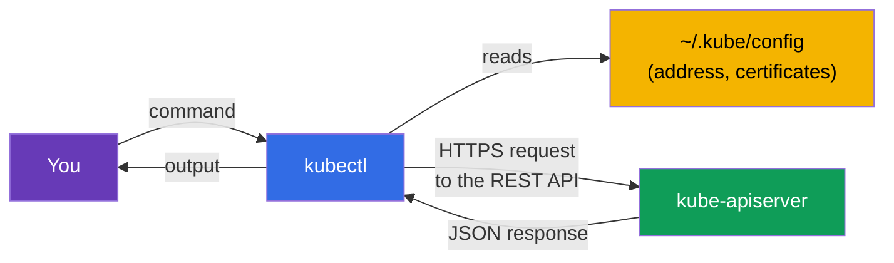
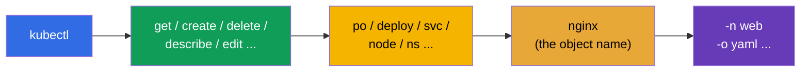
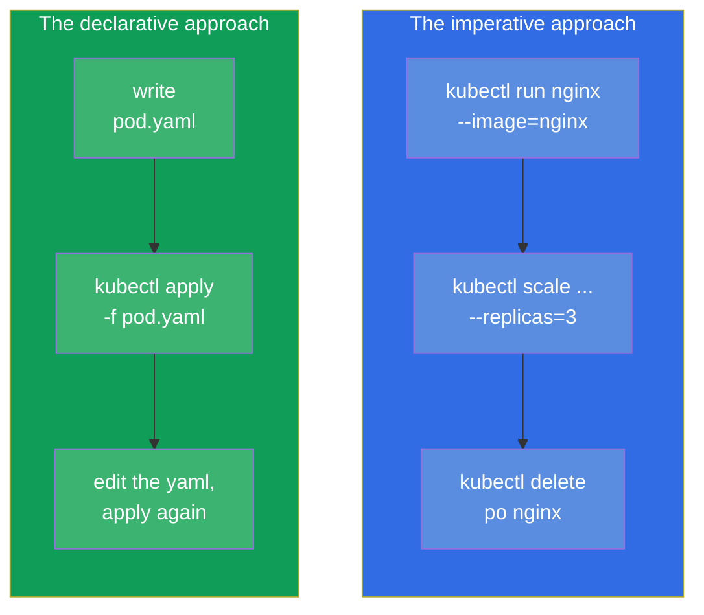
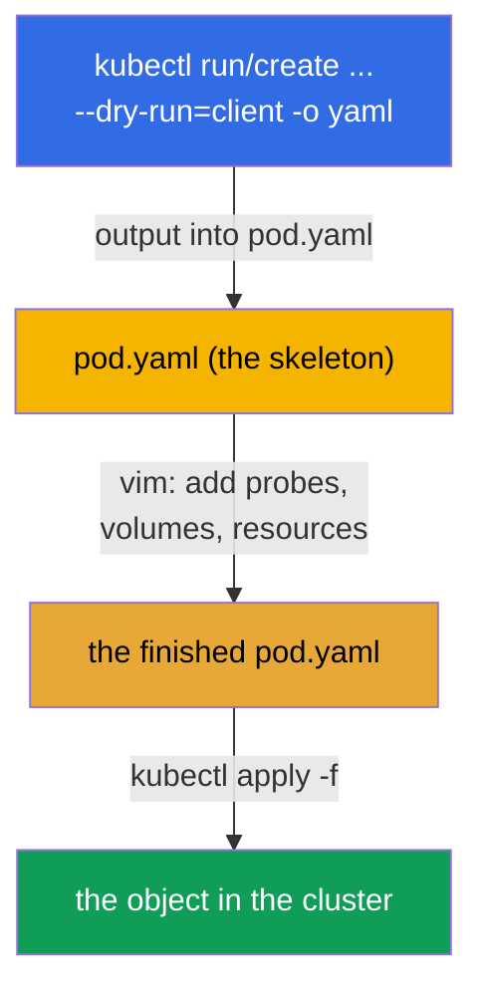

[Русская версия](ru.md) · [Versión en español](es.md) · [Version française](fr.md) · [Deutsche Version](de.md) · [ქართული ვერსია](ge.md) · [繁體中文版](tw.md) · [日本語版](jp.md)

# Chapter 3. Working with kubectl: the imperative and the declarative approach

> **What comes next.** We have understood what a cluster is made of. Now let us pick up
> the main tool - `kubectl`, through which you will be doing absolutely everything: on the
> exam, in the labs and in real work. This chapter is the foundation of speed. On the exam
> 15-20 tasks in 2 hours are solved only by those who do not write YAML by hand from
> scratch but generate it with commands. Here we will go through both approaches
> (imperative and declarative), set up the working environment for speed and learn to find
> any field through `kubectl explain`. Everything mastered here works in all the following
> chapters.

## 3.1. What kubectl is and how it talks to the cluster

`kubectl` is a command line client. It does nothing by itself: it turns your commands into
HTTP requests to `kube-apiserver` and prints the answer. Everything we went through in
chapter 2 applies: `kubectl` is just one more client of the API server, on a par with the
internal components.



How does `kubectl` know which cluster to go to and how to authenticate? From the
configuration file - **kubeconfig**, by default `~/.kube/config`. It describes clusters
(API addresses), users (certificates/tokens) and contexts (bundles of
cluster+user+namespace). We will go through kubeconfig in detail in chapter 39, but the
basic commands are needed already now:

```bash
kubectl config view                       # show the current config
kubectl config get-contexts               # the list of contexts
kubectl config current-context            # which context is active right now
kubectl config use-context cluster1       # switch to a context
```

> **Important for the exam.** Every task specifies a cluster and a context. The first
> thing you do in a task is run `kubectl config use-context <the needed one>`. If you
> forget to switch - you did the task in the wrong cluster and lost points. This is one of
> the most frequent and most annoying mistakes.

## 3.2. How to install kubectl

On the exam and in our labs `kubectl` is already installed - you do not need to install it
yourself. But for practice on your own machine you have to put it there and, more
importantly, understand the **version compatibility rule**.

> **The skew rule (version divergence).** The version of `kubectl` must differ from the
> version of `kube-apiserver` by no more than **one minor release** (in either direction).
> For example, an API server 1.34 works with `kubectl` 1.33, 1.34 or 1.35, but not with
> 1.32 or 1.36. In practice keep `kubectl` at the same minor version as the cluster.

Installation methods for different OSes:

| OS / manager | Command |
|---------------|---------|
| Linux (binary) | `curl -LO "https://dl.k8s.io/release/$(curl -L -s https://dl.k8s.io/release/stable.txt)/bin/linux/amd64/kubectl"` |
| Linux (apt, Debian/Ubuntu) | `sudo apt-get install -y kubectl` (after adding the pkgs.k8s.io repository) |
| Linux (dnf, RHEL/Fedora) | `sudo dnf install -y kubectl` (after adding the repository) |
| macOS (Homebrew) | `brew install kubectl` |
| Windows (choco) | `choco install kubernetes-cli` |

The manual binary installation on Linux in full:

```bash
# 1. Download the binary of the latest stable version
curl -LO "https://dl.k8s.io/release/$(curl -L -s https://dl.k8s.io/release/stable.txt)/bin/linux/amd64/kubectl"

# 2. (optional) verify the checksum
curl -LO "https://dl.k8s.io/release/$(curl -L -s https://dl.k8s.io/release/stable.txt)/bin/linux/amd64/kubectl.sha256"
echo "$(cat kubectl.sha256)  kubectl" | sha256sum --check

# 3. Install into PATH with the right permissions
sudo install -o root -g root -m 0755 kubectl /usr/local/bin/kubectl
```

Checking that everything is in place:

```bash
kubectl version --client            # the client version only (without reaching the cluster)
kubectl version                     # the client and server versions (needs cluster access)
```

> **A tip for the exam.** You will not have to spend time on installation - the
> environment is ready: `kubectl`, the `k` alias and completion are already set up out of
> the box. Setting up your own environment for installation and configuration (section
> 3.10) only makes sense for practising on a personal machine.

## 3.3. The anatomy of a kubectl command

Almost all `kubectl` commands are built on one scheme:

```
kubectl [command] [type] [name] [flags]
```



For example, `kubectl get pods nginx -n web -o yaml`:
- **command** `get` - what to do (get);
- **type** `pods` - with which kind of objects;
- **name** `nginx` - which one exactly (can be omitted - then all of them);
- **flags** `-n web -o yaml` - in the namespace `web`, output in YAML.

Object types have short aliases that save time:

| Full | Short | Full | Short |
|--------|---------|--------|---------|
| pods | po | services | svc |
| deployments | deploy | namespaces | ns |
| replicasets | rs | configmaps | cm |
| nodes | no | persistentvolumeclaims | pvc |
| daemonsets | ds | persistentvolumes | pv |
| statefulsets | sts | serviceaccounts | sa |

The full list of aliases - `kubectl api-resources`.

## 3.4. Two approaches: imperative and declarative

This is the conceptual core of the chapter. There are two ways to manage Kubernetes
objects.

- **Imperative** - you command *what to do now*: "create a pod", "delete the deployment",
  "change the image". Fast, but the history of intentions is not saved anywhere.
- **Declarative** - you describe the *desired state* in a YAML file and say
  `kubectl apply -f`. Kubernetes itself decides what to create or change. Repeatable,
  versioned in git, suitable for a team and for production.



**Which approach to use when?**

| Situation | Approach | Why |
|----------|--------|-------|
| A simple object on the exam (pod, sa, cm) | imperative | the fastest |
| A complex object (probes, volumes, affinity needed) | hybrid: generate → edit | you cannot write the whole YAML by hand |
| Production, teamwork | declarative | git, review, repeatability |
| Quickly check/delete something | imperative | a single command |

**The golden middle for the exam is the hybrid.** We generate the YAML skeleton with an
imperative command and `--dry-run=client -o yaml`, add what is needed in the editor, apply
it through `apply`. This is the fastest way to get a complex object.

## 3.5. Imperative commands: creating objects fast

The two key creation commands: `kubectl run` (for a single pod) and `kubectl create` (for
the other objects).

```bash
# A pod
kubectl run nginx --image=nginx

# A pod with a port and environment variables
kubectl run web --image=nginx --port=80 --env="KEY=value"

# A Deployment with 3 replicas
kubectl create deployment web --image=nginx --replicas=3

# A Namespace
kubectl create namespace dev

# A ConfigMap from literals
kubectl create configmap app-cfg --from-literal=COLOR=blue

# A Secret
kubectl create secret generic db --from-literal=password=s3cret

# Service: expose the deployment's port
kubectl expose deployment web --port=80 --target-port=80

# Scaling
kubectl scale deployment web --replicas=5

# Change the image
kubectl set image deployment/web nginx=nginx:1.27
```

Many `run`/`create`/`expose` commands are the only fast way to get an object on the exam.
They are worth drilling to the point of automatism.

## 3.6. Generating manifests: `--dry-run=client -o yaml`

This is possibly the most important trick of the whole course for speed. The flags
`--dry-run=client -o yaml` mean: "do not actually create the object, but show me which
YAML you would send". We redirect that YAML into a file, edit it and apply it.



In practice:

```bash
# Generate the pod skeleton into a file
kubectl run nginx --image=nginx --dry-run=client -o yaml > pod.yaml

# Generate the deployment skeleton
kubectl create deployment web --image=nginx --replicas=3 \
  --dry-run=client -o yaml > deploy.yaml

# Edit and apply
vim pod.yaml
kubectl apply -f pod.yaml
```

What is important to understand about `--dry-run`:
- `--dry-run=client` - does not reach the server at all, it just renders the YAML locally;
- `--dry-run=server` - sends it to the server, which runs validation and admission but
  does not save it. Useful to check whether the object would pass, without creating it.

## 3.7. The declarative approach: apply, create, replace

With declarative management you work with files. The main commands:

```bash
kubectl apply -f pod.yaml          # create or update from the manifest
kubectl apply -f ./manifests/      # apply all the files in a directory
kubectl delete -f pod.yaml         # delete the objects from the manifest
kubectl create -f pod.yaml         # create (fails if it already exists)
kubectl replace -f pod.yaml        # replace an existing one entirely
```

The difference between `create` and `apply` is fundamental:

| Command | If the object does not exist | If the object already exists |
|---------|------------------|----------------------|
| `create -f` | will create it | error (already exists) |
| `apply -f` | will create it | will update it (a smart merge of the changes) |
| `replace -f` | error (no object) | will replace it entirely |

`apply` is the workhorse of the declarative approach: it is capable of a **three-way
merge** (3-way merge), comparing your file, the current state and the last applied
version. That is why `apply` can be repeated as many times as you like - it is idempotent.

## 3.8. Reading the state: get, describe, logs

Half of the work (and of the exam) is not creating but looking at what is going on.

```bash
# The list of objects
kubectl get pods
kubectl get pods -o wide            # + the node and the IP
kubectl get pods -A                 # in all namespaces (--all-namespaces)
kubectl get pods --show-labels      # with the labels
kubectl get pods -w                 # follow in real time (watch)

# The details of an object (the events at the bottom — gold for debugging)
kubectl describe pod nginx

# The logs of a container
kubectl logs nginx                  # the logs of the pod
kubectl logs nginx -c app           # a specific container
kubectl logs nginx -f               # in real time
kubectl logs nginx --previous       # the logs of the crashed previous container

# A command inside a container
kubectl exec nginx -- ls /          # run a command
kubectl exec -it nginx -- sh        # an interactive shell

# The cluster events
kubectl get events --sort-by='.lastTimestamp'
```

The key debugging skill: `kubectl describe` prints an **Events** section at the bottom -
that is exactly where the reasons for "why the pod does not start", "why pending", "why
image pull failed" are. About this - in detail in chapter 44.

## 3.9. Output formats and JSONPath

The `-o` flag controls the output format. This comes in handy both in life and on the exam
(sometimes you are asked to "output the names of all the pods into a file").

```bash
kubectl get pods -o wide            # the extended table
kubectl get pod nginx -o yaml       # the full YAML of the object
kubectl get pod nginx -o json       # the same in JSON
kubectl get pods -o name            # the names only (pod/nginx)

# JSONPath — pulling out specific fields
kubectl get pods -o jsonpath='{.items[*].metadata.name}'
kubectl get nodes -o jsonpath='{.items[*].status.addresses[?(@.type=="InternalIP")].address}'

# Your own table through custom-columns
kubectl get pods -o custom-columns=NAME:.metadata.name,NODE:.spec.nodeName
```

We will go through JSONPath and custom-columns in detail in chapter 47 (preparation for
the CKAD) - there it is a frequent type of task. For now it is enough to know that such a
tool exists.

## 3.10. Setting up the environment for speed

On the current exam (PSI) the basic environment is already ready out of the box:
`kubectl`, the `k` alias and completion are usually pre-configured - you do not need to
install anything specially. That is why the first thing to do on the exam is not to set up
the environment but to **check** that what you need already works (`k get ns`, completion
on `Tab`). And the helper variables (`do`, `now`) are not set by default - you add them
yourself if you want.

For practice on your own machine the whole set below is configured on your own - it saves
tens of minutes.

```bash
# The alias k = kubectl
alias k=kubectl

# Helper variables for generating manifests and for fast deletion
export do="--dry-run=client -o yaml"
export now="--force --grace-period=0"

# Command completion
source <(kubectl completion bash)
complete -o default -F __start_kubectl k

# Setting up vim for YAML: 2 spaces, no tabs
echo 'set tabstop=2 shiftwidth=2 expandtab' >> ~/.vimrc
export KUBE_EDITOR=vim
```

Now you can write it short:

```bash
k run nginx --image=nginx $do > pod.yaml     # = --dry-run=client -o yaml
k delete po nginx $now                        # instant deletion
```


> **About indentation in YAML.** Kubernetes accepts only spaces, tabs are forbidden. The
> `expandtab` setting in vim turns a tab into spaces - without it you easily get a parsing
> error and lose time. This is configured before everything else.

## 3.11. `kubectl explain`: the documentation right in the terminal

Forgot what a field is called or at which nesting level it is? You do not have to go into
the browser - `kubectl explain` shows the schema of any object right in the terminal.

```bash
kubectl explain pod                       # the top level
kubectl explain pod.spec                  # the spec fields
kubectl explain pod.spec.containers       # the container fields
kubectl explain pod.spec.containers.livenessProbe   # and so on deeper
kubectl explain pod --recursive           # the whole field tree at once
```

This is indispensable when you remember the meaning of a field but forgot the exact name
or the hierarchy. It works for any type, including CRDs (chapter 41).

## 3.12. Editing and deleting live objects

```bash
# Open an object in the editor and fix it on the fly
kubectl edit deployment web

# Set/remove a label
kubectl label pod nginx env=prod
kubectl label pod nginx env-               # the "minus" sign removes the label

# Annotations — the same way
kubectl annotate pod nginx note="hello"

# Deletion
kubectl delete pod nginx
kubectl delete -f pod.yaml
kubectl delete pod nginx --force --grace-period=0    # instantly, without waiting
```

An important subtlety: some pod fields are **immutable** after creation (for example, the
container image in a bare Pod can be changed, but a lot in `spec` cannot). If
`kubectl edit` will not let you save, the object will have to be deleted and created anew
from the corrected manifest. For a Deployment this is not a problem - there the edits are
applied through a new rollout (chapter 8).

## 3.13. How this is applied in production

- **Declarativeness and GitOps.** In real operations almost nobody creates objects
  imperatively. All the manifests lie in git, and tools like **Argo CD** or **Flux**
  automatically apply them into the cluster (`apply`) and watch that the state of the
  cluster matches the repository. Imperative commands in production are mostly debugging
  and one-off operations.
- **`kubectl` for reading and investigation only.** In mature teams direct changes through
  `kubectl edit`/`delete` in production are taboo (that is "drift" from git). But `get`,
  `describe`, `logs`, `exec` are the daily tools of an on-call engineer when investigating
  incidents.
- **Contexts and safety.** Engineers usually have several clusters in their kubeconfig
  (dev/stage/prod). Mixing up the context and running a command in production instead of
  dev is a real incident. That is why in production they use utilities like
  `kubectx`/`kube-ps1`, which show the active context right in the shell prompt.
- **Access rights.** What you are allowed to do through `kubectl` is limited by RBAC
  (chapter 38). A developer usually has access only to their own namespaces, not to the
  whole cluster.

## 3.14. Mini-glossary

- **kubectl** - the command line client, turns commands into requests to the API server.
- **kubeconfig** - the file (`~/.kube/config`) with the clusters, users and contexts.
- **Context** - a bundle of cluster + user + namespace; switched with `use-context`.
- **The imperative approach** - managing by actions (`run`, `create`, `delete`).
- **The declarative approach** - managing the desired state through `apply -f`.
- **`--dry-run=client -o yaml`** - generate the YAML without creating anything.
- **apply** - create or update an object from a manifest (idempotent, 3-way merge).
- **JSONPath** - a language for selecting fields from an API response (`-o jsonpath=...`).
- **kubectl explain** - the built-in documentation on object fields.

## 3.15. Chapter summary

- `kubectl` is a client of the API server; where to go and how to authorize it takes from
  the kubeconfig.
- In every task first switch the context (`config use-context`) - otherwise you will do
  the work in the wrong cluster.
- A command is built as `kubectl [command] [type] [name] [flags]`; types have short
  aliases (po, deploy, svc, ...).
- Two approaches: imperative (fast, one-off) and declarative (`apply`, repeatable, for git
  and production). The golden middle on the exam is to generate the YAML and finish it off.
- `--dry-run=client -o yaml` is the main speed trick: we get the manifest skeleton with a
  command, add the complex parts in the editor, apply it through `apply`.
- Reading the state: `get` (including `-o wide`, `-A`, `-w`), `describe` (Events!), `logs`
  (`-f`, `--previous`), `exec`, `get events`.
- On the exam the basic environment (`kubectl`, the `k` alias, completion) is usually
  pre-configured - check that, do not set it up from scratch; the `do`/`now` helpers you
  add yourself if you want. For your own practice machine set up the whole set (the alias,
  `do`/`now`, completion, vim with 2 spaces) yourself - it saves tens of minutes.
- `kubectl explain` replaces a trip to the browser for field names.

## 3.16. How this helps: on the exam and in real work

**On the exam.** This is the basic skill of both exams in general - without fluent
`kubectl` you will not finish a single task in time. There are no direct tasks like "set up
an alias", but the speed this chapter gives determines how many tasks you will solve. The
`--dry-run` tricks, the short aliases, `explain`, a fast `describe`/`logs` are used in
every other task.

**In real work.** `kubectl get/describe/logs/exec` is the daily tool of anyone who
operates Kubernetes: investigating incidents starts exactly with them. Understanding the
difference between the imperative and the declarative approach determines how the whole
delivery process is built: in mature teams everything is declarative and through git
(GitOps), while imperative commands remain for debugging.

## 3.17. Self-check questions

1. How does `kubectl` understand which cluster to connect to and as whom? What happens if
   you do not switch the context on the exam?
2. How does the imperative approach differ from the declarative one? When is each
   appropriate?
3. What does `--dry-run=client -o yaml` do and why is it the key trick for speed?
4. What is the difference between `kubectl create -f`, `apply -f` and `replace -f`?
5. Where does `kubectl describe` show the reasons for problems with an object?
6. Why configure `expandtab` in vim before the exam?
7. How, without opening a browser, do you recall the exact name of a field in a pod's
   specification?

## Practice

Now you have the tool. In the following chapters we will start creating real objects: pods
(chapter 4), then ReplicaSet and Deployment (chapter 5). All the `kubectl` tricks from this
chapter you will drill in the first combined lab together with the basic objects.

🧪 Lab 119 (drills on speed and JSONPath): [tasks/cka/labs/119](../../labs/119/README.MD)

---
[Contents](../README.md) · [Chapter 2](../02/README.md) · [Chapter 4](../04/README.md)
