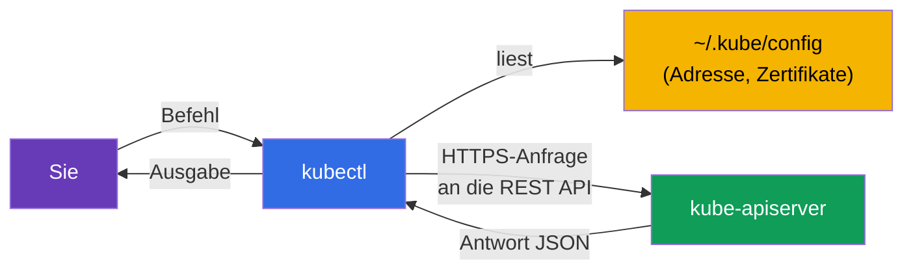
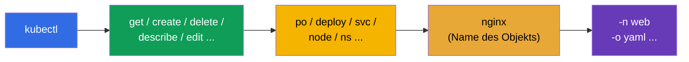
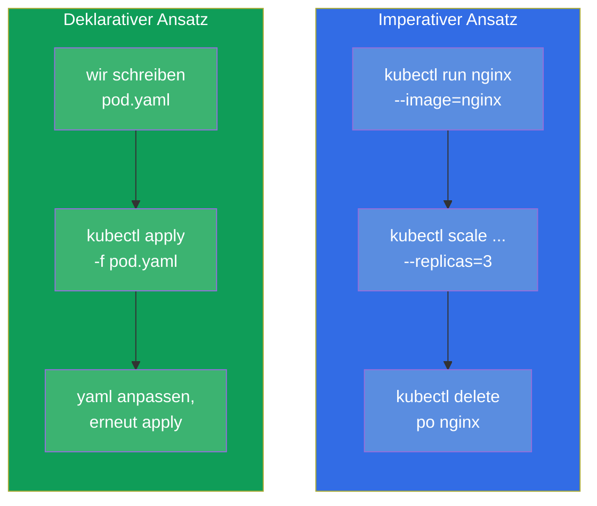
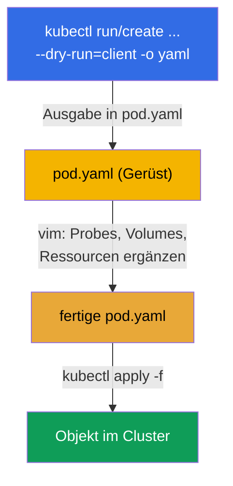

[Русская версия](ru.md) · [Eng version](README.md) · [Versión en español](es.md) · [Version française](fr.md) · [ქართული ვერსია](ge.md) · [繁體中文版](tw.md) · [日本語版](jp.md)

# Kapitel 3. Arbeiten mit kubectl: der imperative und der deklarative Ansatz

> **Was kommt.** Wir haben verstanden, woraus ein Cluster besteht. Jetzt nehmen wir das
> wichtigste Werkzeug in die Hand - `kubectl`, mit dem Sie überhaupt alles machen werden:
> in der Prüfung, in den Labs und in der echten Arbeit. Dieses Kapitel ist das Fundament
> der Geschwindigkeit. In der Prüfung lösen 15-20 Aufgaben in 2 Stunden nur die, die YAML
> nicht von Hand von Null schreiben, sondern es mit Befehlen generieren. Hier nehmen wir
> beide Ansätze durch (den imperativen und den deklarativen), richten die Arbeitsumgebung
> auf Geschwindigkeit ein und lernen, jedes Feld über `kubectl explain` zu finden. Alles,
> was hier gemeistert wird, gilt in allen folgenden Kapiteln.

## 3.1. Was kubectl ist und wie es mit dem Cluster kommuniziert

`kubectl` ist ein Kommandozeilen-Client. Es macht nichts selbst: es verwandelt Ihre Befehle
in HTTP-Anfragen an den `kube-apiserver` und druckt die Antwort. Alles, was wir in Kapitel 2
behandelt haben, gilt auch hier: `kubectl` ist ein weiterer Client des API-Servers, auf
Augenhöhe mit den internen Komponenten.



Woher weiß `kubectl`, zu welchem Cluster es gehen und wie es sich authentifizieren soll? Aus
der Konfigurationsdatei - der **kubeconfig**, standardmäßig `~/.kube/config`. Darin sind die
Cluster (API-Adressen), die Benutzer (Zertifikate/Tokens) und die Kontexte (Bündel aus
Cluster+Benutzer+Namespace) beschrieben. Ausführlich behandeln wir die kubeconfig in
Kapitel 39, aber die Grundbefehle braucht man schon jetzt:

```bash
kubectl config view                       # aktuelle Konfiguration zeigen
kubectl config get-contexts               # Liste der Kontexte
kubectl config current-context            # welcher Kontext jetzt aktiv ist
kubectl config use-context cluster1       # auf einen Kontext umschalten
```

> **Wichtig für die Prüfung.** In jeder Aufgabe sind Cluster und Kontext angegeben. Das
> Erste, was Sie in einer Aufgabe tun, ist `kubectl config use-context <den passenden>`
> auszuführen. Umschalten vergessen - schon haben Sie die Aufgabe im falschen Cluster
> gemacht und Punkte verloren. Das ist einer der häufigsten und ärgerlichsten Fehler.

## 3.2. Wie man kubectl installiert

In der Prüfung und in unseren Labs ist `kubectl` bereits installiert - man muss es nicht
selbst aufsetzen. Aber für das Training auf der eigenen Maschine muss man es installieren
und, was wichtiger ist, die **Regel zur Versionskompatibilität** verstehen.

> **Die skew-Regel (Versionsabweichung).** Die Version von `kubectl` darf von der Version
> des `kube-apiserver` um höchstens **ein Minor-Release** abweichen (in beide Richtungen).
> Zum API-Server 1.34 passen zum Beispiel `kubectl` 1.33, 1.34 oder 1.35, aber nicht 1.32
> oder 1.36. In der Praxis halten Sie `kubectl` auf derselben Minor-Version wie den Cluster.

Installationswege für verschiedene Betriebssysteme:

| OS / Manager | Befehl |
|---------------|---------|
| Linux (Binary) | `curl -LO "https://dl.k8s.io/release/$(curl -L -s https://dl.k8s.io/release/stable.txt)/bin/linux/amd64/kubectl"` |
| Linux (apt, Debian/Ubuntu) | `sudo apt-get install -y kubectl` (nach dem Einbinden des Repositorys pkgs.k8s.io) |
| Linux (dnf, RHEL/Fedora) | `sudo dnf install -y kubectl` (nach dem Einbinden des Repositorys) |
| macOS (Homebrew) | `brew install kubectl` |
| Windows (choco) | `choco install kubernetes-cli` |

Die manuelle Installation des Binarys unter Linux vollständig:

```bash
# 1. Das Binary der letzten stabilen Version herunterladen
curl -LO "https://dl.k8s.io/release/$(curl -L -s https://dl.k8s.io/release/stable.txt)/bin/linux/amd64/kubectl"

# 2. (optional) die Prüfsumme kontrollieren
curl -LO "https://dl.k8s.io/release/$(curl -L -s https://dl.k8s.io/release/stable.txt)/bin/linux/amd64/kubectl.sha256"
echo "$(cat kubectl.sha256)  kubectl" | sha256sum --check

# 3. Mit den nötigen Rechten in den PATH installieren
sudo install -o root -g root -m 0755 kubectl /usr/local/bin/kubectl
```

Prüfen, dass alles sitzt:

```bash
kubectl version --client            # nur die Version des Clients (ohne Zugriff auf den Cluster)
kubectl version                     # Versionen von Client und Server (Cluster-Zugriff nötig)
```

> **Tipp für die Prüfung.** Zeit für die Installation müssen Sie nicht aufwenden - die
> Umgebung ist bereit: `kubectl`, der Alias `k` und die Autovervollständigung sind schon
> ab Werk eingerichtet. Die eigene Umgebung für Installation und Einrichtung
> (Abschnitt 3.10) lohnt sich nur für das Training auf der persönlichen Maschine.

## 3.3. Anatomie eines kubectl-Befehls

Fast alle `kubectl`-Befehle sind nach einem Schema gebaut:

```
kubectl [Befehl] [Typ] [Name] [Flags]
```



Zum Beispiel `kubectl get pods nginx -n web -o yaml`:
- **Befehl** `get` - was zu tun ist (holen);
- **Typ** `pods` - mit welcher Art von Objekten;
- **Name** `nginx` - welches konkret (kann man weglassen - dann alle);
- **Flags** `-n web -o yaml` - im Namespace `web`, Ausgabe als YAML.

Die Objekttypen haben kurze Aliase, die Zeit sparen:

| Vollständig | Kurz | Vollständig | Kurz |
|--------|---------|--------|---------|
| pods | po | services | svc |
| deployments | deploy | namespaces | ns |
| replicasets | rs | configmaps | cm |
| nodes | no | persistentvolumeclaims | pvc |
| daemonsets | ds | persistentvolumes | pv |
| statefulsets | sts | serviceaccounts | sa |

Die vollständige Liste der Aliase - `kubectl api-resources`.

## 3.4. Zwei Ansätze: imperativ und deklarativ

Das ist der konzeptionelle Kern des Kapitels. Objekte in Kubernetes kann man auf zwei Wege
verwalten.

- **Imperativ** - Sie befehlen, *was jetzt zu tun ist*: „erstelle einen Pod“, „lösche das
  Deployment“, „tausche das Image“. Schnell, aber nirgends bleibt eine Historie der
  Absichten erhalten.
- **Deklarativ** - Sie beschreiben den *gewünschten Zustand* in einer YAML-Datei und sagen
  `kubectl apply -f`. Kubernetes entscheidet selbst, was zu erstellen oder zu ändern ist.
  Wiederholbar, versioniert in git, geeignet für ein Team und die Produktion.



**Welchen Ansatz wann verwenden?**

| Situation | Ansatz | Warum |
|----------|--------|-------|
| Einfaches Objekt in der Prüfung (Pod, sa, cm) | imperativ | am schnellsten |
| Komplexes Objekt (Probes, Volumes, affinity nötig) | hybrid: generieren → anpassen | das ganze YAML schreibt man nicht von Hand |
| Produktion, Teamarbeit | deklarativ | git, Review, Wiederholbarkeit |
| Schnell etwas prüfen/löschen | imperativ | ein einziger Befehl |

**Der goldene Mittelweg für die Prüfung ist der hybride.** Wir generieren das Gerüst des
YAML mit einem imperativen Befehl und `--dry-run=client -o yaml`, schreiben das Nötige im
Editor dazu und wenden es mit `apply` an. Das ist der schnellste Weg zu einem komplexen
Objekt.

## 3.5. Imperative Befehle: Objekte schnell erstellen

Zwei Schlüsselbefehle zum Erstellen: `kubectl run` (für einen einzelnen Pod) und
`kubectl create` (für die übrigen Objekte).

```bash
# Pod
kubectl run nginx --image=nginx

# Pod mit Port und Umgebungsvariablen
kubectl run web --image=nginx --port=80 --env="KEY=value"

# Deployment mit 3 Repliken
kubectl create deployment web --image=nginx --replicas=3

# Namespace
kubectl create namespace dev

# ConfigMap aus Literalen
kubectl create configmap app-cfg --from-literal=COLOR=blue

# Secret
kubectl create secret generic db --from-literal=password=s3cret

# Service: den Port des Deployments veröffentlichen
kubectl expose deployment web --port=80 --target-port=80

# Skalierung
kubectl scale deployment web --replicas=5

# Image wechseln
kubectl set image deployment/web nginx=nginx:1.27
```

Viele Befehle `run`/`create`/`expose` sind der einzige schnelle Weg, in der Prüfung an ein
Objekt zu kommen. Sie sollte man bis zum Automatismus beherrschen.

## 3.6. Manifeste generieren: `--dry-run=client -o yaml`

Das ist vielleicht der wichtigste Trick des ganzen Kurses für die Geschwindigkeit. Die Flags
`--dry-run=client -o yaml` bedeuten: „erstelle das Objekt nicht wirklich, sondern zeige mir,
welches YAML du senden würdest“. Wir leiten dieses YAML in eine Datei um, passen es an und
wenden es an.



In der Praxis:

```bash
# Das Gerüst eines Pods in eine Datei generieren
kubectl run nginx --image=nginx --dry-run=client -o yaml > pod.yaml

# Das Gerüst eines Deployments generieren
kubectl create deployment web --image=nginx --replicas=3 \
  --dry-run=client -o yaml > deploy.yaml

# Bearbeiten und anwenden
vim pod.yaml
kubectl apply -f pod.yaml
```

Was man zu `--dry-run` verstehen muss:
- `--dry-run=client` - wendet sich überhaupt nicht an den Server, rendert das YAML einfach
  lokal;
- `--dry-run=server` - schickt es an den Server, der Validierung und admission durchlaufen
  lässt, aber nicht speichert. Nützlich, um zu prüfen, ob ein Objekt durchgeht, ohne es zu
  erstellen.

## 3.7. Deklarativer Ansatz: apply, create, replace

Bei der deklarativen Verwaltung arbeiten Sie mit Dateien. Die wichtigsten Befehle:

```bash
kubectl apply -f pod.yaml          # nach Manifest erstellen oder aktualisieren
kubectl apply -f ./manifests/      # alle Dateien im Verzeichnis anwenden
kubectl delete -f pod.yaml         # die Objekte aus dem Manifest löschen
kubectl create -f pod.yaml         # erstellen (fällt um, wenn es schon existiert)
kubectl replace -f pod.yaml        # ein bestehendes komplett ersetzen
```

Der Unterschied zwischen `create` und `apply` ist grundlegend:

| Befehl | Wenn das Objekt fehlt | Wenn das Objekt schon existiert |
|---------|------------------|----------------------|
| `create -f` | erstellt es | Fehler (existiert bereits) |
| `apply -f` | erstellt es | aktualisiert es (intelligente Zusammenführung der Änderungen) |
| `replace -f` | Fehler (kein Objekt) | ersetzt es komplett |

`apply` ist das Arbeitspferd des deklarativen Ansatzes: es kann eine **dreiseitige
Zusammenführung** (3-way merge), indem es Ihre Datei, den aktuellen Zustand und die letzte
angewendete Version vergleicht. Deshalb kann man `apply` beliebig oft wiederholen - es ist
idempotent.

## 3.8. Den Zustand lesen: get, describe, logs

Die Hälfte der Arbeit (und der Prüfung) besteht nicht darin, zu erstellen, sondern zu
schauen, was passiert.

```bash
# Liste der Objekte
kubectl get pods
kubectl get pods -o wide            # + Knoten und IP
kubectl get pods -A                 # in allen Namespaces (--all-namespaces)
kubectl get pods --show-labels      # mit Labels
kubectl get pods -w                 # in Echtzeit verfolgen (watch)

# Details eines Objekts (die Events unten - Gold für die Fehlersuche)
kubectl describe pod nginx

# Logs eines Containers
kubectl logs nginx                  # Logs des Pods
kubectl logs nginx -c app           # ein konkreter Container
kubectl logs nginx -f               # in Echtzeit
kubectl logs nginx --previous       # Logs des abgestürzten vorherigen Containers

# Befehl innerhalb eines Containers
kubectl exec nginx -- ls /          # einen Befehl ausführen
kubectl exec -it nginx -- sh        # interaktive Shell

# Ereignisse des Clusters
kubectl get events --sort-by='.lastTimestamp'
```

Die Schlüsselfähigkeit der Fehlersuche: `kubectl describe` druckt unten den Abschnitt
**Events** - genau dort stehen die Ursachen für „warum startet der Pod nicht“, „warum
pending“, „warum image pull failed“. Dazu - ausführlich in Kapitel 44.

## 3.9. Ausgabeformate und JSONPath

Das Flag `-o` steuert das Ausgabeformat. Das nützt im Leben wie in der Prüfung (manchmal
lautet die Bitte „schreibe die Namen aller Pods in eine Datei“).

```bash
kubectl get pods -o wide            # erweiterte Tabelle
kubectl get pod nginx -o yaml       # vollständiges YAML des Objekts
kubectl get pod nginx -o json       # dasselbe als JSON
kubectl get pods -o name            # nur die Namen (pod/nginx)

# JSONPath - konkrete Felder herausziehen
kubectl get pods -o jsonpath='{.items[*].metadata.name}'
kubectl get nodes -o jsonpath='{.items[*].status.addresses[?(@.type=="InternalIP")].address}'

# Eigene Tabelle über custom-columns
kubectl get pods -o custom-columns=NAME:.metadata.name,NODE:.spec.nodeName
```

JSONPath und custom-columns behandeln wir detailliert in Kapitel 47 (Vorbereitung auf
CKAD) - dort ist das ein häufiger Aufgabentyp. Vorerst genügt es zu wissen, dass es dieses
Werkzeug gibt.

## 3.10. Die Umgebung auf Geschwindigkeit einrichten

In der aktuellen Prüfung (PSI) ist die Basisumgebung schon ab Werk bereit: `kubectl`, der
Alias `k` und die Autovervollständigung sind üblicherweise vorkonfiguriert - man muss
nichts extra installieren. Deshalb sollte man in der Prüfung als Erstes nicht die Umgebung
einrichten, sondern **prüfen**, dass das Nötige schon funktioniert (`k get ns`,
Autovervollständigung per `Tab`). Die Helfer-Variablen (`do`, `now`) sind hingegen
standardmäßig nicht gesetzt - die fügen Sie bei Bedarf selbst hinzu.

Für das Training auf der eigenen Maschine richtet man den ganzen Satz unten selbst ein - er
spart Dutzende Minuten.

```bash
# Alias k = kubectl
alias k=kubectl

# Helfer-Variablen für die Generierung von Manifesten und schnelles Löschen
export do="--dry-run=client -o yaml"
export now="--force --grace-period=0"

# Autovervollständigung der Befehle
source <(kubectl completion bash)
complete -o default -F __start_kubectl k

# vim für YAML einrichten: 2 Leerzeichen, keine Tabs
echo 'set tabstop=2 shiftwidth=2 expandtab' >> ~/.vimrc
export KUBE_EDITOR=vim
```

Jetzt kann man kurz schreiben:

```bash
k run nginx --image=nginx $do > pod.yaml     # = --dry-run=client -o yaml
k delete po nginx $now                        # augenblickliches Löschen
```


> **Zu den Einrückungen in YAML.** Kubernetes akzeptiert nur Leerzeichen, Tabs sind
> verboten. Die Einstellung `expandtab` in vim verwandelt einen Tab in Leerzeichen - ohne
> sie bekommt man leicht einen Parsing-Fehler und verliert Zeit. Das richtet man vor allem
> Anderen ein.

## 3.11. `kubectl explain`: die Dokumentation direkt im Terminal

Vergessen, wie ein Feld heißt oder auf welcher Verschachtelungsebene es liegt? Man muss
nicht in den Browser - `kubectl explain` zeigt das Schema jedes Objekts direkt im Terminal.

```bash
kubectl explain pod                       # oberste Ebene
kubectl explain pod.spec                  # Felder von spec
kubectl explain pod.spec.containers       # Felder eines Containers
kubectl explain pod.spec.containers.livenessProbe   # und so weiter in die Tiefe
kubectl explain pod --recursive           # der ganze Feldbaum auf einmal
```

Das ist unersetzlich, wenn man die Bedeutung eines Feldes im Kopf hat, aber den genauen
Namen oder die Hierarchie vergessen hat. Funktioniert für jeden Typ, einschließlich CRD
(Kapitel 41).

## 3.12. Lebende Objekte bearbeiten und löschen

```bash
# Ein Objekt im Editor öffnen und im Flug anpassen
kubectl edit deployment web

# Ein Label setzen/entfernen
kubectl label pod nginx env=prod
kubectl label pod nginx env-               # das „Minus“ entfernt das Label

# Annotationen - analog
kubectl annotate pod nginx note="hello"

# Löschen
kubectl delete pod nginx
kubectl delete -f pod.yaml
kubectl delete pod nginx --force --grace-period=0    # augenblicklich, ohne Warten
```

Eine wichtige Feinheit: manche Felder eines Pods sind nach dem Erstellen **unveränderlich**
(zum Beispiel das Container-Image in einem nackten Pod darf man ändern, vieles in `spec`
aber nicht). Lässt `kubectl edit` das Speichern nicht zu, muss man das Objekt löschen und
aus dem korrigierten Manifest neu erstellen. Für ein Deployment ist das kein Problem - dort
werden Änderungen über einen neuen Rollout angewendet (Kapitel 8).

## 3.13. Wie man das in der Produktion anwendet

- **Deklarativität und GitOps.** Im echten Betrieb erstellt fast niemand Objekte imperativ.
  Alle Manifeste liegen in git, und Werkzeuge wie **Argo CD** oder **Flux** wenden sie
  automatisch im Cluster an (`apply`) und achten darauf, dass der Zustand des Clusters mit
  dem Repository übereinstimmt. Imperative Befehle in der Produktion sind hauptsächlich
  Fehlersuche und Einzeloperationen.
- **`kubectl` nur zum Lesen und Analysieren.** In reifen Teams sind direkte Änderungen über
  `kubectl edit`/`delete` in der Produktion tabu (das ist „Drift“ gegenüber git). Aber
  `get`, `describe`, `logs`, `exec` sind die täglichen Werkzeuge des Bereitschaftsdiensts
  bei der Analyse von Vorfällen.
- **Kontexte und Sicherheit.** Ingenieure haben in der kubeconfig üblicherweise mehrere
  Cluster (dev/stage/prod). Den Kontext zu verwechseln und einen Befehl in der Produktion
  statt in dev auszuführen ist ein realer Vorfall. Deshalb nutzt man in der Produktion
  Werkzeuge wie `kubectx`/`kube-ps1`, die den aktiven Kontext direkt im Shell-Prompt
  anzeigen.
- **Zugriffsrechte.** Was Ihnen über `kubectl` erlaubt ist, begrenzt RBAC (Kapitel 38). Ein
  Entwickler hat üblicherweise nur Zugriff auf seine Namespaces und nicht auf den ganzen
  Cluster.

## 3.14. Mini-Glossar

- **kubectl** - Kommandozeilen-Client, verwandelt Befehle in Anfragen an den API-Server.
- **kubeconfig** - Datei (`~/.kube/config`) mit Clustern, Benutzern und Kontexten.
- **Kontext** - Bündel aus Cluster + Benutzer + Namespace; wird mit `use-context`
  umgeschaltet.
- **Imperativer Ansatz** - Verwaltung über Aktionen (`run`, `create`, `delete`).
- **Deklarativer Ansatz** - Verwaltung des gewünschten Zustands über `apply -f`.
- **`--dry-run=client -o yaml`** - YAML generieren, ohne etwas zu erstellen.
- **apply** - ein Objekt nach Manifest erstellen oder aktualisieren (idempotent, 3-way
  merge).
- **JSONPath** - Sprache zur Auswahl von Feldern aus der API-Antwort (`-o jsonpath=...`).
- **kubectl explain** - eingebaute Dokumentation zu den Feldern der Objekte.

## 3.15. Zusammenfassung des Kapitels

- `kubectl` ist ein Client des API-Servers; wohin es geht und wie es sich autorisiert, nimmt
  es aus der kubeconfig.
- Schalten Sie in jeder Aufgabe zuerst den Kontext um (`config use-context`) - sonst machen
  Sie die Arbeit im falschen Cluster.
- Ein Befehl ist als `kubectl [Befehl] [Typ] [Name] [Flags]` gebaut; die Typen haben kurze
  Aliase (po, deploy, svc, ...).
- Zwei Ansätze: imperativ (schnell, einmalig) und deklarativ (`apply`, wiederholbar, für
  git und die Produktion). Der goldene Mittelweg in der Prüfung ist, das YAML zu generieren
  und nachzubessern.
- `--dry-run=client -o yaml` ist der wichtigste Trick für Geschwindigkeit: wir holen das
  Gerüst des Manifests per Befehl, ergänzen das Komplizierte im Editor und wenden es mit
  `apply` an.
- Den Zustand lesen: `get` (u. a. `-o wide`, `-A`, `-w`), `describe` (Events!), `logs`
  (`-f`, `--previous`), `exec`, `get events`.
- In der Prüfung ist die Basisumgebung (`kubectl`, Alias `k`, Autovervollständigung)
  üblicherweise vorkonfiguriert - prüfen Sie das, statt sie von Null einzurichten; die
  Helfer `do`/`now` fügen Sie bei Bedarf selbst hinzu. Für die eigene Trainingsmaschine
  richten Sie den ganzen Satz (Alias, `do`/`now`, Autovervollständigung, vim mit 2
  Leerzeichen) selbst ein - er spart Dutzende Minuten.
- `kubectl explain` ersetzt den Weg in den Browser für die Namen der Felder.

## 3.16. Wozu das nützt: in der Prüfung und in der echten Arbeit

**In der Prüfung.** Das ist überhaupt die Grundfähigkeit beider Prüfungen - ohne flüssiges
`kubectl` schafft man keine einzige Aufgabe. Direkte Aufgaben „richte einen alias ein“ gibt
es nicht, aber die Geschwindigkeit, die dieses Kapitel gibt, entscheidet, wie viele Aufgaben
Sie lösen. Die Tricks `--dry-run`, die kurzen Aliase, `explain`, ein schnelles
`describe`/`logs` kommen in jeder zweiten Aufgabe zum Einsatz.

**In der echten Arbeit.** `kubectl get/describe/logs/exec` ist das tägliche Werkzeug von
jedem, der Kubernetes betreibt: die Analyse von Vorfällen beginnt genau damit. Das
Verständnis des Unterschieds zwischen imperativem und deklarativem Ansatz bestimmt, wie der
gesamte Auslieferungsprozess aufgebaut ist: in reifen Teams ist alles deklarativ und über
git (GitOps), und die imperativen Befehle bleiben für die Fehlersuche.

## 3.17. Fragen zur Selbstprüfung

1. Wie versteht `kubectl`, zu welchem Cluster es sich verbindet und als wer? Was passiert,
   wenn man in der Prüfung den Kontext nicht umschaltet?
2. Wodurch unterscheidet sich der imperative Ansatz vom deklarativen? Wann ist welcher
   angebracht?
3. Was macht `--dry-run=client -o yaml`, und warum ist das der Schlüsseltrick für
   Geschwindigkeit?
4. Worin besteht der Unterschied zwischen `kubectl create -f`, `apply -f` und `replace -f`?
5. Wo zeigt `kubectl describe` die Ursachen von Problemen mit einem Objekt?
6. Wozu richtet man `expandtab` in vim vor der Prüfung ein?
7. Wie erinnert man sich, ohne den Browser zu öffnen, an den genauen Namen eines Feldes in
   der Spezifikation eines Pods?

## Praxis

Jetzt haben Sie das Werkzeug. In den nächsten Kapiteln beginnen wir, echte Objekte zu
erstellen: Pods (Kapitel 4), dann ReplicaSet und Deployment (Kapitel 5). Alle Tricks mit
`kubectl` aus diesem Kapitel üben Sie im ersten zusammengefassten Lab gemeinsam mit den
Basisobjekten.

🧪 Lab 119 (Drills für Geschwindigkeit und JSONPath): [tasks/cka/labs/119](../../labs/119/README_DE.MD)

---
[Inhalt](../README_DE.md) · [Kapitel 2](../02/de.md) · [Kapitel 4](../04/de.md)
