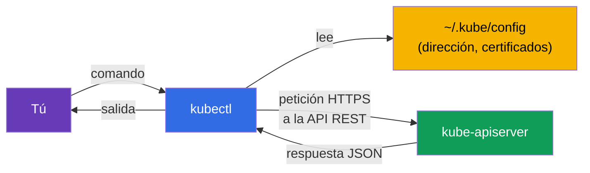
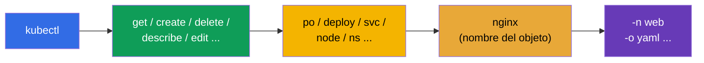
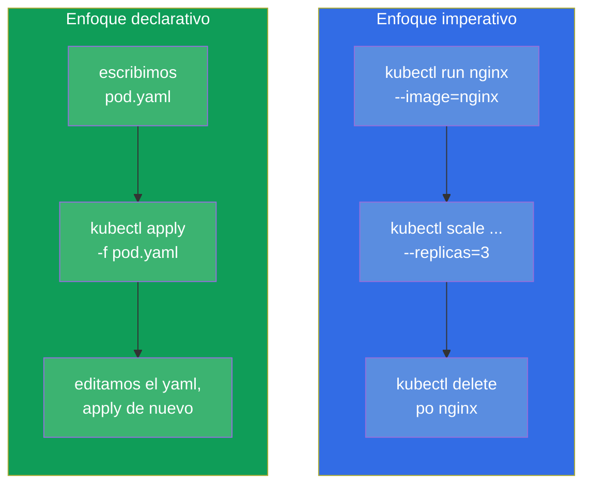
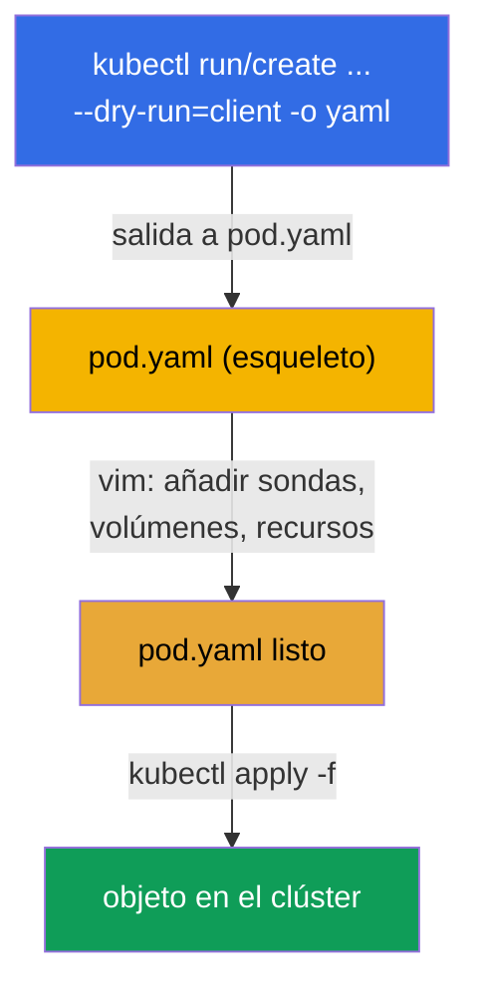
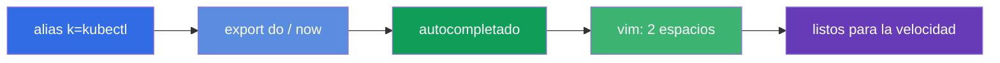

[Русская версия](ru.md) · [Eng version](README.md) · [Version française](fr.md) · [Deutsche Version](de.md) · [ქართული ვერსია](ge.md) · [繁體中文版](tw.md) · [日本語版](jp.md)

# Capítulo 3. Trabajar con kubectl: enfoques imperativo y declarativo

> **Qué viene ahora.** Ya entendemos de qué está hecho el clúster. Ahora cogeremos la
> herramienta principal - `kubectl`, con la que harás absolutamente todo: en el examen, en
> las prácticas y en el trabajo real. Este capítulo es el cimiento de la velocidad. En el
> examen, 15-20 tareas en 2 horas solo las resuelven quienes no escriben YAML a mano desde
> cero, sino que lo generan con comandos. Aquí veremos los dos enfoques (imperativo y
> declarativo), prepararemos el entorno de trabajo para ir rápido y aprenderemos a
> encontrar cualquier campo con `kubectl explain`. Todo lo que se domine aquí funciona en
> todos los capítulos siguientes.

## 3.1. Qué es kubectl y cómo se comunica con el clúster

`kubectl` es un cliente de línea de comandos. Él mismo no hace nada: convierte tus
comandos en peticiones HTTP a `kube-apiserver` e imprime la respuesta. Todo lo que vimos en
el capítulo 2 es aplicable: `kubectl` es un cliente más del servidor de API, igual que los
componentes internos.



¿De dónde sabe `kubectl` a qué clúster ir y cómo autenticarse? Del archivo de
configuración - **kubeconfig**, por defecto `~/.kube/config`. En él se describen los
clústeres (direcciones de la API), los usuarios (certificados/tokens) y los contextos
(combinaciones de clúster+usuario+namespace). El kubeconfig lo veremos en detalle en el
capítulo 39, pero los comandos básicos hacen falta ya ahora:

```bash
kubectl config view                       # mostrar la configuración actual
kubectl config get-contexts               # lista de contextos
kubectl config current-context            # qué contexto está activo ahora
kubectl config use-context cluster1       # cambiar de contexto
```

> **Importante para el examen.** En cada tarea se indica el clúster y el contexto. Lo
> primero que haces en una tarea es ejecutar `kubectl config use-context <el que toque>`.
> Si te olvidas de cambiar, habrás hecho la tarea en el clúster equivocado y perderás
> puntos. Es uno de los errores más frecuentes y más dolorosos.

## 3.2. Cómo instalar kubectl

En el examen y en nuestras prácticas `kubectl` ya está instalado - no hace falta ponerlo
tú. Pero para entrenar en tu propia máquina hay que instalarlo y, más importante,
comprender la **regla de compatibilidad de versiones**.

> **Regla del skew (desviación de versiones).** La versión de `kubectl` debe diferir de la
> de `kube-apiserver` en no más de **una release menor** (en ambas direcciones). Por
> ejemplo, con un servidor de API 1.34 valen `kubectl` 1.33, 1.34 o 1.35, pero no 1.32 ni
> 1.36. En la práctica, mantén `kubectl` en la misma versión menor que el clúster.

Formas de instalación en distintos sistemas operativos:

| SO / gestor | Comando |
|---------------|---------|
| Linux (binario) | `curl -LO "https://dl.k8s.io/release/$(curl -L -s https://dl.k8s.io/release/stable.txt)/bin/linux/amd64/kubectl"` |
| Linux (apt, Debian/Ubuntu) | `sudo apt-get install -y kubectl` (tras añadir el repositorio pkgs.k8s.io) |
| Linux (dnf, RHEL/Fedora) | `sudo dnf install -y kubectl` (tras añadir el repositorio) |
| macOS (Homebrew) | `brew install kubectl` |
| Windows (choco) | `choco install kubernetes-cli` |

La instalación manual del binario en Linux completa:

```bash
# 1. Descargar el binario de la última versión estable
curl -LO "https://dl.k8s.io/release/$(curl -L -s https://dl.k8s.io/release/stable.txt)/bin/linux/amd64/kubectl"

# 2. (opcional) verificar la suma de comprobación
curl -LO "https://dl.k8s.io/release/$(curl -L -s https://dl.k8s.io/release/stable.txt)/bin/linux/amd64/kubectl.sha256"
echo "$(cat kubectl.sha256)  kubectl" | sha256sum --check

# 3. Instalar en el PATH con los permisos adecuados
sudo install -o root -g root -m 0755 kubectl /usr/local/bin/kubectl
```

Comprobar que todo ha quedado en su sitio:

```bash
kubectl version --client            # versión solo del cliente (sin acceder al clúster)
kubectl version                     # versiones de cliente y servidor (hace falta acceso al clúster)
```

> **Consejo para el examen.** No tendrás que gastar tiempo en la instalación - el entorno
> está listo: `kubectl`, el alias `k` y el autocompletado ya vienen configurados de fábrica.
> Preparar tu propio entorno de instalación y configuración (sección 3.10) tiene sentido
> solo para entrenar en tu máquina personal.

## 3.3. Anatomía de un comando kubectl

Casi todos los comandos de `kubectl` se construyen con el mismo esquema:

```
kubectl [comando] [tipo] [nombre] [flags]
```



Por ejemplo, `kubectl get pods nginx -n web -o yaml`:
- **comando** `get` - qué hacer (obtener);
- **tipo** `pods` - con qué clase de objetos;
- **nombre** `nginx` - cuál en concreto (se puede omitir - entonces son todos);
- **flags** `-n web -o yaml` - en el namespace `web`, salida en YAML.

Los tipos de objetos tienen alias cortos que ahorran tiempo:

| Completo | Corto | Completo | Corto |
|--------|---------|--------|---------|
| pods | po | services | svc |
| deployments | deploy | namespaces | ns |
| replicasets | rs | configmaps | cm |
| nodes | no | persistentvolumeclaims | pvc |
| daemonsets | ds | persistentvolumes | pv |
| statefulsets | sts | serviceaccounts | sa |

La lista completa de alias - `kubectl api-resources`.

## 3.4. Dos enfoques: imperativo y declarativo

Este es el núcleo conceptual del capítulo. Los objetos de Kubernetes se pueden gestionar de
dos maneras.

- **Imperativo** - tú ordenas *qué hacer ahora*: «crea un pod», «borra el deployment»,
  «cambia la imagen». Es rápido, pero en ningún sitio queda guardado el historial de
  intenciones.
- **Declarativo** - describes el *estado deseado* en un archivo YAML y dices
  `kubectl apply -f`. Kubernetes decide por sí mismo qué crear o modificar. Es repetible,
  se versiona en git, sirve para trabajo en equipo y para producción.



**¿Cuándo usar cada enfoque?**

| Situación | Enfoque | Por qué |
|----------|--------|--------|
| Objeto simple en el examen (pod, sa, cm) | imperativo | es lo más rápido |
| Objeto complejo (hacen falta sondas, volúmenes, affinity) | híbrido: generar → editar | todo el YAML a mano no se escribe |
| Producción, trabajo en equipo | declarativo | git, revisión, repetibilidad |
| Comprobar/borrar algo rápido | imperativo | un solo comando |

**El término medio ideal para el examen es el híbrido.** Generamos el esqueleto del YAML
con un comando imperativo y `--dry-run=client -o yaml`, añadimos lo que falta en el editor
y lo aplicamos con `apply`. Es la forma más rápida de obtener un objeto complejo.

## 3.5. Comandos imperativos: creamos objetos rápido

Dos comandos clave de creación: `kubectl run` (para un pod suelto) y `kubectl create`
(para el resto de objetos).

```bash
# Pod
kubectl run nginx --image=nginx

# Pod con puerto y variables de entorno
kubectl run web --image=nginx --port=80 --env="KEY=value"

# Deployment con 3 réplicas
kubectl create deployment web --image=nginx --replicas=3

# Namespace
kubectl create namespace dev

# ConfigMap a partir de literales
kubectl create configmap app-cfg --from-literal=COLOR=blue

# Secret
kubectl create secret generic db --from-literal=password=s3cret

# Service: exponer el puerto del deployment
kubectl expose deployment web --port=80 --target-port=80

# Escalado
kubectl scale deployment web --replicas=5

# Cambiar la imagen
kubectl set image deployment/web nginx=nginx:1.27
```

Muchos comandos `run`/`create`/`expose` son la única forma rápida de obtener un objeto en
el examen. Vale la pena automatizarlos hasta el reflejo.

## 3.6. Generación de manifiestos: `--dry-run=client -o yaml`

Esta es, probablemente, la técnica más importante de todo el curso para ganar velocidad.
Los flags `--dry-run=client -o yaml` significan: «no crees el objeto de verdad, solo
muéstrame qué YAML enviarías». Redirigimos ese YAML a un archivo, lo editamos y lo
aplicamos.



En la práctica:

```bash
# Generar el esqueleto de un pod en un archivo
kubectl run nginx --image=nginx --dry-run=client -o yaml > pod.yaml

# Generar el esqueleto de un deployment
kubectl create deployment web --image=nginx --replicas=3 \
  --dry-run=client -o yaml > deploy.yaml

# Editar y aplicar
vim pod.yaml
kubectl apply -f pod.yaml
```

Lo importante que hay que entender sobre `--dry-run`:
- `--dry-run=client` - no accede en absoluto al servidor, simplemente renderiza el YAML en
  local;
- `--dry-run=server` - lo envía al servidor, este pasa la validación y el admission, pero
  no lo guarda. Es útil para comprobar si el objeto pasaría, sin crearlo.

## 3.7. Enfoque declarativo: apply, create, replace

En la gestión declarativa trabajas con archivos. Los comandos principales:

```bash
kubectl apply -f pod.yaml          # crear o actualizar según el manifiesto
kubectl apply -f ./manifests/      # aplicar todos los archivos del directorio
kubectl delete -f pod.yaml         # borrar los objetos del manifiesto
kubectl create -f pod.yaml         # crear (falla si ya existe)
kubectl replace -f pod.yaml        # reemplazar por completo el existente
```

La diferencia entre `create` y `apply` es de fondo:

| Comando | Si el objeto no existe | Si el objeto ya existe |
|---------|------------------|----------------------|
| `create -f` | lo crea | error (ya existe) |
| `apply -f` | lo crea | lo actualiza (fusión inteligente de cambios) |
| `replace -f` | error (no hay objeto) | lo reemplaza por completo |

`apply` es el caballo de batalla del enfoque declarativo: sabe hacer **fusión a tres
bandas** (3-way merge), comparando tu archivo, el estado actual y la última versión
aplicada. Por eso `apply` se puede repetir tantas veces como quieras - es idempotente.

## 3.8. Leemos el estado: get, describe, logs

La mitad del trabajo (y del examen) no es crear, sino mirar qué está pasando.

```bash
# Lista de objetos
kubectl get pods
kubectl get pods -o wide            # + nodo e IP
kubectl get pods -A                 # en todos los namespace (--all-namespaces)
kubectl get pods --show-labels      # con las etiquetas
kubectl get pods -w                 # seguir en tiempo real (watch)

# Detalles del objeto (los eventos de abajo son oro para depurar)
kubectl describe pod nginx

# Logs del contenedor
kubectl logs nginx                  # logs del pod
kubectl logs nginx -c app           # un contenedor concreto
kubectl logs nginx -f               # en tiempo real
kubectl logs nginx --previous       # logs del contenedor anterior que se cayó

# Comando dentro del contenedor
kubectl exec nginx -- ls /          # ejecutar un comando
kubectl exec -it nginx -- sh        # shell interactiva

# Eventos del clúster
kubectl get events --sort-by='.lastTimestamp'
```

La habilidad clave de depuración: `kubectl describe` imprime abajo la sección **Events** -
justo ahí están las razones de «por qué el pod no arranca», «por qué está pending», «por qué
falla el image pull». De esto, en detalle en el capítulo 44.

## 3.9. Formatos de salida y JSONPath

El flag `-o` controla el formato de salida. Sirve tanto en la vida real como en el examen (a
veces piden «saca los nombres de todos los pods a un archivo»).

```bash
kubectl get pods -o wide            # tabla ampliada
kubectl get pod nginx -o yaml       # YAML completo del objeto
kubectl get pod nginx -o json       # lo mismo en JSON
kubectl get pods -o name            # solo los nombres (pod/nginx)

# JSONPath — extraer campos concretos
kubectl get pods -o jsonpath='{.items[*].metadata.name}'
kubectl get nodes -o jsonpath='{.items[*].status.addresses[?(@.type=="InternalIP")].address}'

# Tabla propia con custom-columns
kubectl get pods -o custom-columns=NAME:.metadata.name,NODE:.spec.nodeName
```

JSONPath y custom-columns los veremos en detalle en el capítulo 47 (preparación para CKAD) -
allí es un tipo de tarea frecuente. Por ahora basta con saber que existe esa herramienta.

## 3.10. Preparar el entorno para ir rápido

En el examen actual (PSI) el entorno básico ya viene listo de fábrica: `kubectl`, el alias
`k` y el autocompletado suelen estar preconfigurados - no hace falta instalar nada
especialmente. Por eso lo primero que conviene hacer en el examen no es configurar el
entorno, sino **comprobar** que lo necesario ya funciona (`k get ns`, autocompletado con
`Tab`). Las variables auxiliares (`do`, `now`), en cambio, no están definidas por defecto -
las añades tú si quieres.

Para entrenar en tu propia máquina, todo el conjunto de abajo se configura a mano - te
ahorra decenas de minutos.

```bash
# Alias k = kubectl
alias k=kubectl

# Variables auxiliares para generar manifiestos y borrar rápido
export do="--dry-run=client -o yaml"
export now="--force --grace-period=0"

# Autocompletado de comandos
source <(kubectl completion bash)
complete -o default -F __start_kubectl k

# Configuración de vim para YAML: 2 espacios, sin tabuladores
echo 'set tabstop=2 shiftwidth=2 expandtab' >> ~/.vimrc
export KUBE_EDITOR=vim
```

Ahora se puede escribir corto:

```bash
k run nginx --image=nginx $do > pod.yaml     # = --dry-run=client -o yaml
k delete po nginx $now                        # borrado instantáneo
```



> **Sobre la indentación en YAML.** Kubernetes solo acepta espacios, los tabuladores están
> prohibidos. La opción `expandtab` en vim convierte el tabulador en espacios - sin ella es
> fácil provocar un error de parseo y perder tiempo. Esto se configura antes que todo lo
> demás.

## 3.11. `kubectl explain`: la documentación en el propio terminal

¿Se te ha olvidado cómo se llama un campo o en qué nivel de anidamiento está? No hace falta
irse al navegador - `kubectl explain` muestra el esquema de cualquier objeto directamente en
el terminal.

```bash
kubectl explain pod                       # nivel superior
kubectl explain pod.spec                  # campos de spec
kubectl explain pod.spec.containers       # campos del contenedor
kubectl explain pod.spec.containers.livenessProbe   # y así hacia dentro
kubectl explain pod --recursive           # todo el árbol de campos de golpe
```

Es insustituible cuando recuerdas el sentido del campo pero has olvidado su nombre exacto o
la jerarquía. Funciona con cualquier tipo, incluidos los CRD (capítulo 41).

## 3.12. Editar y borrar objetos vivos

```bash
# Abrir el objeto en el editor y corregirlo al vuelo
kubectl edit deployment web

# Poner/quitar una etiqueta
kubectl label pod nginx env=prod
kubectl label pod nginx env-               # el signo «menos» quita la etiqueta

# Anotaciones — igual
kubectl annotate pod nginx note="hello"

# Borrado
kubectl delete pod nginx
kubectl delete -f pod.yaml
kubectl delete pod nginx --force --grace-period=0    # al instante, sin esperar
```

Un matiz importante: algunos campos del pod son **inmutables** después de la creación (por
ejemplo, la imagen del contenedor en un Pod pelado sí se puede cambiar, pero muchas cosas de
`spec` no). Si `kubectl edit` no deja guardar, habrá que borrar el objeto y crearlo de nuevo
a partir del manifiesto corregido. Para un Deployment eso no es problema - allí las
correcciones se aplican mediante un nuevo rollout (capítulo 8).

## 3.13. Cómo se aplica esto en producción

- **Declaratividad y GitOps.** En la explotación real casi nadie crea objetos de forma
  imperativa. Todos los manifiestos están en git, y herramientas como **Argo CD** o **Flux**
  los aplican automáticamente al clúster (`apply`) y vigilan que el estado del clúster
  coincida con el repositorio. Los comandos imperativos en producción son sobre todo
  depuración y operaciones puntuales.
- **`kubectl` solo para leer y analizar.** En equipos maduros los cambios directos con
  `kubectl edit`/`delete` en producción son tabú (es «deriva» respecto a git). En cambio
  `get`, `describe`, `logs`, `exec` son herramientas diarias del ingeniero de guardia al
  analizar incidentes.
- **Contextos y seguridad.** Los ingenieros suelen tener varios clústeres en el kubeconfig
  (dev/stage/prod). Confundir el contexto y ejecutar un comando en producción en lugar de dev
  es un incidente real. Por eso en producción se usan utilidades como `kubectx`/`kube-ps1`,
  que muestran el contexto activo directamente en el prompt del shell.
- **Permisos de acceso.** Lo que te está permitido hacer con `kubectl` lo limita RBAC
  (capítulo 38). Un desarrollador normalmente tiene acceso solo a sus namespace, no a todo el
  clúster.

## 3.14. Miniglosario

- **kubectl** - cliente de línea de comandos, convierte los comandos en peticiones al servidor de API.
- **kubeconfig** - archivo (`~/.kube/config`) con clústeres, usuarios y contextos.
- **Contexto** - combinación de clúster + usuario + namespace; se cambia con
  `use-context`.
- **Enfoque imperativo** - gestión mediante acciones (`run`, `create`, `delete`).
- **Enfoque declarativo** - gestión del estado deseado mediante `apply -f`.
- **`--dry-run=client -o yaml`** - generar el YAML sin crear nada.
- **apply** - crear o actualizar un objeto según el manifiesto (idempotente, 3-way merge).
- **JSONPath** - lenguaje de selección de campos de la respuesta de la API (`-o jsonpath=...`).
- **kubectl explain** - documentación integrada de los campos de los objetos.

## 3.15. Resumen del capítulo

- `kubectl` es un cliente del servidor de API; a dónde ir y cómo autorizarse lo saca del kubeconfig.
- En cada tarea cambia primero el contexto (`config use-context`) - de lo contrario harás
  el trabajo en el clúster equivocado.
- El comando se construye como `kubectl [comando] [tipo] [nombre] [flags]`; los tipos tienen
  alias cortos (po, deploy, svc, ...).
- Dos enfoques: imperativo (rápido, puntual) y declarativo (`apply`, repetible, para git y
  producción). El término medio en el examen es generar el YAML y retocarlo.
- `--dry-run=client -o yaml` es la técnica principal de velocidad: obtenemos el esqueleto del
  manifiesto con un comando, añadimos lo complicado en el editor y aplicamos con `apply`.
- Lectura del estado: `get` (incluidos `-o wide`, `-A`, `-w`), `describe` (¡Events!), `logs`
  (`-f`, `--previous`), `exec`, `get events`.
- En el examen el entorno básico (`kubectl`, alias `k`, autocompletado) suele venir
  preconfigurado - compruébalo en vez de configurarlo desde cero; los helpers `do`/`now` los
  añades tú si quieres. Para tu máquina de entrenamiento configura todo el conjunto (alias,
  `do`/`now`, autocompletado, vim con 2 espacios) - te ahorra decenas de minutos.
- `kubectl explain` sustituye la visita al navegador para buscar nombres de campos.

## 3.16. Para qué sirve: en el examen y en el trabajo real

**En el examen.** Es la habilidad base de ambos exámenes - sin soltura con `kubectl` no te da
tiempo a ninguna tarea. No hay tareas directas de «configura un alias», pero la velocidad que
da este capítulo determina cuántas tareas resolverás. Las técnicas de `--dry-run`, los alias
cortos, `explain`, un `describe`/`logs` rápido se usan en una de cada dos tareas.

**En el trabajo real.** `kubectl get/describe/logs/exec` es la herramienta diaria de
cualquiera que explote Kubernetes: el análisis de incidentes empieza precisamente por ahí.
Entender la diferencia entre los enfoques imperativo y declarativo determina cómo está
construido todo el proceso de entrega: en los equipos maduros todo es declarativo y vía git
(GitOps), y los comandos imperativos quedan para la depuración.

## 3.17. Preguntas de autoevaluación

1. ¿Cómo sabe `kubectl` a qué clúster conectarse y con qué identidad? ¿Qué pasa si no
   cambias el contexto en el examen?
2. ¿En qué se diferencia el enfoque imperativo del declarativo? ¿Cuándo es adecuado cada uno?
3. ¿Qué hace `--dry-run=client -o yaml` y por qué es la técnica clave para la velocidad?
4. ¿Cuál es la diferencia entre `kubectl create -f`, `apply -f` y `replace -f`?
5. ¿Dónde muestra `kubectl describe` las causas de los problemas con un objeto?
6. ¿Para qué configurar `expandtab` en vim antes del examen?
7. ¿Cómo recordar el nombre exacto de un campo de la especificación del pod sin abrir el navegador?

## Práctica

Ya tienes la herramienta. En los capítulos siguientes empezaremos a crear objetos reales:
pods (capítulo 4), luego ReplicaSet y Deployment (capítulo 5). Todas las técnicas de
`kubectl` de este capítulo las repasarás en la primera práctica de laboratorio unificada
junto con los objetos básicos.

🧪 Práctica 119 (ejercicios de velocidad y JSONPath): [tasks/cka/labs/119](../../labs/119/README_ES.MD)

---
[Índice](../README_ES.md) · [Capítulo 2](../02/es.md) · [Capítulo 4](../04/es.md)
