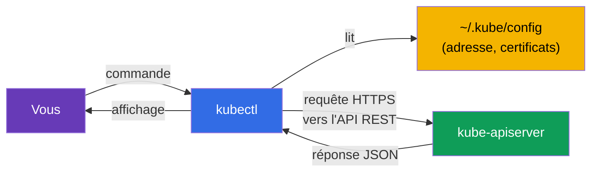
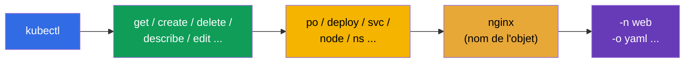
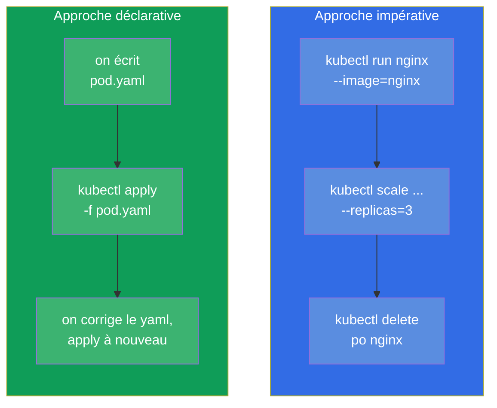
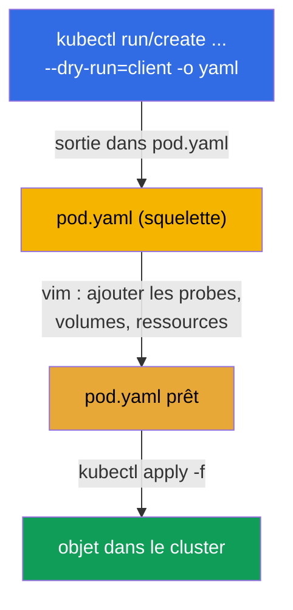

[Русская версия](ru.md) · [Eng version](README.md) · [Versión en español](es.md) · [Deutsche Version](de.md) · [ქართული ვერსია](ge.md)

# Chapitre 3. Travailler avec kubectl : approches impérative et déclarative

> **Ce qui suit.** Nous avons compris de quoi le cluster est constitué. Prenons maintenant
> en main l'outil principal - `kubectl` - avec lequel vous allez absolument tout faire : à
> l'examen, dans les TP et dans le travail réel. Ce chapitre est le fondement de la vitesse.
> À l'examen, 15-20 tâches en 2 heures, seuls y arrivent ceux qui n'écrivent pas le YAML à
> la main depuis zéro, mais le génèrent par des commandes. Ici nous verrons les deux
> approches (impérative et déclarative), nous réglerons l'environnement de travail pour la
> vitesse et nous apprendrons à trouver n'importe quel champ via `kubectl explain`. Tout ce
> qui est acquis ici sert dans tous les chapitres suivants.

## 3.1. Ce qu'est kubectl et comment il communique avec le cluster

`kubectl` est un client en ligne de commande. Il ne fait rien par lui-même : il transforme
vos commandes en requêtes HTTP vers `kube-apiserver` et affiche la réponse. Tout ce que nous
avons vu au chapitre 2 s'applique : `kubectl` est un client de plus du serveur d'API, au
même titre que les composants internes.



D'où `kubectl` sait-il vers quel cluster aller et comment s'authentifier ? Depuis le fichier
de configuration - **kubeconfig**, par défaut `~/.kube/config`. Y sont décrits les clusters
(adresses de l'API), les utilisateurs (certificats/tokens) et les contextes (associations
cluster+utilisateur+namespace). Nous détaillerons kubeconfig au chapitre 39, mais les
commandes de base sont nécessaires dès maintenant :

```bash
kubectl config view                       # afficher la configuration courante
kubectl config get-contexts               # liste des contextes
kubectl config current-context            # quel contexte est actif en ce moment
kubectl config use-context cluster1       # basculer sur un contexte
```

> **Important pour l'examen.** Dans chaque énoncé sont indiqués le cluster et le contexte.
> La première chose que vous faites dans une tâche, c'est exécuter
> `kubectl config use-context <celui qu'il faut>`. Vous avez oublié de basculer - vous avez
> fait la tâche dans le mauvais cluster et perdu des points. C'est l'une des erreurs les
> plus fréquentes et les plus rageantes.

## 3.2. Comment installer kubectl

À l'examen et dans nos TP, `kubectl` est déjà installé - pas besoin de l'installer
soi-même. Mais pour s'entraîner sur sa propre machine, il faut le mettre en place et,
surtout, comprendre la **règle de compatibilité des versions**.

> **Règle du skew (écart de versions).** La version de `kubectl` ne doit pas s'écarter de la
> version de `kube-apiserver` de plus d'**une version mineure** (dans les deux sens). Par
> exemple, un serveur d'API 1.34 accepte `kubectl` 1.33, 1.34 ou 1.35, mais pas 1.32 ni
> 1.36. En pratique, gardez `kubectl` dans la même version mineure que le cluster.

Méthodes d'installation selon les OS :

| OS / gestionnaire | Commande |
|---------------|---------|
| Linux (binaire) | `curl -LO "https://dl.k8s.io/release/$(curl -L -s https://dl.k8s.io/release/stable.txt)/bin/linux/amd64/kubectl"` |
| Linux (apt, Debian/Ubuntu) | `sudo apt-get install -y kubectl` (après avoir ajouté le dépôt pkgs.k8s.io) |
| Linux (dnf, RHEL/Fedora) | `sudo dnf install -y kubectl` (après avoir ajouté le dépôt) |
| macOS (Homebrew) | `brew install kubectl` |
| Windows (choco) | `choco install kubernetes-cli` |

L'installation manuelle du binaire sous Linux, de bout en bout :

```bash
# 1. Télécharger le binaire de la dernière version stable
curl -LO "https://dl.k8s.io/release/$(curl -L -s https://dl.k8s.io/release/stable.txt)/bin/linux/amd64/kubectl"

# 2. (facultatif) vérifier la somme de contrôle
curl -LO "https://dl.k8s.io/release/$(curl -L -s https://dl.k8s.io/release/stable.txt)/bin/linux/amd64/kubectl.sha256"
echo "$(cat kubectl.sha256)  kubectl" | sha256sum --check

# 3. Installer dans le PATH avec les droits voulus
sudo install -o root -g root -m 0755 kubectl /usr/local/bin/kubectl
```

Vérification que tout est en place :

```bash
kubectl version --client            # version du client seul (sans contacter le cluster)
kubectl version                     # versions du client et du serveur (accès au cluster requis)
```

> **Conseil pour l'examen.** Vous n'aurez pas à perdre de temps sur l'installation -
> l'environnement est prêt : `kubectl`, l'alias `k` et l'autocomplétion sont déjà réglés
> d'origine. Votre propre environnement à installer et à configurer (section 3.10) n'a de
> sens à préparer que pour l'entraînement sur une machine personnelle.

## 3.3. Anatomie d'une commande kubectl

Presque toutes les commandes `kubectl` suivent un même schéma :

```
kubectl [commande] [type] [nom] [flags]
```



Par exemple, `kubectl get pods nginx -n web -o yaml` :
- **commande** `get` - quoi faire (récupérer) ;
- **type** `pods` - sur quelle sorte d'objets ;
- **nom** `nginx` - lequel précisément (on peut l'omettre - alors ce sera tous) ;
- **flags** `-n web -o yaml` - dans le namespace `web`, sortie en YAML.

Les types d'objets ont des alias courts qui font gagner du temps :

| Complet | Court | Complet | Court |
|--------|---------|--------|---------|
| pods | po | services | svc |
| deployments | deploy | namespaces | ns |
| replicasets | rs | configmaps | cm |
| nodes | no | persistentvolumeclaims | pvc |
| daemonsets | ds | persistentvolumes | pv |
| statefulsets | sts | serviceaccounts | sa |

La liste complète des alias - `kubectl api-resources`.

## 3.4. Deux approches : impérative et déclarative

C'est le cœur conceptuel du chapitre. On peut gérer les objets Kubernetes de deux façons.

- **Impérative** - vous commandez *ce qu'il faut faire maintenant* : « crée un pod »,
  « supprime le deployment », « change l'image ». Rapide, mais l'historique des intentions
  n'est conservé nulle part.
- **Déclarative** - vous décrivez l'*état souhaité* dans un fichier YAML et vous dites
  `kubectl apply -f`. Kubernetes décide lui-même quoi créer ou modifier. Reproductible,
  versionné dans git, adapté au travail en équipe et à la production.



**Quelle approche utiliser et quand ?**

| Situation | Approche | Pourquoi |
|----------|--------|--------|
| Objet simple à l'examen (pod, sa, cm) | impérative | c'est le plus rapide |
| Objet complexe (probes, volumes, affinity nécessaires) | hybride : générer → corriger | impossible d'écrire tout le YAML à la main |
| Production, travail en équipe | déclarative | git, revue, reproductibilité |
| Vérifier/supprimer quelque chose rapidement | impérative | une seule commande |

**Le juste milieu pour l'examen, c'est l'hybride.** On génère le squelette du YAML par une
commande impérative avec `--dry-run=client -o yaml`, on complète ce qu'il faut dans
l'éditeur, on applique via `apply`. C'est la façon la plus rapide d'obtenir un objet
complexe.

## 3.5. Commandes impératives : créer des objets vite

Deux commandes clés de création : `kubectl run` (pour un pod isolé) et `kubectl create`
(pour les autres objets).

```bash
# Pod
kubectl run nginx --image=nginx

# Pod avec un port et des variables d'environnement
kubectl run web --image=nginx --port=80 --env="KEY=value"

# Deployment avec 3 réplicas
kubectl create deployment web --image=nginx --replicas=3

# Namespace
kubectl create namespace dev

# ConfigMap depuis des littéraux
kubectl create configmap app-cfg --from-literal=COLOR=blue

# Secret
kubectl create secret generic db --from-literal=password=s3cret

# Service : exposer le port du deployment
kubectl expose deployment web --port=80 --target-port=80

# Mise à l'échelle
kubectl scale deployment web --replicas=5

# Changer l'image
kubectl set image deployment/web nginx=nginx:1.27
```

Beaucoup de commandes `run`/`create`/`expose` sont le seul moyen rapide d'obtenir un objet à
l'examen. Il faut les amener au réflexe automatique.

## 3.6. Génération de manifestes : `--dry-run=client -o yaml`

C'est peut-être la technique la plus importante de tout le cours pour la vitesse. Les flags
`--dry-run=client -o yaml` signifient : « ne crée pas réellement l'objet, mais montre-moi
quel YAML tu enverrais ». On redirige ce YAML dans un fichier, on le corrige et on
l'applique.



En pratique :

```bash
# Générer le squelette d'un pod dans un fichier
kubectl run nginx --image=nginx --dry-run=client -o yaml > pod.yaml

# Générer le squelette d'un deployment
kubectl create deployment web --image=nginx --replicas=3 \
  --dry-run=client -o yaml > deploy.yaml

# Éditer et appliquer
vim pod.yaml
kubectl apply -f pod.yaml
```

Ce qu'il est important de comprendre à propos de `--dry-run` :
- `--dry-run=client` - ne contacte pas du tout le serveur, il rend simplement le YAML en local ;
- `--dry-run=server` - envoie au serveur, celui-ci exécute la validation et l'admission, mais
  n'enregistre rien. Utile pour vérifier si l'objet passerait, sans le créer.

## 3.7. Approche déclarative : apply, create, replace

En gestion déclarative, vous travaillez avec des fichiers. Les commandes principales :

```bash
kubectl apply -f pod.yaml          # créer ou mettre à jour d'après le manifeste
kubectl apply -f ./manifests/      # appliquer tous les fichiers d'un répertoire
kubectl delete -f pod.yaml         # supprimer les objets du manifeste
kubectl create -f pod.yaml         # créer (échoue si l'objet existe déjà)
kubectl replace -f pod.yaml        # remplacer entièrement l'objet existant
```

La différence entre `create` et `apply` est fondamentale :

| Commande | Si l'objet n'existe pas | Si l'objet existe déjà |
|---------|------------------|----------------------|
| `create -f` | le crée | erreur (existe déjà) |
| `apply -f` | le crée | le met à jour (fusion intelligente des changements) |
| `replace -f` | erreur (objet inexistant) | le remplace entièrement |

`apply` est la bête de trait de l'approche déclarative : elle sait faire une **fusion à
trois voies** (3-way merge), en comparant votre fichier, l'état courant et la dernière
version appliquée. C'est pourquoi on peut répéter `apply` autant de fois qu'on veut - c'est
idempotent.

## 3.8. Lire l'état : get, describe, logs

La moitié du travail (et de l'examen) consiste non pas à créer, mais à regarder ce qui se
passe.

```bash
# Liste des objets
kubectl get pods
kubectl get pods -o wide            # + le nœud et l'IP
kubectl get pods -A                 # dans tous les namespaces (--all-namespaces)
kubectl get pods --show-labels      # avec les labels
kubectl get pods -w                 # suivre en temps réel (watch)

# Détails d'un objet (les événements en bas - de l'or pour le débogage)
kubectl describe pod nginx

# Logs d'un conteneur
kubectl logs nginx                  # logs du pod
kubectl logs nginx -c app           # un conteneur précis
kubectl logs nginx -f               # en temps réel
kubectl logs nginx --previous       # logs du conteneur précédent qui a planté

# Commande à l'intérieur d'un conteneur
kubectl exec nginx -- ls /          # exécuter une commande
kubectl exec -it nginx -- sh        # shell interactif

# Événements du cluster
kubectl get events --sort-by='.lastTimestamp'
```

Compétence clé du débogage : `kubectl describe` affiche en bas la section **Events** - c'est
précisément là que se trouvent les raisons du « pourquoi le pod ne démarre pas », « pourquoi
il est pending », « pourquoi image pull failed ». À ce sujet - en détail au chapitre 44.

## 3.9. Formats de sortie et JSONPath

Le flag `-o` pilote le format de sortie. Cela sert dans la vraie vie comme à l'examen
(parfois on demande « écris les noms de tous les pods dans un fichier »).

```bash
kubectl get pods -o wide            # tableau étendu
kubectl get pod nginx -o yaml       # YAML complet de l'objet
kubectl get pod nginx -o json       # la même chose en JSON
kubectl get pods -o name            # seulement les noms (pod/nginx)

# JSONPath - extraction de champs précis
kubectl get pods -o jsonpath='{.items[*].metadata.name}'
kubectl get nodes -o jsonpath='{.items[*].status.addresses[?(@.type=="InternalIP")].address}'

# Son propre tableau via custom-columns
kubectl get pods -o custom-columns=NAME:.metadata.name,NODE:.spec.nodeName
```

JSONPath et custom-columns seront détaillés au chapitre 47 (préparation au CKAD) - c'est un
type de tâche fréquent là-bas. Pour l'instant il suffit de savoir qu'un tel outil existe.

## 3.10. Régler l'environnement pour la vitesse

À l'examen actuel (PSI), l'environnement de base est déjà prêt d'origine : `kubectl`,
l'alias `k` et l'autocomplétion sont d'ordinaire préconfigurés - pas besoin d'installer
quoi que ce soit exprès. C'est pourquoi la première chose à faire à l'examen n'est pas de
régler l'environnement, mais de **vérifier** que le nécessaire fonctionne déjà (`k get ns`,
l'autocomplétion par `Tab`). En revanche les variables d'aide (`do`, `now`) ne sont pas
définies par défaut - vous les ajoutez vous-même si vous le souhaitez.

Pour l'entraînement sur sa propre machine, tout l'ensemble ci-dessous se configure
soi-même - il fait gagner des dizaines de minutes.

```bash
# Alias k = kubectl
alias k=kubectl

# Variables d'aide pour générer des manifestes et supprimer vite
export do="--dry-run=client -o yaml"
export now="--force --grace-period=0"

# Autocomplétion des commandes
source <(kubectl completion bash)
complete -o default -F __start_kubectl k

# Réglage de vim pour YAML : 2 espaces, sans tabulations
echo 'set tabstop=2 shiftwidth=2 expandtab' >> ~/.vimrc
export KUBE_EDITOR=vim
```

On peut maintenant écrire court :

```bash
k run nginx --image=nginx $do > pod.yaml     # = --dry-run=client -o yaml
k delete po nginx $now                        # suppression instantanée
```


> **À propos de l'indentation en YAML.** Kubernetes n'accepte que les espaces, les
> tabulations sont interdites. Le réglage `expandtab` dans vim transforme la tabulation en
> espaces - sans lui, on obtient facilement une erreur de parsing et on perd du temps. Cela
> se configure avant tout le reste.

## 3.11. `kubectl explain` : la documentation directement dans le terminal

Vous avez oublié comment s'appelle un champ ou à quel niveau d'imbrication il se trouve ?
Pas obligé d'aller dans le navigateur - `kubectl explain` montre le schéma de n'importe quel
objet directement dans le terminal.

```bash
kubectl explain pod                       # niveau supérieur
kubectl explain pod.spec                  # champs de spec
kubectl explain pod.spec.containers       # champs du conteneur
kubectl explain pod.spec.containers.livenessProbe   # et ainsi en profondeur
kubectl explain pod --recursive           # tout l'arbre des champs d'un coup
```

C'est irremplaçable quand on se souvient du sens d'un champ, mais qu'on a oublié son nom
exact ou sa hiérarchie. Ça marche pour n'importe quel type, y compris les CRD (chapitre 41).

## 3.12. Éditer et supprimer des objets vivants

```bash
# Ouvrir l'objet dans l'éditeur et le corriger à la volée
kubectl edit deployment web

# Poser/retirer un label
kubectl label pod nginx env=prod
kubectl label pod nginx env-               # le signe « moins » retire le label

# Annotations - de la même manière
kubectl annotate pod nginx note="hello"

# Suppression
kubectl delete pod nginx
kubectl delete -f pod.yaml
kubectl delete pod nginx --force --grace-period=0    # immédiatement, sans attendre
```

Subtilité importante : certains champs du pod sont **immuables** après la création (par
exemple, l'image du conteneur dans un Pod nu peut être changée, mais beaucoup de choses dans
`spec` - non). Si `kubectl edit` ne laisse pas enregistrer, il faudra supprimer l'objet et
le recréer depuis le manifeste corrigé. Pour un Deployment ce n'est pas un problème - là les
corrections s'appliquent via un nouveau rollout (chapitre 8).

## 3.13. Comment cela s'applique en production

- **Déclarativité et GitOps.** En exploitation réelle, presque personne ne crée les objets
  de façon impérative. Tous les manifestes sont dans git, et des outils comme **Argo CD** ou
  **Flux** les appliquent automatiquement dans le cluster (`apply`) et veillent à ce que
  l'état du cluster corresponde au dépôt. Les commandes impératives en prod, c'est surtout
  du débogage et des opérations ponctuelles.
- **`kubectl` seulement pour lire et analyser.** Dans les équipes mûres, les modifications
  directes via `kubectl edit`/`delete` en prod sont tabou (c'est de la « dérive » par
  rapport à git). En revanche `get`, `describe`, `logs`, `exec` sont les outils quotidiens
  de l'ingénieur d'astreinte lors de l'analyse d'incidents.
- **Contextes et sécurité.** Les ingénieurs ont d'ordinaire plusieurs clusters dans leur
  kubeconfig (dev/stage/prod). Confondre le contexte et exécuter une commande en prod au
  lieu de dev - c'est un incident réel. C'est pourquoi en prod on utilise des utilitaires
  comme `kubectx`/`kube-ps1`, qui affichent le contexte actif directement dans l'invite du
  shell.
- **Droits d'accès.** Ce que vous êtes autorisé à faire via `kubectl` est limité par RBAC
  (chapitre 38). Un développeur n'a d'ordinaire accès qu'à ses propres namespaces, et non à
  tout le cluster.

## 3.14. Mini-glossaire

- **kubectl** - client en ligne de commande, transforme les commandes en requêtes vers le
  serveur d'API.
- **kubeconfig** - fichier (`~/.kube/config`) avec les clusters, les utilisateurs et les
  contextes.
- **Contexte** - association cluster + utilisateur + namespace ; se change avec
  `use-context`.
- **Approche impérative** - gestion par actions (`run`, `create`, `delete`).
- **Approche déclarative** - gestion de l'état souhaité via `apply -f`.
- **`--dry-run=client -o yaml`** - générer le YAML sans rien créer.
- **apply** - créer ou mettre à jour un objet d'après un manifeste (idempotent, 3-way merge).
- **JSONPath** - langage de sélection de champs dans la réponse de l'API (`-o jsonpath=...`).
- **kubectl explain** - documentation intégrée sur les champs des objets.

## 3.15. Récapitulatif du chapitre

- `kubectl` est un client du serveur d'API ; où aller et comment s'autoriser, il le prend
  dans kubeconfig.
- Dans chaque tâche, basculez d'abord le contexte (`config use-context`) - sinon vous ferez
  le travail dans le mauvais cluster.
- La commande se construit comme `kubectl [commande] [type] [nom] [flags]` ; les types ont
  des alias courts (po, deploy, svc, ...).
- Deux approches : impérative (rapide, ponctuelle) et déclarative (`apply`, reproductible,
  pour git et la prod). Le juste milieu à l'examen - générer le YAML et le compléter.
- `--dry-run=client -o yaml` est la technique de vitesse principale : on obtient le
  squelette du manifeste par une commande, on ajoute le compliqué dans l'éditeur, on
  applique via `apply`.
- Lecture de l'état : `get` (y compris `-o wide`, `-A`, `-w`), `describe` (Events !), `logs`
  (`-f`, `--previous`), `exec`, `get events`.
- À l'examen, l'environnement de base (`kubectl`, l'alias `k`, l'autocomplétion) est
  d'ordinaire préconfiguré - vérifiez-le, ne le réglez pas de zéro ; les aides `do`/`now`,
  vous les ajoutez vous-même si vous le voulez. Pour votre machine d'entraînement,
  configurez tout l'ensemble vous-même (alias, `do`/`now`, autocomplétion, vim avec
  2 espaces) - il fait gagner des dizaines de minutes.
- `kubectl explain` remplace le passage par le navigateur pour retrouver les noms des champs.

## 3.16. À quoi cela sert : à l'examen et dans le travail réel

**À l'examen.** C'est tout simplement la compétence de base des deux examens - sans un
`kubectl` fluide, on n'a le temps pour aucune tâche. Il n'y a pas de tâche directe « règle
un alias », mais la vitesse que donne ce chapitre détermine combien de tâches vous
résoudrez. Les techniques `--dry-run`, les alias courts, `explain`, un `describe`/`logs`
rapide s'appliquent dans une tâche sur deux.

**Dans le travail réel.** `kubectl get/describe/logs/exec` est l'outil quotidien de
quiconque exploite Kubernetes : l'analyse des incidents commence précisément par eux.
Comprendre la différence entre approche impérative et déclarative détermine comment tout le
processus de livraison est construit : dans les équipes mûres tout est déclaratif et passe
par git (GitOps), et les commandes impératives restent pour le débogage.

## 3.17. Questions d'auto-évaluation

1. Comment `kubectl` sait-il à quel cluster se connecter et sous quelle identité ?
   Qu'arrive-t-il si l'on ne bascule pas le contexte à l'examen ?
2. En quoi l'approche impérative diffère-t-elle de la déclarative ? Quand chacune est-elle
   appropriée ?
3. Que fait `--dry-run=client -o yaml` et pourquoi est-ce la technique clé pour la vitesse ?
4. Quelle est la différence entre `kubectl create -f`, `apply -f` et `replace -f` ?
5. Où `kubectl describe` montre-t-il les causes des problèmes d'un objet ?
6. Pourquoi configurer `expandtab` dans vim avant l'examen ?
7. Comment, sans ouvrir le navigateur, retrouver le nom exact d'un champ dans la
   spécification d'un pod ?

## Pratique

Vous avez maintenant l'outil. Dans les chapitres suivants nous commencerons à créer de vrais
objets : les pods (chapitre 4), puis ReplicaSet et Deployment (chapitre 5). Toutes les
techniques `kubectl` de ce chapitre, vous les travaillerez dans le premier TP unifié en même
temps que les objets de base.

🧪 TP 119 (exercices de vitesse et JSONPath) : [tasks/cka/labs/119](../../labs/119/README_FR.MD)

---
[Sommaire](../README_FR.md) · [Chapitre 2](../02/fr.md) · [Chapitre 4](../04/fr.md)
