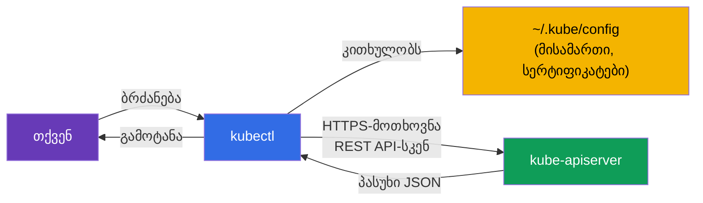
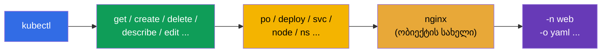
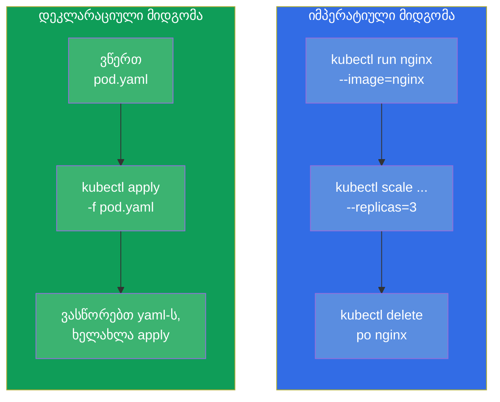
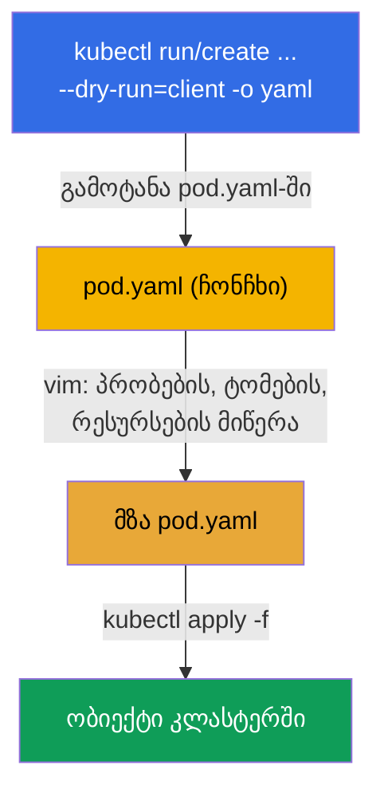
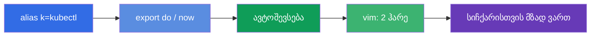

[Русская версия](ru.md) · [Eng version](README.md) · [Versión en español](es.md) · [Version française](fr.md) · [Deutsche Version](de.md) · [繁體中文版](tw.md) · [日本語版](jp.md)

# თავი 3. kubectl-თან მუშაობა: იმპერატიული და დეკლარაციული მიდგომები

> **რა იქნება შემდეგ.** გავიგეთ, რისგან შედგება კლასტერი. ახლა ხელში ავიღებთ მთავარ
> ინსტრუმენტს - `kubectl`-ს, რომლის მეშვეობით საერთოდ ყველაფერს გააკეთებთ: გამოცდაზე,
> ლაბებში და რეალურ სამუშაოში. ეს თავი არის სიჩქარის საფუძველი. გამოცდაზე 15-20 ამოცანას
> 2 საათში მხოლოდ ისინი ხსნიან, ვინც YAML-ს ხელით ნულიდან არ წერს, არამედ ბრძანებებით
> აგენერირებს. აქ განვიხილავთ ორივე მიდგომას (იმპერატიულს და დეკლარაციულს), ავაწყობთ
> სამუშაო გარემოს სიჩქარისთვის და ვისწავლით ნებისმიერი ველის მოძებნას `kubectl
> explain`-ის მეშვეობით. ყველაფერი, რაც აქ არის ათვისებული, ყველა შემდგომ თავში მუშაობს.

## 3.1. რა არის kubectl და როგორ ურთიერთობს ის კლასტერთან

`kubectl` არის ბრძანების ხაზის კლიენტი. თავად ის არაფერს აკეთებს: თქვენს ბრძანებებს
`kube-apiserver`-ისადმი HTTP-მოთხოვნებად აქცევს და პასუხს ბეჭდავს. ყველაფერი, რასაც
მე-2 თავში განვიხილავდით, გამოსადეგია: `kubectl` არის API-სერვერის კიდევ ერთი კლიენტი,
შიდა კომპონენტების თანასწორი.



საიდან იცის `kubectl`-მა, რომელ კლასტერთან მივიდეს და როგორ გაიაროს ავთენტიფიკაცია?
კონფიგურაციის ფაილიდან - **kubeconfig**, ნაგულისხმევად `~/.kube/config`. მასში აღწერილია
კლასტერები (API-ს მისამართები), მომხმარებლები (სერტიფიკატები/ტოკენები) და კონტექსტები
(კლასტერი+მომხმარებელი+namespace კავშირები). kubeconfig-ს დაწვრილებით 39-ე თავში
განვიხილავთ, მაგრამ ბაზისური ბრძანებები უკვე ახლა გვჭირდება:

```bash
kubectl config view                       # მიმდინარე კონფიგის ჩვენება
kubectl config get-contexts               # კონტექსტების სია
kubectl config current-context            # რომელი კონტექსტია ახლა აქტიური
kubectl config use-context cluster1       # კონტექსტზე გადართვა
```

> **მნიშვნელოვანია გამოცდისთვის.** ყოველ დავალებაში მითითებულია კლასტერი და კონტექსტი.
> პირველი, რასაც ამოცანაში აკეთებთ, არის `kubectl config use-context <საჭირო>`-ის
> შესრულება. დაგავიწყდათ გადართვა - დავალება არასწორ კლასტერში გააკეთეთ და ქულები
> დაკარგეთ. ეს არის ერთი ყველაზე ხშირი და შემაწუხებელი შეცდომა.

## 3.2. როგორ დავაყენოთ kubectl

გამოცდაზე და ჩვენს ლაბებში `kubectl` უკვე დაყენებულია - თავად დაყენება არ არის საჭირო.
მაგრამ საკუთარ მანქანაზე ვარჯიშისთვის ის უნდა დააყენოთ და, რაც უფრო მნიშვნელოვანია,
გესმოდეთ **ვერსიების თავსებადობის წესი**.

> **წესი skew (ვერსიების სხვაობა).** `kubectl`-ის ვერსია `kube-apiserver`-ის ვერსიისგან
> უნდა განსხვავდებოდეს არა უმეტეს **ერთი მინორული რელიზით** (ორივე მიმართულებით).
> მაგალითად, API-სერვერ 1.34-ს მოუხდება `kubectl` 1.33, 1.34 ან 1.35, მაგრამ არა 1.32 ან
> 1.36. პრაქტიკაში `kubectl` იმავე მინორული ვერსიისა გქონდეთ, რომელიც კლასტერს აქვს.

დაყენების ხერხები სხვადასხვა ოპერაციული სისტემისთვის:

| ოს / მენეჯერი | ბრძანება |
|---------------|----------|
| Linux (ბინარული ფაილი) | `curl -LO "https://dl.k8s.io/release/$(curl -L -s https://dl.k8s.io/release/stable.txt)/bin/linux/amd64/kubectl"` |
| Linux (apt, Debian/Ubuntu) | `sudo apt-get install -y kubectl` (რეპოზიტორია pkgs.k8s.io-ს მიერთების შემდეგ) |
| Linux (dnf, RHEL/Fedora) | `sudo dnf install -y kubectl` (რეპოზიტორიის მიერთების შემდეგ) |
| macOS (Homebrew) | `brew install kubectl` |
| Windows (choco) | `choco install kubernetes-cli` |

ბინარული ფაილის ხელით დაყენება Linux-ზე მთლიანად:

```bash
# 1. ბოლო სტაბილური ვერსიის ბინარული ფაილის ჩამოტვირთვა
curl -LO "https://dl.k8s.io/release/$(curl -L -s https://dl.k8s.io/release/stable.txt)/bin/linux/amd64/kubectl"

# 2. (არასავალდებულო) საკონტროლო ჯამის შემოწმება
curl -LO "https://dl.k8s.io/release/$(curl -L -s https://dl.k8s.io/release/stable.txt)/bin/linux/amd64/kubectl.sha256"
echo "$(cat kubectl.sha256)  kubectl" | sha256sum --check

# 3. PATH-ში დაყენება საჭირო უფლებებით
sudo install -o root -g root -m 0755 kubectl /usr/local/bin/kubectl
```

შემოწმება, რომ ყველაფერი დაჯდა:

```bash
kubectl version --client            # მხოლოდ კლიენტის ვერსია (კლასტერთან მიმართვის გარეშე)
kubectl version                     # კლიენტისა და სერვერის ვერსიები (საჭიროა კლასტერთან წვდომა)
```

> **რჩევა გამოცდისთვის.** დაყენებაზე დროის ხარჯვა არ მოგიწევთ - გარემო მზადაა:
> `kubectl`, ალიასი `k` და ავტოშევსება უკვე აწყობილია ყუთიდანვე. საკუთარი გარემოს
> დაყენება და აწყობა (სექცია 3.10) აზრი აქვს მოამზადოთ მხოლოდ პირად მანქანაზე
> ვარჯიშისთვის.

## 3.3. kubectl-ის ბრძანების ანატომია

`kubectl`-ის თითქმის ყველა ბრძანება ერთი სქემით შენდება:

```
kubectl [ბრძანება] [ტიპი] [სახელი] [დროშები]
```



მაგალითად, `kubectl get pods nginx -n web -o yaml`:
- **ბრძანება** `get` - რა გავაკეთოთ (მიღება);
- **ტიპი** `pods` - ობიექტების რომელ სახეობასთან;
- **სახელი** `nginx` - კონკრეტულად რომელი (შეიძლება გამოტოვება - მაშინ ყველა);
- **დროშები** `-n web -o yaml` - namespace `web`-ში, გამოტანა YAML-ში.

ობიექტების ტიპებს აქვთ მოკლე ფსევდონიმები, რომლებიც დროს ზოგავს:

| სრული | მოკლედ | სრული | მოკლედ |
|--------|---------|--------|---------|
| pods | po | services | svc |
| deployments | deploy | namespaces | ns |
| replicasets | rs | configmaps | cm |
| nodes | no | persistentvolumeclaims | pvc |
| daemonsets | ds | persistentvolumes | pv |
| statefulsets | sts | serviceaccounts | sa |

ფსევდონიმების სრული სია - `kubectl api-resources`.

## 3.4. ორი მიდგომა: იმპერატიული და დეკლარაციული

ეს არის თავის კონცეპტუალური ბირთვი. Kubernetes-ის ობიექტების მართვა ორი ხერხით შეიძლება.

- **იმპერატიული** - თქვენ ბრძანებთ, *რა გავაკეთოთ ახლა*: „შექმენი pod“, „წაშალე
  დეპლოი“, „შეცვალე იმიჯი“. სწრაფია, მაგრამ განზრახვების ისტორია არსად ინახება.
- **დეკლარაციული** - თქვენ აღწერთ *სასურველ მდგომარეობას* YAML-ფაილში და ამბობთ
  `kubectl apply -f`. Kubernetes თავად წყვეტს, რა შექმნას ან შეცვალოს. გამეორებადია,
  ვერსირდება git-ში, გუნდისა და პროდაქშენისთვის შესაფერისია.



**რომელი მიდგომა როდის გამოვიყენოთ?**

| სიტუაცია | მიდგომა | რატომ |
|----------|---------|-------|
| მარტივი ობიექტი გამოცდაზე (pod, sa, cm) | იმპერატიული | ყველაზე სწრაფია |
| რთული ობიექტი (საჭიროა პრობები, ტომები, affinity) | ჰიბრიდი: გენერაცია → ჩასწორება | მთელ YAML-ს ხელით ვერ დაწერ |
| პროდაქშენი, გუნდური მუშაობა | დეკლარაციული | git, რევიუ, გამეორებადობა |
| სწრაფად რამის შემოწმება/წაშლა | იმპერატიული | ერთი ბრძანება |

**ოქროს შუალედი გამოცდისთვის არის ჰიბრიდი.** YAML-ის ჩონჩხს ვაგენერირებთ იმპერატიული
ბრძანებით `--dry-run=client -o yaml`-ით, საჭიროს რედაქტორში ვაწერთ, ვიყენებთ `apply`-ის
მეშვეობით. ეს არის რთული ობიექტის მიღების ყველაზე სწრაფი ხერხი.

## 3.5. იმპერატიული ბრძანებები: ობიექტებს სწრაფად ვქმნით

შექმნის ორი საკვანძო ბრძანება: `kubectl run` (ერთეული pod-ისთვის) და `kubectl create`
(დანარჩენი ობიექტებისთვის).

```bash
# Pod
kubectl run nginx --image=nginx

# Pod პორტითა და გარემოს ცვლადებით
kubectl run web --image=nginx --port=80 --env="KEY=value"

# Deployment 3 რეპლიკით
kubectl create deployment web --image=nginx --replicas=3

# Namespace
kubectl create namespace dev

# ConfigMap ლიტერალებიდან
kubectl create configmap app-cfg --from-literal=COLOR=blue

# Secret
kubectl create secret generic db --from-literal=password=s3cret

# Service: დეპლოის პორტის გამოტანა
kubectl expose deployment web --port=80 --target-port=80

# მასშტაბირება
kubectl scale deployment web --replicas=5

# იმიჯის შეცვლა
kubectl set image deployment/web nginx=nginx:1.27
```

ბრძანებების `run`/`create`/`expose` დიდი ნაწილი არის ერთადერთი სწრაფი ხერხი გამოცდაზე
ობიექტის მიღების. მათი ავტომატიზმამდე მიყვანა ღირს.

## 3.6. მანიფესტების გენერაცია: `--dry-run=client -o yaml`

ეს არის, ალბათ, მთელი კურსის ყველაზე მნიშვნელოვანი ხერხი სიჩქარისთვის. დროშები
`--dry-run=client -o yaml` ნიშნავს: „ობიექტს ნამდვილად არ შექმნა, არამედ მაჩვენე, რომელ
YAML-ს გააგზავნიდი“. ამ YAML-ს ფაილში გადავამისამართებთ, ვასწორებთ და ვიყენებთ.



პრაქტიკაში:

```bash
# pod-ის ჩონჩხის გენერაცია ფაილში
kubectl run nginx --image=nginx --dry-run=client -o yaml > pod.yaml

# დეპლოის ჩონჩხის გენერაცია
kubectl create deployment web --image=nginx --replicas=3 \
  --dry-run=client -o yaml > deploy.yaml

# ჩასწორება და გამოყენება
vim pod.yaml
kubectl apply -f pod.yaml
```

რა არის მნიშვნელოვანი გასაგები `--dry-run`-ზე:
- `--dry-run=client` - სერვერს საერთოდ არ მიმართავს, უბრალოდ ლოკალურად რენდერავს YAML-ს;
- `--dry-run=server` - სერვერზე აგზავნის, ის ატარებს ვალიდაციასა და admission-ს, მაგრამ
  არ ინახავს. სასარგებლოა იმის შესამოწმებლად, გაივლის თუ არა ობიექტი, მისი შექმნის გარეშე.

## 3.7. დეკლარაციული მიდგომა: apply, create, replace

დეკლარაციული მართვისას თქვენ ფაილებთან მუშაობთ. ძირითადი ბრძანებები:

```bash
kubectl apply -f pod.yaml          # შექმნა ან განახლება მანიფესტის მიხედვით
kubectl apply -f ./manifests/      # კატალოგში ყველა ფაილის გამოყენება
kubectl delete -f pod.yaml         # მანიფესტიდან ობიექტების წაშლა
kubectl create -f pod.yaml         # შექმნა (ჩავარდება, თუ უკვე არის)
kubectl replace -f pod.yaml        # არსებულის მთლიანად ჩანაცვლება
```

განსხვავება `create`-სა და `apply`-ს შორის პრინციპულია:

| ბრძანება | თუ ობიექტი არ არის | თუ ობიექტი უკვე არის |
|----------|--------------------|----------------------|
| `create -f` | შექმნის | შეცდომა (უკვე არსებობს) |
| `apply -f` | შექმნის | განაახლებს (ცვლილებების ჭკვიანური შერწყმა) |
| `replace -f` | შეცდომა (ობიექტი არ არის) | მთლიანად ჩაანაცვლებს |

`apply` არის დეკლარაციული მიდგომის სამუშაო ცხენი: მას შეუძლია **სამმხრივი შერწყმა**
(3-way merge), რომელიც ადარებს თქვენს ფაილს, მიმდინარე მდგომარეობასა და ბოლო გამოყენებულ
ვერსიას. ამიტომ `apply`-ის გამეორება რამდენჯერაც გინდათ შეიძლება - ეს იდემპოტენტურია.

## 3.8. მდგომარეობას ვკითხულობთ: get, describe, logs

სამუშაოს (და გამოცდის) ნახევარი არის არა შექმნა, არამედ დანახვა, რა ხდება.

```bash
# ობიექტების სია
kubectl get pods
kubectl get pods -o wide            # + კვანძი და IP
kubectl get pods -A                 # ყველა namespace-ში (--all-namespaces)
kubectl get pods --show-labels      # ნიშნულებით
kubectl get pods -w                 # რეალურ დროში დევნება (watch)

# ობიექტის დეტალები (მოვლენები ქვემოთ - ოქრო გამართვისთვის)
kubectl describe pod nginx

# კონტეინერის ლოგები
kubectl logs nginx                  # pod-ის ლოგები
kubectl logs nginx -c app           # კონკრეტული კონტეინერი
kubectl logs nginx -f               # რეალურ დროში
kubectl logs nginx --previous       # ჩავარდნილი წინა კონტეინერის ლოგები

# ბრძანება კონტეინერის შიგნით
kubectl exec nginx -- ls /          # ბრძანების შესრულება
kubectl exec -it nginx -- sh        # ინტერაქტიული გარსი

# კლასტერის მოვლენები
kubectl get events --sort-by='.lastTimestamp'
```

გამართვის საკვანძო უნარი: `kubectl describe` ქვემოთ ბეჭდავს სექციას **Events** - სწორედ
იქ არის მიზეზები „რატომ არ სტარტავს pod“, „რატომ არის pending“, „რატომ image pull failed“.
ამის შესახებ - დაწვრილებით 44-ე თავში.

## 3.9. გამოტანის ფორმატები და JSONPath

დროშა `-o` მართავს გამოტანის ფორმატს. ეს გამოგადგებათ ცხოვრებაშიც და გამოცდაზეც (ხანდახან
სთხოვენ „გამოიტანე ყველა pod-ის სახელები ფაილში“).

```bash
kubectl get pods -o wide            # გაფართოებული ცხრილი
kubectl get pod nginx -o yaml       # ობიექტის სრული YAML
kubectl get pod nginx -o json       # იგივე JSON-ში
kubectl get pods -o name            # მხოლოდ სახელები (pod/nginx)

# JSONPath - კონკრეტული ველების ამოღება
kubectl get pods -o jsonpath='{.items[*].metadata.name}'
kubectl get nodes -o jsonpath='{.items[*].status.addresses[?(@.type=="InternalIP")].address}'

# საკუთარი ცხრილი custom-columns-ის მეშვეობით
kubectl get pods -o custom-columns=NAME:.metadata.name,NODE:.spec.nodeName
```

JSONPath-სა და custom-columns-ს დეტალურად 47-ე თავში განვიხილავთ (CKAD-ისთვის მომზადება) -
იქ ეს ხშირი დავალების ტიპია. ჯერჯერობით საკმარისია ვიცოდეთ, რომ ასეთი ინსტრუმენტი არსებობს.

## 3.10. გარემოს აწყობა სიჩქარისთვის

აქტუალურ გამოცდაზე (PSI) ბაზისური გარემო უკვე მზადაა ყუთიდანვე: `kubectl`, ალიასი `k` და
ავტოშევსება ჩვეულებრივ წინასწარ არის აწყობილი - სპეციალურად რამის დაყენება არ არის საჭირო.
ამიტომ გამოცდაზე პირველ რიგში ღირს არა გარემოს აწყობა, არამედ **შემოწმება**, რომ საჭირო
უკვე მუშაობს (`k get ns`, ავტოშევსება `Tab`-ით). ხოლო ცვლადები-ჰელპერები
(`do`, `now`) ნაგულისხმევად არ არის განსაზღვრული - მათ სურვილისამებრ თავად ამატებთ.

საკუთარ მანქანაზე ვარჯიშისთვის მთელ ქვემოთ მოცემულ ნაკრებს დამოუკიდებლად აწყობენ - ის
ათეულობით წუთს ზოგავს.

```bash
# ალიასი k = kubectl
alias k=kubectl

# ცვლადები-ჰელპერები მანიფესტების გენერაციისა და სწრაფი წაშლისთვის
export do="--dry-run=client -o yaml"
export now="--force --grace-period=0"

# ბრძანებების ავტოშევსება
source <(kubectl completion bash)
complete -o default -F __start_kubectl k

# vim-ის აწყობა YAML-ისთვის: 2 ჰარე, ტაბების გარეშე
echo 'set tabstop=2 shiftwidth=2 expandtab' >> ~/.vimrc
export KUBE_EDITOR=vim
```

ახლა შეიძლება მოკლედ წერა:

```bash
k run nginx --image=nginx $do > pod.yaml     # = --dry-run=client -o yaml
k delete po nginx $now                        # მყისიერი წაშლა
```



> **YAML-ის შეწევებზე.** Kubernetes იღებს მხოლოდ ჰარეებს, ტაბები აკრძალულია. აწყობა
> `expandtab` vim-ში ტაბს ჰარეებად აქცევს - მის გარეშე ადვილია პარსინგის შეცდომის მიღება
> და დროის დაკარგვა. ამას ყველაფერ დანარჩენამდე აწყობენ.

## 3.11. `kubectl explain`: დოკუმენტაცია პირდაპირ ტერმინალში

დაგავიწყდათ, როგორ ეწოდება ველი ან რომელ ჩალაგების დონეზეა ის? ბრაუზერში შესვლა
სავალდებულო არ არის - `kubectl explain` ნებისმიერი ობიექტის სქემას პირდაპირ ტერმინალში
აჩვენებს.

```bash
kubectl explain pod                       # ზედა დონე
kubectl explain pod.spec                  # spec-ის ველები
kubectl explain pod.spec.containers       # კონტეინერის ველები
kubectl explain pod.spec.containers.livenessProbe   # და ასე სიღრმეში
kubectl explain pod --recursive           # ველების მთელი ხე ერთბაშად
```

ეს შეუცვლელია, როცა ველის აზრი გახსოვს, მაგრამ ზუსტი სახელი ან იერარქია დაგავიწყდა.
მუშაობს ნებისმიერი ტიპისთვის, CRD-ის ჩათვლით (თავი 41).

## 3.12. ცოცხალი ობიექტების ჩასწორება და წაშლა

```bash
# ობიექტის რედაქტორში გახსნა და გასწორება ფრენაში
kubectl edit deployment web

# ნიშნულის დადება/მოშორება
kubectl label pod nginx env=prod
kubectl label pod nginx env-               # „მინუსის“ ნიშანი ნიშნულს აშორებს

# ანოტაციები - ანალოგიურად
kubectl annotate pod nginx note="hello"

# წაშლა
kubectl delete pod nginx
kubectl delete -f pod.yaml
kubectl delete pod nginx --force --grace-period=0    # მყისიერად, ლოდინის გარეშე
```

მნიშვნელოვანი დახვეწილობა: pod-ის ზოგიერთი ველი **უცვლელია** შექმნის შემდეგ (მაგალითად,
შიშველ Pod-ში კონტეინერის იმიჯის შეცვლა შეიძლება, სამაგიეროდ `spec`-ში ბევრი რამის - არა).
თუ `kubectl edit` შენახვის საშუალებას არ იძლევა, ობიექტი მოგიწევთ წაშალოთ და გასწორებული
მანიფესტიდან ხელახლა შექმნათ. Deployment-ისთვის ეს პრობლემა არ არის - იქ ჩასწორებები
ახალი rollout-ის მეშვეობით გამოიყენება (თავი 8).

## 3.13. როგორ იყენებენ ამას პროდაქშენში

- **დეკლარაციულობა და GitOps.** რეალურ ექსპლუატაციაში ობიექტებს თითქმის არავინ ქმნის
  იმპერატიულად. ყველა მანიფესტი წევს git-ში, ხოლო ინსტრუმენტები **Argo CD**-ის ან
  **Flux**-ის მსგავსად ავტომატურად იყენებს მათ კლასტერში (`apply`) და თვალს ადევნებს,
  რომ კლასტერის მდგომარეობა რეპოზიტორიას ემთხვეოდეს. იმპერატიული ბრძანებები პროდში
  არის ძირითადად გამართვა და ერთჯერადი ოპერაციები.
- **`kubectl` მხოლოდ წაკითხვისა და გარჩევისთვის.** მოწიფულ გუნდებში პირდაპირი ცვლილებები
  `kubectl edit`/`delete`-ის მეშვეობით პროდში არის ტაბუ (ეს არის „დრეიფი“ git-იდან).
  სამაგიეროდ `get`, `describe`, `logs`, `exec` არის მორიგე ინჟინრის ყოველდღიური
  ინსტრუმენტები ინციდენტების გარჩევისას.
- **კონტექსტები და უსაფრთხოება.** ინჟინრებს kubeconfig-ში ჩვეულებრივ რამდენიმე კლასტერი
  აქვთ (dev/stage/prod). კონტექსტის აღრევა და ბრძანების შესრულება პროდში dev-ის ნაცვლად -
  რეალური ინციდენტია. ამიტომ პროდში იყენებენ უტილიტებს `kubectx`/`kube-ps1`-ის მსგავსად,
  რომლებიც აქტიურ კონტექსტს პირდაპირ shell-ის მოსაწვევში აჩვენებენ.
- **წვდომის უფლებები.** ის, რის გაკეთების უფლება გაქვთ `kubectl`-ის მეშვეობით,
  შემოსაზღვრულია RBAC-ით (თავი 38). დეველოპერს ჩვეულებრივ წვდომა აქვს მხოლოდ საკუთარ
  namespace-ებთან და არა მთელ კლასტერთან.

## 3.14. მინი-ლექსიკონი

- **kubectl** - ბრძანების ხაზის კლიენტი, ბრძანებებს API-სერვერისადმი მოთხოვნებად აქცევს.
- **kubeconfig** - ფაილი (`~/.kube/config`) კლასტერებით, მომხმარებლებითა და კონტექსტებით.
- **კონტექსტი** - კავშირი კლასტერი + მომხმარებელი + namespace; გადაირთვება
  `use-context`-ით.
- **იმპერატიული მიდგომა** - მოქმედებების მართვა (`run`, `create`, `delete`).
- **დეკლარაციული მიდგომა** - სასურველი მდგომარეობის მართვა `apply -f`-ის მეშვეობით.
- **`--dry-run=client -o yaml`** - YAML-ის გენერაცია, არაფრის შექმნის გარეშე.
- **apply** - ობიექტის შექმნა ან განახლება მანიფესტის მიხედვით (იდემპოტენტური, 3-way merge).
- **JSONPath** - API-ს პასუხიდან ველების ამორჩევის ენა (`-o jsonpath=...`).
- **kubectl explain** - ჩაშენებული დოკუმენტაცია ობიექტების ველებზე.

## 3.15. თავის შეჯამება

- `kubectl` არის API-სერვერის კლიენტი; სად მივიდეს და როგორ ავტორიზდეს, kubeconfig-იდან იღებს.
- ყოველ ამოცანაში პირველ რიგში გადართეთ კონტექსტი (`config use-context`) - თორემ
  სამუშაოს არასწორ კლასტერში გააკეთებთ.
- ბრძანება შენდება როგორც `kubectl [ბრძანება] [ტიპი] [სახელი] [დროშები]`; ტიპებს აქვთ მოკლე
  ფსევდონიმები (po, deploy, svc, ...).
- ორი მიდგომა: იმპერატიული (სწრაფად, ერთჯერადად) და დეკლარაციული (`apply`, გამეორებადი,
  git-ისა და პროდისთვის). ოქროს შუალედი გამოცდაზე არის YAML-ის გენერაცია და გასწორება.
- `--dry-run=client -o yaml` არის სიჩქარის მთავარი ხერხი: მანიფესტის ჩონჩხს ბრძანებით
  ვიღებთ, რთულს რედაქტორში ვაწერთ, `apply`-ის მეშვეობით ვიყენებთ.
- მდგომარეობის კითხვა: `get` (მათ შორის `-o wide`, `-A`, `-w`), `describe` (Events!), `logs`
  (`-f`, `--previous`), `exec`, `get events`.
- გამოცდაზე ბაზისური გარემო (`kubectl`, ალიასი `k`, ავტოშევსება) ჩვეულებრივ
  წინასწარ არის აწყობილი - შეამოწმეთ ეს და არა ნულიდან აწყობთ; ჰელპერები `do`/`now`
  სურვილისამებრ თავად ამატებთ. საკუთარი სავარჯიშო მანქანისთვის მთელი ნაკრები (ალიასი, `do`/`now`,
  ავტოშევსება, vim 2 ჰარით) თავად აწყვეთ - ის ათეულობით წუთს ზოგავს.
- `kubectl explain` ცვლის ბრაუზერში ველების სახელებისთვის შესვლას.

## 3.16. როგორ გამოგადგებათ: გამოცდაზე და რეალურ სამუშაოში

**გამოცდაზე.** ეს არის საერთოდ ორივე გამოცდის ბაზისური უნარი - თავისუფალი `kubectl`-ის
გარეშე ვერც ერთ ამოცანას ვერ ასწრებ. პირდაპირი დავალებები „აწყვე alias“ არ არის, მაგრამ
სიჩქარე, რომელსაც ეს თავი იძლევა, განსაზღვრავს, რამდენ ამოცანას გადაწყვეტთ. ხერხები
`--dry-run`, მოკლე ფსევდონიმები, `explain`, სწრაფი `describe`/`logs` ყოველ მეორე ამოცანაში
გამოიყენება.

**რეალურ სამუშაოში.** `kubectl get/describe/logs/exec` არის ყოველი იმ ადამიანის ყოველდღიური
ინსტრუმენტი, ვინც Kubernetes-ს ექსპლუატირებს: ინციდენტების გარჩევა სწორედ მათგან იწყება.
იმპერატიულისა და დეკლარაციული მიდგომების განსხვავების გაგება განსაზღვრავს, როგორ არის
აწყობილი მიწოდების მთელი პროცესი: მოწიფულ გუნდებში ყველაფერი დეკლარაციულია და git-ის
მეშვეობით (GitOps), ხოლო იმპერატიული ბრძანებები გამართვისთვის რჩება.

## 3.17. თვითშემოწმების კითხვები

1. როგორ იგებს `kubectl`, რომელ კლასტერთან მიუერთდეს და ვისი სახელით? რა მოხდება, თუ
   გამოცდაზე კონტექსტს არ გადართავ?
2. რით განსხვავდება იმპერატიული მიდგომა დეკლარაციულისგან? როდის რომელია შესაფერისი?
3. რას აკეთებს `--dry-run=client -o yaml` და რატომ არის ეს სიჩქარის საკვანძო ხერხი?
4. რაშია განსხვავება `kubectl create -f`, `apply -f` და `replace -f`-ს შორის?
5. სად აჩვენებს `kubectl describe` ობიექტთან დაკავშირებული პრობლემების მიზეზებს?
6. რისთვის უნდა აწყოთ `expandtab` vim-ში გამოცდამდე?
7. როგორ გავიხსენოთ pod-ის სპეციფიკაციაში ველის ზუსტი სახელი ბრაუზერის გახსნის გარეშე?

## პრაქტიკა

ახლა ინსტრუმენტი გაქვთ. შემდეგ თავებში დავიწყებთ რეალური ობიექტების შექმნას:
pod-ები (თავი 4), შემდეგ ReplicaSet და Deployment (თავი 5). ამ თავის `kubectl`-ის ყველა
ხერხს დაამუშავებთ პირველ გაერთიანებულ ლაბორატორიულში ბაზისურ ობიექტებთან ერთად.

🧪 ლაბი 119 (დრილები სიჩქარესა და JSONPath-ზე): [tasks/cka/labs/119](../../labs/119/README_GE.MD)

---
[სარჩევი](../README_GE.md) · [თავი 2](../02/ge.md) · [თავი 4](../04/ge.md)
