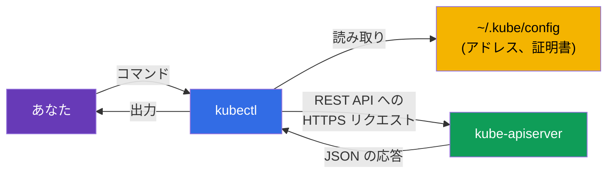
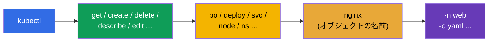
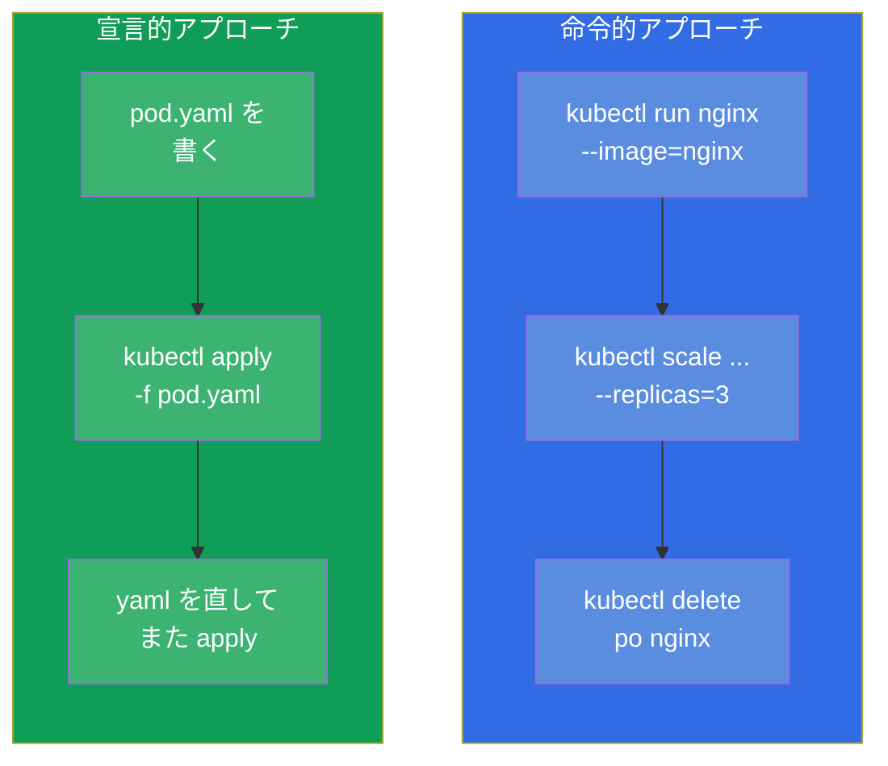
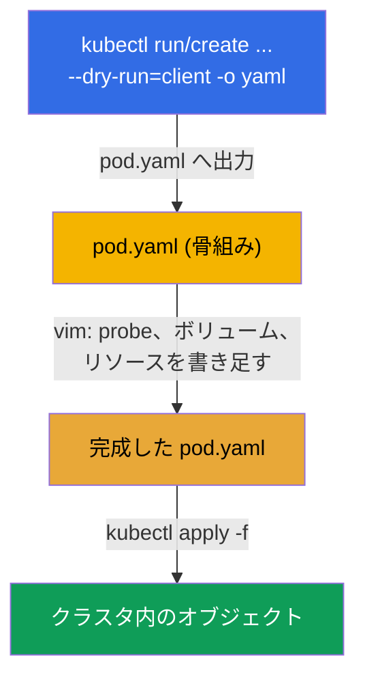

[Русская версия](ru.md) · [Eng version](README.md) · [Versión en español](es.md) · [Version française](fr.md) · [Deutsche Version](de.md) · [ქართული ვერსია](ge.md) · [繁體中文版](tw.md)

# 第 3 章。kubectl での作業：命令的アプローチと宣言的アプローチ

> **次は何か。** クラスタが何から成り立っているかは理解しました。ここからは主役の
> 道具 - `kubectl` - を手に取ります。試験でも、ラボでも、実際の仕事でも、ほぼ
> すべてをこれで行います。この章は速さの土台です。2 時間で 15-20 問を解けるのは、
> YAML をゼロから手で書かず、コマンドで生成する人だけです。ここでは両方の
> アプローチ（命令的と宣言的）を分解し、速さのための作業環境を整え、`kubectl
> explain` であらゆるフィールドを見つけられるようになります。ここで身につけた
> ことは、以降のすべての章で使います。

## 3.1. kubectl とは何か、どうやってクラスタと話すのか

`kubectl` はコマンドラインのクライアントです。それ自身は何もしません：あなたの
コマンドを `kube-apiserver` への HTTP リクエストに変換し、応答を表示します。第 2 章で
見たことがそのまま当てはまります：`kubectl` は内部コンポーネントと同じ立場の、
もう 1 つの API サーバーのクライアントです。



`kubectl` はどのクラスタへ行くか、どう認証するかをどこから知るのでしょうか。設定
ファイル - **kubeconfig**、既定では `~/.kube/config` - からです。そこにはクラスタ
(API のアドレス)、ユーザー（証明書/トークン）、コンテキスト（クラスタ+ユーザー+namespace の
組み合わせ）が書かれています。kubeconfig は第 39 章で詳しく扱いますが、基本の
コマンドは今すぐ必要です：

```bash
kubectl config view                       # 現在の設定を表示
kubectl config get-contexts               # コンテキストの一覧
kubectl config current-context            # いまどのコンテキストが有効か
kubectl config use-context cluster1       # コンテキストを切り替える
```

> **試験で重要。** どの問題にもクラスタとコンテキストが指定されています。問題で
> 最初にやることは `kubectl config use-context <指定されたもの>` の実行です。
> 切り替えを忘れると、違うクラスタで作業してしまい点を失います。もっとも多く、
> もっとも悔しいミスの 1 つです。

## 3.2. kubectl のインストール方法

試験でも私たちのラボでも `kubectl` はすでに入っています - 自分で入れる必要は
ありません。ただし自分のマシンで練習するには入れる必要があり、さらに重要なのは
**バージョン互換性のルール** を理解することです。

> **skew（バージョンのずれ）のルール。** `kubectl` のバージョンは
> `kube-apiserver` のバージョンから **マイナーリリース 1 つ分** まで離れていて
> よいです（どちら方向にも）。たとえば API サーバー 1.34 には `kubectl` 1.33、
> 1.34、1.35 が合いますが、1.32 や 1.36 は合いません。実務ではクラスタと同じ
> マイナーバージョンの `kubectl` を使ってください。

OS ごとのインストール方法：

| OS / マネージャー | コマンド |
|---------------|---------|
| Linux (バイナリ) | `curl -LO "https://dl.k8s.io/release/$(curl -L -s https://dl.k8s.io/release/stable.txt)/bin/linux/amd64/kubectl"` |
| Linux (apt, Debian/Ubuntu) | `sudo apt-get install -y kubectl`（pkgs.k8s.io のリポジトリを追加したあと） |
| Linux (dnf, RHEL/Fedora) | `sudo dnf install -y kubectl`（リポジトリを追加したあと） |
| macOS (Homebrew) | `brew install kubectl` |
| Windows (choco) | `choco install kubernetes-cli` |

Linux でのバイナリの手動インストールを通しで：

```bash
# 1. 最新の安定版バイナリをダウンロードする
curl -LO "https://dl.k8s.io/release/$(curl -L -s https://dl.k8s.io/release/stable.txt)/bin/linux/amd64/kubectl"

# 2. (任意) チェックサムを検証する
curl -LO "https://dl.k8s.io/release/$(curl -L -s https://dl.k8s.io/release/stable.txt)/bin/linux/amd64/kubectl.sha256"
echo "$(cat kubectl.sha256)  kubectl" | sha256sum --check

# 3. 適切な権限で PATH にインストールする
sudo install -o root -g root -m 0755 kubectl /usr/local/bin/kubectl
```

正しく入ったかの確認：

```bash
kubectl version --client            # クライアントのバージョンのみ (クラスタへアクセスしない)
kubectl version                     # クライアントとサーバーのバージョン (クラスタへのアクセスが必要)
```

> **試験のためのアドバイス。** インストールに時間を使う必要はありません - 環境は
> 用意されています：`kubectl`、エイリアス `k`、補完は最初から設定済みです。自分の
> 環境のインストールと設定（3.10 節）は、個人のマシンでの練習のためだけに用意する
> 意味があります。

## 3.3. kubectl コマンドの解剖

`kubectl` のほぼすべてのコマンドは 1 つの形に従います：

```
kubectl [コマンド] [タイプ] [名前] [フラグ]
```



たとえば `kubectl get pods nginx -n web -o yaml` では：
- **コマンド** `get` - 何をするか（取得する）；
- **タイプ** `pods` - どの種類のオブジェクトに対してか；
- **名前** `nginx` - どの具体的なものか（省略できます - その場合はすべて）；
- **フラグ** `-n web -o yaml` - namespace `web` で、出力は YAML。

オブジェクトのタイプには時間を節約する短い別名があります：

| 完全名 | 短縮 | 完全名 | 短縮 |
|--------|---------|--------|---------|
| pods | po | services | svc |
| deployments | deploy | namespaces | ns |
| replicasets | rs | configmaps | cm |
| nodes | no | persistentvolumeclaims | pvc |
| daemonsets | ds | persistentvolumes | pv |
| statefulsets | sts | serviceaccounts | sa |

別名の完全な一覧は `kubectl api-resources` です。

## 3.4. 2 つのアプローチ：命令的と宣言的

これがこの章の概念的な核です。Kubernetes のオブジェクトは 2 通りの方法で管理できます。

- **命令的** - あなたが *いま何をするか* を命じます：「Pod を作れ」「Deployment を
  消せ」「イメージを変えろ」。速いですが、意図の履歴はどこにも残りません。
- **宣言的** - *望ましい状態* を YAML ファイルに記述し、`kubectl apply -f` と
  伝えます。何を作るか変えるかは Kubernetes 自身が判断します。再現可能で、
  git でバージョン管理でき、チームと本番に向いています。



**どのアプローチをいつ使うか？**

| 状況 | アプローチ | 理由 |
|----------|--------|-------|
| 試験での単純なオブジェクト (Pod, sa, cm) | 命令的 | もっとも速い |
| 複雑なオブジェクト (probe、ボリューム、affinity が必要) | ハイブリッド：生成 → 編集 | YAML 全部を手で書くのは無理 |
| 本番、チームでの作業 | 宣言的 | git、レビュー、再現性 |
| 何かをすばやく確認/削除する | 命令的 | 1 コマンドで済む |

**試験での黄金の中間はハイブリッドです。** `--dry-run=client -o yaml` を付けた
命令的コマンドで YAML の骨組みを生成し、エディタで必要なものを書き足し、`apply`
で適用します。これが複雑なオブジェクトを手に入れるもっとも速い方法です。

## 3.5. 命令的コマンド：オブジェクトを速く作る

作成の要となるコマンドは 2 つ：`kubectl run`（単体の Pod 用）と `kubectl create`
（それ以外のオブジェクト用）です。

```bash
# Pod
kubectl run nginx --image=nginx

# ポートと環境変数を持つ Pod
kubectl run web --image=nginx --port=80 --env="KEY=value"

# レプリカ 3 の Deployment
kubectl create deployment web --image=nginx --replicas=3

# Namespace
kubectl create namespace dev

# リテラルからの ConfigMap
kubectl create configmap app-cfg --from-literal=COLOR=blue

# Secret
kubectl create secret generic db --from-literal=password=s3cret

# Service: Deployment のポートを公開する
kubectl expose deployment web --port=80 --target-port=80

# スケーリング
kubectl scale deployment web --replicas=5

# イメージの変更
kubectl set image deployment/web nginx=nginx:1.27
```

`run`/`create`/`expose` の多くは、試験でオブジェクトを手に入れる唯一の速い方法です。
反射的に打てるところまで仕上げておく価値があります。

## 3.6. マニフェストの生成：`--dry-run=client -o yaml`

これはおそらく、速さという点でコース全体でもっとも重要な技です。フラグ
`--dry-run=client -o yaml` の意味は「実際にはオブジェクトを作らず、送るはずの YAML を
見せてくれ」です。その YAML をファイルへリダイレクトし、編集して適用します。



実際にやってみると：

```bash
# Pod の骨組みをファイルへ生成する
kubectl run nginx --image=nginx --dry-run=client -o yaml > pod.yaml

# Deployment の骨組みを生成する
kubectl create deployment web --image=nginx --replicas=3 \
  --dry-run=client -o yaml > deploy.yaml

# 編集して適用する
vim pod.yaml
kubectl apply -f pod.yaml
```

`--dry-run` について理解しておくべきこと：
- `--dry-run=client` - サーバーへはまったくアクセスせず、ローカルで YAML を
  レンダリングするだけ；
- `--dry-run=server` - サーバーへ送り、サーバーはバリデーションと admission を
  通しますが保存はしません。オブジェクトを作らずに通るかどうかを確認するのに
  便利です。

## 3.7. 宣言的アプローチ：apply、create、replace

宣言的な管理では、ファイルを相手に作業します。主なコマンド：

```bash
kubectl apply -f pod.yaml          # マニフェストに従って作成または更新
kubectl apply -f ./manifests/      # ディレクトリ内のすべてのファイルを適用
kubectl delete -f pod.yaml         # マニフェストのオブジェクトを削除
kubectl create -f pod.yaml         # 作成 (すでにあれば失敗する)
kubectl replace -f pod.yaml        # 既存のものを丸ごと置き換える
```

`create` と `apply` の違いは本質的です：

| コマンド | オブジェクトがない場合 | オブジェクトがすでにある場合 |
|---------|------------------|----------------------|
| `create -f` | 作成する | エラー（すでに存在する） |
| `apply -f` | 作成する | 更新する（変更を賢くマージ） |
| `replace -f` | エラー（オブジェクトがない） | 丸ごと置き換える |

`apply` は宣言的アプローチの働き者です：あなたのファイル、現在の状態、最後に適用した
バージョンを比較する **3 方向マージ** (3-way merge) ができます。だから `apply` は
何度繰り返してもかまいません - 冪等です。

## 3.8. 状態を読む：get、describe、logs

仕事（と試験）の半分は、作ることではなく何が起きているかを見ることです。

```bash
# オブジェクトの一覧
kubectl get pods
kubectl get pods -o wide            # + ノードと IP
kubectl get pods -A                 # すべての namespace で (--all-namespaces)
kubectl get pods --show-labels      # ラベル付きで
kubectl get pods -w                 # リアルタイムで追う (watch)

# オブジェクトの詳細 (下のイベントはデバッグの金鉱)
kubectl describe pod nginx

# コンテナのログ
kubectl logs nginx                  # Pod のログ
kubectl logs nginx -c app           # 特定のコンテナ
kubectl logs nginx -f               # リアルタイムで
kubectl logs nginx --previous       # 落ちた 1 つ前のコンテナのログ

# コンテナ内でのコマンド
kubectl exec nginx -- ls /          # コマンドを実行する
kubectl exec -it nginx -- sh        # 対話的なシェル

# クラスタのイベント
kubectl get events --sort-by='.lastTimestamp'
```

デバッグの要となるスキル：`kubectl describe` は下部に **Events** のセクションを
表示します - 「なぜ Pod が起動しないのか」「なぜ pending なのか」「なぜ image pull が
失敗したのか」の理由はまさにそこにあります。これについては第 44 章で詳しく。

## 3.9. 出力フォーマットと JSONPath

フラグ `-o` は出力のフォーマットを制御します。これは実務でも試験でも役に立ちます
（ときどき「すべての Pod の名前をファイルに出せ」と求められます）。

```bash
kubectl get pods -o wide            # 拡張されたテーブル
kubectl get pod nginx -o yaml       # オブジェクトの完全な YAML
kubectl get pod nginx -o json       # 同じものを JSON で
kubectl get pods -o name            # 名前のみ (pod/nginx)

# JSONPath — 特定のフィールドを抜き出す
kubectl get pods -o jsonpath='{.items[*].metadata.name}'
kubectl get nodes -o jsonpath='{.items[*].status.addresses[?(@.type=="InternalIP")].address}'

# custom-columns による自前のテーブル
kubectl get pods -o custom-columns=NAME:.metadata.name,NODE:.spec.nodeName
```

JSONPath と custom-columns は第 47 章（CKAD の準備）で詳しく扱います - そこでは
よく出る問題のタイプです。いまはそういう道具があると知っていれば十分です。

## 3.10. 速さのための環境設定

現行の試験 (PSI) では、基本的な環境は最初から用意されています：`kubectl`、
エイリアス `k`、補完はふつう設定済みで、わざわざ何かをインストールする必要は
ありません。ですから試験でまずやるべきことは環境を設定することではなく、必要な
ものがすでに動いているかを **確認する** ことです（`k get ns`、`Tab` での補完）。一方で
ヘルパー変数 (`do`, `now`) は既定では設定されていません - 必要なら自分で追加します。

自分のマシンでの練習では、以下の一式を自分で設定します - 何十分も節約できます。

```bash
# エイリアス k = kubectl
alias k=kubectl

# マニフェスト生成と高速削除のためのヘルパー変数
export do="--dry-run=client -o yaml"
export now="--force --grace-period=0"

# コマンドの補完
source <(kubectl completion bash)
complete -o default -F __start_kubectl k

# YAML 向けの vim 設定：スペース 2 つ、タブなし
echo 'set tabstop=2 shiftwidth=2 expandtab' >> ~/.vimrc
export KUBE_EDITOR=vim
```

これで短く書けます：

```bash
k run nginx --image=nginx $do > pod.yaml     # = --dry-run=client -o yaml
k delete po nginx $now                        # 即座に削除
```


> **YAML のインデントについて。** Kubernetes はスペースだけを受け付け、タブは
> 禁止です。vim の `expandtab` 設定はタブをスペースに変えます - これがないと
> 簡単にパースエラーを出して時間を失います。これは何よりも先に設定します。

## 3.11. `kubectl explain`：ターミナルの中のドキュメント

フィールドの名前や、それがどの入れ子の階層にあるかを忘れましたか？ブラウザを開く
必要はありません - `kubectl explain` はどのオブジェクトのスキーマでもターミナルに
表示します。

```bash
kubectl explain pod                       # 最上位の階層
kubectl explain pod.spec                  # spec のフィールド
kubectl explain pod.spec.containers       # コンテナのフィールド
kubectl explain pod.spec.containers.livenessProbe   # さらに奥へ
kubectl explain pod --recursive           # フィールドの木を一度にすべて
```

フィールドの意味は覚えているが正確な名前や階層を忘れたとき、これは代えがたい
ものです。CRD（第 41 章）を含め、どのタイプでも動きます。

## 3.12. 生きているオブジェクトの編集と削除

```bash
# オブジェクトをエディタで開いてその場で直す
kubectl edit deployment web

# ラベルを付ける/外す
kubectl label pod nginx env=prod
kubectl label pod nginx env-               # 「マイナス」記号でラベルを外す

# アノテーション — 同様に
kubectl annotate pod nginx note="hello"

# 削除
kubectl delete pod nginx
kubectl delete -f pod.yaml
kubectl delete pod nginx --force --grace-period=0    # 待たずに即座に
```

大事な細部：Pod の一部のフィールドは作成後には **変更できません**（たとえば素の Pod の
コンテナのイメージは変えられますが、`spec` の多くは変えられません）。`kubectl edit` で
保存できない場合は、オブジェクトを削除して、直したマニフェストから作り直すことに
なります。Deployment ではこれは問題になりません - そこでは修正は新しい rollout を
通して適用されます（第 8 章）。

## 3.13. 本番環境でこれをどう使うか

- **宣言性と GitOps。** 実際の運用では、オブジェクトを命令的に作る人はほとんど
  いません。マニフェストはすべて git に置かれ、**Argo CD** や **Flux** のような
  ツールが自動でクラスタへ適用し (`apply`)、クラスタの状態がリポジトリと一致する
  よう見張ります。本番での命令的コマンドは、主にデバッグと単発の作業のためです。
- **`kubectl` は読み取りと調査のためだけ。** 成熟したチームでは、本番で
  `kubectl edit`/`delete` による直接の変更はタブーです（git からの「ドリフト」に
  なります）。一方 `get`、`describe`、`logs`、`exec` は、インシデント調査における
  当番の日常道具です。
- **コンテキストとセキュリティ。** エンジニアの kubeconfig にはふつう複数の
  クラスタ (dev/stage/prod) が入っています。コンテキストを間違えて dev のかわりに
  本番でコマンドを実行することは、現実のインシデントです。だから本番では
  `kubectx`/`kube-ps1` のようなユーティリティを使い、有効なコンテキストを shell の
  プロンプトに直接表示します。
- **アクセス権。** `kubectl` で何が許されるかは RBAC（第 38 章）で制限されます。
  開発者はふつうクラスタ全体ではなく、自分の namespace にだけアクセスできます。

## 3.14. ミニ用語集

- **kubectl** - コマンドラインのクライアント。コマンドを API サーバーへのリクエストに変換します。
- **kubeconfig** - クラスタ、ユーザー、コンテキストが書かれたファイル (`~/.kube/config`)。
- **コンテキスト** - クラスタ + ユーザー + namespace の組み合わせ。`use-context` で
  切り替えます。
- **命令的アプローチ** - 動作による管理 (`run`, `create`, `delete`)。
- **宣言的アプローチ** - `apply -f` による望ましい状態の管理。
- **`--dry-run=client -o yaml`** - 何も作らずに YAML を生成すること。
- **apply** - マニフェストに従ってオブジェクトを作成または更新する（冪等、3-way merge）。
- **JSONPath** - API の応答からフィールドを選び出す言語 (`-o jsonpath=...`)。
- **kubectl explain** - オブジェクトのフィールドに関する組み込みのドキュメント。

## 3.15. 本章のまとめ

- `kubectl` は API サーバーのクライアント。どこへ行きどう認証するかは kubeconfig から取ります。
- どの問題でも最初にコンテキストを切り替えてください (`config use-context`) - さもないと
  違うクラスタで作業してしまいます。
- コマンドは `kubectl [コマンド] [タイプ] [名前] [フラグ]` の形。タイプには短い
  別名があります (po, deploy, svc, ...)。
- 2 つのアプローチ：命令的（速い、その場かぎり）と宣言的 (`apply`、再現可能、
  git と本番向け)。試験での黄金の中間は YAML を生成して直すことです。
- `--dry-run=client -o yaml` は速さの主役の技：コマンドでマニフェストの骨組みを得て、
  複雑な部分をエディタで書き足し、`apply` で適用します。
- 状態の読み取り：`get`（`-o wide`、`-A`、`-w` を含む）、`describe`（Events!）、`logs`
  (`-f`, `--previous`)、`exec`、`get events`。
- 試験では基本の環境 (`kubectl`、エイリアス `k`、補完) はふつう設定済みです - ゼロから
  設定するのではなく、それを確認してください。ヘルパー `do`/`now` は必要なら自分で
  追加します。自分の練習用マシンでは一式（エイリアス、`do`/`now`、
  補完、スペース 2 つの vim）を自分で設定してください - 何十分も節約できます。
- `kubectl explain` はフィールド名を探すためのブラウザ行きを不要にします。

## 3.16. これがどう役に立つか：試験と実際の仕事で

**試験では。** これは両方の試験の基礎スキルそのものです - `kubectl` を流暢に使えなければ
1 問も間に合いません。「alias を設定せよ」という直接の問題はありませんが、この章が
与える速さが、解ける問題数を決めます。`--dry-run`、短い別名、`explain`、素早い
`describe`/`logs` の技は、2 問に 1 問で使います。

**実際の仕事では。** `kubectl get/describe/logs/exec` は Kubernetes を運用する人
すべての日常道具です：インシデントの調査はまさにここから始まります。命令的と宣言的の
違いの理解が、デリバリのプロセス全体の作りを決めます：成熟したチームではすべてが
宣言的で git を通り (GitOps)、命令的コマンドはデバッグ用に残ります。

## 3.17. 自己チェックの質問

1. `kubectl` はどのクラスタへ、誰として接続するかをどうやって知りますか？試験で
   コンテキストを切り替えなかったらどうなりますか？
2. 命令的アプローチは宣言的アプローチとどう違いますか？どちらがいつ適切ですか？
3. `--dry-run=client -o yaml` は何をし、なぜそれが速さの要となる技なのですか？
4. `kubectl create -f`、`apply -f`、`replace -f` の違いは何ですか？
5. `kubectl describe` はオブジェクトの問題の原因をどこに表示しますか？
6. 試験の前になぜ vim の `expandtab` を設定するのですか？
7. ブラウザを開かずに、Pod の仕様のフィールドの正確な名前を思い出すにはどうしますか？

## 演習

これで道具が手に入りました。次の章からは実際のオブジェクトを作り始めます：
Pod（第 4 章）、続いて ReplicaSet と Deployment（第 5 章）。この章の `kubectl` の技は
すべて、基本のオブジェクトと合わせて最初の統合ラボで練習します。

🧪 ラボ 119（速さと JSONPath のドリル）：[tasks/cka/labs/119](../../labs/119/README_JP.MD)

---
[目次](../README_JP.md) · [第 2 章](../02/jp.md) · [第 4 章](../04/jp.md)
