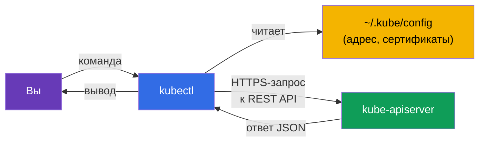
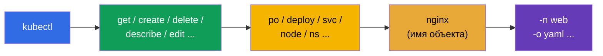
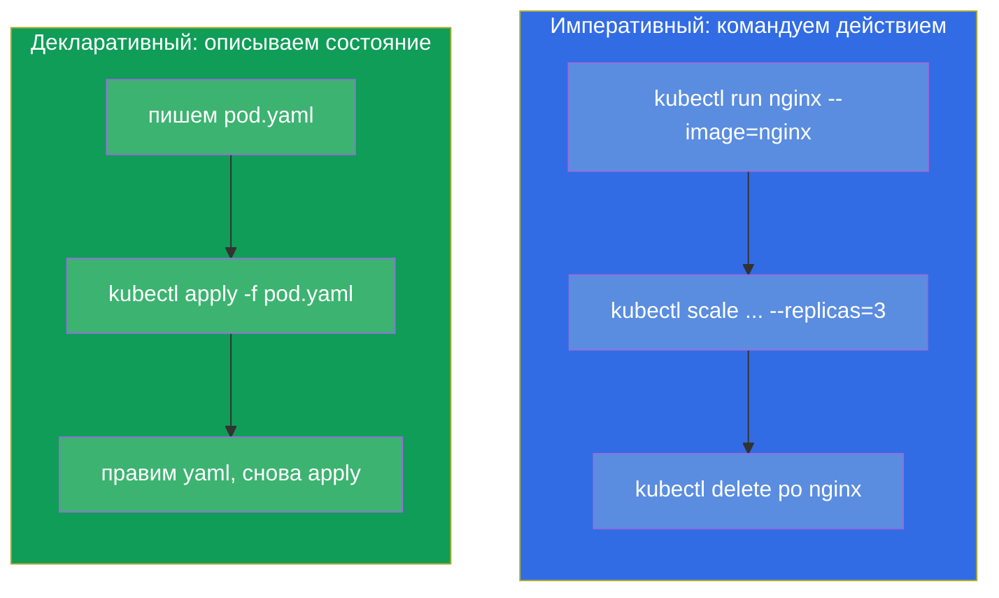
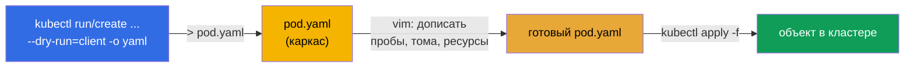

# Глава 3. Работа с kubectl: императивный и декларативный подходы

> **Что дальше.** Мы поняли, из чего состоит кластер. Теперь возьмём в руки главный
> инструмент - `kubectl`, через который вы будете делать вообще всё: на экзамене, в
> лабах и в реальной работе. Эта глава - фундамент скорости. На экзамене 15-20 задач
> за 2 часа решают только те, кто не пишет YAML руками с нуля, а генерирует его
> командами. Здесь мы разберём оба подхода (императивный и декларативный), настроим
> рабочее окружение для скорости и научимся находить любое поле через `kubectl
> explain`. Всё, что здесь освоено, работает во всех последующих главах.

## 3.1. Что такое kubectl и как он общается с кластером

`kubectl` - это клиент командной строки. Он не делает ничего сам: он превращает ваши
команды в HTTP-запросы к `kube-apiserver` и печатает ответ. Всё, что мы разбирали в
главе 2, применимо: `kubectl` - это ещё один клиент API-сервера, наравне с внутренними
компонентами.



Откуда `kubectl` знает, к какому кластеру идти и как аутентифицироваться? Из файла
конфигурации - **kubeconfig**, по умолчанию `~/.kube/config`. В нём описаны кластеры
(адреса API), пользователи (сертификаты/токены) и контексты (связки кластер+пользователь+namespace).
Подробно kubeconfig разберём в главе 39, но базовые команды нужны уже сейчас:

```bash
kubectl config view                       # показать текущий конфиг
kubectl config get-contexts               # список контекстов
kubectl config current-context            # какой контекст активен сейчас
kubectl config use-context cluster1       # переключиться на контекст
```

> **Важно для экзамена.** В каждом задании указан кластер и контекст. Первое, что вы
> делаете в задаче, - выполняете `kubectl config use-context <нужный>`. Забыли
> переключиться - сделали задание не в том кластере и потеряли баллы. Это одна из
> самых частых и обидных ошибок.

## 3.2. Анатомия команды kubectl

Почти все команды `kubectl` строятся по одной схеме:

```
kubectl [команда] [тип] [имя] [флаги]
```



Например, `kubectl get pods nginx -n web -o yaml`:
- **команда** `get` - что сделать (получить);
- **тип** `pods` - с каким видом объектов;
- **имя** `nginx` - какой конкретно (можно опустить - тогда все);
- **флаги** `-n web -o yaml` - в namespace `web`, вывод в YAML.

У типов объектов есть короткие псевдонимы, которые экономят время:

| Полное | Коротко | Полное | Коротко |
|--------|---------|--------|---------|
| pods | po | services | svc |
| deployments | deploy | namespaces | ns |
| replicasets | rs | configmaps | cm |
| nodes | no | persistentvolumeclaims | pvc |
| daemonsets | ds | persistentvolumes | pv |
| statefulsets | sts | serviceaccounts | sa |

Полный список псевдонимов - `kubectl api-resources`.

## 3.3. Два подхода: императивный и декларативный

Это концептуальное ядро главы. Управлять объектами Kubernetes можно двумя способами.

- **Императивный** - вы командуете, *что сделать сейчас*: «создай под», «удали
  деплой», «поменяй образ». Быстро, но нигде не сохраняется история намерений.
- **Декларативный** - вы описываете *желаемое состояние* в YAML-файле и говорите
  `kubectl apply -f`. Kubernetes сам решает, что создать или изменить. Повторяемо,
  версионируется в git, подходит для команды и продакшена.



**Какой подход когда использовать?**

| Ситуация | Подход | Почему |
|----------|--------|--------|
| Простой объект на экзамене (под, sa, cm) | императивный | быстрее всего |
| Сложный объект (нужны пробы, тома, affinity) | гибрид: сгенерировать → править | руками весь YAML не написать |
| Продакшен, командная работа | декларативный | git, ревью, повторяемость |
| Быстро что-то проверить/удалить | императивный | одна команда |

**Золотая середина для экзамена - гибрид.** Генерируем каркас YAML императивной
командой с `--dry-run=client -o yaml`, дописываем нужное в редакторе, применяем через
`apply`. Это самый быстрый способ получить сложный объект.

## 3.4. Императивные команды: создаём объекты быстро

Две ключевые команды создания: `kubectl run` (для одиночного пода) и `kubectl create`
(для остальных объектов).

```bash
# Под
kubectl run nginx --image=nginx

# Под с портом и переменными окружения
kubectl run web --image=nginx --port=80 --env="KEY=value"

# Deployment с 3 репликами
kubectl create deployment web --image=nginx --replicas=3

# Namespace
kubectl create namespace dev

# ConfigMap из литералов
kubectl create configmap app-cfg --from-literal=COLOR=blue

# Secret
kubectl create secret generic db --from-literal=password=s3cret

# Service: пробросить порт деплоя
kubectl expose deployment web --port=80 --target-port=80

# Масштабирование
kubectl scale deployment web --replicas=5

# Сменить образ
kubectl set image deployment/web nginx=nginx:1.27
```

Многие команды `run`/`create`/`expose` - это единственный быстрый способ получить
объект на экзамене. Их стоит довести до автоматизма.

## 3.5. Генерация манифестов: `--dry-run=client -o yaml`

Это, возможно, самый важный приём всего курса для скорости. Флаги `--dry-run=client
-o yaml` означают: «не создавай объект на самом деле, а покажи мне, какой YAML ты бы
отправил». Мы перенаправляем этот YAML в файл, правим и применяем.



На практике:

```bash
# Сгенерировать каркас пода в файл
kubectl run nginx --image=nginx --dry-run=client -o yaml > pod.yaml

# Сгенерировать каркас деплоя
kubectl create deployment web --image=nginx --replicas=3 \
  --dry-run=client -o yaml > deploy.yaml

# Отредактировать и применить
vim pod.yaml
kubectl apply -f pod.yaml
```

Что важно понять про `--dry-run`:
- `--dry-run=client` - вообще не обращается к серверу, просто рендерит YAML локально;
- `--dry-run=server` - отправляет на сервер, тот прогоняет валидацию и admission, но
  не сохраняет. Полезно, чтобы проверить, пройдёт ли объект, не создавая его.

## 3.6. Декларативный подход: apply, create, replace

При декларативном управлении вы работаете с файлами. Основные команды:

```bash
kubectl apply -f pod.yaml          # создать или обновить по манифесту
kubectl apply -f ./manifests/      # применить все файлы в каталоге
kubectl delete -f pod.yaml         # удалить объекты из манифеста
kubectl create -f pod.yaml         # создать (упадёт, если уже есть)
kubectl replace -f pod.yaml        # заменить существующий целиком
```

Разница между `create` и `apply` принципиальна:

| Команда | Если объекта нет | Если объект уже есть |
|---------|------------------|----------------------|
| `create -f` | создаст | ошибка (уже существует) |
| `apply -f` | создаст | обновит (умное слияние изменений) |
| `replace -f` | ошибка (нет объекта) | заменит целиком |

`apply` - рабочая лошадка декларативного подхода: она умеет **трёхстороннее слияние**
(3-way merge), сравнивая ваш файл, текущее состояние и последнюю применённую версию.
Поэтому `apply` можно повторять сколько угодно раз - это идемпотентно.

## 3.7. Читаем состояние: get, describe, logs

Половина работы (и экзамена) - не создавать, а смотреть, что происходит.

```bash
# Список объектов
kubectl get pods
kubectl get pods -o wide            # + нода и IP
kubectl get pods -A                 # во всех namespace (--all-namespaces)
kubectl get pods --show-labels      # с метками
kubectl get pods -w                 # следить в реальном времени (watch)

# Подробности объекта (события внизу — золото для отладки)
kubectl describe pod nginx

# Логи контейнера
kubectl logs nginx                  # логи пода
kubectl logs nginx -c app           # конкретный контейнер
kubectl logs nginx -f               # в реальном времени
kubectl logs nginx --previous       # логи упавшего предыдущего контейнера

# Команда внутри контейнера
kubectl exec nginx -- ls /          # выполнить команду
kubectl exec -it nginx -- sh        # интерактивная оболочка

# События кластера
kubectl get events --sort-by='.lastTimestamp'
```

Ключевой навык отладки: `kubectl describe` печатает внизу секцию **Events** - именно
там причины «почему под не стартует», «почему pending», «почему image pull failed».
Про это - подробно в главе 44.

## 3.8. Форматы вывода и JSONPath

Флаг `-o` управляет форматом вывода. Это пригодится и в жизни, и на экзамене (иногда
просят «выведи имена всех подов в файл»).

```bash
kubectl get pods -o wide            # расширенная таблица
kubectl get pod nginx -o yaml       # полный YAML объекта
kubectl get pod nginx -o json       # то же в JSON
kubectl get pods -o name            # только имена (pod/nginx)

# JSONPath — выдёргивание конкретных полей
kubectl get pods -o jsonpath='{.items[*].metadata.name}'
kubectl get nodes -o jsonpath='{.items[*].status.addresses[?(@.type=="InternalIP")].address}'

# Своя таблица через custom-columns
kubectl get pods -o custom-columns=NAME:.metadata.name,NODE:.spec.nodeName
```

JSONPath и custom-columns детально разберём в главе 47 (подготовка к CKAD) - там это
частый тип заданий. Пока достаточно знать, что такой инструмент есть.

## 3.9. Настройка окружения для скорости (обязательно для экзамена)

Прежде чем идти на экзамен, обязательно настройте эти вещи в первые минуты - они
экономят десятки минут за экзамен.

```bash
# Алиас k = kubectl
alias k=kubectl

# Переменные-хелперы для генерации манифестов и быстрого удаления
export do="--dry-run=client -o yaml"
export now="--force --grace-period=0"

# Автодополнение команд
source <(kubectl completion bash)
complete -o default -F __start_kubectl k

# Настройка vim под YAML: 2 пробела, без табов
echo 'set tabstop=2 shiftwidth=2 expandtab' >> ~/.vimrc
export KUBE_EDITOR=vim
```

Теперь можно писать коротко:

```bash
k run nginx --image=nginx $do > pod.yaml     # = --dry-run=client -o yaml
k delete po nginx $now                        # мгновенное удаление
```


> **Про отступы в YAML.** Kubernetes принимает только пробелы, табы запрещены. Настройка
> `expandtab` в vim превращает таб в пробелы - без неё легко получить ошибку парсинга
> и потерять время. Это настраивают до всего остального.

## 3.10. `kubectl explain`: документация прямо в терминале

Забыли, как называется поле или на каком оно уровне вложенности? Не обязательно лезть
в браузер - `kubectl explain` показывает схему любого объекта прямо в терминале.

```bash
kubectl explain pod                       # верхний уровень
kubectl explain pod.spec                  # поля spec
kubectl explain pod.spec.containers       # поля контейнера
kubectl explain pod.spec.containers.livenessProbe   # и так вглубь
kubectl explain pod --recursive           # всё дерево полей сразу
```

Это незаменимо, когда помнишь смысл поля, но забыл точное имя или иерархию. Работает
для любого типа, включая CRD (глава 41).

## 3.11. Редактирование и удаление живых объектов

```bash
# Открыть объект в редакторе и поправить на лету
kubectl edit deployment web

# Пометить/снять метку
kubectl label pod nginx env=prod
kubectl label pod nginx env-               # знак «минус» убирает метку

# Аннотации — аналогично
kubectl annotate pod nginx note="hello"

# Удаление
kubectl delete pod nginx
kubectl delete -f pod.yaml
kubectl delete pod nginx --force --grace-period=0    # мгновенно, без ожидания
```

Важная тонкость: некоторые поля пода **неизменяемы** после создания (например, образ
контейнера в голом Pod менять можно, а вот многое в `spec` - нет). Если `kubectl edit`
не даёт сохранить, объект придётся удалить и создать заново из поправленного манифеста.
Для Deployment это не проблема - там правки применяются через новый rollout (глава 8).

## 3.12. Как это применяют в продакшене

- **Декларативность и GitOps.** В реальной эксплуатации почти никто не создаёт объекты
  императивно. Все манифесты лежат в git, а инструменты вроде **Argo CD** или **Flux**
  автоматически применяют их в кластер (`apply`) и следят, чтобы состояние кластера
  совпадало с репозиторием. Императивные команды в проде - это в основном отладка и
  разовые операции.
- **`kubectl` только для чтения и разбора.** В зрелых командах прямые изменения через
  `kubectl edit`/`delete` в проде - табу (это «дрейф» от git). А вот `get`, `describe`,
  `logs`, `exec` - ежедневные инструменты дежурного при разборе инцидентов.
- **Контексты и безопасность.** У инженеров в kubeconfig обычно несколько кластеров
  (dev/stage/prod). Спутать контекст и выполнить команду в проде вместо dev - реальный
  инцидент. Поэтому в проде используют утилиты вроде `kubectx`/`kube-ps1`, показывающие
  активный контекст прямо в приглашении shell.
- **Права доступа.** То, что вам позволено делать через `kubectl`, ограничено RBAC
  (глава 38). Разработчик обычно имеет доступ только к своим namespace, а не ко всему
  кластеру.

## 3.13. Мини-глоссарий

- **kubectl** - клиент командной строки, превращает команды в запросы к API-серверу.
- **kubeconfig** - файл (`~/.kube/config`) с кластерами, пользователями и контекстами.
- **Контекст** - связка кластер + пользователь + namespace; переключается
  `use-context`.
- **Императивный подход** - управление действиями (`run`, `create`, `delete`).
- **Декларативный подход** - управление желаемым состоянием через `apply -f`.
- **`--dry-run=client -o yaml`** - сгенерировать YAML, ничего не создавая.
- **apply** - создать или обновить объект по манифесту (идемпотентно, 3-way merge).
- **JSONPath** - язык выборки полей из ответа API (`-o jsonpath=...`).
- **kubectl explain** - встроенная документация по полям объектов.

## 3.14. Итоги главы

- `kubectl` - клиент API-сервера; куда идти и как авторизоваться, берёт из kubeconfig.
- В каждой задаче сначала переключайте контекст (`config use-context`) - иначе
  сделаете работу не в том кластере.
- Команда строится как `kubectl [команда] [тип] [имя] [флаги]`; у типов есть короткие
  псевдонимы (po, deploy, svc, ...).
- Два подхода: императивный (быстро, разово) и декларативный (`apply`, повторяемо,
  для git и прода). Золотая середина на экзамене - сгенерировать YAML и доправить.
- `--dry-run=client -o yaml` - главный приём скорости: получаем каркас манифеста
  командой, дописываем сложное в редакторе, применяем через `apply`.
- Чтение состояния: `get` (в т.ч. `-o wide`, `-A`, `-w`), `describe` (Events!), `logs`
  (`-f`, `--previous`), `exec`, `get events`.
- Настройте окружение до экзамена: алиас `k`, `do`/`now`, автодополнение, vim с
  2 пробелами. Это экономит десятки минут.
- `kubectl explain` заменяет поход в браузер за именами полей.

## 3.15. Как это пригодится: на экзамене и в реальной работе

**На экзамене.** Это вообще базовый навык обоих экзаменов - без беглого `kubectl` не
успеть ни одной задачи. Прямых заданий «настрой alias» нет, но скорость, которую даёт
эта глава, определяет, сколько задач вы решите. Приёмы `--dry-run`, короткие
псевдонимы, `explain`, быстрое `describe`/`logs` применяются в каждой второй задаче.

**В реальной работе.** `kubectl get/describe/logs/exec` - ежедневный инструмент любого,
кто эксплуатирует Kubernetes: разбор инцидентов начинается именно с них. Понимание
разницы императивного и декларативного подходов определяет, как построен весь процесс
доставки: в зрелых командах всё декларативно и через git (GitOps), а императивные
команды остаются для отладки.

## 3.16. Вопросы для самопроверки

1. Как `kubectl` понимает, к какому кластеру подключаться и под кем? Что будет, если не
   переключить контекст на экзамене?
2. Чем отличается императивный подход от декларативного? Когда какой уместен?
3. Что делает `--dry-run=client -o yaml` и почему это ключевой приём для скорости?
4. В чём разница между `kubectl create -f`, `apply -f` и `replace -f`?
5. Где `kubectl describe` показывает причины проблем с объектом?
6. Зачем настраивать `expandtab` в vim перед экзаменом?
7. Как, не открывая браузер, вспомнить точное имя поля в спецификации пода?

## Практика

Теперь у вас есть инструмент. В следующих главах мы начнём создавать реальные объекты:
поды (глава 4), затем ReplicaSet и Deployment (глава 5). Все приёмы `kubectl` из этой
главы вы отработаете в первой объединённой лабораторной вместе с базовыми объектами.

🧪 Лаба 119 (дриллы на скорость и JSONPath): [tasks/cka/labs/119](../../labs/119/README_RU.MD)

---
[Оглавление](../README_RU.md) · [Глава 2](../02/ru.md) · [Глава 4](../04/ru.md)
