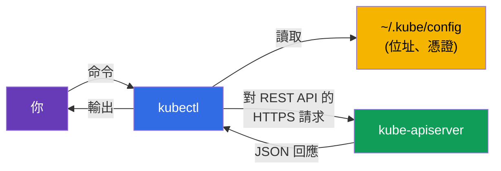
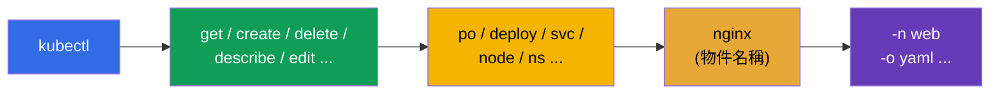
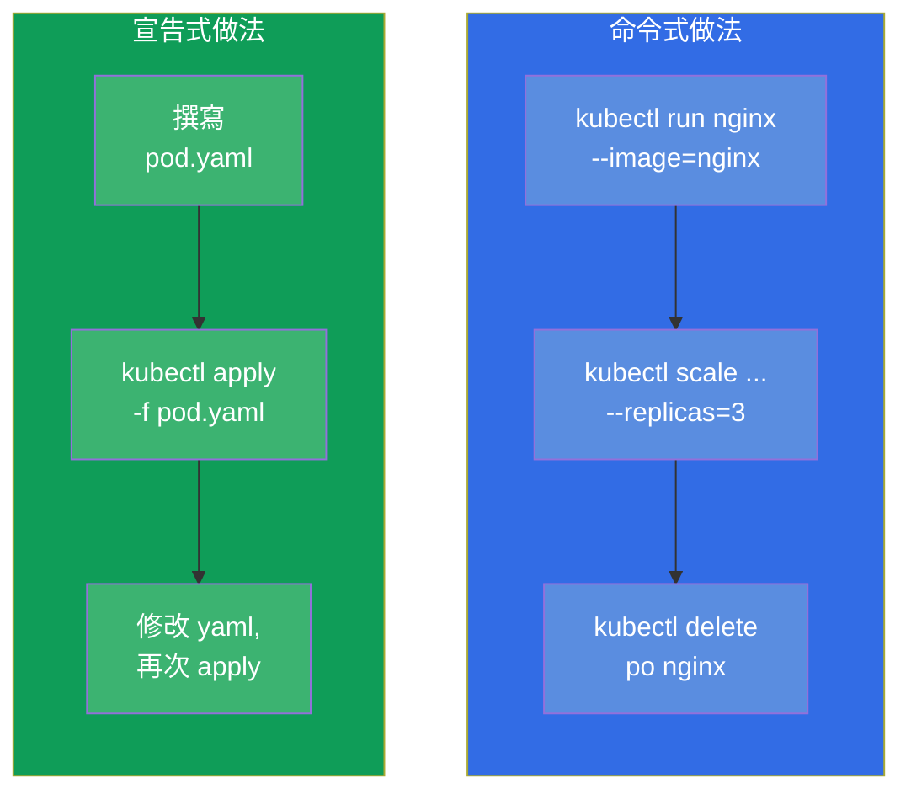
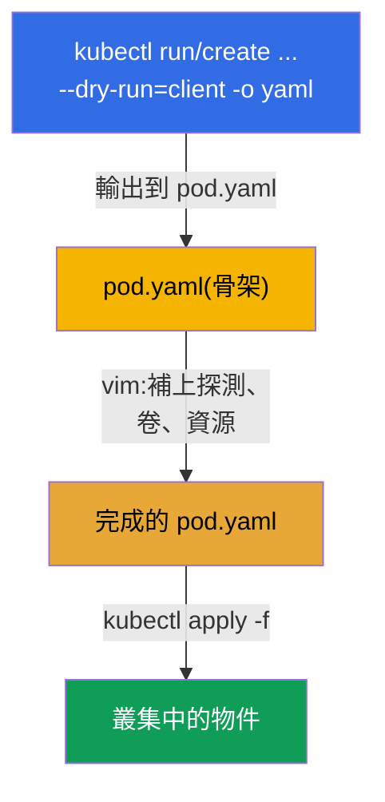

[Русская версия](ru.md) · [Eng version](README.md) · [Versión en español](es.md) · [Version française](fr.md) · [Deutsche Version](de.md) · [ქართული ვერსია](ge.md) · [日本語版](jp.md)

# 第 3 章。使用 kubectl:命令式與宣告式兩種做法

> **接下來是什麼。** 我們已經明白叢集由哪些部分組成。現在拿起主要
> 工具 - `kubectl`,你將透過它做所有事情:在考試中、在實驗中,以及
> 在真實工作中。這一章是速度的地基。在考試中 2 小時解完 15-20
> 題的,只有那些不從零手寫 YAML、
> 而是用命令產生它的人。這裡我們會拆解兩種
> 做法(命令式與宣告式)、把工作環境調到夠快,並學會透過 `kubectl
> explain` 找到任何欄位。這裡掌握的一切,在後面所有章節都用得上。

## 3.1. kubectl 是什麼,它如何與叢集溝通

`kubectl` 是命令列客戶端。它自己不做任何事:它把你的命令變成對
`kube-apiserver` 的 HTTP 請求,並印出回應。我們在第 2 章拆解過的一切
都適用:`kubectl` 就是 API 伺服器的另一個客戶端,
與內部元件平起平坐。



`kubectl` 從哪裡知道要連到哪個叢集、如何認證?從設定檔 -
**kubeconfig**,預設是 `~/.kube/config`。裡面描述了叢集(API 位址)、
使用者(憑證/權杖)與 context(叢集+使用者+namespace 的組合)。
kubeconfig 會在第 39 章詳細拆解,但基本命令現在就需要:

```bash
kubectl config view                       # 顯示目前的設定
kubectl config get-contexts               # context 清單
kubectl config current-context            # 現在哪個 context 是啟用的
kubectl config use-context cluster1       # 切換到某個 context
```

> **考試重點。** 每一題都會指定叢集與 context。你在題目裡做的第一件事,
> 就是執行 `kubectl config use-context <需要的那個>`。忘記切換 - 就是在
> 錯誤的叢集裡做完了題目,白白丟分。這是最常見、
> 也最令人扼腕的錯誤之一。

## 3.2. 如何安裝 kubectl

在考試與我們的實驗中 `kubectl` 已經裝好了 - 不需要自己安裝。但為了在
自己的機器上練習,你得裝上它,而更重要的是理解
**版本相容規則**。

> **skew 規則(版本落差)。** `kubectl` 的版本與 `kube-apiserver` 的版本
> 相差不得超過 **一個 minor 版本**(兩個方向都算)。例如,對 1.34 的
> API 伺服器來說,`kubectl` 1.33、1.34 或 1.35 都可以,但 1.32 或 1.36
> 不行。實務上請讓 `kubectl` 保持與叢集相同的 minor 版本。

不同作業系統的安裝方式:

| 作業系統 / 套件管理器 | 命令 |
|---------------|---------|
| Linux(二進位檔) | `curl -LO "https://dl.k8s.io/release/$(curl -L -s https://dl.k8s.io/release/stable.txt)/bin/linux/amd64/kubectl"` |
| Linux(apt,Debian/Ubuntu) | `sudo apt-get install -y kubectl`(在接上 pkgs.k8s.io 倉庫之後) |
| Linux(dnf,RHEL/Fedora) | `sudo dnf install -y kubectl`(在接上倉庫之後) |
| macOS(Homebrew) | `brew install kubectl` |
| Windows(choco) | `choco install kubernetes-cli` |

在 Linux 上手動安裝二進位檔的完整流程:

```bash
# 1. 下載最新穩定版的二進位檔
curl -LO "https://dl.k8s.io/release/$(curl -L -s https://dl.k8s.io/release/stable.txt)/bin/linux/amd64/kubectl"

# 2. (選用)檢查校驗和
curl -LO "https://dl.k8s.io/release/$(curl -L -s https://dl.k8s.io/release/stable.txt)/bin/linux/amd64/kubectl.sha256"
echo "$(cat kubectl.sha256)  kubectl" | sha256sum --check

# 3. 以正確的權限安裝到 PATH
sudo install -o root -g root -m 0755 kubectl /usr/local/bin/kubectl
```

檢查是否都裝好了:

```bash
kubectl version --client            # 只看客戶端版本(不連叢集)
kubectl version                     # 客戶端與伺服器版本(需要叢集存取權)
```

> **考試建議。** 不必把時間花在安裝上 - 環境已經準備好:`kubectl`、別名
> `k` 與自動補完都是預設就設好的。自己動手安裝與設定的環境
> (第 3.10 節),
> 只在個人機器上練習時才有意義。

## 3.3. kubectl 命令的結構

幾乎所有 `kubectl` 命令都按同一個格式組成:

```
kubectl [命令] [型別] [名稱] [旗標]
```



例如 `kubectl get pods nginx -n web -o yaml`:
- **命令** `get` - 要做什麼(取得);
- **型別** `pods` - 針對哪一類物件;
- **名稱** `nginx` - 具體是哪一個(可以省略 - 那就是全部);
- **旗標** `-n web -o yaml` - 在 namespace `web` 中,以 YAML 輸出。

物件型別有簡短的別名,可以省時間:

| 完整 | 簡寫 | 完整 | 簡寫 |
|--------|---------|--------|---------|
| pods | po | services | svc |
| deployments | deploy | namespaces | ns |
| replicasets | rs | configmaps | cm |
| nodes | no | persistentvolumeclaims | pvc |
| daemonsets | ds | persistentvolumes | pv |
| statefulsets | sts | serviceaccounts | sa |

別名的完整清單 - `kubectl api-resources`。

## 3.4. 兩種做法:命令式與宣告式

這是本章的概念核心。管理 Kubernetes 物件有兩種方式。

- **命令式** - 你下令 *現在要做什麼*:「建立一個 pod」、「刪掉這個
  deployment」、「換掉映像」。快,但意圖的歷史不會保存在任何地方。
- **宣告式** - 你在 YAML 檔中描述 *期望狀態*,然後說
  `kubectl apply -f`。Kubernetes 自己決定要建立或修改什麼。可重複、
  可在 git 中做版本控制,適合團隊與生產環境。



**什麼時候用哪一種做法?**

| 情境 | 做法 | 為什麼 |
|----------|--------|--------|
| 考試中的簡單物件(pod、sa、cm) | 命令式 | 最快 |
| 複雜物件(需要探測、卷、affinity) | 混合:先產生 → 再修改 | 整份 YAML 不可能手寫 |
| 生產環境、團隊協作 | 宣告式 | git、審查、可重複 |
| 想快速檢查/刪除某個東西 | 命令式 | 一條命令 |

**考試的黃金折衷是混合做法。** 用帶 `--dry-run=client -o yaml` 的命令式
命令產生 YAML 骨架,在編輯器中補上需要的內容,再透過 `apply` 套用。
這是拿到複雜物件最快的方式。

## 3.5. 命令式命令:快速建立物件

兩個關鍵的建立命令:`kubectl run`(用於單一 pod)與 `kubectl create`
(用於其他物件)。

```bash
# Pod
kubectl run nginx --image=nginx

# 帶埠與環境變數的 Pod
kubectl run web --image=nginx --port=80 --env="KEY=value"

# 有 3 個副本的 Deployment
kubectl create deployment web --image=nginx --replicas=3

# Namespace
kubectl create namespace dev

# 從字面值建立 ConfigMap
kubectl create configmap app-cfg --from-literal=COLOR=blue

# Secret
kubectl create secret generic db --from-literal=password=s3cret

# Service:把 deployment 的埠對外開放
kubectl expose deployment web --port=80 --target-port=80

# 擴縮
kubectl scale deployment web --replicas=5

# 更換映像
kubectl set image deployment/web nginx=nginx:1.27
```

很多 `run`/`create`/`expose` 命令是在考試中拿到物件唯一的快速方式。
值得練到成為反射動作。

## 3.6. 產生 manifest:`--dry-run=client -o yaml`

這大概是整個課程中對速度最重要的技巧。旗標 `--dry-run=client
-o yaml` 的意思是:「不要真的建立物件,只給我看你會送出什麼 YAML」。
我們把這份 YAML 重導向到檔案,修改後再套用。



實務上:

```bash
# 把 pod 骨架產生到檔案
kubectl run nginx --image=nginx --dry-run=client -o yaml > pod.yaml

# 產生 deployment 骨架
kubectl create deployment web --image=nginx --replicas=3 \
  --dry-run=client -o yaml > deploy.yaml

# 編輯並套用
vim pod.yaml
kubectl apply -f pod.yaml
```

關於 `--dry-run` 要理解的重點:
- `--dry-run=client` - 完全不連伺服器,只在本機把 YAML 算出來;
- `--dry-run=server` - 送到伺服器,由它跑完驗證與 admission,但不儲存。
  適合用來檢查物件會不會通過,而不用真的建立它。

## 3.7. 宣告式做法:apply、create、replace

在宣告式管理中你操作的是檔案。主要命令:

```bash
kubectl apply -f pod.yaml          # 依 manifest 建立或更新
kubectl apply -f ./manifests/      # 套用目錄中所有檔案
kubectl delete -f pod.yaml         # 刪除 manifest 中的物件
kubectl create -f pod.yaml         # 建立(若已存在會失敗)
kubectl replace -f pod.yaml        # 整份取代既有物件
```

`create` 與 `apply` 的差別很關鍵:

| 命令 | 若物件不存在 | 若物件已存在 |
|---------|------------------|----------------------|
| `create -f` | 會建立 | 錯誤(已存在) |
| `apply -f` | 會建立 | 會更新(聰明地合併變更) |
| `replace -f` | 錯誤(沒有這個物件) | 整份取代 |

`apply` 是宣告式做法的主力:它會做 **三方合併**(3-way merge),比對
你的檔案、目前狀態與最後一次套用的版本。因此 `apply` 可以重複執行
任意多次 - 它是冪等的。

## 3.8. 讀取狀態:get、describe、logs

工作(以及考試)有一半不是建立東西,而是看看發生了什麼。

```bash
# 物件清單
kubectl get pods
kubectl get pods -o wide            # + 節點與 IP
kubectl get pods -A                 # 所有 namespace 中(--all-namespaces)
kubectl get pods --show-labels      # 帶標籤
kubectl get pods -w                 # 即時追蹤(watch)

# 物件細節(下方的事件 — 除錯的黃金)
kubectl describe pod nginx

# 容器日誌
kubectl logs nginx                  # pod 的日誌
kubectl logs nginx -c app           # 指定容器
kubectl logs nginx -f               # 即時
kubectl logs nginx --previous       # 上一個已崩潰容器的日誌

# 在容器內執行命令
kubectl exec nginx -- ls /          # 執行命令
kubectl exec -it nginx -- sh        # 互動式 shell

# 叢集事件
kubectl get events --sort-by='.lastTimestamp'
```

除錯的關鍵技能:`kubectl describe` 會在下方印出 **Events** 區段 - 正是
在那裡能看到「為什麼 pod 起不來」、「為什麼卡在 pending」、「為什麼
image pull failed」的原因。關於這點 - 第 44 章詳談。

## 3.9. 輸出格式與 JSONPath

`-o` 旗標控制輸出格式。這在實際工作與考試中都用得上(有時會要求
「把所有 pod 的名稱輸出到檔案」)。

```bash
kubectl get pods -o wide            # 擴充表格
kubectl get pod nginx -o yaml       # 物件的完整 YAML
kubectl get pod nginx -o json       # 同樣內容,JSON 格式
kubectl get pods -o name            # 只有名稱(pod/nginx)

# JSONPath — 抽出特定欄位
kubectl get pods -o jsonpath='{.items[*].metadata.name}'
kubectl get nodes -o jsonpath='{.items[*].status.addresses[?(@.type=="InternalIP")].address}'

# 用 custom-columns 做自己的表格
kubectl get pods -o custom-columns=NAME:.metadata.name,NODE:.spec.nodeName
```

JSONPath 與 custom-columns 會在第 47 章(CKAD 準備)詳細拆解 - 那裡是
常見的題型。目前只要知道有這個工具就夠了。

## 3.10. 為速度設定環境

在現行考試(PSI)中,基本環境已經預設就緒:`kubectl`、別名 `k` 與
自動補完通常都已預先設好 - 不需要特別安裝什麼。因此考試一開始要做的
不是設定環境,而是 **檢查** 需要的東西已經可用(`k get ns`、用 `Tab`
自動補完)。而輔助變數(`do`、`now`)預設沒有設定 - 想要的話
自己加上。

在自己的機器上練習時,下面整套都要自行設定 - 它能省下
數十分鐘。

```bash
# 別名 k = kubectl
alias k=kubectl

# 用於產生 manifest 與快速刪除的輔助變數
export do="--dry-run=client -o yaml"
export now="--force --grace-period=0"

# 命令自動補完
source <(kubectl completion bash)
complete -o default -F __start_kubectl k

# 為 YAML 設定 vim:2 個空格,不用 tab
echo 'set tabstop=2 shiftwidth=2 expandtab' >> ~/.vimrc
export KUBE_EDITOR=vim
```

現在可以寫得很短:

```bash
k run nginx --image=nginx $do > pod.yaml     # = --dry-run=client -o yaml
k delete po nginx $now                        # 立即刪除
```


> **關於 YAML 的縮排。** Kubernetes 只接受空格,禁止 tab。vim 中的
> `expandtab` 設定會把 tab 變成空格 - 沒有它很容易得到解析錯誤並浪費
> 時間。這要在其他一切之前先設好。

## 3.11. `kubectl explain`:直接在終端機裡的文件

忘了欄位叫什麼名字,或它在哪一層嵌套?不必開瀏覽器 - `kubectl explain`
會直接在終端機裡顯示任何物件的 schema。

```bash
kubectl explain pod                       # 最上層
kubectl explain pod.spec                  # spec 的欄位
kubectl explain pod.spec.containers       # 容器的欄位
kubectl explain pod.spec.containers.livenessProbe   # 就這樣往下深入
kubectl explain pod --recursive           # 一次列出整棵欄位樹
```

當你記得欄位的意思、卻忘了確切名稱或層級時,這無可取代。它對任何型別
都有效,包括 CRD(第 41 章)。

## 3.12. 編輯與刪除線上物件

```bash
# 在編輯器中打開物件並即時修改
kubectl edit deployment web

# 加上/移除標籤
kubectl label pod nginx env=prod
kubectl label pod nginx env-               # 「減號」會移除標籤

# 註解 — 同理
kubectl annotate pod nginx note="hello"

# 刪除
kubectl delete pod nginx
kubectl delete -f pod.yaml
kubectl delete pod nginx --force --grace-period=0    # 立即,不等待
```

一個重要細節:pod 的某些欄位在建立後 **不可變更**(例如,裸 Pod 中的
容器映像可以改,但 `spec` 裡很多東西不行)。如果 `kubectl edit` 不讓你
儲存,就得刪掉物件,再從修正後的 manifest 重新建立。對 Deployment 來說
這不是問題 - 那裡的修改會透過新的 rollout 套用(第 8 章)。

## 3.13. 這在生產環境中如何應用

- **宣告式與 GitOps。** 在真實維運中幾乎沒有人以命令式建立物件。所有
  manifest 都放在 git 裡,而像 **Argo CD** 或 **Flux** 這類工具會自動把
  它們套用到叢集(`apply`),並確保叢集狀態與倉庫一致。生產環境中的
  命令式命令主要用於除錯,
  以及一次性的操作。
- **`kubectl` 只用來讀取與排查。** 在成熟的團隊裡,在生產環境用
  `kubectl edit`/`delete` 直接改動是禁忌(這是相對於 git 的「漂移」)。
  而 `get`、`describe`、`logs`、`exec` 則是值班人員排查事故時的日常工具。
- **Context 與安全。** 工程師的 kubeconfig 裡通常有好幾個叢集
  (dev/stage/prod)。搞錯 context、在生產環境而非 dev 執行命令 - 是真實
  的事故。因此在生產環境會使用 `kubectx`/`kube-ps1` 這類工具,直接在
  shell 提示字元中顯示啟用的 context。
- **存取權限。** 你能透過 `kubectl` 做什麼,受 RBAC 限制
  (第 38 章)。開發者通常只有自己 namespace 的存取權,
  而不是整個叢集。

## 3.14. 迷你詞彙表

- **kubectl** - 命令列客戶端,把命令變成對 API 伺服器的請求。
- **kubeconfig** - 含有叢集、使用者與 context 的檔案(`~/.kube/config`)。
- **Context** - 叢集 + 使用者 + namespace 的組合;用 `use-context`
  切換。
- **命令式做法** - 以動作來管理(`run`、`create`、`delete`)。
- **宣告式做法** - 透過 `apply -f` 管理期望狀態。
- **`--dry-run=client -o yaml`** - 產生 YAML 而不建立任何東西。
- **apply** - 依 manifest 建立或更新物件(冪等,3-way merge)。
- **JSONPath** - 從 API 回應中選取欄位的語言(`-o jsonpath=...`)。
- **kubectl explain** - 關於物件欄位的內建文件。

## 3.15. 本章總結

- `kubectl` 是 API 伺服器的客戶端;要連去哪裡、如何授權,都取自 kubeconfig。
- 每一題都先切換 context(`config use-context`)- 否則你會在錯誤的叢集
  裡做完工作。
- 命令的組成是 `kubectl [命令] [型別] [名稱] [旗標]`;型別有簡短的
  別名(po、deploy、svc、...)。
- 兩種做法:命令式(快、一次性)與宣告式(`apply`、可重複、給 git 與
  生產環境用)。考試的黃金折衷 - 先產生 YAML 再補完。
- `--dry-run=client -o yaml` - 最主要的速度技巧:用命令拿到 manifest
  骨架,在編輯器中補上複雜部分,再透過 `apply` 套用。
- 讀取狀態:`get`(含 `-o wide`、`-A`、`-w`)、`describe`(Events!)、`logs`
  (`-f`、`--previous`)、`exec`、`get events`。
- 考試中的基本環境(`kubectl`、別名 `k`、自動補完)通常都已預先設好 -
  請檢查這件事,而不是從零開始設定;`do`/`now` 這些輔助變數想要的話
  自己加上。在自己的練習機上,整套(別名、`do`/`now`、自動補完、
  2 個空格的 vim)都自行設定 - 它能省下數十分鐘。
- `kubectl explain` 取代了為找欄位名稱而跑去瀏覽器。

## 3.16. 這些知識用在哪裡:考試與實際工作

**在考試中。** 這本來就是兩場考試的基本技能 - `kubectl` 不夠流暢,一題
都做不完。沒有「設定 alias」這種直接的題目,但這一章帶來的速度,決定了
你能解掉幾題。`--dry-run` 技巧、簡短別名、`explain`、快速的
`describe`/`logs`,每兩題就會用到一次。

**在實際工作中。** `kubectl get/describe/logs/exec` 是所有維運 Kubernetes
的人的日常工具:排查事故正是從它們開始。理解命令式與宣告式做法的差別,
決定了整個交付流程如何搭建:在成熟的團隊中一切都是宣告式、
透過 git(GitOps),
而命令式命令則留給除錯。

## 3.17. 自我檢查問題

1. `kubectl` 如何知道要連到哪個叢集、以誰的身分連?如果在考試中沒有
   切換 context 會發生什麼?
2. 命令式做法與宣告式做法有什麼不同?什麼時候各自合適?
3. `--dry-run=client -o yaml` 做什麼,為什麼它是速度的關鍵技巧?
4. `kubectl create -f`、`apply -f` 與 `replace -f` 的差別是什麼?
5. `kubectl describe` 在哪裡顯示物件問題的原因?
6. 為什麼考試前要設定 vim 的 `expandtab`?
7. 不打開瀏覽器,要怎麼回想起 pod 規格中某個欄位的確切名稱?

## 實務練習

現在你有了工具。在接下來的章節中我們會開始建立真實的物件:pod(第 4 章),
接著是 ReplicaSet 與 Deployment(第 5 章)。這一章所有的 `kubectl` 技巧,
你會在第一個綜合實驗中連同基本物件一起操練。

🧪 實驗 119(速度與 JSONPath 的操練):[tasks/cka/labs/119](../../labs/119/README_TW.MD)

🎮 Killercoda（在瀏覽器中，無需安裝）：[Explore pod spec with explain](https://killercoda.com/chadmcrowell/course/ckad/explain-spec-containers) · [List API Resources](https://killercoda.com/chadmcrowell/course/cka/api-resources) · [Create a Pod Declaratively](https://killercoda.com/chadmcrowell/course/cka/declarative-pod) · [Group pods by node](https://killercoda.com/chadmcrowell/course/ckad/list-pods-by-node)

---
[目錄](../README_TW.md) · [第 2 章](../02/tw.md) · [第 4 章](../04/tw.md)
