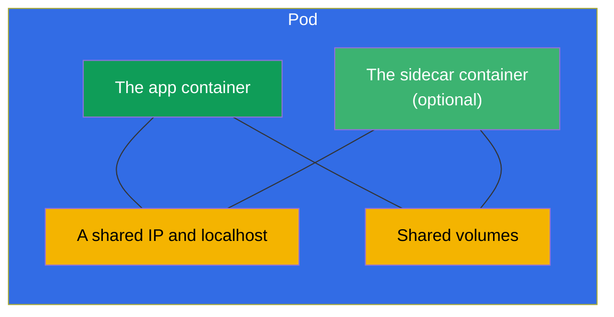
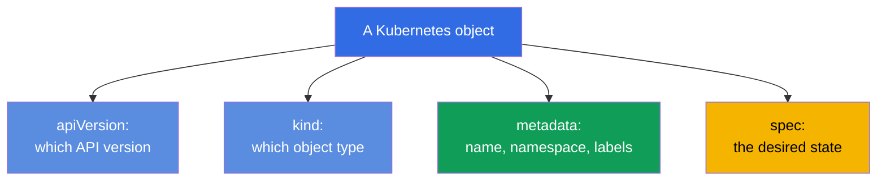
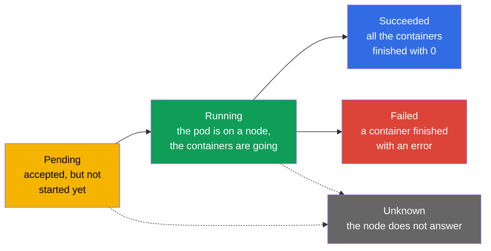
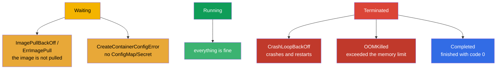
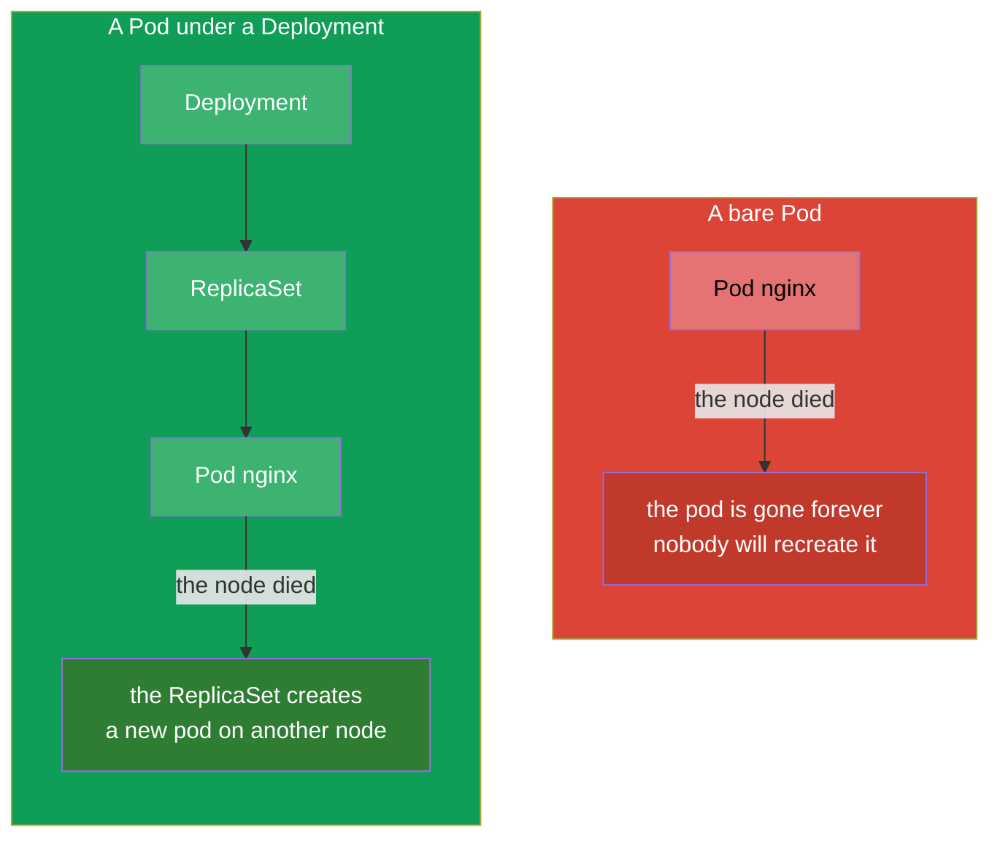

[Русская версия](ru.md) · [Versión en español](es.md) · [Version française](fr.md) · [Deutsche Version](de.md) · [ქართული ვერსია](ge.md) · [繁體中文版](tw.md) · [日本語版](jp.md)

# Chapter 4. Pods: the lifecycle, creation and configuration

> **What comes next.** A Pod is the basic unit of running in Kubernetes and the first
> object you create by hand in every task of both exams. Everything else
> (Deployment, StatefulSet, Job) in the end produces pods. In this chapter we will go
> through what a pod is, what it consists of, how it passes through its lifecycle and how
> to create and configure it. This is the foundation for the workloads (chapters 5-16) and
> for debugging (chapter 44) - because what most often has to be fixed in a cluster is
> exactly the pods.

## 4.1. What a pod is and why it is not "a container"

A pod is **a wrapper around one or several containers** that are always started together,
on the same node, and share the network and the storage between them. Kubernetes never
manages a container directly - the minimal unit of scheduling and running is exactly the
pod.



What the containers inside one pod have in common:

- **The network.** A pod has one IP address for all of them. The containers inside see each
  other over `localhost` and cannot take the very same port.
- **The storage.** Volumes are declared at the level of the pod and can be mounted into
  several containers at once - that is how they exchange files.
- **The lifecycle and the node.** The containers of a pod are always on the same node and
  are scheduled together.

What the containers have **separately**: the file system (each has its own, apart from the
mounted shared volumes) and the processes.

> **Where the shared IP comes from (the pause container).** The shared network address of
> the pod is not "handed out" to the application containers directly - it is held by a
> hidden service container, **pause** (it is also called the infra container). When the
> kubelet creates a pod, it starts the tiny pause container **first**: that one gets the IP
> of the pod and holds the network namespace (and also IPC). The application containers
> then start already **inside** those namespaces of pause - that is why they all have one
> IP, a shared `localhost` and one range of ports. An important consequence: pause does
> almost nothing (it just "sleeps"), but it lives for the whole lifetime of the pod, so a
> restart or a crash of an application container **does not change the IP of the pod** -
> the namespace stays with pause.
>
> You can see this right on the node through `crictl` (the CRI utility, chapter 2):
>
> ```bash
> crictl ps            # the working containers of the pod
> crictl pods          # the pods themselves (sandbox) - these are the pause containers
> ```
>
> Every pod corresponds to one pod sandbox (pause); in the output of `crictl ps` you see
> the application containers, while the "sandbox" with the network is held by pause behind
> the scenes.

> **The key rule.** Usually there is **one** application container in a pod. Several
> containers are put into a pod only when they really are inseparably connected and have to
> share the network/volumes (the sidecar, adapter, ambassador patterns - chapter 22). There
> is no need to stuff unrelated applications into one pod - for that there are separate
> pods.

## 4.2. The anatomy of a pod manifest

Any Kubernetes object in YAML has four top-level fields. On the example of a pod:

```yaml
apiVersion: v1          # the API version (for Pod — v1)
kind: Pod               # the object type
metadata:               # the metadata: name, namespace, labels
  name: nginx
  labels:
    app: web
spec:                   # the desired state: what is inside
  containers:
  - name: nginx         # the container name
    image: nginx:1.27   # the image
    ports:
    - containerPort: 80 # the port the application listens on
```



These four fields - `apiVersion`, `kind`, `metadata`, `spec` - are present in almost every
object. Remember them: further in the course only the content of `spec` changes, while the
skeleton is always one and the same.

## 4.3. Creating a pod: imperatively and through a manifest

Three ways to get a pod - from the fast one to the flexible one:

```bash
# 1. Fast — with a single command
kubectl run nginx --image=nginx

# 2. With parameters
kubectl run web --image=nginx:1.27 --port=80 \
  --env="COLOR=blue" --labels="app=web,tier=front"

# 3. Through a manifest (a hybrid: generate → finish off → apply)
kubectl run nginx --image=nginx --dry-run=client -o yaml > pod.yaml
vim pod.yaml
kubectl apply -f pod.yaml
```

Useful flags of `kubectl run`:

```bash
# A one-off interactive pod, deleted on exit — handy for tests
kubectl run tmp --image=busybox -it --rm --restart=Never -- sh

# Set the container command
kubectl run busy --image=busybox --command -- sleep 3600
```

## 4.4. The lifecycle of a pod: the phases

A pod has the field `status.phase` - the coarse stage of its life. There are five phases in
total.



| Phase | What it means |
|------|-----------|
| **Pending** | The pod has been accepted by the cluster but not started yet: it is waiting for a node assignment, for the image to be downloaded or for free resources |
| **Running** | The pod is bound to a node, at least one container is running or starting |
| **Succeeded** | All the containers finished successfully (code 0) and will not be restarted |
| **Failed** | All the containers finished, at least one - with an error |
| **Unknown** | The state of the pod cannot be obtained (usually the node has lost the connection) |

The phase is a rough picture. A more precise one is given by the **container states** and
the reasons, which are visible in `kubectl describe pod` and in the STATUS column of
`kubectl get pods`.

## 4.5. Container states and the frequent STATUS values

Inside a pod every container has its own state: `Waiting`, `Running`, `Terminated`. When a
container is in `Waiting` or has crashed, it has a **reason** - the cause, which is exactly
what is printed in the STATUS column. These reasons have to be recognized on the spot - half
of the debugging on the CKA/CKAD is about them.



| STATUS | What it means | Where to look |
|--------|-----------|---------------|
| `ContainerCreating` | The container is being created (the image is being pulled, the volumes are being mounted) | fine if it is short; otherwise `describe` |
| `ImagePullBackOff` / `ErrImagePull` | The image cannot be downloaded (a typo, no access to the registry) | the image name, the registry secret |
| `CrashLoopBackOff` | The container starts and immediately crashes, K8s restarts it with a delay | `logs --previous`, the command/config |
| `OOMKilled` | The container was killed for exceeding the memory limit | the memory limits (chapter 14) |
| `CreateContainerConfigError` | The ConfigMap/Secret the pod refers to is not found | the existence of the cm/secret |
| `Completed` | The container did its work and finished with code 0 | fine for a Job/one-off tasks |
| `Pending` | The pod cannot be scheduled | resources, taints, nodeSelector, PVC |

That is exactly why the chain "`kubectl get pods` → saw a strange STATUS → `kubectl describe`
+ `kubectl logs`" is the main debugging reflex. We will go through the troubleshooting of
pods properly in chapter 44.

## 4.6. restartPolicy: when a container is restarted

The field `spec.restartPolicy` controls whether to restart the containers of the pod after
they finish. There are three values:

| Value | Behaviour | What for |
|----------|-----------|----------|
| `Always` (the default) | always restart | long-living services (web, databases) |
| `OnFailure` | restart only on an error (code ≠ 0) | tasks that have to work through to the end (Job) |
| `Never` | do not restart | one-off tasks where a restart is not needed |

Important: `restartPolicy` concerns **the restart of the containers inside the pod on the
same node**, not the recreation of the pod itself. A bare Pod with `Never` that has crashed
will stay crashed - nobody will recreate it. The recreation of pods is the job of the
controllers (ReplicaSet/Deployment - chapter 5), and that is why in production pods are
almost always created not directly but through them.

## 4.7. A bare pod versus a pod managed by a controller

This is an important distinction. A pod can be created "bare" (directly) or given over to
the management of a controller.



- **A bare pod** is not restored by anyone. The node died - the pod is lost. Such pods are
  needed for one-off tasks, debugging, experiments.
- **A pod managed by a controller** (Deployment → ReplicaSet) is automatically recreated on
  failures, scaled, updated. That is how everything is run in production.

On the exam you are often asked to create bare pods directly (fast, `kubectl run`), but you
have to understand that in reality services are not run that way.

## 4.8. Useful fields of a pod's spec

A few important fields that you will often be adding to a pod manifest (each one in detail -
in its own chapter):

```yaml
spec:
  containers:
  - name: app
    image: nginx:1.27
    command: ["nginx"]              # override the image's ENTRYPOINT
    args: ["-g", "daemon off;"]     # the arguments (chapter 17)
    env:                            # the environment variables (chapter 17)
    - name: COLOR
      value: blue
    resources:                      # the requests and limits (chapter 14)
      requests: {cpu: "100m", memory: "64Mi"}
      limits: {cpu: "250m", memory: "128Mi"}
    ports:
    - containerPort: 80
  nodeSelector:                     # on which nodes to place it (chapter 12)
    disktype: ssd
  restartPolicy: Always
```

There is no need to memorize everything at once - what is important is to understand that
all the functionality (probes, volumes, resources, scheduling) is added by fields inside the
`spec` of the pod, and they can be found through `kubectl explain pod.spec...`.

## 4.9. Debugging and access to a pod

The basic set for working with an already running pod:

```bash
kubectl get pod nginx -o wide           # where it runs, which IP
kubectl describe pod nginx              # the events, the container states
kubectl logs nginx                      # the logs
kubectl logs nginx --previous           # the logs of the previous (crashed) container
kubectl exec -it nginx -- sh            # get inside
kubectl port-forward pod/nginx 8080:80  # forward a port to the local machine
```

Separately worth mentioning are the **ephemeral containers** and `kubectl debug` - a way to
attach a temporary debugging container to an already working pod without recreating it. It
is especially useful when the application image is minimal (there is not even `sh`). In
detail - in chapter 29.

## 4.10. How this is applied in production

- **Bare pods are almost never used in production.** Everything that has to live long and
  survive failures is run through controllers (Deployment, StatefulSet, DaemonSet). A bare
  Pod is debugging, a one-off task or a teaching example. If you see a bare pod in
  production - it is almost always a mistake or a temporary "crutch".
- **One application container per pod is the norm.** Multi-container pods are used
  deliberately and for specific patterns (a sidecar for logs/a proxy, init for preparation).
  Bloating a pod with several applications is an antipattern.
- **The STATUS of pods is the basis of monitoring.** Alerts in production are often tied
  exactly to the states of pods: a mass `CrashLoopBackOff`, an `ImagePullBackOff` after a
  release, an `OOMKilled` with wrong limits - these are the first signals of an incident.
- **Minimal images.** In production people aim for small images (distroless, alpine,
  scratch) - a smaller attack surface and less weight. The flip side: there is no `sh`
  inside, so debugging is done through `kubectl debug` with ephemeral containers.

## 4.11. Mini-glossary

- **Pod** - the minimal unit of running: a wrapper around one/several containers with a
  shared network and volumes.
- **The application container** - the main container of the pod with the useful payload.
- **Sidecar** - an auxiliary container in the same pod (chapter 22).
- **Phase** - the coarse stage of a pod's life: Pending, Running, Succeeded, Failed,
  Unknown.
- **restartPolicy** - the restart policy of the containers: Always, OnFailure, Never.
- **A bare pod** - a pod created directly, without a controller; is not restored.
- **CrashLoopBackOff** - the container crashes and restarts in a loop.
- **OOMKilled** - the container was killed for exceeding the memory limit.
- **An ephemeral container** - a temporary container for debugging a live pod (`kubectl
  debug`).

## 4.12. Chapter summary

- A pod is the minimal unit of running: one or several containers with a shared IP,
  `localhost` and volumes, always on the same node.
- Usually there is one application container in a pod; several - only for connected
  patterns.
- The manifest of any object = `apiVersion` + `kind` + `metadata` + `spec`; what changes is
  mostly `spec`.
- A pod can be created imperatively (`kubectl run`), but for the complex ones - generate the
  YAML and finish it off.
- The phases of a pod: Pending → Running → Succeeded/Failed (+ Unknown). The precise cause
  is given by the container states and the STATUS.
- The frequent STATUS values: ImagePullBackOff, CrashLoopBackOff, OOMKilled, CreateContainerConfigError,
  Pending - know them by heart.
- `restartPolicy` (Always/OnFailure/Never) controls the restart of the containers, but not
  the recreation of the pod - that is the job of the controllers.
- A bare pod is not restored on failures; in production pods are run through controllers.

## 4.13. How this helps: on the exam and in real work

**On the exam.** Creating a pod is the most frequent elementary operation of both exams
(`kubectl run ... $do > pod.yaml`). Recognizing the STATUS (Pending, CrashLoopBackOff,
ImagePullBackOff) is the core of the troubleshooting domain of the CKA (30%) and of the
Observability section of the CKAD. Knowing the phases, `restartPolicy` and the
describe/logs chain solves a whole class of "why does the pod not work" tasks.

**In real work.** A pod is the atom out of which everything in the cluster is assembled, and
its STATUS is the first indicator of the health of the application. An on-call engineer
instantly understands from the state of the pods what happened after a release.
Understanding "a bare pod versus a controller" explains why in production nothing is run as
bare pods and why an application "resurrects" by itself after a node dies.

## 4.14. Self-check questions

1. How does a pod differ from a container? What do the containers inside a pod share, and
   what not?
2. When is it justified to put several containers into a pod, and when not?
3. Name the four mandatory top-level fields of a manifest. Which of them describes
   "what is inside"?
4. List the phases of a pod. How does a phase differ from the STATUS in `kubectl get pods`?
5. What do ImagePullBackOff, CrashLoopBackOff and OOMKilled mean and where do you look in
   each case?
6. How does a pod with `restartPolicy: Never` behave if the container crashed? And what if
   it was a bare pod and the node died?
7. Why are bare pods not run in production?

## Practice

Next we will learn not to create pods one by one but to manage a multitude of them through a
ReplicaSet and a Deployment (chapter 5). Creating pods, going through their phases and
STATUS values you will drill in the first combined lab together with deployments and
namespaces.

🧪 Lab 101 (pods and their configuration): [tasks/cka/labs/101](../../labs/101/README.MD)

---
[Contents](../README.md) · [Chapter 3](../03/README.md) · [Chapter 5](../05/README.md)
