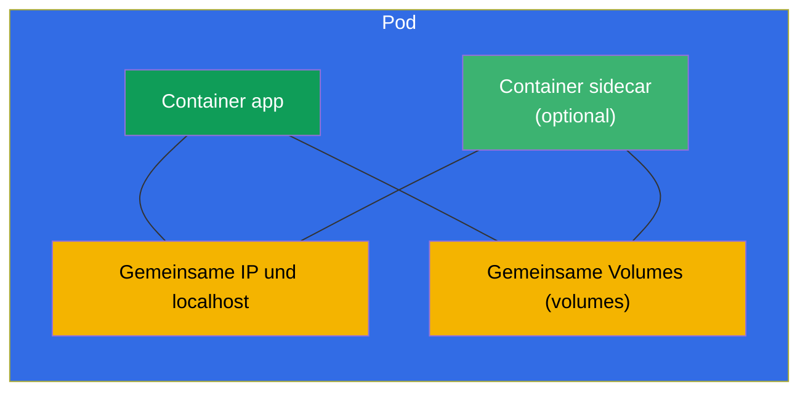
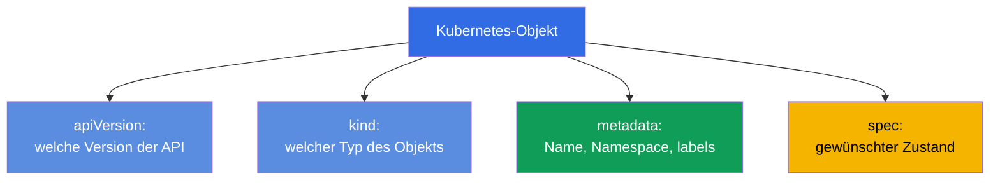
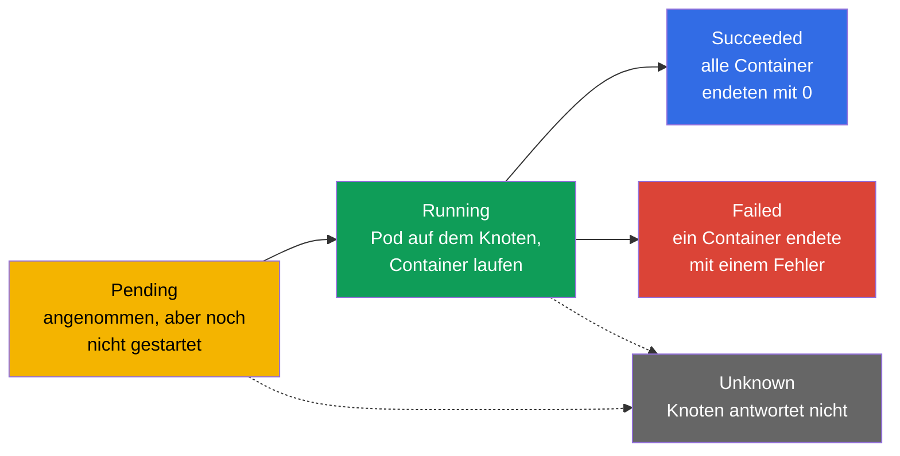
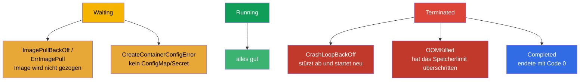
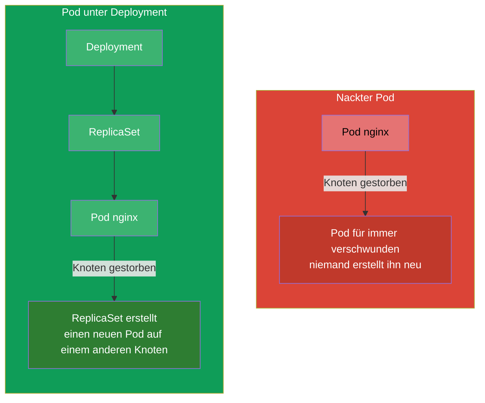

[Русская версия](ru.md) · [Eng version](README.md) · [Versión en español](es.md) · [Version française](fr.md) · [ქართული ვერსია](ge.md) · [繁體中文版](tw.md) · [日本語版](jp.md)

# Kapitel 4. Pods: Lebenszyklus, Erstellung und Konfiguration

> **Was kommt.** Der Pod ist die Basiseinheit des Starts in Kubernetes und das erste Objekt,
> das Sie in jeder Aufgabe beider Prüfungen von Hand erstellen. Alles Übrige
> (Deployment, StatefulSet, Job) erzeugt letztlich Pods. In diesem Kapitel nehmen wir
> durch, was ein Pod ist, woraus er besteht, wie er seinen Lebenszyklus durchläuft und wie
> man ihn erstellt und einrichtet. Das ist das Fundament für die Workloads (Kapitel 5-16) und
> für die Fehlersuche (Kapitel 44) - denn im Cluster muss man meistens genau Pods reparieren.

## 4.1. Was ein Pod ist und warum das kein „Container“ ist

Ein Pod ist eine **Hülle um einen oder mehrere Container**, die immer zusammen
starten, auf demselben Knoten, und die sich Netzwerk und Speicher teilen. Kubernetes
verwaltet niemals einen Container direkt - die minimale Einheit für Planung und Start
ist genau der Pod.



Was die Container innerhalb eines Pods gemeinsam haben:

- **Netzwerk.** Der Pod hat eine IP-Adresse für alle. Die Container darin sehen einander über
  `localhost` und können nicht denselben Port belegen.
- **Speicher.** Volumes werden auf Ebene des Pods deklariert und können in
  mehrere Container gleichzeitig gemountet werden - so tauschen sie Dateien aus.
- **Lebenszyklus und Knoten.** Die Container eines Pods sind immer auf demselben Knoten und werden zusammen geplant.

Was die Container **getrennt** haben: das Dateisystem (jeder sein eigenes, außer den
gemounteten gemeinsamen Volumes) und die Prozesse.

> **Woher die gemeinsame IP kommt (der pause-Container).** Die gemeinsame Netzwerkadresse des Pods wird
> den Containern der Anwendung nicht direkt „ausgegeben“ - sie hält ein verborgener Hilfscontainer **pause**
> (man nennt ihn auch Infra-Container). Wenn das kubelet einen Pod erstellt, startet es **als Erstes**
> einen winzigen pause-Container: der bekommt die IP des Pods und hält den Netzwerk-Namespace (und auch
> IPC). Die Container der Anwendung starten danach schon **innerhalb** dieser Namespaces von pause -
> deshalb haben alle eine IP, ein gemeinsames `localhost` und einen Portbereich. Wichtige Folge:
> pause tut fast nichts (es „schläft“ einfach), lebt aber die ganze Lebenszeit des Pods, deshalb
> ändert ein Neustart oder Absturz eines Anwendungscontainers **die IP des Pods nicht** - der Namespace bleibt
> bei pause.
>
> Sehen kann man das direkt auf dem Knoten über `crictl` (Werkzeug des CRI, Kapitel 2):
>
> ```bash
> crictl ps            # die Arbeitscontainer des Pods
> crictl pods          # die Pods selbst (sandbox) — das sind genau die pause-Container
> ```
>
> Jedem Pod entspricht eine pod sandbox (pause); in der Ausgabe von `crictl ps` sehen Sie die
> Container der Anwendung, und die „Sandbox“ mit dem Netzwerk hält pause hinter den Kulissen.

> **Schlüsselregel.** Üblicherweise ist in einem Pod **ein** Anwendungscontainer. Mehrere
> Container legt man nur dann in einen Pod, wenn sie wirklich untrennbar verbunden sind und
> sich Netzwerk/Volumes teilen müssen (die Muster sidecar, adapter, ambassador - Kapitel 22). Man soll
> keine unverbundenen Anwendungen in einen Pod stopfen - dafür gibt es getrennte Pods.

## 4.2. Anatomie eines Pod-Manifests

Jedes Kubernetes-Objekt in YAML hat vier oberste Felder. Am Beispiel eines Pods:

```yaml
apiVersion: v1          # Version der API (für Pod — v1)
kind: Pod               # Typ des Objekts
metadata:               # Metadaten: Name, Namespace, Labels
  name: nginx
  labels:
    app: web
spec:                   # gewünschter Zustand: was drin ist
  containers:
  - name: nginx         # Name des Containers
    image: nginx:1.27   # Image
    ports:
    - containerPort: 80 # Port, den die Anwendung abhört
```



Diese vier Felder - `apiVersion`, `kind`, `metadata`, `spec` - hat fast jedes
Objekt. Merken Sie sich diese: weiter im Kurs ändert sich nur der Inhalt von `spec`, das Gerüst
ist immer dasselbe.

## 4.3. Einen Pod erstellen: imperativ und über ein Manifest

Drei Wege, an einen Pod zu kommen - vom schnellen zum flexiblen:

```bash
# 1. Schnell — mit einem einzigen Befehl
kubectl run nginx --image=nginx

# 2. Mit Parametern
kubectl run web --image=nginx:1.27 --port=80 \
  --env="COLOR=blue" --labels="app=web,tier=front"

# 3. Über ein Manifest (Hybrid: generieren → anpassen → anwenden)
kubectl run nginx --image=nginx --dry-run=client -o yaml > pod.yaml
vim pod.yaml
kubectl apply -f pod.yaml
```

Nützliche Flags von `kubectl run`:

```bash
# Einmaliger interaktiver Pod, wird beim Verlassen gelöscht — bequem für Tests
kubectl run tmp --image=busybox -it --rm --restart=Never -- sh

# Den Befehl des Containers setzen
kubectl run busy --image=busybox --command -- sleep 3600
```

## 4.4. Lebenszyklus eines Pods: die Phasen

Ein Pod hat das Feld `status.phase` - die grobe Stufe seines Lebens. Phasen gibt es insgesamt fünf.



| Phase | Was das bedeutet |
|------|-----------|
| **Pending** | Der Pod ist vom Cluster angenommen, aber noch nicht gestartet: er wartet auf die Zuweisung eines Knotens, das Herunterladen des Images oder freie Ressourcen |
| **Running** | Der Pod ist an einen Knoten gebunden, mindestens ein Container läuft oder startet |
| **Succeeded** | Alle Container sind erfolgreich beendet (Code 0) und werden nicht neu gestartet |
| **Failed** | Alle Container sind beendet, mindestens einer - mit einem Fehler |
| **Unknown** | Der Zustand des Pods lässt sich nicht ermitteln (üblicherweise hat der Knoten die Verbindung verloren) |

Die Phase ist ein grobes Bild. Ein genaueres geben die **Zustände der Container** und die Ursachen,
die man in `kubectl describe pod` und in der Spalte STATUS von `kubectl get pods` sieht.

## 4.5. Zustände der Container und häufige STATUS

Innerhalb eines Pods hat jeder Container seinen eigenen Zustand: `Waiting`, `Running`, `Terminated`.
Wenn ein Container in `Waiting` ist oder abgestürzt ist, hat er einen **reason** - eine Ursache, die genau
in der Spalte STATUS ausgegeben wird. Diese Ursachen muss man auf Anhieb erkennen - die Hälfte der Fehlersuche in
CKA/CKAD dreht sich um sie.



| STATUS | Was das bedeutet | Wohin schauen |
|--------|-----------|---------------|
| `ContainerCreating` | Der Container wird erstellt (das Image wird gezogen, Volumes werden gemountet) | normal, wenn nur kurz; sonst `describe` |
| `ImagePullBackOff` / `ErrImagePull` | Das Image lässt sich nicht herunterladen (Tippfehler, kein Zugriff auf die Registry) | Name des Images, Secret der Registry |
| `CrashLoopBackOff` | Der Container startet und stürzt sofort ab, K8s startet ihn mit Verzögerung neu | `logs --previous`, Befehl/Konfiguration |
| `OOMKilled` | Der Container wurde wegen Überschreitung des Speicherlimits getötet | Speicherlimits (Kapitel 14) |
| `CreateContainerConfigError` | Das ConfigMap/Secret, auf das der Pod verweist, wurde nicht gefunden | Existenz von cm/secret |
| `Completed` | Der Container hat gearbeitet und endete mit Code 0 | normal für Job/einmalige Aufgaben |
| `Pending` | Der Pod kann nicht geplant werden | Ressourcen, taints, nodeSelector, PVC |

Genau deshalb ist die Kette „`kubectl get pods` → einen seltsamen STATUS gesehen → `kubectl describe`
+ `kubectl logs`“ der wichtigste Reflex der Fehlersuche. Das Troubleshooting von Pods nehmen wir vollständig
in Kapitel 44 durch.

## 4.6. restartPolicy: wann ein Container neu gestartet wird

Das Feld `spec.restartPolicy` steuert, ob die Container eines Pods nach dem
Beenden neu gestartet werden. Werte gibt es drei:

| Wert | Verhalten | Wofür |
|----------|-----------|------|
| `Always` (Standard) | immer neu starten | langlebige Dienste (Web, DB) |
| `OnFailure` | nur bei einem Fehler neu starten (Code ≠ 0) | Aufgaben, die bis zum Ende durchlaufen müssen (Job) |
| `Never` | nicht neu starten | einmalige Aufgaben, wo ein Neustart nicht nötig ist |

Wichtig: `restartPolicy` betrifft den **Neustart der Container innerhalb des Pods auf demselben Knoten**,
nicht das Neuerstellen des Pods selbst. Ein nackter Pod mit `Never`, der abgestürzt ist, bleibt auch
abgestürzt - niemand erstellt ihn neu. Um das Neuerstellen von Pods kümmern sich Controller
(ReplicaSet/Deployment - Kapitel 5), und deshalb erstellt man in der Produktion Pods fast immer nicht
direkt, sondern über sie.

## 4.7. Nackter Pod gegen einen Pod unter der Verwaltung eines Controllers

Das ist ein wichtiger Unterschied. Einen Pod kann man „nackt“ erstellen (direkt) oder unter die Verwaltung
eines Controllers stellen.



- **Einen nackten Pod** stellt niemand wieder her. Ist der Knoten gestorben, ist der Pod verloren. Solche Pods braucht man
  für einmalige Aufgaben, Fehlersuche, Experimente.
- **Ein Pod unter der Verwaltung eines Controllers** (Deployment → ReplicaSet) wird bei Ausfällen automatisch
  neu erstellt, skaliert, aktualisiert. So startet man alles in der Produktion.

In der Prüfung wird oft verlangt, nackte Pods direkt zu erstellen (schnell, `kubectl run`), aber man muss
verstehen, dass man Dienste in der Realität nicht so startet.

## 4.8. Nützliche Felder der spec eines Pods

Einige wichtige Felder, die Sie häufig in das Manifest eines Pods aufnehmen werden (jedes
ausführlich - in seinem eigenen Kapitel):

```yaml
spec:
  containers:
  - name: app
    image: nginx:1.27
    command: ["nginx"]              # den ENTRYPOINT des Images überschreiben
    args: ["-g", "daemon off;"]     # Argumente (Kapitel 17)
    env:                            # Umgebungsvariablen (Kapitel 17)
    - name: COLOR
      value: blue
    resources:                      # requests und limits (Kapitel 14)
      requests: {cpu: "100m", memory: "64Mi"}
      limits: {cpu: "250m", memory: "128Mi"}
    ports:
    - containerPort: 80
  nodeSelector:                     # auf welche Knoten zu platzieren ist (Kapitel 12)
    disktype: ssd
  restartPolicy: Always
```

Man muss sich nicht alles auf einmal merken - wichtig ist zu verstehen, dass die gesamte Funktionalität (Probes, Volumes,
Ressourcen, Planung) über Felder innerhalb der `spec` des Pods hinzukommt, und dass man sie über
`kubectl explain pod.spec...` finden kann.

## 4.9. Fehlersuche und Zugriff auf einen Pod

Der Basissatz für die Arbeit mit einem schon laufenden Pod:

```bash
kubectl get pod nginx -o wide           # wo er läuft, welche IP
kubectl describe pod nginx              # Events, Zustände der Container
kubectl logs nginx                      # Logs
kubectl logs nginx --previous           # Logs des vorherigen (abgestürzten) Containers
kubectl exec -it nginx -- sh            # nach innen gehen
kubectl port-forward pod/nginx 8080:80  # den Port auf die lokale Maschine weiterleiten
```

Gesondert erwähnen sollte man die **ephemeral-Container** und `kubectl debug` - eine Möglichkeit, einen
temporären Debug-Container an einen bereits arbeitenden Pod anzuhängen, ohne ihn neu zu erstellen. Besonders
nützlich, wenn das Image der Anwendung minimal ist (nicht einmal `sh` vorhanden). Ausführlich - in Kapitel 29.

## 4.10. Wie man das in der Produktion anwendet

- **Nackte Pods verwendet man in der Produktion fast nicht.** Alles, was lange leben und Ausfälle
  überstehen soll, startet man über Controller (Deployment, StatefulSet, DaemonSet). Ein nackter Pod -
  das ist Fehlersuche, eine einmalige Aufgabe oder ein Lehrbeispiel. Wenn Sie einen nackten Pod in der Produktion sehen -
  das ist fast immer ein Fehler oder eine zeitweilige „Krücke“.
- **Ein Anwendungscontainer pro Pod ist die Norm.** Multi-Container-Pods verwendet man
  bewusst und für konkrete Muster (sidecar für Logs/Proxy, init für die Vorbereitung).
  Einen Pod mit mehreren Anwendungen aufzublähen ist ein Antimuster.
- **Der STATUS der Pods ist die Grundlage des Monitorings.** Alerts in der Produktion hängen oft genau an den
  Zuständen der Pods: massenhaftes `CrashLoopBackOff`, `ImagePullBackOff` nach einem Release,
  `OOMKilled` bei falschen Limits - das sind die ersten Signale eines Vorfalls.
- **Minimale Images.** In der Produktion strebt man kleine Images an (distroless, alpine,
  scratch) - weniger Angriffsfläche und Gewicht. Die Kehrseite: darin gibt es kein `sh`, deshalb
  betreibt man die Fehlersuche über `kubectl debug` mit ephemeral-Containern.

## 4.11. Mini-Glossar

- **Pod** - minimale Einheit des Starts: Hülle um einen/mehrere
  Container mit gemeinsamem Netzwerk und gemeinsamen Volumes.
- **Anwendungscontainer** - der Hauptcontainer des Pods mit der Nutzlast.
- **Sidecar** - Hilfscontainer im selben Pod (Kapitel 22).
- **Phase (phase)** - grobe Stufe des Lebens eines Pods: Pending, Running, Succeeded, Failed,
  Unknown.
- **restartPolicy** - Politik des Neustarts der Container: Always, OnFailure, Never.
- **Nackter Pod (bare pod)** - ein Pod, der direkt erstellt wurde, ohne Controller; wird nicht
  wiederhergestellt.
- **CrashLoopBackOff** - der Container stürzt zyklisch ab und startet neu.
- **OOMKilled** - der Container wurde wegen Überschreitung des Speicherlimits getötet.
- **ephemeral-Container** - temporärer Container für die Fehlersuche an einem lebenden Pod (`kubectl
  debug`).

## 4.12. Zusammenfassung des Kapitels

- Ein Pod ist die minimale Einheit des Starts: ein oder mehrere Container mit gemeinsamer IP,
  gemeinsamem `localhost` und gemeinsamen Volumes, immer auf demselben Knoten.
- Üblicherweise ist in einem Pod ein Anwendungscontainer; mehrere - nur für verbundene Muster.
- Das Manifest jedes Objekts = `apiVersion` + `kind` + `metadata` + `spec`; es ändert sich im
  Wesentlichen `spec`.
- Einen Pod kann man imperativ erstellen (`kubectl run`), aber für komplexe - das YAML generieren und
  nachbessern.
- Phasen eines Pods: Pending → Running → Succeeded/Failed (+ Unknown). Die genaue Ursache geben die
  Zustände der Container und der STATUS.
- Häufige STATUS: ImagePullBackOff, CrashLoopBackOff, OOMKilled, CreateContainerConfigError,
  Pending - die muss man auswendig kennen.
- `restartPolicy` (Always/OnFailure/Never) steuert den Neustart der Container, aber nicht das
  Neuerstellen des Pods - damit befassen sich die Controller.
- Ein nackter Pod wird bei Ausfällen nicht wiederhergestellt; in der Produktion startet man Pods über Controller.

## 4.13. Wozu das nützt: in der Prüfung und in der echten Arbeit

**In der Prüfung.** Einen Pod zu erstellen ist die häufigste elementare Operation beider Prüfungen
(`kubectl run ... $do > pod.yaml`). Das Erkennen des STATUS (Pending, CrashLoopBackOff,
ImagePullBackOff) ist der Kern der Domäne Troubleshooting von CKA (30%) und des Abschnitts Observability von CKAD.
Das Wissen um die Phasen, `restartPolicy` und die Kette describe/logs löst eine ganze Klasse von Aufgaben „warum arbeitet der Pod
nicht“.

**In der echten Arbeit.** Der Pod ist das Atom, aus dem alles im Cluster zusammengesetzt ist, und sein STATUS ist der
erste Indikator für die Gesundheit der Anwendung. Der Bereitschaftsingenieur versteht am Zustand der Pods augenblicklich,
was nach einem Release passiert ist. Das Verständnis von „nackter Pod gegen Controller“
erklärt, warum man in der Produktion nichts mit nackten Pods startet und warum die Anwendung selbst
nach dem Ausfall eines Knotens „wieder aufersteht“.

## 4.14. Fragen zur Selbstprüfung

1. Wodurch unterscheidet sich ein Pod von einem Container? Was teilen die Container innerhalb eines Pods, und was - nicht?
2. Wann ist es berechtigt, mehrere Container in einen Pod zu legen, und wann nicht?
3. Nennen Sie die vier obligatorischen obersten Felder eines Manifests. Welches von ihnen beschreibt,
   „was drin ist“?
4. Zählen Sie die Phasen eines Pods auf. Wodurch unterscheidet sich die Phase vom STATUS in `kubectl get pods`?
5. Was bedeuten ImagePullBackOff, CrashLoopBackOff und OOMKilled, und wohin schaut man bei
   jedem?
6. Wie verhält sich ein Pod mit `restartPolicy: Never`, wenn der Container abgestürzt ist? Und wenn das ein
   nackter Pod war und der Knoten gestorben ist?
7. Warum startet man in der Produktion keine nackten Pods?

## Praxis

Als Nächstes lernen wir, Pods nicht einzeln zu erstellen, sondern eine Menge von ihnen über
ReplicaSet und Deployment zu verwalten (Kapitel 5). Das Erstellen von Pods, die Analyse ihrer Phasen und ihres STATUS üben Sie
im ersten zusammengefassten Lab gemeinsam mit den Deployments und den Namespaces.

🧪 Lab 101 (Pods und ihre Konfiguration): [tasks/cka/labs/101](../../labs/101/README_DE.MD)

---
[Inhalt](../README_DE.md) · [Kapitel 3](../03/de.md) · [Kapitel 5](../05/de.md)
