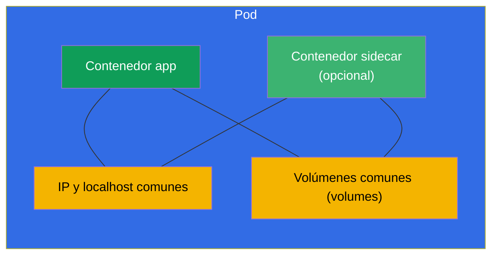
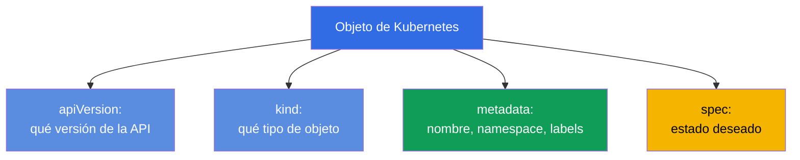
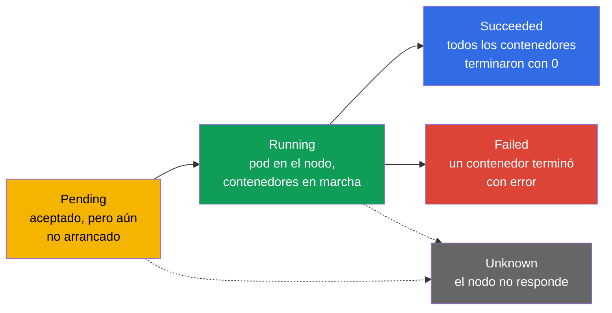
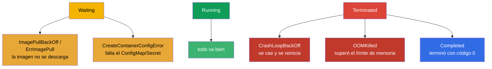
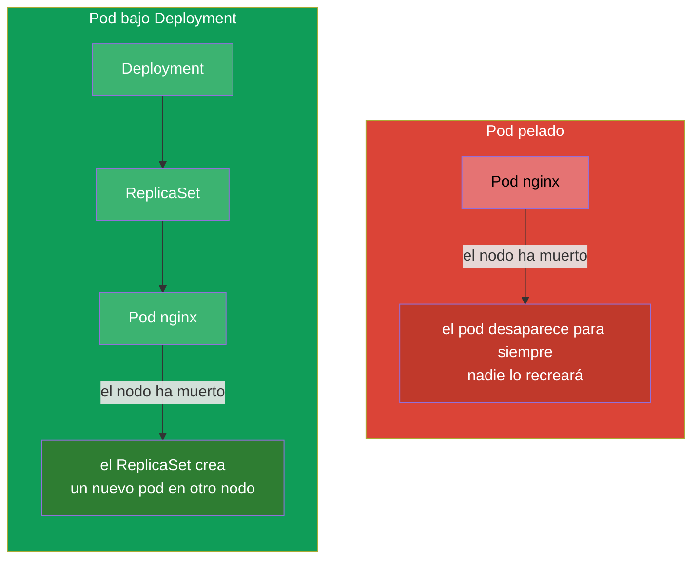

[Русская версия](ru.md) · [Eng version](README.md) · [Version française](fr.md) · [Deutsche Version](de.md) · [ქართული ვერსია](ge.md) · [繁體中文版](tw.md) · [日本語版](jp.md)

# Capítulo 4. Pods: ciclo de vida, creación y configuración

> **Qué viene ahora.** El pod (Pod) es la unidad básica de ejecución en Kubernetes y el
> primer objeto que creas a mano en cada tarea de ambos exámenes. Todo lo demás
> (Deployment, StatefulSet, Job) acaba, en última instancia, generando pods. En este
> capítulo veremos qué es un pod, de qué partes consta, cómo transcurre su ciclo de vida y
> cómo crearlo y configurarlo. Es el cimiento de las cargas de trabajo (capítulos 5-16) y
> de la depuración (capítulo 44) - porque lo que toca arreglar en el clúster son, casi
> siempre, los pods.

## 4.1. Qué es un pod y por qué no es un «contenedor»

Un pod es una **envoltura alrededor de uno o varios contenedores** que siempre se ejecutan
juntos, en el mismo nodo, y comparten entre sí la red y el almacenamiento. Kubernetes
nunca gestiona un contenedor directamente - la unidad mínima de planificación y ejecución
es precisamente el pod.



Qué tienen en común los contenedores de un mismo pod:

- **Red.** El pod tiene una única dirección IP para todos. Los contenedores de dentro se
  ven entre sí por `localhost` y no pueden ocupar el mismo puerto.
- **Almacenamiento.** Los volúmenes (volumes) se declaran a nivel de pod y pueden montarse
  en varios contenedores a la vez - así intercambian archivos.
- **Ciclo de vida y nodo.** Los contenedores del pod están siempre en el mismo nodo y se
  planifican juntos.

Qué tienen **separado** los contenedores: el sistema de archivos (cada uno el suyo, salvo
los volúmenes comunes montados) y los procesos.

> **De dónde sale la IP común (contenedor pause).** La dirección de red común del pod no se
> «entrega» directamente a los contenedores de la aplicación - la mantiene un contenedor de
> servicio oculto llamado **pause** (también se le llama contenedor infra). Cuando el kubelet
> crea el pod, lo **primero** que arranca es un pause diminuto: este recibe la IP del pod y
> retiene el namespace de red (y también el de IPC). Los contenedores de la aplicación
> arrancan después ya **dentro** de esos namespaces de pause - por eso todos tienen una sola
> IP, un `localhost` común y un único rango de puertos. Consecuencia importante: pause
> prácticamente no hace nada (solo «duerme»), pero vive todo el tiempo de vida del pod, así
> que el reinicio o la caída de un contenedor de la aplicación **no cambia la IP del pod** -
> el namespace sigue en manos de pause.
>
> Esto se puede ver directamente en el nodo con `crictl` (utilidad de CRI, capítulo 2):
>
> ```bash
> crictl ps            # contenedores de trabajo del pod
> crictl pods          # los pods en sí (sandbox) - esos son los contenedores pause
> ```
>
> A cada pod le corresponde un pod sandbox (pause); en la salida de `crictl ps` ves los
> contenedores de la aplicación, mientras que la «caja de arena» con la red la mantiene
> pause fuera de plano.

> **Regla clave.** Normalmente en un pod hay **un** contenedor de aplicación. Se ponen
> varios contenedores en un pod solo cuando están realmente ligados de forma inseparable y
> deben compartir red/volúmenes (patrones sidecar, adapter, ambassador - capítulo 22). No
> hay que meter aplicaciones sin relación en el mismo pod - para eso están los pods
> separados.

## 4.2. Anatomía del manifiesto de un pod

Cualquier objeto de Kubernetes en YAML tiene cuatro campos de nivel superior. En el ejemplo
de un pod:

```yaml
apiVersion: v1          # versión de la API (para Pod — v1)
kind: Pod               # tipo de objeto
metadata:               # metadatos: nombre, namespace, etiquetas
  name: nginx
  labels:
    app: web
spec:                   # estado deseado: qué hay dentro
  containers:
  - name: nginx         # nombre del contenedor
    image: nginx:1.27   # imagen
    ports:
    - containerPort: 80 # puerto que escucha la aplicación
```



Esos cuatro campos - `apiVersion`, `kind`, `metadata`, `spec` - los tiene casi cualquier
objeto. Memorízalos: en el resto del curso solo cambia el contenido de `spec`, mientras que
el esqueleto es siempre el mismo.

## 4.3. Crear un pod: de forma imperativa y mediante manifiesto

Tres maneras de obtener un pod - de la más rápida a la más flexible:

```bash
# 1. Rápido — con un solo comando
kubectl run nginx --image=nginx

# 2. Con parámetros
kubectl run web --image=nginx:1.27 --port=80 \
  --env="COLOR=blue" --labels="app=web,tier=front"

# 3. Mediante manifiesto (híbrido: generar → retocar → aplicar)
kubectl run nginx --image=nginx --dry-run=client -o yaml > pod.yaml
vim pod.yaml
kubectl apply -f pod.yaml
```

Flags útiles de `kubectl run`:

```bash
# Pod interactivo de un solo uso, se borra al salir — cómodo para pruebas
kubectl run tmp --image=busybox -it --rm --restart=Never -- sh

# Definir el comando del contenedor
kubectl run busy --image=busybox --command -- sleep 3600
```

## 4.4. Ciclo de vida del pod: fases

El pod tiene el campo `status.phase` - la etapa general de su vida. En total hay cinco
fases.



| Fase | Qué significa |
|------|-----------|
| **Pending** | El pod ha sido aceptado por el clúster, pero aún no se ha arrancado: espera la asignación de nodo, la descarga de la imagen o recursos libres |
| **Running** | El pod está vinculado a un nodo, al menos un contenedor está en marcha o arrancando |
| **Succeeded** | Todos los contenedores terminaron con éxito (código 0) y no se reiniciarán |
| **Failed** | Todos los contenedores han terminado, al menos uno - con error |
| **Unknown** | No se consigue obtener el estado del pod (normalmente el nodo ha perdido la conexión) |

La fase es una imagen aproximada. Una más precisa la dan los **estados de los contenedores**
y las razones, que se ven en `kubectl describe pod` y en la columna STATUS de
`kubectl get pods`.

## 4.5. Estados de los contenedores y STATUS frecuentes

Dentro del pod, cada contenedor tiene su propio estado: `Waiting`, `Running`, `Terminated`.
Cuando un contenedor está en `Waiting` o se ha caído, tiene un **reason** - la razón, que es
justo lo que se muestra en la columna STATUS. Estas razones hay que reconocerlas al vuelo -
la mitad de la depuración en CKA/CKAD va de ellas.



| STATUS | Qué significa | Dónde mirar |
|--------|-----------|---------------|
| `ContainerCreating` | El contenedor se está creando (se descarga la imagen, se montan los volúmenes) | normal si es breve; si no, `describe` |
| `ImagePullBackOff` / `ErrImagePull` | No se consigue descargar la imagen (errata, sin acceso al registro) | nombre de la imagen, secret del registro |
| `CrashLoopBackOff` | El contenedor arranca y se cae al instante, K8s lo reinicia con retardo | `logs --previous`, comando/configuración |
| `OOMKilled` | El contenedor ha sido matado por superar el límite de memoria | límites de memoria (capítulo 14) |
| `CreateContainerConfigError` | No se encuentra el ConfigMap/Secret al que el pod hace referencia | existencia del cm/secret |
| `Completed` | El contenedor hizo su trabajo y terminó con código 0 | normal para Job/tareas de un solo uso |
| `Pending` | El pod no se puede planificar | recursos, taints, nodeSelector, PVC |

Precisamente por eso la secuencia «`kubectl get pods` → veo un STATUS raro →
`kubectl describe` + `kubectl logs`» es el reflejo principal de la depuración. El
troubleshooting de pods a fondo lo veremos en el capítulo 44.

## 4.6. restartPolicy: cuándo se reinicia un contenedor

El campo `spec.restartPolicy` controla si hay que reiniciar los contenedores del pod después
de que terminen. Hay tres valores:

| Valor | Comportamiento | Para qué |
|----------|-----------|----------|
| `Always` (por defecto) | reiniciar siempre | servicios de larga vida (web, BD) |
| `OnFailure` | reiniciar solo si hay error (código ≠ 0) | tareas que deben llegar hasta el final (Job) |
| `Never` | no reiniciar | tareas de un solo uso, donde el reinicio no hace falta |

Importante: `restartPolicy` afecta al **reinicio de los contenedores dentro del pod en el
mismo nodo**, no a la recreación del pod en sí. Un Pod pelado con `Never` que se ha caído se
quedará caído - nadie lo va a recrear. De recrear los pods se encargan los controladores
(ReplicaSet/Deployment - capítulo 5), y por eso en producción los pods casi siempre no se
crean directamente, sino a través de ellos.

## 4.7. Pod pelado frente a pod gestionado por un controlador

Es una distinción importante. Un pod se puede crear «pelado» (directamente) o dejarlo bajo
la gestión de un controlador.



- **Un pod pelado** no lo restaura nadie. Si muere el nodo, el pod se pierde. Estos pods
  sirven para tareas de un solo uso, depuración, experimentos.
- **Un pod gestionado por un controlador** (Deployment → ReplicaSet) se recrea
  automáticamente ante fallos, se escala, se actualiza. Así se ejecuta todo en producción.

En el examen a menudo piden crear pods pelados directamente (rápido, `kubectl run`), pero hay
que entender que en la realidad los servicios no se ejecutan así.

## 4.8. Campos útiles del spec del pod

Unos cuantos campos importantes que añadirás con frecuencia al manifiesto del pod (cada uno
en detalle - en su propio capítulo):

```yaml
spec:
  containers:
  - name: app
    image: nginx:1.27
    command: ["nginx"]              # sobrescribir el ENTRYPOINT de la imagen
    args: ["-g", "daemon off;"]     # argumentos (capítulo 17)
    env:                            # variables de entorno (capítulo 17)
    - name: COLOR
      value: blue
    resources:                      # requests y limits (capítulo 14)
      requests: {cpu: "100m", memory: "64Mi"}
      limits: {cpu: "250m", memory: "128Mi"}
    ports:
    - containerPort: 80
  nodeSelector:                     # en qué nodos colocarlo (capítulo 12)
    disktype: ssd
  restartPolicy: Always
```

No hace falta memorizarlo todo de golpe - lo importante es entender que toda la funcionalidad
(sondas, volúmenes, recursos, planificación) se añade con campos dentro del `spec` del pod, y
que se pueden encontrar con `kubectl explain pod.spec...`.

## 4.9. Depuración y acceso al pod

El conjunto básico para trabajar con un pod ya en marcha:

```bash
kubectl get pod nginx -o wide           # dónde está ejecutándose, qué IP tiene
kubectl describe pod nginx              # eventos, estados de los contenedores
kubectl logs nginx                      # logs
kubectl logs nginx --previous           # logs del contenedor anterior (el que se cayó)
kubectl exec -it nginx -- sh            # entrar dentro
kubectl port-forward pod/nginx 8080:80  # redirigir el puerto a la máquina local
```

Aparte, merece la pena mencionar los **contenedores ephemeral** y `kubectl debug` - una forma
de conectar un contenedor de depuración temporal a un pod que ya está funcionando, sin
recrearlo. Es especialmente útil cuando la imagen de la aplicación es mínima (no hay ni
`sh`). En detalle - en el capítulo 29.

## 4.10. Cómo se aplica esto en producción

- **Los pods pelados casi no se usan en producción.** Todo lo que debe vivir mucho tiempo y
  sobrevivir a los fallos se ejecuta mediante controladores (Deployment, StatefulSet,
  DaemonSet). Un Pod pelado es depuración, una tarea de un solo uso o un ejemplo didáctico. Si
  ves un pod pelado en producción, casi siempre es un error o un «parche» temporal.
- **Un contenedor de aplicación por pod es la norma.** Los pods multi-contenedor se usan de
  forma consciente y para patrones concretos (sidecar para logs/proxy, init para la
  preparación). Inflar el pod con varias aplicaciones es un antipatrón.
- **El STATUS de los pods es la base de la monitorización.** Las alertas en producción suelen
  estar atadas justamente a los estados de los pods: un `CrashLoopBackOff` masivo, un
  `ImagePullBackOff` tras una release, un `OOMKilled` con límites erróneos - son las primeras
  señales de un incidente.
- **Imágenes mínimas.** En producción se busca tener imágenes pequeñas (distroless, alpine,
  scratch) - menos superficie de ataque y menos peso. La cara B: dentro no hay `sh`, así que la
  depuración se hace con `kubectl debug` y contenedores ephemeral.

## 4.11. Miniglosario

- **Pod (pod)** - unidad mínima de ejecución: envoltura alrededor de uno/varios contenedores
  con red y volúmenes comunes.
- **Contenedor de aplicación** - el contenedor principal del pod, el que lleva la carga útil.
- **Sidecar** - contenedor auxiliar en el mismo pod (capítulo 22).
- **Fase (phase)** - etapa general de la vida del pod: Pending, Running, Succeeded, Failed,
  Unknown.
- **restartPolicy** - política de reinicio de los contenedores: Always, OnFailure, Never.
- **Pod pelado (bare pod)** - pod creado directamente, sin controlador; no se restaura.
- **CrashLoopBackOff** - el contenedor se cae y se reinicia en ciclo.
- **OOMKilled** - el contenedor ha sido matado por superar el límite de memoria.
- **contenedor ephemeral** - contenedor temporal para depurar un pod vivo (`kubectl
  debug`).

## 4.12. Resumen del capítulo

- El pod es la unidad mínima de ejecución: uno o varios contenedores con IP, `localhost` y
  volúmenes comunes, siempre en el mismo nodo.
- Normalmente en un pod hay un contenedor de aplicación; varios - solo para patrones
  relacionados.
- El manifiesto de cualquier objeto = `apiVersion` + `kind` + `metadata` + `spec`; lo que
  cambia es sobre todo `spec`.
- Un pod se puede crear de forma imperativa (`kubectl run`), pero para los complejos - generar
  el YAML y retocarlo.
- Fases del pod: Pending → Running → Succeeded/Failed (+ Unknown). La causa exacta la dan los
  estados de los contenedores y el STATUS.
- STATUS frecuentes: ImagePullBackOff, CrashLoopBackOff, OOMKilled, CreateContainerConfigError,
  Pending - hay que sabérselos de memoria.
- `restartPolicy` (Always/OnFailure/Never) controla el reinicio de los contenedores, pero no la
  recreación del pod - de eso se encargan los controladores.
- Un pod pelado no se restaura ante fallos; en producción los pods se ejecutan mediante
  controladores.

## 4.13. Para qué sirve: en el examen y en el trabajo real

**En el examen.** Crear un pod es la operación elemental más frecuente de ambos exámenes
(`kubectl run ... $do > pod.yaml`). Reconocer los STATUS (Pending, CrashLoopBackOff,
ImagePullBackOff) es el núcleo del dominio de troubleshooting de CKA (30%) y de la sección de
Observability de CKAD. Conocer las fases, `restartPolicy` y la combinación describe/logs
resuelve toda una clase de tareas del tipo «por qué el pod no funciona».

**En el trabajo real.** El pod es el átomo con el que está construido todo en el clúster, y su
STATUS es el primer indicador de la salud de la aplicación. El ingeniero de guardia entiende al
instante, por el estado de los pods, qué ha pasado tras una release. Comprender el «pod pelado
frente a controlador» explica por qué en producción nada se ejecuta con pods pelados y por qué
la aplicación «resucita» sola tras la caída de un nodo.

## 4.14. Preguntas de autoevaluación

1. ¿En qué se diferencia un pod de un contenedor? ¿Qué comparten los contenedores dentro del
   pod y qué no?
2. ¿Cuándo está justificado poner varios contenedores en un pod y cuándo no?
3. Nombra los cuatro campos de nivel superior obligatorios del manifiesto. ¿Cuál de ellos
   describe «qué hay dentro»?
4. Enumera las fases del pod. ¿En qué se diferencia la fase del STATUS de `kubectl get pods`?
5. ¿Qué significan ImagePullBackOff, CrashLoopBackOff y OOMKilled y dónde hay que mirar en cada
   caso?
6. ¿Cómo se comporta un pod con `restartPolicy: Never` si el contenedor se ha caído? ¿Y si era
   un pod pelado y ha muerto el nodo?
7. ¿Por qué en producción no se ejecutan pods pelados?

## Práctica

A continuación aprenderemos a no crear pods de uno en uno, sino a gestionar conjuntos de ellos
mediante ReplicaSet y Deployment (capítulo 5). La creación de pods y el análisis de sus fases y
STATUS los practicarás en la primera práctica de laboratorio unificada junto con los
deployments y los namespace.

🧪 Práctica 101 (pods y su configuración): [tasks/cka/labs/101](../../labs/101/README_ES.MD)

---
[Índice](../README_ES.md) · [Capítulo 3](../03/es.md) · [Capítulo 5](../05/es.md)
