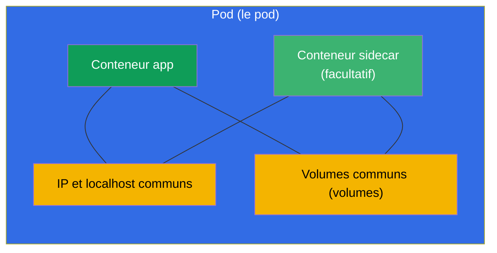
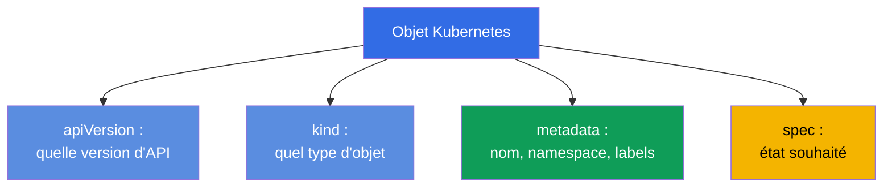
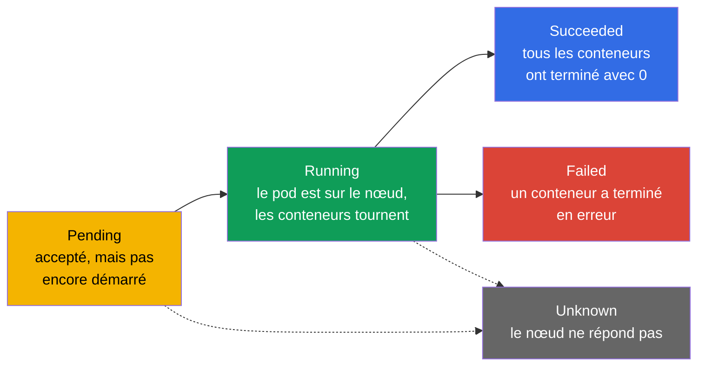
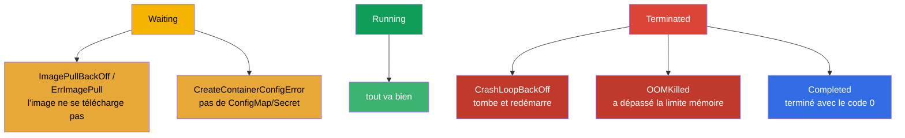
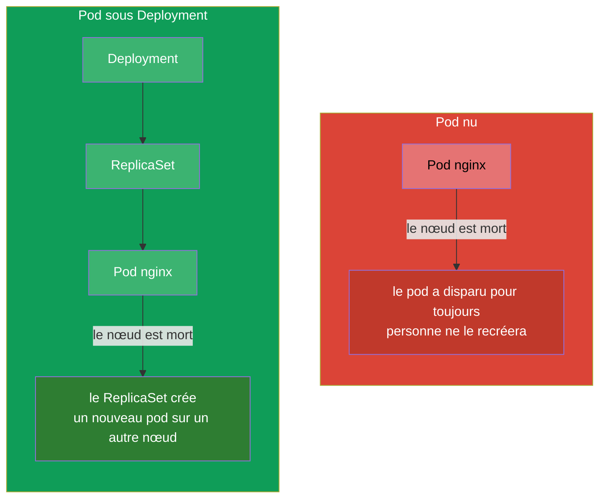

[Русская версия](ru.md) · [Eng version](README.md) · [Versión en español](es.md) · [Deutsche Version](de.md) · [ქართული ვერსია](ge.md)

# Chapitre 4. Les pods : cycle de vie, création et configuration

> **Ce qui suit.** Le pod (Pod) est l'unité de lancement de base dans Kubernetes et le
> premier objet que vous créez à la main dans chaque tâche des deux examens. Tout le reste
> (Deployment, StatefulSet, Job) finit par engendrer des pods. Dans ce chapitre nous verrons
> ce qu'est un pod, de quoi il est constitué, comment il traverse son cycle de vie et comment
> le créer et le configurer. C'est le fondement des charges de travail (chapitres 5-16) et du
> débogage (chapitre 44) - parce que ce qu'il faut réparer dans le cluster, c'est le plus
> souvent justement les pods.

## 4.1. Ce qu'est un pod et pourquoi ce n'est pas un « conteneur »

Un pod est une **enveloppe autour d'un ou de plusieurs conteneurs** qui démarrent toujours
ensemble, sur le même nœud, et qui partagent entre eux le réseau et le stockage. Kubernetes
ne pilote jamais un conteneur directement - l'unité minimale de planification et de lancement,
c'est précisément le pod.



Ce que les conteneurs d'un même pod ont en commun :

- **Le réseau.** Le pod a une seule adresse IP pour tous. Les conteneurs à l'intérieur se
  voient via `localhost` et ne peuvent pas occuper un même port.
- **Le stockage.** Les volumes (volumes) sont déclarés au niveau du pod et peuvent être
  montés dans plusieurs conteneurs à la fois - c'est ainsi qu'ils échangent des fichiers.
- **Le cycle de vie et le nœud.** Les conteneurs d'un pod sont toujours sur le même nœud et
  sont planifiés ensemble.

Ce que les conteneurs ont de **séparé** : le système de fichiers (chacun le sien, hormis les
volumes communs montés) et les processus.

> **D'où vient l'IP commune (le conteneur pause).** L'adresse réseau commune du pod n'est pas
> « remise » directement aux conteneurs de l'application - elle est détenue par un conteneur
> de service caché, **pause** (on l'appelle aussi conteneur infra). Quand le kubelet crée le
> pod, il lance **en premier** un minuscule conteneur pause : celui-ci reçoit l'IP du pod et
> retient le namespace réseau (ainsi que l'IPC). Les conteneurs de l'application démarrent
> ensuite déjà **à l'intérieur** de ces namespaces de pause - c'est pourquoi tous ont une même
> IP, un `localhost` commun et une seule plage de ports. Conséquence importante : pause ne
> fait presque rien (il « dort » simplement), mais il vit toute la durée de vie du pod, donc
> le redémarrage ou la chute d'un conteneur de l'application **ne change pas l'IP du pod** -
> le namespace reste chez pause.
>
> On peut le voir directement sur le nœud via `crictl` (l'utilitaire CRI, chapitre 2) :
>
> ```bash
> crictl ps            # conteneurs de travail du pod
> crictl pods          # les pods eux-mêmes (sandbox) - ce sont justement les conteneurs pause
> ```
>
> À chaque pod correspond un pod sandbox (pause) ; dans la sortie de `crictl ps` vous voyez
> les conteneurs de l'application, et le « bac à sable » avec le réseau est tenu par pause en
> coulisses.

> **Règle clé.** D'ordinaire il y a **un** conteneur d'application dans le pod. On ne met
> plusieurs conteneurs dans un pod que lorsqu'ils sont réellement inséparables et doivent
> partager le réseau/les volumes (patterns sidecar, adapter, ambassador - chapitre 22). Il ne
> faut pas entasser des applications non liées dans un même pod - pour cela il y a des pods
> distincts.

## 4.2. Anatomie d'un manifeste de pod

Tout objet Kubernetes en YAML possède quatre champs de premier niveau. Sur l'exemple d'un
pod :

```yaml
apiVersion: v1          # version de l'API (pour Pod - v1)
kind: Pod               # type d'objet
metadata:               # métadonnées : nom, namespace, labels
  name: nginx
  labels:
    app: web
spec:                   # état souhaité : ce qu'il y a dedans
  containers:
  - name: nginx         # nom du conteneur
    image: nginx:1.27   # image
    ports:
    - containerPort: 80 # port que l'application écoute
```



Ces quatre champs - `apiVersion`, `kind`, `metadata`, `spec` - sont présents chez presque
chaque objet. Retenez-les : plus loin dans le cours, seul le contenu de `spec` change, alors
que la charpente est toujours la même.

## 4.3. Créer un pod : de façon impérative et via un manifeste

Trois façons d'obtenir un pod - de la plus rapide à la plus souple :

```bash
# 1. Vite - en une seule commande
kubectl run nginx --image=nginx

# 2. Avec des paramètres
kubectl run web --image=nginx:1.27 --port=80 \
  --env="COLOR=blue" --labels="app=web,tier=front"

# 3. Via un manifeste (hybride : générer -> corriger -> appliquer)
kubectl run nginx --image=nginx --dry-run=client -o yaml > pod.yaml
vim pod.yaml
kubectl apply -f pod.yaml
```

Flags utiles de `kubectl run` :

```bash
# Pod interactif jetable, supprimé à la sortie - pratique pour les tests
kubectl run tmp --image=busybox -it --rm --restart=Never -- sh

# Définir la commande du conteneur
kubectl run busy --image=busybox --command -- sleep 3600
```

## 4.4. Cycle de vie du pod : les phases

Le pod a un champ `status.phase` - la grande étape de sa vie. Il n'y a que cinq phases.



| Phase | Ce que cela signifie |
|------|-----------|
| **Pending** | Le pod est accepté par le cluster, mais pas encore démarré : il attend l'affectation d'un nœud, le téléchargement de l'image ou des ressources libres |
| **Running** | Le pod est rattaché à un nœud, au moins un conteneur tourne ou démarre |
| **Succeeded** | Tous les conteneurs ont terminé avec succès (code 0) et ne seront pas redémarrés |
| **Failed** | Tous les conteneurs ont terminé, au moins un - en erreur |
| **Unknown** | L'état du pod ne peut pas être obtenu (d'ordinaire le nœud a perdu la liaison) |

La phase, c'est une image grossière. Une image plus précise est donnée par les **états des
conteneurs** et les raisons que l'on voit dans `kubectl describe pod` et dans la colonne
STATUS de `kubectl get pods`.

## 4.5. États des conteneurs et STATUS fréquents

À l'intérieur du pod, chaque conteneur a son propre état : `Waiting`, `Running`,
`Terminated`. Quand un conteneur est en `Waiting` ou qu'il est tombé, il a une **reason** -
une raison, qui est justement affichée dans la colonne STATUS. Ces raisons, il faut les
reconnaître au vol - la moitié du débogage au CKA/CKAD tourne autour d'elles.



| STATUS | Ce que cela signifie | Où regarder |
|--------|-----------|---------------|
| `ContainerCreating` | Le conteneur est en cours de création (l'image est téléchargée, les volumes montés) | normal si c'est bref ; sinon `describe` |
| `ImagePullBackOff` / `ErrImagePull` | Impossible de télécharger l'image (faute de frappe, pas d'accès au registre) | nom de l'image, secret du registre |
| `CrashLoopBackOff` | Le conteneur démarre et tombe aussitôt, K8s redémarre avec un délai | `logs --previous`, commande/config |
| `OOMKilled` | Le conteneur est tué pour dépassement de la limite mémoire | limites mémoire (chapitre 14) |
| `CreateContainerConfigError` | Le ConfigMap/Secret référencé par le pod est introuvable | existence du cm/secret |
| `Completed` | Le conteneur a fait son travail et terminé avec le code 0 | normal pour un Job/des tâches ponctuelles |
| `Pending` | Le pod ne peut pas être planifié | ressources, taints, nodeSelector, PVC |

C'est bien pour cela que l'enchaînement « `kubectl get pods` -> j'ai vu un STATUS étrange ->
`kubectl describe` + `kubectl logs` » est le réflexe principal du débogage. Le troubleshooting
des pods sera vu à fond au chapitre 44.

## 4.6. restartPolicy : quand un conteneur redémarre

Le champ `spec.restartPolicy` gouverne le fait de redémarrer ou non les conteneurs du pod
après leur fin. Il y a trois valeurs :

| Valeur | Comportement | Pour quoi |
|----------|-----------|----------|
| `Always` (par défaut) | toujours redémarrer | services de longue durée (web, BD) |
| `OnFailure` | redémarrer seulement en cas d'erreur (code ≠ 0) | tâches qui doivent aller jusqu'au bout (Job) |
| `Never` | ne pas redémarrer | tâches ponctuelles où le redémarrage est inutile |

Important : `restartPolicy` concerne le **redémarrage des conteneurs à l'intérieur du pod sur
le même nœud**, et non la recréation du pod lui-même. Un Pod nu avec `Never` qui est tombé
restera ainsi tombé - personne ne le recréera. Ce sont les contrôleurs qui s'occupent de
recréer les pods (ReplicaSet/Deployment - chapitre 5), et c'est pourquoi en prod on ne crée
presque jamais les pods directement, mais à travers eux.

## 4.7. Pod nu contre pod sous la gouverne d'un contrôleur

C'est une distinction importante. On peut créer un pod « nu » (directement) ou le confier à un
contrôleur.



- **Un pod nu**, personne ne le restaure. Le nœud est mort - le pod est perdu. De tels pods
  servent aux tâches ponctuelles, au débogage, aux expériences.
- **Un pod sous la gouverne d'un contrôleur** (Deployment -> ReplicaSet) est recréé
  automatiquement en cas de panne, mis à l'échelle, mis à jour. C'est ainsi qu'on lance tout
  en prod.

À l'examen, on demande souvent de créer des pods nus directement (rapide, `kubectl run`), mais
il faut comprendre qu'en réalité on ne lance pas les services de cette façon.

## 4.8. Champs utiles de spec du pod

Quelques champs importants que vous ajouterez souvent au manifeste d'un pod (chacun en
détail - dans son propre chapitre) :

```yaml
spec:
  containers:
  - name: app
    image: nginx:1.27
    command: ["nginx"]              # redéfinir l'ENTRYPOINT de l'image
    args: ["-g", "daemon off;"]     # arguments (chapitre 17)
    env:                            # variables d'environnement (chapitre 17)
    - name: COLOR
      value: blue
    resources:                      # requests et limits (chapitre 14)
      requests: {cpu: "100m", memory: "64Mi"}
      limits: {cpu: "250m", memory: "128Mi"}
    ports:
    - containerPort: 80
  nodeSelector:                     # sur quels nœuds placer (chapitre 12)
    disktype: ssd
  restartPolicy: Always
```

Pas besoin de tout retenir d'un coup - l'important est de comprendre que toute la
fonctionnalité (probes, volumes, ressources, planification) s'ajoute par des champs à
l'intérieur du `spec` du pod, et qu'on peut les trouver via `kubectl explain pod.spec...`.

## 4.9. Débogage et accès au pod

L'ensemble de base pour travailler avec un pod déjà démarré :

```bash
kubectl get pod nginx -o wide           # où il est lancé, quelle IP
kubectl describe pod nginx              # événements, états des conteneurs
kubectl logs nginx                      # logs
kubectl logs nginx --previous           # logs du conteneur précédent (tombé)
kubectl exec -it nginx -- sh            # entrer à l'intérieur
kubectl port-forward pod/nginx 8080:80  # rediriger le port vers la machine locale
```

Il faut mentionner à part les **conteneurs ephemeral** et `kubectl debug` - une façon de
brancher un conteneur de débogage temporaire sur un pod déjà en fonctionnement, sans le
recréer. Particulièrement utile quand l'image de l'application est minimale (pas même de
`sh`). En détail - au chapitre 29.

## 4.10. Comment cela s'applique en production

- **Les pods nus ne sont presque pas utilisés en prod.** Tout ce qui doit vivre longtemps et
  survivre aux pannes est lancé via des contrôleurs (Deployment, StatefulSet, DaemonSet). Un
  Pod nu, c'est du débogage, une tâche ponctuelle ou un exemple pédagogique. Si vous voyez un
  pod nu en production - c'est presque toujours une erreur ou une « rustine » temporaire.
- **Un conteneur d'application par pod, c'est la norme.** Les pods multi-conteneurs sont
  employés en connaissance de cause et pour des patterns précis (sidecar pour les logs/le
  proxy, init pour la préparation). Gonfler un pod avec plusieurs applications est un
  anti-pattern.
- **Le STATUS des pods est la base de la supervision.** Les alertes en prod sont souvent liées
  justement aux états des pods : `CrashLoopBackOff` massif, `ImagePullBackOff` après une
  release, `OOMKilled` avec des limites erronées - ce sont les premiers signaux d'un incident.
- **Images minimales.** En prod on tend vers de petites images (distroless, alpine, scratch) -
  moins de surface d'attaque et moins de poids. Le revers : il n'y a pas de `sh` à l'intérieur,
  c'est pourquoi le débogage se mène via `kubectl debug` avec des conteneurs ephemeral.

## 4.11. Mini-glossaire

- **Pod (le pod)** - unité minimale de lancement : enveloppe autour d'un/de plusieurs
  conteneurs avec réseau et volumes communs.
- **Conteneur d'application** - conteneur principal du pod, avec la charge utile.
- **Sidecar** - conteneur auxiliaire dans le même pod (chapitre 22).
- **Phase (phase)** - grande étape de la vie du pod : Pending, Running, Succeeded, Failed,
  Unknown.
- **restartPolicy** - politique de redémarrage des conteneurs : Always, OnFailure, Never.
- **Pod nu (bare pod)** - pod créé directement, sans contrôleur ; il n'est pas restauré.
- **CrashLoopBackOff** - le conteneur tombe et redémarre en boucle.
- **OOMKilled** - le conteneur est tué pour dépassement de la limite mémoire.
- **conteneur ephemeral** - conteneur temporaire pour déboguer un pod vivant (`kubectl
  debug`).

## 4.12. Récapitulatif du chapitre

- Le pod est l'unité minimale de lancement : un ou plusieurs conteneurs avec IP, `localhost`
  et volumes communs, toujours sur le même nœud.
- D'ordinaire il y a un conteneur d'application dans le pod ; plusieurs - seulement pour des
  patterns liés.
- Le manifeste de tout objet = `apiVersion` + `kind` + `metadata` + `spec` ; c'est surtout
  `spec` qui change.
- On peut créer un pod de façon impérative (`kubectl run`), mais pour les cas complexes -
  générer le YAML et le corriger.
- Phases du pod : Pending -> Running -> Succeeded/Failed (+ Unknown). La cause exacte est
  donnée par les états des conteneurs et le STATUS.
- STATUS fréquents : ImagePullBackOff, CrashLoopBackOff, OOMKilled, CreateContainerConfigError,
  Pending - à connaître par cœur.
- `restartPolicy` (Always/OnFailure/Never) gouverne le redémarrage des conteneurs, mais pas la
  recréation du pod - ce sont les contrôleurs qui s'en occupent.
- Un pod nu n'est pas restauré en cas de panne ; en prod, les pods sont lancés via des
  contrôleurs.

## 4.13. À quoi cela sert : à l'examen et dans le travail réel

**À l'examen.** La création d'un pod est l'opération élémentaire la plus fréquente des deux
examens (`kubectl run ... $do > pod.yaml`). La reconnaissance du STATUS (Pending,
CrashLoopBackOff, ImagePullBackOff) est le cœur du domaine troubleshooting du CKA (30 %) et de
la section Observability du CKAD. Connaître les phases, `restartPolicy` et l'enchaînement
describe/logs résout toute une classe de tâches « pourquoi le pod ne fonctionne pas ».

**Dans le travail réel.** Le pod est l'atome dont tout est assemblé dans le cluster, et son
STATUS est le premier indicateur de santé de l'application. L'ingénieur d'astreinte comprend
instantanément, d'après l'état des pods, ce qui s'est passé après une release. Comprendre
« pod nu contre contrôleur » explique pourquoi en prod on ne lance rien avec des pods nus et
pourquoi l'application « ressuscite » d'elle-même après la chute d'un nœud.

## 4.14. Questions d'auto-évaluation

1. En quoi un pod diffère-t-il d'un conteneur ? Que les conteneurs d'un pod partagent-ils, et
   que ne partagent-ils pas ?
2. Quand est-il justifié de mettre plusieurs conteneurs dans un pod, et quand ne l'est-ce pas ?
3. Nommez les quatre champs de premier niveau obligatoires d'un manifeste. Lequel décrit
   « ce qu'il y a dedans » ?
4. Énumérez les phases du pod. En quoi la phase diffère-t-elle du STATUS dans
   `kubectl get pods` ?
5. Que signifient ImagePullBackOff, CrashLoopBackOff et OOMKilled, et où regarder dans chaque
   cas ?
6. Comment se comporte un pod avec `restartPolicy: Never` si le conteneur est tombé ? Et s'il
   s'agissait d'un pod nu et que le nœud est mort ?
7. Pourquoi ne lance-t-on pas de pods nus en production ?

## Pratique

Ensuite nous apprendrons non pas à créer les pods un par un, mais à gérer leur multitude via
ReplicaSet et Deployment (chapitre 5). La création de pods, l'analyse de leurs phases et de
leur STATUS, vous les travaillerez dans le premier TP unifié en même temps que les deployments
et les namespaces.

🧪 TP 101 (les pods et leur configuration) : [tasks/cka/labs/101](../../labs/101/README_FR.MD)

---
[Sommaire](../README_FR.md) · [Chapitre 3](../03/fr.md) · [Chapitre 5](../05/fr.md)
