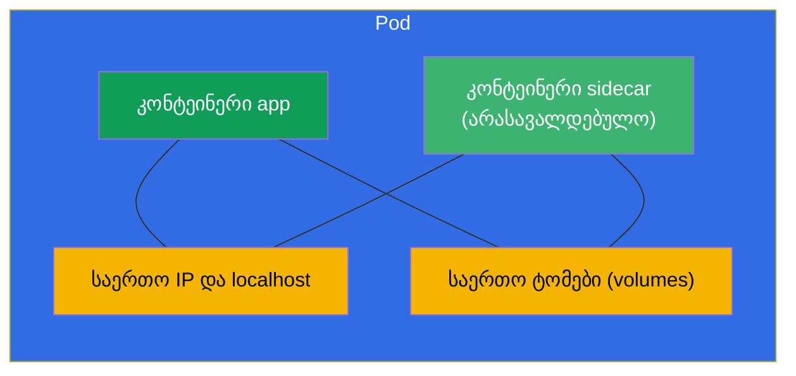
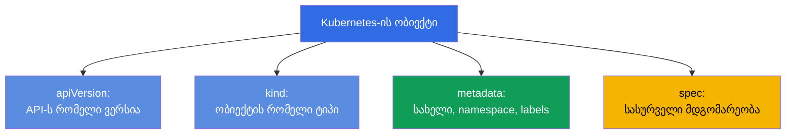
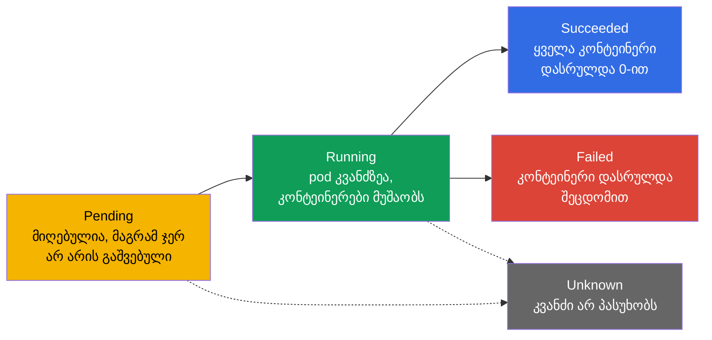
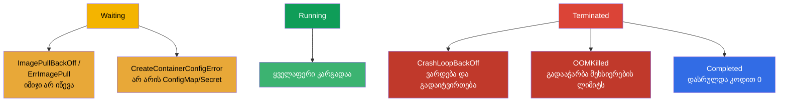
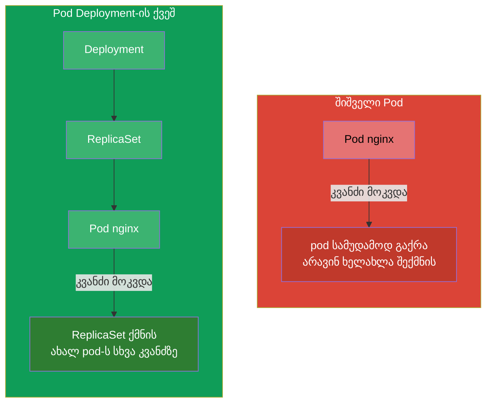

[Русская версия](ru.md) · [Eng version](README.md) · [Versión en español](es.md) · [Version française](fr.md) · [Deutsche Version](de.md)

# თავი 4. Pod-ები: სასიცოცხლო ციკლი, შექმნა და კონფიგურირება

> **რა იქნება შემდეგ.** Pod არის Kubernetes-ში გაშვების ბაზისური ერთეული და პირველი
> ობიექტი, რომელსაც ორივე გამოცდის ყოველ ამოცანაში ხელით ქმნით. ყველაფერი დანარჩენი
> (Deployment, StatefulSet, Job) ბოლოს და ბოლოს pod-ებს წარმოშობს. ამ თავში
> განვიხილავთ, რა არის pod, რისგან შედგება, როგორ გადის საკუთარ სასიცოცხლო ციკლს და
> როგორ ვქმნათ და ვაწყოთ ის. ეს არის საფუძველი სამუშაო დატვირთვებისთვის (თავები 5-16) და
> გამართვისთვის (თავი 44) - იმიტომ, რომ კლასტერში შეკეთება ყველაზე ხშირად სწორედ pod-ების უწევს.

## 4.1. რა არის pod და რატომ არ არის ეს „კონტეინერი“

Pod არის **გარსი ერთი ან რამდენიმე კონტეინერის გარშემო**, რომლებიც ყოველთვის ერთად
ეშვება, ერთ კვანძზე, და ერთმანეთს შორის იზიარებს ქსელსა და საცავს. Kubernetes
კონტეინერს პირდაპირ არასოდეს მართავს - დაგეგმვისა და გაშვების მინიმალური ერთეული
სწორედ pod არის.



რა აქვთ საერთო ერთი pod-ის შიგნით მყოფ კონტეინერებს:

- **ქსელი.** pod-ს ერთი IP-მისამართი აქვს ყველასთვის. შიგნით კონტეინერები ერთმანეთს
  `localhost`-ით ხედავენ და ერთსა და იმავე პორტს ვერ დაიკავებენ.
- **საცავი.** ტომები (volumes) გამოცხადებულია pod-ის დონეზე და შეიძლება ერთდროულად
  რამდენიმე კონტეინერში მიმაგრდეს - ასე ისინი ფაილებს ცვლიან.
- **სასიცოცხლო ციკლი და კვანძი.** pod-ის კონტეინერები ყოველთვის ერთ კვანძზეა და ერთად იგეგმება.

რა აქვთ კონტეინერებს **განცალკევებული**: ფაილური სისტემა (ყოველს საკუთარი, მიმაგრებული
საერთო ტომების გარდა) და პროცესები.

> **საიდან ჩნდება საერთო IP (pause-კონტეინერი).** pod-ის საერთო ქსელური მისამართი
> აპლიკაციის კონტეინერებს პირდაპირ არ „ეძლევა“ - მას ფარული სამსახურებრივი კონტეინერი
> **pause** ინახავს (მას infra-კონტეინერსაც უწოდებენ). როცა kubelet pod-ს ქმნის, ის
> **პირველად** უშვებს პაწაწინა pause-კონტეინერს: ის იღებს pod-ის IP-ს და იკავებს ქსელურ
> namespace-ს (ასევე IPC-ს). აპლიკაციის კონტეინერები შემდეგ სტარტავენ უკვე pause-ის ამ
> namespace-ების **შიგნით** - ამიტომ ყველას ერთი IP აქვს, საერთო `localhost` და პორტების
> ერთი დიაპაზონი. მნიშვნელოვანი შედეგი: pause თითქმის არაფერს აკეთებს (უბრალოდ „სძინავს“),
> მაგრამ ცოცხლობს pod-ის სიცოცხლის მთელი ხნის განმავლობაში, ამიტომ აპლიკაციის კონტეინერის
> გადატვირთვა ან ჩავარდნა **pod-ის IP-ს არ ცვლის** - namespace pause-ს რჩება.
>
> ამის დანახვა შეიძლება პირდაპირ კვანძზე `crictl`-ის მეშვეობით (CRI-ის უტილიტა, თავი 2):
>
> ```bash
> crictl ps            # pod-ის სამუშაო კონტეინერები
> crictl pods          # თავად pod-ები (sandbox) — ეს არის pause-კონტეინერები
> ```
>
> ყოველ pod-ს შეესაბამება ერთი pod sandbox (pause); `crictl ps`-ის გამოტანაში ხედავთ
> აპლიკაციის კონტეინერებს, ხოლო ქსელიან „ქვიშის ყუთს“ pause ინახავს კადრს მიღმა.

> **საკვანძო წესი.** ჩვეულებრივ pod-ში **ერთი** აპლიკაციის კონტეინერია. რამდენიმე
> კონტეინერს pod-ში მხოლოდ მაშინ დებენ, როცა ისინი მართლაც განუყოფლად არიან
> დაკავშირებული და უნდა იზიარებდნენ ქსელს/ტომებს (პატერნები sidecar, adapter,
> ambassador - თავი 22). ერთ pod-ში დაუკავშირებელი აპლიკაციების ჩატენვა არ ღირს - ამისთვის
> ცალკე pod-ები არსებობს.

## 4.2. pod-ის მანიფესტის ანატომია

Kubernetes-ის ნებისმიერ ობიექტს YAML-ში ოთხი ზედა ველი აქვს. pod-ის მაგალითზე:

```yaml
apiVersion: v1          # API-ს ვერსია (Pod-ისთვის — v1)
kind: Pod               # ობიექტის ტიპი
metadata:               # მეტამონაცემები: სახელი, namespace, ნიშნულები
  name: nginx
  labels:
    app: web
spec:                   # სასურველი მდგომარეობა: რა არის შიგნით
  containers:
  - name: nginx         # კონტეინერის სახელი
    image: nginx:1.27   # იმიჯი
    ports:
    - containerPort: 80 # პორტი, რომელსაც აპლიკაცია უსმენს
```



ეს ოთხი ველი - `apiVersion`, `kind`, `metadata`, `spec` - თითქმის ყოველ ობიექტს აქვს.
დაიმახსოვრეთ ისინი: შემდეგ კურსში იცვლება მხოლოდ `spec`-ის შიგთავსი, ხოლო ჩონჩხი
ყოველთვის ერთი და იგივეა.

## 4.3. pod-ის შექმნა: იმპერატიულად და მანიფესტის მეშვეობით

pod-ის მიღების სამი ხერხი - სწრაფიდან მოქნილამდე:

```bash
# 1. სწრაფად — ერთი ბრძანებით
kubectl run nginx --image=nginx

# 2. პარამეტრებით
kubectl run web --image=nginx:1.27 --port=80 \
  --env="COLOR=blue" --labels="app=web,tier=front"

# 3. მანიფესტის მეშვეობით (ჰიბრიდი: გენერაცია → ჩასწორება → გამოყენება)
kubectl run nginx --image=nginx --dry-run=client -o yaml > pod.yaml
vim pod.yaml
kubectl apply -f pod.yaml
```

`kubectl run`-ის სასარგებლო დროშები:

```bash
# ერთჯერადი ინტერაქტიული pod, გამოსვლისას იშლება — მოსახერხებელია ტესტებისთვის
kubectl run tmp --image=busybox -it --rm --restart=Never -- sh

# კონტეინერის ბრძანების მითითება
kubectl run busy --image=busybox --command -- sleep 3600
```

## 4.4. pod-ის სასიცოცხლო ციკლი: ფაზები

pod-ს აქვს ველი `status.phase` - მისი სიცოცხლის მსხვილი სტადია. ფაზა სულ ხუთია.



| ფაზა | რას ნიშნავს |
|------|-----------|
| **Pending** | pod მიღებულია კლასტერის მიერ, მაგრამ ჯერ არ არის გაშვებული: ელოდება კვანძის დანიშვნას, იმიჯის ჩამოტვირთვას ან თავისუფალ რესურსებს |
| **Running** | pod მიბმულია კვანძთან, სულ ცოტა ერთი კონტეინერი გაშვებულია ან სტარტავს |
| **Succeeded** | ყველა კონტეინერი წარმატებით დასრულდა (კოდი 0) და არ გადაიტვირთება |
| **Failed** | ყველა კონტეინერი დასრულდა, სულ ცოტა ერთი - შეცდომით |
| **Unknown** | pod-ის მდგომარეობის მიღება ვერ ხერხდება (ჩვეულებრივ კვანძმა კავშირი დაკარგა) |

ფაზა არის უხეში სურათი. უფრო ზუსტს იძლევა **კონტეინერების მდგომარეობები** და მიზეზები,
რომლებიც ჩანს `kubectl describe pod`-ში და `kubectl get pods`-ის სვეტ STATUS-ში.

## 4.5. კონტეინერების მდგომარეობები და ხშირი STATUS

pod-ის შიგნით ყოველ კონტეინერს საკუთარი მდგომარეობა აქვს: `Waiting`, `Running`, `Terminated`.
როცა კონტეინერი `Waiting`-შია ან ჩავარდა, მას აქვს **reason** - მიზეზი, რომელიც სწორედ
სვეტ STATUS-ში გამოიტანება. ეს მიზეზები ერთი ხედვით უნდა იცნობდეთ - CKA/CKAD-ზე გამართვის
ნახევარი მათზეა.



| STATUS | რას ნიშნავს | სად ვიხედოთ |
|--------|-----------|---------------|
| `ContainerCreating` | კონტეინერი იქმნება (იწევა იმიჯი, მიმაგრდება ტომები) | ნორმაა, თუ ხანმოკლეა; თორემ `describe` |
| `ImagePullBackOff` / `ErrImagePull` | იმიჯის ჩამოტვირთვა ვერ ხერხდება (შეცდომა სახელში, არ არის რეესტრთან წვდომა) | იმიჯის სახელი, რეესტრის სეკრეტი |
| `CrashLoopBackOff` | კონტეინერი სტარტავს და მაშინვე ვარდება, K8s გადატვირთავს დაყოვნებით | `logs --previous`, ბრძანება/კონფიგი |
| `OOMKilled` | კონტეინერი მოკლულია მეხსიერების ლიმიტის გადაჭარბებისთვის | მეხსიერების ლიმიტები (თავი 14) |
| `CreateContainerConfigError` | ვერ მოიძებნა ConfigMap/Secret, რომელზეც pod მიუთითებს | cm/secret-ის არსებობა |
| `Completed` | კონტეინერმა იმუშავა და დასრულდა კოდით 0 | ნორმაა Job/ერთჯერადი ამოცანებისთვის |
| `Pending` | pod ვერ იგეგმება | რესურსები, taints, nodeSelector, PVC |

სწორედ ამიტომ კავშირი „`kubectl get pods` → დაინახე უცნაური STATUS → `kubectl describe`
+ `kubectl logs`“ არის გამართვის მთავარი რეფლექსი. pod-ების სრულფასოვან troubleshooting-ს
44-ე თავში განვიხილავთ.

## 4.6. restartPolicy: როდის გადაიტვირთება კონტეინერი

ველი `spec.restartPolicy` მართავს იმას, გადაიტვირთოს თუ არა pod-ის კონტეინერები
დასრულების შემდეგ. მნიშვნელობა სამია:

| მნიშვნელობა | ქცევა | რისთვის |
|----------|-----------|----------|
| `Always` (ნაგულისხმევად) | ყოველთვის გადატვირთვა | დიდხანს მცხოვრები სერვისები (ვები, ბაზა) |
| `OnFailure` | გადატვირთვა მხოლოდ შეცდომისას (კოდი ≠ 0) | ამოცანები, რომლებმაც ბოლომდე უნდა იმუშაონ (Job) |
| `Never` | არ გადატვირთო | ერთჯერადი ამოცანები, სადაც გადატვირთვა არ არის საჭირო |

მნიშვნელოვანია: `restartPolicy` ეხება **pod-ის შიგნით კონტეინერების გადატვირთვას იმავე
კვანძზე**, და არა თავად pod-ის ხელახლა შექმნას. შიშველი Pod `Never`-ით, რომელიც ჩავარდა,
ისე დარჩება ჩავარდნილი - მას არავინ შექმნის ხელახლა. pod-ების ხელახლა შექმნით
კონტროლერები არიან დაკავებული (ReplicaSet/Deployment - თავი 5), და ამიტომ პროდში pod-ებს
თითქმის ყოველთვის არა პირდაპირ, არამედ მათი მეშვეობით ქმნიან.

## 4.7. შიშველი pod კონტროლერის მართვის ქვეშ მყოფი pod-ის წინააღმდეგ

ეს მნიშვნელოვანი განსხვავებაა. pod-ის შექმნა შეიძლება „შიშველად“ (პირდაპირ) ან
კონტროლერის მართვაში გადაცემით.



- **შიშველ pod-ს** არავინ აღადგენს. მოკვდა კვანძი - pod დაკარგულია. ასეთი pod-ები საჭიროა
  ერთჯერადი ამოცანებისთვის, გამართვისთვის, ექსპერიმენტებისთვის.
- **კონტროლერის მართვის ქვეშ მყოფი pod** (Deployment → ReplicaSet) ავტომატურად ხელახლა
  იქმნება ავარიების დროს, მასშტაბირდება, განახლდება. ასე უშვებენ ყველაფერს პროდში.

გამოცდაზე შიშველი pod-ების პირდაპირ შექმნას ხშირად ითხოვენ (სწრაფად, `kubectl run`), მაგრამ
უნდა გესმოდეთ, რომ რეალობაში სერვისებს ასე არ უშვებენ.

## 4.8. pod-ის spec-ის სასარგებლო ველები

რამდენიმე მნიშვნელოვანი ველი, რომლებსაც ხშირად დაამატებთ pod-ის მანიფესტში (ყოველი
დაწვრილებით - საკუთარ თავში):

```yaml
spec:
  containers:
  - name: app
    image: nginx:1.27
    command: ["nginx"]              # იმიჯის ENTRYPOINT-ის გადაფარვა
    args: ["-g", "daemon off;"]     # არგუმენტები (თავი 17)
    env:                            # გარემოს ცვლადები (თავი 17)
    - name: COLOR
      value: blue
    resources:                      # მოთხოვნები და ლიმიტები (თავი 14)
      requests: {cpu: "100m", memory: "64Mi"}
      limits: {cpu: "250m", memory: "128Mi"}
    ports:
    - containerPort: 80
  nodeSelector:                     # რომელ კვანძებზე დავაყენოთ (თავი 12)
    disktype: ssd
  restartPolicy: Always
```

ყველაფრის ერთბაშად დამახსოვრება არ არის საჭირო - მნიშვნელოვანია გვესმოდეს, რომ მთელი
ფუნქციონალი (პრობები, ტომები, რესურსები, დაგეგმვა) ემატება pod-ის `spec`-ის შიგნით
ველებით, და მათი მოძებნა შეიძლება `kubectl explain pod.spec...`-ის მეშვეობით.

## 4.9. გამართვა და pod-თან წვდომა

ბაზისური ნაკრები უკვე გაშვებულ pod-თან მუშაობისთვის:

```bash
kubectl get pod nginx -o wide           # სად არის გაშვებული, რომელი IP
kubectl describe pod nginx              # მოვლენები, კონტეინერების მდგომარეობები
kubectl logs nginx                      # ლოგები
kubectl logs nginx --previous           # წინა (ჩავარდნილი) კონტეინერის ლოგები
kubectl exec -it nginx -- sh            # შიგნით შესვლა
kubectl port-forward pod/nginx 8080:80  # პორტის ლოკალურ მანქანაზე გატანა
```

ცალკე ღირს **ephemeral-კონტეინერების** და `kubectl debug`-ის ხსენება - ეს არის ხერხი
დროებითი გამართვის კონტეინერის მიერთების უკვე მომუშავე pod-თან, მისი ხელახლა შექმნის
გარეშე. განსაკუთრებით სასარგებლოა, როცა აპლიკაციის იმიჯი მინიმალურია (`sh`-იც არ არის).
დაწვრილებით - 29-ე თავში.

## 4.10. როგორ იყენებენ ამას პროდაქშენში

- **შიშველ pod-ებს პროდში თითქმის არ იყენებენ.** ყველაფერს, რაც დიდხანს უნდა იცოცხლოს და
  ავარიები გადაიტანოს, უშვებენ კონტროლერების მეშვეობით (Deployment, StatefulSet,
  DaemonSet). შიშველი Pod არის გამართვა, ერთჯერადი ამოცანა ან სასწავლო მაგალითი. თუ
  პროდაქშენში შიშველ pod-ს ხედავთ - ეს თითქმის ყოველთვის შეცდომა ან დროებითი „კოჭაა“.
- **ერთი აპლიკაციის კონტეინერი pod-ზე არის ნორმა.** Multi-container pod-ებს გამოიყენებენ
  შეგნებულად და კონკრეტული პატერნების ქვეშ (sidecar ლოგებისთვის/პროქსისთვის, init
  მოსამზადებლად). pod-ის რამდენიმე აპლიკაციით გაბერვა არის ანტიპატერნი.
- **pod-ების STATUS არის მონიტორინგის საფუძველი.** პროდში ალერტები ხშირად სწორედ pod-ების
  მდგომარეობებზეა დაბმული: მასობრივი `CrashLoopBackOff`, `ImagePullBackOff` რელიზის შემდეგ,
  `OOMKilled` არასწორი ლიმიტების დროს - ეს არის ინციდენტის პირველი სიგნალები.
- **მინიმალური იმიჯები.** პროდში ცდილობენ პატარა იმიჯებს (distroless, alpine,
  scratch) - ნაკლები შეტევის ზედაპირი და წონა. უკუმხარე: შიგნით არ არის `sh`, ამიტომ
  გამართვას `kubectl debug`-ით, ephemeral-კონტეინერების მეშვეობით ატარებენ.

## 4.11. მინი-ლექსიკონი

- **Pod** - გაშვების მინიმალური ერთეული: გარსი ერთი/რამდენიმე კონტეინერის გარშემო
  საერთო ქსელითა და ტომებით.
- **აპლიკაციის კონტეინერი** - pod-ის ძირითადი კონტეინერი სასარგებლო დატვირთვით.
- **Sidecar** - დამხმარე კონტეინერი იმავე pod-ში (თავი 22).
- **ფაზა (phase)** - pod-ის სიცოცხლის მსხვილი სტადია: Pending, Running, Succeeded, Failed,
  Unknown.
- **restartPolicy** - კონტეინერების გადატვირთვის პოლიტიკა: Always, OnFailure, Never.
- **შიშველი pod (bare pod)** - pod, შექმნილი პირდაპირ, კონტროლერის გარეშე; არ
  აღდგება.
- **CrashLoopBackOff** - კონტეინერი ციკლურად ვარდება და გადაიტვირთება.
- **OOMKilled** - კონტეინერი მოკლულია მეხსიერების ლიმიტის გადაჭარბებისთვის.
- **ephemeral-კონტეინერი** - დროებითი კონტეინერი ცოცხალი pod-ის გამართვისთვის (`kubectl
  debug`).

## 4.12. თავის შეჯამება

- Pod არის გაშვების მინიმალური ერთეული: ერთი ან რამდენიმე კონტეინერი საერთო IP-ით,
  `localhost`-ითა და ტომებით, ყოველთვის ერთ კვანძზე.
- ჩვეულებრივ pod-ში ერთი აპლიკაციის კონტეინერია; რამდენიმე - მხოლოდ დაკავშირებული პატერნებისთვის.
- ნებისმიერი ობიექტის მანიფესტი = `apiVersion` + `kind` + `metadata` + `spec`; იცვლება
  ძირითადად `spec`.
- pod-ის შექმნა შეიძლება იმპერატიულად (`kubectl run`), მაგრამ რთულებისთვის - YAML-ის
  გენერაცია და ჩასწორება.
- pod-ის ფაზები: Pending → Running → Succeeded/Failed (+ Unknown). ზუსტ მიზეზს იძლევა
  კონტეინერების მდგომარეობები და STATUS.
- ხშირი STATUS: ImagePullBackOff, CrashLoopBackOff, OOMKilled, CreateContainerConfigError,
  Pending - ისწავლეთ ზეპირად.
- `restartPolicy` (Always/OnFailure/Never) მართავს კონტეინერების გადატვირთვას, მაგრამ არა
  pod-ის ხელახლა შექმნას - ამით კონტროლერები არიან დაკავებული.
- შიშველი pod ავარიების დროს არ აღდგება; პროდში pod-ებს კონტროლერების მეშვეობით უშვებენ.

## 4.13. როგორ გამოგადგებათ: გამოცდაზე და რეალურ სამუშაოში

**გამოცდაზე.** pod-ის შექმნა არის ორივე გამოცდის ყველაზე ხშირი ელემენტარული ოპერაცია
(`kubectl run ... $do > pod.yaml`). STATUS-ის ამოცნობა (Pending, CrashLoopBackOff,
ImagePullBackOff) არის CKA-ს troubleshooting დომენის (30%) და CKAD-ის Observability
სექციის ბირთვი. ფაზების, `restartPolicy`-სა და describe/logs კავშირის ცოდნა ხსნის
ამოცანების მთელ კლასს „რატომ არ მუშაობს pod“.

**რეალურ სამუშაოში.** Pod არის ატომი, რომლისგანაც კლასტერში ყველაფერია აწყობილი, ხოლო
მისი STATUS არის აპლიკაციის ჯანმრთელობის პირველი ინდიკატორი. მორიგე ინჟინერი pod-ების
მდგომარეობით მყისიერად ხვდება, რა მოხდა რელიზის შემდეგ. გაგება „შიშველი pod კონტროლერის
წინააღმდეგ“ ხსნის, რატომ არ უშვებენ პროდში არაფერს შიშველი pod-ებით და რატომ „ცოცხლდება“
აპლიკაცია თავისით კვანძის ჩავარდნის შემდეგ.

## 4.14. თვითშემოწმების კითხვები

1. რით განსხვავდება pod კონტეინერისგან? რას იზიარებენ pod-ის შიგნით კონტეინერები და რას - არა?
2. როდის არის გამართლებული pod-ში რამდენიმე კონტეინერის ჩადება და როდის არა?
3. დაასახელეთ მანიფესტის ოთხი სავალდებულო ზედა ველი. რომელი მათგანი აღწერს
   „რა არის შიგნით“?
4. ჩამოთვალეთ pod-ის ფაზები. რით განსხვავდება ფაზა STATUS-ისგან `kubectl get pods`-ში?
5. რას ნიშნავს ImagePullBackOff, CrashLoopBackOff და OOMKilled და სად ვიხედოთ ყოველი
   მათგანის დროს?
6. როგორ იქცევა pod `restartPolicy: Never`-ით, თუ კონტეინერი ჩავარდა? ხოლო თუ ეს შიშველი
   pod იყო და კვანძი მოკვდა?
7. რატომ არ უშვებენ პროდაქშენში შიშველ pod-ებს?

## პრაქტიკა

შემდეგ ვისწავლით არა pod-ების სათითაოდ შექმნას, არამედ მათი სიმრავლის მართვას
ReplicaSet-ისა და Deployment-ის მეშვეობით (თავი 5). pod-ების შექმნას, მათი ფაზებისა და
STATUS-ის გარჩევას დაამუშავებთ პირველ გაერთიანებულ ლაბორატორიულში deployment-ებთან და
namespace-ებთან ერთად.

🧪 ლაბი 101 (pod-ები და მათი კონფიგურაცია): [tasks/cka/labs/101](../../labs/101/README_GE.MD)

---
[სარჩევი](../README_GE.md) · [თავი 3](../03/ge.md) · [თავი 5](../05/ge.md)
