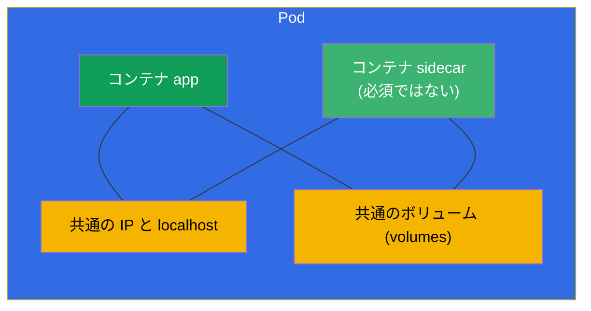
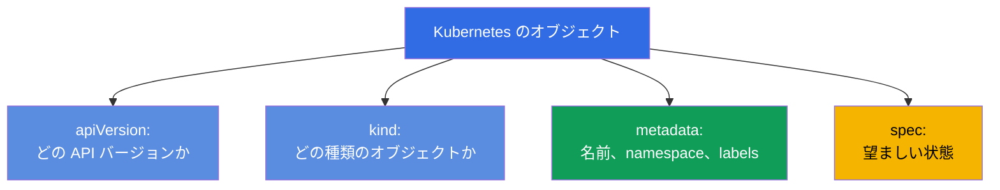
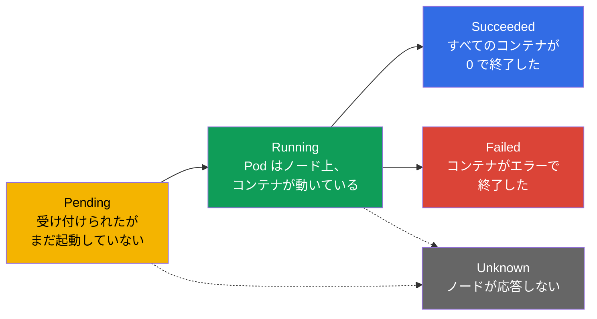
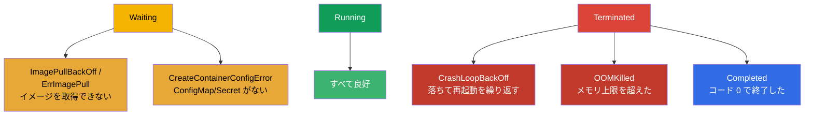
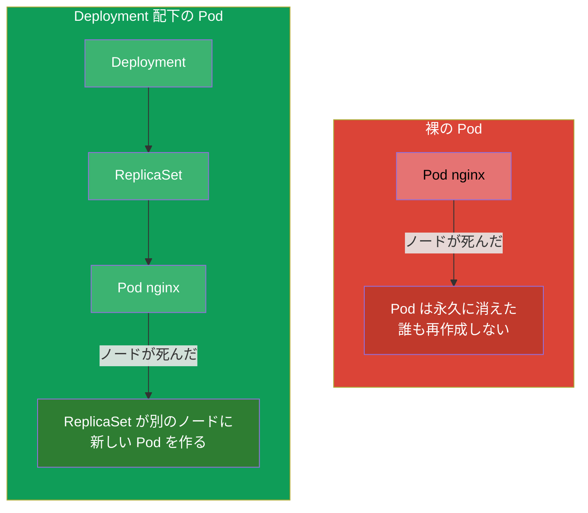

[Русская версия](ru.md) · [Eng version](README.md) · [Versión en español](es.md) · [Version française](fr.md) · [Deutsche Version](de.md) · [ქართული ვერსია](ge.md) · [繁體中文版](tw.md)

# 第 4 章。Pod：ライフサイクル、作成と設定

> **次は何か。** Pod は Kubernetes における実行の基本単位であり、両方の試験の
> どの問題でも自分の手で最初に作るオブジェクトです。それ以外のすべて
> (Deployment、StatefulSet、Job) は最終的に Pod を生み出します。この章では
> Pod とは何か、何から構成されるのか、どのようにライフサイクルを進むのか、そして
> どう作成して設定するのかを分解します。これはワークロード (第 5-16 章) と
> デバッグ (第 44 章) の土台です - クラスタで直すことになるのは、たいてい Pod だからです。

## 4.1. Pod とは何か、そしてなぜ「コンテナ」ではないのか

Pod とは **1 つまたは複数のコンテナを包むラッパー** で、それらは常に一緒に、同じ
ノード上で起動し、ネットワークとストレージを互いに共有します。Kubernetes が
コンテナを直接管理することは決してありません - スケジューリングと実行の最小単位は
まさに Pod です。



同じ Pod 内のコンテナが共有するもの：

- **ネットワーク。** Pod には全体で 1 つの IP アドレスがあります。内部のコンテナは
  `localhost` で互いを見ることができ、同じポートを取り合うことはできません。
- **ストレージ。** ボリューム (volumes) は Pod のレベルで宣言され、複数のコンテナに
  同時にマウントできます - こうしてファイルを交換します。
- **ライフサイクルとノード。** Pod のコンテナは常に同じノード上にあり、一緒に
  スケジューリングされます。

コンテナで **別々** なもの：ファイルシステム (マウントされた共通ボリュームを除き、
それぞれ自分のもの) とプロセスです。

> **共通の IP はどこから来るのか (pause コンテナ)。** Pod の共通のネットワーク
> アドレスは、アプリケーションのコンテナに直接「渡される」ものではありません -
> それを保持しているのは隠れた補助コンテナ **pause** です
> (infra コンテナとも呼ばれます)。kubelet が Pod を作るとき、**最初に**
> 極小の pause コンテナを起動します：それが Pod の IP を受け取り、ネットワークの
> namespace (および IPC) を保持します。アプリケーションのコンテナはそのあと、
> pause のこれらの namespace の **内側** で起動します - だからこそ全員が同じ IP、
> 共通の `localhost`、1 つのポート範囲を持ちます。重要な帰結：pause はほとんど
> 何もしません (ただ「眠っている」だけ) が、Pod の生存期間ずっと生き続けるので、
> アプリケーションのコンテナの再起動や停止は **Pod の IP を変えません** -
> namespace は pause のもとに残ります。
>
> これはノード上で `crictl` (CRI のユーティリティ、第 2 章) を通してそのまま見られます：
>
> ```bash
> crictl ps            # Pod の稼働中のコンテナ
> crictl pods          # Pod 自体 (sandbox) — これがまさに pause コンテナです
> ```
>
> どの Pod にも 1 つの pod sandbox (pause) が対応します。`crictl ps` の出力では
> アプリケーションのコンテナが見え、ネットワークを持つ「サンドボックス」は
> pause が裏側で保持しています。

> **重要なルール。** ふつう Pod の中にはアプリケーションのコンテナが **1 つ** です。
> 複数のコンテナを 1 つの Pod に入れるのは、それらが本当に切り離せない関係にあり、
> ネットワーク/ボリュームを共有しなければならないときだけです (sidecar、adapter、
> ambassador のパターン - 第 22 章)。関係のないアプリケーションを 1 つの Pod に
> 詰め込む必要はありません - それには別々の Pod があります。

## 4.2. Pod のマニフェストの解剖

YAML で書かれた Kubernetes のどのオブジェクトにも 4 つのトップレベルのフィールドが
あります。Pod の例で見てみましょう：

```yaml
apiVersion: v1          # API のバージョン (Pod では v1)
kind: Pod               # オブジェクトの種類
metadata:               # メタデータ: 名前、namespace、ラベル
  name: nginx
  labels:
    app: web
spec:                   # 望ましい状態: 中に何があるか
  containers:
  - name: nginx         # コンテナの名前
    image: nginx:1.27   # イメージ
    ports:
    - containerPort: 80 # アプリケーションが待ち受けるポート
```



この 4 つのフィールド - `apiVersion`、`kind`、`metadata`、`spec` - は、ほとんど
すべてのオブジェクトにあります。覚えておいてください：このコースの先で変わるのは
`spec` の中身だけで、骨組みは常に同じです。

## 4.3. Pod の作成：命令的にとマニフェスト経由で

Pod を手に入れる 3 つの方法 - 速いものから柔軟なものへ：

```bash
# 1. 速く — 1 つのコマンドで
kubectl run nginx --image=nginx

# 2. パラメータ付きで
kubectl run web --image=nginx:1.27 --port=80 \
  --env="COLOR=blue" --labels="app=web,tier=front"

# 3. マニフェスト経由で (ハイブリッド: 生成 → 手直し → 適用)
kubectl run nginx --image=nginx --dry-run=client -o yaml > pod.yaml
vim pod.yaml
kubectl apply -f pod.yaml
```

`kubectl run` の便利なフラグ：

```bash
# 使い捨ての対話的な Pod、終了時に削除される — テストに便利
kubectl run tmp --image=busybox -it --rm --restart=Never -- sh

# コンテナのコマンドを指定する
kubectl run busy --image=busybox --command -- sleep 3600
```

## 4.4. Pod のライフサイクル：フェーズ

Pod には `status.phase` というフィールド - その生涯の大きな段階 - があります。
フェーズは全部で 5 つです。



| フェーズ | 何を意味するか |
|------|-----------|
| **Pending** | Pod はクラスタに受け付けられたが、まだ起動していない：ノードの割り当て、イメージのダウンロード、空きリソースを待っている |
| **Running** | Pod はノードに紐づけられ、少なくとも 1 つのコンテナが起動済みまたは起動中 |
| **Succeeded** | すべてのコンテナが正常に終了し (コード 0)、再起動されない |
| **Failed** | すべてのコンテナが終了し、少なくとも 1 つはエラーで終了した |
| **Unknown** | Pod の状態を取得できない (通常はノードが接続を失った) |

フェーズは大まかな絵です。より正確な絵を与えるのは **コンテナの状態** と理由で、
`kubectl describe pod` と `kubectl get pods` の STATUS 列で見られます。

## 4.5. コンテナの状態とよくある STATUS

Pod の中では各コンテナが自分の状態を持ちます：`Waiting`、`Running`、`Terminated`。
コンテナが `Waiting` にあるか停止したとき、それには **reason** - 理由 - があり、
まさにそれが STATUS 列に出力されます。これらの理由は即座に見分けられるように
なる必要があります - CKA/CKAD のデバッグの半分はそれについてです。



| STATUS | 何を意味するか | どこを見るか |
|--------|-----------|---------------|
| `ContainerCreating` | コンテナを作成中 (イメージを取得、ボリュームをマウント) | 短時間なら正常。そうでなければ `describe` |
| `ImagePullBackOff` / `ErrImagePull` | イメージをダウンロードできない (タイプミス、レジストリへのアクセスがない) | イメージ名、レジストリの Secret |
| `CrashLoopBackOff` | コンテナが起動してすぐ落ち、K8s が遅延を入れて再起動する | `logs --previous`、コマンド/設定 |
| `OOMKilled` | メモリ上限の超過でコンテナが kill された | メモリの limits (第 14 章) |
| `CreateContainerConfigError` | Pod が参照している ConfigMap/Secret が見つからない | cm/secret の存在 |
| `Completed` | コンテナが仕事を終えてコード 0 で終了した | Job/使い捨てのタスクでは正常 |
| `Pending` | Pod をスケジューリングできない | リソース、taints、nodeSelector、PVC |

だからこそ「`kubectl get pods` → 変な STATUS を見つけた → `kubectl describe`
+ `kubectl logs`」という組み合わせが、デバッグの主要な反射です。Pod の
troubleshooting は第 44 章で本格的に分解します。

## 4.6. restartPolicy：コンテナが再起動されるのはいつか

`spec.restartPolicy` フィールドは、終了後に Pod のコンテナを再起動するかどうかを
制御します。値は 3 つです：

| 値 | ふるまい | 何のために |
|----------|-----------|----------|
| `Always` (デフォルト) | 常に再起動する | 長く生きるサービス (ウェブ、DB) |
| `OnFailure` | エラーのときだけ再起動する (コード ≠ 0) | 最後までやり切る必要があるタスク (Job) |
| `Never` | 再起動しない | 再起動が不要な使い捨てのタスク |

重要：`restartPolicy` が関係するのは **同じノード上の Pod 内のコンテナの再起動** で、
Pod 自体の再作成ではありません。`Never` の裸の Pod が落ちたら、そのまま落ちた
ままです - 誰も再作成しません。Pod の再作成を担うのはコントローラ
(ReplicaSet/Deployment - 第 5 章) であり、だから本番では Pod をほぼ常に直接では
なく、それらを通して作ります。

## 4.7. 裸の Pod とコントローラ管理下の Pod

これは重要な違いです。Pod は「裸」で (直接) 作ることもできますし、コントローラの
管理下に置くこともできます。



- **裸の Pod** は誰も復旧しません。ノードが死んだら Pod は失われます。そのような
  Pod が必要なのは、使い捨てのタスク、デバッグ、実験のためです。
- **コントローラ管理下の Pod** (Deployment → ReplicaSet) は障害時に自動で
  再作成され、スケールし、更新されます。本番ではこうしてすべてを動かします。

試験では裸の Pod を直接作るよう求められることが多いですが (速く、`kubectl run`)、
現実にはサービスをそうやって動かさないことを理解しておく必要があります。

## 4.8. Pod の spec の便利なフィールド

Pod のマニフェストに頻繁に追加することになる重要なフィールドをいくつか (それぞれ
詳しくは専用の章で)：

```yaml
spec:
  containers:
  - name: app
    image: nginx:1.27
    command: ["nginx"]              # イメージの ENTRYPOINT を上書きする
    args: ["-g", "daemon off;"]     # 引数 (第 17 章)
    env:                            # 環境変数 (第 17 章)
    - name: COLOR
      value: blue
    resources:                      # requests と limits (第 14 章)
      requests: {cpu: "100m", memory: "64Mi"}
      limits: {cpu: "250m", memory: "128Mi"}
    ports:
    - containerPort: 80
  nodeSelector:                     # どのノードに配置するか (第 12 章)
    disktype: ssd
  restartPolicy: Always
```

すべてを一度に覚える必要はありません - 重要なのは、あらゆる機能 (プローブ、
ボリューム、リソース、スケジューリング) が Pod の `spec` 内のフィールドとして
追加されると理解すること、そしてそれらを `kubectl explain pod.spec...` で
見つけられることです。

## 4.9. デバッグと Pod へのアクセス

すでに起動している Pod を扱うための基本セット：

```bash
kubectl get pod nginx -o wide           # どこで動いているか、IP は何か
kubectl describe pod nginx              # イベント、コンテナの状態
kubectl logs nginx                      # ログ
kubectl logs nginx --previous           # 前の (落ちた) コンテナのログ
kubectl exec -it nginx -- sh            # 中に入る
kubectl port-forward pod/nginx 8080:80  # ローカルマシンへポートを転送する
```

別途触れておく価値があるのは **ephemeral コンテナ** と `kubectl debug` -
すでに動いている Pod を再作成せずに、一時的なデバッグ用コンテナを接続する方法です。
アプリケーションのイメージが最小限のとき (`sh` すらない) にとくに便利です。
詳しくは第 29 章で。

## 4.10. 本番環境でこれをどう使うか

- **本番では裸の Pod をほとんど使いません。** 長く生き、障害を乗り越えるべきものは
  すべてコントローラ (Deployment、StatefulSet、DaemonSet) を通して動かします。裸の
  Pod はデバッグ、使い捨てのタスク、学習用の例です。本番で裸の Pod を見かけたら -
  それはほぼ常に誤りか、一時的な「その場しのぎ」です。
- **1 つの Pod にアプリケーションのコンテナ 1 つが標準です。** マルチコンテナの Pod は
  意識的に、具体的なパターンのために使います (ログ/プロキシのための sidecar、
  準備のための init)。複数のアプリケーションで Pod を膨らませるのはアンチパターンです。
- **Pod の STATUS は監視の基礎です。** 本番のアラートはまさに Pod の状態に
  結びつけられていることが多いです：大量の `CrashLoopBackOff`、リリース後の
  `ImagePullBackOff`、誤った limits による `OOMKilled` - これらはインシデントの
  最初のシグナルです。
- **最小限のイメージ。** 本番では小さなイメージ (distroless、alpine、scratch) を
  目指します - 攻撃面と容量が小さくなります。裏返しとして、中に `sh` がないため、
  デバッグは ephemeral コンテナを使った `kubectl debug` で行います。

## 4.11. ミニ用語集

- **Pod** - 実行の最小単位：共通のネットワークとボリュームを持つ 1 つ/複数の
  コンテナを包むラッパー。
- **アプリケーションのコンテナ** - 有用な処理を担う Pod の主要なコンテナ。
- **Sidecar** - 同じ Pod 内の補助コンテナ (第 22 章)。
- **フェーズ (phase)** - Pod の生涯の大きな段階：Pending、Running、Succeeded、Failed、
  Unknown。
- **restartPolicy** - コンテナの再起動ポリシー：Always、OnFailure、Never。
- **裸の Pod (bare pod)** - コントローラなしで直接作られた Pod。復旧されない。
- **CrashLoopBackOff** - コンテナが周期的に落ちて再起動される。
- **OOMKilled** - メモリ上限の超過でコンテナが kill された。
- **ephemeral コンテナ** - 生きた Pod のデバッグ用の一時コンテナ (`kubectl
  debug`)。

## 4.12. 本章のまとめ

- Pod は実行の最小単位：共通の IP、`localhost`、ボリュームを持つ 1 つまたは複数の
  コンテナで、常に同じノード上にあります。
- ふつう Pod にはアプリケーションのコンテナが 1 つ。複数にするのは関連するパターンの
  ためだけです。
- どのオブジェクトのマニフェストも = `apiVersion` + `kind` + `metadata` + `spec`。
  主に変わるのは `spec` です。
- Pod は命令的に (`kubectl run`) 作れますが、複雑なものは YAML を生成して手直し
  します。
- Pod のフェーズ：Pending → Running → Succeeded/Failed (+ Unknown)。正確な理由は
  コンテナの状態と STATUS が与えます。
- よくある STATUS：ImagePullBackOff、CrashLoopBackOff、OOMKilled、CreateContainerConfigError、
  Pending - 暗記しておくこと。
- `restartPolicy` (Always/OnFailure/Never) はコンテナの再起動を制御しますが、Pod の
  再作成は制御しません - それを担うのはコントローラです。
- 裸の Pod は障害時に復旧されません。本番では Pod をコントローラ経由で動かします。

## 4.13. これがどう役に立つか：試験と実際の仕事で

**試験では。** Pod の作成は両方の試験でもっとも頻出の基本操作です
(`kubectl run ... $do > pod.yaml`)。STATUS の見分け (Pending、CrashLoopBackOff、
ImagePullBackOff) は CKA の troubleshooting 領域 (30%) と CKAD の Observability
セクションの核心です。フェーズ、`restartPolicy`、describe/logs の組み合わせを知って
いれば、「なぜ Pod が動かないのか」という問題のクラス全体を解決できます。

**実際の仕事では。** Pod はクラスタのすべてが組み立てられている原子であり、その
STATUS はアプリケーションの健康状態の最初の指標です。当番のエンジニアは Pod の状態から
リリース後に何が起きたのかを即座に理解します。「裸の Pod とコントローラ」の理解は、
なぜ本番では裸の Pod で何も動かさないのか、そしてなぜノードが落ちたあとに
アプリケーションが自分で「復活」するのかを説明してくれます。

## 4.14. 自己チェックの質問

1. Pod はコンテナとどう違いますか？Pod 内のコンテナは何を共有し、何を共有しませんか？
2. 1 つの Pod に複数のコンテナを入れるのが正当なのはどんなときで、そうでないのは
   どんなときですか？
3. マニフェストの必須のトップレベルのフィールドを 4 つ挙げてください。そのうち
   「中に何があるか」を記述するのはどれですか？
4. Pod のフェーズを列挙してください。フェーズは `kubectl get pods` の STATUS と
   どう違いますか？
5. ImagePullBackOff、CrashLoopBackOff、OOMKilled は何を意味し、それぞれのとき
   どこを見ますか？
6. `restartPolicy: Never` の Pod は、コンテナが落ちたときどうふるまいますか？
   では、それが裸の Pod でノードが死んだ場合は？
7. なぜ本番環境では裸の Pod を動かさないのですか？

## 演習

このあとは Pod を 1 つずつ作るのではなく、ReplicaSet と Deployment を通して
それらの集合を管理することを学びます (第 5 章)。Pod の作成、そのフェーズと STATUS の
分解は、deployment と namespace と合わせた最初の統合ラボで練習します。

🧪 ラボ 101 (Pod とその設定): [tasks/cka/labs/101](../../labs/101/README_JP.MD)

---
[目次](../README_JP.md) · [第 3 章](../03/jp.md) · [第 5 章](../05/jp.md)
