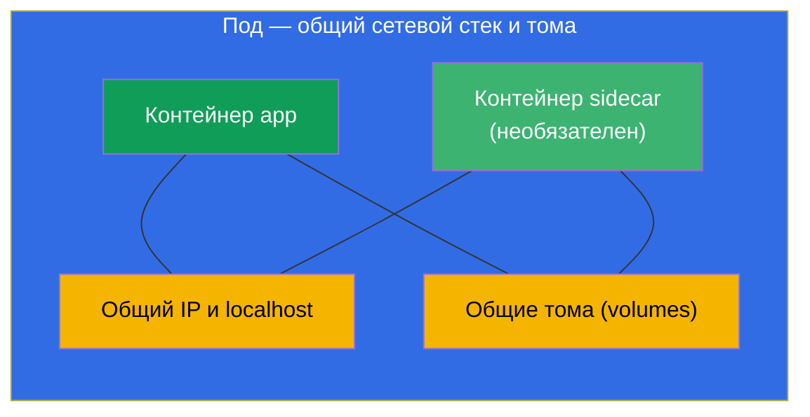
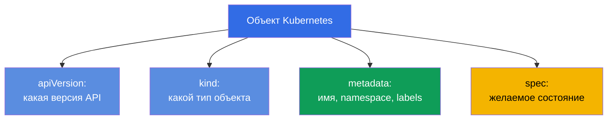
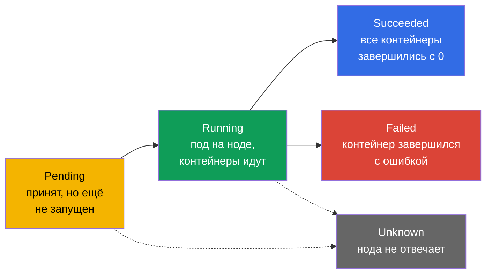
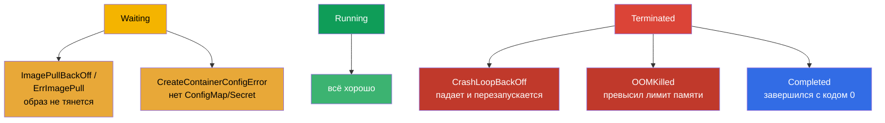
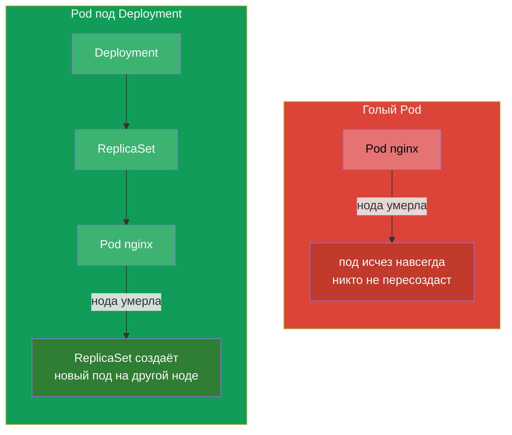

# Глава 4. Поды: жизненный цикл, создание и конфигурирование

> **Что дальше.** Под (Pod) - это базовая единица запуска в Kubernetes и первый объект,
> который вы создаёте руками в каждой задаче обоих экзаменов. Всё остальное
> (Deployment, StatefulSet, Job) в конечном счёте порождает поды. В этой главе мы
> разберём, что такое под, из чего он состоит, как проходит свой жизненный цикл и как
> его создавать и настраивать. Это фундамент для рабочих нагрузок (главы 5-16) и для
> отладки (глава 44) - потому что чинить в кластере чаще всего приходится именно поды.

## 4.1. Что такое под и почему это не «контейнер»

Под - это **обёртка вокруг одного или нескольких контейнеров**, которые всегда
запускаются вместе, на одной ноде, и делят между собой сеть и хранилище. Kubernetes
никогда не управляет контейнером напрямую - минимальная единица планирования и запуска
это именно под.



Что общего у контейнеров внутри одного пода:

- **Сеть.** У пода один IP-адрес на всех. Контейнеры внутри видят друг друга по
  `localhost` и не могут занять один и тот же порт.
- **Хранилище.** Тома (volumes) объявляются на уровне пода и могут монтироваться в
  несколько контейнеров сразу - так они обмениваются файлами.
- **Жизненный цикл и нода.** Контейнеры пода всегда на одной ноде и планируются вместе.

Что у контейнеров **раздельное**: файловая система (у каждого своя, кроме
смонтированных общих томов) и процессы.

> **Ключевое правило.** Обычно в поде **один** контейнер приложения. Несколько
> контейнеров кладут в под только тогда, когда они действительно неразрывно связаны и
> должны делить сеть/тома (паттерны sidecar, adapter, ambassador - глава 22). Не надо
> пихать в один под несвязанные приложения - для этого есть отдельные поды.

## 4.2. Анатомия манифеста пода

Любой объект Kubernetes в YAML имеет четыре верхних поля. На примере пода:

```yaml
apiVersion: v1          # версия API (для Pod — v1)
kind: Pod               # тип объекта
metadata:               # метаданные: имя, namespace, метки
  name: nginx
  labels:
    app: web
spec:                   # желаемое состояние: что внутри
  containers:
  - name: nginx         # имя контейнера
    image: nginx:1.27   # образ
    ports:
    - containerPort: 80 # порт, который слушает приложение
```



Эти четыре поля - `apiVersion`, `kind`, `metadata`, `spec` - есть почти у каждого
объекта. Запомните их: дальше в курсе меняется только содержимое `spec`, а каркас
всегда один и тот же.

## 4.3. Создание пода: императивно и через манифест

Три способа получить под - от быстрого к гибкому:

```bash
# 1. Быстро — одной командой
kubectl run nginx --image=nginx

# 2. С параметрами
kubectl run web --image=nginx:1.27 --port=80 \
  --env="COLOR=blue" --labels="app=web,tier=front"

# 3. Через манифест (гибрид: сгенерировать → доправить → применить)
kubectl run nginx --image=nginx --dry-run=client -o yaml > pod.yaml
vim pod.yaml
kubectl apply -f pod.yaml
```

Полезные флаги `kubectl run`:

```bash
# Разовый интерактивный под, удаляется по выходу — удобно для тестов
kubectl run tmp --image=busybox -it --rm --restart=Never -- sh

# Задать команду контейнера
kubectl run busy --image=busybox --command -- sleep 3600
```

## 4.4. Жизненный цикл пода: фазы

У пода есть поле `status.phase` - крупная стадия его жизни. Фаз всего пять.



| Фаза | Что значит |
|------|-----------|
| **Pending** | Под принят кластером, но ещё не запущен: ждёт назначения ноды, скачивания образа или свободных ресурсов |
| **Running** | Под привязан к ноде, хотя бы один контейнер запущен или стартует |
| **Succeeded** | Все контейнеры успешно завершились (код 0) и не будут перезапущены |
| **Failed** | Все контейнеры завершились, хотя бы один - с ошибкой |
| **Unknown** | Состояние пода не удаётся получить (обычно нода потеряла связь) |

Фаза - это грубая картина. Более точную дают **состояния контейнеров** и причины,
которые видно в `kubectl describe pod` и в колонке STATUS у `kubectl get pods`.

## 4.5. Состояния контейнеров и частые STATUS

Внутри пода у каждого контейнера своё состояние: `Waiting`, `Running`, `Terminated`.
Когда контейнер в `Waiting` или упал, у него есть **reason** - причина, которая как раз
и выводится в колонке STATUS. Эти причины надо узнавать с ходу - половина отладки на
CKA/CKAD про них.



| STATUS | Что значит | Куда смотреть |
|--------|-----------|---------------|
| `ContainerCreating` | Контейнер создаётся (тянется образ, монтируются тома) | норм, если ненадолго; иначе `describe` |
| `ImagePullBackOff` / `ErrImagePull` | Не удаётся скачать образ (опечатка, нет доступа к реестру) | имя образа, секрет реестра |
| `CrashLoopBackOff` | Контейнер стартует и сразу падает, K8s перезапускает с задержкой | `logs --previous`, команда/конфиг |
| `OOMKilled` | Контейнер убит за превышение лимита памяти | лимиты памяти (глава 14) |
| `CreateContainerConfigError` | Не найден ConfigMap/Secret, на который ссылается под | существование cm/secret |
| `Completed` | Контейнер отработал и завершился с кодом 0 | норм для Job/разовых задач |
| `Pending` | Под не может быть запланирован | ресурсы, taints, nodeSelector, PVC |

Именно поэтому связка «`kubectl get pods` → увидел странный STATUS → `kubectl describe`
+ `kubectl logs`» - главный рефлекс отладки. Полноценно troubleshooting подов разберём
в главе 44.

## 4.6. restartPolicy: когда контейнер перезапускается

Поле `spec.restartPolicy` управляет тем, перезапускать ли контейнеры пода после
завершения. Значений три:

| Значение | Поведение | Для чего |
|----------|-----------|----------|
| `Always` (по умолчанию) | всегда перезапускать | долгоживущие сервисы (веб, БД) |
| `OnFailure` | перезапускать только при ошибке (код ≠ 0) | задачи, которые должны доработать до конца (Job) |
| `Never` | не перезапускать | разовые задачи, где перезапуск не нужен |

Важно: `restartPolicy` касается **перезапуска контейнеров внутри пода на той же ноде**,
а не пересоздания самого пода. Голый Pod с `Never`, который упал, так и останется
упавшим - его никто не пересоздаст. Пересозданием подов занимаются контроллеры
(ReplicaSet/Deployment - глава 5), и поэтому в проде поды почти всегда создают не
напрямую, а через них.

## 4.7. Голый под против пода под управлением контроллера

Это важное различие. Под можно создать «голым» (напрямую) или отдать под управление
контроллеру.



- **Голый под** никто не восстанавливает. Умерла нода - под потерян. Такие поды нужны
  для разовых задач, отладки, экспериментов.
- **Под под управлением контроллера** (Deployment → ReplicaSet) автоматически
  пересоздаётся при сбоях, масштабируется, обновляется. Так запускают всё в проде.

На экзамене голые поды часто просят создать напрямую (быстро, `kubectl run`), но нужно
понимать, что в реальности сервисы так не запускают.

## 4.8. Полезные поля spec пода

Несколько важных полей, которые вы будете часто добавлять в манифест пода (каждое
подробно - в своей главе):

```yaml
spec:
  containers:
  - name: app
    image: nginx:1.27
    command: ["nginx"]              # переопределить ENTRYPOINT образа
    args: ["-g", "daemon off;"]     # аргументы (глава 17)
    env:                            # переменные окружения (глава 17)
    - name: COLOR
      value: blue
    resources:                      # запросы и лимиты (глава 14)
      requests: {cpu: "100m", memory: "64Mi"}
      limits: {cpu: "250m", memory: "128Mi"}
    ports:
    - containerPort: 80
  nodeSelector:                     # на какие ноды ставить (глава 12)
    disktype: ssd
  restartPolicy: Always
```

Не нужно запоминать всё сразу - важно понимать, что весь функционал (пробы, тома,
ресурсы, планирование) добавляется полями внутри `spec` пода, и находить их можно через
`kubectl explain pod.spec...`.

## 4.9. Отладка и доступ к поду

Базовый набор для работы с уже запущенным подом:

```bash
kubectl get pod nginx -o wide           # где запущен, какой IP
kubectl describe pod nginx              # события, состояния контейнеров
kubectl logs nginx                      # логи
kubectl logs nginx --previous           # логи предыдущего (упавшего) контейнера
kubectl exec -it nginx -- sh            # зайти внутрь
kubectl port-forward pod/nginx 8080:80  # пробросить порт на локальную машину
```

Отдельно стоит упомянуть **ephemeral-контейнеры** и `kubectl debug` - способ подключить
временный отладочный контейнер к уже работающему поду, не пересоздавая его. Особенно
полезно, когда образ приложения минимальный (нет даже `sh`). Подробно - в главе 29.

## 4.10. Как это применяют в продакшене

- **Голые поды в проде почти не используют.** Всё, что должно жить долго и переживать
  сбои, запускают через контроллеры (Deployment, StatefulSet, DaemonSet). Голый Pod -
  это отладка, разовая задача или обучающий пример. Если видите голый под в продакшене -
  это почти всегда ошибка или временный «костыль».
- **Один контейнер приложения на под - норма.** Multi-container поды применяют
  осознанно и под конкретные паттерны (sidecar для логов/прокси, init для подготовки).
  Раздувать под несколькими приложениями - антипаттерн.
- **STATUS подов - основа мониторинга.** Алерты в проде часто завязаны именно на
  состояния подов: массовый `CrashLoopBackOff`, `ImagePullBackOff` после релиза,
  `OOMKilled` при неверных лимитах - это первые сигналы инцидента.
- **Минимальные образы.** В проде стремятся к небольшим образам (distroless, alpine,
  scratch) - меньше поверхность атаки и вес. Обратная сторона: внутри нет `sh`, поэтому
  отладку ведут через `kubectl debug` с ephemeral-контейнерами.

## 4.11. Мини-глоссарий

- **Pod (под)** - минимальная единица запуска: обёртка вокруг одного/нескольких
  контейнеров с общей сетью и томами.
- **Контейнер приложения** - основной контейнер пода с полезной нагрузкой.
- **Sidecar** - вспомогательный контейнер в том же поде (глава 22).
- **Фаза (phase)** - крупная стадия жизни пода: Pending, Running, Succeeded, Failed,
  Unknown.
- **restartPolicy** - политика перезапуска контейнеров: Always, OnFailure, Never.
- **Голый под (bare pod)** - под, созданный напрямую, без контроллера; не
  восстанавливается.
- **CrashLoopBackOff** - контейнер циклически падает и перезапускается.
- **OOMKilled** - контейнер убит за превышение лимита памяти.
- **ephemeral-контейнер** - временный контейнер для отладки живого пода (`kubectl
  debug`).

## 4.12. Итоги главы

- Под - минимальная единица запуска: один или несколько контейнеров с общими IP,
  `localhost` и томами, всегда на одной ноде.
- Обычно в поде один контейнер приложения; несколько - только для связанных паттернов.
- Манифест любого объекта = `apiVersion` + `kind` + `metadata` + `spec`; меняется в
  основном `spec`.
- Создавать под можно императивно (`kubectl run`), но для сложных - генерировать YAML и
  доправлять.
- Фазы пода: Pending → Running → Succeeded/Failed (+ Unknown). Точную причину дают
  состояния контейнеров и STATUS.
- Частые STATUS: ImagePullBackOff, CrashLoopBackOff, OOMKilled, CreateContainerConfigError,
  Pending - знать их наизусть.
- `restartPolicy` (Always/OnFailure/Never) управляет перезапуском контейнеров, но не
  пересозданием пода - этим занимаются контроллеры.
- Голый под не восстанавливается при сбоях; в проде поды запускают через контроллеры.

## 4.13. Как это пригодится: на экзамене и в реальной работе

**На экзамене.** Создание пода - самая частая элементарная операция обоих экзаменов
(`kubectl run ... $do > pod.yaml`). Распознавание STATUS (Pending, CrashLoopBackOff,
ImagePullBackOff) - ядро домена troubleshooting CKA (30%) и раздела Observability CKAD.
Знание фаз, `restartPolicy` и связки describe/logs решает целый класс задач «почему под
не работает».

**В реальной работе.** Под - атом, из которого собрано всё в кластере, а его STATUS -
первый индикатор здоровья приложения. Дежурный инженер по состоянию подов мгновенно
понимает, что случилось после релиза. Понимание «голый под против контроллера»
объясняет, почему в проде ничего не запускают голыми подами и почему приложение само
«воскресает» после падения ноды.

## 4.14. Вопросы для самопроверки

1. Чем под отличается от контейнера? Что контейнеры внутри пода делят, а что - нет?
2. Когда оправданно класть в под несколько контейнеров, а когда нет?
3. Назовите четыре обязательных верхних поля манифеста. Какое из них описывает
   «что внутри»?
4. Перечислите фазы пода. Чем фаза отличается от STATUS в `kubectl get pods`?
5. Что означают ImagePullBackOff, CrashLoopBackOff и OOMKilled и куда смотреть при
   каждом?
6. Как ведёт себя под с `restartPolicy: Never`, если контейнер упал? А если это был
   голый под и умерла нода?
7. Почему в продакшене не запускают голые поды?

## Практика

Дальше мы научимся не создавать поды по одному, а управлять их множеством через
ReplicaSet и Deployment (глава 5). Создание подов, разбор их фаз и STATUS вы отработаете
в первой объединённой лабораторной вместе с deployment'ами и namespace'ами.

🧪 Лаба 01: [tasks/cka/labs/01](../../labs/01/README_RU.MD)

---
[Оглавление](../README_RU.md) · [Глава 3](../03/ru.md) · [Глава 5](../05/ru.md)
