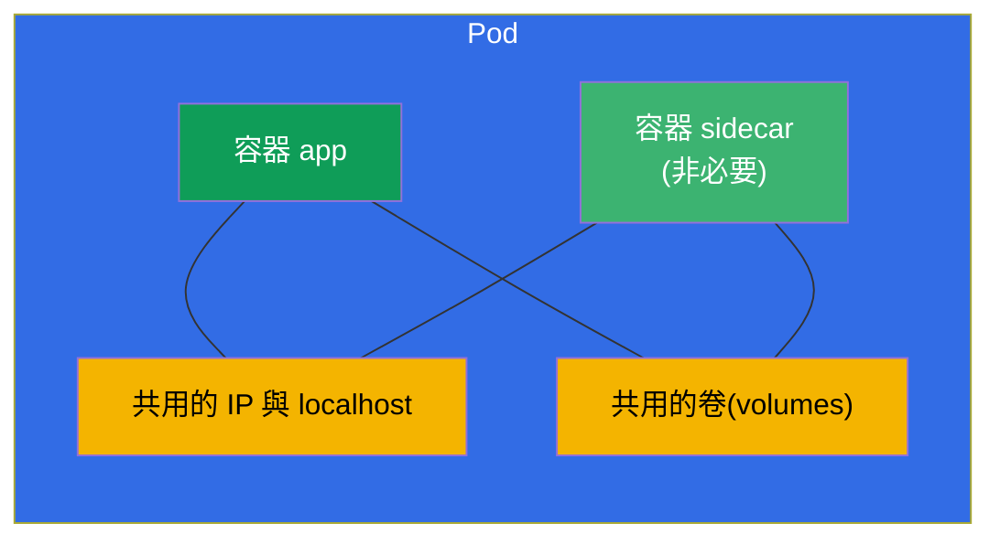
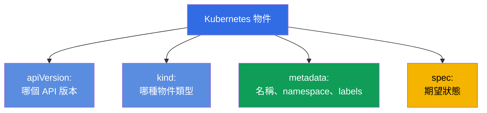
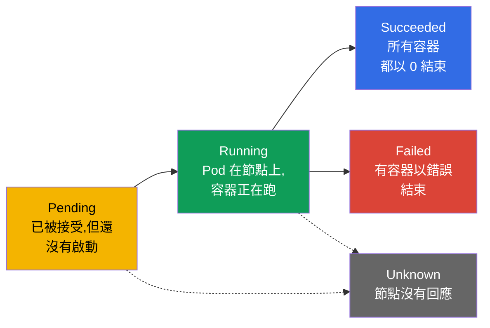
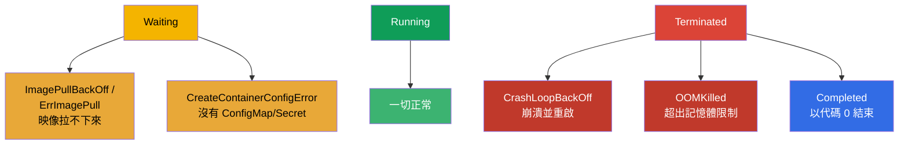
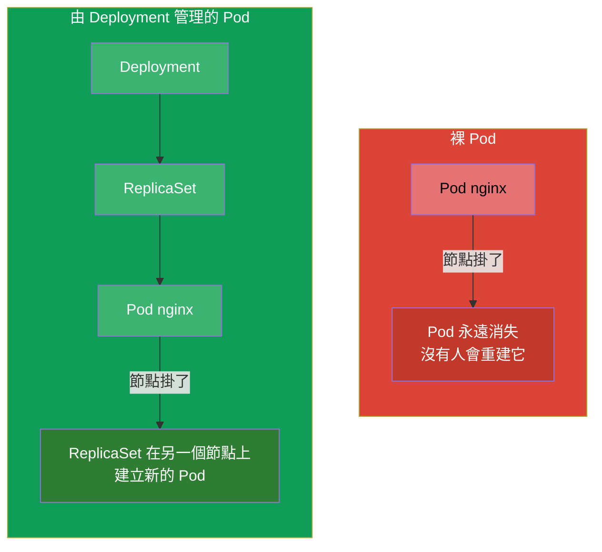

[Русская версия](ru.md) · [Eng version](README.md) · [Versión en español](es.md) · [Version française](fr.md) · [Deutsche Version](de.md) · [ქართული ვერსია](ge.md) · [日本語版](jp.md)

# 第 4 章。Pod:生命週期、建立與設定

> **接下來是什麼。** Pod 是 Kubernetes 中最基本的執行單位,也是你在兩場考試的
> 每一道題目中親手建立的第一個物件。其他一切
> (Deployment、StatefulSet、Job)最終都會產生 Pod。在這一章我們會
> 拆解什麼是 Pod、它由什麼組成、它如何走過自己的生命週期,以及如何
> 建立與設定它。這是工作負載(第 5-16 章)與
> 除錯(第 44 章)的地基 - 因為在叢集裡最常需要修的,正好就是 Pod。

## 4.1. 什麼是 Pod,以及為什麼它不是「容器」

Pod 是 **包裹一個或多個容器的外殼**,這些容器總是
一起啟動、位於同一個節點上,並且彼此共用網路與儲存。Kubernetes
永遠不會直接管理容器 - 排程與執行的最小單位
正是 Pod。



同一個 Pod 內的容器共用哪些東西:

- **網路。** Pod 對所有容器只有一個 IP 位址。內部的容器透過
  `localhost` 看到彼此,而且不能佔用同一個埠。
- **儲存。** 卷(volumes)在 Pod 層級宣告,並且可以同時掛載到
  多個容器 - 它們就是這樣交換檔案的。
- **生命週期與節點。** Pod 的容器永遠在同一個節點上,並且一起被排程。

容器 **各自獨立** 的部分:檔案系統(各自有自己的,除了
掛載進來的共用卷)以及行程。

> **共用 IP 是從哪裡來的(pause 容器)。** Pod 的共用網路位址並不是直接
> 「發給」應用程式容器的 - 它由一個隱藏的服務容器 **pause**
> (也有人稱它為 infra 容器)持有。當 kubelet 建立 Pod 時,它會 **先** 啟動
> 一個極小的 pause 容器:那個容器取得 Pod 的 IP,並持有網路 namespace(以及
> IPC)。應用程式容器隨後就在 pause 的這些 namespace **內部** 啟動 -
> 因此它們全部只有一個 IP、共用的 `localhost` 與同一個埠範圍。一個重要的結果:
> pause 幾乎什麼都不做(只是「睡著」),但它活在 Pod 的整個生命期間,所以
> 應用程式容器的重啟或崩潰 **不會改變 Pod 的 IP** - namespace 仍然留在
> pause 手上。
>
> 你可以直接在節點上透過 `crictl`(CRI 工具,第 2 章)看到這一點:
>
> ```bash
> crictl ps            # Pod 的工作容器
> crictl pods          # Pod 本身(sandbox)- 這些就是 pause 容器
> ```
>
> 每個 Pod 都對應一個 pod sandbox(pause);在 `crictl ps` 的輸出中你看到的是
> 應用程式容器,而帶著網路的「沙箱」則由 pause 在幕後持有。

> **關鍵規則。** 通常一個 Pod 裡只有 **一個** 應用程式容器。只有當多個
> 容器真的密不可分,並且必須共用網路/卷時,才會把它們放進同一個 Pod
> (sidecar、adapter、ambassador 模式 - 第 22 章)。不要把
> 不相關的應用程式硬塞進一個 Pod - 那應該用各自獨立的 Pod。

## 4.2. Pod manifest 的解剖

任何 Kubernetes 物件在 YAML 中都有四個頂層欄位。以 Pod 為例:

```yaml
apiVersion: v1          # API 版本(Pod 為 v1)
kind: Pod               # 物件類型
metadata:               # 中介資料:名稱、namespace、標籤
  name: nginx
  labels:
    app: web
spec:                   # 期望狀態:裡面有什麼
  containers:
  - name: nginx         # 容器名稱
    image: nginx:1.27   # 映像
    ports:
    - containerPort: 80 # 應用程式監聽的埠
```



這四個欄位 - `apiVersion`、`kind`、`metadata`、`spec` - 幾乎每個
物件都有。把它們記下來:課程接下來變的只有 `spec` 的內容,而骨架
永遠都是同一個。

## 4.3. 建立 Pod:命令式與透過 manifest

取得 Pod 的三種方式 - 從最快到最靈活:

```bash
# 1. 快速 — 一條命令
kubectl run nginx --image=nginx

# 2. 帶參數
kubectl run web --image=nginx:1.27 --port=80 \
  --env="COLOR=blue" --labels="app=web,tier=front"

# 3. 透過 manifest(混合式:產生 → 修改 → 套用)
kubectl run nginx --image=nginx --dry-run=client -o yaml > pod.yaml
vim pod.yaml
kubectl apply -f pod.yaml
```

`kubectl run` 的實用旗標:

```bash
# 一次性的互動式 Pod,離開時就刪除 — 測試時很方便
kubectl run tmp --image=busybox -it --rm --restart=Never -- sh

# 指定容器的命令
kubectl run busy --image=busybox --command -- sleep 3600
```

## 4.4. Pod 的生命週期:階段(phase)

Pod 有一個 `status.phase` 欄位 - 它生命中的粗略階段。總共只有五個階段。



| 階段 | 代表什麼 |
|------|-----------|
| **Pending** | Pod 已被叢集接受,但還沒啟動:正在等待節點指派、映像下載或空閒資源 |
| **Running** | Pod 已綁定到節點,至少有一個容器正在執行或啟動中 |
| **Succeeded** | 所有容器都成功結束(代碼 0)且不會被重啟 |
| **Failed** | 所有容器都已結束,其中至少一個 - 以錯誤結束 |
| **Unknown** | 無法取得 Pod 的狀態(通常是節點失去連線) |

階段是粗略的畫面。更精確的資訊來自 **容器的狀態** 與原因,
它們可以在 `kubectl describe pod` 以及 `kubectl get pods` 的 STATUS 欄看到。

## 4.5. 容器狀態與常見的 STATUS

在 Pod 內部每個容器都有自己的狀態:`Waiting`、`Running`、`Terminated`。
當容器處於 `Waiting` 或崩潰時,它會有一個 **reason** - 也就是原因,而它正好
會顯示在 STATUS 欄。這些原因必須能一眼認出 - CKA/CKAD 上有一半的除錯
都跟它們有關。



| STATUS | 代表什麼 | 該看哪裡 |
|--------|-----------|---------------|
| `ContainerCreating` | 容器正在建立(拉映像、掛載卷) | 時間短就正常;否則用 `describe` |
| `ImagePullBackOff` / `ErrImagePull` | 無法下載映像(打錯字、沒有 registry 存取權) | 映像名稱、registry 的 secret |
| `CrashLoopBackOff` | 容器啟動後立刻崩潰,K8s 帶延遲重啟它 | `logs --previous`、命令/設定 |
| `OOMKilled` | 容器因超出記憶體限制被殺掉 | 記憶體限制(第 14 章) |
| `CreateContainerConfigError` | 找不到 Pod 引用的 ConfigMap/Secret | cm/secret 是否存在 |
| `Completed` | 容器做完事並以代碼 0 結束 | 對 Job/一次性任務來說正常 |
| `Pending` | Pod 無法被排程 | 資源、taints、nodeSelector、PVC |

正因如此,「`kubectl get pods` → 看到奇怪的 STATUS → `kubectl describe`
+ `kubectl logs`」這一串就是除錯的主要反射動作。完整的 Pod troubleshooting 會在
第 44 章拆解。

## 4.6. restartPolicy:容器何時會被重啟

`spec.restartPolicy` 欄位控制的是,Pod 的容器結束之後要不要
重啟。它有三個值:

| 值 | 行為 | 用在哪裡 |
|----------|-----------|----------|
| `Always`(預設) | 永遠重啟 | 長時間執行的服務(網頁、資料庫) |
| `OnFailure` | 只在出錯時重啟(代碼 ≠ 0) | 必須做完到最後的任務(Job) |
| `Never` | 不重啟 | 不需要重啟的一次性任務 |

重要:`restartPolicy` 關係到的是 **同一個節點上 Pod 內部容器的重啟**,
而不是重新建立 Pod 本身。一個帶 `Never` 的裸 Pod 崩潰之後,就會一直
保持崩潰狀態 - 沒有人會重建它。重建 Pod 是控制器的工作
(ReplicaSet/Deployment - 第 5 章),所以在生產環境中 Pod 幾乎都不是
直接建立,而是透過它們建立。

## 4.7. 裸 Pod 與由控制器管理的 Pod

這是一個重要的差別。Pod 可以被建立成「裸的」(直接建立),也可以交給
控制器管理。



- **裸 Pod** 沒有人會恢復它。節點掛了 - Pod 就沒了。這種 Pod 適合
  一次性任務、除錯與實驗。
- **由控制器管理的 Pod**(Deployment → ReplicaSet)在故障時會自動
  重建、可以擴縮、可以更新。生產環境裡的一切都是這樣執行的。

考試中經常要求直接建立裸 Pod(快速,`kubectl run`),但你需要
理解,現實中服務不是這樣執行的。

## 4.8. Pod spec 的實用欄位

有幾個重要欄位是你會經常加進 Pod manifest 的(每一個的
細節都在各自的章節):

```yaml
spec:
  containers:
  - name: app
    image: nginx:1.27
    command: ["nginx"]              # 覆寫映像的 ENTRYPOINT
    args: ["-g", "daemon off;"]     # 參數(第 17 章)
    env:                            # 環境變數(第 17 章)
    - name: COLOR
      value: blue
    resources:                      # requests 與 limits(第 14 章)
      requests: {cpu: "100m", memory: "64Mi"}
      limits: {cpu: "250m", memory: "128Mi"}
    ports:
    - containerPort: 80
  nodeSelector:                     # 要放到哪些節點上(第 12 章)
    disktype: ssd
  restartPolicy: Always
```

不需要一次記住全部 - 重要的是理解,所有功能(探針、卷、
資源、排程)都是透過 Pod `spec` 內部的欄位加上去的,而且可以用
`kubectl explain pod.spec...` 找到它們。

## 4.9. 除錯與存取 Pod

處理已經在執行的 Pod 的基本工具組:

```bash
kubectl get pod nginx -o wide           # 在哪裡執行、IP 是什麼
kubectl describe pod nginx              # 事件、容器狀態
kubectl logs nginx                      # 日誌
kubectl logs nginx --previous           # 前一個(崩潰的)容器的日誌
kubectl exec -it nginx -- sh            # 進到裡面去
kubectl port-forward pod/nginx 8080:80  # 把埠轉發到本機
```

另外值得一提的是 **ephemeral 容器** 與 `kubectl debug` - 一種在不重建 Pod 的
情況下,把臨時除錯容器接到已在執行的 Pod 上的方法。當應用程式的映像
極簡(連 `sh` 都沒有)時特別有用。細節 - 在第 29 章。

## 4.10. 這在生產環境中如何應用

- **生產環境幾乎不用裸 Pod。** 所有需要長期存活並撐過
  故障的東西,都透過控制器執行(Deployment、StatefulSet、DaemonSet)。裸 Pod
  是除錯、一次性任務或教學範例。如果你在生產環境看到裸 Pod -
  那幾乎總是錯誤或臨時的「權宜之計」。
- **一個 Pod 一個應用程式容器是常態。** Multi-container Pod 要有意識地
  使用,並且針對特定模式(sidecar 負責日誌/代理,init 負責準備工作)。
  把好幾個應用程式塞進一個 Pod 是反模式。
- **Pod 的 STATUS 是監控的基礎。** 生產環境的告警常常正好綁在
  Pod 的狀態上:大量 `CrashLoopBackOff`、發版後的 `ImagePullBackOff`、
  限制設錯時的 `OOMKilled` - 這些都是事故的第一個訊號。
- **極簡映像。** 生產環境追求小映像(distroless、alpine、
  scratch)- 攻擊面更小、體積更輕。反面是:裡面沒有 `sh`,所以
  除錯要透過帶 ephemeral 容器的 `kubectl debug` 來做。

## 4.11. 迷你詞彙表

- **Pod** - 最小的執行單位:包裹一個/多個容器的外殼,共用網路
  與卷。
- **應用程式容器** - Pod 中承載有效負載的主要容器。
- **Sidecar** - 同一個 Pod 中的輔助容器(第 22 章)。
- **階段(phase)** - Pod 生命的粗略階段:Pending、Running、Succeeded、Failed、
  Unknown。
- **restartPolicy** - 容器的重啟策略:Always、OnFailure、Never。
- **裸 Pod(bare pod)** - 直接建立、沒有控制器的 Pod;不會被
  恢復。
- **CrashLoopBackOff** - 容器循環地崩潰並重啟。
- **OOMKilled** - 容器因超出記憶體限制被殺掉。
- **ephemeral 容器** - 用來除錯活著的 Pod 的臨時容器(`kubectl
  debug`)。

## 4.12. 本章總結

- Pod 是最小的執行單位:一個或多個容器共用 IP、
  `localhost` 與卷,永遠在同一個節點上。
- 通常一個 Pod 裡只有一個應用程式容器;多個 - 只用在相關的模式上。
- 任何物件的 manifest = `apiVersion` + `kind` + `metadata` + `spec`;變的
  主要是 `spec`。
- Pod 可以用命令式建立(`kubectl run`),但複雜的 - 要產生 YAML 再
  修改。
- Pod 的階段:Pending → Running → Succeeded/Failed(+ Unknown)。精確的原因來自
  容器狀態與 STATUS。
- 常見的 STATUS:ImagePullBackOff、CrashLoopBackOff、OOMKilled、CreateContainerConfigError、
  Pending - 要背得滾瓜爛熟。
- `restartPolicy`(Always/OnFailure/Never)控制容器的重啟,但不是
  Pod 的重建 - 那是控制器的工作。
- 裸 Pod 在故障時不會被恢復;生產環境的 Pod 都透過控制器執行。

## 4.13. 這些知識用在哪裡:考試與實際工作

**在考試中。** 建立 Pod 是兩場考試中最常見的基本操作
(`kubectl run ... $do > pod.yaml`)。辨認 STATUS(Pending、CrashLoopBackOff、
ImagePullBackOff)是 CKA troubleshooting 領域(30%)與 CKAD Observability 章節的
核心。懂得階段、`restartPolicy` 以及 describe/logs 這一串,就能解決一整類
「為什麼 Pod 不工作」的題目。

**在實際工作中。** Pod 是叢集裡一切事物的原子,而它的 STATUS 是
應用程式健康狀況的第一個指標。值班工程師從 Pod 的狀態就能立刻
明白發版之後發生了什麼。理解「裸 Pod 與控制器」的差別,
就能解釋為什麼生產環境不會用裸 Pod 執行任何東西,以及為什麼節點掛掉後
應用程式會自己「復活」。

## 4.14. 自我檢查問題

1. Pod 與容器有什麼不同?Pod 內部的容器共用什麼,不共用什麼?
2. 什麼時候把多個容器放進一個 Pod 是合理的,什麼時候不是?
3. 說出 manifest 的四個必要頂層欄位。其中哪一個描述
   「裡面有什麼」?
4. 列出 Pod 的階段。階段與 `kubectl get pods` 中的 STATUS 有什麼不同?
5. ImagePullBackOff、CrashLoopBackOff 與 OOMKilled 代表什麼,遇到每一種時
   該看哪裡?
6. 帶 `restartPolicy: Never` 的 Pod 在容器崩潰時會怎麼表現?如果它是
   裸 Pod 而節點掛了呢?
7. 為什麼生產環境不用裸 Pod 執行服務?

## 實務練習

接下來我們要學的不是一個一個建立 Pod,而是透過 ReplicaSet 與 Deployment 管理
一整群 Pod(第 5 章)。建立 Pod、分析它們的階段與 STATUS,你會
在第一個綜合實驗中連同 deployment 與 namespace 一起操練。

🧪 實驗 101(Pod 與它們的設定):[tasks/cka/labs/101](../../labs/101/README_TW.MD)

🎮 Killercoda（在瀏覽器中，無需安裝）：[Create a simple nginx pod](https://killercoda.com/chadmcrowell/course/ckad/nginx-pod) · [Run busybox with sleep](https://killercoda.com/chadmcrowell/course/ckad/busybox-sleep) · [Pod Restart Policy](https://killercoda.com/chadmcrowell/course/cka/restart-policy) · [Add a preStop hook](https://killercoda.com/chadmcrowell/course/ckad/prestop-hook)

---
[目錄](../README_TW.md) · [第 3 章](../03/tw.md) · [第 5 章](../05/tw.md)
