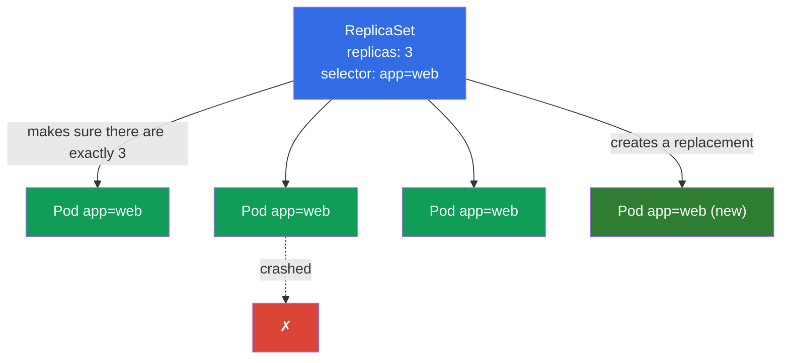
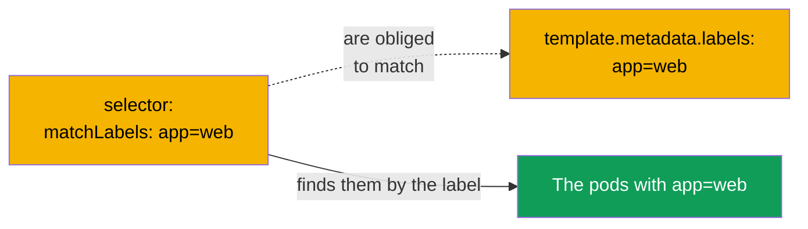
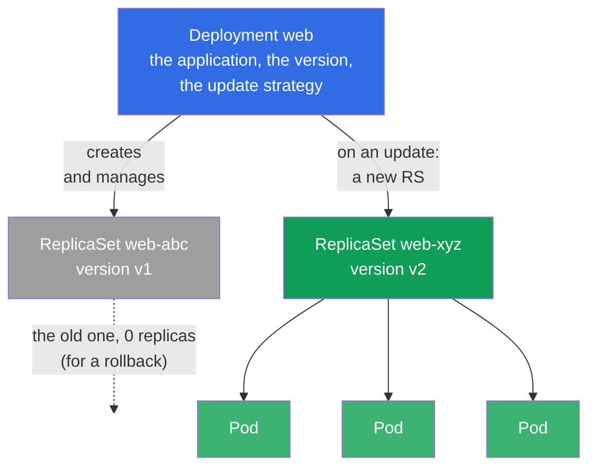
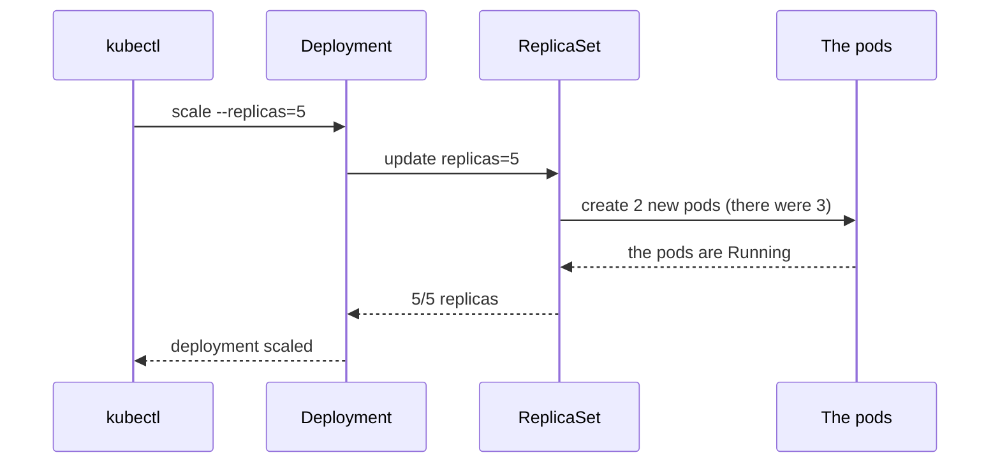
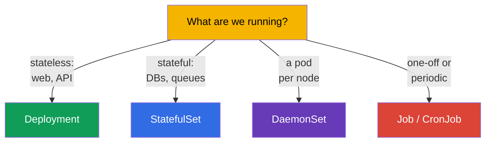

[Русская версия](ru.md) · [Versión en español](es.md) · [Version française](fr.md) · [Deutsche Version](de.md) · [ქართული ვერსია](ge.md) · [繁體中文版](tw.md) · [日本語版](jp.md)

# Chapter 5. ReplicaSet and Deployment

> **What comes next.** In the previous chapter we created pods directly and found out that
> a bare pod is not restored by anyone. Nothing is run that way in production. Reliability,
> the required number of copies and the updates are the job of the controllers: a
> **ReplicaSet** keeps a given number of pods, while a **Deployment** manages ReplicaSets
> and adds updates and rollbacks. The Deployment is the most used object in Kubernetes and
> a mandatory topic of both exams. In this chapter we will go through how they are built and
> how they are connected; the updates themselves (rolling update, rollback) will come in
> detail in chapter 8.

## 5.1. What a ReplicaSet is for

Imagine that you need not one pod but five identical copies of an application - for the
load and for fault tolerance. Creating five bare pods by hand is bad: if one of them
crashes, nobody will raise a replacement. What is needed is a "watchman" that constantly
makes sure there are exactly as many copies as have been ordered. That is exactly what a
**ReplicaSet** is.

A ReplicaSet is a controller (the reconciliation loop from chapter 1) with a single task: to
keep a given number of pods that match its selector. A pod crashed - it will create a new
one. There turned out to be more pods than needed (for example, you manually started an
extra one with the same label) - it will delete the extra one.



## 5.2. How a ReplicaSet finds its pods: selector and labels

The key mechanism is **labels and selectors**. A ReplicaSet does not "own" pods by name, it
finds them by their labels through the `selector`. All the pods whose labels match the
selector are considered to belong to this ReplicaSet.

```yaml
apiVersion: apps/v1
kind: ReplicaSet
metadata:
  name: web
spec:
  replicas: 3                 # how many pods to keep
  selector:                   # which pods to consider "its own"
    matchLabels:
      app: web
  template:                   # the template the pods are created from
    metadata:
      labels:
        app: web              # MUST match the selector!
    spec:
      containers:
      - name: nginx
        image: nginx:1.27
```



> **A frequent mistake.** If `selector.matchLabels` does not match
> `template.metadata.labels`, the cluster will reject the object (or the controller will not
> be able to "recognize" its own pods). The labels in the selector and in the pod template
> have to be consistent.

There is a historical predecessor - the **ReplicationController**. It is an outdated object
with the same idea but without expressive selectors. In new clusters people use a
ReplicaSet, while a ReplicationController is met only in legacy. For the exam it is enough
to know that the ReplicaSet is the modern replacement.

## 5.3. Why you almost never create a ReplicaSet directly

A ReplicaSet keeps the number of pods perfectly well, but it cannot **update** an
application. If a new version of the image has to be rolled out, a ReplicaSet will not do a
smooth replacement of the pods by itself. That task is solved by a **Deployment** - a
controller one level higher, which manages ReplicaSets.

That is why in practice people almost always create a Deployment, and it makes the
ReplicaSet itself. Creating a ReplicaSet directly is worth knowing in order to understand
the mechanics, but in life you work with a Deployment.

## 5.4. Deployment: a controller over the ReplicaSet

A **Deployment** is the main way to run stateless applications in Kubernetes. It gives
everything the ReplicaSet was lacking:

- keeping up the number of replicas (through the managed ReplicaSet);
- a smooth update of the version (rolling update) without downtime;
- a rollback to the previous version;
- a history of revisions;
- a pause/resume of the rollout.

The hierarchy is three-level - this has to be pictured clearly:



**Deployment → ReplicaSet → Pod.** You describe a Deployment; it creates a ReplicaSet; that
one creates the pods. On an update the Deployment creates a **new** ReplicaSet with the new
version and smoothly moves the pods from the old one to the new one, while the old one it
leaves with zero replicas - for a possible rollback.

## 5.5. The Deployment manifest

The manifest is almost like the one of a ReplicaSet - the update strategy is added:

```yaml
apiVersion: apps/v1
kind: Deployment
metadata:
  name: web
  labels:
    app: web
spec:
  replicas: 3
  selector:
    matchLabels:
      app: web
  strategy:                 # an optional field; if not specified — the default below is taken
    type: RollingUpdate     # the default value (the alternative — Recreate)
    rollingUpdate:
      maxSurge: 25%         # 25% by default: how many pods can be raised above replicas
      maxUnavailable: 25%   # 25% by default: how many pods can be temporarily put out
  template:
    metadata:
      labels:
        app: web
    spec:
      containers:
      - name: nginx
        image: nginx:1.27
        ports:
        - containerPort: 80
```

> **About `strategy`.** The field is **optional**. If it is not specified at all, Kubernetes
> substitutes the default strategy - `RollingUpdate` with `maxSurge: 25%` and
> `maxUnavailable: 25%` (that is, the update goes as a wave: a part of the pods is raised
> above the norm, a part is temporarily put out, there is no downtime). The alternative is
> `type: Recreate`: the old pods are first deleted completely, then the new ones are created
> (with a short downtime; it is needed when two versions cannot work at the same time). In
> detail about the strategies and the rolling update - in chapter 8. In the block above
> `strategy` is shown explicitly only for clarity - in real manifests it is more often
> omitted and people rely on the default.

A Deployment can be created imperatively, and a complex one - generated and finished off:

```bash
# Fast
kubectl create deployment web --image=nginx:1.27 --replicas=3

# A hybrid: the skeleton into a file, finish it off, apply
kubectl create deployment web --image=nginx:1.27 --replicas=3 \
  --dry-run=client -o yaml > deploy.yaml
vim deploy.yaml
kubectl apply -f deploy.yaml
```

## 5.6. The basic operations with a Deployment

```bash
# Look
kubectl get deploy                       # READY, UP-TO-DATE, AVAILABLE
kubectl get rs                           # which ReplicaSets there are
kubectl get pods --show-labels           # the pods and their labels
kubectl describe deploy web              # the events, the strategy, the revisions

# Scaling
kubectl scale deployment web --replicas=5

# Change the image (starts a rolling update — chapter 8)
kubectl set image deployment/web nginx=nginx:1.28

# Edit on the fly
kubectl edit deployment web
```

Let us go through the columns of `kubectl get deploy`, they are often asked about and they
are important for debugging:

| Column | What it shows |
|---------|----------------|
| `READY` | how many pods are ready out of the desired ones (for example, `3/3`) |
| `UP-TO-DATE` | how many pods have already been updated to the current template |
| `AVAILABLE` | how many pods are available (have passed readiness) |
| `AGE` | the age of the deployment |

If `READY` is less than the desired number for a long time - something is wrong (the pods do
not start, do not pass the probes, there are not enough resources) - we go to `describe` and
`logs`.

## 5.7. What happens on scaling

When you do `kubectl scale deployment web --replicas=5`, the Deployment changes the number
of replicas in its active ReplicaSet, and that one brings the number of pods up to five.
Scaling down works the same way - the ReplicaSet deletes the extra pods.



Pay attention: the command goes to the Deployment, not to the pods directly. A Deployment is
the "desired state", and the whole system brings reality to it.

## 5.8. Stateless versus stateful: where the boundaries of a Deployment are

A Deployment is meant for **stateless applications** - those where the pods are
interchangeable and do not keep a unique state (web servers, APIs, handlers). They have no
permanent identity: any pod can be killed and replaced by any other one.

For applications **with a state** (databases, clusters with unique nodes), where stable
names, the order of starting and their own storage per pod matter, a **StatefulSet** is used
(chapter 11). And for "one pod on every node" (agents for logs, monitoring, CNI) - a
**DaemonSet** (chapter 11 as well).



Choosing the right controller for the task is a typical CKAD question (the Application
Design domain) and a useful skill in life.

## 5.9. A practical case: self-healing and scaling live

Let us put the concepts of the chapter together in one short scenario - it is worth running
it by hand in order to see the chain Deployment → ReplicaSet → Pod in action.

**1. We create a Deployment and look at the hierarchy.**

```bash
kubectl create deployment web --image=nginx:1.27 --replicas=3
kubectl get deploy,rs,pods --show-labels
```

You will see one Deployment `web`, one ReplicaSet `web-<hash>` and three pods
`web-<hash>-<rnd>`. Pay attention: the name of the pods starts with the name of the
ReplicaSet, not of the Deployment - the pods are created exactly by the RS.

**2. Self-healing: we kill a pod.**

```bash
# take the name of the first pod of the deployment and delete it
POD=$(kubectl get pod -l app=web -o jsonpath='{.items[0].metadata.name}')
kubectl delete pod "$POD"
kubectl get pods -w
```

Delete one pod and watch with `-w`: the ReplicaSet almost instantly creates a new one in
order to bring the number back to 3. This is the reconciliation loop from chapter 1 live -
you stated "I want 3", and the system keeps that state by itself.

**3. Scaling.**

```bash
kubectl scale deployment web --replicas=5
kubectl get rs                     # DESIRED/CURRENT/READY will become 5
```

The command goes to the Deployment, that one changes `replicas` of its ReplicaSet, and the
RS adds pods. We do not interfere with the pods or the RS directly.

**4. A version update: a new ReplicaSet appears.**

```bash
kubectl set image deployment/web nginx=nginx:1.28
kubectl get rs                     # now there are TWO RS: the old one with 0 replicas, the new one with 5
kubectl rollout status deployment/web
```

The Deployment created a **new** ReplicaSet for version `1.28` and smoothly moved the pods
over to it, while the old RS it left with zero replicas - it is exactly the one that is kept
for a rollback:

```bash
kubectl rollout undo deployment/web   # go back to the previous version (the details — chapter 8)
```

**5. We clean up after ourselves.**

```bash
kubectl delete deployment web         # will delete its ReplicaSet and the pods too (cascading)
```

Deleting a Deployment cascadingly removes the subordinate RS and pods - this is the work of
the **ownerReferences** (the owner → the subordinates), on which the whole hierarchy rests.

## 5.10. How this is applied in production

- **A Deployment is the standard for stateless services.** 90% of the applications in
  production (web, APIs, backends) are run exactly through a Deployment. It gives what is
  needed in operation: scaling, smooth updates, rollbacks.
- **The number of replicas and availability.** In production there are always several
  replicas (at least 2-3), in order to survive the crash of a pod/node and to be updated
  without downtime. One replica in production is a single point of failure.
- **People do not touch a ReplicaSet by hand.** Only the Deployment is managed; ReplicaSets
  are an internal detail. Manual interference in a ReplicaSet breaks the logic of the
  Deployment.
- **Labels as the foundation of everything.** Not only the ReplicaSet rests on the labels of
  the pods, but also the Service (chapter 7), the NetworkPolicy (chapter 34), the monitoring.
  A well thought out scheme of labels (`app`, `version`, `tier`, `env`) is a sign of mature
  operation.
- **Autoscaling.** The number of replicas of a Deployment in production is often regulated
  automatically through an HPA by the load (chapter 16), and not set by hand.

## 5.11. Mini-glossary

- **ReplicaSet** - a controller that keeps up a given number of pods by a selector.
- **Deployment** - a controller over the ReplicaSet: replicas + updates + rollbacks +
  history.
- **replicas** - the desired number of pods.
- **selector** - how the controller finds "its own" pods (by the labels).
- **template** - the pod template the replicas are created from.
- **Labels** - key-value pairs on the objects, the selectors work by them.
- **Stateless** - an application without a unique state; the pods are interchangeable.
- **Stateful** - an application with a state; identity and its own storage are needed.
- **ReplicationController** - the outdated predecessor of the ReplicaSet.

## 5.12. Chapter summary

- A ReplicaSet keeps a given number of pods: one crashed - it will create a new one, an extra
  one - it will delete.
- It finds "its own" pods by the labels through the `selector`; `selector.matchLabels` is
  obliged to match `template.metadata.labels`.
- A ReplicaSet is almost never created directly - it is managed by a Deployment, which can do
  updates and rollbacks.
- The hierarchy: **Deployment → ReplicaSet → Pod**. On an update the Deployment creates a new
  ReplicaSet and moves the pods, the old one it leaves for a rollback.
- The columns of `get deploy`: READY, UP-TO-DATE, AVAILABLE - the health indicators.
- Scaling goes through the Deployment (`scale`), and it brings up the number of pods in the
  ReplicaSet.
- A Deployment is for stateless; for stateful there is the StatefulSet, for "a pod per node" -
  the DaemonSet, for tasks - Job/CronJob.

## 5.13. How this helps: on the exam and in real work

**On the exam.** Creating and scaling a Deployment is a basic operation of both exams
(`kubectl create deployment`, `scale`, `set image`). Understanding the chain
Deployment→ReplicaSet→Pod is needed for debugging (why the pods of a deployment do not start)
and for the updates (chapter 8). Choosing the right controller for the task is a typical
question of the CKAD domain Application Design.

**In real work.** A Deployment is the workhorse of operation: almost all stateless services
are rolled out and scaled through it. Understanding labels/selectors is critical, because the
Service, the NetworkPolicy and the monitoring are tied to them. And the ability to tell
stateless from stateful determines with which controller to run the application at all.

## 5.14. Self-check questions

1. Which single task does a ReplicaSet solve and how does it find its pods?
2. Why do the `selector` and the labels in the `template` have to match?
3. What can a ReplicaSet not do, because of which a Deployment is used in reality?
4. Describe the hierarchy Deployment → ReplicaSet → Pod. What happens to the ReplicaSet on an
   update?
5. What do the columns READY, UP-TO-DATE, AVAILABLE of `kubectl get deploy` show?
6. Through which object does the scaling go and why not directly to the pods?
7. Which applications is a Deployment suitable for, and when is a StatefulSet or a DaemonSet
   needed?

## Practice

We can keep the required number of pods. In chapter 6 we will go through namespaces, labels
and selectors more deeply, in chapter 7 - how to give network access to the pods through a
Service, and in chapter 8 - the updates and rollbacks of a Deployment. The first combined lab
will tie together pods, Deployments, namespaces and Services.

🧪 Lab 101 (ReplicaSet, Deployment, Service): [tasks/cka/labs/101](../../labs/101/README.MD)

🎮 Killercoda (in a browser, no setup): [Create a deployment for nginx](https://killercoda.com/chadmcrowell/course/ckad/nginx-deployment) · [Scale a deployment](https://killercoda.com/chadmcrowell/course/ckad/scale-deployment) · [Create and Scale Apache Deployment](https://killercoda.com/chadmcrowell/course/cka/create-apache-deployment)

---
[Contents](../README.md) · [Chapter 4](../04/README.md) · [Chapter 6](../06/README.md)
